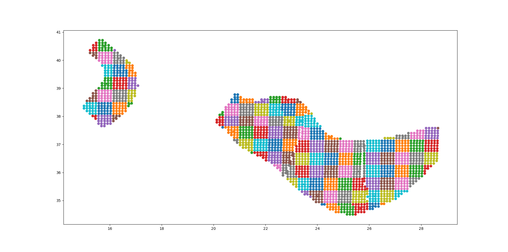

Classical PSHA
====================

Running large hazard calculations, especially ones with large logic
trees, is an art, and there are various techniques that can be used to
reduce an impossible calculation to a feasible one.

Reducing a calculation
-------------------------------------------

The first thing to do when you have a large calculation is to reduce it
so that it can run in a reasonable amount of time. For instance you
could reduce the number of sites, by considering a small
geographic portion of the region interested, of by increasing the grid
spacing. Once the calculation has been reduced, you can run
it and determine what are the factors dominating the run time.

As we discussed in section about common mistakes, you may want to tweak
the quadratic parameters (``maximum_distance``,
``area_source_discretization``, ``rupture_mesh_spacing``,
``complex_fault_mesh_spacing``). Also, you may want to choose different
GMPEs, since some are faster than others. You may want to play with
the logic tree, to reduce the number of realizations: this is
especially important, in particular for event based calculation were
the number of generated ground motion fields is linear with the number
of realizations.

Once you have tuned the reduced computation, you can have an idea of the time
required for the full calculation. It will be less than linear with the number
of sites, so if you reduced your sites by a factor of 100, the
full computation will take a lot less than 100 times the time of the reduced
calculation (fortunately). Still, the full calculation can be impossible because
of the memory/data transfer requirements, especially in the case of event based
calculations. Sometimes it is necessary to reduce your expectations. The
examples below will discuss a few concrete cases. But first of all, we
must stress an important point::

 Our experience tells us that THE PERFORMANCE BOTTLENECKS OF THE
 REDUCED CALCULATION ARE TOTALLY DIFFERENT FROM THE BOTTLENECKS OF
 THE FULL CALCULATION. Do not trust your performance intuition.

Classical PSHA for Europe (SHARE)
--------------------------------------------

Suppose you want to run a classical PSHA calculation for the latest
model for Europe and that it turns out to be too slow to run on your
infrastructure. Let's say it takes 4 days to run. How do you proceed
to reduce the computation time?

The first thing that comes to mind is to tune the
``area_source_discretization`` parameter, since the calculation (as
most calculations) is dominated by area sources. For instance, by
doubling it (say from 10 km to 20 km) we would expect to reduce the
calculation time from 4 days to just 1 day, a definite improvement.

But how do we check if the results are still acceptable? Also, how we
check that in less than 4+1=5 days? As we said before we have to reduce
the calculation and the engine provides several ways to do that.

If you want to reduce the number of sites, IMTs and realizations you can:

- manually change the ``sites.csv`` or ``site_model.csv`` files
- manually change the ``region_grid_spacing``
- manually change the ``intensity_measure_types_and_levels`` variable
- manually change the GMPE logic tree file by commenting out branches
- manually change the source logic tree file by commenting out branches
- use the environment variable ``OQ_SAMPLE_SITES``
- use the environment variable ``OQ_REDUCE``

Starting from engine 3.11 the simplest approach is to use the ``OQ_REDUCE``
environment variable than not only reduce reduces the number of sites,
but also reduces the number of intensity measure types (it takes the
first one only) and the number of realizations to just 1 (it sets
``number_of_logic_tree_samples=1``) and if you are in an event based
calculation reduces the parameter ``ses_per_logic_tree_path`` too.
For instance the command::

  $ OQ_REDUCE=.01 oq engine --run job.ini

will reduce the number of sites by 100 times by random sampling, as well
a reducing to 1 the number of IMTs and realizations. As a result the
calculation will be very fast (say 1 hour instead of 4 days) and it
will possible to re-run it multiple times with different parameters.
For instance, you can test the impact of the area source discretization
parameter by running::
  
  $ OQ_REDUCE=.01 oq engine --run job.ini --param area_source_discretization=20

Then the engine provides a command `oq compare` to compare calculations;
for instance::

  $ oq compare hmaps PGA -2 -1 --atol .01

will compare the hazard maps for PGA for the original
(ID=-2, area_source_discretization=10 km) and the new calculation
(ID=-2, area_source_discretization=20 km) on all sites, printing out
the sites where the hazard values are different more than .01 g
(``--atol`` means absolute tolerence). You can use ``oq compare --help``
to see what other options are available.

If the call to ``oq compare`` gives a result::
  
  There are no differences within the tolerances atol=0.01, rtol=0%, sids=[...]

it means that within the specified tolerance the hazard is the same
on all the sites, so you can safely use the area discretization of 20
km. Of course, the complete calculation will contain 100 times more
sites, so it could be that in the complete calculation some sites
will have different hazard. But that's life. If you want absolute
certitude you will need to run the full calculation and to wait.
Still, the reduced calculation is useful, because if you see that
are already big differences there, you can immediately assess that
doubling the ``area_source_discretization`` parameter is a no go and
you can try other strategies, like for instance doubling the
``width_of_mfd_bin`` parameter.

As of version 3.11, the ``oq compare hmaps`` command will give an output like
the following, in case of differences::

   site_id calc_id 0.5     0.1     0.05    0.02    0.01    0.005
   ======= ======= ======= ======= ======= ======= ======= =======
   767     -2      0.10593 0.28307 0.37808 0.51918 0.63259 0.76299
   767     -1      0.10390 0.27636 0.36955 0.50503 0.61676 0.74079
   ======= ======= ======= ======= ======= ======= ======= =======
   ===== =========
   poe   rms-diff
   ===== =========
   0.5   1.871E-04
   0.1   4.253E-04
   0.05  5.307E-04
   0.02  7.410E-04
   0.01  8.856E-04
   0.005 0.00106  
   ===== =========

This is an example with 6 hazard maps, for poe = .5, .1, .05, .02, .01
and .005 respectively. Here the only site that shows some discrepancy
if the site number 767. If that site is in Greenland where nobody lives
one can decide that the approximation is good anyway ;-)
The engine also report the RMS-differences by considering all the sites,
i.e.

   rms-diff = sqrt<(hmap1 - hmap2)^2>  # mediating on all the sites

As to be expected, the differences are larger for maps with a smaller poe,
i.e. a larger return period. But even in the worst case the RMS difference
is only of 1E-3 g, which is not much. The complete calculation will have
more sites, so the RMS difference will likely be even smaller.
If you can check the few outlier sites and convince yourself that
they are not important, you have succeeded in doubling the speed
on your computation. And then you can start to work on the other
quadratic and linear parameter and to get an ever bigger speedup!

Collapsing the GMPE logic tree
---------------------------------------

Some hazard models have GMPE logic trees which are insanely large. For instance
the GMPE logic tree for the latest European model (ESHM20) contains
961,875 realizations. This causes two issues:

1. it is impossible to run a calculation with full enumeration, so one must
   use sampling
2. when one tries to increase the number of samples to study the stability
   of the mean hazard curves, the calculation runs out of memory

Fortunately, it is possible to compute the *exact mean hazard curves*
by collapsing the GMPE logic tree. This is a simple as listing the
name of the branchsets in the GMPE logic tree that one wants to collapse.
For instance in the case of ESHM20 model there are the following 6
branchsets:

1. Shallow_Def (19 branches)
2. CratonModel (15 branches)
3. BCHydroSubIF (15 branches)
4. BCHydroSubIS (15 branches)
5. BCHydroSubVrancea (15 branches)
6. Volcanic (1 branch)

By setting in the job.ini the following parameters

 ::

  number_of_logic_tree_samples = 0
  collapse_gsim_logic_tree = Shallow_Def CratonModel BCHydroSubIF BCHydroSubIS BCHydroSubVrancea Volcanic

it is possible to collapse completely the GMPE logic tree, i.e. going
from 961,875 realizations to 1. Then the memory issues are solved and
one can assess the correct values of the mean hazard curves. Then
it is possible to compare with the value produce with sampling and
assess how much they can be trusted.

NB: the ``collapse_gsim_logic_tree`` feature is rather old but only
for engine versions >=3.13 it produces the exact mean curves (using
the ``AvgPoeGMPE``); otherwise it will produce a different kind of collapsing
(using the ``AvgGMPE``).

Parametric GMPEs
===================================

Most of the Ground Motion Prediction Equations (GMPEs) in hazardlib
are classes that can be instantiated without arguments. However, there
is now a growing number of exceptions. Here I will describe some of
the parametric GMPEs we have, as well as give some guidance for
authors wanting to implement a parametric GMPE.

Signature of a GMPE class
-------------------------

The more robust way to define parametric GMPEs is to use
a ``**kwargs`` signature (robust against subclassing):

.. code-block:: python

 from openquake.hazardlib.gsim.base import GMPE

 class MyGMPE(GMPE):
    def __init__(self, **kwargs):
        super().__init__(**kwargs)
        # doing some initialization here

The call to ``super().__init__`` will set a ``self.kwargs`` attribute
and perform a few checks, like raising a warning if the GMPE is experimental.
In absence of parameters ``self.kwargs`` is the empty dictionary, but in general
it is non-empty and it can be arbitrarily nested, with only one limitation:
it must be a *dictionary of literal Python
objects* so that it admits a TOML representation.

TOML is a simple format similar to the ``.ini`` format but
hierarchical (see https://github.com/toml-lang/toml#user-content-example).
It is used by lots of people in the IT world, not only in Python.
The advantage of TOML is that it is a lot more readable than JSON and XML and
simpler than YAML: moreover, it is perfect for serializing into text literal
Python objects like dictionaries and lists. The serialization feature
is essential for the engine since the GMPEs are read from the GMPE
logic tree file which is a text file, and because the GMPEs are saved
into the datastore as text, in the dataset ``full_lt/gsim_lt``.

The examples below will clarify how it works.

GMPETable
---------

Historically, the first parametric GMPE was the GMPETable, introduced many
years ago to support the Canada model. The GMPETable class has a single
parameter, called ``gmpe_table``, which is a (relative) pathname to an
.hdf5 file with a fixed format, containing a tabular representation of
the GMPE, numeric rather than analytic.

You can find an example of use of GMPETables in the test
openquake/qa_tests_data/case_18, which contains three tables in its
logic tree:

.. code-block:: xml

        <logicTreeBranch branchID="b11">
          <uncertaintyModel>
            [GMPETable]
            gmpe_table = "Wcrust_low_rhypo.hdf5"
          </uncertaintyModel>
          <uncertaintyWeight>0.16</uncertaintyWeight>
        </logicTreeBranch>
        <logicTreeBranch branchID="b12">
          <uncertaintyModel>
            [GMPETable]
            gmpe_table = "Wcrust_med_rhypo.hdf5"
          </uncertaintyModel>
          <uncertaintyWeight>0.68</uncertaintyWeight>
        </logicTreeBranch>
        <logicTreeBranch branchID="b13">
          <uncertaintyModel>
            [GMPETable]
            gmpe_table = "Wcrust_high_rhypo.hdf5"
          </uncertaintyModel>
          <uncertaintyWeight>0.16</uncertaintyWeight>
        </logicTreeBranch>

As you see, the TOML format is used inside the ``uncertaintyModel`` tag;
the text::

    [GMPETable]
    gmpe_table = "Wcrust_low_rhypo.hdf5"

is automatically translated into a dictionary
``{'GMPETable': {'gmpe_table': "Wcrust_low_rhypo.hdf5"}}`` and the ``.kwargs``
dictionary passed to the GMPE class is simply

.. code-block:: python

   {'gmpe_table': "Wcrust_low_rhypo.hdf5"}

NB: you may see around old GMPE logic files using a different syntax,
without TOML:

.. code-block:: xml

       <logicTreeBranch branchID="b11">
          <uncertaintyModel gmpe_table="Wcrust_low_rhypo.hdf5">
             GMPETable
          </uncertaintyModel>
          <uncertaintyWeight>0.16</uncertaintyWeight>
       </logicTreeBranch>
          <logicTreeBranch branchID="b12">
          <uncertaintyModel gmpe_table="Wcrust_med_rhypo.hdf5">
             GMPETable
          </uncertaintyModel>
          <uncertaintyWeight>0.68</uncertaintyWeight>
       </logicTreeBranch>
          <logicTreeBranch branchID="b13">
          <uncertaintyModel gmpe_table="Wcrust_high_rhypo.hdf5">
             GMPETable
          </uncertaintyModel>
          <uncertaintyWeight>0.16</uncertaintyWeight>
       </logicTreeBranch>

This is a legacy syntax, which is still supported and will likely be supported
forever, but we recommend to use the new TOML-based syntax, which is
more general. The old syntax has the limitation of being non-hierarchic,
making it impossible to define MultiGMPEs involving parametric GMPEs:
this is why we switched to TOML.

File-dependent GMPEs
-----------------------------------------

It is possible to define other GMPEs taking one or more filenames as parameters.
Everything will work provided you respect the following rules:

1. there is a naming convention on the file parameters, that must end with
   the suffix ``_file`` or ``_table``
2. the files must be read at GMPE initialization time
   (i.e. in the ``__init__`` method)
3. they must be read with the ``GMPE.open`` method, NOT with the
   ``open`` builtin;
4. in the gsim logic tree file you must use **relative** path names
   
The constraint on the argument names makes it possible for the engine
to collect all the files required by the GMPEs; moreover, since the path names
are relative, the `oq zip` command can work making it easy to ship runnable
calculations. The engine also stores
in the datastore a copy of all of the required input files. Without the copy,
it would not be possible from the datastore
to reconstruct the inputs, thus making it impossible to dump and restore
calculations from a server to a different machine.

The constraint about reading at initialization time makes it possible
for the engine to work on a cluster. The issue is that GMPEs are
instantiated in the controller and used in the worker nodes, which
*do not have access to the same filesystem*.
If the files are read after instantiation, you will get a file not
found error when running on a cluster.

The reason why you cannot use the standard ``open`` builtin to read the
files is that the engine must be able to read the GMPE inputs from the
datastore copies (think of the case when the ``calc_XXX.hdf5`` has been
copied to a different machine). In order to do that, there is some
magic based on the naming convention. For instance, if your GMPE must
read a text file with argument name `text_file` you should write
the following code:

.. code-block:: python

    class GMPEWithTextFile(GMPE):
        def __init__(self, **kwargs):
            super().__init__(**kwargs)
            with self.open(kwargs['text_file']) as myfile:  # good
                self.text = myfile.read().decode('utf-8')

You should NOT write the following, because it will break the
engine, for instance by making it impossible to export the
results of a calculation:

.. code-block:: python

    class GMPEWithTextFile(GMPE):
        def __init__(self, **kwargs):
            super().__init__(**kwargs)
            with open(kwargs['text_file']) as myfile:  # bad
                self.text = myfile.read()

NB: writing

.. code-block:: python

    class GMPEWithTextFile(GMPE):
        def __init__(self, text_file):
            super().__init__(text_file=text_file)
            with self.open(text_file) as myfile:  # good
                self.text = myfile.read().decode('utf-8')

would work but it is discouraged. It is best to keep the ``**kwargs``
signature so that the call to ``super().__init__(**kwargs)`` will
work out-of-the-box even if in the future subclasses of `GMPEWithTextFile`
with different parameters will appear: this is defensive programming.

MultiGMPE
-----------------

Another example of parametric GMPE is the MultiGMPE class. A MultiGMPE
is a dictionary of GMPEs, keyed by Intensity Measure Type. It is useful
in geotechnical applications and in general in any situation where you
have GMPEs depending on the IMTs. You can find an example in our test
openquake/qa_tests_data/classical/case_1:

.. code-block:: xml
   
           <logicTreeBranch branchID="b1">
              <uncertaintyModel>
                [MultiGMPE."PGA".AkkarBommer2010]
                [MultiGMPE."SA(0.1)".SadighEtAl1997]
              </uncertaintyModel>
              <uncertaintyWeight>1.0</uncertaintyWeight>
            </logicTreeBranch>

Here the engine will use the GMPE ``AkkarBommer2010`` for ``PGA`` and
``SadighEtAl1997`` for ``SA(0.1)``. The ``.kwargs`` passed to the
``MultiGMPE`` class will have the form:

.. code-block:: python

   {'PGA': {'AkkarBommer2010': {}},
    'SA(0.1)': {'SadighEtAl1997': {}}}

The beauty of the TOML format is that it is hierarchic, so if we wanted
to use parametric GMPEs in a MultiGMPE we could. Here is an example
using the GMPETable `Wcrust_low_rhypo.hdf5` for ``PGA`` and
`Wcrust_med_rhypo.hdf5` for ``SA(0.1)`` (the example has no physical
meaning, it is just an example):

.. code-block:: xml

           <logicTreeBranch branchID="b1">
              <uncertaintyModel>
                [MultiGMPE."PGA".GMPETable]
                  gmpe_table = "Wcrust_low_rhypo.hdf5"
                [MultiGMPE."SA(0.1)".GMPETable]
                  gmpe_table = "Wcrust_med_rhypo.hdf5"
              </uncertaintyModel>
              <uncertaintyWeight>1.0</uncertaintyWeight>
            </logicTreeBranch>

GenericGmpeAvgSA
----------------

In engine 3.4 we introduced a GMPE that manages a range of spectral
accelerations and acts in terms of an average spectral acceleration.
You can find an example of use in openquake/qa_tests/data/classical/case_34:

.. code-block:: xml
   
           <logicTreeBranch branchID="b1">
               <uncertaintyModel>
                  [GenericGmpeAvgSA]
                  gmpe_name = "BooreAtkinson2008"
                  avg_periods = [0.5, 1.0, 2.0]
                  corr_func = "baker_jayaram"
               </uncertaintyModel>
               <uncertaintyWeight>1.0</uncertaintyWeight>
           </logicTreeBranch>

As you see, the format is quite convenient when there are several arguments
of different types: here we have two strings (``gmpe_name`` and
``corr_func``) and a list of floats (``avg_periods``). The dictionary
passed to the underlying class will be

.. code-block:: python

   {'gmpe_name': "BooreAtkinson2008",
    'avg_periods': [0.5, 1.0, 2.0],
    'corr_func': "baker_jayaram"}

ModifiableGMPE
----------------

In engine 3.10 we introduced a ``ModifiableGMPE`` class which is able
to modify the behavior of an underlying GMPE. Here is an example of
use in the logic tree file:

.. code-block:: xml

                    <uncertaintyModel>
                        [ModifiableGMPE]
                        gmpe.AkkarEtAlRjb2014 = {}
                        set_between_epsilon.epsilon_tau = 0.5
                    </uncertaintyModel>

Here `set_between_epsilon` is simply shifting the mean with the formula
`mean -> mean + epsilon_tau * inter_event`. In the future ``ModifiableGMPE``
will likely grow more methods. If you want to understand how it works you
should look at the source code:
                    
https://github.com/gem/oq-engine/blob/master/openquake/hazardlib/gsim/mgmpe/modifiable_gmpe.py

MultiPointSources
=============================

Starting from version 2.5, the OpenQuake Engine is able to manage
MultiPointSources, i.e. collections of point sources with specific
properties. A MultiPointSource is determined by a mesh of points,
a MultiMFD magnitude-frequency-distribution and 9 other parameters:

1. tectonic region type
2. rupture mesh spacing
3. magnitude-scaling relationship
4. rupture aspect ratio
5. temporal occurrence model
6. upper seismogenic depth
7. lower seismogenic depth
8. NodalPlaneDistribution
9. HypoDepthDistribution

The MultiMFD magnitude-frequency-distribution is a collection of
regular MFD instances (one per point); in order to instantiate a
MultiMFD object you need to pass a string describing the kind of
underlying MFD ('arbitraryMFD', 'incrementalMFD',
'truncGutenbergRichterMFD' or 'YoungsCoppersmithMFD'), a float
determining the magnitude bin width and few arrays describing the
parameters of the underlying MFDs. For instance, in the case of an
'incrementalMFD', the parameters are `min_mag` and `occurRates` and
a `MultiMFD` object can be instantiated as follows::

  mmfd = MultiMFD('incrementalMFD',
                size=2,
                bin_width=[2.0, 2.0],
                min_mag=[4.5, 4.5],
                occurRates=[[.3, .1], [.4, .2, .1]])

In this example there are two points and two underlying MFDs; the
occurrence rates can be different for different MFDs: here the first
one has 2 occurrence rates while the second one has 3 occurrence
rates.

Having instantiated the `MultiMFD`, a `MultiPointSource` can be instantiated
as in this example::

   npd = PMF([(0.5, NodalPlane(1, 20, 3)),
             (0.5, NodalPlane(2, 2, 4))])
   hd = PMF([(1, 4)])
   mesh = Mesh(numpy.array([0, 1]), numpy.array([0.5, 1]))
   tom = PoissonTOM(50.)
   rms = 2.0
   rar = 1.0
   usd = 10
   lsd = 20
   mps = MultiPointSource('mp1', 'multi point source',
                          'Active Shallow Crust',
                           mmfd, rms, PeerMSR(), rar,
                           tom, usd, lsd, npd, hd, mesh)

There are two major advantages when using `MultiPointSources`:

1. the space used is a lot less than the space needed for an equivalent
   set of PointSources (less memory, less data transfer)
2. the XML serialization of a MultiPointSource is a lot more efficient (say
   10 times less disk space, and faster read/write times)
   
At computation time MultiPointSources are split into PointSources and are
indistinguishable from those. The serialization is the same as for other
source typologies (call `write_source_model(fname, [mps])` or
`nrml.to_python(fname, sourceconverter)`) and in XML a `multiPointSource`
looks like this::

            <multiPointSource
            id="mp1"
            name="multi point source"
            tectonicRegion="Stable Continental Crust"
            >
                <multiPointGeometry>
                    <gml:posList>
                        0.0 1.0 0.5 1.0
                    </gml:posList>
                    <upperSeismoDepth>
                        10.0
                    </upperSeismoDepth>
                    <lowerSeismoDepth>
                        20.0
                    </lowerSeismoDepth>
                </multiPointGeometry>
                <magScaleRel>
                    PeerMSR
                </magScaleRel>
                <ruptAspectRatio>
                    1.0
                </ruptAspectRatio>
                <multiMFD
                kind="incrementalMFD"
                size=2
                >
                    <bin_width>
                        2.0 2.0
                    </bin_width>
                    <min_mag>
                        4.5 4.5
                    </min_mag>
                    <occurRates>
                        0.10 0.05 0.40 0.20 0.10
                    </occurRates>
                    <lengths>
                        2 3
                    </lengths>
                </multiMFD>
                <nodalPlaneDist>
                    <nodalPlane dip="20.0" probability="0.5" rake="3.0" strike="1.0"/>
                    <nodalPlane dip="2.0" probability="0.5" rake="4.0" strike="2.0"/>
                </nodalPlaneDist>
                <hypoDepthDist>
                    <hypoDepth depth="14.0" probability="1.0"/>
                </hypoDepthDist>
            </multiPointSource>

The node `<lengths>` contains the lengths of the occurrence rates, 2 and 3
respectively in this example. This is needed since the serializer writes
the occurrence rates sequentially (in this example they are the 5 floats
`0.10 0.05 0.40 0.20 0.10`) and the information about their grouping would
be lost otherwise.

There is an optimization for the case of homogeneous parameters;
for instance in this example the `bin_width` and `min_mag` are the same
in all points; then it is possible to store these as one-element lists::

   mmfd = MultiMFD('incrementalMFD',
                   size=2,
                   bin_width=[2.0],
                   min_mag=[4.5],
                   occurRates=[[.3, .1], [.4, .2, .1]])

This saves memory and data transfer, compared to the version of the code
above.

Notice that writing `bin_width=2.0` or `min_mag=4.5` would be an error: the
parameters must be vector objects; if their length is 1 they are
treated as homogeneous vectors of size `size`. If their length is different
from 1 it must be equal to `size`, otherwise you will get an error at
instantiation time.

The point source gridding approximation
=================================================

WARNING: *the point source gridding approximation is used only in
classical calculations, not in event based calculations!*

Most hazard calculations are dominated by distributed seismicity, i.e.
area sources and multipoint sources that for the engine are just
regular point sources. In such situations the parameter governing the
performance is the grid spacing: a calculation with a grid spacing of
50 km produces 25 times less ruptures and it is expected to be 25
times faster than a calculation with a grid spacing of 10 km.

The *point source gridding approximation* is a smart way
of raising the grid spacing without losing too much precision and
without losing too much performance.

The idea is two use two kinds of point sources: the original ones and a
set of "effective" ones (instances of the class
``CollapsedPointSource``) that essentially are the original sources averaged
on a larger grid, determined by the parameter ``ps_grid_spacing``.

The plot below should give the idea, the points being the original sources
and the squares with ~25 sources each being associated to the collapsed
sources:

For distant sites it is possible to use the large
grid (i.e. the CollapsePointSources) without losing much precision,
while for close points the original sources must be used.

The engine uses the parameter ``pointsource_distance``
to determine when to use the original sources and when to use the
collapsed sources.

If the ``maximum_distance`` has a value of 500 km and the
``pointsource_distance`` a value of 50 km, then (50/500)^2 = 1%
of the sites will be close and 99% of the sites will be far.
Therefore you will able to use the collapsed sources for
99% percent of the sites and a huge speedup is to big expected
(in reality things are a bit more complicated, since the engine also consider
the fact that ruptures have a finite size, but you get the idea).

Application: making the Canada model 26x faster
------------------------------------------------

In order to give a concrete example, I ran the Canada 2015 model on 7 cities
by using the following ``site_model.csv`` file:

+----------------+------+-----+------+----------+----------+
| custom_site_id |  lon | lat | vs30 |    z1pt0 |    z2pt5 |
+----------------+------+-----+------+----------+----------+
| montre         |  -73 |  45 |  368 | 393.6006 | 1.391181 |
+----------------+------+-----+------+----------+----------+
| calgar         | -114 |  51 |  451 | 290.6857 | 1.102391 |
+----------------+------+-----+------+----------+----------+
| ottawa         |  -75 |  45 |  246 | 492.3983 | 2.205382 |
+----------------+------+-----+------+----------+----------+
| edmont         | -113 |  53 |  372 | 389.0669 | 1.374081 |
+----------------+------+-----+------+----------+----------+
| toront         |  -79 |  43 |  291 | 465.5151 | 1.819785 |
+----------------+------+-----+------+----------+----------+
| winnip         |  -97 |  50 |  229 | 499.7842 | 2.393656 |
+----------------+------+-----+------+----------+----------+
| vancou         | -123 |  49 |  600 | 125.8340 | 0.795259 |
+----------------+------+-----+------+----------+----------+

Notice that we are using a ``custom_site_id`` field to identify the cities.
This is possible only in engine versions >= 3.13, where ``custom_site_id``
has been extended to accept strings of at most 6 characters, while
before only integers were accepted (we could have used a zip code instead).

If no special approximations are used, the calculation is extremely
slow, since the model is extremely large. On the the GEM cluster (320
cores) it takes over 2 hours to process the 7 cities. The dominating
operation, as of engine 3.13, is "computing mean_std" which takes, in
total, 925,777 seconds split across the 320 cores, i.e. around 48
minutes per core. This is way too much and it would make impossible to
run the full model with ~138,000 sites. An analysis shows that the
calculation time is totally dominated by the point sources. Moreover,
the engine prints a warning saying that I should use the
``pointsource_distance`` approximation. Let's do so, i.e. let us set

``pointsource_distance = 50``

in the job.ini file. That alone triples the speed of the engine, and
the calculation times in "computing mean_std" goes down to 324,241 seconds,
i.e. 16 minutes per core, in average. An analysis of the hazard curves
shows that there is practically no difference between the original curves
and the ones computed with the approximation on::

  $ oq compare hcurves PGA <first_calc_id> <second_calc_id>
  There are no differences within the tolerances atol=0.001, rtol=0%, sids=[0 1 2 3 4 5 6]

However, this is not enough. We are still too slow to run the full model in
a reasonable amount of time. Enters the point source gridding. By setting

``ps_grid_spacing=50``

we can spectacularly reduce the calculation time to 35,974s, down by
nearly an order of magnitude! This time ``oq compare hcurves``
produces some differences on the last city but they are minor and not
affecting the hazard maps::

  $ oq compare hmaps PGA <first_calc_id> <third_calc_id>
  There are no differences within the tolerances atol=0.001, rtol=0%, sids=[0 1 2 3 4 5 6]

The following table collects the results:

+--------------------+-----------+----------------------+---------+
| operation          | calc_time | approx               | speedup |
+--------------------+-----------+----------------------+---------+
| computing mean_std | 925_777   | no approx            |      1x |
+--------------------+-----------+----------------------+---------+
| computing mean_std | 324_241   | pointsource_distance |      3x |
+--------------------+-----------+----------------------+---------+
| computing mean_std | 35_974    | ps_grid_spacing      |     26x |
+--------------------+-----------+----------------------+---------+

It should be noticed that if you have 130,000 sites it is likely that
there will be a few sites where the point source gridding
approximation gives results quite different for the exact results.
The commands ``oq compare`` allows you to figure out which are the
problematic sites, where they are and how big is the difference from
the exact results.

You should take into account that even the "exact" results
have uncertainties due to all kind of reasons, so even a large
difference can be quite acceptable. In particular if the hazard is
very low you can ignore any difference since it will have no impact on
the risk.

Points with low hazard are expected to have large differences, this is
why by default `oq compare` use an absolute tolerance of 0.001g, but
you can raise that to 0.01g or more.  You can also give a relative
tolerance of 10% or more. Internally ``oq compare`` calls the
function ``numpy.allclose`` see
https://numpy.org/doc/stable/reference/generated/numpy.allclose.html
for a description of how the tolerances work.

By increasing the ``pointsource_distance`` parameter and decreasing the
``ps_grid_spacing`` parameter one can make the approximation as
precise as wanted, at the expense of a larger runtime.

NB: the fact that the Canada model with 7 cities can be made 26 times
faster does not mean that the same speedup apply when you consider the full
130,000+ sites. A test with ``ps_grid_spacing=pointsource_distance=50``
gives a speedup of 7 times, which is still very significant.

How to determine the "right" value for the ``ps_grid_spacing`` parameter
------------------------------------------------------------------------

The trick is to run a sensitivity analysis on a reduced calculation.
Set in the job.ini something like this::

 sensitivity_analysis = {'ps_grid_spacing': [0, 20, 40, 60]}

and then run::

 $ OQ_SAMPLE_SITES=.01 oq engine --run job.ini

This will run sequentially 4 calculations with different values of the
``ps_grid_spacing``. The first calculation, the one with
``ps_grid_spacing=0``, is the exact calculation, with the approximation
disabled, to be used as reference.

Notice that setting the environment variable ``OQ_SAMPLE_SITES=.01``
will reduced by 100x the number of sites: this is essential in order to
make the calculation times acceptable in large calculations.

After running the 4 calculations you can compare the times by using
``oq show performance`` and the precision by using ``oq
compare``. From that you can determine which value of the
``ps_grid_spacing`` gives a good speedup with a decent
precision. Calculations with plenty of nodal planes and hypocenters
will benefit from lower values of ``ps_grid_spacing`` while
calculations with a single nodal plane and hypocenter for each source
will benefit from higher values of ``ps_grid_spacing``.

If you are interested only in speed and not in precision, you can set
``calculation_mode=preclassical``, run the sensitivity analysis in parallel
very quickly and then use the ``ps_grid_spacing`` value corresponding to
the minimum weight of the source model, which can be read from the
logs. Here is the trick to run the calculations in parallel::

 $ oq engine --multi --run job.ini -p calculation_mode=preclassical

And here is how to extract the weight information, in the example of
Alaska, with job IDs in the range 31692-31695::

 $ oq db get_weight 31692
 <Row(description=Alaska{'ps_grid_spacing': 0}, message=tot_weight=1_929_504, max_weight=120_594, num_sources=150_254)>
 $ oq db get_weight 31693
 <Row(description=Alaska{'ps_grid_spacing': 20}, message=tot_weight=143_748, max_weight=8_984, num_sources=22_727)>
 $ oq db get_weight 31694
 <Row(description=Alaska{'ps_grid_spacing': 40}, message=tot_weight=142_564, max_weight=8_910, num_sources=6_245)>
 $ oq db get_weight 31695
 <Row(description=Alaska{'ps_grid_spacing': 60}, message=tot_weight=211_542, max_weight=13_221, num_sources=3_103)>

The lowest weight is 142_564, corresponding to a ``ps_grid_spacing``
of 40km; since the weight is 13.5 times smaller than the weight for
the full calculation (1_929_504), this is the maximum speedup that we
can expect from using the approximation.

Note 1: the weighting algorithm changes at every release, so only relative
weights at a fixed release are meaningful and it does not make sense to
compare weights across engine releases.

Note 2: the precision and performance of the ``ps_grid_spacing`` approximation
change at every release: you should not expect to get the same numbers and
performance across releases even if the model is the same and the parameters
are the same.

disagg_by_src
=======================================

Given a system of various sources affecting a specific site, one very
common question to ask is: what are the more relevant sources,
i.e. which sources contribute the most to the mean hazard curve?  The
engine is able to answer such question by setting the
``disagg_by_src`` flag in the job.ini file. When doing that, the
engine saves in the datastore a 4-dimensional ArrayWrapper called
``mean_rates_by_src`` with dimensions (site ID, intensity measure
type, intensity measure level, source ID). From that it is possible to
extract the contribution of each source to the mean hazard curve
(interested people should look at the code in the function
``check_disagg_by_src``).  The ArrayWrapper ``mean_rates_by_src`` can also be
converted into a pandas DataFrame, then getting something like the
following::

 >> dstore['mean_rates_by_src'].to_dframe().set_index('src_id')
                site_id  imt  lvl         value
 ASCTRAS407           0  PGA    0  9.703749e-02
 IF-CFS-GRID03        0  PGA    0  3.720510e-02
 ASCTRAS407           0  PGA    1  6.735009e-02
 IF-CFS-GRID03        0  PGA    1  2.851081e-02
 ASCTRAS407           0  PGA    2  4.546237e-02
 ...                ...  ...  ...           ...
 IF-CFS-GRID03        0  PGA   17  6.830692e-05
 ASCTRAS407           0  PGA   18  1.072884e-06
 IF-CFS-GRID03        0  PGA   18  1.275539e-05
 ASCTRAS407           0  PGA   19  1.192093e-07
 IF-CFS-GRID03        0  PGA   19  5.960464e-07

The ``value`` field here is the probability of exceedence in the hazard
curve. The ``lvl`` field is an integer corresponding to the intensity
measure level in the hazard curve.

In engine 3.15 we introduced the so-called "colon convention" on
source IDs: if you have many sources that for some reason should be
collected together - for instance because they all account for
seismicity in the same tectonic region, or because they are components
of a same source but are split into separate sources by magnitude -
you can tell the engine to collect them into one source in the
``mean_rates_by_src`` matrix. The trick is to use IDs with the same
prefix, a colon, and then a numeric index. For instance, if you had 3
sources with IDs ``src_mag_6.65``, ``src_mag_6.75``, ``src_mag_6.85``,
fragments of the same source with different magnitudes, you could
change their IDs to something like ``src:0``, ``src:1``, ``src:2`` and
that would reduce the size of the matrix ``mean_rates_by_src`` by 3
times by collecting together the contributions of each source. There
is no restriction on the numeric indices to start from 0, so using the
names ``src:665``, ``src:675``, ``src:685`` would work too and would
be clearer: the IDs should be unique, however.

If the IDs are not unique and the engine determines that the
underlying sources are different, then an extension "semicolon +
incremental index" is automatically added. This is useful when the
hazard modeler wants to define a model where the more than one version
of the same source appears in one source model, having changed some of
the parameters, or when varied versions of a source appear in each
branch of a logic tree. In that case, the modeler should use always
the exact same ID (i.e. without the colon and numeric index): the
engine will automatically distinguish the sources during the
calculation of the hazard curves and consider them the same when
saving the array ``mean_rates_by_src``: you can see an example in the
test ``qa_tests_data/classical/case_20/job_bis.ini`` in the engine
code base. In that case the ``source_info`` dataset will list 7
sources ``CHAR1;0 CHAR1;1 CHAR1;2 COMFLT1;0 COMFLT1;1 SFLT1;0
SFLT1;1`` but the matrix ``mean_rates_by_src`` will see only three
sources ``CHAR1 COMFLT1 SFLT1`` obtained by composing together the
versions of the underlying sources.

In version 3.15 ``mean_rates_by_src`` was extended to work with mutually
exclusive sources, i.e. for the Japan model. You can see an example in
the test ``qa_tests_data/classical/case_27``. However, the case of
mutually exclusive ruptures - an example is the New Madrid cluster
in the USA model - is not supported yet.

In some cases it is tricky to discern whether use of the colon convention
or identical source IDs is appropriate. The following list indicates several
possible cases that a user may encounter, and the appropriate approach to 
assigning source IDs. Note that this list includes the cases that have been 
tested so far, and is not a comprehensive list of all cases that may arise.

1. Sources in the same source group/source model are scaled alternatives of 
   each other. For example, this occurs when for a given source, epistemic
   uncertainties such as occurrence rates or geometries are considered, 
   but the modeller has pre-scaled the rates rather than including the 
   alternative hypothesis in separate logic tree branches. 

   **Naming approach**: identical IDs.

2. Sources in different files are alternatives of each other, e.g. each is used 
   in a different branch of the source model logic tree. 

   **Naming approach**: identical IDs.

3. A source is defined in OQ by numerous sources, either in the same file or 
   different ones. For example, one could have a set of non-parametric sources,
   each with many rutpures, that are grouped together into single files by 
   magnitude. Or, one could have many point sources that together represent the 
   seismicity from one source. 

   **Naming approach**: colon convention

4. One source consists of many mutually exclusive sources, as in 
   ``qa_tests_data/classical/case_27``. 

   **Naming approach**: colon convention

Cases 1 and 2 could include include more than one source typology, as in 
``qa_tests_data/classical/case_79``.

NB: ``disagg_by_src`` can be set to true only if the
``ps_grid_spacing`` approximation is disabled. The reason is that the
``ps_grid_spacing`` approximation builds effective sources which are
not in the original source model, thus breaking the connection between
the values of the matrix and the original sources.

The post-processing framework and Vector-valued PSHA calculations
=================================================================

Since version 3.17 the OpenQuake engine has special support for
custom postprocessors. A postprocessor is a Python module located
in the directory ``openquake/calculators/postproc`` and containing
a ``main`` function with signature:

.. code-block::

   def main(dstore, [csm], ...):
       ...

Post-processors are called after a classical or
preclassical calculation: the ``dstore`` parameter is a DataStore
instance corresponding to the calculation, while the ``csm``
parameter is a CompositeSourceModel instance (it can be omitted if not
needed).

The ``main`` function is called when the user sets in
the job.ini file the parameters ``postproc_func`` and
``postproc_args``. ``postproc_func`` is the dotted name of the
postprocessing function (in the form ``modulename.funcname``
where ``funcname`` is normally ``main``) and
``postproc_args`` is a dictionary of literal arguments that get passed
to the function; if not specified the empty dictionary is
passed. This happens for istance for the conditional spectrum
post-processor since it does not require additional arguments with
respect to the ones in ``dstore['oqparam']``.

The post-processing framework was put in place in order to run
VPSHA calculations. The user can find an example in
``qa_tests_data/postproc/case_mrd``. In the job.ini file there are the lines::

 postproc_func = compute_mrd.main
 postproc_args = {
   'imt1': 'PGA',
   'imt2': 'SA(0.05)',
   'cross_correlation': 'BakerJayaram2008',
   'seed': 42,
   'meabins': [0.1, 0.2, 0.3, 0.4, 0.5, 0.6],
   'sigbins': [0.2, 0.3, 0.4, 0.5, 0.6, 0.7],
   'method': 'indirect'}

while the postprocessor module ``openquake.calculators.postproc.compute_mrd``
contains the function

.. code-block::
 
 # inside openquake.calculators.postproc.compute_mrd
 def main(dstore, imt1, imt2, cross_correlation, seed, meabins, sigbins,
          method='indirect'):
     ...

Inside ``main`` there is code to create the dataset ``mrd`` which
contains the Mean Rate Distribution as an array of shape L1 x L1 x N
where L1 is the number of levels per IMT minus 1 and N the number of
sites (normally 1).

While the postprocessing part for VPSHA calculations is computationally
intensive, it is much more common to have a light postprocessing, i.e.
faster than the classical calculation it depends on. In such
situations the postprocessing framework really shines, since it is
possible to reuse the original calculation via the standard ``--hc``
switch, i.e. you can avoid repeating multiple times the same classical
calculation if you are interested in running the postprocessor with
different parameters. In that situation the ``main`` function will
get a DataStore instance with an attribute ``parent`` corresponding
to the DataStore of the original calculation.

The postprocessing framework also integrates very well with interactive
development (think of Jupyter notebooks). The following lines are all
you need to create a child datastore where the postprocessing function
can store its results after reading the data from the calculation datastore:

.. code-block::

  >> from openquake.commonlib.datastore import read, build_dstore_log
  >> from openquake.calculators.postproc import mypostproc
  >> dstore, log = build_dstore_log(parent=read(calc_id))
  >> with log:
  ..     mypostproc.main(dstore)

The conditional spectrum post-processor
---------------------------------------

Since version 3.17 the engine includes an experimental post-processor
which is able to compute the conditional spectrum.

The implementation was adapted from the paper *Conditional Spectrum
Computation Incorporating Multiple Causal Earthquakes and
Ground-Motion Prediction Models* by Ting Lin, Stephen C. Harmsen,
Jack W. Baker, and Nicolas Luco (http://citeseerx.ist.psu.edu/viewdoc/download?doi=10.1.1.845.163&rep=rep1&type=pdf) and it is rather sophisticated.

In order to perform a conditional spectrum calculation you need to
specify, in addition to the usual parameter of a classical calculation:

1. a reference intensity measure type (i.e. ``imt_ref = SA(0.2)``)
2. a cross correlation model (i.e. ``cross_correlation = BakerJayaram2008``)
3. a set of poes (i.e. ``poes = 0.01 0.1``)

The engine will compute a mean conditional spectrum for each ``poe`` and site,
as well as the usual mean uniform hazard spectra. The following restrictions
are enforced:

1. the IMTs can only be of type ``SA`` and ``PGA``
2. the source model cannot contain mutually exclusive sources (i.e.
   you cannot compute the conditional spectrum for the Japan model)

An example can be found in the engine repository, in the directory
openquake/qa_tests_data/conditional_spectrum/case_1. If you run it,
you will get something like the following::

 $ oq engine --run job.ini
 ...
  id | name
 261 | Full Report
 262 | Hazard Curves
 260 | Mean Conditional Spectra
 263 | Realizations
 264 | Uniform Hazard Spectra

Exporting the output 260 will produce two files ``conditional-spectrum-0.csv``
and ``conditional-spectrum-1.csv``; the first will refer to the first ``poe``,
the second to the second ``poe``. Each file will have a structure like
the following::

  #,,,,"generated_by='OpenQuake engine 3.13.0-gitd78d717e66', start_date='2021-10-13T06:15:20', checksum=3067457643, imls=[0.99999, 0.61470], site_id=0, lon=0.0, lat=0.0"
 sa_period,val0,std0,val1,std1
 0.00000E+00,1.02252E+00,2.73570E-01,7.53388E-01,2.71038E-01
 1.00000E-01,1.99455E+00,3.94498E-01,1.50339E+00,3.91337E-01
 2.00000E-01,2.71828E+00,9.37914E-09,1.84910E+00,9.28588E-09
 3.00000E-01,1.76504E+00,3.31646E-01,1.21929E+00,3.28540E-01
 1.00000E+00,3.08985E-01,5.89767E-01,2.36533E-01,5.86448E-01

The number of columns will depend from the number of sites. The
conditional spectrum calculator, like the disaggregation calculator,
is meant to be run on a very small number of sites, normally one.
In this example there are two sites 0 and 1 and the columns ``val0``
and ``val`` give the value of the conditional spectrum on such sites
respectively, while the columns ``std0`` and ``std1`` give the corresponding
standard deviations.

Conditional spectra for individual realizations are also computed and stored
for debugging purposes, but they are not exportable.
