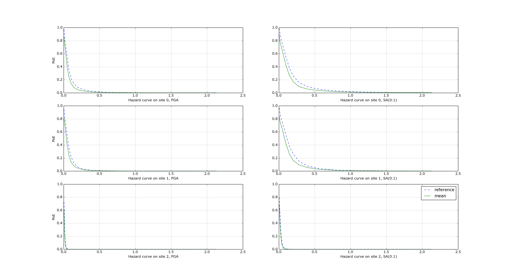

Extra tips specific to event based calculations
===============================================

Event based calculations differ from classical calculations because
they produce visible ruptures, which can be exported and
made accessible to the user. On the contrary, in classical calculations,
the underlying ruptures only live in memory and are never saved in
the datastore, nor are exportable. The limitation is fundamentally
a technical one: in the case of an event based calculation only
a small fraction of the ruptures contained in a source are actually
generated, so it is possible to store them. In a classical calculation
*all* ruptures are generated and there are so many millions of them
that it is impractical to save them. For this reason they live in memory, they
are used to produce the hazard curves and immediately discarded
right after. Perhaps in the future we will be able to overcome the
technical limitations and to store the ruptures also for classical
calculations; at the moment it is not so. Therefore here we will
only document how the ruptures are stored for event based calculations.

An example with a large logic tree (full enumeration)
-----------------------------------------------------

For exemplification purposes, here we will consider
a SHARE-like calculation, i.e. our QA
test *qa_tests_data.event_based_risk.case_4*. This is an artificial
test, obtained by a real computation for Turkey by reducing a lot
the source model and the parameters - for instance the investigation
time is 10 years whereas originally it was 10,000 years - so that
it can run in less than a minute but still retains some of the
complexities of the original calculation. It is also a perfect
example to explain the intricacies of the logic tree reduction.
If you run ``oq info --report job.ini`` you will get messages like
the following::
  
[.. INFO] Read 1 TRTs from 3 model file(s)
[.. INFO] Potential number of logic tree paths = 12
[.. INFO]  Filtering sources with RtreeFilter
[.. INFO] sample_ruptures 100%
[.. INFO]  There are 8 realizations

The first thing that the engine does is to read the tectonic region
types available in the source model. The GMPE logic tree has 7
tectonic region types, with(4, 5, 2, 4, 4, 1, 2) GMPEs
respectively. Since 4 * 5 * 2 * 4 * 4 * 1 * 2 = 1280, and there are 3
source models, one would expected a full logic tree of 3 x 1280 = 3840
realizations.  In reality there are a lot less effective
realizations. The reason is that many tectonic region types are not
present in the source model: actually the second line of logs tells us
that there are sources only for a single tectonic region type ("Active
Shallow Crust") so there are only 4 realizations per source
model. However, after filtering there can be even less sources and the
reason why at the end we have 8 realizations instead of 12 is that the
sources coming for the third source model *ss_model.xml* have been
completely filtered out. So, there are no effective realizations
belonging to it and the weights of the source model logic tree have to
be rescaled, otherwise their sum would not be one. The composition of
the composite source model, after filtering and rupture generation
becomes::

  <CompositionInfo
  AreaSource, models/src/as_model.xml, trt=[0, 1, 2, 3, 4, 5], weight=0.500: 4 realization(s)
  FaultSourceAndBackground, models/src/fsbg_model.xml, trt=[6, 7, 8, 9], weight=0.200: 4 realization(s)
  SeiFaCrust, models/src/ss_model.xml, trt=[10], weight=0.300: 0 realization(s)>

The report also contains the reduced RlzsAssoc object, which is
the following::

  <RlzsAssoc(8)
  5,AkkarBommer2010: ['<0,AreaSource,AkkarBommer2010asc_@_@_@_@_@_@,w=0.25>']
  5,CauzziFaccioli2008: ['<1,AreaSource,CauzziFaccioli2008asc_@_@_@_@_@_@,w=0.25>']
  5,ChiouYoungs2008: ['<2,AreaSource,ChiouYoungs2008asc_@_@_@_@_@_@,w=0.142857142857>']
  5,ZhaoEtAl2006Asc: ['<3,AreaSource,ZhaoEtAl2006Ascasc_@_@_@_@_@_@,w=0.0714285714286>']
  9,AkkarBommer2010: ['<4,FaultSourceAndBackground,AkkarBommer2010asc_@_@_@_@_@_@,w=0.1>']
  9,CauzziFaccioli2008: ['<5,FaultSourceAndBackground,CauzziFaccioli2008asc_@_@_@_@_@_@,w=0.1>']
  9,ChiouYoungs2008: ['<6,FaultSourceAndBackground,ChiouYoungs2008asc_@_@_@_@_@_@,w=0.0571428571429>']
  9,ZhaoEtAl2006Asc: ['<7,FaultSourceAndBackground,ZhaoEtAl2006Ascasc_@_@_@_@_@_@,w=0.0285714285714>']>

As you see, only two tectonic region models are relevant, the number 0
(i.e. the submodel of AreaSource with TRT="Active Shallow Crust") and
the number 1 (i.e. the submodel of FaultSourceAndBackground
with TRT="Active Shallow Crust").

The report contains information about the ruptures;
the same information can be extracted after the
computation with the command

  `$ oq show <calc_id> ruptures_per_trt`

Reduction of the logic tree when sampling is enabled
----------------------------------------------------

There are real life examples of very complex logic trees, like the model
for South Africa which features 3,194,799,993,706,229,268,480 branches.
In such situations it is impossible to perform
a full computation. However, the engine allows to
sample the branches of the complete logic tree. More precisely,
for each branch sampled from the source model logic
tree a branch of the GMPE logic tree is chosen randomly,
by taking into account the weights in the GMPE logic tree file.

Notice that even if source model path is sampled several times, the
model is parsed and sent to the workers *only once*. In particular if
there is a single source model (like for South America) and
``number_of_logic_tree_samples =100``, we generate effectively 1 source
model realization and not 100 equivalent source model realizations, as
we did in past (actually in the engine version 1.3).  Then engine
keeps track of how many times a model has been sampled (say `N`) and
in the event based case it produce ruptures (*with different seeds*)
by calling the appropriate hazardlib function `N` times. This is done
inside the worker nodes. In the classical case, all the ruptures are
identical and there are no seeds, so the computation is done only
once, in an efficient way.

Convergency of the GMFs for non-trivial logic trees
---------------------------------------------------------------------------

In theory, the hazard curves produced by an event based calculation
should converge to the curves produced by an equivalent classical
calculation. In practice, if the parameters
``number_of_logic_tree_samples`` and ``ses_per_logic_tree_path`` (the
product of them is the relevant one) are not large enough they may be
different. The engine is able to compare
the mean hazard curves and to see how well they converge. This is
done automatically if the option ``mean_hazard_curves = true`` is set.
Here is an example of how to generate and plot the curves for one
of our QA tests (a case with bad convergence was chosen on purpose)::

 $ oq engine --run event_based/case_7/job.ini
 <snip>
 WARNING:root:Relative difference with the classical mean curves for IMT=SA(0.1): 51%
 WARNING:root:Relative difference with the classical mean curves for IMT=PGA: 49%
 <snip>
 $ oq plot /tmp/cl/hazard.pik /tmp/hazard.pik --sites=0,1,2

The relative difference between the classical and event based curves is
computed by computing the relative difference between each point of
the curves for each curve, and by taking the maximum, at least
for probabilities of exceedence larger than 1% (for low values of
the probability the convergency may be bad). For the details I
suggest you `to look at the code`_.

.. _to look at the code: ../openquake/commonlib/util.py
