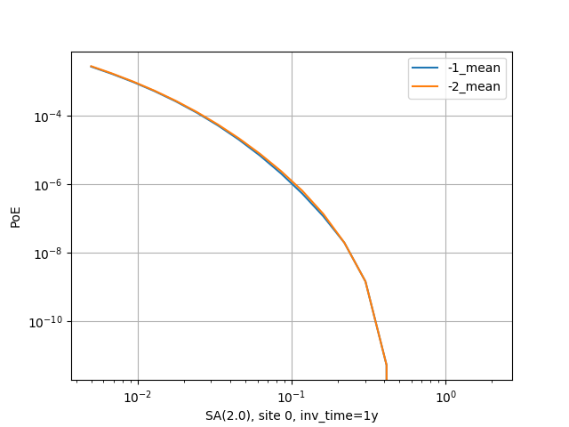

General
=======================================

This manual is for advanced users, i.e.  people who already know how to use the
engine and have already read the official manual cover-to-cover. 
If you have just started on your journey of using and working with the
OpenQuake engine, this manual is probably NOT for you. Beginners should study
the `official manual
<https://www.globalquakemodel.org/single-post/OpenQuake-Engine-Manual>`_ first.
This manual is intended for users who are either running *large* calculations
or those who are interested in programatically interacting with the datastore. 

For the purposes of this manual a calculation is large if it cannot be run,
i.e. if it runs out of memory, it fails with strange errors
or it just takes too long to complete.

There are various reasons why a calculation can be too large. 90% of the
times it is because the user is making some mistakes and she is trying to
run a calculation larger than she really needs. In the remaining 10% of the
times the calculation is genuinely large and the solution is to
buy a larger machine, or to ask the OpenQuake developers to optimize the
engine for the specific calculation that is giving issues.

The first things to do when you have a large calculation is to
run the command ``oq info --report job.ini``, that will tell you essential
information to estimate the size of the full calculation, in
particular the number of hazard sites, the number of ruptures, the
number of assets and the most relevant parameters you are using. If
generating the report is slow, it means that there is something wrong
with your calculation and you will never be able to run it completely
unless you reduce it.

The single most important parameter in the report is the
*number of effective ruptures*, i.e. the number of ruptures after
distance and magnitude filtering. For instance your report could
contain numbers like the following::

#eff_ruptures 239,556  
#tot_ruptures 8,454,592

This is an example of a computation which is potentially large - there
are over 8 million ruptures generated by the model - but that in
practice will be very fast, since 97% of the ruptures will be filtered
away. The report gives a conservative estimate, in reality even more
ruptures will be discarded.

It is very common to have an unhappy combinations of parameters
in the ``job.ini`` file, like discretization parameters that are too small.
Then your source model with contain millions and millions of ruptures
and the computation will become impossibly slow or it will run out of memory.
By playing with the parameters and producing various reports, one can get
an idea of how much a calculation can be reduced even before running it.

Now, it is a good time to read the section about common mistakes.

Common mistakes: bad configuration parameters
========================================================

By far, the most common source of problems with the engine is the
choice of parameters in the `job.ini` file. It is very easy to make
mistakes, because users typically copy the parameters from the
OpenQuake demos. However, the demos are meant to show off all of the
features of the engine in simple calculations, they are not meant
for getting performance in large calculations.

The quadratic parameters
----------------------------

In large calculations, it is essential to tune a few parameters that
are really important. Here is a list of parameters relevant for all
calculators:

maximum_distance:
   The larger the maximum_distance, the more sources and ruptures will be 
   considered; the effect is quadratic, i.e. a calculation with
   ``maximum_distance=500`` km could take up to 6.25 times more time than a
   calculation with ``maximum_distance=200`` km.

region_grid_spacing:
  The hazard sites can be specified by giving a region and a grid step.
  Clearly the size of the computation is quadratic with the inverse grid
  step: a calculation with ``region_grid_spacing=1`` will be up to 100 times
  slower than a computation with ``region_grid_spacing=10``.

area_source_discretization:
  Area sources are converted into point sources,
  by splitting the area region into a grid of points. The
  ``area_source_discretization`` (in km) is the step of the grid.
  The computation time is inversely proportional to the square of the
  discretization step, i.e. calculation with ``area_source_discretization=5``
  will take up to four times more time than a calculation with
  ``area_source_discretization=10``.

rupture_mesh_spacing:
  Fault sources are computed by converting the geometry of the fault into
  a mesh of points; the ``rupture_mesh_spacing`` is the parameter determining
  the size of the mesh. The computation time is quadratic with
  the inverse mesh spacing. Using a ``rupture_mesh_spacing=2`` instead of
  ``rupture_mesh_spacing=5`` will make your calculation up to 6.25 times slower.
  Be warned that the engine may complain if the ``rupture_mesh_spacing`` is
  too large.

complex_fault_mesh_spacing:
  The same as the ``rupture_mesh_spacing``, but for complex fault sources.
  If not specified, the value of ``rupture_mesh_spacing`` will be used.
  This is a common cause of problems; if you have performance issue you
  should consider using a larger ``complex_fault_mesh_spacing``. For instance, 
  if you use a ``rupture_mesh_spacing=2`` for simple fault sources but
  ``complex_fault_mesh_spacing=10`` for complex fault sources, your computation
  can become up to 25 times faster, assuming the complex fault sources
  are dominating the computation time.

Maximum distance
----------------

The engine gives users a lot of control on the maximum distance
parameter. For instance, you can have a different maximum distance
depending on the tectonic region, like in the following example::

  maximum_distance = {'Active Shallow Crust': 200, 'Subduction': 500}

You can also have a magnitude-dependent maximum distance::

  maximum_distance = [(5, 0), (6, 100), (7, 200), (8, 300)]

In this case, given a site, the engine will completely discard
ruptures with magnitude below 5, keep ruptures up to 100 km for
magnitudes between 5 and 6 (the maximum distance in this magnitude
range will vary linearly between 0 and 100), keep ruptures up to 200
km for magnitudes between 6 and 7 (with `maximum_distance` increasing
linearly from 100 to 200 km from magnitude 6 to magnitude 7), keep
ruptures up to 300 km for magnitudes over 7.

You can have both trt-dependent and mag-dependent maximum distance::

  maximum_distance = {
     'Active Shallow Crust': [(5, 0), (6, 100), (7, 200), (8, 300)],
     'Subduction': [(6.5, 300), (9, 500)]}

Given a rupture with tectonic region type ``trt`` and magnitude ``mag``,
the engine will ignore all sites over the maximum distance ``md(trt, mag)``.
The precise value is given via linear interpolation of the values listed
in the job.ini; you can determine the distance as follows:

>>> from openquake.hazardlib.calc.filters import IntegrationDistance 
>>> idist = IntegrationDistance.new('[(4, 0), (6, 100), (7, 200), (8.5, 300)]')
>>> interp = idist('TRT')
>>> interp([4.5, 5.5, 6.5, 7.5, 8])
array([ 25.        ,  75.        , 150.        , 233.33333333,
       266.66666667])

pointsource_distance
----------------------------

PointSources (and MultiPointSources and AreaSources, which are split
into PointSources and therefore are effectively the same thing) are
not pointwise for the engine: they actually generate ruptures with
rectangular surfaces which size is determined by the magnitude scaling
relationship. The geometry and position of such rectangles depends on
the hypocenter distribution and the nodal plane distribution of the
point source, which are used to model the uncertainties on the
hypocenter location and on the orientation of the underlying ruptures.

Is the effect of the hypocenter/nodal planes distributions relevant?
Not always: in particular, if you are interested in points that
are far away from the rupture the effect is minimal. So if you have a nodal
plane distribution with 20 planes and a hypocenter distribution with 5
hypocenters, the engine will consider 20 x 5 ruptures and perform 100
times more calculations than needed, since at large distance the hazard
will be more or less the same for each rupture.

To avoid this performance problem there is a ``pointsource_distance``
parameter: you can set it in the ``job.ini`` as a dictionary (tectonic
region type -> distance in km) or as a scalar (in that case it is
converted into a dictionary ``{"default": distance}`` and the same
distance is used for all TRTs).  For sites that are more distant than
the `pointsource_distance` plus the rupture radius from the point
source, the engine creates an average rupture by taking weighted means
of the parameters `strike`, `dip`, `rake` and `depth` from the nodal
plane and hypocenter distributions and by rescaling the occurrence
rate. For closer points, all the original ruptures are considered.
This approximation (we call it *rupture collapsing* because it
essentially reduces the number of ruptures) can give a substantial
speedup if the model is dominated by PointSources and there are
several nodal planes/hypocenters in the distribution. In some
situations it also makes sense to set

``pointsource_distance = 0``

to completely remove the nodal plane/hypocenter distributions. For
instance the Indonesia model has 20 nodal planes for each point
sources; however such model uses the so-called `equivalent distance
approximation`_ which considers the point sources to be really
pointwise. In this case the contribution to the hazard is totally
independent from the nodal plane and by using ``pointsource_distance =
0`` one can get *exactly* the same numbers and run the model in 1 hour
instead of 20 hours. Actually, starting from engine 3.3 the engine is
smart enough to recognize the cases where the equivalent distance
approximation is used and automatically set ``pointsource_distance =
0``.

Even if you not using the equivalent distance approximation, the
effect of the nodal plane/hypocenter distribution can be negligible: I
have seen cases when setting setting ``pointsource_distance = 0``
changed the result in the hazard maps only by 0.1% and gained an order of
magnitude of speedup. You have to check on a case by case basis.

There is a good example of use of the ``pointsource_distance`` in the
MultiPointClassicalPSHA demo. Here we will just show a plot displaying the
hazard curve without `pointsource_distance` (with ID=-2) and with
`pointsource_distance=200` km (with ID=-1). As you see they are nearly
identical but the second calculation is ten times faster.



The ``pointsource_distance`` is also crucial when using the
`point source gridding`_ approximation: then it can be used to
speedup calculations even when the nodal plane and hypocenter
distributions are trivial and no speedup would be expected.

NB: the ``pointsource_distance`` approximation has changed a lot
across engine releases and you should not expect it to give always the same
results. In particular, in engine 3.8 it has been
extended to take into account the fact that small magnitudes will have
a smaller collapse distance. For instance, if you
set  ``pointsource_distance=100``, the engine will collapse the ruptures
over 100 km for the maximum magnitude, but for lower magnitudes the
engine will consider a (much) shorter collapse distance and will collapse
a lot more ruptures. This is possible because given a tectonic region type
the engine knows all the GMPEs associated to that tectonic region and can
compute an upper limit for the maximum intensity generated by a rupture at any
distance. Then it can invert the curve and given the magnitude and the
maximum intensity can determine the collapse distance for that magnitude.

In engine 3.11, contrarily to all previous releases, finite side effects
are not ignored for distance sites, they are simply averaged over. This
gives a better precision. In some case (i.e. the Alaska model) versions
of the engine before 3.11 could give a completely wrong hazard
on some sites. This is now fixed.

Note: setting ``pointsource_distance=0`` does not completely remove finite
size effects. If you want to replace point sources with points you
need to also change the magnitude-scaling relationship to ``PointMSR``.
Then the area of the underlying planar ruptures will be set to 1E-4 squared km
and the ruptures will effectively become points.

The linear parameters: `width_of_mfd_bin` and intensity levels
--------------------------------------------------------------

The number of ruptures generated by the engine is controlled by the
parameter `width_of_mfd_bin`; for instance if you raise it from 0.1
to 0.2 you will reduce by half the number of ruptures and double the
speed of the calculation. It is a linear parameter, at least approximately.
Classical calculations are also roughly linear in the number of intensity
measure types and levels. A common mistake is to use too many levels.
For instance a configuration like the following one::

  intensity_measure_types_and_levels = {
    "PGA":  logscale(0.001,4.0, 100),
    "SA(0.3)":  logscale(0.001,4.0, 100),
    "SA(1.0)":  logscale(0.001,4.0, 100)}

requires computing the PoEs on 300 levels. Is that really what the user wants?
It could very well be that using only 20 levels per each intensity
measure type produces good enough results, while potentially
reducing the computation time by a factor of 5.

concurrent_tasks parameter
---------------------------

There is a last parameter which is worthy of mention, because of its
effect on the memory occupation in the risk calculators and in the
event based hazard calculator.

concurrent_tasks:
   This is a parameter that you should not set, since in most cases the
   engine will figure out the correct value to use. However,
   in some cases, you may be forced to set it. Typically this happens in
   event based calculations, when computing the ground motion fields.
   If you run out of memory, increasing this parameter will help, since
   the engine will produce smaller tasks. Another case when it may help is when
   computing hazard statistics with lots of sites and realizations, since
   by increasing this parameter the tasks will contain less sites.

Notice that if the number of ``concurrent_tasks`` is too big the
performance will get worse and the data transfer will increase: at a
certain point the calculation will run out of memory. I have seen this
to happen when generating tens of thousands of tasks. Again, it is
best not to touch this parameter unless you know what you are doing.

.. _equivalent distance approximation: special-features.html#equivalent-epicenter-distance-approximation
.. _rupture radius: https://github.com/gem/oq-engine/blob/master/openquake/hazardlib/source/point.py
.. _point source gridding: point-source-gridding.html

Developing with the engine
==========================

Some advanced users are interested in developing with the engine,
usually to contribute new GMPEs and sometimes to submit a bug fix.
There are also users interested in implementing their own customizations
of the engine. This part of the manual is for them.

Prerequisites
-------------------

It is assumed here that you are a competent scientific Python
programmer, i.e. that you have a good familiarity with the Python
ecosystem (including pip and virtualenv) and its scientific stack
(numpy, scipy, h5py, ...). It should be noticed that since engine v2.0
there is no need to know anything about databases and web development
(unless you want to develop on the WebUI part) so the barrier for
contribution to the engine is much lower than it used to be. However,
contributing is still nontrivial, and it absolutely necessary
to know git and the tools of Open Source development in
general, in particular about testing. If this is not the
case, you should do some study on your own and come back later. There
is a huge amount of resources on the net about these topics. This
manual will focus solely on the OpenQuake engine and it assume that
you already know how to use it, i.e. you have read the User Manual
first.

Before starting, it may be useful to have an idea of the architecture
of the engine and its internal components, like the DbServer and the
WebUI. For that you should read the :ref:`architecture` document.

There are also external tools which are able to interact with the engine,
like the QGIS plugin to run calculations and visualize the outputs and the
IPT tool to prepare the required input files (except the hazard models).
Unless you are developing for such tools you can safely ignore them.

The first thing to do
---------------------

The first thing to do if you want to develop with the engine is to remove
any non-development installation of the engine that you may have. While it
is perfectly possible to install on the same machine both a development and
a production instance of the engine (it is enough to configure the ports
of the DbServer and WebUI) it is easier to work with a single instance.
In that way you will have a single code base and no risks of editing the
wrong code. A development installation the engine works as any other
development installation in Python: you should clone the engine repository,
create and activate a virtualenv and then perform a `pip install -e .`
from the engine main directory, as normal. You can find the details here:

https://github.com/gem/oq-engine/blob/master/doc/installing/development.md

It is also possible to develop on Windows (
https://github.com/gem/oq-engine/blob/master/doc/installing/development.md)
but very few people in GEM are doing that, so you are on your own, should you
encounter difficulties. We recommend Linux, but Mac also works.

Since you are going to develop with the engine, you should also install
the development dependencies that by default are not installed. They
are listed in the setup.py file, and currently (January 2020) they are
pytest, flake8, pdbpp, silx and ipython. They are not required but very
handy and recommended. It is the stack we use daily for development.

Understanding the engine
-------------------------

Once you have the engine installed you can run calculations. We recommend
starting from the demos directory which contains example of hazard and
risk calculations. For instance you could run the area source demo with the
following command::

 $ oq run demos/hazard/AreaSourceClassicalPSHA/job.ini 

You should notice that we used here the command ``oq run`` while the engine
manual recommend the usage of ``oq engine --run``. There is no contradiction.
The command ``oq engine --run`` is meant for production usage, 
but here we are doing development, so the recommended command is ``oq run``
which will will be easier to debug thanks to the
flag ``--pdb``, which will start the python debugger
should the calculation fail. Since during development is normal to have
errors and problems in the calculation, this ability is invaluable.

If you want to understand what happened during the calculation
you should generate the associated .rst report, which can be seen with
the command

``$ oq show fullreport``

There you will find a lot of interesting information that it is worth studying
and we will discuss in detail in the rest of this manual. The most important
section of the report is probably the last one, titled "Slowest operations".
For that one can understand the bottlenecks of a calculation and, with
experience, he can understand which part of the engine he needs to optimize.
Also, it is very useful to play with the parameters of the calculation
(like the maximum distance, the area discretization, the magnitude binning,
etc etc) and see how the performance change. There is also a command to
plot hazard curves and a command to compare hazard curves between different
calculations: it is common to be able to get big speedups simply by changing
the input parameters in the `job.ini` of the model, without changing much the
results.

There a lot of `oq` commands: if you are doing development you should study
all of them. They are documented here_.

.. _here: oq-commands.md


Running calculations programmatically
-------------------------------------

Starting from engine 3.12 the recommended way to run a job
programmaticaly is the following:

.. code-block:: python

 >> from openquake.commonlib import logs
 >> from openquake.calculators.base import calculators
 >> with logs.init('job', 'job_ini') as log: # initialize logs
 ...   calc = calculators(log.get_oqparam(), log.calc_id)
 ...   calc.run()  # run the calculator

Then the results can be read from the datastore by using the extract API:

.. code-block:: python

 >> from openquake.calculators.extract import extract
 >> extract(calc.datastore, 'something')


Case study: computing the impact of a source on a site
------------------------------------------------------

As an exercise showing off how to use the engine as a library, we
will solve the problem of computing the hazard on a given
site generated by a given source, with a given GMPE logic tree and
a few parameters, i.e. the intensity measure levels and the maximum distance.

The first step is to specify the site and the parameters; let's
suppose that we want to compute the probability of exceeding a Peak
Ground Accelation (PGA) of 0.1g by using the ToroEtAl2002SHARE GMPE:

>>> from openquake.commonlib import readinput
>>> oq = readinput.get_oqparam(dict(
... calculation_mode='classical',
... sites='15.0 45.2',
... reference_vs30_type='measured',
... reference_vs30_value='600.0',
... intensity_measure_types_and_levels="{'PGA': [0.1]}",
... investigation_time='50.0',
... gsim='ToroEtAl2002SHARE',
... maximum_distance='200.0'))

Then we need to specify the source:

>>> from openquake.hazardlib import nrml
>>> src = nrml.get('''
...         <areaSource
...         id="126"
...         name="HRAS195"
...         >
...             <areaGeometry discretization="10">
...                 <gml:Polygon>
...                     <gml:exterior>
...                         <gml:LinearRing>
...                             <gml:posList>
...                                 1.5026169E+01 4.5773603E+01
...                                 1.5650548E+01 4.6176279E+01
...                                 1.6273108E+01 4.6083465E+01
...                                 1.6398742E+01 4.6024744E+01
...                                 1.5947759E+01 4.5648318E+01
...                                 1.5677179E+01 4.5422577E+01
...                             </gml:posList>
...                         </gml:LinearRing>
...                     </gml:exterior>
...                 </gml:Polygon>
...                 <upperSeismoDepth>0</upperSeismoDepth>
...                 <lowerSeismoDepth>30</lowerSeismoDepth>
...             </areaGeometry>
...             <magScaleRel>WC1994</magScaleRel>
...             <ruptAspectRatio>1</ruptAspectRatio>
...             <incrementalMFD binWidth=".2" minMag="4.7">
...                 <occurRates>
...                     1.4731083E-02 9.2946848E-03 5.8645496E-03
...                     3.7002807E-03 2.3347193E-03 1.4731083E-03
...                     9.2946848E-04 5.8645496E-04 3.7002807E-04
...                     2.3347193E-04 1.4731083E-04 9.2946848E-05
...                     1.7588460E-05 1.1097568E-05 2.3340307E-06
...                 </occurRates>
...             </incrementalMFD>
...             <nodalPlaneDist>
...                 <nodalPlane dip="5.7596810E+01" probability="1"
...                             rake="0" strike="6.9033586E+01"/>
...             </nodalPlaneDist>
...             <hypoDepthDist>
...                 <hypoDepth depth="1.0200000E+01" probability="1"/>
...             </hypoDepthDist>
...         </areaSource>
... ''')

Then the hazard curve can be computed as follows:

>>> from openquake.hazardlib.calc.hazard_curve import calc_hazard_curve
>>> from openquake.hazardlib import valid
>>> sitecol = readinput.get_site_collection(oq)
>>> gsims = readinput.get_gsim_lt(oq).values['*']
>>> calc_hazard_curve(sitecol, src, gsims, oq)
<ProbabilityCurve
[[0.00507997]]>


Working with GMPEs directly: the ContextMaker
---------------------------------------------------

If you are an hazard scientist, you will likely want to interact
with the GMPE library in ``openquake.hazardlib.gsim``.
The recommended way to do so is in terms of a ``ContextMaker`` object.

>>> from openquake.hazardlib.contexts import ContextMaker

In order to instantiate a ``ContextMaker`` you first need to populate
a dictionary of parameters:

>>> param = dict(maximum_distance=oq.maximum_distance, imtls=oq.imtls,
...              truncation_level=oq.truncation_level,
...              investigation_time=oq.investigation_time)
>>> cmaker = ContextMaker(src.tectonic_region_type, gsims, param)

Then you can use the ``ContextMaker`` to generate context arrays
from the sources:

>>> [ctx] = cmaker.from_srcs([src], sitecol)

In our example, there are 15 magnitudes

>>> len(src.get_annual_occurrence_rates())
15

and the area source contains 47 point sources

>>> len(list(src))
47

so in total there are 15 x 47 = 705 ruptures:

>>> len(ctx)
705

The ``ContextMaker`` takes care of the maximum_distance filtering, so in
general the number of contexts is lower than the total number of ruptures,
since some ruptures are normally discarded, being distant from the sites.

The contexts contains all the rupture, site and distance parameters.

Then you have

>>> ctx.mag[0]
4.7
>>> round(ctx.rrup[0], 1)
106.4
>>> round(ctx.rjb[0], 1)
105.9

In this example, the GMPE ``ToroEtAl2002SHARE`` does not require site
parameters, so calling ``ctx.vs30`` will raise an ``AttributeError``
but in general the contexts contains also arrays of site parameters.
There is also an array of indices telling which are the sites affected
by the rupture associated to the context:

>>> import numpy
>>> numpy.unique(ctx.sids)
array([0], dtype=uint32)

Once you have the contexts, the ``ContextMaker`` is able to compute
means and standard deviations from the underlying GMPEs as follows
(for engine version >= 3.13):

>>> mean, sig, tau, phi = cmaker.get_mean_stds([ctx])

Since in this example there is a single gsim and a single IMT you will get:

>>> mean.shape
(1, 1, 705)
>>> sig.shape
(1, 1, 705)

The shape of the arrays in general is (G, M, N) where G is the number of GSIMs,
M the number of intensity measure types and N the
total size of the contexts. Since this is an example with a single
site, each context has size 1, therefore N = 705 * 1 = 705. In general
if there are multiple sites a context M is the total number of affected
sites. For instance if there are two contexts and the first affect
1 sites and the second 2 sites then N would be 1 + 2 = 3. This
example correspond to 1 + 1 + ... + 1 = 705.

From the mean and standard deviation is possible to compute the
probabilities of exceedence. The ``ContextMaker`` provides a method
to compute directly the probability map, which internally calls
```cmaker.get_pmap([ctx])`` which gives exactly the result provided by
``calc_hazard_curve(sitecol, src, gsims, oq)`` in the section before.

If you want to know exactly how ``get_pmap`` works you are invited to
look at the source code in ``openquake.hazardlib.contexts``.


Working with verification tables
---------------------------------------------------

Hazard scientists implementing a new GMPE must provide verification
tables, i.e. CSV files containing inputs and expected outputs.

For instance, for the Atkinson2015 GMPE (chosen simply because is
the first GMPE in lexicographic order in hazardlib) the verification
table has a structure like this::

 rup_mag,dist_rhypo,result_type,pgv,pga,0.03,0.05,0.1,0.2,0.3,0.5
 2.0,1.0,MEAN,5.50277734e-02,3.47335058e-03,4.59601700e-03,7.71361460e-03,9.34624779e-03,4.33207607e-03,1.75322233e-03,3.44695521e-04
 2.0,5.0,MEAN,6.43850933e-03,3.61047741e-04,4.57949482e-04,7.24558049e-04,9.44495571e-04,5.11252304e-04,2.21076069e-04,4.73435138e-05
 ...

The columns starting with ``rup_`` contains rupture parameters (the
magnitude in this example) while the columns starting with ``dist_``
contains distance parameters. The column ``result_type`` is a string
in the set {"MEAN", "INTER_EVENT_STDDEV", "INTRA_EVENT_STDDEV",
"TOTAL_STDDEV"}. The remaining columns are the expected results for
each intensity measure type; in the the example the IMTs are PGV, PGA,
SA(0.03), SA(0.05), SA(0.1), SA(0.2), SA(0.3), SA(0.5).

Starting from engine version 3.13, it is possible to instantiate a
ContextMaker and the associated contexts from a GMPE and its
verification tables with a few simple steps. First of all one
must instantiate the GMPE:

>>> from openquake.hazardlib import valid
>>> gsim = valid.gsim("Atkinson2015")

Second, one can determine the path names to the verification tables
as follows (they are in a subdirectory of *hazardlib/tests/gsim/data*):

>>> import os
>>> from openquake.hazardlib.tests.gsim import data
>>> datadir = os.path.join(data.__path__[0], 'ATKINSON2015')
>>> fnames = [os.path.join(datadir, f) for f in ["ATKINSON2015_MEAN.csv",
...           "ATKINSON2015_STD_INTER.csv", "ATKINSON2015_STD_INTRA.csv",
...           "ATKINSON2015_STD_TOTAL.csv"]]

Then it is possible to instantiate the ContextMaker associated to the GMPE
and a pandas DataFrame associated to the verification tables in a single step:

>>> from openquake.hazardlib.tests.gsim.utils import read_cmaker_df, gen_ctxs
>>> cmaker, df = read_cmaker_df(gsim, fnames)
>>> list(df.columns)
['rup_mag', 'dist_rhypo', 'result_type', 'damping', 'PGV', 'PGA', 'SA(0.03)', 'SA(0.05)', 'SA(0.1)', 'SA(0.2)', 'SA(0.3)', 'SA(0.5)', 'SA(1.0)', 'SA(2.0)', 'SA(3.0)', 'SA(5.0)']

Then you can immediately compute mean and standard deviations and
compare with the values in the verification table:

>>> mean, sig, tau, phi = cmaker.get_mean_stds(gen_ctxs(df))

*sig* refers to the "TOTAL_STDDEV", *tau* to the "INTER_EVENT_STDDEV"
and *phi* to the "INTRA_EVENT_STDDEV". This is how the tests
in hazardlib are implemented. Interested users should look at the
code in https://github.com/gem/oq-engine/blob/master/openquake/hazardlib/tests/gsim/utils.py.

Running the engine tests
----------------------------------

If you are a hazard scientists contributing a bug fix to a GMPE (or any
other kind of bug fix) you may need to run the engine tests and possibly
change the expected files if there is a change in the numbers. The way to
do it is to start the dbserver and then run the tests from the repository root::

  $ oq dbserver start
  $ pytest -vx openquake/calculators

If you get an error like the following::

  openquake/calculators/tests/__init__.py:218: in assertEqualFiles
      raise DifferentFiles('%s %s' % (expected, actual))
  E   openquake.calculators.tests.DifferentFiles: /home/michele/oq-engine/openquake/qa_tests_data/classical/case_1/expected/hazard_curve-PGA.csv /tmp/tmpkdvdhlq5/hazard_curve-mean-PGA_27249.csv

you need to change the expected file, i.e. copy the file ``/tmp/tmpkdvdhlq5/hazard_curve-mean-PGA_27249.csv`` over ``classical/case_1/expected/hazard_curve-PGA.csv``.

.. _architecture:


Architecture of the OpenQuake engine
=========================================

The engine is structured as a regular scientific application: we try
to perform calculations as much as possible in memory and when it is
not possible intermediate results are stored in HDF5 format.
We try work as much as possible in terms of arrays which are
efficiently manipulated at C/Fortran speed with a stack of well
established scientific libraries (numpy/scipy).

CPU-intensity calculations
are parallelized with a custom framework (the engine is ten years old and
predates frameworks like dask_ or ray_) which however is quite easy to
use and mostly compatible with Python multiprocessing or concurrent.futures.
The concurrency architecture is the standard Single Writer Multiple Reader
(SWMR), used at the HDF5 level: only one process can write data while multiple
processes can read it. The engine runs seamlessly on a single machine or a
cluster, using as many cores as possible.

In the past the engine had a database-centric architecture and was
more class-oriented than numpy-oriented: some remnants of such dark
past are still there, but they are slowly disappearing. Currently
the database is only used for storing accessory data and it is a simple
SQLite file. It is mainly used by the WebUI to display the logs.

.. _dask: https://dask.org/
.. _ray: https://ray.readthedocs.io/en/latest/

Components of the OpenQuake Engine
-----------------------------------

The OpenQuake Engine suite is composed of several components:

- a set of *support libraries* addressing different concerns like reading the
  inputs and writing the outputs, implementing basic geometric manipulations,
  managing distributed computing and generic programming utilities
- the *hazardlib* and *risklib* scientific libraries,
  providing the building blocks for hazard and
  risk calculations, notably the GMPEs for hazard and the
  vulnerability/fragility functions for risk
- the hazard and risk *calculators*, implementing the core logic
  of the engine
- the *datastore*, which is an HDF5 file working as a short term storage/cache
  for a calculation; it is possible to run a calculation starting from an
  existing datastore, to avoid recomputing everything every time; there is a
  separate datastore for each calculation
- the *database*, which is a SQLite file working as a long term storage for the
  calculation metadata; the database contains the start/stop times of the
  computations, the owner of a calculation, the calculation descriptions,
  the performances, the logs, etc; the bulk scientific data
  (essentially big arrays) are kept in the datastore
- the *DbServer*, which is a service mediating the interaction
  between the calculators and the database
- the *WebUI* is a web application that allows to run and monitor
  computations via a browser; multiple calculations can be run in parallel
- the *oq* command-line tool; it allows to run computations
  and provides an interface to the underlying
  database and datastores so that it is possible to list and export the results
- the engine can run on a cluster of machines: in that case a
  minimal amount of configuration is needed, whereas in single machine
  installations the engine works out of the box
- since v3.8 the engine does not depend anymore from celery and rabbitmq,
  but can still use such tools until they will be deprecated

This is the full stack of internal libraries used by the engine. Each of these
is a Python package containing several modules or event
subpackages. The stack is a dependency tower where the higher levels
depend on the lower levels but not vice versa:

- level 9: commands (subcommands of oq)
- level 8: server (database and Web UI)
- level 7: engine (command-line tool, export, logs)
- level 6: calculators (hazard and risk calculators)
- level 5: commonlib (configuration, logic trees, I/O)
- level 4: risklib (risk validation, risk models, risk inputs)
- level 3: hmtk (catalogues, plotting, ...)
- level 2: hazardlib (validation, read/write XML, source and site objects, geospatial utilities, GSIM library)
- level 1: baselib (programming utilities, parallelization, monitoring, hdf5...)

`baselib` and `hazardlib` are very stable and can be used outside of the
engine; the other libraries are directly related to the engine and
are likely to be affected by backward-incompatible changes in the future,
as the code base evolves.

The GMPE library in `hazardlib` and the calculators are designed
to be extensible, so that it is easy to add a new GMPE class or a new
calculator. We routinely add several new GMPEs per release; adding new
calculators is less common and it requires more expertise, but it is possible
and it has been done several times in the past. In particular it is
often easier to add a specific calculator optimized for a given use case rather
than complicating the current calculators.

The results of a computation are automatically saved in the datastore
and can be exported in a portable format, such as CSV (or XML, for
legacy reasons). You can assume that the datastore of version X of
the engine *will not work* with version X + 1. On the contrary, the
exported files will likely be same across different versions. It is
important to export all of the outputs you are interested in before
doing an upgrade, otherwise you would be forced to downgrade in order
to be able to export the previous results.

The WebUI provides a REST API that can be used in third party
applications: for instance a QGIS plugin could download the maps
generated by the engine via the WebUI and display them. There is lot
of functionality in the API which is documented here:
https://github.com/gem/oq-engine/blob/master/doc/web-api.md. It is
possible to build your own user interface for the engine on top of it,
since the API is stable and kept backward compatible.

Design principles
-----------------

The main design principle has been *simplicity*: everything has to be
as simple as possible (but not simplest). The goal has been to keep
the engine simple enough that a single person can understand it,
debug it, and extend it without tremendous effort. All the rest
comes from simplicity: transparency, ability to inspect and debug, modularity,
adaptability of the code, etc. Even efficiency: in the last three
years most of the performance improvements came from free, just from
removing complications. When a thing is simple it is easy to make it
fast. The battle for simplicity is never ending, so there are still
several things in the engine that are more complex than they should:
we are working on that.

After simplicity the second design goal has been *performance*: the
engine is a number crunching application after all, and we need to run
massively parallel calculations taking days or weeks of
runtime. Efficiency in terms of computation time and memory
requirements is of paramount importance, since it makes the difference
between being able to run a computation and being unable to do it.
Being too slow to be usable should be considered as a bug.

The third requirement is *reproducibility*, which is the
same as testability: it is essential to have a suite of tests checking
that the calculators are providing the expected outputs against a set
of predefined inputs. Currently we have thousands of tests which are
run multiple times per day in our Continuous Integration environments
r(avis, GitLab, Jenkins), split into unit tests, end-to-end tests and
long running tests.

How the parallelization works in the engine
===========================================

The engine builds on top of existing parallelization libraries.
Specifically, on a single machine it is based on multiprocessing,
which is part of the Python standard library, while on a cluster
it is based on the combination celery/rabbitmq, which are well-known
and maintained tools.

While the parallelization used by the engine may look trivial in theory
(it only addresses embarrassingly parallel problems, not true concurrency)
in practice it is far from being so. For instance a crucial feature that
the GEM staff requires is the ability to kill (revoke) a running calculation
without affecting other calculations that may be running concurrently.

Because of this requirement, we abandoned `concurrent.futures`, which is also
in the standard library, but is lacking the ability to kill the pool of
processes, which is instead available in multiprocessing with the
`Pool.shutdown` method. For the same reason, we discarded `dask`, which
is a lot more powerful than `celery` but lacks the revoke functionality.

Using a real cluster scheduling mechanism (like SLURM) would be of course
better, but we do not want to impose on our users a specific cluster
architecture. celery/rabbitmq have the advantage of being simple to install
and manage. Still, the architecture of the engine parallelization library
is such that it is very simple to replace celery/rabbitmq with other
parallelization mechanisms: people interested in doing so should just
contact us.

Another tricky aspects of parallelizing large scientific calculations is
that the amount of data returned can exceed the 4 GB limit of Python pickles:
in this case one gets ugly runtime errors. The solution we found is to make
it possible to yield partial results from a task: in this way instead of
returning say 40 GB from one task, one can yield 40 times partial results
of 1 GB each, thus bypassing the 4 GB limit. It is up to the implementor
to code the task carefully. In order to do so, it is essential to have
in place some monitoring mechanism measuring how much data is returned
back from a task, as well as other essential informations like how much
memory is allocated and how long it takes to run a task.

To this aim the OpenQuake engine offers a ``Monitor`` class
(located in ``openquake.baselib.performance``) which is perfectly well
integrated with the parallelization framework, so much that every
task gets a ``Monitor`` object, a context manager that can be used
to measure time and memory of specific parts of a task. Moreover,
the monitor automatically measures time and memory for the whole task,
as well as the size of the returned output (or outputs). Such information
is stored in an HDF5 file that you must pass to the monitor when instantiating
it. The engine automatically does that for you by passing the pathname of the
datastore.

In OpenQuake a task is just a Python function (or generator)
with positional arguments, where the last argument is a ``Monitor`` instance.
For instance the rupture generator task in an event based calculation
is coded more or less like this:

.. code-block:: python

   def sample_ruptures(sources, num_samples, monitor):  # simplified code
       ebruptures = []
       for src in sources:
           for ebr in src.sample_ruptures(num_samples):
               eb_ruptures.append(ebr)
           if len(eb_ruptures) > MAX_RUPTURES:
               # yield partial result to avoid running out of memory
               yield eb_ruptures
               eb_ruptures.clear()
       if ebruptures:
           yield eb_ruptures

If you know that there is no risk of running out of memory and/or passing the
pickle limit you can just use a regular function and return a single result
instead of yielding partial results. This is the case when computing the
hazard curves, because the algorithm is considering one rupture at the time
and it is not accumulating ruptures in memory, differently from what happens
when sampling the ruptures in event based.

If you have ever coded in celery, you will see that the OpenQuake engine
concept of task is different: there is no ``@task`` decorator and while at the
end engine tasks will become celery tasks this is hidden to the developer.
The reason is that we needed a celery-independent abstraction layer to make
it possible to use different kinds of parallelization frameworks/

From the point of view of the coder, in the engine there is no difference
between a task running on a cluster using celery and a task running locally
using ``multiprocessing.Pool``: they are coded the same, but depending
on a configuration parameter in openquake.cfg (``distribute=celery``
or ``distribute=processpool``) the engine will treat them differently.
You can also set an environment variable ``OQ_DISTRIBUTE``, which takes
the precedence over openquake.cfg, to specify which kind of distribution
you want to use (``celery`` or ``processpool``): this is mostly used
when debugging, when you typically insert a breakpoint in the task
and then run the calculation with

.. code-block:: bash

   $ OQ_DISTRIBUTE=no oq run job.ini

``no`` is a perfectly valid distribution mechanism in which there is actually
no distribution and all the tasks run sequentially in the same core. Having
this functionality is invaluable for debugging.

Another tricky bit of real life parallelism in Python is that forking
does not play well with the HDF5 library: so in the engine we are
using multiprocessing in the ``spawn`` mode, not in ``fork`` mode:
fortunately this feature has become available to us in Python 3 and it
made our life a lot happier.  Before it was extremely easy to incur
unspecified behavior, meaning that reading an HDF5 file from a
forked process could

1. work perfectly well
2. read bogus numbers
3. cause a segmentation fault

and all of the three things could happen unpredictably at any moment, depending
on the machine where the calculation was running, the load on the machine, and
any kind of environmental circumstances.

Also, while with the newest HDF5 libraries it is possible to use a
Single Writer Multiple Reader architecture (SWMR), and we are actually
using it - even if it is sometimes tricky to use it correctly - the
performance is not always good. So, when it matters, we are using a
two files approach which is simple and very effective: we read from
one file (with multiple readers) and we write on the other file (with
a single writer). This approach bypasses all the limitations of the
SWMR mode in HDF5 and did not require a large refactoring of our
existing code.

Another tricky point in cluster situations is that rabbitmq is not good
at transferring gigabytes of data: it was meant to manage lots of small
messages, but here we are perverting it to manage huge messages, i.e.
the large arrays coming from a scientific calculations.

Hence, since recent versions of the engine we are no longer returning
data from the tasks via celery/rabbitmq: instead, we use zeromq.  This
is hidden from the user, but internally the engine keeps track of all
tasks that were submitted and waits until they send the message that
they finished. If one tasks runs out of memory badly and never sends
the message that it finished, the engine may hang, waiting for the
results of a task that does not exist anymore.  You have to be
careful. What we did in our cluster is to set some memory limit on the
celery user with the cgroups technology, so that an out of memory task
normally fails in a clean way with a Python MemoryError, sends the
message that it finished and nothing particularly bad happens.  Still,
in situations of very heavy load the OOM killer may enter in action
aggressively and the main calculation may hang: in such cases you need
a good sysadmin having put in place some monitor mechanism, so that
you can see if the OOM killer entered in action and then you can kill
the main process of the calculation by hand. There is not much more
that can be done for really huge calculations that stress the hardware
as much as possible. You must be prepared for failures.


How to use openquake.baselib.parallel
-------------------------------------

Suppose you want to code a character-counting algorithm, which is a textbook
exercise in parallel computing and suppose that you want to store information
about the performance of the algorithm. Then you should use the OpenQuake
``Monitor`` class, as well as the utility
``openquake.baselib.commonlib.hdf5new`` that build an empty datastore
for you. Having done that, the ``openquake.baselib.parallel.Starmap``
class can take care of the parallelization for you as in the following
example:

.. include:: char_count_par.py
   :code: python

The name ``Starmap`` was chosen it looks very similar to
``multiprocessing.Pool.starmap`` works, the only apparent difference
being in the additional monitor argument::

    pool.starmap(func, iterargs) ->  Starmap(func, iterargs, monitor)

In reality the ``Starmap`` has a few other differences:

1. it does not use the multiprocessing mechanism to returns back the results,
   it uses zmq instead;
2. thanks to that, it can be extended to generator functions and can yield
   partial results, thus overcoming the limitations of multiprocessing
3. the ``Starmap`` has a ``.submit`` method and it is actually more similar to
   ``concurrent.futures`` than to multiprocessing.

Here is how you would write the same example by using ``.submit``:

.. code-block:: python

   def main(dirname):
       dname = pathlib.Path(dirname)
       with hdf5new() as hdf5:
           smap = Starmap(count, monitor=Monitor('count', hdf5))
           for fname in os.listdir(dname):
               if fname.endswith('.rst'):
                   smap.submit(open(dname/fname, encoding='utf-8').read())
           c = collections.Counter()
           for counter in smap:
               c += counter

The difference with ``concurrent.futures`` is that
the ``Starmap`` takes care for of all submitted tasks, so you do not
need to use something like ``concurrent.futures.completed``, you can just
loop on the ``Starmap`` object to get the results from the various tasks.

The ``.submit`` approach is more general: for instance you could define
more than one ``Starmap`` object at the same time and submit some tasks
with a starmap and some others with another starmap: this may help
parallelizing complex situations where it is expensive to use a single
starmap. However, there is limit on the number of starmaps that can be
alive at the same moment.

Moreover the ``Starmap`` has a ``.shutdown`` methods that allows to
shutdown the underlying pool.

The idea is to submit the text of each file - here I am considering .rst files,
like the ones composing this manual - and then loop over the results of the
``Starmap``. This is very similar to how ``concurrent.futures`` works.

Extracting data from calculations
=================================

The engine has a relatively large set of predefined outputs, that you can
get in various formats, like CSV, XML or HDF5. They are all documented
in the manual and they are the recommended way of interacting with the
engine, if you are not tech-savvy.

However, sometimes you *must* be tech-savvy: for instance if you want to
post-process hundreds of GB of ground motion fields produced by an event
based calculation, you should *not* use the CSV output, at least
if you care about efficiency. To manage this case (huge amounts of data)
there a specific solution, which is also able to manage the case of data
lacking a predefined exporter: the ``Extractor`` API.

There are actually two different kind of extractors: the simple
``Extractor``, which is meant to manage large data sets (say > 100 MB)
and the ``WebExtractor``, which is able to interact with the WebAPI
and to extract data from a remote machine. The WebExtractor is nice,
but cannot be used for large amount of data for various reasons; in
particular, unless your Internet connection is ultra-fast, downloading
GBs of data will probably send the web request in timeout, causing it
to fail.  Even if there is no timeout, the WebAPI will block,
everything will be slow, the memory occupation and disk space will go
up, and at certain moment something will fail.

The ``WebExtractor`` is meant for small to medium
outputs, things like the mean hazard maps - an hazard map
containing 100,000 points and 3 PoEs requires only 1.1 MB of data
at 4 bytes per point. Mean hazard curves or mean
average losses in risk calculation are still small enough for the
``WebExtractor``. But if you want to extract all of the realizations you
must go with the simple ``Extractor``: in that case your postprocessing
script must run in the remote machine, since it requires direct access to the
datastore.

Here is an example of usage of the ``Extractor`` to retrieve mean hazard curves:

.. code-block::

 >> from openquake.calculators.extract import Extractor
 >> calc_id = 42  # for example
 >> extractor = Extractor(calc_id)
 >> obj = extractor.get('hcurves?kind=mean&imt=PGA')  # returns an ArrayWrapper
 >> obj.mean.shape  # an example with 10,000 sites, 20 levels per PGA
 (10000, 1, 20)
 >> extractor.close()

If in the calculation you specified the flag ``individual_rlzs=true``,
then it is also possible to retrieve a specific realization

 >> dic = vars(extractor.get('hcurves?kind=rlz-0'))
 >> dic['rlz-000']  # array of shape (num_sites, num_imts, num_levels)

or even all realizations:

 >> dic = vars(extractor.get('hcurves?kind=rlzs'))

Here is an example of using the `WebExtractor` to retrieve hazard maps.
Here we assumes that there is available in a remote machine where there is
a WebAPI server running, a.k.a. the Engine Server. The first thing to is to
set up the credentials to access the WebAPI. There are two cases:

1. you have a production installation of the engine in ``/opt``
2. you have a development installation of the engine in a virtualenv

In both case you need to create a file called ``openquake.cfg`` with the
following format::
  
  [webapi]
  server = http(s)://the-url-of-the-server(:port)
  username = my-username
  password = my-password

``username`` and ``password`` can be left empty if the authentication is
not enabled in the server, which is the recommended way, if the
server is in your own secure LAN. Otherwise you must set the
right credentials. The difference between case 1 and case 2 is in
where to put the ``openquake.cfg`` file: if you have a production
installation, put it in your $HOME, if you have a development
installation, put it in your virtualenv directory.

The usage then is the same as the regular extractor:

.. code-block::

 >> from openquake.calculators.extract import WebExtractor
 >> extractor = WebExtractor(calc_id)
 >> obj = extractor.get('hmaps?kind=mean&imt=PGA')  # returns an ArrayWrapper
 >> obj.mean.shape  # an example with 10,000 sites and 4 PoEs
 (10000, 1, 4)
 >> extractor.close()

If you do not want to put your credentials in the ``openquake.cfg`` file,
you can do so, but then you need to pass them explicitly to the WebExtractor::

 >> extractor = WebExtractor(calc_id, server, username, password)

Plotting
--------------

The (Web)Extractor is used in the `oq plot` command: by configuring
``openquake.cfg`` it is possible to plot things like hazard curves, hazard maps
and uniform hazard spectra for remote (or local) calculations.
Here are three examples of use::

    $ oq plot 'hcurves?kind=mean&imt=PGA&site_id=0' <calc_id>
    $ oq plot 'hmaps?kind=mean&imt=PGA' <calc_id>
    $ oq plot 'uhs?kind=mean&site_id=0' <calc_id>

The ``site_id`` is optional; if missing only the first site (``site_id=0``)
will be plotted. If you want to plot all the realizations you can do::

    $ oq plot 'hcurves?kind=rlzs&imt=PGA' <calc_id>

If you want to plot all statistics you can do::

    $ oq plot 'hcurves?kind=stats&imt=PGA' <calc_id>

It is also possible to combine plots. For instance if you want to plot all
realizations and also the mean the command to give is::

    $ oq plot 'hcurves?kind=rlzs&kind=mean&imt=PGA' <calc_id>

If you want to plot the mean and the median the command is::

    $ oq plot 'hcurves?kind=quantile-0.5&kind=mean&imt=PGA' <calc_id>

assuming the median (i.e. `quantile-0.5`) is available in the calculation.
If you want to compare say rlz-0 with rlz-2 and rlz-5 you can just just
say so::

    $ oq plot 'hcurves?kind=rlz-0&kind=rlz-2&kind=rlz-5&imt=PGA' <calc_id>

You can combine as many kinds of curves as you want. Clearly if your are
specifying a kind that is not available you will get an error.

Extracting disaggregation outputs
---------------------------------

Disaggregation outputs are particularly complex and they are stored in
datastore in different ways depending on the engine version. Here we will
give a few examples for the Disaggregation Demo, which has the flag
``individual_rlzs`` set. If you run the demos with a recent enough version
of the engine (>=3.17) you will see two disaggregation outputs:

1. Disaggregation Outputs Per Realization
2. Statistical Disaggregation Outputs

Such outputs can be exported as usual in CSV format and will generate
several files. Users can be interested in extracting a subset of the
outputs programmatically, thus avoiding the overhead of exporting more
data than needed and having to read the CSV. The way to go is to
define an extractor::

 >> extractor = Extractor(calc_id)

and five parameters:

1. kind: the kind of outputs, like Mag, Mag_Dist, Mag_Dist_Eps, etc
2. imt: the IMT, like PGA, SA(1.0), etc
3. site_id: the site ordinal number, like 0, 1, etc
4. poe_id: the ordinal of the PoE, like 0, 1, etc
5. spec: the specifier string, one of "rlzs", "stats", "rlzs-traditional", "stats-traditional"

Here is an example::

 >> ex = 'disagg?kind=Mag_Dist&imt=PGA&site_id=0&poe_id=0&spec=rlzs-traditional'
 >> dic = extractor.get(ex)

The dictionary here contains the following keys::

 >> dic["mag"] # lenght 4
 array([5., 6., 7., 8.])
 >> dic["dist"] # lenght 21
 array([  0.,  10.,  20.,  30.,  40.,  50.,  60.,  70.,  80.,  90., 100.,
        110., 120., 130., 140., 150., 160., 170., 180., 190., 200.])
 >> dic["array"].shape
 (4, 21, 1, 1)

Extracting ruptures
-------------------

Here is an example for the event based demo::

  $ cd oq-engine/demos/hazard/EventBasedPSHA/
  $ oq engine --run job.ini
  $ oq shell
  IPython shell with a global object "o"
  In [1]: from openquake.calculators.extract import Extractor
  In [2]: extractor = Extractor(calc_id=-1)
  In [3]: aw = extractor.get('rupture_info?min_mag=5')
  In [4]: aw
  Out[4]: <ArrayWrapper(1511,)>
  In [5]: aw.array                                                   
  Out[5]:
  array([(   0, 1, 5.05, 0.08456118,  0.15503392, 5., b'Active Shallow Crust', 0.0000000e+00, 90.      , 0.),
         (   1, 1, 5.05, 0.08456119,  0.15503392, 5., b'Active Shallow Crust', 4.4999969e+01, 90.      , 0.),
         (   2, 1, 5.05, 0.08456118,  0.15503392, 5., b'Active Shallow Crust', 3.5999997e+02, 49.999985, 0.),
         ...,
         (1508, 2, 6.15, 0.26448786, -0.7442877 , 5., b'Active Shallow Crust', 0.0000000e+00, 90.      , 0.),
         (1509, 1, 6.15, 0.26448786, -0.74428767, 5., b'Active Shallow Crust', 2.2499924e+02, 50.000004, 0.),
         (1510, 1, 6.85, 0.26448786, -0.74428767, 5., b'Active Shallow Crust', 4.9094699e-04, 50.000046, 0.)],
        dtype=[('rup_id', '<i8'), ('multiplicity', '<u2'), ('mag', '<f4'), ('centroid_lon', '<f4'),
               ('centroid_lat', '<f4'), ('centroid_depth', '<f4'), ('trt', 'S50'), ('strike', '<f4'),
               ('dip', '<f4'), ('rake', '<f4')])
  In [6]: extractor.close()

Reading outputs with pandas
================================

If you are a scientist familiar with Pandas, you will be happy to know that
it is possible to process the engine outputs with it.
Here we will give an example involving hazard curves.

Suppose you ran the AreaSourceClassicalPSHA demo, with calculation ID=42;
then you can process the hazard curves as follows:

.. code-block:: python

  >> from openquake.commonlib.datastore import read
  >> dstore = read(42)
  >> df = dstore.read_df('hcurves-stats', index='lvl',
  ..                     sel=dict(imt='PGA', stat='mean', site_id=0))
       site_id stat     imt     value
  lvl                                
  0      0  b'mean'  b'PGA'  0.999982
  1      0  b'mean'  b'PGA'  0.999949
  2      0  b'mean'  b'PGA'  0.999850
  3      0  b'mean'  b'PGA'  0.999545
  4      0  b'mean'  b'PGA'  0.998634
  ..   ...      ...     ...       ...
  44     0  b'mean'  b'PGA'  0.000000

The dictionary ``dict(imt='PGA', stat='mean', site_id=0)`` is used to select
subsets of the entire dataset: in this case hazard curves for mean PGA for
the first site.

If you do not like pandas, or for some reason you prefer plain numpy arrays,
you can get a slice of hazard curves by using the ``.sel`` method:

.. code-block:: python

  >> arr = dstore.sel('hcurves-stats', imt='PGA', stat='mean', site_id=0)
  >> arr.shape  # (num_sites, num_stats, num_imts, num_levels)
  (1, 1, 1, 45)

Notice that the `.sel` method does not reduce the number of dimensions
of the original array (4 in this case), it just reduces the number of elements.
It was inspired by a similar functionality in xarray.

Example: how many events per magnitude?
---------------------------------------

When analyzing an event based calculation, users are often interested in
checking the magnitude-frequency distribution, i.e. to count how many
events of a given magnitude present in the stochastic event set for
a fixed investigation time and a fixed ``ses_per_logic_tree_path``.
You can do that with code like the following:

.. code-block:: python
                
 def print_events_by_mag(calc_id):
     # open the DataStore for the current calculation
     dstore = datastore.read(calc_id)
     # read the events table as a Pandas dataset indexed by the event ID
     events = dstore.read_df('events', 'id')
     # find the magnitude of each event by looking at the 'ruptures' table
     events['mag'] = dstore['ruptures']['mag'][events['rup_id']]
     # group the events by magnitude
     for mag, grp in events.groupby(['mag']):
         print(mag, len(grp))   # number of events per group

If you want to now the number of events per realization and per stochastic
event set you can just refine the `groupby` clause, using the list
``['mag', 'rlz_id', 'ses_id']`` instead of simply ``['mag']``.

Given an event, it is trivial to extract the ground motion field
generated by that event, if it has been stored (warning: events
producing zero ground motion are not stored). It is enough to read
the ``gmf_data`` table indexed by event ID, i.e. the ``eid`` field:

.. code-block:: python

   >> eid = 20  # consider event with ID 20
   >> gmf_data = dstore.read_df('gmf_data', index='eid') # engine>3.11
   >> gmf_data.loc[eid]
        sid     gmv_0
   eid               
   20    93   0.113241
   20   102   0.114756
   20   121   0.242828
   20   142   0.111506

The ``gmv_0`` refers to the first IMT; here I have shown an example with a
single IMT, in presence of multiple IMTs you would see multiple columns
``gmv_0, gmv_1, gmv_2, ...``. The ``sid`` column refers to the site ID.

As a following step, you can compute the hazard curves at each site
from the ground motion values by using the function `gmvs_to_poes`,
available since engine 3.10:

.. code-block::
   
   >> from openquake.commonlib.calc import gmvs_to_poes
   >> gmf_data = dstore.read_df('gmf_data', index='sid')
   >> df = gmf_data.loc[0]  # first site
   >> gmvs = [df[col].to_numpy() for col in df.columns
   ..         if col.startswith('gmv_')]  # list of M arrays
   >> oq = dstore['oqparam']  # calculation parameters
   >> poes = gmvs_to_poes(gmvs, oq.imtls, oq.ses_per_logic_tree_path)

This will return an array of shape (M, L) where M is the number of
intensity measure types and L the number of levels per IMT. This works
when there is a single realization; in presence of multiple
realizations one has to collect together set of values corresponding
to the same realization (this can be done by using the relation
``event_id -> rlz_id``) and apply ``gmvs_to_poes`` to each
set.

NB: another quantity one may want to compute is the average ground
motion field, normally for plotting purposes. In that case special
care must be taken in the presence of zero events, i.e. events
producing a zero ground motion value (or below the
``minimum_intensity``): since such values are not stored you have to
enlarge the gmvs arrays with the missing zeros, the number of which
can be determined from the ``events`` table for each realization.
The engine is able to compute the ``avg_gmf`` correctly, however, since
it is an expensive operation, it is done only for small calculations.

Limitations of Floating-point Arithmetic
========================================

Most practitioners of numeric calculations are aware that addition 
of floating-point numbers is non-associative; for instance

>>> (.1 + .2) + .3                                                          
0.6000000000000001

is not identical to

>>> .1 + (.2 + .3)                                                         
0.6

Other floating-point operations, such as multiplication,
are also non-associative. The order in which operations are performed plays 
a role in the results of a calculation.

Single-precision floating-point variables are able to represent integers
between [-16777216, 16777216] exactly, but start losing precision 
beyond that range; for instance:

>>> numpy.float32(16777216)
16777216.0

>>> numpy.float32(16777217)
16777216.0

This loss of precision is even more apparent for larger values:

>>> numpy.float32(123456786432)
123456780000.0

>>> numpy.float32(123456786433)
123456790000.0

These properties of floating-point numbers have critical implications
for numerical reproducibility of scientific computations, particularly
in a parallel or distributed computing environment.

For the purposes of this discussion, let us define numerical reproducibility
as obtaining bit-wise identical results for different runs of the 
same computation on either the same machine or different machines.

Given that the OpenQuake engine works by parallelizing calculations, 
numerical reproducibility cannot be fully guaranteed, even for 
different runs on the same machine (unless the computation is run
using the --no-distribute or --nd flag).

Consider the following strategies for distributing the
calculation of the asset losses for a set of events, followed by
aggregation of the results for the portfolio due to all of the events. 
The assets could be split into blocks with each task computing the
losses for a particular block of assets and for all events, and the partial
losses coming in from each task is aggregated at the end.
Alternatively, the assets could be kept as a single block, splitting
the set of events/ruptures into blocks instead; once again the engine has to 
aggregate partial losses coming in from each of the tasks. 
The order of the tasks is arbitrary, because it is impossible to know 
how long each task will take before the computation actually begins.

For instance, suppose there are 3 tasks, the first one producing a partial
loss of 0.1 billion, the second one of 0.2 billion, and the third one of 0.3 billion.
If we run the calculation and the order in which the results are received 
is 1-2-3, we will compute a total loss of (.1 + .2) + .3 = 0.6000000000000001 billion.
On the other hand, if for some reason the order in which the results arrive is
2-3-1, say for instance, if the first core is particularly hot and the
operating system decides to enable some throttling on it, then the
aggregation will be (.2 + .3) + .1 = 0.6 billion, which is different 
from the previous value by 1.11E-7 units. This example assumes the use of 
Python's IEEE-754 “double precision” 64-bit floats.

However, the engine uses single-precision 32-bit floats rather than
double-precision 64-bit floats in a tradeoff necessary for reducing the
memory demand (both RAM and disk space) for large computations, 
so the precision of results is less than in the above example. 
64-bit floats have 53 bits of precision, and this why the relative error 
in the example above was around 1.11E-16 (i.e. 2^-53). 32-bit floats 
have only 24 bits of precision, so we should expect a relative error of 
around 6E-8 (i.e. 2^-24), which for the example above would be around 60 units. 
Loss of precision in representing and storing large numbers is a factor
that *must* be considered when running large computations.

By itself, such differences may be negligible for most computations. However,
small differences may accumulate when there are hundreds or even thousands
of tasks handling different parts of the overall computation and sending
back results for aggregation.

Anticipating these issues, some adjustments can be made to the input models 
in order to circumvent or at least minimize surprises arising from floating-point
arithmetic. Representing asset values in the exposure using thousands of dollars 
as the unit instead of dollars could be one such defensive measure. 

This is why, as an aid to the interested user, 
starting from version 3.9, the engine logs a warning if it finds
inconsistencies beyond a tolerance level in the aggregated loss results.

Recommended readings:

- Goldberg, D. (1991). What every computer scientist should know about floating-point arithmetic. *ACM Computing Surveys (CSUR)*, 23(1), 5-48. Reprinted at https://docs.oracle.com/cd/E19957-01/806-3568/ncg_goldberg.html
- https://docs.python.org/3/tutorial/floatingpoint.html
- https://en.wikipedia.org/wiki/Single-precision_floating-point_format
- https://en.wikipedia.org/wiki/Double-precision_floating-point_format


Some useful `oq` commands
=================================

The `oq` command-line script is the entry point for several commands,
the most important one being `oq engine`, which is documented in the
manual.

The commands documented here are not in the manual because they have
not reached the same level of maturity and stability. Still, some of
them are quite stable and quite useful for the final users, so feel free
to use them.

You can see the full list of commands by running `oq --help`::

   $ oq --help
   usage: oq [--version]
             {workerpool,webui,dbserver,info,ltcsv,dump,export,celery,plot_losses,restore,plot_assets,reduce_sm,check_input,plot_ac,upgrade_nrml,shell,plot_pyro,nrml_to,postzip,show,workers,abort,engine,reaggregate,db,compare,renumber_sm,download_shakemap,importcalc,purge,tidy,zip,checksum,to_hdf5,extract,reset,run,show_attrs,prepare_site_model,sample,plot}
             ...
   
   positional arguments:
     {workerpool,webui,dbserver,info,ltcsv,dump,export,celery,plot_losses,restore,plot_assets,reduce_sm,check_input,plot_ac,upgrade_nrml,shell,plot_pyro,nrml_to,postzip,show,workers,abort,engine,reaggregate,db,compare,renumber_sm,download_shakemap,importcalc,purge,tidy,zip,checksum,to_hdf5,extract,reset,run,show_attrs,prepare_site_model,sample,plot}
                           available subcommands; use oq <subcmd> --help
   
   optional arguments:
     -h, --help            show this help message and exit
     -v, --version         show program's version number and exit

This is the output that you get at the present time (engine 3.11); depending
on your version of the engine you may get a different output. As you see, there
are several commands, like `purge`, `show_attrs`, `export`, `restore`, ...
You can get information about each command with `oq <command> --help`;
for instance, here is the help for `purge`::

  $ oq purge --help
  usage: oq purge [-h] [-f] calc_id

  Remove the given calculation. If you want to remove all calculations, use oq
  reset.
  
  positional arguments:
    calc_id      calculation ID
  
  optional arguments:
    -h, --help   show this help message and exit
    -f, --force  ignore dependent calculations
  
Some of these commands are highly experimental and may disappear; others are
meant for debugging and are not meant to be used by end-users. Here I will
document only the commands that are useful for the general public and
have reached some level of stability.

Probably the most important command is `oq info`. It has several
features.

1. It can be invoked with a `job.ini` file to extract information about the
logic tree of the calculation.

2. When invoked with the `--report` option, it produces a `.rst` report with
several important informations about the computation. It is ESSENTIAL in the
case of large calculations, since it will give you an idea of the feasibility
of the computation without running it. Here is an example of usage::

  $ oq info --report job.ini
  Generated /tmp/report_1644.rst
  <Monitor info, duration=10.910529613494873s, memory=60.16 MB>

You can open `/tmp/report_1644.rst` and read the informations listed there
(`1644` is the calculation ID, the number will be different each time).

3. It can be invoked without a `job.ini` file, and it that case it provides
global information about the engine and its libraries. Try, for instance::

  $ oq info calculators # list available calculators
  $ oq info gsims       # list available GSIMs
  $ oq info views       # list available views
  $ oq info exports     # list available exports
  $ oq info parameters  # list all job.ini parameters

The second most important command is `oq export`. It allows
customization of the exports from the datastore with additional
flexibility compared to the `oq engine` export commands. In the future
the `oq engine` exports commands might be deprecated and `oq export`
might become the official export command, but we are not there yet.

Here is the usage message::

  $ oq export --help
  usage: oq export [-h] [-e csv] [-d .] datastore_key [calc_id]

  Export an output from the datastore.

  positional arguments:
    datastore_key         datastore key
    calc_id               number of the calculation [default: -1]

  optional arguments:
    -h, --help            show this help message and exit
    -e csv, --exports csv
                        export formats (comma separated)
    -d ., --export-dir .  export directory

The list of available exports (i.e. the datastore keys and the available export
formats) can be extracted with the `oq info exports`
command; the number of exporters defined changes at each version::

  $ oq info exports$ oq info exports
  ? "aggregate_by" ['csv']
  ? "disagg_traditional" ['csv']
  ? "loss_curves" ['csv']
  ? "losses_by_asset" ['npz']
  Aggregate Asset Losses "agglosses" ['csv']
  Aggregate Loss Curves Statistics "agg_curves-stats" ['csv']
  Aggregate Losses "aggrisk" ['csv']
  Aggregate Risk Curves "aggcurves" ['csv']
  Aggregated Risk By Event "risk_by_event" ['csv']
  Asset Loss Curves "loss_curves-rlzs" ['csv']
  Asset Loss Curves Statistics "loss_curves-stats" ['csv']
  Asset Loss Maps "loss_maps-rlzs" ['csv', 'npz']
  Asset Loss Maps Statistics "loss_maps-stats" ['csv', 'npz']
  Asset Risk Distributions "damages-rlzs" ['npz', 'csv']
  Asset Risk Statistics "damages-stats" ['csv']
  Average Asset Losses "avg_losses-rlzs" ['csv']
  Average Asset Losses Statistics "avg_losses-stats" ['csv']
  Average Ground Motion Field "avg_gmf" ['csv']
  Benefit Cost Ratios "bcr-rlzs" ['csv']
  Benefit Cost Ratios Statistics "bcr-stats" ['csv']
  Disaggregation Outputs "disagg" ['csv']
  Earthquake Ruptures "ruptures" ['csv']
  Events "events" ['csv']
  Exposure + Risk "asset_risk" ['csv']
  Full Report "fullreport" ['rst']
  Ground Motion Fields "gmf_data" ['csv', 'hdf5']
  Hazard Curves "hcurves" ['csv', 'xml', 'npz']
  Hazard Maps "hmaps" ['csv', 'xml', 'npz']
  Input Files "input" ['zip']
  Mean Conditional Spectra "cs-stats" ['csv']
  Realizations "realizations" ['csv']
  Source Loss Table "src_loss_table" ['csv']
  Total Risk "agg_risk" ['csv']
  Uniform Hazard Spectra "uhs" ['csv', 'xml', 'npz']
  There are 44 exporters defined.

At the present the supported export types are `xml`, `csv`, `rst`, `npz` and 
`hdf5`. `xml` has been deprecated for some outputs and is not the recommended 
format for large exports. For large exports, the recommended formats are `npz` 
(which is a binary format for numpy arrays) and `hdf5`. If you want the data for
a specific realization (say the first one), you can use::

  $ oq export hcurves/rlz-0 --exports csv
  $ oq export hmaps/rlz-0 --exports csv
  $ oq export uhs/rlz-0 --exports csv

but currently this only works for `csv` and `xml`. The exporters are one of
the most time-consuming parts on the engine, mostly because of the sheer number
of them; the are more than fifty exporters and they are always increasing.
If you need new exports, please [add an issue on GitHub](https://github.com/gem/oq-engine/issues).

oq zip
------

An extremely useful command if you need to copy the files associated
to a computation from a machine to another is `oq zip`::

  $ oq zip --help
  usage: oq zip [-h] [-r] what [archive_zip]
  
  positional arguments:
    what               path to a job.ini, a ssmLT.xml file, or an exposure.xml
    archive_zip        path to a non-existing .zip file [default: '']
  
  optional arguments:
    -h, --help         show this help message and exit
    -r , --risk-file   optional file for risk

For instance, if you have two configuration files `job_hazard.ini` and
`job_risk.ini`, you can zip all the files they refer to with the command::

  $ oq zip job_hazard.ini -r job_risk.ini

`oq zip` is actually more powerful than that; other than job.ini files,
it can also zip source models::

  $ oq zip ssmLT.xml

and exposures::

  $ oq zip my_exposure.xml


Importing a remote calculation
--------------------------------

The use-case is importing on your laptop a calculation that was executed
on a remote server/cluster. For that to work you need to create a file
a file called ``openquake.cfg`` in the virtualenv of the engine (the
output of the command `oq info venv`, normally it is in $HOME/openquake)
with the following section::

  [webapi]
  server = https://oq1.wilson.openquake.org/  # change this
  username = michele  # change this
  password = PWD # change this

Then you can import any calculation by simply giving its ID, as in this
example::

   $ oq importcalc 41214
   INFO:root:POST https://oq2.wilson.openquake.org//accounts/ajax_login/
   INFO:root:GET https://oq2.wilson.openquake.org//v1/calc/41214/extract/oqparam
   INFO:root:Saving /home/michele/oqdata/calc_41214.hdf5
   Downloaded 58,118,085 bytes
   {'checksum32': 1949258781,
    'date': '2021-03-18T15:25:11',
    'engine_version': '3.12.0-gita399903317'}
   INFO:root:Imported calculation 41214 successfully

plotting commands
------------------

The engine provides several plotting commands. They are all
experimental and subject to change. They will always be. The official
way to plot the engine results is by using the QGIS plugin. Still,
the `oq` plotting commands are useful for debugging purposes. Here I will
describe the `plot_assets` command, which allows to plot the
exposure used in a calculation together with the hazard sites::

  $ oq plot_assets --help
  usage: oq plot_assets [-h] [calc_id]
  
  Plot the sites and the assets
  
  positional arguments:
    calc_id     a computation id [default: -1]
  
  optional arguments:
    -h, --help  show this help message and exit

This is particularly interesting when the hazard sites do not coincide
with the asset locations, which is normal when gridding the exposure.

Very often, it is interesting to plot the sources. While there is a
primitive functionality for that in `oq plot`, we recommend to convert
the sources into .gpkg format and use QGIS to plot them::

  $ oq nrml_to --help
  usage: oq nrml_to [-h] [-o .] [-c] {csv,gpkg} fnames [fnames ...]
  
  Convert source models into CSV files or a geopackage.
  
  positional arguments:
    {csv,gpkg}        csv or gpkg
    fnames            source model files in XML
  
  optional arguments:
    -h, --help        show this help message and exit
    -o ., --outdir .  output directory
    -c, --chatty      display sources in progress

For instance

``$ oq nrml_to gpkg source_model.xml -o source_model.gpkg``

will convert the sources in .gpkg format while

``$ oq nrml_to csv source_model.xml -o source_model.csv``

will convert the sources in .csv format. Both are fully supported by QGIS.
The CSV format has the advantage of being transparent and easily editable;
it also can be imported in a geospatial database like Postgres, if needed.

.. _prepare_site_model:


prepare_site_model
------------------

The command `oq prepare_site_model`, introduced in engine 3.3, is quite useful
if you have a vs30 file with fields lon, lat, vs30 and you want to generate a 
site model from it. Normally this feature is used for risk calculations: 
given an exposure, one wants to generate a collection of hazard sites covering 
the exposure and with vs30 values extracted from the vs30 file with a nearest 
neighbour algorithm::

  $ oq prepare_site_model -h
  usage: oq prepare_site_model [-h] [-1] [-2] [-3]
                               [-e [EXPOSURE_XML [EXPOSURE_XML ...]]]
                               [-s SITES_CSV] [-g 0] [-a 5] [-o site_model.csv]
                               vs30_csv [vs30_csv ...]
  
  Prepare a site_model.csv file from exposure xml files/site csv files, vs30 csv
  files and a grid spacing which can be 0 (meaning no grid). For each site the
  closest vs30 parameter is used. The command can also generate (on demand) the
  additional fields z1pt0, z2pt5 and vs30measured which may be needed by your
  hazard model, depending on the required GSIMs.
  
  positional arguments:
    vs30_csv              files with lon,lat,vs30 and no header
  
  optional arguments:
    -h, --help            show this help message and exit
    -1, --z1pt0
    -2, --z2pt5           build the z2pt5
    -3, --vs30measured    build the vs30measured
    -e [EXPOSURE_XML [EXPOSURE_XML ...]], --exposure-xml [EXPOSURE_XML [EXPOSURE_XML ...]]
                          exposure(s) in XML format
    -s SITES_CSV, --sites-csv SITES_CSV
    -g 0, --grid-spacing 0
                          grid spacing in km (the default 0 means no grid)
    -a 5, --assoc-distance 5
                          sites over this distance are discarded
    -o site_model.csv, --output site_model.csv
                          output file

The command works in two modes: with non-gridded exposures (the
default) and with gridded exposures. In the first case the assets are
aggregated in unique locations and for each location the vs30 coming
from the closest vs30 record is taken. In the second case, when a
`grid_spacing` parameter is passed, a grid containing all of the
exposure is built and the points with assets are associated to the
vs30 records. In both cases if the closest vs30 record is
over the `site_param_distance` - which by default is 5 km - a warning
is printed. 

In large risk calculations, it is quite preferable *to use the gridded mode*
because with a well spaced grid,

1) the results are the nearly the same than without the grid and
2) the calculation is a lot faster and uses a lot less memory.

Gridding of the exposure makes large calculations more manageable. 
The command is able to manage multiple Vs30 files at once. Here is an example
of usage::

  $ oq prepare_site_model Vs30/Ecuador.csv Vs30/Bolivia.csv -e Exposure/Exposure_Res_Ecuador.csv Exposure/Exposure_Res_Bolivia.csv --grid-spacing=10

Reducing the source model
-------------------------

Source models are usually large, at the continental scale. If you are
interested in a city or in a small region, it makes sense to reduce the
model to only the sources that would affect the region, within the integration
distance. To fulfil this purpose there is the `oq reduce_sm` command.
The suggestion is run a preclassical calculation (i.e. set
`calculation_mode=preclassical` in the job.ini) with the full model
in the region of interest, keep track of the calculation ID and then
run::

  $ oq reduce_sm <calc_id>

The command will reduce the source model files and add an extension `.bak`
to the original ones.

::

  $ oq reduce_sm -h
  usage: oq reduce_sm [-h] calc_id
  
  Reduce the source model of the given (pre)calculation by discarding all
  sources that do not contribute to the hazard.
  
  positional arguments:
    calc_id     calculation ID
  
  optional arguments:
    -h, --help  show this help message and exit

Comparing hazard results
-------------------------

If you are interested in sensitivity analysis, i.e. in how much the
results of the engine change by tuning a parameter, the `oq compare`
command is useful. It is able to compare many things, depending on
the engine version. Here are a few examples::

  $ oq compare hcurves --help
  usage: oq compare hcurves [-h] [-f] [-s] [-r 0] [-a 0.001] imt calc_ids [calc_ids ...]
  
  Compare the hazard curves of two or more calculations.
  
  positional arguments:
    imt                   intensity measure type to compare
    calc_ids              calculation IDs
  
  optional arguments:
    -h, --help            show this help message and exit
    -f, --files           write the results in multiple files
    -s , --samplesites    sites to sample (or fname with site IDs)
    -r 0, --rtol 0        relative tolerance
    -a 0.001, --atol 0.001
                          absolute tolerance
  
  $ oq compare hmaps --help
  usage: oq compare hmaps [-h] [-f] [-s] [-r 0] [-a 0.001] imt calc_ids [calc_ids ...]
  
  Compare the hazard maps of two or more calculations.
  
  positional arguments:
    imt                   intensity measure type to compare
    calc_ids              calculation IDs
  
  optional arguments:
    -h, --help            show this help message and exit
    -f, --files           write the results in multiple files
    -s , --samplesites    sites to sample (or fname with site IDs)
    -r 0, --rtol 0        relative tolerance
    -a 0.001, --atol 0.001
                          absolute tolerance
  
  $ oq compare uhs --help
  usage: oq compare uhs [-h] [-f] [-s] [-r 0] [-a 0.001] calc_ids [calc_ids ...]
  
  Compare the uniform hazard spectra of two or more calculations.
  
  positional arguments:
    calc_ids              calculation IDs
  
  optional arguments:
    -h, --help            show this help message and exit
    -f, --files           write the results in multiple files
    -s , --samplesites    sites to sample (or fname with site IDs)
    -r 0, --rtol 0        relative tolerance
    -a 0.001, --atol 0.001
                          absolute tolerance

Notice the ``compare uhs`` is able to compare all IMTs at once, so it
is the most convenient to use if there are many IMTs.
