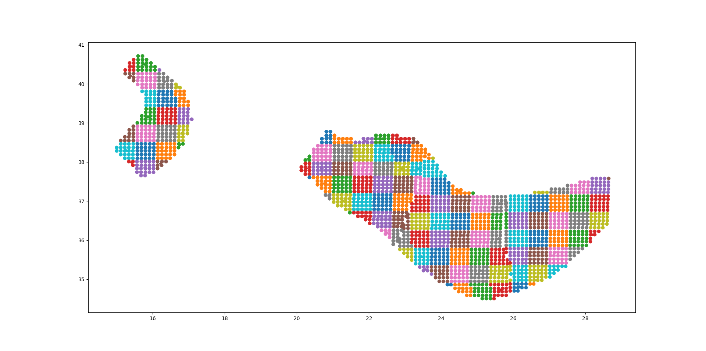

The point source gridding approximation
=================================================

WARNING: *the point source gridding approximation is used only in
classical calculations, not in event based calculations!*

Most hazard calculations are dominated by distributed seismicity, i.e.
area sources and multipoint sources that for the engine are just
regular point sources. In such situations the parameter governing the
performance is the grid spacing: a calculation with a grid spacing of
50 km produces 25 times less ruptures and it is expected to be 25
times faster than a calculation with a grid spacing of 10 km.

The *point source gridding approximation* is a smart way
of raising the grid spacing without losing too much precision and
without losing too much performance.

The idea is two use two kind of point sources: the original ones and a
set of "effective" ones (instances of the class
``CollapsedPointSource``) that essentially are the original sources averaged
on a larger grid, determined by the parameter ``ps_grid_spacing``.

The plot below should give the idea, the points being the original sources
and the squares with ~25 sources each being associated to the collapsed
sources:

For distant sites it is possible to use the large
grid (i.e. the CollapsePointSources) without losing much precision,
while for close points the original sources must be used.

The engine uses the parameter ``pointsource_distance``
to determine when to use the original sources and when to use the
collapsed sources.

If the ``maximum_distance`` has a value of 500 km and the
``pointsource_distance`` a value of 50 km, then (50/500)^2 = 1%
of the sites will be close and 99% of the sites will be far.
Therefore you will able to use the collapsed sources for
99% percent of the sites and a huge speedup is to big expected.

Application: making the Canada model 26x faster
------------------------------------------------

In order to give a concrete example, I ran the Canada 2015 model on 7 cities
by using the following ``site_model.csv`` file:

+----------------+------+-----+------+----------+----------+
| custom_site_id |  lon | lat | vs30 |    z1pt0 |    z2pt5 |
+----------------+------+-----+------+----------+----------+
| montre         |  -73 |  45 |  368 | 393.6006 | 1.391181 |
+----------------+------+-----+------+----------+----------+
| calgar         | -114 |  51 |  451 | 290.6857 | 1.102391 |
+----------------+------+-----+------+----------+----------+
| ottawa         |  -75 |  45 |  246 | 492.3983 | 2.205382 |
+----------------+------+-----+------+----------+----------+
| edmont         | -113 |  53 |  372 | 389.0669 | 1.374081 |
+----------------+------+-----+------+----------+----------+
| toront         |  -79 |  43 |  291 | 465.5151 | 1.819785 |
+----------------+------+-----+------+----------+----------+
| winnip         |  -97 |  50 |  229 | 499.7842 | 2.393656 |
+----------------+------+-----+------+----------+----------+
| vancou         | -123 |  49 |  600 | 125.8340 | 0.795259 |
+----------------+------+-----+------+----------+----------+

Notice that we are using a ``custom_site_id`` field to identify the cities.
This is possible only in engine versions >= 3.13, where ``custom_site_id``
has been extended to accept strings of at most 6 characters, while
before only integers were accepted (we could have used a zip code instead).

If no special approximations are used, the calculation is extremely
slow, since the model is extremely large. On the the GEM cluster (320
cores) it takes over 2 hours to process the 7 cities. The dominating
operation, as of engine 3.13, is "computing mean_std" which takes, in
total, 925,777 seconds split across the 320 cores, i.e. around 48
minutes per core. This is way too much and it would make impossible to
run the full model with ~138,000 sites. An analysis shows that the
calculation time is totally dominated by the point sources. Moreover,
the engine prints a warning saying that I should use the
``pointsource_distance`` approximation. Let's do so, i.e. let us set

``pointsource_distance = 50``

in the job.ini file. That alone triples the speed of the engine, and
the calculation times in "computing mean_std" goes down to 324,241 seconds,
i.e. 16 minutes per core, in average. An analysis of the hazard curves
shows that there is practically no difference between the original curves
and the ones computed with the approximation on::

  $ oq compare hcurves PGA <first_calc_id> <second_calc_id>
  There are no differences within the tolerances atol=0.001, rtol=0%, sids=[0 1 2 3 4 5 6]

However, this is not enough. We are still too slow to run the full model in
a reasonable amount of time. Enters the point source gridding. By setting

``ps_grid_spacing=50``

we can spectacularly reduce the calculation time to 35,974s, down by
nearly an order of magnitude! This time ``oq compare hcurves``
produces some differences on the last city but they are minor and not
affecting the hazard maps::

  $ oq compare hmaps PGA <first_calc_id> <third_calc_id>
  There are no differences within the tolerances atol=0.001, rtol=0%, sids=[0 1 2 3 4 5 6]

The following table collects the results:

+--------------------+-----------+----------------------+---------+
| operation          | calc_time | approx               | speedup |
+--------------------+-----------+----------------------+---------+
| computing mean_std | 925_777   | no approx            |      1x |
+--------------------+-----------+----------------------+---------+
| computing mean_std | 324_241   | pointsource_distance |      3x |
+--------------------+-----------+----------------------+---------+
| computing mean_std | 35_974    | ps_grid_spacing      |     26x |
+--------------------+-----------+----------------------+---------+

It should be noticed that if you have 130,000 sites it is likely that
there will be a few sites where the point source gridding
approximation gives results quite different for the exact results.
The commands ``oq compare`` allows you to figure out which are the
problematic sites, where they are and how big is the difference from
the exact results.

You should take into account that even the "exact" results
have uncertainties due to all kind of reasons, so even a large
difference can be quite acceptable. In particular if the hazard is
very low you can ignore any difference since it will have no impact on
the risk.

Points with low hazard are expected to have large differences, this is
why by default `oq compare` use an absolute tolerance of 0.001g, but
you can raise that to 0.01g or more.  You can also give a relative
tolerance of 10% or more. Internally ``oq compare`` calls the
function ``numpy.allclose`` see
https://numpy.org/doc/stable/reference/generated/numpy.allclose.html
for a description of how the tolerances work.

By increasing the ``pointsource_distance`` parameter and decreasing the
``ps_grid_spacing`` parameter one can make the approximation as
precise as wanted, at the expense of a larger runtime.

NB: the fact that the Canada model with 7 cities can be made 26 times
faster does not mean that the same speedup apply when you consider the full
130,000+ sites. A test with ``ps_grid_spacing=pointsource_distance=50``
gives a speedup of 7 times, which is still very significant.

How to determine the "right" value for the ``ps_grid_spacing`` parameter
------------------------------------------------------------------------

The trick is to run a sensitivity analysis on a reduced calculation.
Set in the job.ini something like this::

 sensitivity_analysis = {'ps_grid_spacing': [0, 20, 40, 60]}

and then run::

 $ OQ_SAMPLE_SITES=.01 oq engine --run job.ini

This will run sequentially 4 calculations with different values of the
``ps_grid_spacing``. The first calculation, the one with
``ps_grid_spacing=0``, is the exact calculation, with the approximation
disabled, to be used as reference.

Notice that setting the environment variable ``OQ_SAMPLE_SITES=.01``
will reduced by 100x the number of sites: this is essential in order to
make the calculation times acceptable in large calculations.

After running the 4 calculations you can compare the times by using
``oq show performance`` and the precision by using ``oq
compare``. From that you can determine which value of the
``ps_grid_spacing`` gives a good speedup with a decent
precision. Calculations with plenty of nodal planes and hypocenters
will benefit from lower values of ``ps_grid_spacing`` while
calculations with a single nodal plane and hypocenter for each source
will benefit from higher values of ``ps_grid_spacing``.

If you are interest only in speed and not in precision, you can set
``calculation_mode=preclassical``, run the sensitivity analysis in parallel
very quickly and then use the ``ps_grid_spacing`` value corresponding to
the minimum weight of the source model, which can be read from the
logs. Here is the trick to run the calculations in parallel::

 $ oq engine --multi --run job.ini -p calculation_mode=preclassical

And here is how to extract the weight information, in the example of
Alaska, with job IDs in the range 31692-31695::

 $ oq db get_weight 31692
 <Row(description=Alaska{'ps_grid_spacing': 0}, message=tot_weight=1_929_504, max_weight=120_594, num_sources=150_254)>
 $ oq db get_weight 31693
 <Row(description=Alaska{'ps_grid_spacing': 20}, message=tot_weight=143_748, max_weight=8_984, num_sources=22_727)>
 $ oq db get_weight 31694
 <Row(description=Alaska{'ps_grid_spacing': 40}, message=tot_weight=142_564, max_weight=8_910, num_sources=6_245)>
 $ oq db get_weight 31695
 <Row(description=Alaska{'ps_grid_spacing': 60}, message=tot_weight=211_542, max_weight=13_221, num_sources=3_103)>

The lowest weight is 142_564, corresponding to a ``ps_grid_spacing``
of 40km; since the weight is 13.5 times smaller than the weight for
the full calculation (1_929_504), this is the maximum speedup that we
can expect from using the approximation.

Note 1: the weighting algorithm changes at every release, so only relative
weights at a fixed release are meaningful. You should not expect to get
the same weight across engine releases.

Note 2: the precision and performance of the ``ps_grid_spacing`` approximation
change at every release: you should not expect to get the same numbers and
performance across releases for the same model with the same parameters.
