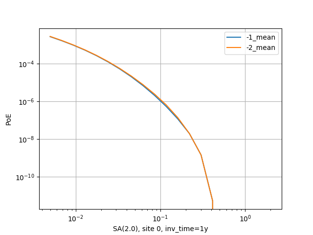

Site-specific classical calculations
==========================================

Starting from version 3.9, the engine offers some optimizations for
site specific classical calculations.

Rupture collapsing
--------------------------------------

If you have set the `pointsource_distance`
parameter in the job.ini, then the nodal plane distributions and hypocenter
distributions will be collapsed for far away ruptures, as we discussed
in the section about `common mistakes`_.

By setting ``collapse_level = 2`` one can get even a greater collapsing,
which for the moment is left undocumented.

There is a discussion of the mechanism in the
MultiPointClassicalPSHA demo. Here we will just show a plot displaying the
hazard curve without `pointsource_distance` (with ID=-2) and with
`pointsource_distance=200` km (with ID=-1). As you see they are nearly
identical but the second calculation is ten times faster.

.. _common mistakes: common-mistakes.rst
