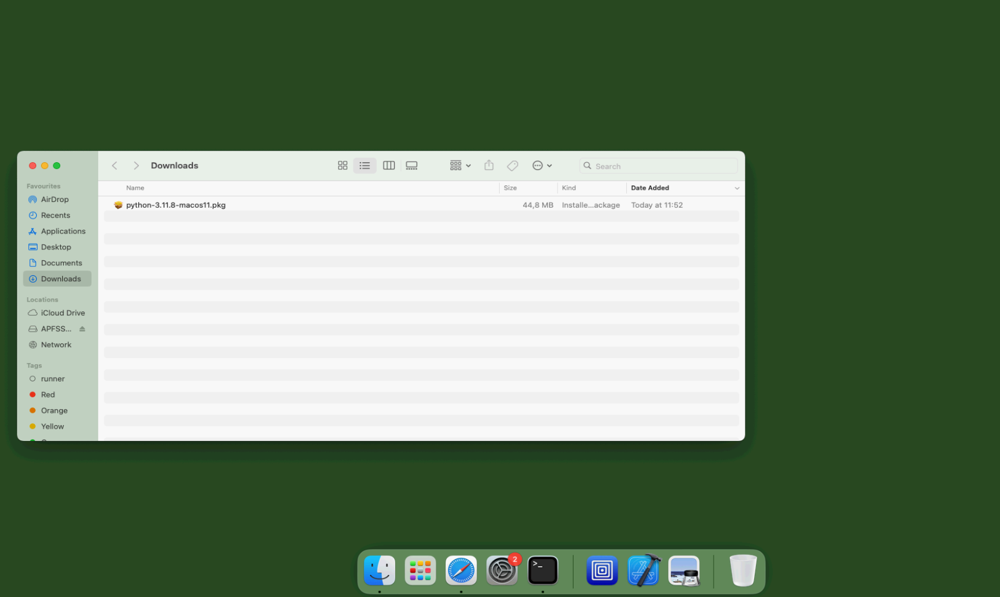
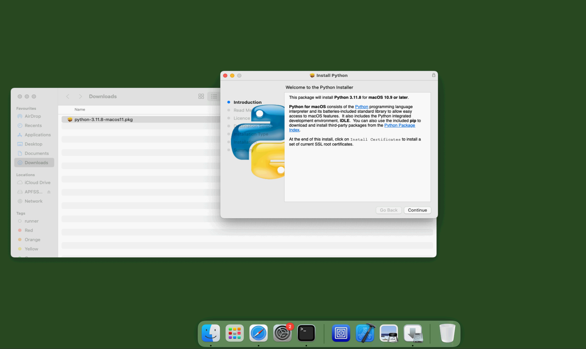
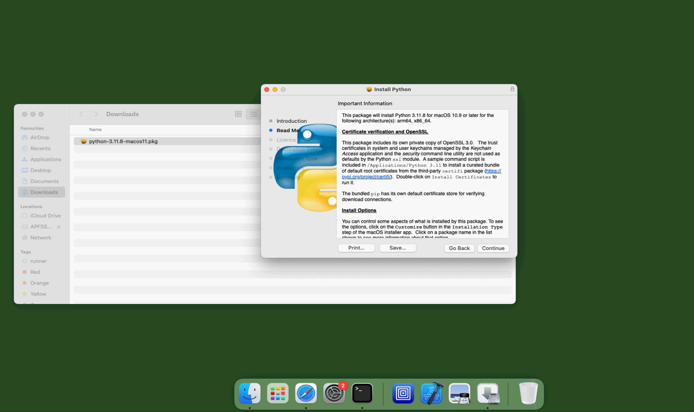
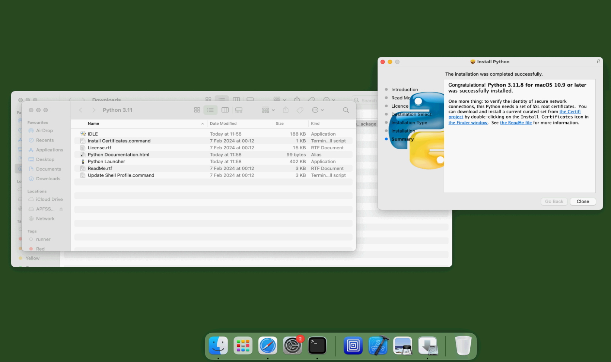
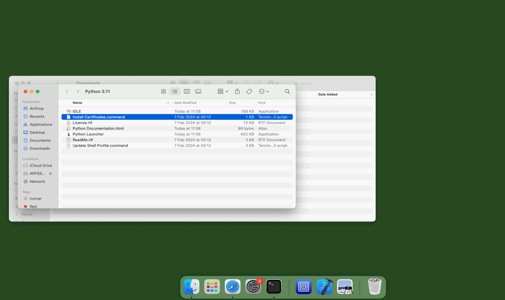
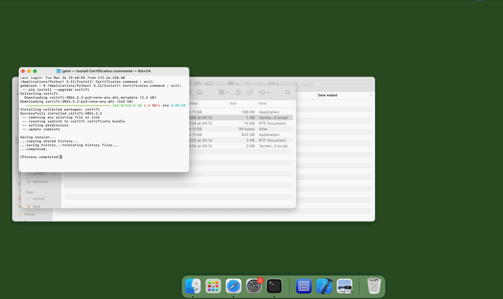

.. _macos:

Installing on MacOS
===================

Requirements
------------

Requirements are:

-  macOS Sequoia 15.7 or macOS Sonoma 14.6
-  at least 16 GB of RAM
-  4 GB of free disk space
-  Python 3.12

We recommend using a Linux server for large calculations such as
national or regional-scale models.

**Intel-based MacOS**  are not supported.

Installation Procedure of Python 3
----------------------------------

Before using the universal installer you need to install Python3.

Downloading the Python version from the official Python website (python.org) is the recommended method for installing Python on a Mac.

Download the installer from  https://www.python.org/ftp/python/3.11.8/python-3.11.8-macos11.pkg

The installation process is described in the following screenshots :

Localize the downloaded file on your computer (probably Downloads)

and double-click on the installer to start the installation.

IMPORTANT: Please note that the package includes its own private copy of OpenSSL 3.0.

The installer will walk you through a wizard to complete the installation, and in most cases, the default settings work well, so install it like the other applications on macOS. You may also have to enter your Mac password

IMPORTANT: Remember to double-click on Install Certificates to install it at the end of the installation

Close all windows after the process is completed.

Once Python 3.11 is installed, please see instructions for the :doc:`universal installer <universal>` script to install OpenQuake Engine

Getting help
------------

If you need help or have questions/comments/feedback for us, please
subscribe to the `OpenQuake users mailing
list <https://groups.google.com/g/openquake-users>`__
