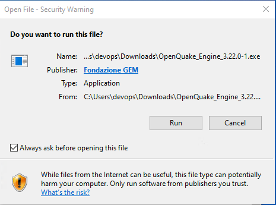
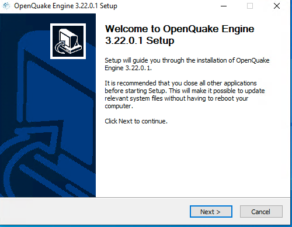
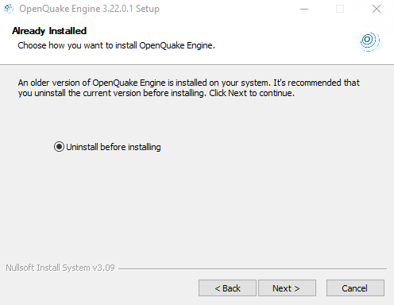
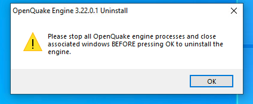
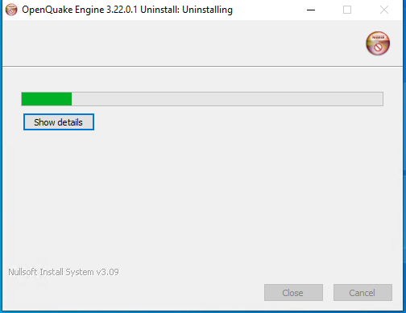
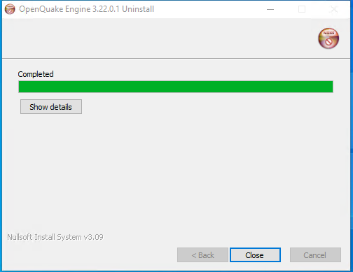
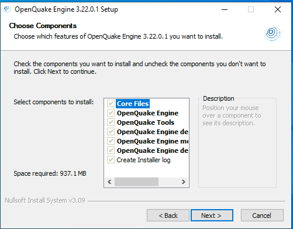
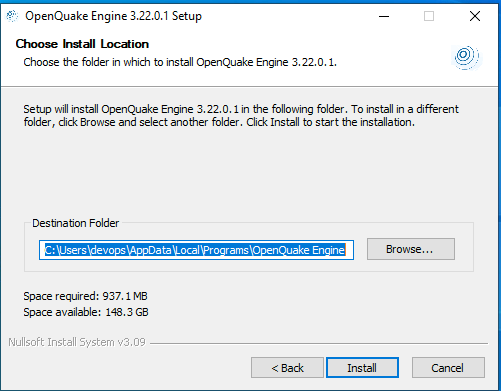
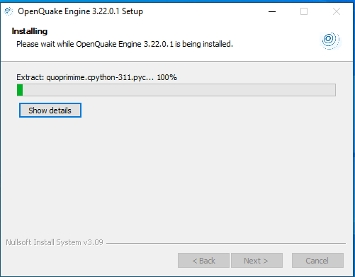
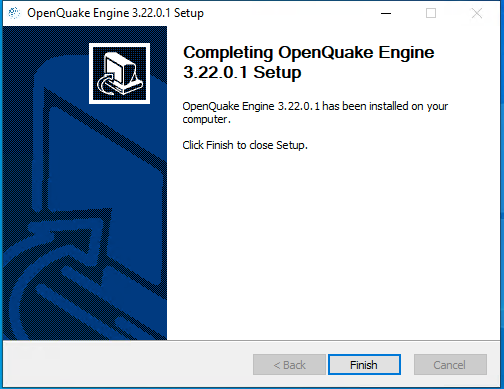

.. _windows:

Installing on Windows
=====================

The OpenQuake Engine can be installed on Windows with the :doc:`universal installer <universal>` script (recommended if you plan to develop GMPEs)
or with a traditional .exe installer which can be downloaded from
https://downloads.openquake.org/pkgs/windows/oq-engine/. 
The .exe installer includes Python 3.11 and all required dependencies and (since
version 3.19) does not require Windows administrator privileges.

Requirements
------------

Requirements are:

-  Windows 11 (64bit)
-  at least 16 GB of RAM (32GB recommended for Windows 11)
-  4 GB of free disk space

**Windows 7** and **Windows 8** and **Windows 10** are not supported.

We do not support server-side installation on Windows Server. 
In multi-user environments, each user must perform an individual installation (User or Developer installation).
We recommend using a Linux server for large calculations such as national or regional-scale models.

Installation Procedure
----------------------

Download the installer from
https://downloads.openquake.org/pkgs/windows/oq-engine/ Double-click on
the installer to start the installation. Depend on your PC settings it is 
possible to  be presented with a popup message similar to the one shown below:

As you can see the Publisher of the package is "Fondazione GEM" and you can click on the “Run” button to continue:

You will be presented with an installer dialog similar to the one depicted below:

Press the “Next” button.

The AGPL v3 license terms will be displayed - you must accept these
terms in order to install the OpenQuake engine:

.. image:: _images/windows/02_License.png

Press the “I Agree” button.

Uninstall Previously installed versions
---------------------------------------

If you have already installed a version of the OpenQuake Engine via the
Windows installer, you will be presented with a message similar to the
one depicted below:
Already installed

**IMPORTANT** even if you have installed the OpenQuake engine via the
universal installer, git or some other means, you must ensure that no
OpenQuake engine processes are running, that you do not have the User
Manual PDF or demo files open before proceeding. If any OpenQuake
processes are running or files are open, the installation may not
complete successfully.

If you do not have a previous installation of the OpenQuake Engine
installed, you can skip ahead to `Install OpenQuake Engine
Components <#install-components>`__

Press Next to continue. You will be presented with a reminder message:

Once you have stopped any running OpenQuake Engine processes and closed
all associated files, press OK to continue. The uninstaller will now
remove the previous OpenQuake engine installation. This may take some
time to complete:

Once finished, the uninstaller will look like this:

Press the “Close” button to close the uninstaller.

.. _install-components:

Install OpenQuake Engine Components
-----------------------------------

We are now ready to install the OpenQuake engine components:

Press the “Next” button to continue

It will now be possible to view and if necessary change the installation
location of the OpenQuake Engine. We recommend using the default value
unless you have a compelling reason to use something else - please note
that changing the installation location may make it more difficult to
provide support.

Press the “Install” button to continue.

The installer will now execute. This may take some time to complete.

Once the installer has completed. It will look something like this:

Press Finish to close the installer. You should now see two OpenQuake Engine icons on your Windows desktop:

.. image:: _images/windows/09_icons.png

It should also be possible to find the OpenQuake Engine by pressing the Windows key and typing “OpenQuake”:

Double-click the webui icon to start the OpenQuake Engine web user-interface. The first time the OpenQuake engine is executed, the initialization process may take several minutes to complete:

Once the webui is ready for use, a web browser tab will be opened:

Please refer to the :ref:`Web user-interface instructions <web-ui>` for more information about using the web-ui.

Getting help
------------

If you need help or have questions/comments/feedback for us, please
subscribe to the `OpenQuake users mailing
list <https://groups.google.com/g/openquake-users>`__
