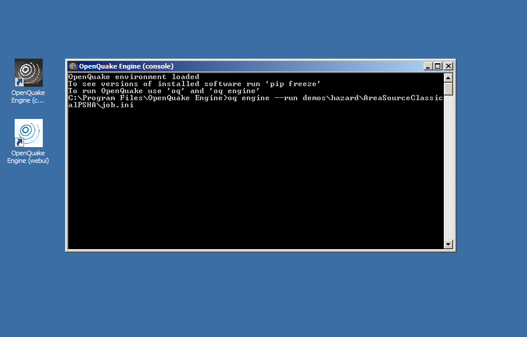
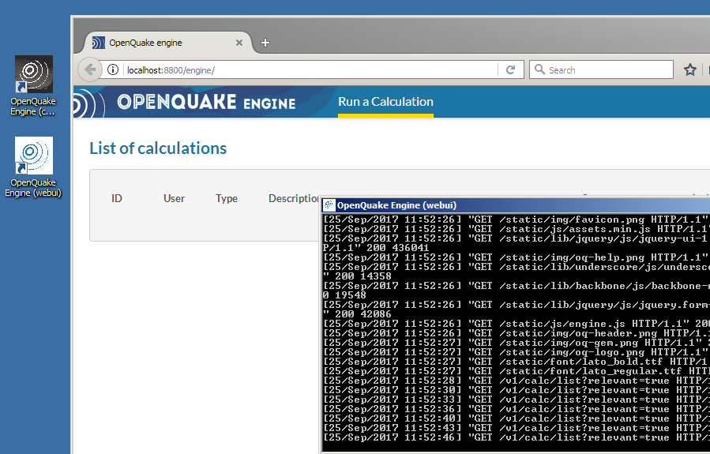

.. _windows:

Running the OpenQuake Engine on Windows
=======================================

The OpenQuake Engine on Windows can be run via a command line interface or a WebUI.

Running via command line interface (CLI)
----------------------------------------

Before running the OpenQuake Engine its environment must be loaded. Double click on the OpenQuake Engine (console) icon 
on the desktop or in the 'Start' menu. A command prompt will appear

The OpenQuake Engine command line tool is ``oq``. To run a calculation the command ``oq engine`` must be run.

There are several demo calculations included with the package. They are usually located in 
``C:\Program Files(x86)\OpenQuake Engine\demos\\``. The real path may actually vary based on where the Engine has been 
installed.

An example of running the ``AreaSourceClassicalPSHA`` demo::

	OpenQuake environment loaded
	The command 'oq-engine' is deprecated and will be removed. Please use 'oq engine' instead
	C:\Program Files(x86)\OpenQuake Engine>oq engine --run demos\hazard\AreaSourceClassicalPSHA\job.ini

The output should look something like this::

	[2016-06-14 16:47:35,202 #2 INFO] Using engine version 2
	[2016-06-14 16:47:35,333 #2 INFO] Read 528 hazard site(s)
	[2016-06-14 16:47:35,386 #2 INFO] Parsed 1 sources from C:\Programmi\OpenQuake Engine\demos\hazard\AreaSourceClassicalPSHA\source_model.xml
	[2016-06-14 16:47:35,491 #2 INFO] Processed source model 1/1 with 1 gsim path(s)
	[2016-06-14 16:47:35,546 #2 WARNING] Reducing the logic tree of source_model.xml from 1 to 0 realizations
	[2016-06-14 16:47:35,597 #2 INFO] Instantiated SourceManager with maxweight=5.5
	[2016-06-14 16:47:35,647 #2 INFO] Filtering light sources
	[2016-06-14 16:47:35,694 #2 INFO] Filtering heavy sources
	[2016-06-14 16:47:35,743 #2 INFO] splitting <AreaSource 1> of weight 41.0
	[2016-06-14 16:47:35,856 #2 INFO] Submitting task classical #1
	[2016-06-14 16:47:35,916 #2 INFO] Submitting task classical #2
	[2016-06-14 16:47:35,966 #2 INFO] Submitting task classical #3
	[2016-06-14 16:47:36,016 #2 INFO] Submitting task classical #4
	[2016-06-14 16:47:36,076 #2 INFO] Submitting task classical #5
	[2016-06-14 16:47:36,125 #2 INFO] Submitting task classical #6
	[2016-06-14 16:47:36,179 #2 INFO] Submitting task classical #7
	[2016-06-14 16:47:36,229 #2 INFO] Submitting task classical #8
	[2016-06-14 16:47:36,284 #2 INFO] Sent 205 sources in 8 block(s)
	[2016-06-14 16:47:36,360 #2 INFO] Sent 167.14 KB of data in 8 task(s)
	[2016-06-14 16:47:43,515 #2 INFO] classical  12%
	[2016-06-14 16:47:43,813 #2 INFO] classical  25%
	[2016-06-14 16:47:44,170 #2 INFO] classical  37%
	[2016-06-14 16:47:44,801 #2 INFO] classical  50%
	[2016-06-14 16:47:49,680 #2 INFO] classical  62%
	[2016-06-14 16:47:51,829 #2 INFO] classical  75%
	[2016-06-14 16:47:51,949 #2 INFO] classical  87%
	[2016-06-14 16:47:52,055 #2 INFO] classical 100%
	[2016-06-14 16:47:52,110 #2 INFO] Received 6.67 MB of data, maximum per task 853.96 KB
	[2016-06-14 16:47:59,660 #2 INFO] Calculation 2 finished correctly in 24 seconds
	  id | name
	   1 | hcurves
	   2 | hmaps
	   3 | uhs

To interrupt a running calculation simply press ``CTRL-C`` twice and close the command prompt window.

More commands
-------------

For a list of additional commands, type ``oq engine --help``.

Running via web interface (WebUI)
---------------------------------

To activate and load the OpenQuake Engine WebUI double click on the ``OpenQuake Engine (webui)`` icon on the desktop or in 
the 'Start' menu. A command prompt will appear. After few seconds a browser window will be opened pointing to the WebUI 
at http://localhost:8800.

Detailed information on how to drive the WebUI are available in :ref:`its manual <web-ui>`.

To stop the WebUI daemon just close the command prompt.