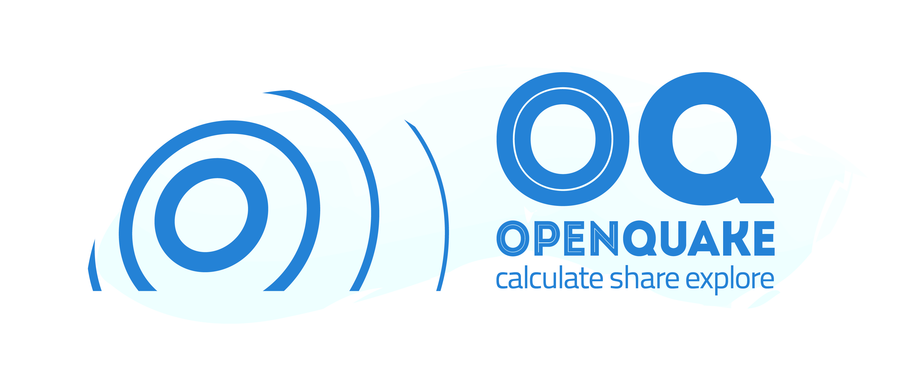

OpenQuake Engine Documentation (beta)|VERSION|
==============================================

OpenQuake engine is the seismic hazard and risk calculation software developed by the GEM 
Foundation. By following current standards in software developments like test-driven development 
and continuous integration, the OpenQuake engine aims at becoming an open, and community-driven 
tool for seismic hazard and risk analysis.

The source code of the OpenQuake engine is available on a public web-based repository at the 
following address: gem/oq-engine.

General overview
----------------

The OpenQuake Engine software provides calculation and assessment of seismic hazard, risk and 
decision-making tools via the data, methods and standards that are being developed by 
`Global Earthquake Model (GEM) Foundation <https://www.globalquakemodel.org/>`_ 
and its collaborators.

.. grid:: 2

    .. grid-item-card::  :ref:`getting-started`
	:text-align: center

	:octicon:`rocket;5em;sd-text-info`
	^^^

    .. grid-item-card::  :ref:`user-guide`
	:text-align: center

	:octicon:`book;5em;sd-text-info`
	^^^

.. grid:: 2

    .. grid-item-card::  :ref:`api-reference`
	:text-align: center

	:octicon:`codescan;5em;sd-text-info`
	^^^

    .. grid-item-card::  :ref:`underlying-science`
	:text-align: center

	:octicon:`archive;5em;sd-text-info`
	^^^

.. grid:: 2

    .. grid-item-card::  :ref:`release-notes`
	:text-align: center

	:octicon:`tag;5em;sd-text-info`
	^^^

    .. grid-item-card::  :ref:`contributing`
	:text-align: center

	:octicon:`people;5em;sd-text-info`
	^^^

Introductory video
------------------

The video below provides a basic introduction to the OpenQuake engine
and its capabilities:

.. youtube:: DDDzNDrf4bo
   :align: center

Additional information
----------------------

Contacts
********

- Support forum: https://groups.google.com/g/openquake-users
- X/Twitter: https://x.com/gem_devs

License
*******

This material is distributed under the Creative Common License
Attribution-NonCommercial- ShareAlike 3.0 Unported (`CC BY-NC-SA 3.0
<http://creativecommons.org/licenses/by-nc-sa/3.0/>`__). You
can share it with others as long as you provide proper credit, 
but you cannot change it in any way or use it commercially.

Disclaimer
**********

The material shared here is distributed in the hope that 
it will be useful, but without any warranty: without even the implied
warranty of merchantability or fitness for a particular purpose.
While every precaution has been taken in the preparation of this
material, in no event shall the authors and the GEM
Foundation be liable to any party for direct, indirect, special,
incidental, or consequential damages, including lost profits, arising
out of the use of information contained in this document or from the
use of programs and source code that may accompany it, even if the
authors and GEM Foundation have been advised of the possibility of
such damage. The Books provided hereunder are on as "as is" basis, and
the authors and GEM Foundation have no obligations to provide
maintenance, support, updates, enhancements, or modifications.

Thanks
******

See the list of `contributors <https://github.com/gem/oq-engine/blob/master/CONTRIBUTORS.txt>`_
and `sponsors <https://github.com/gem/oq-engine#thanks>`_.

.. toctree::
   :hidden:

   getting-started/index
   user-guide/index
   api-reference/index
   underlying-science/index
   release-notes/index
   contributing/index
