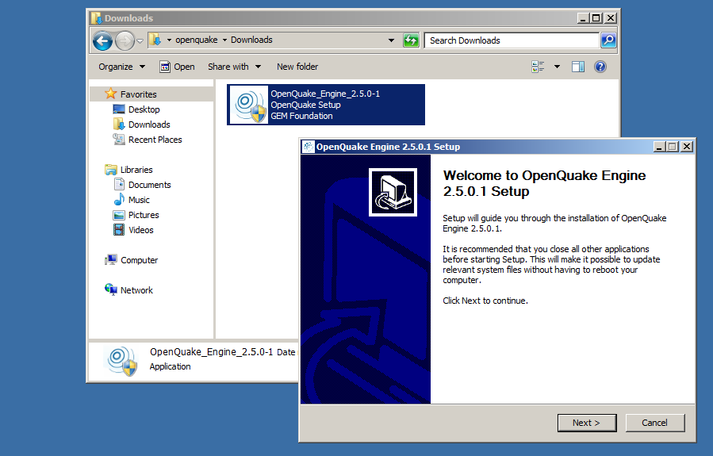
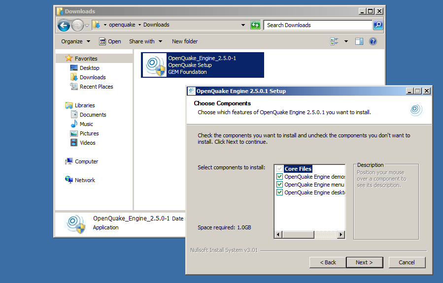
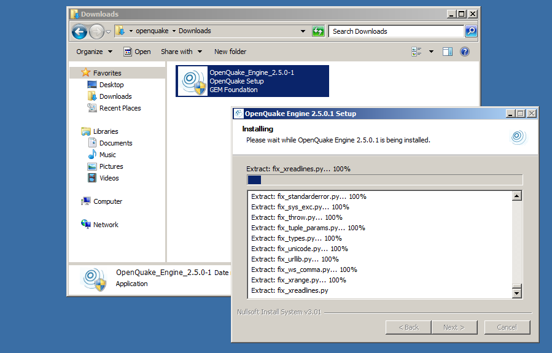

# Installing the OpenQuake Engine on Windows

The OpenQuake Engine is available for Windows in the form of **self-installable binary distribution**.

- this distribution includes its own distribution of the dependencies needed by the OpenQuake Engine
    - Python 3.6
    - Python dependencies (pip, numpy, scipy, h5py, django, shapely, rtree and few more)
- multiple versions can be installed alongside
- currently does not support Celery (and will never do)

## Requirements

Requirements are:

- One of the following editions of Windows
    - Windows 7 (64bit)
    - Windows 8 and 8.1 (64bit)
    - Windows 10 (64bit)
- 4 GB of RAM (8 GB recommended)
- 1.2 GB of free disk space

## Install or upgrade packages from the OpenQuake website

Download the installer from https://downloads.openquake.org/pkgs/windows/oq-engine/OpenQuake_Engine_3.2.0-1.exe using any browser and run the installer, then follow the wizard on screen.

## Run the OpenQuake Engine

Continue on [How to run the OpenQuake Engine](../running/windows.md)

***

## Getting help
If you need help or have questions/comments/feedback for us, you can:
  * Subscribe to the OpenQuake users mailing list: https://groups.google.com/forum/?fromgroups#!forum/openquake-users
  * Contact us on IRC: irc.freenode.net, channel #openquake
