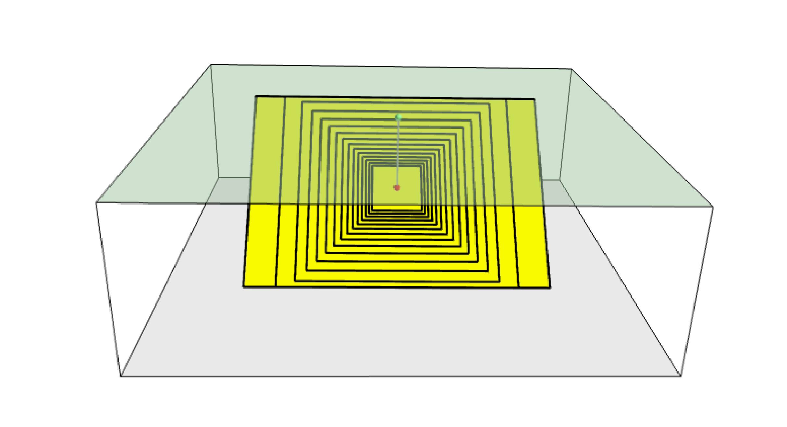
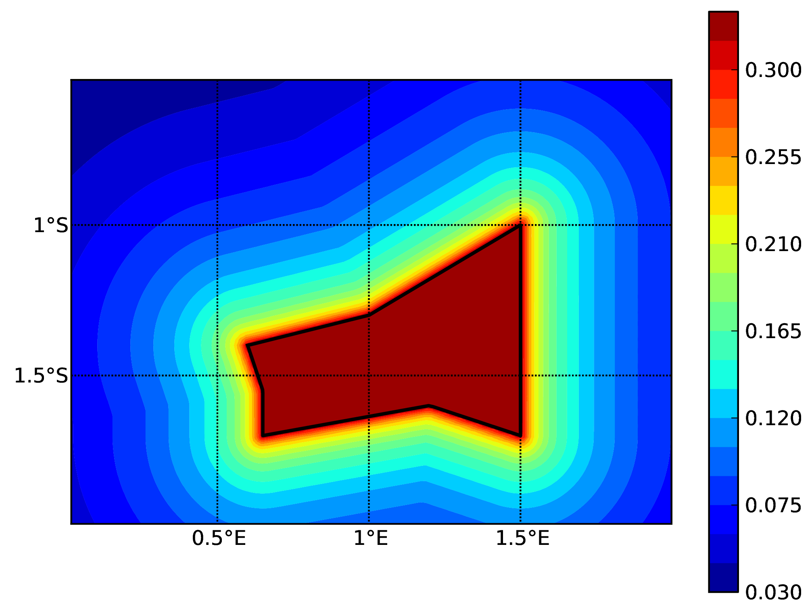
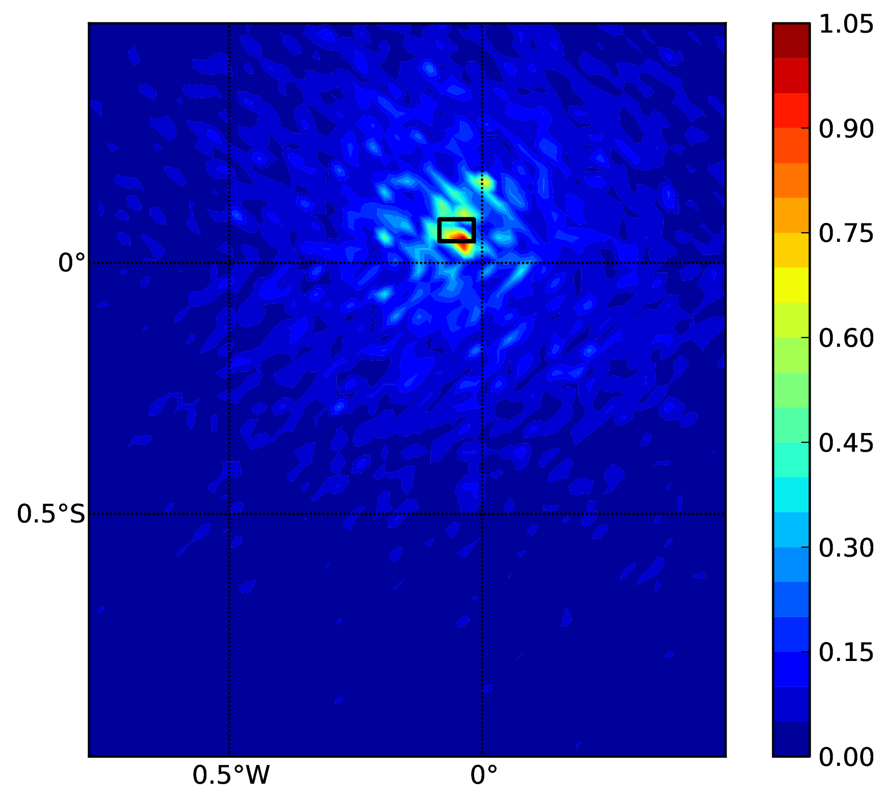

Hazard
======

.. _`chap:hazintro`:

Introduction to the Hazard Module
---------------------------------

The hazard component of the OpenQuake engine builds on top of the OpenQuake hazard library (oq-hazardlib), a
Python-based library containing tools for PSHA calculations.

| The web repository of this library is available at the following
  address:
| https://github.com/gem/oq-engine/tree/master/openquake/hazardlib.

In this section we briefly illustrate the main properties of the hazard
component of the OpenQuake engine. In particular, we will describe the main
typologies of sources supported and the main calculation workflows
available.

.. _Source typologies:

Source typologies 
^^^^^^^^^^^^^^^^^

An OpenQuake engine seismic source input model contains a list of sources 
belonging to a finite
set of possible typologies. Each source type is defined by a set of
parameters - called source data - which are used to specify the source
geometry and the properties of seismicity occurrence.

Currently the OpenQuake engine supports the following source types:

-  Sources for modelling distributed seismicity:

   -  *Point Source* - The elemental source type used to model distributed
      seismicity. Grid and area sources (described below) are different
      containers of point sources.

   -  *Area Source* - So far, the most frequently adopted source type in
      national and regional PSHA models.

   -  *Grid Source* - A replacement for area sources admitting spatially
      variable seismicity occurrence properties.

-  Fault sources with floating ruptures:

   -  *Simple Fault Source* - The simplest fault model in the OpenQuake engine. This
      source is habitually used to describe shallow seismogenic faults.

   -  *Complex Fault Source* - Often used to model subduction interface
      sources with a complex geometry.

-  Fault sources with ruptures always covering the entire fault surface:

   -  *Characteristic Fault Source* - A typology of source where ruptures always fill
      the entire fault surface.

   -  *Non-Parametric Source* - A typology of source representing a
      collection of ruptures, each with their associated probabilities
      of 0, 1, 2 ... occurrences in the investigation time

-  Sources for representing individual earthquake ruptures

   -  Planar fault rupture - an individual fault rupture represented as
      a single rectangular plane

   -  Multi-planar fault rupture - an individual rupture represented as
      a collection of rectangular planes

   -  Simple fault rupture - an individual fault rupture represented as
      a simple fault surface

   -  Complex fault rupture - an individual fault rupture represented as
      a complex fault surface

The OpenQuake engine contains some basic assumptions for the definition of these
source typologies:

-  In the case of area and fault sources, the seismicity is
   homogeneously distributed over the source;

-  Seismicity temporal occurrence follows a Poissonian model.

The above sets of sources may be referred to as “parametric” sources,
that is to say that the generation of the *Earthquake Rupture Forecast* is
done by the OpenQuake engine based on the parameters of the sources set
by the user. In some cases, particularly if the user wishes for the
temporal occurrence model to be non-Poissonian (such as the lognormal or
Brownian Passage Time models) a different type of behaviour is needed.
For this OpenQuake-engine supports a *Non-Parametric Source* in which the
*Earthquake Rupture Forecast* is provided explicitly by the user as a set of
ruptures and their corresponding probabilities of occurrence.

Source typologies for modelling distributed seismicity
~~~~~~~~~~~~~~~~~~~~~~~~~~~~~~~~~~~~~~~~~~~~~~~~~~~~~~
Point sources
_____________

.. figure:: figures/hazard/single_rupture.png
   :alt: Single rupture
   :name: fig:single_rupture
   :width: 95%

   Single rupture

The point source is the elemental source type adopted in the
OpenQuake-engine for modelling distributed seismicity. The OpenQuake engine
always performs calculations considering finite ruptures, even in the
case of point sources.

These are the basic assumptions used to generate ruptures with point
sources:

-  Ruptures have a rectangular shape

-  Rupture hypocenter is located in the middle of the rupture

-  Ruptures are limited at the top and at the bottom by two planes
   parallel to the sea level and placed at two characteristic depths
   named upper and lower seismogenic depths, respectively (see
   :numref:`fig:single_rupture`)

Source data
:::::::::::

For the definition of a point source the following parameters are
required (:numref:`fig:single_rupture` shows some of the
parameters described below, together with an example of the surface of a
generated rupture):

-  The coordinates of the point (i.e. longitude and latitude) [decimal
   degrees]

-  The upper and lower seismogenic depths [km]

-  One *Magnitude-Frequency Distribution*

-  One magnitude-scaling relationship

-  The rupture aspect ratio

-  A distribution of nodal planes i.e. one (or several) instances of the
   following set of parameters:

   -  strike [degrees]

   -  dip [degrees]

   -  rake [degrees]

-  A magnitude independent depth distribution of hypocenters [km].

:numref:`fig:point_source_multiple_ruptures` shows ruptures
generated by a point source for a range of magnitudes. Each rupture is
centered on the single hypocentral position admitted by this point
source. Ruptures are created by conserving the area computed using the
specified magnitude-area scaling relatioship and the corresponding value
of magnitude.

   Point source with multiple ruptures. Note the change in the aspect
   ratio once the rupture width fills the entire seismogenic layer.

Below we provide the excerpt of an .xml file used to describe the
properties of a point source. Note that in this example, ruptures occur
on two possible nodal planes and two hypocentral depths.
:numref:`fig:point_source_ruptures` shows the ruptures generated
by the point source.

.. container:: listing

   .. code:: xml
      :number-lines:

      <pointSource id="1" name="point" tectonicRegion="Stable Continental Crust">
           <pointGeometry>
               <gml:Point>
                   <gml:pos>-122.0 38.0</gml:pos>
               </gml:Point>
               <upperSeismoDepth>0.0</upperSeismoDepth>
               <lowerSeismoDepth>10.0</lowerSeismoDepth>
          </pointGeometry>
          <magScaleRel>WC1994</magScaleRel>
          <ruptAspectRatio>0.5</ruptAspectRatio>
          <truncGutenbergRichterMFD aValue="-3.5" bValue="1.0" minMag="5.0"
      		                      maxMag="6.5" />
          <nodalPlaneDist>
               <nodalPlane probability="0.3" strike="0.0" dip="90.0" rake="0.0" />
               <nodalPlane probability="0.7" strike="90.0" dip="45.0" rake="90.0" />
          </nodalPlaneDist>
          <hypoDepthDist>
              <hypoDepth probability="0.5" depth="4.0" />
              <hypoDepth probability="0.5" depth="8.0" />
          </hypoDepthDist>
      </pointSource>

.. figure:: figures/hazard/pointsrc_2strike_2hypodep.png
   :alt: Ruptures produced by the source created using the information in the example .xml file described on page .
   :name: fig:point_source_ruptures
   :width: 95%

   Ruptures produced by the source created using the information in the
   example .xml file described on page .

Grid sources
____________

A *Grid Source* is simply a collection of point sources distributed over a
regular grid (usually equally spaced in longitude and latitude). In *Probabilistic Seismic Hazard Analysis*
a grid source can be considered a model alternative to area sources,
since they both model distributed seismicity. Grid sources are generally
used to reproduce more faithfully the spatial pattern of seismicity
depicted by the earthquakes occurred in the past; in some models (e.g.
Petersen et al. (2008)) only events of low and intermediate magnitudes
are considered. They are frequently, though not always, computed using
seismicity smoothing algorithms (Frankel 1995; Woo 1996, amongst many
others).

The use of smoothing algorithms to produce grid sources brings some
advantages compared to area sources, since (1) it removes most of the
unavoidable degree of subjectivity due to the definition of the
geometries of the area sources and (2) it produces a spatial pattern of
seismicity that is usually closer to what observed in the reality.
Nevertheless, in many cases smoothing algorithms require an a-priori
definition of some setup parameters that expose the calculation to a
certain degree of partiality.

Grid sources are modeled in OpenQuake engine simply as a set of point sources; in
other words, a grid source is just a long list of point sources
specified as described in the previous section.

Area sources
____________

Area sources are usually adopted to describe the seismicity occurring
over wide areas where the identification and characterization - i.e. the
unambiguous definition of position, geometry and seismicity occurrence
parameters - of single fault structures is difficult.

From a computation standpoint, area sources are comparable to grid
sources since they are both represented in the engine by a list of point
sources.

The OpenQuake engine using the source data parameters (see below) creates an
equally spaced in distance grid of point sources where each point has
the same seismicity occurrence properties (i.e. rate of events
generated).

Below we provide a brief description of the parameters necessary to
completely describe an area source.

Source data
:::::::::::

-  A polygon defining the external border of the area (i.e. a list of
   Longitude-Latitude [degrees] tuples) The current version of the
   OQ-engine doesn’t support the definition of internal borders.

-  The upper and lower seismogenic depths [km]

-  One *Magnitude-Frequency Distribution*

-  One *Magnitude-Scaling Relationship*

-  The rupture aspect ratio

-  A distribution of nodal planes i.e. one (or several) instances of the
   following set of parameters

   -  strike [degrees]

   -  dip [degrees]

   -  rake [degrees]

-  A magnitude independent depth distribution of hypocenters [km].

Below we provide the excerpt of an .xml file used to describe the
properties of an area source. The ruptures generated by the area source
described in the example are controlled by two nodal planes and have
hypocenters at localized at two distinct depths.

.. container:: listing

   .. code:: xml
      :number-lines:

      <areaSource id="1" name="Quito" tectonicRegion="Active Shallow Crust">
          <areaGeometry>
            <gml:Polygon>
              <gml:exterior>
                <gml:LinearRing>
                  <gml:posList>
                    -122.5 37.5
                    -121.5 37.5
                    -121.5 38.5
                    -122.5 38.5
                  </gml:posList>
                </gml:LinearRing>
              </gml:exterior>
            </gml:Polygon>
            <upperSeismoDepth>0.0</upperSeismoDepth>
            <lowerSeismoDepth>10.0</lowerSeismoDepth>
          </areaGeometry>
          <magScaleRel>PeerMSR</magScaleRel>
          <ruptAspectRatio>1.5</ruptAspectRatio>
          <incrementalMFD minMag="6.55" binWidth="0.1">
              <occurRates>0.0010614989 8.8291627E-4 7.3437777E-4 6.108288E-4
                          5.080653E-4</occurRates>
          </incrementalMFD>
          <nodalPlaneDist>
              <nodalPlane probability="0.3" strike="0.0" dip="90.0" rake="0.0"/>
              <nodalPlane probability="0.7" strike="90.0" dip="45.0" rake="90.0"/>
          </nodalPlaneDist>
          <hypoDepthDist>
              <hypoDepth probability="0.5" depth="4.0" />
              <hypoDepth probability="0.5" depth="8.0" />
          </hypoDepthDist>
      </areaSource>

Fault sources with floating ruptures 
~~~~~~~~~~~~~~~~~~~~~~~~~~~~~~~~~~~~
Fault
sources in the OpenQuake engine are classified according to the method adopted to
distribute ruptures over the fault surface. Two options are currently
supported:

-  With the first option, ruptures with a surface lower than the whole
   fault surface are floated so as to cover as much as possible
   homogeneously the fault surface. This model is compatible with all
   the supported magnitude-frequency distributions.

-  With the second option, ruptures always fill the entire fault
   surface. This model is compatible with magnitude-frequency
   distributions similar to a characteristic model (à la (Schwartz and
   Coppersmith 1984)).

In this subsection we discuss the different fault source types that
support floating ruptures. In the next subsection we will illustrate the
fault typology available to model a characteristic rupturing behaviour.

.. _desc_simple_fault:

Simple Faults
_____________

Simple Faults are the most common source type used to model shallow
faults; the “simple” adjective relates to the geometry description of
the source which is obtained by projecting the fault trace (i.e. a
polyline) along a characteristic dip direction.

The parameters used to create an instance of this source type are
described in the following paragraph.

Source data
:::::::::::

-  A horizontal *Fault Trace* (usually a polyline). It is a list of
   longitude-latitude tuples [degrees].

-  A *Frequency-Magnitude Distribution*

-  A *Magnitude-Scaling Relationship*

-  A representative value of the dip angle (specified following the
   Aki-Richards convention; see Aki and Richards (2002)) [degrees]

-  Rake angle (specified following the Aki-Richards convention; see Aki
   and Richards (2002)) [degrees]

-  Upper and lower depth values limiting the seismogenic interval [km]

For near-fault probabilistic seismic hazard analysis, two additional
parameters are needed for characterising seismic sources:

-  A hypocentre list. It is a list of the possible hypocentral
   positions, and the corresponding weights, e.g., alongStrike="0.25"
   downDip="0.25" weight="0.25". Each hypocentral position is defined in
   relative terms using as a reference the upper left corner of the
   rupture and by specifying the fraction of rupture length and rupture
   width.

-  A slip list. It is a list of the possible rupture slip directions
   [degrees], and their corresponding weights. The angle describing each
   slip direction is measured counterclockwise using the fault strike
   direction as reference.

In near-fault PSHA calculations, the hypocentre list and the slip list
are mandatory. The weights in each list must always sum to one. The
available GMPE which currently supports the near-fault directivity PSHA
calculation in OQ- engine is the ChiouYoungs2014NearFaultEffect GMPE
developed by Brian S.-J. Chiou and Youngs (2014) (associated with an
``Active Shallow Crust`` tectonic region type).

We provide two examples of simple fault source files. The first is an
excerpt of an xml file used to describe the properties of a simple fault
source and the second example shows the excerpt of an xml file used to
describe the properties of a simple fault source that can be used to
perform a PSHA calculation taking into account directivity effects.

.. code:: xml
      :number-lines:

      <simpleFaultSource id="1" name="Mount Diablo Thrust"
              tectonicRegion="Active Shallow Crust">
            <simpleFaultGeometry>
                <gml:LineString>
                    <gml:posList>
                        -121.82290 37.73010
                        -122.03880 37.87710
                    </gml:posList>
                </gml:LineString>
                <dip>45.0</dip>
                <upperSeismoDepth>10.0</upperSeismoDepth>
                <lowerSeismoDepth>20.0</lowerSeismoDepth>
            </simpleFaultGeometry>
            <magScaleRel>WC1994</magScaleRel>
            <ruptAspectRatio>1.5</ruptAspectRatio>
            <incrementalMFD minMag="5.0" binWidth="0.1">
                <occurRates>0.0010614989 8.8291627E-4 7.3437777E-4 6.108288E-4
                            5.080653E-4</occurRates>
            </incrementalMFD>
            <rake>30.0</rake>
            <hypoList>
                <hypo alongStrike="0.25" downDip="0.25" weight="0.25"/>
                <hypo alongStrike="0.25" downDip="0.75" weight="0.25"/>
                <hypo alongStrike="0.75" downDip="0.25" weight="0.25"/>
                <hypo alongStrike="0.75" downDip="0.75" weight="0.25"/>
            </hypoList>
            <slipList>
                <slip weight="0.333">0.0</slip>
                <slip weight="0.333">45.0</slip>
                <slip weight="0.334">90.0</slip>
            </slipList>
      </simpleFaultSource>

.. code:: xml
   :number-lines:

   <simpleFaultSource id="1" name="Mount Diablo Thrust"
           tectonicRegion="Active Shallow Crust">
        <simpleFaultGeometry>
            <gml:LineString>
                <gml:posList>
                    -121.82290 37.73010
                    -122.03880 37.87710
                </gml:posList>
            </gml:LineString>
            <dip>45.0</dip>
            <upperSeismoDepth>10.0</upperSeismoDepth>
            <lowerSeismoDepth>20.0</lowerSeismoDepth>
        </simpleFaultGeometry>
        <magScaleRel>WC1994</magScaleRel>
        <ruptAspectRatio>1.5</ruptAspectRatio>
        <incrementalMFD minMag="5.0" binWidth="0.1">
            <occurRates>0.0010614989 8.8291627E-4 7.3437777E-4 6.108288E-4
                        5.080653E-4</occurRates>
        </incrementalMFD>
        <rake>30.0</rake>
        <hypoList>
            <hypo alongStrike="0.25" downDip="0.25" weight="0.25"/>
            <hypo alongStrike="0.25" downDip="0.75" weight="0.25"/>
            <hypo alongStrike="0.75" downDip="0.25" weight="0.25"/>
            <hypo alongStrike="0.75" downDip="0.75" weight="0.25"/>
        </hypoList>
        <slipList>
            <slip weight="0.333">0.0</slip>
            <slip weight="0.333">45.0</slip>
            <slip weight="0.334">90.0</slip>
        </slipList>
   </simpleFaultSource>

.. _desc_complex_fault:

Complex Faults
______________

A complex fault differs from simple fault just by the way the geometry
of the fault surface is defined and the fault surface is later created.
The input parameters used to describe complex faults are, for the most
part, the same used to describe the simple fault typology.

In the case of complex faults, the dip angle is not requested while the
fault trace is substituted by two fault edges limiting the top and
bottom of the fault surface. Additional curves lying over the fault
surface can be specified to complement and refine the description of the
fault surface geometry. Unlike the simple fault these edges are not
required to be horizontal and may vary in elevation, i.e. the upper edge
may represent the intersection between the exposed fault trace and the
topographic surface, where positive values indicate below sea level, and
negative values indicate above sea level.

Usually, we use complex faults to model intraplate megathrust faults
such as the big subduction structures active in the Pacific (Sumatra,
South America, Japan) but this source typology can be used also to
create - for example - listric fault sources with a realistic geometry.

.. code:: xml
   :number-lines:

   <complexFaultSource id="1" name="Cascadia Megathrust"
                       tectonicRegion="Subduction Interface">
       <complexFaultGeometry>
           <faultTopEdge>
               <gml:LineString>
                   <gml:posList>
                       -124.704  40.363  0.5493260E+01
                       -124.977  41.214  0.4988560E+01
                       -125.140  42.096  0.4897340E+01
                   </gml:posList>
               </gml:LineString>
           </faultTopEdge>
           <intermediateEdge>
               <gml:LineString>
                   <gml:posList>
                       -124.704  40.363  0.5593260E+01
                       -124.977  41.214  0.5088560E+01
                       -125.140  42.096  0.4997340E+01
                   </gml:posList>
               </gml:LineString>
           </intermediateEdge>
           <intermediateEdge>
               <gml:LineString>
                   <gml:posList>
                       -124.704  40.363  0.5693260E+01
                       -124.977  41.214  0.5188560E+01
                       -125.140  42.096  0.5097340E+01
                   </gml:posList>
               </gml:LineString>
           </intermediateEdge>
           <faultBottomEdge>
               <gml:LineString>
                   <gml:posList>
                       -123.829  40.347  0.2038490E+02
                       -124.137  41.218  0.1741390E+02
                       -124.252  42.115  0.1752740E+02
                   </gml:posList>
               </gml:LineString>
           </faultBottomEdge>
       </complexFaultGeometry>
       <magScaleRel>WC1994</magScaleRel>
       <ruptAspectRatio>1.5</ruptAspectRatio>
       <truncGutenbergRichterMFD aValue="-3.5" bValue="1.0" minMag="5.0"
                                 maxMag="6.5" />
       <rake>30.0</rake>
   </complexFaultSource>

As with the previous examples, the red text highlights the parameters
used to specify the source geometry, the parameters in green describe
the rupture mechanism, the text in blue describes the
magnitude-frequency distribution and the gray text describes the rupture
properties.

Fault sources without floating ruptures
~~~~~~~~~~~~~~~~~~~~~~~~~~~~~~~~~~~~~~~

.. _desc_characteristic_fault:

Characteristic faults
_____________________

The characteristic fault source is a particular typology of fault
created with the assumption that its ruptures will always cover the
entire fault surface. As such, no floating is necessary on the surface.
The characteristic fault may still take as input a magnitude frequency
distribution. In this case, the fault surface can be represented either
as a *Simple Fault Source* surface or as a *Complex Fault Source* surface or as
a combination of rectangular ruptures as represented in
:numref:`fig:char_fault_source`. Mutiple surfaces containing
mixed geometry types are also supported.

.. figure:: figures/hazard/multi_surface.png
   :alt: Geometry of a multi-segmented characteristic fault composed of four rectangular ruptures as modelled in OpenQuake.
   :name: fig:char_fault_source
   :width: 95%

   Geometry of a multi-segmented characteristic fault composed of four
   rectangular ruptures as modelled in OpenQuake.

Source data
:::::::::::

-  The characteristic rupture surface is defined through one of the
   following options:

   -  A list of rectangular ruptures (“planar surfaces”)

   -  A *Simple Fault Source* geometry

   -  A *Complex Fault Source* geometry

-  A *Frequency-Magnitude Distribution*.

-  Rake angle (specified following the Aki-Richards convention; see Aki
   and Richards (2002)).

-  Upper and lower depth values limiting the seismogenic interval.

A comprehensive example enumerating the possible rupture surface
configurations is shown below.

.. code:: xml
   :number-lines:
 
   <characteristicFaultSource id="5" name="characteristic source, simple fault"
                              tectonicRegion="Volcanic">
       <truncGutenbergRichterMFD aValue="-3.5" bValue="1.0"
                                 minMag="5.0" maxMag="6.5" />
       <rake>30.0</rake>
       <surface>
           <!-- Characteristic Fault with a simple fault surface -->
           <simpleFaultGeometry>
               <gml:LineString>
                   <gml:posList>
                       -121.82290 37.73010
                       -122.03880 37.87710
                   </gml:posList>
               </gml:LineString>
               <dip>45.0</dip>
               <upperSeismoDepth>10.0</upperSeismoDepth>
               <lowerSeismoDepth>20.0</lowerSeismoDepth>
           </simpleFaultGeometry>
       </surface>
   </characteristicFaultSource>

.. code:: xml
   :number-lines:

   <characteristicFaultSource id="6" name="characteristic source, complex fault"
                              tectonicRegion="Volcanic">
       <incrementalMFD minMag="5.0" binWidth="0.1">
           <occurRates>0.0010614989 8.8291627E-4 7.3437777E-4</occurRates>
       </incrementalMFD>
       <rake>60.0</rake>
       <surface>
           <!-- Characteristic source with a complex fault surface -->
           <complexFaultGeometry>
               <faultTopEdge>
                   <gml:LineString>
                       <gml:posList>
                          -124.704  40.363  0.5493260E+01
                          -124.977  41.214  0.4988560E+01
                          -125.140  42.096  0.4897340E+01
                       </gml:posList>
                   </gml:LineString>
               </faultTopEdge>
               <faultBottomEdge>
                   <gml:LineString>
                       <gml:posList>
                           -123.829  40.347  0.2038490E+02
                           -124.137  41.218  0.1741390E+02
                           -124.252  42.115  0.1752740E+02
                       </gml:posList>
                   </gml:LineString>
               </faultBottomEdge>
           </complexFaultGeometry>
       </surface>
   </characteristicFaultSource>

.. code:: xml
   :number-lines:

   <characteristicFaultSource id="7" name="characteristic source, multi surface"
                              tectonicRegion="Volcanic">
       <truncGutenbergRichterMFD aValue="-3.6" bValue="1.0"
                                 minMag="5.2" maxMag="6.4" />
       <rake>90.0</rake>
       <surface>
           <!-- Characteristic source with a collection of planar surfaces -->
           <planarSurface>
               <topLeft lon="-1.0" lat="1.0" depth="21.0" />
               <topRight lon="1.0" lat="1.0" depth="21.0" />
               <bottomLeft lon="-1.0" lat="-1.0" depth="59.0" />
               <bottomRight lon="1.0" lat="-1.0" depth="59.0" />
           </planarSurface>
           <planarSurface strike="20.0" dip="45.0">
                <topLeft lon="1.0" lat="1.0" depth="20.0" />
                <topRight lon="3.0" lat="1.0" depth="20.0" />
                <bottomLeft lon="1.0" lat="-1.0" depth="80.0" />
                <bottomRight lon="3.0" lat="-1.0" depth="80.0" />
            </planarSurface>
       </surface>
   </characteristicFaultSource>

Non-Parametric Sources
~~~~~~~~~~~~~~~~~~~~~~
Non-Parametric Fault
____________________

The non-parametric fault typology requires that the user indicates the
rupture properties (rupture surface, magnitude, rake and hypocentre) and
the corresponding probabilities of the rupture. The probabilities are
given as a list of floating point values that correspond to the
probabilities of :math:`0, 1, 2, \ldots ... N` occurrences of the
rupture within the specified investigation time. Note that there is not,
at present, any internal check to ensure that the investigation time to
which the probabilities refer corresponds to that specified in the
configuration file. As the surface of the rupture is set explicitly, no
rupture floating occurs, and, as in the case of the characteristic fault
source, the rupture surface can be defined as either a single planar
rupture, a list of planar ruptures, a *Simple Fault Source* geometry, a
*Complex Fault Source* geometry, or a combination of different geometries.

Comprehensive examples enumerating the possible configurations are shown
below:

.. code:: xml
   :number-lines:

   <nonParametricSeismicSource id="1" name="A Non Parametric Planar Source"
                               tectonicRegion="Some TRT">
       <singlePlaneRupture probs_occur="0.544 0.456">
           <magnitude>8.3</magnitude>
           <rake>90.0</rake>
           <hypocenter depth="26.101" lat="40.726" lon="143.0"/>
           <planarSurface>
               <topLeft depth="9.0" lat="41.6" lon="143.1"/>
               <topRight depth="9.0" lat="40.2" lon="143.91"/>
               <bottomLeft depth="43.202" lat="41.252" lon="142.07"/>
               <bottomRight depth="43.202" lat="39.852" lon="142.91"/>
           </planarSurface>
       </singlePlaneRupture>
       <multiPlanesRupture probs_occur="0.9244 0.0756">
           <magnitude>6.9</magnitude>
           <rake>0.0</rake>
           <hypocenter depth="7.1423" lat="35.296" lon="139.31"/>
           <planarSurface>
               <topLeft depth="2.0" lat="35.363" lon="139.16"/>
               <topRight depth="2.0" lat="35.394" lon="138.99"/>
               <bottomLeft depth="14.728" lat="35.475" lon="139.19"/>
               <bottomRight depth="14.728" lat="35.505" lon="139.02"/>
           </planarSurface>
           <planarSurface>
               <topLeft depth="2.0" lat="35.169" lon="139.34"/>
               <topRight depth="2.0" lat="35.358" lon="139.17"/>
               <bottomLeft depth="12.285" lat="35.234" lon="139.45"/>
               <bottomRight depth="12.285" lat="35.423" lon="139.28"/>
           </planarSurface>
       </multiPlanesRupture>
   </nonParametricSeismicSource>

.. code:: xml
   :number-lines:

   <nonParametricSeismicSource id="2" name="A Non Parametric (Simple) Source"
                               tectonicRegion="Some TRT">
       <simpleFaultRupture probs_occur="0.157 0.843">
           <magnitude>7.8</magnitude>
           <rake>90.0</rake>
           <hypocenter depth="22.341" lat="43.624" lon="147.94"/>
           <simpleFaultGeometry>
               <gml:LineString>
                   <gml:posList>
                       147.96 43.202
                       148.38 43.438
                       148.51 43.507
                       148.68 43.603
                       148.76 43.640
                   </gml:posList>
               </gml:LineString>
               <dip>30.0</dip>
               <upperSeismoDepth>14.5</upperSeismoDepth>
               <lowerSeismoDepth>35.5</lowerSeismoDepth>
           </simpleFaultGeometry>
       </simpleFaultRupture>
   </nonParametricSeismicSource>

.. code:: xml
   :number-lines:

   <nonParametricSeismicSource id="3" name="A Non Parametric (Complex) Source"
                               tectonicRegion="Some TRT">
       <complexFaultRupture probs_occur="0.157 0.843">
           <magnitude>7.8</magnitude>
           <rake>90.0</rake>
           <hypocenter depth="22.341" lat="43.624" lon="147.94"/>
           <complexFaultGeometry>
               <faultTopEdge>
                   <gml:LineString>
                       <gml:posList>
                           148.76 43.64 5.0
                           148.68 43.603 5.0
                           148.51 43.507 5.0
                           148.38 43.438 5.0
                           147.96 43.202 5.0
                       </gml:posList>
                   </gml:LineString>
               </faultTopEdge>
               <faultBottomEdge>
                  <gml:LineString>
                       <gml:posList>
                           147.92 44.002 35.5
                           147.81 43.946 35.5
                           147.71 43.897 35.5
                           147.5 43.803 35.5
                           147.36 43.727 35.5
                       </gml:posList>
                   </gml:LineString>
               </faultBottomEdge>
           </complexFaultGeometry>
       </complexFaultRupture>
   </nonParametricSeismicSource>

Magnitude-frequency distributions 
^^^^^^^^^^^^^^^^^^^^^^^^^^^^^^^^^
The magnitude-frequency distributions currently supported by the 
OpenQuake engine are the following:

A discrete incremental magnitude-frequency distribution
   It is the simplest distribution supported. It is defined by the
   minimum value of magnitude (representing the mid point of the first
   bin) and the bin width. The distribution itself is simply a sequence
   of floats describing the annual number of events for different bins.
   The maximum magnitude admitted by this magnitude-frequency
   distribution is just the sum of the minimum magnitude and the product
   of the bin width by the number annual rate values. Below we provide
   an example of the xml that should be incorporated in a seismic source
   description in order to define this Magnitude-Frequency Distribution.

   .. code:: xml
      :number-lines:

      <incrementalMFD minMag="5.05" binWidth="0.1">
          <occurRates>0.15 0.08 0.05 0.03 0.015</occurRates>
      </incrementalMFD>

   The magnitude-frequency distribution obtained with the above
   parameters is represented in
   :numref:`fig:evenly_discretized_mfd`.

   .. figure:: figures/hazard/ed_mfd.png
      :alt: Example of an incremental magnitude-frequency distribution.
      :name: fig:evenly_discretized_mfd
      :width: 95%

      Example of an incremental magnitude-frequency distribution.

A double truncated Gutenberg-Richter distribution
   This distribution is described by means of a minimum ``minMag`` and
   maximum magnitude ``maxMag`` and by the :math:`a` and :math:`b`
   values of the Gutenberg-Richter relationship.

   The syntax of the xml used to describe this magnitude-frequency
   distribution is rather compact as demonstrated in the following
   example:

   .. code:: xml
      :number-lines:

      <truncGutenbergRichterMFD aValue="5.0" bValue="1.0" minMag="5.0"
                                maxMag="6.0"/>

   :numref:`fig:dt_gr_mfd` shows the magnitude-frequency
   distribution obtained using the parameters of the considered example.

   .. figure:: figures/hazard/dt_mfd.png
      :alt: Example of a double truncated Gutenberg-Richter magnitude-frequency distribution.
      :name: fig:dt_gr_mfd
      :width: 95%

      Example of a double truncated Gutenberg-Richter
      magnitude-frequency distribution.

Hybrid Characteristic earthquake model (à la (Youngs and Coppersmith 1985))
   The hybrid characteristic earthquake model, presented by (Youngs and
   Coppersmith 1985), distributes seismic moment proportionally between
   a characteristic model (for larger magnitudes) and an exponential
   model. The rate of events is dependent on the magnitude of the
   characteristic earthquake, the b-value and the total moment rate of
   the system (:numref:`fig:yc_gr_mfd`). However, the total
   moment rate may be defined in one of two ways. If the total moment
   rate of the source is known, as may be the case for a fault surface
   with known area and slip rate, then the distribution can be defined
   from the total moment rate (in N-m) of the source directly.
   Alternatively, the distribution can be defined from the rate of
   earthquakes in the characteristic bin, which may be preferable if the
   distribution is determined from observed seismicity behaviour. The
   option to define the distribution according to the total moment rate
   is input as:

   .. code:: xml
      :number-lines:

      <YoungsCoppersmithMFD minmag="5.0" bValue="1.0" binWidth="0.1"
                            characteristicMag="7.0" totalMomentRate="1.05E19"/>

   whereas the option to define the distribution from the rate of the
   characteristic events is given as:

   .. code:: xml
      :number-lines:
   
      <YoungsCoppersmithMFD minmag="5.0" bValue="1.0" binWidth="0.1"
                            characteristicMag="7.0" characteristicRate="0.005"/>

   Note that in this distribution the width of the magnitude bin must be
   defined explicitly in the model.

   .. figure:: figures/hazard/yc_mfd_char_rate.png
      :alt: (Youngs and Coppersmith 1985) magnitude-frequency distribution.
      :name: fig:yc_gr_mfd
      :width: 95%

      (Youngs and Coppersmith 1985) magnitude-frequency distribution.

“Arbitrary” Magnitude Frequency Distribution
   The arbitrary magnitude frequency distribution is another
   non-parametric form of MFD, in which the rates are defined
   explicitly. Here, the magnitude frequency distribution is defined by
   a list of magnitudes and their corresponding rates of occurrence.
   There is no bin-width as the rates correspond exactly to the specific
   magnitude. Unlike the evenly discretised MFD, there is no requirement
   that the magnitudes be equally spaced. This distribution (illustrated
   in :numref:`fig:arb_mfd`) can be input as:

   .. code:: xml
      :number-lines:

      <arbitraryMFD>
          <occurRates>0.12 0.036 0.067 0.2</occurRates>
          <magnitudes>8.1 8.47 8.68 9.02</magnitude>
      </arbitraryMFD>

   .. figure:: figures/hazard/arb_mfd.png
      :alt: “Arbitrary” magnitude-frequency distribution.
      :name: fig:arb_mfd
      :width: 95%

      “Arbitrary” magnitude-frequency distribution.

Magnitude-scaling relationships 
^^^^^^^^^^^^^^^^^^^^^^^^^^^^^^^
We provide
below a list of the magnitude-area scaling relationships implemented in
the OpenQuake hazard library (oq-hazardlib):

Relationships for shallow earthquakes in active tectonic regions
~~~~~~~~~~~~~~~~~~~~~~~~~~~~~~~~~~~~~~~~~~~~~~~~~~~~~~~~~~~~~~~~

-  (Wells and Coppersmith 1994) - One of the most well known magnitude
   scaling relationships, based on a global database of historical
   earthquake ruptures. The implemented relationship is the one linking
   magnitude to rupture area, and is called with the keyword ``WC1994``

Magnitude-scaling relationships for subduction earthquakes
~~~~~~~~~~~~~~~~~~~~~~~~~~~~~~~~~~~~~~~~~~~~~~~~~~~~~~~~~~

-  (Strasser, Arango, and Bommer 2010) - Defines several magnitude
   scaling relationships for interface and in-slab earthquakes. Only the
   magnitude to rupture-area scaling relationships are implemented here,
   and are called with the keywords ``StrasserInterface`` and
   ``StrasserIntraslab`` respectively.

-  (Thingbaijam, Mai, and Goda 2017) - Define magnitude scaling
   relationships for interface. Only the magnitude to rupture-area
   scaling relationships are implemented here, and are called with the
   keywords ``ThingbaijamInterface``.

Magnitude-scaling relationships stable continental regions
~~~~~~~~~~~~~~~~~~~~~~~~~~~~~~~~~~~~~~~~~~~~~~~~~~~~~~~~~~

-  (EPRI 2011) - Defines a single magnitude to rupture-area scaling
   relationship for use in the central and eastern United States:
   :math:`Area = 10.0^{M_W - 4.336}`. It is called with the keyword
   ``CEUS2011``

Miscellaneous Magnitude-Scaling Relationships
~~~~~~~~~~~~~~~~~~~~~~~~~~~~~~~~~~~~~~~~~~~~~

-  ``PeerMSR`` defines a simple magnitude scaling relation used as part
   of the Pacific Earthquake Engineering Research Center verification of
   probabilistic seismic hazard analysis programs:
   :math:`Area = 10.0 ^{M_W - 4.0}`.

-  ``PointMSR`` approximates a ‘point’ source by returning an
   infinitesimally small area for all magnitudes. Should only be used
   for distributed seismicity sources and not for fault sources.

Calculation workflows 
^^^^^^^^^^^^^^^^^^^^^
The hazard component of
the OpenQuake engine can compute seismic hazard using various approaches. Three
types of analysis are currently supported:

-  *Classical Probabilistic Seismic Hazard Analysis (PSHA)*, allowing
   calculation of hazard curves and hazard maps following the classical
   integration procedure ((Cornell 1968), McGuire (1976)) as formulated
   by (Field, Jordan, and Cornell 2003).

-  *Event-Based Probabilistic Seismic Hazard Analysis*, allowing
   calculation of ground-motion fields from stochastic event sets.
   Traditional results - such as hazard curves - can be obtained by
   post- processing the set of computed ground-motion fields.

-  *Scenario Based Seismic Hazard Analysis*, allowing the calculation of ground motion 
   fields from a single earthquake rupture scenario taking into account ground motion
   aleatory variability. The ground motion fields can be conditioned to observed data,
   when available.

Each workflow has a modular structure, so that intermediate results can
be exported and analyzed. Each calculator can be extended independently
of the others so that additional calculation options and methodologies
can be easily introduced, without affecting the overall calculation
workflow.

Classical Probabilistic Seismic Hazard
~~~~~~~~~~~~~~~~~~~~~~~~~~~~~~~~~~~~~~
Analysis Input data for the classical *Probabilistic Seismic Hazard Analysis* consist of a PSHA input
model provided together with calculation settings.

The main calculators used to perform this analysis are the following:

#. *Logic Tree Processor*

   The Logic Tree Processor (LTP) takes as an input the *Probabilistic Seismic Hazard Analysis* Input
   Model and creates a Seismic Source Model. The LTP uses the
   information in the Initial Seismic Source Models and the Seismic
   Source Logic Tree to create a Seismic Source Input Model (i.e. a
   model describing geometry and activity rates of each source without
   any epistemic uncertainty).

   Following a procedure similar to the one just described the Logic
   Tree Processor creates a Ground Motion model (i.e. a data structure
   that associates to each tectonic region considered in the calculation
   a Ground Motion Prediction Equation).

#. *Earthquake Rupture Forecast Calculator*

   The produced Seismic Source Input Model becomes an input information
   for the Earthquake Rupture Forecast (ERF) calculator which creates a
   list earthquake ruptures admitted by the source model, each one
   characterized by a probability of occurrence over a specified time
   span.

#. *Classical PSHA Calculator*

   The classical PSHA calculator uses the ERF and the Ground Motion
   model to compute hazard curves on each site specified in the
   calculation settings.

Event-Based Probabilistic Seismic Hazard
~~~~~~~~~~~~~~~~~~~~~~~~~~~~~~~~~~~~~~~~
Analysis Input data for the Event-Based PSHA - as in the case of the
Classical *Probabilistic Seismic Hazard Analysis* calculator - consists of a PSHA Input Model and a set
of calculation settings.

The main calculators used to perform this analysis are:

#. *Logic Tree Processor*

   The Logic Tree Processor works in the same way described in the
   description of the Classical *Probabilistic Seismic Hazard Analysis* 
   workflow 
   (see Section  :ref:`Classical PSHA`).

#. *Earthquake Rupture Forecast Calculator*

   The Earthquake Rupture Forecast Calculator was already introduced in
   the description of the PSHA workflow 
   (see Section  :ref:`Classical PSHA`).

#. *Stochastic Event Set Calculator*

   The Stochastic Event Set Calculator generates a collection of
   stochastic event sets by sampling the ruptures contained in the ERF
   according to their probability of occurrence.

   A Stochastic Event Set (SES) thus represents a potential realisation
   of the seismicity (i.e. a list of ruptures) produced by the set of
   seismic sources considered in the analysis over the time span fixed
   for the calculation of hazard.

#. *Ground Motion Field Calculator*

   The Ground Motion Field Calculator computes for each event contained
   in a Stochastic Event Set a realization of the geographic
   distribution of the shaking by taking into account the aleatory
   uncertainties in the ground- motion model. Eventually, the Ground
   Motion Field calculator can consider the spatial correlation of the
   ground-motion during the generation of the Ground Motion Field.

#. *Event-based PSHA Calculator*

   The event-based PSHA calculator takes a (large) set of ground-motion
   fields representative of the possible shaking scenarios that the
   investigated area can experience over a (long) time span and for each
   site computes the corresponding hazard curve.

   This procedure is computationally intensive and is not recommended
   for investigating the hazard over large areas.

Scenario based Seismic Hazard Analysis 
~~~~~~~~~~~~~~~~~~~~~~~~~~~~~~~~~~~~~~
In case of Scenario Based Seismic Hazard Analysis, the engine simulates a set of 
ground motion fields (GMFs) at the target sites for the requested set of 
intensity measure types. This set of GMFs can then be used in 
:ref:`sec-scenario_damage_assessment` and :ref:`sec-config_scenario_risk`
to estimate the distribution of potential damage, economic losses, fatalities, 
and other consequences. The scenario calculator is useful for simulating 
both historical and hypothetical earthquakes.

In case of Scenario Based Seismic Hazard Analysis, 
The input data consist of a single earthquake rupture model and 
one or more ground-motion models (GSIMs). Using the Ground Motion
Field Calculator, multiple realizations of ground shaking can be
computed, each realization sampling the aleatory uncertainties in the
ground-motion model. The main calculator used to perform this analysis
is the *Ground Motion Field Calculator*, which was already introduced
during the description of the event based PSHA workflow (see
Section  :ref:`Event based PSHA`).

Starting from OpenQuake engine v3.16, it is possible to condition the
ground shaking to observations, such as ground motion recordings and 
macroseismic intensity observations. The simulated ground motion fields 
are cross-spatially correlated, and can reduce considerably the uncertainty 
and bias in the resulting loss and damage estimates.
The implementation of the conditioning of ground motion fields in the engine 
was performed following closely the procedure proposed by Engler et al. (2022).

As the scenario calculator does not need to determine the probability of
occurrence of the specific rupture, but only sufficient information to
parameterise the location (as a three-dimensional surface), the
magnitude and the style-of-faulting of the rupture, a more simplified
NRML structure is sufficient compared to the source model structures
described previously in :ref:`Source typologies`. 
A *rupture model* XML can be defined in the following formats:

#. *Simple Fault Rupture* - in which the geometry is defined by the
   trace of the fault rupture, the dip and the upper and lower
   seismogenic depths. An example is shown in 
   :ref:`the listing <lst:input_rupture_simple>` below:

   .. container:: listing

    .. code:: xml
       :number-lines:
       :name: lst:input_rupture_simple

             <?xml version='1.0' encoding='utf-8'?>
             <nrml xmlns:gml="http://www.opengis.net/gml"
                   xmlns="http://openquake.org/xmlns/nrml/0.5">

                 <simpleFaultRupture>
                   <magnitude>6.7</magnitude>
                   <rake>180.0</rake>
                   <hypocenter lon="-122.02750" lat="37.61744" depth="6.7"/>
                   <simpleFaultGeometry>
                     <gml:LineString>
                       <gml:posList>
                         -121.80236 37.39713
                         -121.91453 37.48312
                         -122.00413 37.59493
                         -122.05088 37.63995
                         -122.09226 37.68095
                         -122.17796 37.78233
                       </gml:posList>
                     </gml:LineString>
                     <dip>76.0</dip>
                     <upperSeismoDepth>0.0</upperSeismoDepth>
                     <lowerSeismoDepth>13.4</lowerSeismoDepth>
                   </simpleFaultGeometry>
                 </simpleFaultRupture>

             </nrml>

#. *Planar & Multi-Planar Rupture* - in which the geometry is defined as
   a collection of one or more rectangular planes, each defined by four
   corners. An example of a multi-planar rupture is shown below in
   :ref:`the listing <lst:input_rupture_multi_planes>` below:

   .. container:: listing

      .. code:: xml
         :name: lst:input_rupture_multi_planes
         :number-lines:

         <?xml version='1.0' encoding='utf-8'?>
         <nrml xmlns:gml="http://www.opengis.net/gml"
               xmlns="http://openquake.org/xmlns/nrml/0.5">

             <multiPlanesRupture>
                 <magnitude>8.0</magnitude>
                 <rake>90.0</rake>
                 <hypocenter lat="-1.4" lon="1.1" depth="10.0"/>
                     <planarSurface strike="90.0" dip="45.0">
                         <topLeft lon="-0.8" lat="-2.3" depth="0.0" />
                         <topRight lon="-0.4" lat="-2.3" depth="0.0" />
                         <bottomLeft lon="-0.8" lat="-2.3890" depth="10.0" />
                         <bottomRight lon="-0.4" lat="-2.3890" depth="10.0" />
                     </planarSurface>
                     <planarSurface strike="30.94744" dip="30.0">
                         <topLeft lon="-0.42" lat="-2.3" depth="0.0" />
                         <topRight lon="-0.29967" lat="-2.09945" depth="0.0" />
                         <bottomLeft lon="-0.28629" lat="-2.38009" depth="10.0" />
                         <bottomRight lon="-0.16598" lat="-2.17955" depth="10.0" />
                     </planarSurface>
             </multiPlanesRupture>

         </nrml>

#. *Complex Fault Rupture* - in which the geometry is defined by the
   upper, lower and (if applicable) intermediate edges of the fault
   rupture. An example of a complex fault rupture is shown below in
   :ref:`the listing <lst:input_rupture_complex>` below:

   .. container:: listing

      .. code:: xml
         :number-lines:
         :name: lst:input_rupture_complex

         <?xml version='1.0' encoding='utf-8'?>
         <nrml xmlns:gml="http://www.opengis.net/gml"
               xmlns="http://openquake.org/xmlns/nrml/0.5">

             <complexFaultRupture>
                 <magnitude>8.0</magnitude>
                 <rake>90.0</rake>
                 <hypocenter lat="-1.4" lon="1.1" depth="10.0"/>
                 <complexFaultGeometry>
                     <faultTopEdge>
                         <gml:LineString>
                             <gml:posList>
                                 0.6 -1.5 2.0
                                 1.0 -1.3 5.0
                                 1.5 -1.0 8.0
                             </gml:posList>
                         </gml:LineString>
                     </faultTopEdge>
                     <intermediateEdge>
                         <gml:LineString>
                             <gml:posList>
                                 0.65 -1.55 4.0
                                 1.1  -1.4  10.0
                                 1.5  -1.2  20.0
                             </gml:posList>
                         </gml:LineString>
                     </intermediateEdge>
                     <faultBottomEdge>
                         <gml:LineString>
                             <gml:posList>
                                 0.65 -1.7 8.0
                                 1.1  -1.6 15.0
                                 1.5  -1.7 35.0
                             </gml:posList>
                         </gml:LineString>
                     </faultBottomEdge>
                 </complexFaultGeometry>
             </complexFaultRupture>

         </nrml>

.. _`chap:hazinputs`:

Using the Hazard Module
-----------------------

This Chapter summarises the structure of the information necessary to
define a PSHA input model to be used with the OpenQuake engine.

Input data for probabilistic based seismic hazard analysis (Classical,
Event based, Disaggregation, and Uniform Hazard Spectra) are organised
into:

-  A general configuration file.

-  A file describing the Seismic Source System, that is the set of
   initial source models and associated epistemic uncertainties needed
   to model the seismic activity in the region of interest.

-  A file describing the Ground Motion System, that is the set of ground
   motion prediction equations, per tectonic region type, needed to
   model the ground motion shaking in the region of interest.

:numref:`fig:psha_input` summarises the structure of a PSHA
input model for the OpenQuake engine and the relationships between the different
files.

   PSHA Input Model structure

Defining Logic Trees 
^^^^^^^^^^^^^^^^^^^^
The main components of a
logic tree structure in the OpenQuake engine are the following:

*Branch*
   : the simplest component of a logic tree structure. A *Branch*
   represent a possible interpretation of a value assignment for a
   specific type of uncertainty. It is fully described by the tuple
   (parameter or model, weight).

*Branching set*
   : it is a key component in the logic tree structure used by the
   OpenQuake engine. It groups a set of branches i.e. alternative interpretations
   of a parameter or a model. Each branching set is defined by:

   -  An ID

   -  An uncertainty type (for a comprehensive list of the types of
      uncertainty currently supported see section 
      :ref:`Logic trees as described in the nrml schema`)

   -  One or more branches

   This set of uncertainties can be applied to the whole initial seismic
   source input model or just to a subset of seismic sources. The sum of
   the weights/probabilities assigned to the set of branches always
   correspond to one.

Below we provide a simple schema illustrating the skeleton of xml file
containing the desciption of a logic tree:

.. code:: xml
   :number-lines:

       <logicTreeBranchSet branchSetID=ID
                           uncertaintyType=TYPE>
           <logicTreeBranch>
               <uncertaintyModel>VALUE</uncertaintyModel>
               <uncertaintyWeight>WEIGHT</uncertaintyWeight>
           </logicTreeBranch>
       </logicTreeBranchSet>

As it appears from this example, the structure of a logic tree is a set
of nested elements.

A schematic representation of the elemental components of a logic tree
structure is provided in :numref:`glts`. A *Branch* set identifies
a collection of branches (i.e. individual branches) whose weights sum to
1.

.. figure:: figures/hazard/GenericLogicTreeStructure.png
   :alt: Generic Logic Tree structure as described in terms of *Branch* sets, and individual branches.
   :name: glts
   :width: 95%

   Generic Logic Tree structure as described in terms of *Branch* sets,
   and individual branches.

.. _Logic trees as described in the nrml schema:

Logic trees as described in the nrml schema
~~~~~~~~~~~~~~~~~~~~~~~~~~~~~~~~~~~~~~~~~~~

In the NRML schema, a logic tree structure is defined through the
``logicTree`` element:

.. code:: xml
   :number-lines:

   <logicTree logicTreeID="ID">
   ...
   </logicTree>

A ``logicTree`` contains as a sequence of ``logicTreeBranchSet``
elements.

There are no restrictions on the number of *Branch* set that can be
defined.

Each ``logicTreeBranchSet`` has two required attributes: ``branchSetID``
and ``uncertaintyType``. The latter defines the type of epistemic
uncertainty this *Branch* set is describing.

.. code:: xml
   :number-lines:

   <logicTree logicTreeID="ID">
   		<logicTreeBranchSet branchSetID="ID_1"
   			uncertaintyType="UNCERTAINTY_TYPE">
   			...
   		</logicTreeBranchSet>
   		<logicTreeBranchSet branchSetID="ID_2"
   			uncertaintyType="UNCERTAINTY_TYPE">
   			...
   		</logicTreeBranchSet>
   		...
   		<logicTreeBranchSet branchSetID="ID_N"
   			uncertaintyType="UNCERTAINTY_TYPE">
   			...
   		</logicTreeBranchSet>
   ...
   </logicTree>

Possible values for the ``uncertaintyType`` attribute are:

-  ``gmpeModel``: indicates epistemic uncertainties on ground motion
   prediction equations

-  ``sourceModel``: indicates epistemic uncertainties on source models

-  ``maxMagGRRelative``: indicates relative (i.e. increments) epistemic
   uncertainties to be added (or subtracted, depending on the sign of
   the increment) to the Gutenberg-Richter maximum magnitude value.

-  ``bGRRelative``: indicates relative epistemic uncertainties to be
   applied to the Gutenberg-Richter b value.

-  ``abGRAbsolute``: indicates absolute (i.e. values used to replace
   original values) epistemic uncertainties on the Gutenberg-Richter a
   and b values.

-  ``maxMagGRAbsolute``: indicates (absolute) epistemic uncertainties on
   the Gutenberg-Richter maximum magnitude.

-  ``incrementalMFDAbsolute``: indicates (absolute) epistemic
   uncertainties on the incremental magnitude frequency distribution
   (i.e. alternative rates and/or minimum magnitude) of a specific
   source (can only be applied to individual sources)

-  ``simpleFaultGeometryAbsolute``: indicates alternative
   representations of the simple fault geometry for an individual simple
   fault source

-  ``simpleFaultDipRelative``: indicates a relative increase or decrease
   in fault dip for one or more simple fault sources

-  ``simpleFaultDipAbsolute``: indicates alternative values of fault dip
   for one or more simple fault sources

-  ``complexFaultGeometryAbsolute``: indicates alternative
   representations of complex fault geometry for an individual complex
   fault source

-  ``characteristicFaultGeometryAbsolute``: indicates alternative
   representations of the characteristic fault geometry for an
   individual characteristic fault source

A ``branchSet`` is defined as a sequence of ``logicTreeBranch``
elements, each specified by an ``uncertaintyModel`` element (a string
identifying an uncertainty model; the content of the string varies with
the ``uncertaintyType`` attribute value of the branchSet element) and
the ``uncertaintyWeight`` element (specifying the probability/weight
associated to the uncertaintyModel):

.. code:: xml
   :number-lines:

   < logicTree  logicTreeID="ID">
   ...

   		< logicTreeBranchSet  branchSetID="ID_#"
   				uncertaintyType="UNCERTAINTY_TYPE">
   			< logicTreeBranch  branchID="ID_1">
   				<uncertaintyModel>
   				    UNCERTAINTY_MODEL
   				</uncertaintyModel>
   				<uncertaintyWeight>
   				    UNCERTAINTY_WEIGHT
   				</uncertaintyWeight>
   			</ logicTreeBranch >
   			...
   			< logicTreeBranch  branchID="ID_N">
   				<uncertaintyModel>
   				    UNCERTAINTY_MODEL
   				</uncertaintyModel>
   				<uncertaintyWeight>
   				    UNCERTAINTY_WEIGHT
   				</uncertaintyWeight>
   			</logicTreeBranch>
   		</logicTreeBranchSet>
   ...
   </logicTree >

Depending on the ``uncertaintyType`` the content of the
``<uncertaintyModel>`` element changes:

-  if ``uncertaintyType="gmpeModel"``, the uncertainty model contains
   the name of a ground motion prediction equation (a list of available
   GMPEs can be obtained using ``oq info gsims`` and these are also
   documented at:
   http://docs.openquake.org/oq-engine/stable/openquake.hazardlib.gsim.html):

   .. code:: xml

      <uncertaintyModel>GMPE_NAME</uncertaintyModel>

-  if ``uncertaintyType="sourceModel"``, the uncertainty model contains
   the paths to a source model file, e.g.:

   .. code:: xml
      :number-lines:

      <uncertaintyModel>SOURCE_MODEL_FILE_PATH</uncertaintyModel>

-  if ``uncertaintyType="maxMagGRRelative"``, the uncertainty model
   contains the increment to be added (or subtracted, depending on the
   sign) to the Gutenberg-Richter maximum magnitude:

   .. code:: xml

      <uncertaintyModel>MAX_MAGNITUDE_INCREMENT</uncertaintyModel>

-  if ``uncertaintyType="bGRRelative"``, the uncertainty model contains
   the increment to be added (or subtracted, depending on the sign) to
   the Gutenberg-Richter b value:

   .. code:: xml

      <uncertaintyModel>B_VALUE_INCREMENT</uncertaintyModel>

-  if ``uncertaintyType="abGRAbsolute"``, the uncertainty model must
   contain one a and b pair:

   .. code:: xml

      <uncertaintyModel>A_VALUE B_VALUE</uncertaintyModel>

-  if ``uncertaintyType="maxMagGRAbsolute"``, the uncertainty model must
   contain one Gutenberg-Richter maximum magnitude value:

   .. code:: xml

      <uncertaintyModel>MAX_MAGNITUDE</uncertaintyModel>

-  if ``uncertaintyType="incrementalMFDAbsolute"``, the uncertainty
   model must contain an instance of the incremental MFD node:

   .. code:: xml
      :number-lines:

      <uncertaintyModel>
          <incrementalMFD
              minMag="MIN MAGNITUDE"
              binWidth="BIN WIDTH">
              <occurRates>RATE_1 RATE_2 ... RATE_N</occurRates>
          </incrementalMFD>
      </uncertaintyModel>

-  if ``uncertaintyType="simpleFaultGeometryAbsolute"`` then the
   uncertainty model must contain a *valid* instance of the
   ``simpleFaultGeometry`` node as described in section
   :ref:`desc_simple_fault`

-  if ``uncertaintyType="simpleFaultDipRelative"`` then the uncertainty
   model must specify the number of degrees to increase (positive) or
   decrease (negative) the fault dip. Note that if this increase results
   in an adjusted fault dip greater than :math:`90^{\circ}` or less than
   :math:`0^{\circ}` an error will occur.

   .. code:: xml

      <uncertaintyModel>DIP_INCREMENT</uncertaintyModel>

-  if ``uncertaintyType="simpleFaultDipAbsolute"`` then the uncertainty
   model must specify the dip angle (in degrees)

   .. code:: xml

      <uncertaintyModel>DIP</uncertaintyModel>

-  if ``uncertaintyType="complexFaultGeometryAbsolute"`` then the
   uncertainty model must contain a *valid* instance of the
   ``complexFaultGeometry`` source node as described in section
   :ref:`desc_complex_fault`

-  if ``uncertaintyType="characteristicFaultGeometryAbsolute"`` then the
   uncertainty model must contain a *valid* instance of the
   ``characteristicFaultGeometry`` source node, as described in section
   :ref:`desc_characteristic_fault`

There are no restrictions on the number of ``logicTreeBranch`` elements
that can be defined in a ``logicTreeBranchSet``, as long as the
uncertainty weights sum to 1.0.

The ``logicTreeBranchSet`` element offers also a number of optional
attributes allowing for complex tree definitions:

-  ``applyToBranches``: specifies to which ``logicTreeBranch`` elements
   (one or more), in the previous *Branch* sets, the *Branch* set is linked
   to. The linking is established by defining the IDs of the branches to
   link to:

   ::

      applyToBranches="branchID1 branchID2 .... branchIDN"

   The default is the keyword ALL, which means that a *Branch* set is by
   default linked to all branches in the previous *Branch* set. By
   specifying one or more branches to which the *Branch* set links to,
   non- symmetric logic trees can be defined.

-  ``applyToSources``: specifies to which source in a source model the
   uncertainty applies to. Sources are specified in terms of their IDs:

   ::

      applyToSources="srcID1 srcID2 .... srcIDN"

-  ``applyToTectonicRegionType``: specifies to which tectonic region
   type the uncertainty applies to. Only one tectonic region type can be
   defined (``Active Shallow Crust``, ``Stable Shallow Crust``,
   ``Subduction Interface``, ``Subduction`` ``IntraSlab``,
   ``Volcanic``), e.g.:

   ::

      applyToTectonicRegionType="Active Shallow Crust"

The Seismic Source System 
^^^^^^^^^^^^^^^^^^^^^^^^^
The Seismic Source
System contains the model (or the models) describing position, geometry
and activity of seismic sources of engineering importance for a set of
sites as well as the possible epistemic uncertainties to be incorporated
into the calculation of seismic hazard.

The Seismic Source Logic Tree
~~~~~~~~~~~~~~~~~~~~~~~~~~~~~

The structure of the Seismic Source Logic Tree consists of at least one
*Branch Set*. The example provided below shows the simplest Seismic Source
Logic Tree structure that can be defined in a *Psha Input Model* for
OpenQuake engine. It’s a logic tree with just onebranchset with one *Branch* used
to define the initial seismic source model (its weight will be equal to
one).

.. container:: listing

   .. code:: xml
      :number-lines:

      <?xml version="1.0" encoding="UTF-8"?>
      <nrml xmlns:gml="http://www.opengis.net/gml"
            xmlns="http://openquake.org/xmlns/nrml/0.5">
          <logicTree logicTreeID="lt1">
                  <logicTreeBranchSet uncertaintyType="sourceModel"
                                      branchSetID="bs1">
                      <logicTreeBranch branchID="b1">
                          <uncertaintyModel>seismic_source_model.xml
                          </uncertaintyModel>
                          <uncertaintyWeight>1.0</uncertaintyWeight>
                      </logicTreeBranch>
                  </logicTreeBranchSet>
          </logicTree>
      </nrml>

The optional branching levels will contain rules that modify parameters
of the sources in the initial seismic source model.

For example, if the epistemic uncertainties to be considered are source
geometry and maximum magnitude, the modeller can create a logic tree
structure with three initial seismic source models (each one exploring a
different definition of the geometry of sources) and one branching level
accounting for the epistemic uncertainty on the maximum magnitude.

Below we provide an example of such logic tree structure. Note that the
uncertainty on the maximum magnitude is specified in terms of relative
increments with respect to the initial maximum magnitude defined for
each source in the initial seismic source models.

.. code:: xml
   :number-lines:

   <?xml version="1.0" encoding="UTF-8"?>
   <nrml xmlns:gml="http://www.opengis.net/gml"
         xmlns="http://openquake.org/xmlns/nrml/0.5">
       <logicTree logicTreeID="lt1">

               <logicTreeBranchSet uncertaintyType="sourceModel"
                                   branchSetID="bs1">
                   <logicTreeBranch branchID="b1">
                       <uncertaintyModel>seismic_source_model_A.xml
                       </uncertaintyModel>
                       <uncertaintyWeight>0.2</uncertaintyWeight>
                   </logicTreeBranch>
                   <logicTreeBranch branchID="b2">
                       <uncertaintyModel>seismic_source_model_B.xml
                       </uncertaintyModel>
                       <uncertaintyWeight>0.3</uncertaintyWeight>
                   </logicTreeBranch>
                   <logicTreeBranch branchID="b3">
                       <uncertaintyModel>seismic_source_model_C.xml
                       </uncertaintyModel>
                       <uncertaintyWeight>0.5</uncertaintyWeight>
                   </logicTreeBranch>
               </logicTreeBranchSet>

               <logicTreeBranchSet branchSetID="bs21"
                       uncertaintyType="maxMagGRRelative">
                   <logicTreeBranch branchID="b211">
                       <uncertaintyModel>+0.0</uncertaintyModel>
                       <uncertaintyWeight>0.6</uncertaintyWeight>
                   </logicTreeBranch>
                   <logicTreeBranch branchID="b212">
                       <uncertaintyModel>+0.5</uncertaintyModel>
                       <uncertaintyWeight>0.4</uncertaintyWeight>
                   </logicTreeBranch>
               </logicTreeBranchSet>

       </logicTree>
   </nrml>

Starting from OpenQuake engine v2.4, it is also possible to split a source model
into several files and read them as if they were a single file. The file
names for the different files comprising a source model should be
provided in the source model logic tree file. For instance, a source
model could be split by tectonic region using the following syntax in
the source model logic tree:

.. code:: xml
   :number-lines:
  
   <?xml version="1.0" encoding="UTF-8"?>
   <nrml xmlns:gml="http://www.opengis.net/gml"
         xmlns="http://openquake.org/xmlns/nrml/0.5">
       <logicTree logicTreeID="lt1">
               <logicTreeBranchSet uncertaintyType="sourceModel"
                                   branchSetID="bs1">
                   <logicTreeBranch branchID="b1">
                       <uncertaintyModel>
   		        active_shallow_sources.xml
   		        stable_shallow_sources.xml
                       </uncertaintyModel>
                       <uncertaintyWeight>1.0</uncertaintyWeight>
                   </logicTreeBranch>
               </logicTreeBranchSet>
       </logicTree>
   </nrml>

The Seismic Source Model
~~~~~~~~~~~~~~~~~~~~~~~~

The structure of the xml file representing the seismic source model
corresponds to a list of sources, each one modelled using one out of the
five typologies currently supported. Below we provide a schematic
example of a seismic source model:

.. container:: listing

   .. code:: xml
      :number-lines:

      <?xml version="1.0" encoding="UTF-8"?>
      <nrml xmlns:gml="http://www.opengis.net/gml"
            xmlns="http://openquake.org/xmlns/nrml/0.5">
          <logicTree logicTreeID="lt1">
                  <logicTreeBranchSet uncertaintyType="sourceModel"
                                      branchSetID="bs1">
                      <logicTreeBranch branchID="b1">
                          <uncertaintyModel>seismic_source_model.xml
                          </uncertaintyModel>
                          <uncertaintyWeight>1.0</uncertaintyWeight>
                      </logicTreeBranch>
                  </logicTreeBranchSet>
          </logicTree>
      </nrml>

The Ground Motion System
^^^^^^^^^^^^^^^^^^^^^^^^
The Ground Motion System defines the models and the possible epistemic 
uncertainties related to ground motion modelling to be incorporated into the
calculation.

.. _gmlt:

The Ground Motion Logic Tree
~~~~~~~~~~~~~~~~~~~~~~~~~~~~

The structure of the *Ground Motion Logic Tree* consists of a list of ground
motion prediction equations for each tectonic region used to
characterise the sources in the PSHA input model.

The example below in shows a simple *Ground Motion Logic Tree*. This logic tree assumes that all
the sources in the PSHA input model belong to “Active Shallow Crust” and
uses for calculation the B. S.-J. Chiou and Youngs (2008) Ground Motion Prediction Equation.

.. container:: listing

   .. code:: xml
      :name: Ground-Motion Logic Tree
      :number-lines:

      <?xml version="1.0" encoding="UTF-8"?>
      <nrml xmlns:gml="http://www.opengis.net/gml"
            xmlns="http://openquake.org/xmlns/nrml/0.5">
          <logicTree logicTreeID="lt1">
                  <logicTreeBranchSet uncertaintyType="gmpeModel"
                          branchSetID="bs1"
                          applyToTectonicRegionType="Active Shallow Crust">

                      <logicTreeBranch branchID="b1">
                          <uncertaintyModel>
                          ChiouYoungs2008
                          </uncertaintyModel>
                          <uncertaintyWeight>1.0</uncertaintyWeight>
                      </logicTreeBranch>

                  </logicTreeBranchSet>
          </logicTree>
      </nrml>

.. _sec-hazard_configuration_file:

Configuration file 
^^^^^^^^^^^^^^^^^^
The configuration file is
the primary file controlling both the definition of the input model as
well as parameters governing the calculation. We illustrate in the
following different examples of the configuration file addressing
different types of seismic hazard calculations.

.. _Classical PSHA:

Classical PSHA 
~~~~~~~~~~~~~~
In the following we describe the overall structure and the most typical
parameters of a configuration file to be used for the computation of a
seismic hazard map using a classical PSHA methodology.

**Calculation type and model info**

.. code:: ini
   :number-lines: 1

   [general]
   description = A demo OpenQuake-engine .ini file for classical PSHA
   calculation_mode = classical
   random_seed = 1024

In this section the user specifies the following parameters:

-  ``description``: a parameter that can be used to designate the model

-  ``calculation_mode``: it is used to set the kind of calculation. In
   this case it corresponds to ``classical``. Alternative options for
   the calculation_mode are described later in this manual.

-  ``random_seed``: is used to control the random generator so that when
   Monte Carlo procedures are used calculations are replicable (if the
   same ``random_seed`` is used you get exactly the same results).

**Geometry of the area (or the sites) where hazard is computed**

This section is used to specify where the hazard will be computed. Two
options are available:

The first option is to define a polygon (usually a rectangle) and a
distance (in km) to be used to discretize the polygon area. The polygon
is defined by a list of longitude-latitude tuples.

An example is provided below:

.. code:: ini
   :number-lines: 5

   [geometry]
   region = 10.0 43.0, 12.0 43.0, 12.0 46.0, 10.0 46.0
   region_grid_spacing = 10.0

The second option allows the definition of a number of sites where the
hazard will be computed. Each site is specified in terms of a longitude,
latitude tuple. Optionally, if the user wants to consider the elevation
of the sites, a value of depth [km] can also be specified, where
positive values indicate below sea level, and negative values indicate
above sea level (i.e. the topographic surface). If no value of depth is
given for a site, it is assumed to be zero. An example is provided
below:

.. code:: ini
   :number-lines: 8

   [geometry]
   sites = 10.0 43.0, 12.0 43.0, 12.0 46.0, 10.0 46.0

If the list of sites is too long the user can specify the name of a csv
file as shown below:

.. code:: ini
   :number-lines: 10

   [geometry]
   sites_csv = <name_of_the_csv_file>

The format of the csv file containing the list of sites is a sequence of
points (one per row) specified in terms of the longitude, latitude
tuple. Depth values are again optional. An example is provided below:

.. code:: text

   179.0,90.0
   178.0,89.0
   177.0,88.0

**Logic tree sampling**

The OpenQuake engine provides two options for processing the whole logic tree
structure. The first option uses Montecarlo sampling; the user in this
case specifies a number of realizations.

In the second option all the possible realizations are created. Below we
provide an example for the latter option. In this case we set the
``number_of_logic_tree_samples`` to 0. OpenQuake engine will perform a complete
enumeration of all the possible paths from the roots to the leaves of
the logic tree structure.

.. code:: ini
   :number-lines: 12

   [logic_tree]
   number_of_logic_tree_samples = 0

If the seismic source logic tree and the ground motion logic tree do not
contain epistemic uncertainties the engine will create a single PSHA
input.

**Generation of the earthquake rupture forecast**

.. code:: ini
   :number-lines: 14

   [erf]
   rupture_mesh_spacing = 5
   width_of_mfd_bin = 0.1
   area_source_discretization = 10

This section of the configuration file is used to specify the level of
discretization of the mesh representing faults, the grid used to
delineate the area sources and, the magnitude-frequency distribution.
Note that the smaller is the mesh spacing (or the bin width) the larger
are (1) the precision in the calculation and (2) the computation demand.

In cases where the source model may contain a mixture of simple and
complex ruptures it is possible to define a different rupture mesh
spacing for complex faults only. This may be helpful in models that
permit floating ruptures over large subduction sources, in which the
nearest source to site distances may be larger than 20 - 30 km, and for
which a small mesh spacing would produce a very large number of
ruptures. The spacing for complex faults only can be configured by the
line:

.. code:: ini
   :number-lines: 18

   complex_fault_mesh_spacing = 10

**Parameters describing site conditions**

.. code:: ini
   :number-lines: 18

   [site_params]
   reference_vs30_type = measured
   reference_vs30_value = 760.0
   reference_depth_to_2pt5km_per_sec = 5.0
   reference_depth_to_1pt0km_per_sec = 100.0

In this section the user specifies local soil conditions. The simplest
solution is to define uniform site conditions (i.e. all the sites have
the same characteristics).

Alternatively it is possible to define spatially variable soil
properties in a separate file; the engine will then assign to each
investigation location the values of the closest point used to specify
site conditions.

.. code:: ini
   :number-lines: 23

   [site_params]
   site_model_file = site_model.csv

The file containing the site model has the following structure:

.. container:: listing

   .. code:: xml

      lon,lat,vs30,z1pt0,z2pt5,vs30measured,backarc
      10.0,40.0,800.0,19.367196734,0.588625072259,0,0
      10.1,40.0,800.0,19.367196734,0.588625072259,0,0
      10.2,40.0,800.0,19.367196734,0.588625072259,0,0
      10.3,40.0,800.0,19.367196734,0.588625072259,0,0
      10.4,40.0,800.0,19.367196734,0.588625072259,0,0

Notice that the :math:`0` for the field ``vs30measured`` means that the
``vs30`` field is inferred, not measured. Most of the GMPEs are not
sensitive to it, so you can usually skip it. For the ``backarc``
parameter :math:`0` means false and this is the default, so you can skip
such column. All columns that have defaults or are not needed by the
GMPEs you are using can be skipped, while you will get an error if a
relevant column is missing.

If the closest available site with soil conditions is at a distance
greater than 5 km from the investigation location, a warning is
generated.

**Note:** For backward-compatibility reasons, the site model file can
also be given in XML format. That old format is deprecated but there are
no plans to remove it any soon.

**Calculation configuration**

.. code:: ini
   :number-lines: 25

   [calculation]
   source_model_logic_tree_file = source_model_logic_tree.xml
   gsim_logic_tree_file = gmpe_logic_tree.xml
   investigation_time = 50.0
   intensity_measure_types_and_levels = {"PGA": [0.005, ..., 2.13]}
   truncation_level = 3
   maximum_distance = 200.0

This section of the OpenQuake engine configuration file specifies the parameters
that are relevant for the calculation of hazard. These include the names
of the two files containing the Seismic Source System and the Ground
Motion System, the duration of the time window used to compute the
hazard, the ground motion intensity measure types and levels for which
the probability of exceedence will be computed, the level of truncation
of the Gaussian distribution of the logarithm of ground motion used in
the calculation of hazard and the maximum integration distance (i.e. the
distance within which sources will contribute to the computation of the
hazard).

The maximum distance refers to the largest distance between a rupture
and the target calculation sites in order for the rupture to be
considered in the PSHA calculation. This can be input directly in terms
of kilometres (as above). There may be cases, however, in which it may
be appropriate to have a different maximum source to site distance
depending on the tectonic region type. This may be used, for example, to
eliminate the impact of small, very far-field sources in regions of high
attenuation (in which case maximum distance is reduced), or conversely
it may be raised to allow certain source types to contribute to the
hazard at greater distances (such as in the case when the region has
lower attenuation). An example configuration for a maximum distance in
Active Shallow Crust of 150 km, and in Stable Continental Crust of 200
km, is shown below:

.. code:: ini
   :number-lines: 31

   maximum_distance = {'Active Shallow Crust': 150.0,
                       'Stable Continental Crust': 200.0}

**Output**

.. code:: ini
   :number-lines: 31

   [output]
   export_dir = outputs/
   # given the specified `intensity_measure_types_and_levels`
   mean = true
   quantiles = 0.1 0.5 0.9
   uniform_hazard_spectra = false
   poes = 0.1

The final section of the configuration file is the one that contains the
parameters controlling the types of output to be produced. Providing an
export directory will tell OpenQuake where to place the output files
when the ``--exports`` flag is used when running the program. Setting
``mean`` to true will result in a specific output containing the mean
curves of the logic tree, likewise ``quantiles`` will produce separate
files containing the quantile hazard curves at the quantiles listed
(0.1, 0.5 and 0.9 in the example above, leave blank or omit if no
quantiles are required). Setting ``uniform_hazard_spectra`` to true will
output the uniform hazard spectra at the same probabilities of
exceedence (poes) as those specified by the later option ``poes``. The
probabilities specified here correspond to the set investigation time.
Specifying poes will output hazard maps. For more information about the
outputs of the calculation, see the section: “Description of hazard
outputs”.

Seismic hazard disaggregation 
~~~~~~~~~~~~~~~~~~~~~~~~~~~~~
In this
section we describe the structure of the configuration file to be used
to complete a seismic hazard disaggregation. Since only a few parts of
the standard configuration file need to be changed we can use the
description given in Section  :ref:`Classical PSHA`
as a reference and we emphasize herein major differences.

.. code:: ini
   :number-lines: 1

   [general]
   description = A demo .ini file for PSHA disaggregation
   calculation_mode = disaggregation
   random_seed = 1024

The calculation mode parameter in this case is set as
``disaggregation``.

**Geometry of the area (or the sites) where hazard is computed**

.. code:: ini
   :number-lines: 5

   [geometry]
   sites = 11.0 44.5

In the section it is necessary to specify the geographic coordinates of
the site(s) where the disaggregation will be performed. The coordinates
of multiple site should be separated with a comma.

**Disaggregation parameters**

The disaggregation parameters need to be added to the the standard
configuration file. They are shown in the following example and a
description of each parameter is provided below.

.. code:: ini
   :number-lines: 7

   [disaggregation]
   poes_disagg = 0.02, 0.1
   mag_bin_width = 1.0
   distance_bin_width = 25.0
   coordinate_bin_width = 1.5
   num_epsilon_bins = 3
   disagg_outputs = Mag_Dist_Eps Mag_Lon_Lat
   num_rlzs_disagg = 3

-  ``poes_disagg``: disaggregation is performed for the intensity
   measure levels corresponding to the probability of exceedance
   value(s) provided here. The computations use the
   ``investigation_time`` and the ``intensity_measure_types_and_levels``
   defined in the “Calculation configuration” section. For
   the ``poes_disagg`` the intensity measure level(s) for the
   disaggregation are inferred by performing a classical calculation and
   by inverting the mean hazard curve.
   NB: this has changed in engine 3.17. In previous versions the inversion
   was made on the individual curves which meant some realizations could be
   discarded if the PoEs could not be reached.

-  ``iml_disagg``: the intensity measure level(s) to be disaggregated
   can be directly defined by specifying ``iml_disagg``. Note that a
   disaggregation computation requires either ``poes_disagg`` or
   ``iml_disagg`` to be defined, but both cannot be defined at the same
   time.

-  ``mag_bin_width``: mandatory; specifies the width of every magnitude
   histogram bin of the disaggregation matrix computed

-  ``distance_bin_width``: specifies the width of every distance
   histogram bin of the disaggregation matrix computed (km)

-  ``coordinate_bin_width``: specifies the width of every
   longitude-latitude histogram bin of the disaggregation matrix
   computed (decimal degrees)

-  ``num_epsilon_bins``: mandatory; specifies the number of *Epsilon*
   histogram bins of the disaggregation matrix. The width of the *Epsilon*
   bins depends on the ``truncation_level`` defined in the “Calculation
   configuration” section (page )

-  ``disagg_outputs``: optional; specifies the type(s) of disaggregation
   to be computed. The options are: ``Mag``, ``Dist``, ``Lon_Lat``,
   ``Lon_Lat_TRT``, ``Mag_Dist``, ``Mag_Dist_Eps``, ``Mag_Lon_Lat``,
   ``TRT``. If none are specified, then all are computed. More details
   of the disaggregation output are given in the “Outputs from Hazard
   Disaggregation” section)

-  ``disagg_by_src``: optional; if specified and set to true,
   disaggregation by source is computed, if possible.

-  ``num_rlzs_disagg``: optional; specifies the number of realizations
   to be used, selecting those that yield intensity measure levels
   closest to the mean. Starting from engine 3.17 the default is 0,
   which means considering all realizations.

Alternatively to ``num_rlzs_disagg``, the user can specify the index or
indices of the realizations to disaggregate as a list of comma-separated
integers. For example:

.. code:: ini
   :number-lines: 7

   [disaggregation]
   rlz_index = 22,23

If ``num_rlzs_disagg`` is specified, the user cannot specify
``rlz_index``, and vice versa. If ``num_rlzs_disagg`` or ``rlz_index``
are specified, the mean disaggregation is automatically computed from
the selected realizations.

As mentioned above, the user also has the option to perform
disaggregation by directly specifying the intensity measure level to be
disaggregated, rather than specifying the probability of exceedance. An
example is shown below:

.. code:: ini
   :number-lines: 7

   [disaggregation]
   iml_disagg = {'PGA': 0.1}

If ``iml_disagg`` is specified, the user should not include
``intensity_measure_types_and_levels`` in the “Calculation
configuration” section since it is explicitly given here.

The OQ Engine supports the calculation of two typologies of disaggregation 
result involving :math:`\epsilon`. The standard approach used by the 
OQ Engine is described in the 
`OQ Engine Underlying Hazard Science Book <https://cloud-storage.globalquakemodel.org/public/wix-new-website/pdf-collections-wix/publications/OQ%20Hazard%20Science%201.0.pdf>`_ .
The reader interested in learning more about the :math:`\epsilon^*` can refer 
to the PEER report 
`Probabilistic Seismic Hazard Analysis Code Verification, PEER Report 2018-03 <https://peer.berkeley.edu/publications/2018-03>`_ .

To obtain disaggregation results in terms of :math:`\epsilon`\* the
additional line below must be added to the disaggregation section of
the configuration file:

.. code:: ini
   :number-lines: 7

   [disaggregation]
   epsilon_star = True

.. _Event based PSHA:

Event based PSHA 
~~~~~~~~~~~~~~~~
In the following we
describe the sections of the configuration file that are required to
complete event based PSHA calculations

**Calculation type and model info**

This part is almost identical to the corresponding one described in
Section  :ref:`Classical PSHA`.

Note the setting of the ``calculation_mode`` parameter which now
corresponds to ``event_based``.

.. code:: ini
   :number-lines: 1

   [general]
   description = A demo OpenQuake-engine .ini file for event based PSHA
   calculation_mode = event_based
   random_seed = 1024

**Event based parameters**

This section is used to specify the number of stochastic event sets to
be generated for each logic tree realisation (each stochastic event set
represents a potential realisation of seismicity during the
``investigation_time`` specified in the ``calculation_configuration``
part). Additionally, in this section the user can specify the spatial
correlation model to be used for the generation of ground motion fields.

.. code:: ini

   ses_per_logic_tree_path = 5
   ground_motion_correlation_model = JB2009
   ground_motion_correlation_params = {"vs30_clustering": True}

The acceptable flags for the parameter ``vs30_clustering`` are ``False``
and ``True``, with a capital ``F`` and ``T`` respectively. ``0`` and
``1`` are also acceptable flags.

**Output**

This part substitutes the ``Output`` part described in the configuration
file example described in the Section :ref:`Classical PSHA`.

.. code:: ini

   [output]
   export_dir = /tmp/xxx
   ground_motion_fields = true
   # post-process ground motion fields into hazard curves,
   # given the specified `intensity_measure_types_and_levels`
   hazard_curves_from_gmfs = true
   mean = true
   quantiles = 0.15, 0.50, 0.85
   poes = 0.1, 0.2

Starting from OpenQuake engine22, it is now possible to export information about
the ruptures directly in CSV format.

The option ``hazard_curves_from_gmfs`` instructs the user to use the
event- based ground motion values to provide hazard curves indicating
the probabilities of exceeding the intensity measure levels set
previously in the ``intensity_measure_types_and_levels`` option.

Scenario hazard 
~~~~~~~~~~~~~~~
In order to run this calculator, the parameter ``calculation_mode`` needs to be set to
``scenario``. The user can run scenario calculations with and without conditioning the
ground shaking to station and macroseismic data. 
The ground motion fields will be computed at each of the sites and for
each of the intensity measure types specified in the job configuration file.

The basic job configuration file required for running a
scenario hazard calculation is shown in
:ref:`the listing <lst:config_scenario_hazard>` below.

.. container:: listing

   .. code:: ini
      :name: lst:config_scenario_hazard

      [general]
      description = Scenario Hazard Config File
      calculation_mode = scenario

      [sites]
      sites_csv = sites.csv

      [station_data]
      station_data_file = stationlist.csv

      [rupture]
      rupture_model_file = rupture_model.xml
      rupture_mesh_spacing = 2.0

      [site_params]
      site_model_file = site_model.csv site_model_stations.csv

      [correlation]
      ground_motion_correlation_model = JB2009
      ground_motion_correlation_params = {"vs30_clustering": True}

      [hazard_calculation]
      intensity_measure_types = PGA, SA(0.3), SA(1.0)
      random_seed = 42
      truncation_level = 3.0
      maximum_distance = 200.0
      gsim = BooreAtkinson2008
      number_of_ground_motion_fields = 1000

Most of the job configuration parameters required for running a scenario
hazard calculation seen in the example in :ref:`the listing <lst:config_scenario_hazard>` 
above are the same as those described in the previous sections for the
classical PSHA calculator (Section  :ref:`Classical PSHA`)
and the event-based PSHA calculator (Section  :ref:`Event based PSHA`).
The set of sites at which the ground motion fields will be produced can
be specifed by using the ``sites`` or ``sites_csv`` parameters,
or the ``region`` and ``region_grid_spacing`` parameters, similar to the
classical PSHA and event-based PSHA calculators; other options include the 
definition of the sites through the ``site_model_file`` or the 
exposure model (see Section :ref:`sec-exposure`).

The parameters unique to the scenario calculator are described below:

-  ``number_of_ground_motion_fields``: this parameter is used to specify
   the number of Monte Carlo simulations of the ground motion values at
   the specified sites.

-  ``station_data_file``: this is an optional parameter used to specify
   the observed intensity values for one or more intensity measure types 
   at a set of ground motion recording stations. See example file in 
   :numref:`input:station_data`.

-  ``gsim``: this parameter indicates the name of a ground motion
   prediction equation. Note: There are other option to indicate the
   ground motion models, see the sections below.

Note that each of the GSIMs specified for a conditioned GMF calculation must provide 
the within-event and between-event standard deviations separately. If a GSIM of interest 
provides only the total standard deviation, a (non-ideal) workaround might be for 
the user to specify the ratio between the within-event and between-event standard deviations, 
which the engine will use to add the between and within standard deviations to the GSIM.

**Station data csv file**
This csv file contains the observed intensity values available from ground motion 
recordings and macroseismic intensity data. One or multiple intensity measure types 
can be indicated for all observations. An example of such a file is shown below in
:numref:`input:station_data`.

When conditiong the ground motion fields to station data, all of the site parameters 
required by the GMMs will also need to be provided for the set of sites in the station_data_file.
This is specified in the configuration file by including in the ``site_model_file`` section
a ``site_model_stations.csv`` file.

.. container::

   .. table:: Example of station data csv file
      :name: input:station_data

      +-----------------+--------------+------------+----------+--------------+-----------+--------------+---------------+------------------+---------------+------------------+
      | STATION_ID      | STATION_NAME | LONGITUDE  | LATITUDE | STATION_TYPE | PGA_VALUE | PGA_LN_SIGMA | SA(0.3)_VALUE | SA(0.3)_LN_SIGMA | SA(1.0)_VALUE | SA(1.0)_LN_SIGMA |
      +=================+==============+============+==========+==============+===========+==============+===============+==================+===============+==================+
      | VIGA            | LAS VIGAS    | -99.23326  | 16.7587  | seismic      | 0.355     | 0            | 0.5262        | 0                | 0.1012        | 0                |
      | VNTA            | LA VENTA     | -99.81885  | 16.91426 | seismic      | 0.2061    | 0            | 0.3415        | 0                | 0.1051        | 0                |
      | COYC            | COYUCA       | -100.08996 | 16.99778 | seismic      | 0.1676    | 0            | 0.2643        | 0                | 0.0872        | 0                |
      | ⋮               | ⋮            | ⋮          | ⋮        | ⋮            | ⋮         | ⋮            | ⋮             | ⋮                | ⋮             | ⋮                |
      | UTM_14Q_041_186 | NA           | -99.7982   | 16.86687 | macroseismic | 0.6512    | 0.8059       | 0.9535        | 1.0131           | 0.4794        | 1.0822           |
      | UTM_14Q_041_185 | NA           | -99.79761  | 16.77656 | macroseismic | 0.5797    | 0.8059       | 0.8766        | 1.0131           | 0.4577        | 1.0822           |
      | UTM_14Q_040_186 | NA           | -99.89182  | 16.86655 | macroseismic | 0.477     | 0.8059       | 0.722         | 1.0131           | 0.3223        | 1.0822           |
      | ⋮               | ⋮            | ⋮          | ⋮        | ⋮            | ⋮         | ⋮            | ⋮             | ⋮                | ⋮             | ⋮                |
      +-----------------+--------------+------------+----------+--------------+-----------+--------------+---------------+------------------+---------------+------------------+

The following parameters are mandatory:

-  ``STATION_ID``: string; subject to the same validity checks as the ``id`` fields
   in other input files.

-  ``LONGITUDE``, ``LATITUDE``: floats; valid longitude and latitude values.

-  ``STATION_TYPE``: string; currently the only two valid options are 'seismic' 
   and 'macroseismic'.

-  ``<IMT>_VALUE``, ``<IMT>_LN_SIGMA``, ``<IMT>_STDDEV``: floats; for each IMT observed at 
   the recording stations, two values should be provided:

   -  for IMTs that are assumed to be lognormally distributed (eg. PGV, PGA, SA), 
      these would be the median and lognormal standard deviation using the column 
      headers <IMT>_VALUE, <IMT>_LN_SIGMA respectively.

   -  for other IMTs (e.g., MMI), these would simply be the mean and standard deviation 
      using the column headers <IMT>_VALUE, <IMT>_STDDEV respectively.

The following parameters are optional:

-  ``STATION_NAME``: string; free form and not subject to the same constraints as the 
   `STATION_ID` field. The optional STATION_NAME field can contain information that aids 
   in identifying a particular station.

-  Other fields: could contain notes about the station, flags indicating outlier status for 
   the values reported by the station, site information, etc., but these optional fields 
   will not be read by the station_data_file parser.

**Ground motion models**
The user can choose to specify one or multiple GSIMs (or GMPEs) for the scenario calculation 
using any of the options below. A list of available GSIMs can be obtained using
``oq info gsims`` in the terminal, and these are also documented at 
http://docs.openquake.org/oq-engine/stable/openquake.hazardlib.gsim.html.

-  A single ground motion model, e.g., ``gsim = BooreAtkinson2008``.

-  A GSIM logic tree (see Section :ref:`gmlt`). In this case multiple ground motion models 
   can be specified in a GMPE logic tree file  using the parameter ``gsim_logic_tree_file``. 
   In this case, the OpenQuake engine generates ground motion fields for all GMPEs specified 
   in the logic tree file. The *Branch* weights in the logic tree file are ignored in a 
   scenario analysis and only the individual *Branch* results are computed. 
   Mean or quantile ground motion fields will not be generated.

-  A weighted average GSIM: starting from OpenQuake engine v3.8 it is possible to indicate an
   AvgGMPE that computes the geometric mean of the underlying GMPEs, similarly to AvgSA.
   In the configuration file, a weighted average GSIM can be specified as
   ``gsim_logic_tree_file = gsim_weighted_avg.xml``, where the file ``gsim_weighted_avg.xml`` 
   can be constructed using the modifiable GMPE structure for AvgGMPE as shown in the example below:
   
.. container:: listing

   .. code:: xml
      :name: modifiable GMPE
      :number-lines:

      <?xml version="1.0" encoding="UTF-8"?>
      <nrml xmlns:gml="http://www.opengis.net/gml" 
            xmlns="http://openquake.org/xmlns/nrml/0.4">
      <logicTree logicTreeID='lt1'>
         <logicTreeBranchingLevel branchingLevelID="bl1">
            <logicTreeBranchSet 
            branchSetID="bs1" 
            uncertaintyType="gmpeModel" 
            applyToTectonicRegionType="Active Shallow Crust">
            <logicTreeBranch branchID="br1">
               <uncertaintyModel>
                  [AvgGMPE]
                  b1.AbrahamsonEtAl2014.weight=0.22
                  b2.BooreEtAl2014.weight=0.22
                  b3.CampbellBozorgnia2014.weight=0.22
                  b4.ChiouYoungs2014.weight=0.22
                  b5.Idriss2014.weight=0.12
               </uncertaintyModel>
               <uncertaintyWeight>
                  1.0
               </uncertaintyWeight>
            </logicTreeBranch>
            </logicTreeBranchSet>
         </logicTreeBranchingLevel>
      </logicTree>
      </nrml>

.. _`chap:hazoutputs`:

Hazard Calculations and Results
-------------------------------

In this Chapter we provide a desciption of the main commands available
for running hazard with the OpenQuake engine and the file formats used to
represent the results of the analyses.

A general introduction on the use of the OpenQuake engine is provided in
:ref:`chap:intro`. The reader is invited to consult
this part before diving into the following sections.

Running OpenQuake-engine for hazard calculations
^^^^^^^^^^^^^^^^^^^^^^^^^^^^^^^^^^^^^^^^^^^^^^^^

The execution of a hazard analysis using the OpenQuake-engine is
straightforward. Below we provide an example of the simplest command
that can be used to launch a hazard calculation. It consists in the
invocation of ``oq engine`` together with the ``--run`` option, and the
name of a configuration file (in the example below it corresponds to
``job.ini``):

.. code:: bash

   user@ubuntu:$ oq engine --run job.ini

The amount of information prompted during the execution of the analysis
can be controlled through the ``--log-level`` flag as shown in the
example below:

.. code:: bash

   user@ubuntu:$ oq engine --run job.ini --log-level debug

In this example we ask the engine to provide an extensive amount of
information (usually not justified for a standard analysis). Alternative
options are: ``debug``, ``info``, ``warn``, ``error``, ``critical``.

.. _sec-exporting_hazard_results:

Exporting results from a hazard calculation
^^^^^^^^^^^^^^^^^^^^^^^^^^^^^^^^^^^^^^^^^^^

There are two alternative ways to get results from the OpenQuake-engine:
directly through the calculation or by exporting them from the internal
OpenQuake engine database once a calculation is completed.

The first option is defined at the OpenQuake-engine invocation through
the flag ``–exports xml``, as shown in the example below:

.. code:: bash

   user@ubuntu:~$ oq engine --run job.ini --exports xml

This will export the results to the ``results`` directory specified in
the ``job.ini`` file.

The second option allows the user to export the computed results or just
a subset of them whenever they want. In order to obtain the list of
results of the hazard calculations stored in the OpenQuake engine database the
user can utilize the ``--lhc`` command (‘list hazard calculations’) to
list the hazard calculations:

.. code:: bash

   user@ubuntu:~$ oq engine --lhc

The execution of this command will produce a list similar to the one
provided below (the numbers in red are the calculations IDs):

::

   user@ubuntu:~$ oq engine --lhc
   job_id | status | start_time | description
   1 | failed | 2013-03-01 09:49:34 | Classical PSHA
   2 | successful | 2013-03-01 09:49:56 | Classical PSHA
   3 | failed | 2013-03-01 10:24:04 | Classical PSHA
   4 | failed | 2013-03-01 10:28:16 | Classical PSHA
   5 | failed | 2013-03-01 10:30:04 | Classical PSHA
   6 | successful | 2013-03-01 10:31:53 | Classical PSHA
   7 | failed | 2013-03-09 08:15:14 | Classical PSHA
   8 | successful | 2013-03-09 08:18:04 | Classical PSHA

Subsequently the user can get the list of result stored for a specific
hazard analysis by using the ``--list-outputs``, or ``--lo``, command,
as in the example below (note that the number in blue emphasizes the
result ID):

::

   user@ubuntu:~$ oq engine --lo <calc_id>
   id | name
   3 | hcurves

and finally extract an xml file for a specific hazard result:

::

   user@ubuntu:~$ oq engine --export-outputs <result_id> <output_folder>

Description of hazard outputs
^^^^^^^^^^^^^^^^^^^^^^^^^^^^^

The results generated by the OpenQuake-engine are fundamentally of two
distinct typologies differentiated by the presence (or absence) of
epistemic uncertainty in the PSHA input model.

When epistemic uncertainty is incorporated into the calculation, the
OpenQuake-engine calculators (e.g. Classical PSHA, Event Based PSHA,
Disaggregation, UHS) produce a set of results (i.e. hazard curves,
ground motion fields, disaggregation outputs, UHS, for each logic-tree
realisation) which reflects epistemic uncertainties introduced in the
PSHA input model. For each logic tree sample, results are computed and
stored. Calculation of results statistics (mean, standard deviation,
quantiles) are supported by all the calculators.

By default, OpenQuake will export only the statistical results, i.e.
mean curves and quantiles. If the user requires the complete results for
all realizations, there is a flag to specify, please see the FAQ
https://github.com/gem/oq-engine/blob/engine-3.18/doc/faq-hazard.md. Beware
that if the logic tree contains a large number of end branches the
process of exporting the results from each end *Branch* can add a
significant amount of time - possibly longer than the computation time -
and result in a large volume of disk spaced being used. In this case it
is best to postprocess the data programmatically. Please contact us and
we will be happy to give directions on how to do that in Python.

NB: in the literature there are different algorithms for the computation
of the quantiles. The OpenQuake engine uses an algorithm based on
interpolation which is implemented here:

https://github.com/gem/oq-engine/tree/master/openquake/hazardlib/stats.py

In particular, the median is computed as the q=0.5 quantile.

Outputs from Classical PSHA 
~~~~~~~~~~~~~~~~~~~~~~~~~~~~~~~~~~~~~~~~~~~

By default, the classical PSHA calculator computes and stores hazard
curves for each logic tree sample considered.

When the PSHA input model doesn’t contain epistemic uncertainties the
results is a set of hazard curves (one for each investigated site). The
command below illustrates how is possible to retrieve the group of
hazard curves obtained for a calculation with a given identifier
``<calc_id>`` (see
Section :ref:`sec-exporting_hazard_results`
for an explanation about how to obtain the list of calculations
performed with their corresponding ID)::

   user@ubuntu:~$ oq engine --lo <calc_id>
   id | name
   *3 | Hazard Curves
   4 | Realizations

To export from the database the outputs (in this case hazard curves)
contained in one of the output identifies, one can do so with the
following command::

   user@ubuntu:~$ oq engine --export-output <output_id> <output_directory>

Alternatively, if the user wishes to export all of the outputs
associated with a particular calculation then they can use the
``--export-outputs`` with the corresponding calculation key::

   user@ubuntu:~$ oq engine --export-outputs <calc_id> <output_directory>

The exports will produce one or more CSV files containing the seismic
hazard curves as represented in the listing
<lst:output_hazard_curves_csv>` below.

.. container:: listing

   .. code:: csv
      :number-lines:
      :name: lst:output_hazard_curves_csv

      #,,,,,"generated_by='OpenQuake engine 3.18.0-gitabf2de85b8', start_date='2023-10-03T06:09:08', checksum=2107362341, kind='mean', investigation_time=1.0, imt='PGA'"
      lon,lat,depth,poe-0.1000000,poe-0.4000000,poe-0.6000000
      0.00000,0.00000,-0.10000,4.553860E-01,5.754042E-02,6.354511E-03
      0.10000,0.00000,-0.10000,1.522632E-01,0.000000E+00,0.000000E+00
      0.20000,0.00000,-0.10000,3.037810E-03,0.000000E+00,0.000000E+00
      0.30000,0.00000,-0.10000,0.000000E+00,0.000000E+00,0.000000E+00

Notwithstanding the intuitiveness of this file, let’s have a brief
overview of the information included. The overall content of this file
is a list of hazard curves, one for each investigated site, computed
using a PSHA input model representing one possible realisation obtained
using the complete logic tree structure.

The first commented line contains some metadata like the version of the
engine used to generate the file, the start date of the calculation, a
checksum, the kind of hazard curves generated (in the example they are
mean curves), the investigation time and the IMT used (in the example PGA).

If the hazard calculation is configured to produce results including
seismic hazard maps and uniform hazard spectra, then the list of outputs
would display the following::

   user@ubuntu:~$ oq engine --lo <calc_id>
   id | name
   2 | Full Report
   3 | Hazard Curves
   4 | Hazard Maps
   5 | Realizations
   6 | Uniform Hazard Spectra

:ref:`The first listing <lst:output_hazard_map_csv>` below
shows a sample of the CSV file used to describe a hazard map, and and
:ref:`the second listing <lst:output_uhs>` below shows a sample of the
CSC used to describe a uniform hazard spectrum.

.. container:: listing

   .. code:: xml
      :number-lines:
      :name: lst:output_hazard_map_csv

      #,,,,"generated_by='OpenQuake engine 3.18.0-gitabf2de85b8', start_date='2023-10-03T06:09:09', checksum=969346546, kind='mean', investigation_time=1.0"
      lon,lat,PGA-0.002105,SA(0.2)-0.002105,SA(1.0)-0.002105
      -123.23738,49.27479,3.023730E-03,1.227876E-02,1.304533E-02
      -123.23282,49.26162,2.969411E-03,1.210481E-02,1.294509E-02
      -123.20480,49.26786,2.971350E-03,1.211078E-02,1.294870E-02

.. container:: listing

   .. code:: xml
      :number-lines:
      :name: lst:output_uhs

      #,,,,"generated_by='OpenQuake engine 3.15.0-git7c5b3f1678', start_date='2022-05-14T10:44:47', checksum=2967670219, kind='rlz-001', investigation_time=1.0"
      lon,lat,0.002105~PGA,0.002105~SA(0.2),0.002105~SA(1.0)
      -123.23738,49.27479,2.651139E-03,1.120929E-02,1.218275E-02
      -123.23282,49.26162,2.603451E-03,1.105909E-02,1.208975E-02
      -123.20480,49.26786,2.605109E-03,1.106432E-02,1.209299E-02

Outputs from Hazard Disaggregation 
~~~~~~~~~~~~~~~~~~~~~~~~~~~~~~~~~~~~~~

The OpenQuake engine output of a disaggregation analysis corresponds to the
combination of a hazard curve and a multidimensional matrix containing
the results of the disaggregation. For a typical disaggregation
calculation the list of outputs are the following:

::

   user@ubuntu:~$ oq engine --lo <calc_id>
   id | name
   **3** | Disaggregation Outputs
   5 | Full Report
   6 | Realizations

Running ``--export-output`` to export the disaggregation results will
produce individual files for each site. In presence of a nontrivial
logic tree the user can specify the realization on which to perform
the disaggregation by setting the ``rlz_index`` parameter in the
``job.ini`` file. If not specified, the engine will compute the mean
disaggregation across all realizations. NB: before version 3.17 the
default algorithm used was different: only the realization closest to
the mean hazard curve was selected and used perform the
disaggregation. This was a choice forced by performance limitations
that do not apply to recent versions of the disaggregation calculator.

Outputs from Event Based PSHA 
~~~~~~~~~~~~~~~~~~~~~~~~~~~~~~~~~~~~~~~
The Event
Based PSHA calculator computes and stores stochastic event sets and the
corresponding ground motion fields. This calculator can also produce
hazard curves and hazard maps, similar to the Classical PSHA calculator.
The inset below shows an example of the list of results provided by the
OpenQuake engine at the end of an event-based PSHA calculation:

::

   user@ubuntu:~$ oq engine --lo <calc_id>
   id | name
   10 | Ground Motion Fields
   11 | Hazard Curves
   12 | Hazard Maps
   13 | Realizations
   14 | Earthquake Ruptures
   15 | Events
   16 | Uniform Hazard Spectra

Exporting the outputs from the ruptures will produce a CSV file with the
following colums:

#. ``rup_id``: incremental number identifying the rupture

#. ``multiplicity``: how many times the rupture occurs in the effective
   investigation time

#. ``mag``: float specifying the magnitude of the rupture

#. ``centroid_lon``: longitude of the centroid of the rupture

#. ``centroid_lat``: latitude of the centroid of the rupture

#. ``centroid_depth``: depth (in km) of the centroid of the rupture

#. ``trt``: string specifying the tectonic region type

#. ``strike``: strike angle of the rupture surface

#. ``dip``: dip angle of the rupture surface

#. ``rake``: rake angle of the rupture surface

The outputs from the Ground Motion Fields can be exported in the csv format.
Exporting the outputs from the Ground Motion Fields in the csv format results in two
csv files illustrated in the example files in
:numref:`output:gmf_event_based` and
:numref:`output:sitemesh`. The sites csv file provides the
association between the site ids in the Ground Motion Fields csv file with their
latitude and longitude coordinates.

.. container::

   .. table:: Example of a ground motion fields csv output file for an event based hazard calculation
      :name: output:gmf_event_based

      +------------+-------------+--------------+-------------+-----------------+------------------+
      | **rlz_id** | **site_id** | **event_id** | **gmv_PGA** | **gmv_SA(0.3)** | **gmv_SA(1.0)**  |
      +============+=============+==============+=============+=================+==================+
      | 0          | 0           | 48           | 0.0089      | 0.0686          | 0.0065           |
      +------------+-------------+--------------+-------------+-----------------+------------------+
      | 0          | 0           | 54           | 0.0219      | 0.0325          | 0.0164           |
      +------------+-------------+--------------+-------------+-----------------+------------------+
      | …          | …           | …            | …           | …               | …                |
      +------------+-------------+--------------+-------------+-----------------+------------------+
      | 0          | 6           | 75           | 0.0246      | 0.0244          | 0.0036           |
      +------------+-------------+--------------+-------------+-----------------+------------------+
      | 1          | 0           | 76           | 0.0189      | 0.0327          | 0.0094           |
      +------------+-------------+--------------+-------------+-----------------+------------------+
      | 1          | 0           | 77           | 0.0286      | 0.0683          | 0.0471           |
      +------------+-------------+--------------+-------------+-----------------+------------------+
      | …          | …           | …            | …           | …               | …                |
      +------------+-------------+--------------+-------------+-----------------+------------------+
      | …          | …           | …            | …           | …               | …                |
      +------------+-------------+--------------+-------------+-----------------+------------------+
      | 7          | 6           | 1754         | 0.3182      | 1.2973          | 0.6127           |
      +------------+-------------+--------------+-------------+-----------------+------------------+
      | 7          | 6           | 1755         | 0.2219      | 0.6200          | 0.5069           |
      +------------+-------------+--------------+-------------+-----------------+------------------+

The ``Events`` output produces a csv file with fields ``event_id``,
``rup_id`` and ``rlz_id``. The ``event_id`` is a 32 bit integer that
identifies uniquely the event; the ``rup_id`` is a 64 bit integer that
identifies uniquely the rupture; the ``rlz_id`` is a 16 bit integer that
identifies uniquely the realization. The association between the
``event_id`` and the ``rup_id`` is stored inside the ``Events`` output.

The ``Realizations`` output produces a csv file listing the source model
and the combination of ground shaking intensity models for each path
sampled from the logic tree. An example of such a file is shown below in
:numref:`output:realizations`.

.. container::

   .. table:: Example of a realizations file
      :name: output:realizations

      =========== ========================= ==========
      **ordinal** **branch_path**           **weight**
      =========== ========================= ==========
      0           b1\ :math:`\sim`\ b11_b21 0.1125
      1           b1\ :math:`\sim`\ b11_b22 0.075
      2           b1\ :math:`\sim`\ b12_b21 0.0375
      3           b1\ :math:`\sim`\ b12_b22 0.025
      4           b2\ :math:`\sim`\ b11_b21 0.3375
      5           b2\ :math:`\sim`\ b11_b22 0.225
      6           b2\ :math:`\sim`\ b12_b21 0.1125
      7           b2\ :math:`\sim`\ b12_b22 0.075
      =========== ========================= ==========

.. _subsec-output_scenario_hazard:

Outputs from Scenario Hazard Analysis 
~~~~~~~~~~~~~~~~~~~~~~~~~~~~~~~~~~~~~~~~
By default, the scenario hazard calculator computes and stores Ground Motion Fields for
each GMPE specified in the job configuration file. The Ground Motion Fields will be
computed at each of the sites and for each of the intensity measure
types specified in the job configuration file.

Exporting the outputs from the Ground Motion Fields in the csv format results in two
csv files illustrated in the example files in
:numref:`output:gmf_scenario` and
:numref:`output:sitemesh`. The sites csv file provides the
association between the site ids in the Ground Motion Fields csv file with their
latitude and longitude coordinates.

.. container::

   .. table:: Example of a ground motion fields csv output file for a scenario (`Download example <https://raw.githubusercontent.com/gem/oq-engine/master/doc/manual/output_scenario_gmfs.csv>`__)
      :name: output:gmf_scenario

      ======== ======= ======= =========== =============== ===============
      **rlzi** **sid** **eid** **gmv_PGA** **gmv_SA(0.3)** **gmv_SA(1.0)**
      ======== ======= ======= =========== =============== ===============
      0        0       0       0.062       0.119           0.157
      0        1       0       0.086       1.533           0.260
      0        2       0       0.223       1.647           0.232
      ...      ...     ...     ...         ...             ...
      1        4       99      2.467       0.750           1.918
      1        5       99      0.601       0.828           2.272
      1        6       99      0.514       0.340           1.202
      ======== ======= ======= =========== =============== ===============

In this example, the gmfs have been computed using two different GMPEs
(and without conditioning the ground shaking to observations), so 
the realization indices (’rlzi’) in the first column of the example
gmfs file are either 0 or 1. The gmfs file lists the ground motion
values for 100 simulations of the scenario, so the event indices (’eid’)
in the third column go from 0–99. There are seven sites with indices 0–6
(’sid’) which are repeated in the second column for each of the 100
simulations of the event and for each of the two GMPEs. Finally, the
subsequent columns list the ground motion values for each of the
intensity measure types specified in the job configuration file.

.. container::

   .. table:: Example of a sites csv output file for a scenario (`Download example <https://raw.githubusercontent.com/gem/oq-engine/master/doc/manual/output_scenario_sites.csv>`__)
      :name: output:sitemesh

      =========== ========== ========
      **site_id** **lon**    **lat**
      =========== ========== ========
      0           -122.57000 38.11300
      1           -122.11400 38.11300
      2           -122.00000 37.91000
      3           -122.00000 38.00000
      4           -122.00000 38.11300
      5           -122.00000 38.22500
      6           -121.88600 38.11300
      =========== ========== ========

For scenario hazard calculations that consider the conditioning of  
the ground shaking to siesmic station or macroseismic observations,
the nominal event bias, one bias value for each IMT, and for every GSIM 
used in the calculation is displayed and stored in the calculation log.
The calculation log can be obtained using ``oq engine --show-log CALC_ID`` 
in the terminal.

.. _`chap:hazdemos`:

Demonstrative Examples
----------------------

A number of hazard calculation demos are provided with the OpenQuake engine
installation,showing different examples of input and configuration
files, for different use cases.

This is the list of demos which illustrate how to use the OpenQuake engine for
various seismic hazard analysis:

-  AreaSourceClassicalPSHA

-  CharacteristicFaultSourceCase1ClassicalPSHA

-  CharacteristicFaultSourceCase2ClassicalPSHA

-  CharacteristicFaultSourceCase3ClassicalPSHA

-  ComplexFaultSourceClassicalPSHA

-  Disaggregation

-  EventBasedPSHA

-  LogicTreeCase1ClassicalPSHA

-  LogicTreeCase2ClassicalPSHA

-  LogicTreeCase3ClassicalPSHA

-  PointSourceClassicalPSHA

-  SimpleFaultSourceClassicalPSHA

Classical PSHA Demos 
^^^^^^^^^^^^^^^^^^^^
A number of demos have
been designed to show how to perform a classical PSHA calculation using
the different available source typologies and how to define non-trivial
logic trees. It should be noted that the input files that will be
illustrated are valid not only for a classical PSHA calculation but also
for event based and disaggregation analysis.

All the classical PSHA demos illustrating the different source
typologies (all demos but the ones about Logic Tree definition) share
the same GSIM logic tree file, which for clarity is provided in
:ref:`the listing <lst:input_gmlt_demo>` below.

Since this logic tree consideres only one tectonic region (i.e.
``Active Shallow Crust``) all the seismic sources will belong be
considered active shallow crust sources.

.. container:: listing

   .. code:: xml
      :name: lst:input_gmlt_demo
      :number-lines:

      <?xml version="1.0" encoding="UTF-8"?>
      <nrml xmlns:gml="http://www.opengis.net/gml"
            xmlns="http://openquake.org/xmlns/nrml/0.5">
          <logicTree logicTreeID="lt1">
                  <logicTreeBranchSet uncertaintyType="gmpeModel"
                          branchSetID="bs1"
                          applyToTectonicRegionType="Active Shallow Crust">

                      <logicTreeBranch branchID="b1">
                          <uncertaintyModel>
                          ChiouYoungs2008
                          </uncertaintyModel>
                          <uncertaintyWeight>1.0</uncertaintyWeight>
                      </logicTreeBranch>

                  </logicTreeBranchSet>
          </logicTree>
      </nrml>

Classical PSHA with different source typologies
~~~~~~~~~~~~~~~~~~~~~~~~~~~~~~~~~~~~~~~~~~~~~~~

This section discusses the following examples:

-  AreaSourceClassicalPSHA

-  CharacteristicFaultSourceCase1ClassicalPSHA

-  CharacteristicFaultSourceCase2ClassicalPSHA

-  CharacteristicFaultSourceCase3ClassicalPSHA

-  ComplexFaultSourceClassicalPSHA

-  PointSourceClassicalPSHA

-  SimpleFaultSourceClassicalPSHA

The configuration file in 
:ref:`the listing <lst:config_classical>`
is defined to
compute hazard curves for several intensity measure types (PGV, PGA and
Spectral acceleration at different periods), hazard maps and uniform
hazard spectra for different probabilities of exceedance:

.. container:: listing

   .. code:: ini
      :name: lst:config_classical

      [general]
      description = ...
      calculation_mode = classical
      random_seed = 23

      [geometry]
      region = ...
      region_grid_spacing = 5.0

      [logic_tree]
      number_of_logic_tree_samples = 0

      [erf]
      rupture_mesh_spacing = 2
      width_of_mfd_bin = 0.1
      area_source_discretization = 5.0

      [site_params]
      reference_vs30_type = measured
      reference_vs30_value = 600.0
      reference_depth_to_2pt5km_per_sec = 5.0
      reference_depth_to_1pt0km_per_sec = 100.0

      [calculation]
      source_model_logic_tree_file = source_model_logic_tree.xml
      gsim_logic_tree_file = gmpe_logic_tree.xml
      investigation_time = 50.0
      intensity_measure_types_and_levels = {"PGV": [2, 4, 6 ,8, 10, ...],
                                            "PGA": [0.005, 0.007, ...],
                                            "SA(0.025)": [...],
                                            "SA(0.05)": [...],
                                            "SA(0.1)": [...],
                                            "SA(0.2)": [...],
                                            "SA(0.5)": [...],
                                            "SA(1.0)": [...],
                                            "SA(2.0)": [...]}
      truncation_level = 3
      maximum_distance = 200.0

      [output]
      mean = false
      quantiles = 0.15, 0.50, 0.85
      hazard_maps = true
      uniform_hazard_spectra = true
      poes = 0.10, 0.02

Hazard maps (for PGA, 10% in 50 years) for the different demos using 
various oq-engine source typologies are shown in
the figures below:

.. figure:: figures/hazard/point.png
   :width: 95%
   :alt: Point Source
   :name: fig-point-source-map

   Point Source (a). 
  
.. figure:: figures/hazard/area.png
   :width: 95%
   :alt: Area Source
   :name: fig-area-source-map

   Area source (b). The solid black line represents the area boundary. 
  
.. figure:: figures/hazard/simple_fault.png
   :width: 95%
   :alt: Simple Fault Source
   :name: fig-simple-fault-source-map

   Simple Fault Source (c). The dashed line represents the fault trace, 
   while the solid line the fault surface projection. 

.. figure:: figures/hazard/simple_fault.png
   :width: 95%
   :alt: Complex Fault Source
   :name: fig-complex-fault-source-map

   (d) Complex Fault Source. The solid line represent the fault surface 
   projection

Hazard maps (for PGA, 10% in 50 years) as obtained from characteristic fault
sources with simple fault geometry (a), complex fault geometry (b), and 
collection of planar surfaces (c)

.. figure:: figures/hazard/char_fault2.png
   :width: 95%
   :alt: characteristic fault source with simple fault geometry
   :name: fig-char-fault2-map

   characteristic fault source with simple fault geometry

   characteristic fault source with complex fault geometry

.. figure:: figures/hazard/char_fault1.png
   :width: 95%
   :alt: characteristic fault source with collection of planar surfaces
   :name: fig-char-fault1-map
   :align: center

   characteristic fault source with collection of planar surfaces

Classical PSHA with non trivial logic trees
~~~~~~~~~~~~~~~~~~~~~~~~~~~~~~~~~~~~~~~~~~~

Three demos are provided to illustrate how the logic tree formalism can
be used to express epistemic uncertainties in seismic hazard analysis.

LogicTreeCase1ClassicalPSHA shows an example of logic tree defining two
alternative source models, with sources belonging to two different
tectonic region types, and with two alternative GMPEs for each tectonic
region type. The source model logic tree is therefore defined as shown
in
:ref:`the listing <lst:input_sslt_demo_LogicTreeCase1ClassicalPSHA>` below. 

.. container:: listing

   .. code:: xml
      :number-lines:
      :name: lst:input_sslt_demo_LogicTreeCase1ClassicalPSHA

      <?xml version="1.0" encoding="UTF-8"?>
      <nrml xmlns:gml="http://www.opengis.net/gml"
            xmlns="http://openquake.org/xmlns/nrml/0.5">
          <logicTree logicTreeID="lt1">

                  <logicTreeBranchSet uncertaintyType="sourceModel"
                                      branchSetID="bs1">
                      <logicTreeBranch branchID="b1">
                          <uncertaintyModel>
                            source_model_1.xml
                          </uncertaintyModel>
                          <uncertaintyWeight>0.5</uncertaintyWeight>
                      </logicTreeBranch>
                      <logicTreeBranch branchID="b2">
                          <uncertaintyModel>
                             source_model_2.xml
                          </uncertaintyModel>
                          <uncertaintyWeight>0.5</uncertaintyWeight>
                      </logicTreeBranch>
                  </logicTreeBranchSet>

          </logicTree>
      </nrml>

The two source models are defined in two separate files:
``source_model_1.xml`` and ``source_model_2.xml`` each one associated to
a corresponding weight (0.5 for both).

The GSIM logic tree file contains the structure as shown in
:ref:`the listing <lst:input_gmlt_demo_LogicTreeCase1ClassicalPSHA>` below.

.. container:: listing

   .. code:: xml
      :number-lines:
      :name: lst:input_gmlt_demo_LogicTreeCase1ClassicalPSHA

      <?xml version="1.0" encoding="UTF-8"?>

      <nrml xmlns:gml="http://www.opengis.net/gml"
            xmlns="http://openquake.org/xmlns/nrml/0.5">
          <logicTree logicTreeID="lt1">

                  <logicTreeBranchSet uncertaintyType="gmpeModel"
                     applyToTectonicRegionType="Active Shallow Crust"
                     branchSetID="bs1">
                      <logicTreeBranch branchID="b11">
                         <uncertaintyModel>
                            BooreAtkinson2008
                         </uncertaintyModel>
                         <uncertaintyWeight>0.5</uncertaintyWeight>
                      </logicTreeBranch>
                      <logicTreeBranch branchID="b12">
                         <uncertaintyModel>
                            ChiouYoungs2008
                         </uncertaintyModel>
                         <uncertaintyWeight>0.5</uncertaintyWeight>
                      </logicTreeBranch>
                  </logicTreeBranchSet>

                  <logicTreeBranchSet uncertaintyType="gmpeModel"
                    applyToTectonicRegionType="Stable Continental Crust"
                    branchSetID="bs2">
                    <logicTreeBranch branchID="b21">
                      <uncertaintyModel>
                         ToroEtAl2002</uncertaintyModel>
                      <uncertaintyWeight>0.5</uncertaintyWeight>
                      </logicTreeBranch>
                      <logicTreeBranch branchID="b22">
                        <uncertaintyModel>
                           Campbell2003</uncertaintyModel>
                        <uncertaintyWeight>0.5</uncertaintyWeight>
                      </logicTreeBranch>
                  </logicTreeBranchSet>

          </logicTree>
      </nrml>

The source model contains sources belonging to Active Shallow Crust and
Stable Continental Crust, therefore the GSIM logic tree defines two
branching levels, one for each considered tectonic region type. Moreover
for each tectonic region a *Branch* set with two GMPEs is defined: Boore
and Atkinson 2008 and Chiou and Youngs 2008 for Active Shallow Crust and
Toro et al. 2003 and Campbell 2003 for Stable Continental Crust. By
processing the above logic tree files using the logic tree path
enumeration mode (enabled by setting in the configuration file
``number_of_logic_tree_samples = 0``) hazard results are computed for 8
logic tree paths (2 source models x 2 GMPEs for Active x 2 GMPEs for
Stable).

LogicTreeCase2ClassicalPSHA defines a single source model consisting of
only two sources (area and simple fault) belonging to different tectonic
region types (Active Shallow Crust and Stable Continental Region) and
both characterized by a truncated Gutenberg-Richter distribution. The
logic tree defines uncertainties for G-R a and b values (three possible
pairs for each source), maximum magnitude (three values for each source)
and uncertainties on the GMPEs for each tectonic region type (two GMPE
per region type).

To accommodate such a structure the GSIM logic tree is defined as shown
in
:ref:`the listing <lst:input_gmlt_demo_LogicTreeCase2ClassicalPSHA>` below.

.. container:: listing

   .. code:: xml
      :number-lines:
      :name: lst:input_gmlt_demo_LogicTreeCase2ClassicalPSHA

      <?xml version="1.0" encoding="UTF-8"?>
      <nrml xmlns:gml="http://www.opengis.net/gml"
            xmlns="http://openquake.org/xmlns/nrml/0.5">
          <logicTree logicTreeID="lt1">

                  <logicTreeBranchSet uncertaintyType="sourceModel"
                                      branchSetID="bs1">
                      <logicTreeBranch branchID="b11">
                          <uncertaintyModel>
                           source_model.xml
                          </uncertaintyModel>
                          <uncertaintyWeight>1.0</uncertaintyWeight>
                      </logicTreeBranch>
                  </logicTreeBranchSet>

                  <logicTreeBranchSet uncertaintyType="abGRAbsolute"
                                      applyToSources="1"
                                      branchSetID="bs21">
                      <logicTreeBranch branchID="b21">
                          <uncertaintyModel>4.6 1.1</uncertaintyModel>
                          <uncertaintyWeight>0.333</uncertaintyWeight>
                      </logicTreeBranch>
                      <logicTreeBranch branchID="b22">
                          <uncertaintyModel>4.5 1.0</uncertaintyModel>
                          <uncertaintyWeight>0.333</uncertaintyWeight>
                      </logicTreeBranch>
                      <logicTreeBranch branchID="b23">
                          <uncertaintyModel>4.4 0.9</uncertaintyModel>
                          <uncertaintyWeight>0.334</uncertaintyWeight>
                      </logicTreeBranch>
                  </logicTreeBranchSet>

                  <logicTreeBranchSet uncertaintyType="abGRAbsolute"
                                      applyToSources="2"
                                      branchSetID="bs31">
                      <logicTreeBranch branchID="b31">
                          <uncertaintyModel>3.3 1.0</uncertaintyModel>
                          <uncertaintyWeight>0.333</uncertaintyWeight>
                      </logicTreeBranch>
                      <logicTreeBranch branchID="b32">
                          <uncertaintyModel>3.2 0.9</uncertaintyModel>
                          <uncertaintyWeight>0.333</uncertaintyWeight>
                      </logicTreeBranch>
                      <logicTreeBranch branchID="b33">
                          <uncertaintyModel>3.1 0.8</uncertaintyModel>
                          <uncertaintyWeight>0.334</uncertaintyWeight>
                      </logicTreeBranch>
                  </logicTreeBranchSet>

                  <logicTreeBranchSet uncertaintyType="maxMagGRAbsolute"
                                      applyToSources="1"
                                      branchSetID="bs41">
                      <logicTreeBranch branchID="b41">
                          <uncertaintyModel>7.0</uncertaintyModel>
                          <uncertaintyWeight>0.333</uncertaintyWeight>
                      </logicTreeBranch>
                      <logicTreeBranch branchID="b42">
                          <uncertaintyModel>7.3</uncertaintyModel>
                          <uncertaintyWeight>0.333</uncertaintyWeight>
                      </logicTreeBranch>
                      <logicTreeBranch branchID="b43">
                          <uncertaintyModel>7.6</uncertaintyModel>
                          <uncertaintyWeight>0.334</uncertaintyWeight>
                      </logicTreeBranch>
                  </logicTreeBranchSet>

                  <logicTreeBranchSet uncertaintyType="maxMagGRAbsolute"
                                      applyToSources="2"
                                      branchSetID="bs51">
                      <logicTreeBranch branchID="b51">
                          <uncertaintyModel>7.5</uncertaintyModel>
                          <uncertaintyWeight>0.333</uncertaintyWeight>
                      </logicTreeBranch>
                      <logicTreeBranch branchID="b52">
                          <uncertaintyModel>7.8</uncertaintyModel>
                          <uncertaintyWeight>0.333</uncertaintyWeight>
                      </logicTreeBranch>
                      <logicTreeBranch branchID="b53">
                          <uncertaintyModel>8.0</uncertaintyModel>
                          <uncertaintyWeight>0.334</uncertaintyWeight>
                      </logicTreeBranch>
                  </logicTreeBranchSet>

          </logicTree>
      </nrml>

The first branching level defines the source model. For each source, two
branching levels are created, one defining uncertainties on G-R a and b
values (defined by setting ``uncertaintyType="abGRAbsolute"``) and G-R
maximum magnitude (``uncertaintyType="maxMagGRAbsolute"``).

It is important to notice that each *Branch* set is applied to a specific
source by defining the attribute ``applyToSources``, followed by the
source ID. The GSIM logic tree file is the same as used for
LogicTreeCase1ClassicalPSHA. By setting in the configuration file
``number_of_logic_tree_samples = 0``, hazard results are obtained for
324 paths (1 source model x 3 (a, b) pairs for source 1 x 3 (a, b) pairs
for source 2 x 3 max magnitude values for source 1 x 3 max magnitude
values for source 2 x 2 GMPEs for Active Shallow Crust X 2 GMPEs for
Stable Continental Crust), see :numref:`fig:hazard_curves`.

.. figure:: figures/hazard/hazard-curves-ltcase2.png
   :name: fig:hazard_curves
   :width: 95%

   Hazard curves as obtained from the LogicTreeCase2 demo. Solid gray lines 
   represent individual hazard curves from the different logic tree path (a 
   total of 324 curves). The red dashed line represents the mean hazard curve, 
   while the red dotted lines depict the quantile levels (0.15, 0.5, 0.95).

LogicTreeCase3ClassicalPSHA illustrates an example of logic tree
defining relative uncertainties on G-R maximum magnitude and b value. A
single source model is considered containing two sources belonging to
different tectonic region types and both characterized by a G-R
magnitude frequency distribution. The source model logic tree for this
demo is as shown in
:ref:`the listing <lst:input_sslt_demo_LogicTreeCase3ClassicalPSHA>` below.

.. container:: listing

   .. code:: xml
      :number-lines:
      :name: lst:input_sslt_demo_LogicTreeCase3ClassicalPSHA

      <?xml version="1.0" encoding="UTF-8"?>
      <nrml xmlns:gml="http://www.opengis.net/gml"
            xmlns="http://openquake.org/xmlns/nrml/0.5">
          <logicTree logicTreeID="lt1">

                  <logicTreeBranchSet uncertaintyType="sourceModel"
                                      branchSetID="bs1">
                      <logicTreeBranch branchID="b11">
                          <uncertaintyModel>
                           source_model.xml
                          </uncertaintyModel>
                          <uncertaintyWeight>1.0</uncertaintyWeight>
                      </logicTreeBranch>
                  </logicTreeBranchSet>

                  <logicTreeBranchSet uncertaintyType="bGRRelative"
                                      branchSetID="bs21">
                      <logicTreeBranch branchID="b21">
                          <uncertaintyModel>+0.1</uncertaintyModel>
                          <uncertaintyWeight>0.333</uncertaintyWeight>
                      </logicTreeBranch>
                      <logicTreeBranch branchID="b22">
                          <uncertaintyModel>0.0</uncertaintyModel>
                          <uncertaintyWeight>0.333</uncertaintyWeight>
                      </logicTreeBranch>
                      <logicTreeBranch branchID="b23">
                          <uncertaintyModel>-0.1</uncertaintyModel>
                          <uncertaintyWeight>0.334</uncertaintyWeight>
                      </logicTreeBranch>
                  </logicTreeBranchSet>

                  <logicTreeBranchSet uncertaintyType="maxMagGRRelative"
                                      branchSetID="bs31">
                      <logicTreeBranch branchID="b31">
                          <uncertaintyModel>0.0</uncertaintyModel>
                          <uncertaintyWeight>0.333</uncertaintyWeight>
                      </logicTreeBranch>
                      <logicTreeBranch branchID="b32">
                          <uncertaintyModel>+0.5</uncertaintyModel>
                          <uncertaintyWeight>0.333</uncertaintyWeight>
                      </logicTreeBranch>
                      <logicTreeBranch branchID="b33">
                          <uncertaintyModel>+1.0</uncertaintyModel>
                          <uncertaintyWeight>0.334</uncertaintyWeight>
                      </logicTreeBranch>
                  </logicTreeBranchSet>

          </logicTree>
      </nrml>

After the first branching level defining the source model, two
additional branching levels are defined, one defining relative
uncertainties on b value (``bGRRelative`` applied consistently to all
sources in the source model) and the second uncertainties on maximum
magnitude (``maxMagGRRelative``). Similar to the other cases, two GMPEs
are considered for each tectonic region type and therefore the total
number of logic tree path is 36 (1 source model x 3 b value increments x
3 maximum magnitude increments x 2 GMPE for Active x 2 GMPEs for
Stable).

Hazard Disaggregation Demos 
^^^^^^^^^^^^^^^^^^^^^^^^^^^
An example of
disaggregation calculation is given considering a source model
consisting of two sources (area and simple fault) belonging to two
different tectonic region types.

The calculation is defined with the following configuration file:

::

   [general]
   description = ...
   calculation_mode = disaggregation
   random_seed = 23

   [geometry]
   sites = 0.5 -0.5

   [logic_tree]
   number_of_logic_tree_samples = 0

   [erf]
   rupture_mesh_spacing = 2
   width_of_mfd_bin = 0.1
   area_source_discretization = 5.0

   [site_params]
   reference_vs30_type = measured
   reference_vs30_value = 600.0
   reference_depth_to_2pt5km_per_sec = 5.0
   reference_depth_to_1pt0km_per_sec = 100.0

   [calculation]
   source_model_logic_tree_file = source_model_logic_tree.xml
   gsim_logic_tree_file = gmpe_logic_tree.xml
   investigation_time = 50.0
   intensity_measure_types_and_levels = {"PGA": [...]}
   truncation_level = 3
   maximum_distance = 200.0

   [disaggregation]
   poes_disagg = 0.1
   mag_bin_width = 1.0
   distance_bin_width = 10.0
   coordinate_bin_width = 0.2
   num_epsilon_bins = 3

   [output]
   export_dir = ...

Disaggregation matrices are computed for a single site (located between
the two sources) for a ground motion value corresponding to a
probability value equal to 0.1 (``poes_disagg = 0.1``). Magnitude values
are classified in one magnitude unit bins (``mag_bin_width = 1.0``),
distances in bins of 10 km (``distance_bin_width = 10.0``), coordinates
in bins of 0.2 degrees (``coordinate_bin_width = 0.2``). 3 epsilons bins
are considered (``num_epsilon_bins = 3``).

Event Based PSHA Demos 
^^^^^^^^^^^^^^^^^^^^^^
A demo showing an
example of Event Based PSHA calculation is provided with the following
configuration file:

::

   [general]
   description = Event Based PSHA using Area Source
   calculation_mode = event_based
   random_seed = 23

   [geometry]
   sites = 0.5 -0.5

   [logic_tree]
   number_of_logic_tree_samples = 0

   [erf]
   rupture_mesh_spacing = 2
   width_of_mfd_bin = 0.1
   area_source_discretization = 5.0

   [site_params]
   reference_vs30_type = measured
   reference_vs30_value = 600.0
   reference_depth_to_2pt5km_per_sec = 5.0
   reference_depth_to_1pt0km_per_sec = 100.0

   [calculation]
   source_model_logic_tree_file = source_model_logic_tree.xml
   gsim_logic_tree_file = gmpe_logic_tree.xml
   investigation_time = 50.0
   intensity_measure_types_and_levels = {"PGA": [...]}
   truncation_level = 3
   maximum_distance = 200.0

   [event_based_params]
   ses_per_logic_tree_path = 100
   ground_motion_correlation_model =
   ground_motion_correlation_params =

   [output]
   export_dir = ...
   ground_motion_fields = true
   hazard_curves_from_gmfs = true
   mean = false
   quantiles =
   hazard_maps = true
   poes = 0.1

The source model consist of one source (area). 100 stochastic event sets
are generated (``ses_per_logic_tree_path = 100``) (an example can be
seen in :numref:`fig:ses`).
Ground motion fields are
computed (``ground_motion_fields = true``,
:numref:`fig:gmf-no-corr` and :numref:`fig:gmf-corr`)
and also hazard curves from ground
motion fields are extracted (``hazard_curves_from_gmfs = true``). The
corresponding hazard maps for 0.1 probability are also calculated
(``hazard_maps = true``)

.. figure:: figures/hazard/ses.png
   :name: fig:ses
   :width: 95%

   A stochastic event set generated with the event based PSHA demo. The area
   source defines a nodal plane distribution which distributes events among 
   vertical and dipping (50 degrees) faults with equal weights. Vertical 
   ruptures are then distributed equally in the range 0-180 degrees while the 
   dipping ones in the range 0-360, both with a step of 45 degrees.

   Ground motion fields (PGA) with no spatial correlation

.. figure:: figures/hazard/gmf-corr.png
   :name: fig:gmf-corr
   :width: 95%

   Ground motion fields (PGA) with spatial correlation

