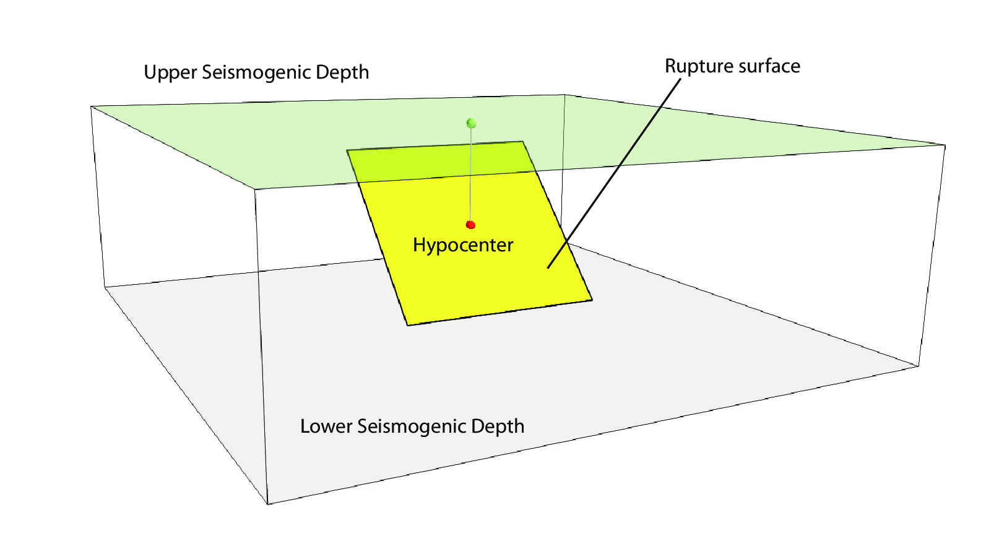
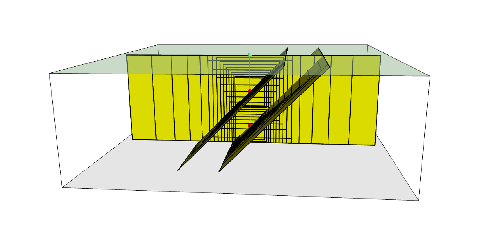
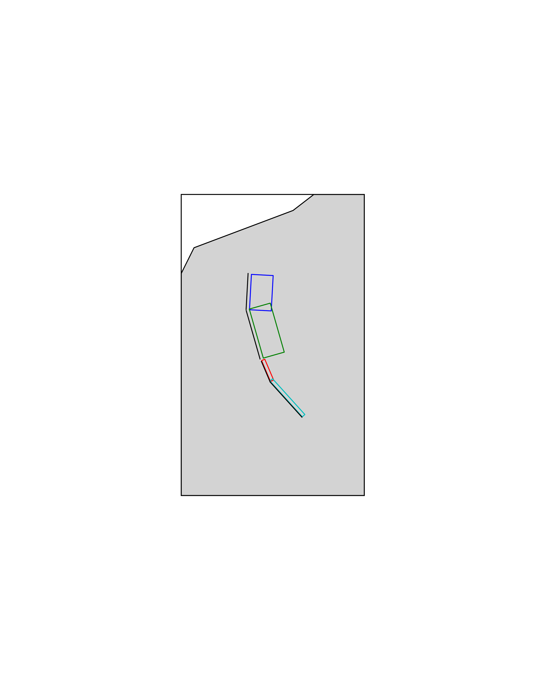
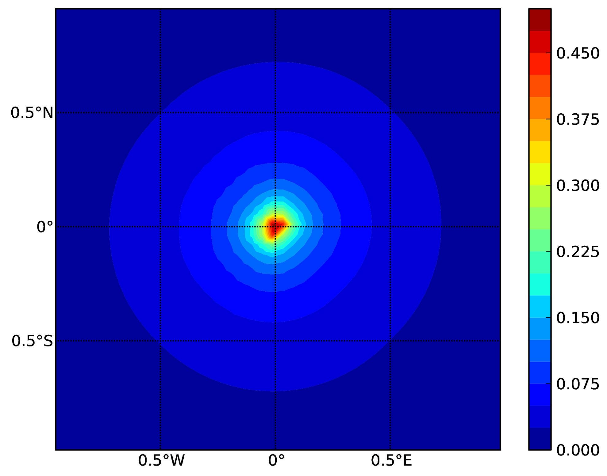
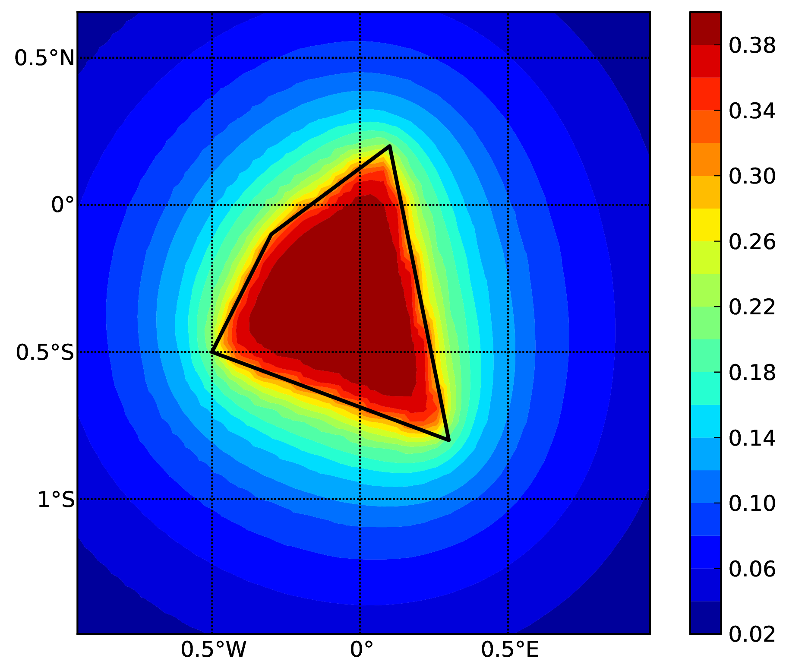
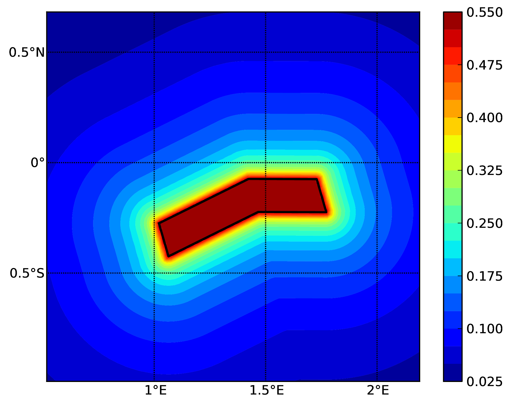
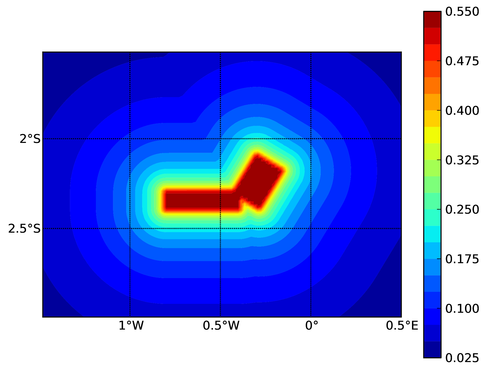
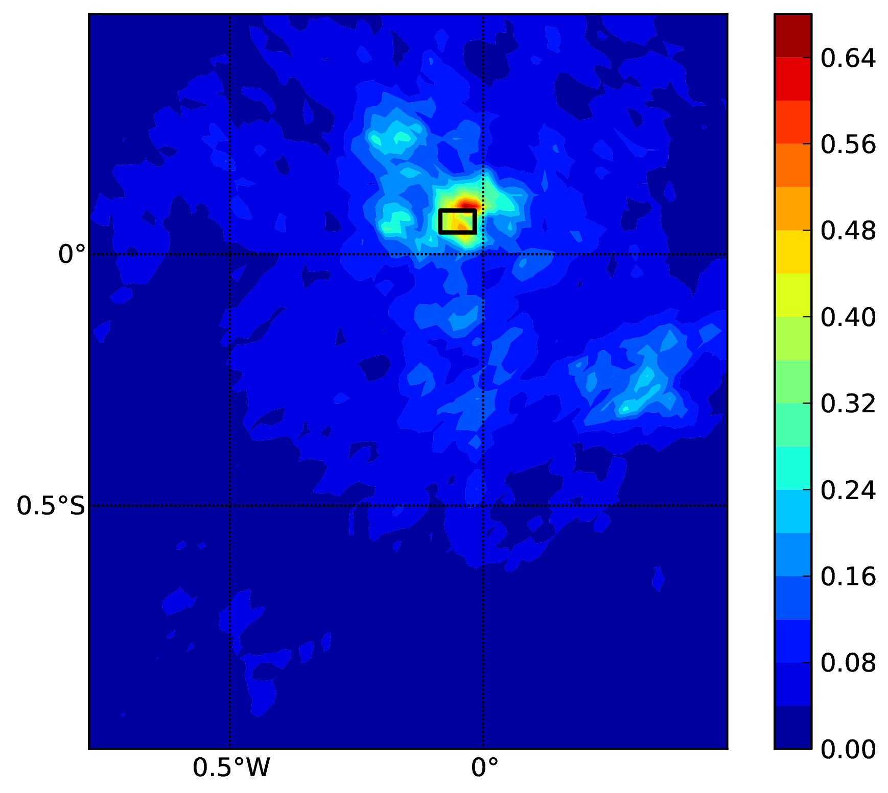
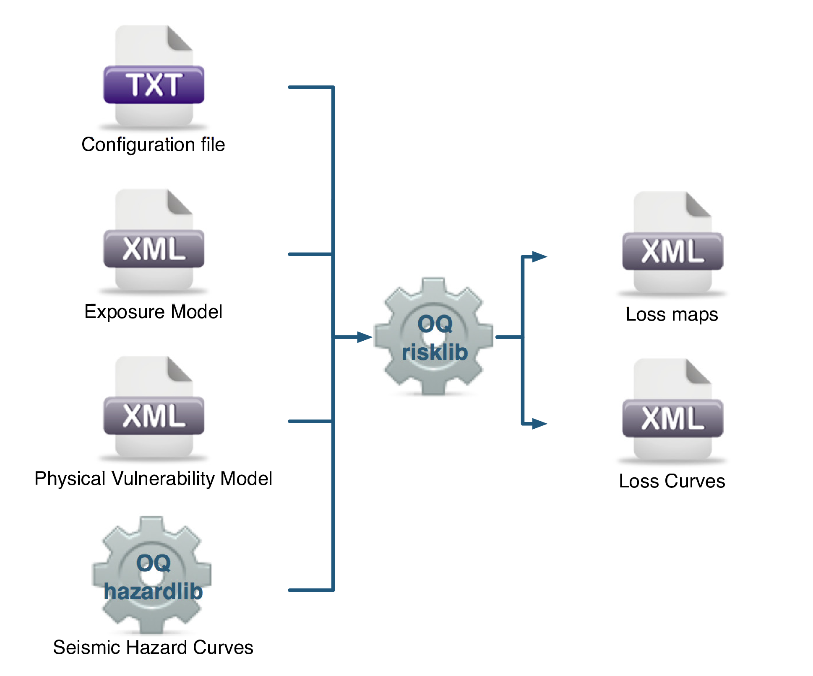
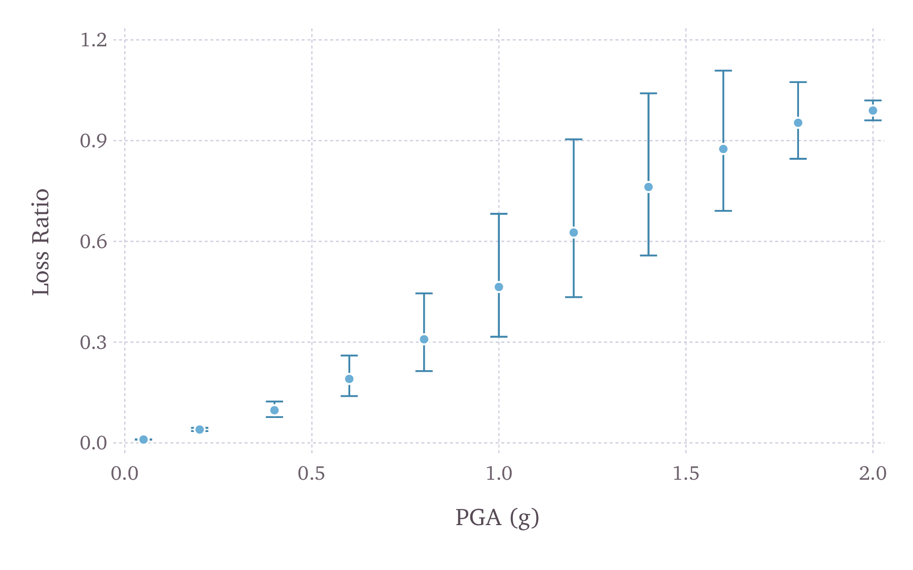

.. Adding a real title here messes with the Heading numbers

OpenQuake-engine Manual |VERSION|
===================================

.. section-numbering::

.. container:: center

   `globalquakemodel.org/openquake <http://globalquakemodel.org/openquake/>`__

| **Authors**
| Marco Pagani\ :math:`^1`, Vitor Silva\ :math:`^1`, Anirudh
  Rao\ :math:`^1`, Michele Simionato\ :math:`^1`,
  Kendra Johnson\ :math:`^1`
| **Authors on previous versions**
| Helen Crowley\ :math:`^2`, Damiano Monelli\ :math:`^3`, Graeme
  Weatherill\ :math:`^4`, Robin Gee\ :math:`^5`

+----------------------+----------------------+----------------------+
| :math:`^1` GEM       | :math:`^2` EUCENTRE, | :math:`^3` RenRe,    |
| Foundation, via      | via Ferrata 1,       | Beethovenstrasse 33, |
| Ferrata 1, 27100     | 27100 Pavia,         | CH-8002 Zürich,      |
| Pavia, Italy         | Italy                | Switzerland          |
+----------------------+----------------------+----------------------+
| :math:`^4` GFZ,      | :math:`^5` PartnerRe,|                      |
| Helmholtzstraße 6/7, | Hardstrasse 301,     |                      |
| 14473 Potsdam,       | CH-8002 Zürich,      |                      |
| Germany              | Switzerland          |                      |
+----------------------+----------------------+----------------------+

| Email address for all current authors:
| :math:`<`\ firstname.lastname\ :math:`>`\ @globalquakemodel.org

| **Citation**
| Please cite this document as:
  GEM (2022). The OpenQuake-engine User Manual. Global Earthquake Model
  (GEM) OpenQuake Manual for Engine version |VERSION|.
  doi: 10.13117/GEM.OPENQUAKE.MAN.ENGINE. |VERSION|

| **Disclaimer**
| The OpenQuake-engine User Manual is distributed in the hope that it
  will be useful, but without any warranty: without even the implied
  warranty of merchantability or fitness for a particular purpose. While
  every precaution has been taken in the preparation of this document,
  in no event shall the authors of the Manual and the GEM Foundation be
  liable to any party for direct, indirect, special, incidental, or
  consequential damages, including lost profits, arising out of the use
  of information contained in this document or from the use of programs
  and source code that may accompany it, even if the authors and GEM
  Foundation have been advised of the possibility of such damage. The
  Manual provided hereunder is on as “as is” basis, and the authors and
  GEM Foundation have no obligations to provide maintenance, support,
  updates, enhancements, or modifications.

| **License**
| This Manual is distributed under the Creative Commons License
  Attribution- NonCommercial-ShareAlike 4.0 International (`CC BY-NC-SA
  4.0 <http://creativecommons.org/licenses/by-nc-sa/4.0/>`__). You can
  download this Manual and share it with others as long as you provide
  proper credit, but you cannot change it in any way or use it
  commercially.

| **RST format manual**
| This manual was adapted from LaTeX to 
  `reStructured Text <https://docutils.sourceforge.io/rst.html>`__
  format as part of the
  TREQ project by
  Paul Henshaw\ :math:`^1` and Sandra Giacomini :math:`^1`.

  *The RST format manual is made possible by the support of the American People 
  through the United States Agency for International Development (USAID.) The 
  contents of this study are the sole responsibility of the GEM Foundation and 
  do not necessarily reflect the views of USAID or the United States Government.*

.. image:: https://github.com/gem/oq-infrastructure/raw/master/logos/public/usaid.jpg

| © 2013–2022 GEM Foundation
| *April 2022*

.. contents::
   :depth: 4
..

.. _`part:introduction`:

Introduction
============

The goal of this manual is to provide a comprehensive and transparent
description of the features of the OpenQuake Engine. This manual is
designed to be readable by someone with basic understanding of
Probabilistic Seismic Hazard and Risk Analysis, but no previous
knowledge of the OpenQuake engine is assumed.

The OpenQuake engine is an effort promoted and actively developed by the GEM Foundation,
a public-private partnership initiated by the Global Science Forum of
the Organisation for Economic Co-operation and Development (OECD) [1]_.

The OpenQuake engine is the result of an effort carried out jointly by the
Information Technology and Scientific teams working at the GEM Foundation
Secretariat. It is freely distributed under an Affero GPL license
(http://www.gnu.org/licenses/agpl-3.0.html).

.. _`chap:intro`:

OpenQuake-engine Background
---------------------------

Overview
^^^^^^^^

OpenQuake-engine is the seismic hazard and risk calculation software
developed by the GEM Foundation. By following current standards in software
developments like test-driven development and continuous integration,
the OpenQuake engine aims at becoming an open, and community-driven tool for
seismic hazard and risk analysis.

The source code of the OpenQuake engine is available on a public web-based
repository at the following address: http://github.com/gem/oq-engine.

The OpenQuake engine is available for the Linux, macOS, and Windows platforms. It
can be installed in several different ways. The following page provides
a handy guide for users to choose the most appropriate installation
method depending on their intended use cases:

https://github.com/gem/oq-engine/blob/master/doc/installing/README.md.

This user manual is for the command line interface for the OpenQuake engine.

Supplementary resources
^^^^^^^^^^^^^^^^^^^^^^^

Guidance instructions for using the OpenQuake engine WebUI are available at
https://github.com/gem/oq-engine/blob/master/doc/running/server.md.

A user manual for the QGIS plugin for the OpenQuake engine is available at
https://docs.openquake.org/oq-irmt-qgis/latest/. In particular,
instructions for using the plugin as an interface for running OpenQuake engine
calculations are listed in Chapter 14, and methods for using the plugin
for visualization of hazard and risk outputs are listed in Chapter 15.

A manual intended for more advanced users of the OpenQuake engine is available at
https://docs.openquake.org/oq-engine/advanced/OpenQuakeforAdvancedUsers.pdf.

Interested users are also encouraged to peruse the `OpenQuake Hazard
Science <https://storage.globalquakemodel.org/media/cms_page_media/432/oqhbt_BkpnqP8.pdf>`__
and `OpenQuake Risk
Science <https://storage.globalquakemodel.org/media/cms_page_media/432/oq-risk-manual-1_0.pdf>`__
books, which provide explanations of the scientific methodologies
adopted in the implementation of the earthquake hazard and risk
libraries of the OpenQuake engine.

Subscribe to the OpenQuake users mailing list to keep abreast of the
latest announcements from the OpenQuake development team, to ask and
answer questions related to the OpenQuake engine and participate in the ongoing
discussions: https://groups.google.com/g/openquake-users

Launching a calculation
^^^^^^^^^^^^^^^^^^^^^^^

An OpenQuake engine analysis is launched from the command line of a terminal.

A schematic list of the options that can be used for the execution of
the OpenQuake engine can be obtained with the following command:

.. code:: shell-session

   user@ubuntu:~$ oq engine --help

The result is the following:

.. code:: shell-session

   usage: oq engine [-h] [--log-file LOG_FILE] [--no-distribute] [-y]
                    [-c CONFIG_FILE] [--make-html-report YYYY-MM-DD|today] [-u]
                    [-d] [-w] [--run JOB_INI [JOB_INI ...]]
                    [--list-hazard-calculations] [--list-risk-calculations]
                    [--delete-calculation CALCULATION_ID]
                    [--delete-uncompleted-calculations]
                    [--hazard-calculation-id HAZARD_CALCULATION_ID]
                    [--list-outputs CALCULATION_ID] [--show-log CALCULATION_ID]
                    [--export-output OUTPUT_ID TARGET_DIR]
                    [--export-outputs CALCULATION_ID TARGET_DIR] [-e]
                    [-l {debug, info, warn, error, critical}] [-r]
                    [--param PARAM]

   Run a calculation using the traditional command line API

   optional arguments:
     -h, --help            show this help message and exit
     --log-file LOG_FILE, -L LOG_FILE
                           Location where to store log messages; if not
                           specified, log messages will be printed to the console
                           (to stderr)
     --no-distribute, --nd
                           Disable calculation task distribution and run the
                           computation in a single process. This is intended for
                           use in debugging and profiling.
     -y, --yes             Automatically answer "yes" when asked to confirm an
                           action
     -c CONFIG_FILE, --config-file CONFIG_FILE
                           Custom openquake.cfg file, to override default
                           configurations
     --make-html-report YYYY-MM-DD|today, --r YYYY-MM-DD|today
                           Build an HTML report of the computation at the given
                           date
     -u, --upgrade-db      Upgrade the openquake database
     -d, --db-version      Show the current version of the openquake database
     -w, --what-if-I-upgrade
                           Show what will happen to the openquake database if you
                           upgrade
     --run JOB_INI [JOB_INI ...]
                           Run a job with the specified config file
     --list-hazard-calculations, --lhc
                           List hazard calculation information
     --list-risk-calculations, --lrc
                           List risk calculation information
     --delete-calculation CALCULATION_ID, --dc CALCULATION_ID
                           Delete a calculation and all associated outputs
     --delete-uncompleted-calculations, --duc
                           Delete all the uncompleted calculations
     --hazard-calculation-id HAZARD_CALCULATION_ID, --hc HAZARD_CALCULATION_ID
                           Use the given job as input for the next job
     --list-outputs CALCULATION_ID, --lo CALCULATION_ID
                           List outputs for the specified calculation
     --show-log CALCULATION_ID, --sl CALCULATION_ID
                           Show the log of the specified calculation
     --export-output OUTPUT_ID TARGET_DIR, --eo OUTPUT_ID TARGET_DIR
                           Export the desired output to the specified directory
     --export-outputs CALCULATION_ID TARGET_DIR, --eos CALCULATION_ID TARGET_DIR
                           Export all of the calculation outputs to the specified
                           directory
     -e, --exports         Comma-separated string specifing the export formats,
                           in order of priority
     -l, --log-level {debug, info, warn, error, critical}
                           Defaults to "info"
     -r, --reuse-input    Read the sources|exposures from the cache (if any)
     --param PARAM, -p PARAM
                           Override parameters specified with the syntax
                           NAME1=VALUE1,NAME2=VALUE2,...

Hazard
======

.. _`chap:hazintro`:

Introduction to the Hazard Module
---------------------------------

The hazard component of the OpenQuake engine builds on top of the OpenQuake hazard library (oq-hazardlib), a
Python-based library containing tools for PSHA calculations.

| The web repository of this library is available at the following
  address:
| https://github.com/gem/oq-engine/tree/master/openquake/hazardlib.

In this section we briefly illustrate the main properties of the hazard
component of the OpenQuake engine. In particular, we will describe the main
typologies of sources supported and the main calculation workflows
available.

.. _Source typologies:

Source typologies 
^^^^^^^^^^^^^^^^^

An OpenQuake engine seismic source input model contains a list of sources 
belonging to a finite
set of possible typologies. Each source type is defined by a set of
parameters - called source data - which are used to specify the source
geometry and the properties of seismicity occurrence.

Currently the OpenQuake engine supports the following source types:

-  Sources for modelling distributed seismicity:

   -  *Point Source* - The elemental source type used to model distributed
      seismicity. Grid and area sources (described below) are different
      containers of point sources.

   -  *Area Source* - So far, the most frequently adopted source type in
      national and regional PSHA models.

   -  *Grid Source* - A replacement for area sources admitting spatially
      variable seismicity occurrence properties.

-  Fault sources with floating ruptures:

   -  *Simple Fault Source* - The simplest fault model in the OpenQuake engine. This
      source is habitually used to describe shallow seismogenic faults.

   -  *Complex Fault Source* - Often used to model subduction interface
      sources with a complex geometry.

-  Fault sources with ruptures always covering the entire fault surface:

   -  *Characteristic Fault Source* - A typology of source where ruptures always fill
      the entire fault surface.

   -  *Non-Parametric Source* - A typology of source representing a
      collection of ruptures, each with their associated probabilities
      of 0, 1, 2 ... occurrences in the investigation time

-  Sources for representing individual earthquake ruptures

   -  Planar fault rupture - an individual fault rupture represented as
      a single rectangular plane

   -  Multi-planar fault rupture - an individual rupture represented as
      a collection of rectangular planes

   -  Simple fault rupture - an individual fault rupture represented as
      a simple fault surface

   -  Complex fault rupture - an individual fault rupture represented as
      a complex fault surface

The OpenQuake engine contains some basic assumptions for the definition of these
source typologies:

-  In the case of area and fault sources, the seismicity is
   homogeneously distributed over the source;

-  Seismicity temporal occurrence follows a Poissonian model.

The above sets of sources may be referred to as “parametric” sources,
that is to say that the generation of the *Earthquake Rupture Forecast* is
done by the OpenQuake engine based on the parameters of the sources set
by the user. In some cases, particularly if the user wishes for the
temporal occurrence model to be non-Poissonian (such as the lognormal or
Brownian Passage Time models) a different type of behaviour is needed.
For this OpenQuake-engine supports a *Non-Parametric Source* in which the
*Earthquake Rupture Forecast* is provided explicitly by the user as a set of
ruptures and their corresponding probabilities of occurrence.

Source typologies for modelling distributed seismicity
~~~~~~~~~~~~~~~~~~~~~~~~~~~~~~~~~~~~~~~~~~~~~~~~~~~~~~
Point sources
_____________

   Single rupture

The point source is the elemental source type adopted in the
OpenQuake-engine for modelling distributed seismicity. The OpenQuake engine
always performs calculations considering finite ruptures, even in the
case of point sources.

These are the basic assumptions used to generate ruptures with point
sources:

-  Ruptures have a rectangular shape

-  Rupture hypocenter is located in the middle of the rupture

-  Ruptures are limited at the top and at the bottom by two planes
   parallel to the sea level and placed at two characteristic depths
   named upper and lower seismogenic depths, respectively (see
   :numref:`fig:single_rupture`)

Source data
:::::::::::

For the definition of a point source the following parameters are
required (:numref:`fig:single_rupture` shows some of the
parameters described below, together with an example of the surface of a
generated rupture):

-  The coordinates of the point (i.e. longitude and latitude) [decimal
   degrees]

-  The upper and lower seismogenic depths [km]

-  One *Magnitude-Frequency Distribution*

-  One magnitude-scaling relationship

-  The rupture aspect ratio

-  A distribution of nodal planes i.e. one (or several) instances of the
   following set of parameters:

   -  strike [degrees]

   -  dip [degrees]

   -  rake [degrees]

-  A magnitude independent depth distribution of hypocenters [km].

:numref:`fig:point_source_multiple_ruptures` shows ruptures
generated by a point source for a range of magnitudes. Each rupture is
centered on the single hypocentral position admitted by this point
source. Ruptures are created by conserving the area computed using the
specified magnitude-area scaling relatioship and the corresponding value
of magnitude.

.. figure:: figures/hazard/point_source_multiple_ruptures.png
   :alt: Point source with multiple ruptures. Note the change in the aspect ratio once the rupture width fills the entire seismogenic layer.
   :name: fig:point_source_multiple_ruptures
   :width: 95%

   Point source with multiple ruptures. Note the change in the aspect
   ratio once the rupture width fills the entire seismogenic layer.

Below we provide the excerpt of an .xml file used to describe the
properties of a point source. Note that in this example, ruptures occur
on two possible nodal planes and two hypocentral depths.
:numref:`fig:point_source_ruptures` shows the ruptures generated
by the point source.

.. container:: listing

   .. code:: xml
      :number-lines:

      <pointSource id="1" name="point" tectonicRegion="Stable Continental Crust">
           <pointGeometry>
               <gml:Point>
                   <gml:pos>-122.0 38.0</gml:pos>
               </gml:Point>
               <upperSeismoDepth>0.0</upperSeismoDepth>
               <lowerSeismoDepth>10.0</lowerSeismoDepth>
          </pointGeometry>
          <magScaleRel>WC1994</magScaleRel>
          <ruptAspectRatio>0.5</ruptAspectRatio>
          <truncGutenbergRichterMFD aValue="-3.5" bValue="1.0" minMag="5.0"
      		                      maxMag="6.5" />
          <nodalPlaneDist>
               <nodalPlane probability="0.3" strike="0.0" dip="90.0" rake="0.0" />
               <nodalPlane probability="0.7" strike="90.0" dip="45.0" rake="90.0" />
          </nodalPlaneDist>
          <hypoDepthDist>
              <hypoDepth probability="0.5" depth="4.0" />
              <hypoDepth probability="0.5" depth="8.0" />
          </hypoDepthDist>
      </pointSource>

   Ruptures produced by the source created using the information in the
   example .xml file described on page .

Grid sources
____________

A *Grid Source* is simply a collection of point sources distributed over a
regular grid (usually equally spaced in longitude and latitude). In *Probabilistic Seismic Hazard Analysis*
a grid source can be considered a model alternative to area sources,
since they both model distributed seismicity. Grid sources are generally
used to reproduce more faithfully the spatial pattern of seismicity
depicted by the earthquakes occurred in the past; in some models (e.g.
Petersen et al. (2008)) only events of low and intermediate magnitudes
are considered. They are frequently, though not always, computed using
seismicity smoothing algorithms (Frankel 1995; Woo 1996, amongst many
others).

The use of smoothing algorithms to produce grid sources brings some
advantages compared to area sources, since (1) it removes most of the
unavoidable degree of subjectivity due to the definition of the
geometries of the area sources and (2) it produces a spatial pattern of
seismicity that is usually closer to what observed in the reality.
Nevertheless, in many cases smoothing algorithms require an a-priori
definition of some setup parameters that expose the calculation to a
certain degree of partiality.

Grid sources are modeled in OpenQuake engine simply as a set of point sources; in
other words, a grid source is just a long list of point sources
specified as described in the previous section.

Area sources
____________

Area sources are usually adopted to describe the seismicity occurring
over wide areas where the identification and characterization - i.e. the
unambiguous definition of position, geometry and seismicity occurrence
parameters - of single fault structures is difficult.

From a computation standpoint, area sources are comparable to grid
sources since they are both represented in the engine by a list of point
sources.

The OpenQuake engine using the source data parameters (see below) creates an
equally spaced in distance grid of point sources where each point has
the same seismicity occurrence properties (i.e. rate of events
generated).

Below we provide a brief description of the parameters necessary to
completely describe an area source.

Source data
:::::::::::

-  A polygon defining the external border of the area (i.e. a list of
   Longitude-Latitude [degrees] tuples) The current version of the
   OQ-engine doesn’t support the definition of internal borders.

-  The upper and lower seismogenic depths [km]

-  One *Magnitude-Frequency Distribution*

-  One *Magnitude-Scaling Relationship*

-  The rupture aspect ratio

-  A distribution of nodal planes i.e. one (or several) instances of the
   following set of parameters

   -  strike [degrees]

   -  dip [degrees]

   -  rake [degrees]

-  A magnitude independent depth distribution of hypocenters [km].

Below we provide the excerpt of an .xml file used to describe the
properties of an area source. The ruptures generated by the area source
described in the example are controlled by two nodal planes and have
hypocenters at localized at two distinct depths.

.. container:: listing

   .. code:: xml
      :number-lines:

      <areaSource id="1" name="Quito" tectonicRegion="Active Shallow Crust">
          <areaGeometry>
            <gml:Polygon>
              <gml:exterior>
                <gml:LinearRing>
                  <gml:posList>
                    -122.5 37.5
                    -121.5 37.5
                    -121.5 38.5
                    -122.5 38.5
                  </gml:posList>
                </gml:LinearRing>
              </gml:exterior>
            </gml:Polygon>
            <upperSeismoDepth>0.0</upperSeismoDepth>
            <lowerSeismoDepth>10.0</lowerSeismoDepth>
          </areaGeometry>
          <magScaleRel>PeerMSR</magScaleRel>
          <ruptAspectRatio>1.5</ruptAspectRatio>
          <incrementalMFD minMag="6.55" binWidth="0.1">
              <occurRates>0.0010614989 8.8291627E-4 7.3437777E-4 6.108288E-4
                          5.080653E-4</occurRates>
          </incrementalMFD>
          <nodalPlaneDist>
              <nodalPlane probability="0.3" strike="0.0" dip="90.0" rake="0.0"/>
              <nodalPlane probability="0.7" strike="90.0" dip="45.0" rake="90.0"/>
          </nodalPlaneDist>
          <hypoDepthDist>
              <hypoDepth probability="0.5" depth="4.0" />
              <hypoDepth probability="0.5" depth="8.0" />
          </hypoDepthDist>
      </areaSource>

Fault sources with floating ruptures 
~~~~~~~~~~~~~~~~~~~~~~~~~~~~~~~~~~~~
Fault
sources in the OpenQuake engine are classified according to the method adopted to
distribute ruptures over the fault surface. Two options are currently
supported:

-  With the first option, ruptures with a surface lower than the whole
   fault surface are floated so as to cover as much as possible
   homogeneously the fault surface. This model is compatible with all
   the supported magnitude-frequency distributions.

-  With the second option, ruptures always fill the entire fault
   surface. This model is compatible with magnitude-frequency
   distributions similar to a characteristic model (à la (Schwartz and
   Coppersmith 1984)).

In this subsection we discuss the different fault source types that
support floating ruptures. In the next subsection we will illustrate the
fault typology available to model a characteristic rupturing behaviour.

.. _desc_simple_fault:

Simple Faults
_____________

Simple Faults are the most common source type used to model shallow
faults; the “simple” adjective relates to the geometry description of
the source which is obtained by projecting the fault trace (i.e. a
polyline) along a characteristic dip direction.

The parameters used to create an instance of this source type are
described in the following paragraph.

Source data
:::::::::::

-  A horizontal *Fault Trace* (usually a polyline). It is a list of
   longitude-latitude tuples [degrees].

-  A *Frequency-Magnitude Distribution*

-  A *Magnitude-Scaling Relationship*

-  A representative value of the dip angle (specified following the
   Aki-Richards convention; see Aki and Richards (2002)) [degrees]

-  Rake angle (specified following the Aki-Richards convention; see Aki
   and Richards (2002)) [degrees]

-  Upper and lower depth values limiting the seismogenic interval [km]

For near-fault probabilistic seismic hazard analysis, two additional
parameters are needed for characterising seismic sources:

-  A hypocentre list. It is a list of the possible hypocentral
   positions, and the corresponding weights, e.g., alongStrike="0.25"
   downDip="0.25" weight="0.25". Each hypocentral position is defined in
   relative terms using as a reference the upper left corner of the
   rupture and by specifying the fraction of rupture length and rupture
   width.

-  A slip list. It is a list of the possible rupture slip directions
   [degrees], and their corresponding weights. The angle describing each
   slip direction is measured counterclockwise using the fault strike
   direction as reference.

In near-fault PSHA calculations, the hypocentre list and the slip list
are mandatory. The weights in each list must always sum to one. The
available GMPE which currently supports the near-fault directivity PSHA
calculation in OQ- engine is the ChiouYoungs2014NearFaultEffect GMPE
developed by Brian S.-J. Chiou and Youngs (2014) (associated with an
``Active Shallow Crust`` tectonic region type).

We provide two examples of simple fault source files. The first is an
excerpt of an xml file used to describe the properties of a simple fault
source and the second example shows the excerpt of an xml file used to
describe the properties of a simple fault source that can be used to
perform a PSHA calculation taking into account directivity effects.

.. code:: xml
      :number-lines:

      <simpleFaultSource id="1" name="Mount Diablo Thrust"
              tectonicRegion="Active Shallow Crust">
            <simpleFaultGeometry>
                <gml:LineString>
                    <gml:posList>
                        -121.82290 37.73010
                        -122.03880 37.87710
                    </gml:posList>
                </gml:LineString>
                <dip>45.0</dip>
                <upperSeismoDepth>10.0</upperSeismoDepth>
                <lowerSeismoDepth>20.0</lowerSeismoDepth>
            </simpleFaultGeometry>
            <magScaleRel>WC1994</magScaleRel>
            <ruptAspectRatio>1.5</ruptAspectRatio>
            <incrementalMFD minMag="5.0" binWidth="0.1">
                <occurRates>0.0010614989 8.8291627E-4 7.3437777E-4 6.108288E-4
                            5.080653E-4</occurRates>
            </incrementalMFD>
            <rake>30.0</rake>
            <hypoList>
                <hypo alongStrike="0.25" downDip="0.25" weight="0.25"/>
                <hypo alongStrike="0.25" downDip="0.75" weight="0.25"/>
                <hypo alongStrike="0.75" downDip="0.25" weight="0.25"/>
                <hypo alongStrike="0.75" downDip="0.75" weight="0.25"/>
            </hypoList>
            <slipList>
                <slip weight="0.333">0.0</slip>
                <slip weight="0.333">45.0</slip>
                <slip weight="0.334">90.0</slip>
            </slipList>
      </simpleFaultSource>

.. code:: xml
   :number-lines:

   <simpleFaultSource id="1" name="Mount Diablo Thrust"
           tectonicRegion="Active Shallow Crust">
        <simpleFaultGeometry>
            <gml:LineString>
                <gml:posList>
                    -121.82290 37.73010
                    -122.03880 37.87710
                </gml:posList>
            </gml:LineString>
            <dip>45.0</dip>
            <upperSeismoDepth>10.0</upperSeismoDepth>
            <lowerSeismoDepth>20.0</lowerSeismoDepth>
        </simpleFaultGeometry>
        <magScaleRel>WC1994</magScaleRel>
        <ruptAspectRatio>1.5</ruptAspectRatio>
        <incrementalMFD minMag="5.0" binWidth="0.1">
            <occurRates>0.0010614989 8.8291627E-4 7.3437777E-4 6.108288E-4
                        5.080653E-4</occurRates>
        </incrementalMFD>
        <rake>30.0</rake>
        <hypoList>
            <hypo alongStrike="0.25" downDip="0.25" weight="0.25"/>
            <hypo alongStrike="0.25" downDip="0.75" weight="0.25"/>
            <hypo alongStrike="0.75" downDip="0.25" weight="0.25"/>
            <hypo alongStrike="0.75" downDip="0.75" weight="0.25"/>
        </hypoList>
        <slipList>
            <slip weight="0.333">0.0</slip>
            <slip weight="0.333">45.0</slip>
            <slip weight="0.334">90.0</slip>
        </slipList>
   </simpleFaultSource>

.. _desc_complex_fault:

Complex Faults
______________

A complex fault differs from simple fault just by the way the geometry
of the fault surface is defined and the fault surface is later created.
The input parameters used to describe complex faults are, for the most
part, the same used to describe the simple fault typology.

In the case of complex faults, the dip angle is not requested while the
fault trace is substituted by two fault edges limiting the top and
bottom of the fault surface. Additional curves lying over the fault
surface can be specified to complement and refine the description of the
fault surface geometry. Unlike the simple fault these edges are not
required to be horizontal and may vary in elevation, i.e. the upper edge
may represent the intersection between the exposed fault trace and the
topographic surface, where positive values indicate below sea level, and
negative values indicate above sea level.

Usually, we use complex faults to model intraplate megathrust faults
such as the big subduction structures active in the Pacific (Sumatra,
South America, Japan) but this source typology can be used also to
create - for example - listric fault sources with a realistic geometry.

.. code:: xml
   :number-lines:

   <complexFaultSource id="1" name="Cascadia Megathrust"
                       tectonicRegion="Subduction Interface">
       <complexFaultGeometry>
           <faultTopEdge>
               <gml:LineString>
                   <gml:posList>
                       -124.704  40.363  0.5493260E+01
                       -124.977  41.214  0.4988560E+01
                       -125.140  42.096  0.4897340E+01
                   </gml:posList>
               </gml:LineString>
           </faultTopEdge>
           <intermediateEdge>
               <gml:LineString>
                   <gml:posList>
                       -124.704  40.363  0.5593260E+01
                       -124.977  41.214  0.5088560E+01
                       -125.140  42.096  0.4997340E+01
                   </gml:posList>
               </gml:LineString>
           </intermediateEdge>
           <intermediateEdge>
               <gml:LineString>
                   <gml:posList>
                       -124.704  40.363  0.5693260E+01
                       -124.977  41.214  0.5188560E+01
                       -125.140  42.096  0.5097340E+01
                   </gml:posList>
               </gml:LineString>
           </intermediateEdge>
           <faultBottomEdge>
               <gml:LineString>
                   <gml:posList>
                       -123.829  40.347  0.2038490E+02
                       -124.137  41.218  0.1741390E+02
                       -124.252  42.115  0.1752740E+02
                   </gml:posList>
               </gml:LineString>
           </faultBottomEdge>
       </complexFaultGeometry>
       <magScaleRel>WC1994</magScaleRel>
       <ruptAspectRatio>1.5</ruptAspectRatio>
       <truncGutenbergRichterMFD aValue="-3.5" bValue="1.0" minMag="5.0"
                                 maxMag="6.5" />
       <rake>30.0</rake>
   </complexFaultSource>

As with the previous examples, the red text highlights the parameters
used to specify the source geometry, the parameters in green describe
the rupture mechanism, the text in blue describes the
magnitude-frequency distribution and the gray text describes the rupture
properties.

Fault sources without floating ruptures
~~~~~~~~~~~~~~~~~~~~~~~~~~~~~~~~~~~~~~~

.. _desc_characteristic_fault:

Characteristic faults
_____________________

The characteristic fault source is a particular typology of fault
created with the assumption that its ruptures will always cover the
entire fault surface. As such, no floating is necessary on the surface.
The characteristic fault may still take as input a magnitude frequency
distribution. In this case, the fault surface can be represented either
as a *Simple Fault Source* surface or as a *Complex Fault Source* surface or as
a combination of rectangular ruptures as represented in
:numref:`fig:char_fault_source`. Mutiple surfaces containing
mixed geometry types are also supported.

   Geometry of a multi-segmented characteristic fault composed of four
   rectangular ruptures as modelled in OpenQuake.

Source data
:::::::::::

-  The characteristic rupture surface is defined through one of the
   following options:

   -  A list of rectangular ruptures (“planar surfaces”)

   -  A *Simple Fault Source* geometry

   -  A *Complex Fault Source* geometry

-  A *Frequency-Magnitude Distribution*.

-  Rake angle (specified following the Aki-Richards convention; see Aki
   and Richards (2002)).

-  Upper and lower depth values limiting the seismogenic interval.

A comprehensive example enumerating the possible rupture surface
configurations is shown below.

.. code:: xml
   :number-lines:
 
   <characteristicFaultSource id="5" name="characteristic source, simple fault"
                              tectonicRegion="Volcanic">
       <truncGutenbergRichterMFD aValue="-3.5" bValue="1.0"
                                 minMag="5.0" maxMag="6.5" />
       <rake>30.0</rake>
       <surface>
           <!-- Characteristic Fault with a simple fault surface -->
           <simpleFaultGeometry>
               <gml:LineString>
                   <gml:posList>
                       -121.82290 37.73010
                       -122.03880 37.87710
                   </gml:posList>
               </gml:LineString>
               <dip>45.0</dip>
               <upperSeismoDepth>10.0</upperSeismoDepth>
               <lowerSeismoDepth>20.0</lowerSeismoDepth>
           </simpleFaultGeometry>
       </surface>
   </characteristicFaultSource>

.. code:: xml
   :number-lines:

   <characteristicFaultSource id="6" name="characteristic source, complex fault"
                              tectonicRegion="Volcanic">
       <incrementalMFD minMag="5.0" binWidth="0.1">
           <occurRates>0.0010614989 8.8291627E-4 7.3437777E-4</occurRates>
       </incrementalMFD>
       <rake>60.0</rake>
       <surface>
           <!-- Characteristic source with a complex fault surface -->
           <complexFaultGeometry>
               <faultTopEdge>
                   <gml:LineString>
                       <gml:posList>
                          -124.704  40.363  0.5493260E+01
                          -124.977  41.214  0.4988560E+01
                          -125.140  42.096  0.4897340E+01
                       </gml:posList>
                   </gml:LineString>
               </faultTopEdge>
               <faultBottomEdge>
                   <gml:LineString>
                       <gml:posList>
                           -123.829  40.347  0.2038490E+02
                           -124.137  41.218  0.1741390E+02
                           -124.252  42.115  0.1752740E+02
                       </gml:posList>
                   </gml:LineString>
               </faultBottomEdge>
           </complexFaultGeometry>
       </surface>
   </characteristicFaultSource>

.. code:: xml
   :number-lines:

   <characteristicFaultSource id="7" name="characteristic source, multi surface"
                              tectonicRegion="Volcanic">
       <truncGutenbergRichterMFD aValue="-3.6" bValue="1.0"
                                 minMag="5.2" maxMag="6.4" />
       <rake>90.0</rake>
       <surface>
           <!-- Characteristic source with a collection of planar surfaces -->
           <planarSurface>
               <topLeft lon="-1.0" lat="1.0" depth="21.0" />
               <topRight lon="1.0" lat="1.0" depth="21.0" />
               <bottomLeft lon="-1.0" lat="-1.0" depth="59.0" />
               <bottomRight lon="1.0" lat="-1.0" depth="59.0" />
           </planarSurface>
           <planarSurface strike="20.0" dip="45.0">
                <topLeft lon="1.0" lat="1.0" depth="20.0" />
                <topRight lon="3.0" lat="1.0" depth="20.0" />
                <bottomLeft lon="1.0" lat="-1.0" depth="80.0" />
                <bottomRight lon="3.0" lat="-1.0" depth="80.0" />
            </planarSurface>
       </surface>
   </characteristicFaultSource>

Non-Parametric Sources
~~~~~~~~~~~~~~~~~~~~~~
Non-Parametric Fault
____________________

The non-parametric fault typology requires that the user indicates the
rupture properties (rupture surface, magnitude, rake and hypocentre) and
the corresponding probabilities of the rupture. The probabilities are
given as a list of floating point values that correspond to the
probabilities of :math:`0, 1, 2, \ldots ... N` occurrences of the
rupture within the specified investigation time. Note that there is not,
at present, any internal check to ensure that the investigation time to
which the probabilities refer corresponds to that specified in the
configuration file. As the surface of the rupture is set explicitly, no
rupture floating occurs, and, as in the case of the characteristic fault
source, the rupture surface can be defined as either a single planar
rupture, a list of planar ruptures, a *Simple Fault Source* geometry, a
*Complex Fault Source* geometry, or a combination of different geometries.

Comprehensive examples enumerating the possible configurations are shown
below:

.. code:: xml
   :number-lines:

   <nonParametricSeismicSource id="1" name="A Non Parametric Planar Source"
                               tectonicRegion="Some TRT">
       <singlePlaneRupture probs_occur="0.544 0.456">
           <magnitude>8.3</magnitude>
           <rake>90.0</rake>
           <hypocenter depth="26.101" lat="40.726" lon="143.0"/>
           <planarSurface>
               <topLeft depth="9.0" lat="41.6" lon="143.1"/>
               <topRight depth="9.0" lat="40.2" lon="143.91"/>
               <bottomLeft depth="43.202" lat="41.252" lon="142.07"/>
               <bottomRight depth="43.202" lat="39.852" lon="142.91"/>
           </planarSurface>
       </singlePlaneRupture>
       <multiPlanesRupture probs_occur="0.9244 0.0756">
           <magnitude>6.9</magnitude>
           <rake>0.0</rake>
           <hypocenter depth="7.1423" lat="35.296" lon="139.31"/>
           <planarSurface>
               <topLeft depth="2.0" lat="35.363" lon="139.16"/>
               <topRight depth="2.0" lat="35.394" lon="138.99"/>
               <bottomLeft depth="14.728" lat="35.475" lon="139.19"/>
               <bottomRight depth="14.728" lat="35.505" lon="139.02"/>
           </planarSurface>
           <planarSurface>
               <topLeft depth="2.0" lat="35.169" lon="139.34"/>
               <topRight depth="2.0" lat="35.358" lon="139.17"/>
               <bottomLeft depth="12.285" lat="35.234" lon="139.45"/>
               <bottomRight depth="12.285" lat="35.423" lon="139.28"/>
           </planarSurface>
       </multiPlanesRupture>
   </nonParametricSeismicSource>

.. code:: xml
   :number-lines:

   <nonParametricSeismicSource id="2" name="A Non Parametric (Simple) Source"
                               tectonicRegion="Some TRT">
       <simpleFaultRupture probs_occur="0.157 0.843">
           <magnitude>7.8</magnitude>
           <rake>90.0</rake>
           <hypocenter depth="22.341" lat="43.624" lon="147.94"/>
           <simpleFaultGeometry>
               <gml:LineString>
                   <gml:posList>
                       147.96 43.202
                       148.38 43.438
                       148.51 43.507
                       148.68 43.603
                       148.76 43.640
                   </gml:posList>
               </gml:LineString>
               <dip>30.0</dip>
               <upperSeismoDepth>14.5</upperSeismoDepth>
               <lowerSeismoDepth>35.5</lowerSeismoDepth>
           </simpleFaultGeometry>
       </simpleFaultRupture>
   </nonParametricSeismicSource>

.. code:: xml
   :number-lines:

   <nonParametricSeismicSource id="3" name="A Non Parametric (Complex) Source"
                               tectonicRegion="Some TRT">
       <complexFaultRupture probs_occur="0.157 0.843">
           <magnitude>7.8</magnitude>
           <rake>90.0</rake>
           <hypocenter depth="22.341" lat="43.624" lon="147.94"/>
           <complexFaultGeometry>
               <faultTopEdge>
                   <gml:LineString>
                       <gml:posList>
                           148.76 43.64 5.0
                           148.68 43.603 5.0
                           148.51 43.507 5.0
                           148.38 43.438 5.0
                           147.96 43.202 5.0
                       </gml:posList>
                   </gml:LineString>
               </faultTopEdge>
               <faultBottomEdge>
                  <gml:LineString>
                       <gml:posList>
                           147.92 44.002 35.5
                           147.81 43.946 35.5
                           147.71 43.897 35.5
                           147.5 43.803 35.5
                           147.36 43.727 35.5
                       </gml:posList>
                   </gml:LineString>
               </faultBottomEdge>
           </complexFaultGeometry>
       </complexFaultRupture>
   </nonParametricSeismicSource>

Magnitude-frequency distributions 
^^^^^^^^^^^^^^^^^^^^^^^^^^^^^^^^^
The magnitude-frequency distributions currently supported by the 
OpenQuake engine are the following:

A discrete incremental magnitude-frequency distribution
   It is the simplest distribution supported. It is defined by the
   minimum value of magnitude (representing the mid point of the first
   bin) and the bin width. The distribution itself is simply a sequence
   of floats describing the annual number of events for different bins.
   The maximum magnitude admitted by this magnitude-frequency
   distribution is just the sum of the minimum magnitude and the product
   of the bin width by the number annual rate values. Below we provide
   an example of the xml that should be incorporated in a seismic source
   description in order to define this Magnitude-Frequency Distribution.

   .. code:: xml
      :number-lines:

      <incrementalMFD minMag="5.05" binWidth="0.1">
          <occurRates>0.15 0.08 0.05 0.03 0.015</occurRates>
      </incrementalMFD>

   The magnitude-frequency distribution obtained with the above
   parameters is represented in
   :numref:`fig:evenly_discretized_mfd`.

   .. figure:: figures/hazard/ed_mfd.png
      :alt: Example of an incremental magnitude-frequency distribution.
      :name: fig:evenly_discretized_mfd
      :width: 95%

      Example of an incremental magnitude-frequency distribution.

A double truncated Gutenberg-Richter distribution
   This distribution is described by means of a minimum ``minMag`` and
   maximum magnitude ``maxMag`` and by the :math:`a` and :math:`b`
   values of the Gutenberg-Richter relationship.

   The syntax of the xml used to describe this magnitude-frequency
   distribution is rather compact as demonstrated in the following
   example:

   .. code:: xml
      :number-lines:

      <truncGutenbergRichterMFD aValue="5.0" bValue="1.0" minMag="5.0"
                                maxMag="6.0"/>

   :numref:`fig:dt_gr_mfd` shows the magnitude-frequency
   distribution obtained using the parameters of the considered example.

   .. figure:: figures/hazard/dt_mfd.png
      :alt: Example of a double truncated Gutenberg-Richter magnitude-frequency distribution.
      :name: fig:dt_gr_mfd
      :width: 95%

      Example of a double truncated Gutenberg-Richter
      magnitude-frequency distribution.

Hybrid Characteristic earthquake model (à la (Youngs and Coppersmith 1985))
   The hybrid characteristic earthquake model, presented by (Youngs and
   Coppersmith 1985), distributes seismic moment proportionally between
   a characteristic model (for larger magnitudes) and an exponential
   model. The rate of events is dependent on the magnitude of the
   characteristic earthquake, the b-value and the total moment rate of
   the system (:numref:`fig:yc_gr_mfd`). However, the total
   moment rate may be defined in one of two ways. If the total moment
   rate of the source is known, as may be the case for a fault surface
   with known area and slip rate, then the distribution can be defined
   from the total moment rate (in N-m) of the source directly.
   Alternatively, the distribution can be defined from the rate of
   earthquakes in the characteristic bin, which may be preferable if the
   distribution is determined from observed seismicity behaviour. The
   option to define the distribution according to the total moment rate
   is input as:

   .. code:: xml
      :number-lines:

      <YoungsCoppersmithMFD minmag="5.0" bValue="1.0" binWidth="0.1"
                            characteristicMag="7.0" totalMomentRate="1.05E19"/>

   whereas the option to define the distribution from the rate of the
   characteristic events is given as:

   .. code:: xml
      :number-lines:
   
      <YoungsCoppersmithMFD minmag="5.0" bValue="1.0" binWidth="0.1"
                            characteristicMag="7.0" characteristicRate="0.005"/>

   Note that in this distribution the width of the magnitude bin must be
   defined explicitly in the model.

   .. figure:: figures/hazard/yc_mfd_char_rate.png
      :alt: (Youngs and Coppersmith 1985) magnitude-frequency distribution.
      :name: fig:yc_gr_mfd
      :width: 95%

      (Youngs and Coppersmith 1985) magnitude-frequency distribution.

“Arbitrary” Magnitude Frequency Distribution
   The arbitrary magnitude frequency distribution is another
   non-parametric form of MFD, in which the rates are defined
   explicitly. Here, the magnitude frequency distribution is defined by
   a list of magnitudes and their corresponding rates of occurrence.
   There is no bin-width as the rates correspond exactly to the specific
   magnitude. Unlike the evenly discretised MFD, there is no requirement
   that the magnitudes be equally spaced. This distribution (illustrated
   in :numref:`fig:arb_mfd`) can be input as:

   .. code:: xml
      :number-lines:

      <arbitraryMFD>
          <occurRates>0.12 0.036 0.067 0.2</occurRates>
          <magnitudes>8.1 8.47 8.68 9.02</magnitude>
      </arbitraryMFD>

   .. figure:: figures/hazard/arb_mfd.png
      :alt: “Arbitrary” magnitude-frequency distribution.
      :name: fig:arb_mfd
      :width: 95%

      “Arbitrary” magnitude-frequency distribution.

Magnitude-scaling relationships 
^^^^^^^^^^^^^^^^^^^^^^^^^^^^^^^
We provide
below a list of the magnitude-area scaling relationships implemented in
the OpenQuake hazard library (oq-hazardlib):

Relationships for shallow earthquakes in active tectonic regions
~~~~~~~~~~~~~~~~~~~~~~~~~~~~~~~~~~~~~~~~~~~~~~~~~~~~~~~~~~~~~~~~

-  (Wells and Coppersmith 1994) - One of the most well known magnitude
   scaling relationships, based on a global database of historical
   earthquake ruptures. The implemented relationship is the one linking
   magnitude to rupture area, and is called with the keyword ``WC1994``

Magnitude-scaling relationships for subduction earthquakes
~~~~~~~~~~~~~~~~~~~~~~~~~~~~~~~~~~~~~~~~~~~~~~~~~~~~~~~~~~

-  (Strasser, Arango, and Bommer 2010) - Defines several magnitude
   scaling relationships for interface and in-slab earthquakes. Only the
   magnitude to rupture-area scaling relationships are implemented here,
   and are called with the keywords ``StrasserInterface`` and
   ``StrasserIntraslab`` respectively.

-  (Thingbaijam, Mai, and Goda 2017) - Define magnitude scaling
   relationships for interface. Only the magnitude to rupture-area
   scaling relationships are implemented here, and are called with the
   keywords ``ThingbaijamInterface``.

Magnitude-scaling relationships stable continental regions
~~~~~~~~~~~~~~~~~~~~~~~~~~~~~~~~~~~~~~~~~~~~~~~~~~~~~~~~~~

-  (EPRI 2011) - Defines a single magnitude to rupture-area scaling
   relationship for use in the central and eastern United States:
   :math:`Area = 10.0^{M_W - 4.336}`. It is called with the keyword
   ``CEUS2011``

Miscellaneous Magnitude-Scaling Relationships
~~~~~~~~~~~~~~~~~~~~~~~~~~~~~~~~~~~~~~~~~~~~~

-  ``PeerMSR`` defines a simple magnitude scaling relation used as part
   of the Pacific Earthquake Engineering Research Center verification of
   probabilistic seismic hazard analysis programs:
   :math:`Area = 10.0 ^{M_W - 4.0}`.

-  ``PointMSR`` approximates a ‘point’ source by returning an
   infinitesimally small area for all magnitudes. Should only be used
   for distributed seismicity sources and not for fault sources.

Calculation workflows 
^^^^^^^^^^^^^^^^^^^^^
The hazard component of
the OpenQuake engine can compute seismic hazard using various approaches. Three
types of analysis are currently supported:

-  *Classical Probabilistic Seismic Hazard Analysis (PSHA)*, allowing
   calculation of hazard curves and hazard maps following the classical
   integration procedure ((Cornell 1968), McGuire (1976)) as formulated
   by (Field, Jordan, and Cornell 2003).

-  *Event-Based Probabilistic Seismic Hazard Analysis*, allowing
   calculation of ground-motion fields from stochastic event sets.
   Traditional results - such as hazard curves - can be obtained by
   post- processing the set of computed ground-motion fields.

-  *Scenario Based Seismic Hazard Analysis*, allowing the calculation of ground motion fields from a
   single earthquake rupture scenario taking into account ground-motion
   aleatory variability.

Each workflow has a modular structure, so that intermediate results can
be exported and analyzed. Each calculator can be extended independently
of the others so that additional calculation options and methodologies
can be easily introduced, without affecting the overall calculation
workflow.

Classical Probabilistic Seismic Hazard
~~~~~~~~~~~~~~~~~~~~~~~~~~~~~~~~~~~~~~
Analysis Input data for the classical *Probabilistic Seismic Hazard Analysis* consist of a PSHA input
model provided together with calculation settings.

The main calculators used to perform this analysis are the following:

#. *Logic Tree Processor*

   The Logic Tree Processor (LTP) takes as an input the *Probabilistic Seismic Hazard Analysis* Input
   Model and creates a Seismic Source Model. The LTP uses the
   information in the Initial Seismic Source Models and the Seismic
   Source Logic Tree to create a Seismic Source Input Model (i.e. a
   model describing geometry and activity rates of each source without
   any epistemic uncertainty).

   Following a procedure similar to the one just described the Logic
   Tree Processor creates a Ground Motion model (i.e. a data structure
   that associates to each tectonic region considered in the calculation
   a Ground Motion Prediction Equation).

#. *Earthquake Rupture Forecast Calculator*

   The produced Seismic Source Input Model becomes an input information
   for the Earthquake Rupture Forecast (ERF) calculator which creates a
   list earthquake ruptures admitted by the source model, each one
   characterized by a probability of occurrence over a specified time
   span.

#. *Classical PSHA Calculator*

   The classical PSHA calculator uses the ERF and the Ground Motion
   model to compute hazard curves on each site specified in the
   calculation settings.

Event-Based Probabilistic Seismic Hazard
~~~~~~~~~~~~~~~~~~~~~~~~~~~~~~~~~~~~~~~~
Analysis Input data for the Event-Based PSHA - as in the case of the
Classical *Probabilistic Seismic Hazard Analysis* calculator - consists of a PSHA Input Model and a set
of calculation settings.

The main calculators used to perform this analysis are:

#. *Logic Tree Processor*

   The Logic Tree Processor works in the same way described in the
   description of the Classical *Probabilistic Seismic Hazard Analysis* 
   workflow 
   (see Section  :ref:`Classical PSHA`).

#. *Earthquake Rupture Forecast Calculator*

   The Earthquake Rupture Forecast Calculator was already introduced in
   the description of the PSHA workflow 
   (see Section  :ref:`Classical PSHA`).

#. *Stochastic Event Set Calculator*

   The Stochastic Event Set Calculator generates a collection of
   stochastic event sets by sampling the ruptures contained in the ERF
   according to their probability of occurrence.

   A Stochastic Event Set (SES) thus represents a potential realisation
   of the seismicity (i.e. a list of ruptures) produced by the set of
   seismic sources considered in the analysis over the time span fixed
   for the calculation of hazard.

#. *Ground Motion Field Calculator*

   The Ground Motion Field Calculator computes for each event contained
   in a Stochastic Event Set a realization of the geographic
   distribution of the shaking by taking into account the aleatory
   uncertainties in the ground- motion model. Eventually, the Ground
   Motion Field calculator can consider the spatial correlation of the
   ground-motion during the generation of the Ground Motion Field.

#. *Event-based PSHA Calculator*

   The event-based PSHA calculator takes a (large) set of ground-motion
   fields representative of the possible shaking scenarios that the
   investigated area can experience over a (long) time span and for each
   site computes the corresponding hazard curve.

   This procedure is computationally intensive and is not recommended
   for investigating the hazard over large areas.

Scenario based Seismic Hazard Analysis 
~~~~~~~~~~~~~~~~~~~~~~~~~~~~~~~~~~~~~~
In case of Scenario Based Seismic Hazard Analysis, the input data 
consist of a single earthquake rupture
model and one or more ground-motion models. Using the Ground Motion
Field Calculator, multiple realizations of ground shaking can be
computed, each realization sampling the aleatory uncertainties in the
ground-motion model. The main calculator used to perform this analysis
is the *Ground Motion Field Calculator*, which was already introduced
during the description of the event based PSHA workflow (see
Section  :ref:`Event based PSHA`).

As the scenario calculator does not need to determine the probability of
occurrence of the specific rupture, but only sufficient information to
parameterise the location (as a three-dimensional surface), the
magnitude and the style-of-faulting of the rupture, a more simplified
NRML structure is sufficient compared to the source model structures
described previously in :ref:`Source typologies`. 
A *rupture model* XML can be defined in the following formats:

#. *Simple Fault Rupture* - in which the geometry is defined by the
   trace of the fault rupture, the dip and the upper and lower
   seismogenic depths. An example is shown in 
   :ref:`the listing <lst:input_rupture_simple>` below:

   .. container:: listing

    .. code:: xml
       :number-lines:
       :name: lst:input_rupture_simple

             <?xml version='1.0' encoding='utf-8'?>
             <nrml xmlns:gml="http://www.opengis.net/gml"
                   xmlns="http://openquake.org/xmlns/nrml/0.5">

                 <simpleFaultRupture>
                   <magnitude>6.7</magnitude>
                   <rake>180.0</rake>
                   <hypocenter lon="-122.02750" lat="37.61744" depth="6.7"/>
                   <simpleFaultGeometry>
                     <gml:LineString>
                       <gml:posList>
                         -121.80236 37.39713
                         -121.91453 37.48312
                         -122.00413 37.59493
                         -122.05088 37.63995
                         -122.09226 37.68095
                         -122.17796 37.78233
                       </gml:posList>
                     </gml:LineString>
                     <dip>76.0</dip>
                     <upperSeismoDepth>0.0</upperSeismoDepth>
                     <lowerSeismoDepth>13.4</lowerSeismoDepth>
                   </simpleFaultGeometry>
                 </simpleFaultRupture>

             </nrml>

#. *Planar & Multi-Planar Rupture* - in which the geometry is defined as
   a collection of one or more rectangular planes, each defined by four
   corners. An example of a multi-planar rupture is shown below in
   :ref:`the listing <lst:input_rupture_multi_planes>` below:

   .. container:: listing

      .. code:: xml
         :name: lst:input_rupture_multi_planes
         :number-lines:

         <?xml version='1.0' encoding='utf-8'?>
         <nrml xmlns:gml="http://www.opengis.net/gml"
               xmlns="http://openquake.org/xmlns/nrml/0.5">

             <multiPlanesRupture>
                 <magnitude>8.0</magnitude>
                 <rake>90.0</rake>
                 <hypocenter lat="-1.4" lon="1.1" depth="10.0"/>
                     <planarSurface strike="90.0" dip="45.0">
                         <topLeft lon="-0.8" lat="-2.3" depth="0.0" />
                         <topRight lon="-0.4" lat="-2.3" depth="0.0" />
                         <bottomLeft lon="-0.8" lat="-2.3890" depth="10.0" />
                         <bottomRight lon="-0.4" lat="-2.3890" depth="10.0" />
                     </planarSurface>
                     <planarSurface strike="30.94744" dip="30.0">
                         <topLeft lon="-0.42" lat="-2.3" depth="0.0" />
                         <topRight lon="-0.29967" lat="-2.09945" depth="0.0" />
                         <bottomLeft lon="-0.28629" lat="-2.38009" depth="10.0" />
                         <bottomRight lon="-0.16598" lat="-2.17955" depth="10.0" />
                     </planarSurface>
             </multiPlanesRupture>

         </nrml>

#. *Complex Fault Rupture* - in which the geometry is defined by the
   upper, lower and (if applicable) intermediate edges of the fault
   rupture. An example of a complex fault rupture is shown below in
   :ref:`the listing <lst:input_rupture_complex>` below:

   .. container:: listing

      .. code:: xml
         :number-lines:
         :name: lst:input_rupture_complex

         <?xml version='1.0' encoding='utf-8'?>
         <nrml xmlns:gml="http://www.opengis.net/gml"
               xmlns="http://openquake.org/xmlns/nrml/0.5">

             <complexFaultRupture>
                 <magnitude>8.0</magnitude>
                 <rake>90.0</rake>
                 <hypocenter lat="-1.4" lon="1.1" depth="10.0"/>
                 <complexFaultGeometry>
                     <faultTopEdge>
                         <gml:LineString>
                             <gml:posList>
                                 0.6 -1.5 2.0
                                 1.0 -1.3 5.0
                                 1.5 -1.0 8.0
                             </gml:posList>
                         </gml:LineString>
                     </faultTopEdge>
                     <intermediateEdge>
                         <gml:LineString>
                             <gml:posList>
                                 0.65 -1.55 4.0
                                 1.1  -1.4  10.0
                                 1.5  -1.2  20.0
                             </gml:posList>
                         </gml:LineString>
                     </intermediateEdge>
                     <faultBottomEdge>
                         <gml:LineString>
                             <gml:posList>
                                 0.65 -1.7 8.0
                                 1.1  -1.6 15.0
                                 1.5  -1.7 35.0
                             </gml:posList>
                         </gml:LineString>
                     </faultBottomEdge>
                 </complexFaultGeometry>
             </complexFaultRupture>

         </nrml>

.. _`chap:hazinputs`:

Using the Hazard Module
-----------------------

This Chapter summarises the structure of the information necessary to
define a PSHA input model to be used with the OpenQuake engine.

Input data for probabilistic based seismic hazard analysis (Classical,
Event based, Disaggregation, and Uniform Hazard Spectra) are organised
into:

-  A general configuration file.

-  A file describing the Seismic Source System, that is the set of
   initial source models and associated epistemic uncertainties needed
   to model the seismic activity in the region of interest.

-  A file describing the Ground Motion System, that is the set of ground
   motion prediction equations, per tectonic region type, needed to
   model the ground motion shaking in the region of interest.

:numref:`fig:psha_input` summarises the structure of a PSHA
input model for the OpenQuake engine and the relationships between the different
files.

.. figure:: figures/hazard/psha_input_structure.png
   :alt: PSHA Input Model structure
   :name: fig:psha_input
   :width: 95%

   PSHA Input Model structure

Defining Logic Trees 
^^^^^^^^^^^^^^^^^^^^
The main components of a
logic tree structure in the OpenQuake engine are the following:

*Branch*
   : the simplest component of a logic tree structure. A *Branch*
   represent a possible interpretation of a value assignment for a
   specific type of uncertainty. It is fully described by the tuple
   (parameter or model, weight).

*Branching set*
   : it is a key component in the logic tree structure used by the
   OpenQuake engine. It groups a set of branches i.e. alternative interpretations
   of a parameter or a model. Each branching set is defined by:

   -  An ID

   -  An uncertainty type (for a comprehensive list of the types of
      uncertainty currently supported see section 
      :ref:`Logic trees as described in the nrml schema`)

   -  One or more branches

   This set of uncertainties can be applied to the whole initial seismic
   source input model or just to a subset of seismic sources. The sum of
   the weights/probabilities assigned to the set of branches always
   correspond to one.

Below we provide a simple schema illustrating the skeleton of xml file
containing the desciption of a logic tree:

.. code:: xml
   :number-lines:

       <logicTreeBranchSet branchSetID=ID
                           uncertaintyType=TYPE>
           <logicTreeBranch>
               <uncertaintyModel>VALUE</uncertaintyModel>
               <uncertaintyWeight>WEIGHT</uncertaintyWeight>
           </logicTreeBranch>
       </logicTreeBranchSet>

As it appears from this example, the structure of a logic tree is a set
of nested elements.

A schematic representation of the elemental components of a logic tree
structure is provided in :numref:`glts`. A *Branch* set identifies
a collection of branches (i.e. individual branches) whose weights sum to
1.

.. figure:: figures/hazard/GenericLogicTreeStructure.png
   :alt: Generic Logic Tree structure as described in terms of *Branch* sets, and individual branches.
   :name: glts
   :width: 95%

   Generic Logic Tree structure as described in terms of *Branch* sets,
   and individual branches.

.. _Logic trees as described in the nrml schema:

Logic trees as described in the nrml schema
~~~~~~~~~~~~~~~~~~~~~~~~~~~~~~~~~~~~~~~~~~~

In the NRML schema, a logic tree structure is defined through the
``logicTree`` element:

.. code:: xml
   :number-lines:

   <logicTree logicTreeID="ID">
   ...
   </logicTree>

A ``logicTree`` contains as a sequence of ``logicTreeBranchSet``
elements.

There are no restrictions on the number of *Branch* set that can be
defined.

Each ``logicTreeBranchSet`` has two required attributes: ``branchSetID``
and ``uncertaintyType``. The latter defines the type of epistemic
uncertainty this *Branch* set is describing.

.. code:: xml
   :number-lines:

   <logicTree logicTreeID="ID">
   		<logicTreeBranchSet branchSetID="ID_1"
   			uncertaintyType="UNCERTAINTY_TYPE">
   			...
   		</logicTreeBranchSet>
   		<logicTreeBranchSet branchSetID="ID_2"
   			uncertaintyType="UNCERTAINTY_TYPE">
   			...
   		</logicTreeBranchSet>
   		...
   		<logicTreeBranchSet branchSetID="ID_N"
   			uncertaintyType="UNCERTAINTY_TYPE">
   			...
   		</logicTreeBranchSet>
   ...
   </logicTree>

Possible values for the ``uncertaintyType`` attribute are:

-  ``gmpeModel``: indicates epistemic uncertainties on ground motion
   prediction equations

-  ``sourceModel``: indicates epistemic uncertainties on source models

-  ``maxMagGRRelative``: indicates relative (i.e. increments) epistemic
   uncertainties to be added (or subtracted, depending on the sign of
   the increment) to the Gutenberg-Richter maximum magnitude value.

-  ``bGRRelative``: indicates relative epistemic uncertainties to be
   applied to the Gutenberg-Richter b value.

-  ``abGRAbsolute``: indicates absolute (i.e. values used to replace
   original values) epistemic uncertainties on the Gutenberg-Richter a
   and b values.

-  ``maxMagGRAbsolute``: indicates (absolute) epistemic uncertainties on
   the Gutenberg-Richter maximum magnitude.

-  ``incrementalMFDAbsolute``: indicates (absolute) epistemic
   uncertainties on the incremental magnitude frequency distribution
   (i.e. alternative rates and/or minimum magnitude) of a specific
   source (can only be applied to individual sources)

-  ``simpleFaultGeometryAbsolute``: indicates alternative
   representations of the simple fault geometry for an individual simple
   fault source

-  ``simpleFaultDipRelative``: indicates a relative increase or decrease
   in fault dip for one or more simple fault sources

-  ``simpleFaultDipAbsolute``: indicates alternative values of fault dip
   for one or more simple fault sources

-  ``complexFaultGeometryAbsolute``: indicates alternative
   representations of complex fault geometry for an individual complex
   fault source

-  ``characteristicFaultGeometryAbsolute``: indicates alternative
   representations of the characteristic fault geometry for an
   individual characteristic fault source

A ``branchSet`` is defined as a sequence of ``logicTreeBranch``
elements, each specified by an ``uncertaintyModel`` element (a string
identifying an uncertainty model; the content of the string varies with
the ``uncertaintyType`` attribute value of the branchSet element) and
the ``uncertaintyWeight`` element (specifying the probability/weight
associated to the uncertaintyModel):

.. code:: xml
   :number-lines:

   < logicTree  logicTreeID="ID">
   ...

   		< logicTreeBranchSet  branchSetID="ID_#"
   				uncertaintyType="UNCERTAINTY_TYPE">
   			< logicTreeBranch  branchID="ID_1">
   				<uncertaintyModel>
   				    UNCERTAINTY_MODEL
   				</uncertaintyModel>
   				<uncertaintyWeight>
   				    UNCERTAINTY_WEIGHT
   				</uncertaintyWeight>
   			</ logicTreeBranch >
   			...
   			< logicTreeBranch  branchID="ID_N">
   				<uncertaintyModel>
   				    UNCERTAINTY_MODEL
   				</uncertaintyModel>
   				<uncertaintyWeight>
   				    UNCERTAINTY_WEIGHT
   				</uncertaintyWeight>
   			</logicTreeBranch>
   		</logicTreeBranchSet>
   ...
   </logicTree >

Depending on the ``uncertaintyType`` the content of the
``<uncertaintyModel>`` element changes:

-  if ``uncertaintyType="gmpeModel"``, the uncertainty model contains
   the name of a ground motion prediction equation (a list of available
   GMPEs can be obtained using ``oq info gsims`` and these are also
   documented at:
   http://docs.openquake.org/oq-engine/stable/openquake.hazardlib.gsim.html):

   .. code:: xml

      <uncertaintyModel>GMPE_NAME</uncertaintyModel>

-  if ``uncertaintyType="sourceModel"``, the uncertainty model contains
   the paths to a source model file, e.g.:

   .. code:: xml
      :number-lines:

      <uncertaintyModel>SOURCE_MODEL_FILE_PATH</uncertaintyModel>

-  if ``uncertaintyType="maxMagGRRelative"``, the uncertainty model
   contains the increment to be added (or subtracted, depending on the
   sign) to the Gutenberg-Richter maximum magnitude:

   .. code:: xml

      <uncertaintyModel>MAX_MAGNITUDE_INCREMENT</uncertaintyModel>

-  if ``uncertaintyType="bGRRelative"``, the uncertainty model contains
   the increment to be added (or subtracted, depending on the sign) to
   the Gutenberg-Richter b value:

   .. code:: xml

      <uncertaintyModel>B_VALUE_INCREMENT</uncertaintyModel>

-  if ``uncertaintyType="abGRAbsolute"``, the uncertainty model must
   contain one a and b pair:

   .. code:: xml

      <uncertaintyModel>A_VALUE B_VALUE</uncertaintyModel>

-  if ``uncertaintyType="maxMagGRAbsolute"``, the uncertainty model must
   contain one Gutenberg-Richter maximum magnitude value:

   .. code:: xml

      <uncertaintyModel>MAX_MAGNITUDE</uncertaintyModel>

-  if ``uncertaintyType="incrementalMFDAbsolute"``, the uncertainty
   model must contain an instance of the incremental MFD node:

   .. code:: xml
      :number-lines:

      <uncertaintyModel>
          <incrementalMFD
              minMag="MIN MAGNITUDE"
              binWidth="BIN WIDTH">
              <occurRates>RATE_1 RATE_2 ... RATE_N</occurRates>
          </incrementalMFD>
      </uncertaintyModel>

-  if ``uncertaintyType="simpleFaultGeometryAbsolute"`` then the
   uncertainty model must contain a *valid* instance of the
   ``simpleFaultGeometry`` node as described in section
   :ref:`desc_simple_fault`

-  if ``uncertaintyType="simpleFaultDipRelative"`` then the uncertainty
   model must specify the number of degrees to increase (positive) or
   decrease (negative) the fault dip. Note that if this increase results
   in an adjusted fault dip greater than :math:`90^{\circ}` or less than
   :math:`0^{\circ}` an error will occur.

   .. code:: xml

      <uncertaintyModel>DIP_INCREMENT</uncertaintyModel>

-  if ``uncertaintyType="simpleFaultDipAbsolute"`` then the uncertainty
   model must specify the dip angle (in degrees)

   .. code:: xml

      <uncertaintyModel>DIP</uncertaintyModel>

-  if ``uncertaintyType="complexFaultGeometryAbsolute"`` then the
   uncertainty model must contain a *valid* instance of the
   ``complexFaultGeometry`` source node as described in section
   :ref:`desc_complex_fault`

-  if ``uncertaintyType="characteristicFaultGeometryAbsolute"`` then the
   uncertainty model must contain a *valid* instance of the
   ``characteristicFaultGeometry`` source node, as described in section
   :ref:`desc_characteristic_fault`

There are no restrictions on the number of ``logicTreeBranch`` elements
that can be defined in a ``logicTreeBranchSet``, as long as the
uncertainty weights sum to 1.0.

The ``logicTreeBranchSet`` element offers also a number of optional
attributes allowing for complex tree definitions:

-  ``applyToBranches``: specifies to which ``logicTreeBranch`` elements
   (one or more), in the previous *Branch* sets, the *Branch* set is linked
   to. The linking is established by defining the IDs of the branches to
   link to:

   ::

      applyToBranches="branchID1 branchID2 .... branchIDN"

   The default is the keyword ALL, which means that a *Branch* set is by
   default linked to all branches in the previous *Branch* set. By
   specifying one or more branches to which the *Branch* set links to,
   non- symmetric logic trees can be defined.

-  ``applyToSources``: specifies to which source in a source model the
   uncertainty applies to. Sources are specified in terms of their IDs:

   ::

      applyToSources="srcID1 srcID2 .... srcIDN"

-  ``applyToTectonicRegionType``: specifies to which tectonic region
   type the uncertainty applies to. Only one tectonic region type can be
   defined (``Active Shallow Crust``, ``Stable Shallow Crust``,
   ``Subduction Interface``, ``Subduction`` ``IntraSlab``,
   ``Volcanic``), e.g.:

   ::

      applyToTectonicRegionType="Active Shallow Crust"

The Seismic Source System 
^^^^^^^^^^^^^^^^^^^^^^^^^
The Seismic Source
System contains the model (or the models) describing position, geometry
and activity of seismic sources of engineering importance for a set of
sites as well as the possible epistemic uncertainties to be incorporated
into the calculation of seismic hazard.

The Seismic Source Logic Tree
~~~~~~~~~~~~~~~~~~~~~~~~~~~~~

The structure of the Seismic Source Logic Tree consists of at least one
*Branch Set*. The example provided below shows the simplest Seismic Source
Logic Tree structure that can be defined in a *Psha Input Model* for
OpenQuake engine. It’s a logic tree with just onebranchset with one *Branch* used
to define the initial seismic source model (its weight will be equal to
one).

.. container:: listing

   .. code:: xml
      :number-lines:

      <?xml version="1.0" encoding="UTF-8"?>
      <nrml xmlns:gml="http://www.opengis.net/gml"
            xmlns="http://openquake.org/xmlns/nrml/0.5">
          <logicTree logicTreeID="lt1">
                  <logicTreeBranchSet uncertaintyType="sourceModel"
                                      branchSetID="bs1">
                      <logicTreeBranch branchID="b1">
                          <uncertaintyModel>seismic_source_model.xml
                          </uncertaintyModel>
                          <uncertaintyWeight>1.0</uncertaintyWeight>
                      </logicTreeBranch>
                  </logicTreeBranchSet>
          </logicTree>
      </nrml>

The optional branching levels will contain rules that modify parameters
of the sources in the initial seismic source model.

For example, if the epistemic uncertainties to be considered are source
geometry and maximum magnitude, the modeller can create a logic tree
structure with three initial seismic source models (each one exploring a
different definition of the geometry of sources) and one branching level
accounting for the epistemic uncertainty on the maximum magnitude.

Below we provide an example of such logic tree structure. Note that the
uncertainty on the maximum magnitude is specified in terms of relative
increments with respect to the initial maximum magnitude defined for
each source in the initial seismic source models.

.. code:: xml
   :number-lines:

   <?xml version="1.0" encoding="UTF-8"?>
   <nrml xmlns:gml="http://www.opengis.net/gml"
         xmlns="http://openquake.org/xmlns/nrml/0.5">
       <logicTree logicTreeID="lt1">

               <logicTreeBranchSet uncertaintyType="sourceModel"
                                   branchSetID="bs1">
                   <logicTreeBranch branchID="b1">
                       <uncertaintyModel>seismic_source_model_A.xml
                       </uncertaintyModel>
                       <uncertaintyWeight>0.2</uncertaintyWeight>
                   </logicTreeBranch>
                   <logicTreeBranch branchID="b2">
                       <uncertaintyModel>seismic_source_model_B.xml
                       </uncertaintyModel>
                       <uncertaintyWeight>0.3</uncertaintyWeight>
                   </logicTreeBranch>
                   <logicTreeBranch branchID="b3">
                       <uncertaintyModel>seismic_source_model_C.xml
                       </uncertaintyModel>
                       <uncertaintyWeight>0.5</uncertaintyWeight>
                   </logicTreeBranch>
               </logicTreeBranchSet>

               <logicTreeBranchSet branchSetID="bs21"
                       uncertaintyType="maxMagGRRelative">
                   <logicTreeBranch branchID="b211">
                       <uncertaintyModel>+0.0</uncertaintyModel>
                       <uncertaintyWeight>0.6</uncertaintyWeight>
                   </logicTreeBranch>
                   <logicTreeBranch branchID="b212">
                       <uncertaintyModel>+0.5</uncertaintyModel>
                       <uncertaintyWeight>0.4</uncertaintyWeight>
                   </logicTreeBranch>
               </logicTreeBranchSet>

       </logicTree>
   </nrml>

Starting from OpenQuake engine v2.4, it is also possible to split a source model
into several files and read them as if they were a single file. The file
names for the different files comprising a source model should be
provided in the source model logic tree file. For instance, a source
model could be split by tectonic region using the following syntax in
the source model logic tree:

.. code:: xml
   :number-lines:
  
   <?xml version="1.0" encoding="UTF-8"?>
   <nrml xmlns:gml="http://www.opengis.net/gml"
         xmlns="http://openquake.org/xmlns/nrml/0.5">
       <logicTree logicTreeID="lt1">
               <logicTreeBranchSet uncertaintyType="sourceModel"
                                   branchSetID="bs1">
                   <logicTreeBranch branchID="b1">
                       <uncertaintyModel>
   		        active_shallow_sources.xml
   		        stable_shallow_sources.xml
                       </uncertaintyModel>
                       <uncertaintyWeight>1.0</uncertaintyWeight>
                   </logicTreeBranch>
               </logicTreeBranchSet>
       </logicTree>
   </nrml>

The Seismic Source Model
~~~~~~~~~~~~~~~~~~~~~~~~

The structure of the xml file representing the seismic source model
corresponds to a list of sources, each one modelled using one out of the
five typologies currently supported. Below we provide a schematic
example of a seismic source model:

.. container:: listing

   .. code:: xml
      :number-lines:

      <?xml version="1.0" encoding="UTF-8"?>
      <nrml xmlns:gml="http://www.opengis.net/gml"
            xmlns="http://openquake.org/xmlns/nrml/0.5">
          <logicTree logicTreeID="lt1">
                  <logicTreeBranchSet uncertaintyType="sourceModel"
                                      branchSetID="bs1">
                      <logicTreeBranch branchID="b1">
                          <uncertaintyModel>seismic_source_model.xml
                          </uncertaintyModel>
                          <uncertaintyWeight>1.0</uncertaintyWeight>
                      </logicTreeBranch>
                  </logicTreeBranchSet>
          </logicTree>
      </nrml>

The Ground Motion System The Ground Motion
^^^^^^^^^^^^^^^^^^^^^^^^^^^^^^^^^^^^^^^^^^
System defines the models and the possible epistemic uncertainties
related to ground motion modelling to be incorporated into the
calculation.

.. _gmlt:

The Ground Motion Logic Tree
~~~~~~~~~~~~~~~~~~~~~~~~~~~~

The structure of the *Ground-Motion Logic Tree* consists of a list of ground
motion prediction equations for each tectonic region used to
characterise the sources in the PSHA input model.

The example below in shows a simple *Ground-Motion Logic Tree*. This logic tree assumes that all
the sources in the PSHA input model belong to “Active Shallow Crust” and
uses for calculation the B. S.-J. Chiou and Youngs (2008) Ground Motion Prediction Equation.

.. container:: listing

   .. code:: xml
      :name: Ground-Motion Logic Tree
      :number-lines:

      <?xml version="1.0" encoding="UTF-8"?>
      <nrml xmlns:gml="http://www.opengis.net/gml"
            xmlns="http://openquake.org/xmlns/nrml/0.5">
          <logicTree logicTreeID="lt1">
                  <logicTreeBranchSet uncertaintyType="gmpeModel"
                          branchSetID="bs1"
                          applyToTectonicRegionType="Active Shallow Crust">

                      <logicTreeBranch branchID="b1">
                          <uncertaintyModel>
                          ChiouYoungs2008
                          </uncertaintyModel>
                          <uncertaintyWeight>1.0</uncertaintyWeight>
                      </logicTreeBranch>

                  </logicTreeBranchSet>
          </logicTree>
      </nrml>

.. _sec-hazard_configuration_file:

Configuration file 
^^^^^^^^^^^^^^^^^^
The configuration file is
the primary file controlling both the definition of the input model as
well as parameters governing the calculation. We illustrate in the
following different examples of the configuration file addressing
different types of seismic hazard calculations.

.. _Classical PSHA:

Classical PSHA 
~~~~~~~~~~~~~~
In the
following we describe the overall structure and the most typical
parameters of a configuration file to be used for the computation of a
seismic hazard map using a classical PSHA methodology.

**Calculation type and model info**

.. code:: ini
   :number-lines: 1

   [general]
   description = A demo OpenQuake-engine .ini file for classical PSHA
   calculation_mode = classical
   random_seed = 1024

In this section the user specifies the following parameters:

-  ``description``: a parameter that can be used to designate the model

-  ``calculation_mode``: it is used to set the kind of calculation. In
   this case it corresponds to ``classical``. Alternative options for
   the calculation_mode are described later in this manual.

-  ``random_seed``: is used to control the random generator so that when
   Monte Carlo procedures are used calculations are replicable (if the
   same ``random_seed`` is used you get exactly the same results).

**Geometry of the area (or the sites) where hazard is computed**

This section is used to specify where the hazard will be computed. Two
options are available:

The first option is to define a polygon (usually a rectangle) and a
distance (in km) to be used to discretize the polygon area. The polygon
is defined by a list of longitude-latitude tuples.

An example is provided below:

.. code:: ini
   :number-lines: 5

   [geometry]
   region = 10.0 43.0, 12.0 43.0, 12.0 46.0, 10.0 46.0
   region_grid_spacing = 10.0

The second option allows the definition of a number of sites where the
hazard will be computed. Each site is specified in terms of a longitude,
latitude tuple. Optionally, if the user wants to consider the elevation
of the sites, a value of depth [km] can also be specified, where
positive values indicate below sea level, and negative values indicate
above sea level (i.e. the topographic surface). If no value of depth is
given for a site, it is assumed to be zero. An example is provided
below:

.. code:: ini
   :number-lines: 8

   [geometry]
   sites = 10.0 43.0, 12.0 43.0, 12.0 46.0, 10.0 46.0

If the list of sites is too long the user can specify the name of a csv
file as shown below:

.. code:: ini
   :number-lines: 10

   [geometry]
   sites_csv = <name_of_the_csv_file>

The format of the csv file containing the list of sites is a sequence of
points (one per row) specified in terms of the longitude, latitude
tuple. Depth values are again optional. An example is provided below:

.. code:: text

   179.0,90.0
   178.0,89.0
   177.0,88.0

**Logic tree sampling**

The OpenQuake engine provides two options for processing the whole logic tree
structure. The first option uses Montecarlo sampling; the user in this
case specifies a number of realizations.

In the second option all the possible realizations are created. Below we
provide an example for the latter option. In this case we set the
``number_of_logic_tree_samples`` to 0. OpenQuake engine will perform a complete
enumeration of all the possible paths from the roots to the leaves of
the logic tree structure.

.. code:: ini
   :number-lines: 12

   [logic_tree]
   number_of_logic_tree_samples = 0

If the seismic source logic tree and the ground motion logic tree do not
contain epistemic uncertainties the engine will create a single PSHA
input.

**Generation of the earthquake rupture forecast**

.. code:: ini
   :number-lines: 14

   [erf]
   rupture_mesh_spacing = 5
   width_of_mfd_bin = 0.1
   area_source_discretization = 10

This section of the configuration file is used to specify the level of
discretization of the mesh representing faults, the grid used to
delineate the area sources and, the magnitude-frequency distribution.
Note that the smaller is the mesh spacing (or the bin width) the larger
are (1) the precision in the calculation and (2) the computation demand.

In cases where the source model may contain a mixture of simple and
complex ruptures it is possible to define a different rupture mesh
spacing for complex faults only. This may be helpful in models that
permit floating ruptures over large subduction sources, in which the
nearest source to site distances may be larger than 20 - 30 km, and for
which a small mesh spacing would produce a very large number of
ruptures. The spacing for complex faults only can be configured by the
line:

.. code:: ini
   :number-lines: 18

   complex_fault_mesh_spacing = 10

**Parameters describing site conditions**

.. code:: ini
   :number-lines: 18

   [site_params]
   reference_vs30_type = measured
   reference_vs30_value = 760.0
   reference_depth_to_2pt5km_per_sec = 5.0
   reference_depth_to_1pt0km_per_sec = 100.0

In this section the user specifies local soil conditions. The simplest
solution is to define uniform site conditions (i.e. all the sites have
the same characteristics).

Alternatively it is possible to define spatially variable soil
properties in a separate file; the engine will then assign to each
investigation location the values of the closest point used to specify
site conditions.

.. code:: ini
   :number-lines: 23

   [site_params]
   site_model_file = site_model.csv

The file containing the site model has the following structure:

.. container:: listing

   .. code:: xml

      lon,lat,vs30,z1pt0,z2pt5,vs30measured,backarc
      10.0,40.0,800.0,19.367196734,0.588625072259,0,0
      10.1,40.0,800.0,19.367196734,0.588625072259,0,0
      10.2,40.0,800.0,19.367196734,0.588625072259,0,0
      10.3,40.0,800.0,19.367196734,0.588625072259,0,0
      10.4,40.0,800.0,19.367196734,0.588625072259,0,0

Notice that the :math:`0` for the field ``vs30measured`` means that the
``vs30`` field is inferred, not measured. Most of the GMPEs are not
sensitive to it, so you can usually skip it. For the ``backarc``
parameter :math:`0` means false and this is the default, so you can skip
such column. All columns that have defaults or are not needed by the
GMPEs you are using can be skipped, while you will get an error if a
relevant column is missing.

If the closest available site with soil conditions is at a distance
greater than 5 km from the investigation location, a warning is
generated.

**Note:** For backward-compatibility reasons, the site model file can
also be given in XML format. That old format is deprecated but there are
no plans to remove it any soon.

**Calculation configuration**

.. code:: ini
   :number-lines: 25

   [calculation]
   source_model_logic_tree_file = source_model_logic_tree.xml
   gsim_logic_tree_file = gmpe_logic_tree.xml
   investigation_time = 50.0
   intensity_measure_types_and_levels = {"PGA": [0.005, ..., 2.13]}
   truncation_level = 3
   maximum_distance = 200.0

This section of the OpenQuake engine configuration file specifies the parameters
that are relevant for the calculation of hazard. These include the names
of the two files containing the Seismic Source System and the Ground
Motion System, the duration of the time window used to compute the
hazard, the ground motion intensity measure types and levels for which
the probability of exceedence will be computed, the level of truncation
of the Gaussian distribution of the logarithm of ground motion used in
the calculation of hazard and the maximum integration distance (i.e. the
distance within which sources will contribute to the computation of the
hazard).

The maximum distance refers to the largest distance between a rupture
and the target calculation sites in order for the rupture to be
considered in the PSHA calculation. This can be input directly in terms
of kilometres (as above). There may be cases, however, in which it may
be appropriate to have a different maximum source to site distance
depending on the tectonic region type. This may be used, for example, to
eliminate the impact of small, very far-field sources in regions of high
attenuation (in which case maximum distance is reduced), or conversely
it may be raised to allow certain source types to contribute to the
hazard at greater distances (such as in the case when the region has
lower attenuation). An example configuration for a maximum distance in
Active Shallow Crust of 150 km, and in Stable Continental Crust of 200
km, is shown below:

.. code:: ini
   :number-lines: 31

   maximum_distance = {'Active Shallow Crust': 150.0,
                       'Stable Continental Crust': 200.0}

**Output**

.. code:: ini
   :number-lines: 31

   [output]
   export_dir = outputs/
   # given the specified `intensity_measure_types_and_levels`
   mean = true
   quantiles = 0.1 0.5 0.9
   uniform_hazard_spectra = false
   poes = 0.1

The final section of the configuration file is the one that contains the
parameters controlling the types of output to be produced. Providing an
export directory will tell OpenQuake where to place the output files
when the ``--exports`` flag is used when running the program. Setting
``mean`` to true will result in a specific output containing the mean
curves of the logic tree, likewise ``quantiles`` will produce separate
files containing the quantile hazard curves at the quantiles listed
(0.1, 0.5 and 0.9 in the example above, leave blank or omit if no
quantiles are required). Setting ``uniform_hazard_spectra`` to true will
output the uniform hazard spectra at the same probabilities of
exceedence (poes) as those specified by the later option ``poes``. The
probabilities specified here correspond to the set investigation time.
Specifying poes will output hazard maps. For more information about the
outputs of the calculation, see the section: “Description of hazard
output” (page ).

Seismic hazard disaggregation 
~~~~~~~~~~~~~~~~~~~~~~~~~~~~~
In this
section we describe the structure of the configuration file to be used
to complete a seismic hazard disaggregation. Since only a few parts of
the standard configuration file need to be changed we can use the
description given in Section  :ref:`Classical PSHA`
as a reference and we emphasize herein major differences.

.. code:: ini
   :number-lines: 1

   [general]
   description = A demo .ini file for PSHA disaggregation
   calculation_mode = disaggregation
   random_seed = 1024

The calculation mode parameter in this case is set as
``disaggregation``.

**Geometry of the area (or the sites) where hazard is computed**

.. code:: ini
   :number-lines: 5

   [geometry]
   sites = 11.0 44.5

In the section it is necessary to specify the geographic coordinates of
the site(s) where the disaggregation will be performed. The coordinates
of multiple site should be separated with a comma.

**Disaggregation parameters**

The disaggregation parameters need to be added to the the standard
configuration file. They are shown in the following example and a
description of each parameter is provided below.

.. code:: ini
   :number-lines: 7

   [disaggregation]
   poes_disagg = 0.02, 0.1
   mag_bin_width = 1.0
   distance_bin_width = 25.0
   coordinate_bin_width = 1.5
   num_epsilon_bins = 3
   disagg_outputs = Mag_Dist_Eps Mag_Lon_Lat
   num_rlzs_disagg = 3

-  ``poes_disagg``: disaggregation is performed for the intensity
   measure levels corresponding to the probability of exceedance
   value(s) provided here. The computations use the
   ``investigation_time`` and the ``intensity_measure_types_and_levels``
   defined in the “Calculation configuration” section (see page ). For
   the ``poes_disagg`` the intensity measure level(s) for the
   disaggregation are inferred by performing a classical calculation and
   by inverting the hazard curves.

-  ``iml_disagg``: the intensity measure level(s) to be disaggregated
   can be directly defined by specifying ``iml_disagg``. Note that a
   disaggregation computation requires either ``poes_disagg`` or
   ``iml_disagg`` to be defined, but both cannot be defined at the same
   time.

-  ``mag_bin_width``: mandatory; specifies the width of every magnitude
   histogram bin of the disaggregation matrix computed

-  ``distance_bin_width``: specifies the width of every distance
   histogram bin of the disaggregation matrix computed (km)

-  ``coordinate_bin_width``: specifies the width of every
   longitude-latitude histogram bin of the disaggregation matrix
   computed (decimal degrees)

-  ``num_epsilon_bins``: mandatory; specifies the number of *Epsilon*
   histogram bins of the disaggregation matrix. The width of the *Epsilon*
   bins depends on the ``truncation_level`` defined in the “Calculation
   configuration” section (page )

-  ``disagg_outputs``: optional; specifies the type(s) of disaggregation
   to be computed. The options are: ``Mag``, ``Dist``, ``Lon_Lat``,
   ``Lon_Lat_TRT``, ``Mag_Dist``, ``Mag_Dist_Eps``, ``Mag_Lon_Lat``,
   ``TRT``. If none are specified, then all are computed. More details
   of the disaggregation output are given in the “Outputs from Hazard
   Disaggregation” section, see page )

-  ``disagg_by_src``: optional; if specified and set to true,
   disaggregation by source is computed, if possible.

-  ``num_rlzs_disagg``: optional; specifies the number of realizations
   to be used, selecting those that yield intensity measure levels
   closest to the mean.

Alternatively to ``num_rlzs_disagg``, the user can specify the index or
indices of the realizations to disaggregate as a list of comma-separated
integers. For example:

.. code:: ini
   :number-lines: 7

   [disaggregation]
   rlz_index = 22,23

If ``num_rlzs_disagg`` is specified, the user cannot specify
``rlz_index``, and vice versa. If ``num_rlzs_disagg`` or ``rlz_index``
are specified, the mean disaggregation is automatically computed from
the selected realizations. If neither is specified, the realization that
yields the intensity measure level closest to the mean level will be
selected.

As mentioned above, the user also has the option to perform
disaggregation by directly specifying the intensity measure level to be
disaggregated, rather than specifying the probability of exceedance. An
example is shown below:

.. code:: ini
   :number-lines: 7

   [disaggregation]
   iml_disagg = {'PGA': 0.1}

If ``iml_disagg`` is specified, the user should not include
``intensity_measure_types_and_levels`` in the “Calculation
configuration” section (see page ) since it is explicitly given here.

The OQ Engine supports the calculation of two typologies of disaggregation 
result involving :math:`\epsilon`. The standard approach used by the 
OQ Engine is described in the 
`OQ Engine Underlying Hazard Science Book <https://www.globalquakemodel.org/openquake>`_ .
The reader interested in learning more about the :math:`\epsilon^*` can refer 
to the PEER report 
`Probabilistic Seismic Hazard Analysis Code Verification, PEER Report 2018-03 <https://peer.berkeley.edu/publications/2018-03>`_ .

To obtain disaggregation results in terms of :math:`\epsilon`\* the
additional line below must be added to the disaggregation section of
the configuration file:

.. code:: ini
   :number-lines: 7

   [disaggregation]
   epsilon_star = True

.. _Event based PSHA:

Event based PSHA 
~~~~~~~~~~~~~~~~
In the following we
describe the sections of the configuration file that are required to
complete event based PSHA calculations

**Calculation type and model info**

This part is almost identical to the corresponding one described in
Section  :ref:`Classical PSHA`.

Note the setting of the ``calculation_mode`` parameter which now
corresponds to ``event_based``.

.. code:: ini
   :number-lines: 1

   [general]
   description = A demo OpenQuake-engine .ini file for event based PSHA
   calculation_mode = event_based
   random_seed = 1024

**Event based parameters**

This section is used to specify the number of stochastic event sets to
be generated for each logic tree realisation (each stochastic event set
represents a potential realisation of seismicity during the
``investigation_time`` specified in the ``calculation_configuration``
part). Additionally, in this section the user can specify the spatial
correlation model to be used for the generation of ground motion fields.

.. code:: ini

   ses_per_logic_tree_path = 5
   ground_motion_correlation_model = JB2009
   ground_motion_correlation_params = {"vs30_clustering": True}

The acceptable flags for the parameter ``vs30_clustering`` are ``False``
and ``True``, with a capital ``F`` and ``T`` respectively. ``0`` and
``1`` are also acceptable flags.

**Output**

This part substitutes the ``Output`` part described in the configuration
file example described in the Section :ref:`Classical PSHA`.

.. code:: ini

   [output]
   export_dir = /tmp/xxx
   ground_motion_fields = true
   # post-process ground motion fields into hazard curves,
   # given the specified `intensity_measure_types_and_levels`
   hazard_curves_from_gmfs = true
   mean = true
   quantiles = 0.15, 0.50, 0.85
   poes = 0.1, 0.2

Starting from OpenQuake engine22, it is now possible to export information about
the ruptures directly in CSV format.

The option ``hazard_curves_from_gmfs`` instructs the user to use the
event- based ground motion values to provide hazard curves indicating
the probabilities of exceeding the intensity measure levels set
previously in the ``intensity_measure_types_and_levels`` option.

Scenario hazard 
~~~~~~~~~~~~~~~
In order to run this
calculator, the parameter ``calculation_mode`` needs to be set to
``scenario``. The basic job configuration file required for running a
scenario hazard calculation is shown in
:ref:`the listing <lst:config_scenario_hazard>` below.

.. container:: listing

   .. code:: ini
      :name: lst:config_scenario_hazard

      [general]
      description = Scenario Hazard Config File
      calculation_mode = scenario

      [sites]
      sites_csv = sites.csv

      [rupture]
      rupture_model_file = rupture_model.xml
      rupture_mesh_spacing = 2.0

      [site_params]
      site_model_file = site_model.xml

      [correlation]
      ground_motion_correlation_model = JB2009
      ground_motion_correlation_params = {"vs30_clustering": True}

      [hazard_calculation]
      intensity_measure_types = PGA, SA(0.3), SA(1.0)
      random_seed = 42
      truncation_level = 3.0
      maximum_distance = 200.0
      gsim = BooreAtkinson2008
      number_of_ground_motion_fields = 1000

Most of the job configuration parameters required for running a scenario
hazard calculation seen in the example in
`the listing <lst:config_scenario_hazard>` above
are the same as those described in the previous sections for the
classical PSHA calculator
(Section  :ref:`Classical PSHA`)
and the event-based PSHA calculator
(Section  :ref:`Event based PSHA`).
The set of sites at which the ground motion fields will be produced can
be specifed by using either the ``sites`` or ``sites_csv`` parameters,
or the ``region`` and ``region_grid_spacing`` parameters, similar to the
classical PSHA and event-based PSHA calculators. The parameter unique to
the scenario calculator is described below:

-  ``number_of_ground_motion_fields``: this parameter is used to specify
   the number of Monte Carlo simulations of the ground motion values at
   the specified sites

-  ``gsim``: this parameter indicates the name of a ground motion
   prediction equation (a list of available GMPEs can be obtained using
   ``oq info gsims`` and these are also documented at:
   http://docs.openquake.org/oq-engine/stable/openquake.hazardlib.gsim.html)

Multiple ground motion prediction equations can be used for a scenario
hazard calculation by providing a GMPE logic tree file (described
previously in Section :ref:`gmlt`) using the
parameter ``gsim_logic_tree_file``. In this case, the OpenQuake engine generates
ground motion fields for all GMPEs specified in the logic tree file. The
*Branch* weights in the logic tree file are ignored in a scenario analysis
and only the individual *Branch* results are computed. Mean or quantile
ground motion fields will not be generated.

The ground motion fields will be computed at each of the sites and for
each of the intensity measure types specified in the job configuration
file. The above calculation can be run using the command line:

.. code:: shell-session

   user@ubuntu:~$ oq engine --run job.ini

After the calculation is completed, a message similar to the following
will be displayed:

.. code:: shell-session

   Calculation 260 completed in 3 seconds. Results:
     id | name
    569 | Ground Motion Fields

.. _`chap:hazoutputs`:

Hazard Calculations and Results
-------------------------------

In this Chapter we provide a desciption of the main commands available
for running hazard with the OpenQuake engine and the file formats used to
represent the results of the analyses.

A general introduction on the use of the OpenQuake engine is provided in
:ref:`chap:intro`. The reader is invited to consult
this part before diving into the following sections.

Running OpenQuake-engine for hazard calculations
^^^^^^^^^^^^^^^^^^^^^^^^^^^^^^^^^^^^^^^^^^^^^^^^

The execution of a hazard analysis using the OpenQuake-engine is
straightforward. Below we provide an example of the simplest command
that can be used to launch a hazard calculation. It consists in the
invocation of ``oq engine`` together with the ``--run`` option, and the
name of a configuration file (in the example below it corresponds to
``job.ini``):

.. code:: bash

   user@ubuntu:$ oq engine --run job.ini

The amount of information prompted during the execution of the analysis
can be controlled through the ``--log-level`` flag as shown in the
example below:

.. code:: bash

   user@ubuntu:$ oq engine --run job.ini --log-level debug

In this example we ask the engine to provide an extensive amount of
information (usually not justified for a standard analysis). Alternative
options are: ``debug``, ``info``, ``warn``, ``error``, ``critical``.

.. _sec-exporting_hazard_results:

Exporting results from a hazard calculation
^^^^^^^^^^^^^^^^^^^^^^^^^^^^^^^^^^^^^^^^^^^

There are two alternative ways to get results from the OpenQuake-engine:
directly through the calculation or by exporting them from the internal
OpenQuake engine database once a calculation is completed.

The first option is defined at the OpenQuake-engine invocation through
the flag ``–exports xml``, as shown in the example below:

.. code:: bash

   user@ubuntu:~$ oq engine --run job.ini --exports xml

This will export the results to the ``results`` directory specified in
the ``job.ini`` file.

The second option allows the user to export the computed results or just
a subset of them whenever they want. In order to obtain the list of
results of the hazard calculations stored in the OpenQuake engine database the
user can utilize the ``--lhc`` command (‘list hazard calculations’) to
list the hazard calculations:

.. code:: bash

   user@ubuntu:~$ oq engine --lhc

The execution of this command will produce a list similar to the one
provided below (the numbers in red are the calculations IDs):

::

   user@ubuntu:~$ oq engine --lhc
   job_id | status | start_time | description
   1 | failed | 2013-03-01 09:49:34 | Classical PSHA
   2 | successful | 2013-03-01 09:49:56 | Classical PSHA
   3 | failed | 2013-03-01 10:24:04 | Classical PSHA
   4 | failed | 2013-03-01 10:28:16 | Classical PSHA
   5 | failed | 2013-03-01 10:30:04 | Classical PSHA
   6 | successful | 2013-03-01 10:31:53 | Classical PSHA
   7 | failed | 2013-03-09 08:15:14 | Classical PSHA
   8 | successful | 2013-03-09 08:18:04 | Classical PSHA

Subsequently the user can get the list of result stored for a specific
hazard analysis by using the ``--list-outputs``, or ``--lo``, command,
as in the example below (note that the number in blue emphasizes the
result ID):

::

   user@ubuntu:~$ oq engine --lo <calc_id>
   id | name
   3 | hcurves

and finally extract an xml file for a specific hazard result:

::

   user@ubuntu:~$ oq engine --export-outputs <result_id> <output_folder>

Description of hazard outputs
^^^^^^^^^^^^^^^^^^^^^^^^^^^^^

The results generated by the OpenQuake-engine are fundamentally of two
distinct typologies differentiated by the presence (or absence) of
epistemic uncertainty in the PSHA input model.

When epistemic uncertainty is incorporated into the calculation, the
OpenQuake-engine calculators (e.g. Classical PSHA, Event Based PSHA,
Disaggregation, UHS) produce a set of results (i.e. hazard curves,
ground motion fields, disaggregation outputs, UHS, for each logic-tree
realisation) which reflects epistemic uncertainties introduced in the
PSHA input model. For each logic tree sample, results are computed and
stored. Calculation of results statistics (mean, standard deviation,
quantiles) are supported by all the calculators.

By default, OpenQuake will export only the statistical results, i.e.
mean curves and quantiles. If the user requires the complete results for
all realizations, there is a flag to specify, please see the FAQ
https://github.com/gem/oq-engine/blob/master/doc/faq-hazard.md. Beware
that if the logic tree contains a large number of end branches the
process of exporting the results from each end *Branch* can add a
significant amount of time - possibly longer than the computation time -
and result in a large volume of disk spaced being used. In this case it
is best to postprocess the data programmatically. Please contact us and
we will be happy to give directions on how to do that in Python.

NB: in the literature there are different algorithms for the computation
of the quantiles. The OpenQuake engine uses an algorithm based on
interpolation which is implemented here:

https://github.com/gem/oq-engine/tree/master/openquake/hazardlib/stats.py

In particular, the median is computed as the q=0.5 quantile.

Outputs from Classical PSHA 
~~~~~~~~~~~~~~~~~~~~~~~~~~~~~~~~~~~~~~~~~~~
By default, the
classical PSHA calculator computes and stores hazard curves for each
logic tree sample considered.

When the PSHA input model doesn’t contain epistemic uncertainties the
results is a set of hazard curves (one for each investigated site). The
command below illustrates how is possible to retrieve the group of
hazard curves obtained for a calculation with a given identifier
``<calc_id>`` (see
Section :ref:`sec-exporting_hazard_results`
for an explanation about how to obtain the list of calculations
performed with their corresponding ID):

::

   user@ubuntu:~$ oq engine --lo <calc_id>
   id | name
   *3 | Hazard Curves
   4 | Realizations

To export from the database the outputs (in this case hazard curves)
contained in one of the output identifies, one can do so with the
following command:

::

   user@ubuntu:~$ oq engine --export-output <output_id> <output_directory>

Alternatively, if the user wishes to export all of the outputs
associated with a particular calculation then they can use the
``--export-outputs`` with the corresponding calculation key:

::

   user@ubuntu:~$ oq engine --export-outputs <calc_id> <output_directory>

The exports will produce one or more nrml files containing the seismic
hazard curves, as represented below in
`the listing <lst:output_hazard_curves_xml>` below.

.. container:: listing

   .. code:: xml
      :number-lines:
      :name: lst:output_hazard_curves_xml

      <?xml version="1.0" encoding="utf-8"?>
      <nrml xmlns:gml="http://www.opengis.net/gml"
            xmlns="http://openquake.org/xmlns/nrml/0.5">
        <hazardCurves sourceModelTreePath="b1|b212"
                      gsimTreePath="b2" IMT="PGA"
                      investigationTime="50.0">
          <IMLs>0.005 0.007 0.0098 ... 1.09 1.52 2.13</IMLs>
          <hazardCurve>
            <gml:Point>
              <gml:pos>10.0 45.0</gml:pos>
            </gml:Point>
            <poEs>1.0 1.0 1.0 ... 0.000688359310522 0.0 0.0</poEs>
          </hazardCurve>
          ...
          <hazardCurve>
            <gml:Point>
              <gml:pos>lon lat</gml:pos>
            </gml:Point>
            <poEs>poe1 poe2 ... poeN</poEs>
          </hazardCurve>
        </hazardCurves>
      </nrml>

Notwithstanding the intuitiveness of this file, let’s have a brief
overview of the information included. The overall content of this file
is a list of hazard curves, one for each investigated site, computed
using a PSHA input model representing one possible realisation obtained
using the complete logic tree structure.

The attributes of the ``hazardCurves`` element (see text in red) specify
the path of the logic tree used to create the seismic source model
(``sourceModelTreePath``) and the ground motion model (``gsimTreePath``)
plus the intensity measure type and the investigation time used to
compute the probability of exceedance.

The ``IMLs`` element (in green in the example) contains the values of
shaking used by the engine to compute the probability of exceedance in
the investigation time. For each site this file contains a
``hazardCurve`` element which has the coordinates (longitude and
latitude in decimal degrees) of the site and the values of the
probability of exceedance for all the intensity measure levels specified
in the ``IMLs`` element.

If the hazard calculation is configured to produce results including
seismic hazard maps and uniform hazard spectra, then the list of outputs
would display the following:

::

   user@ubuntu:~$ oq engine --lo <calc_id>
   id | name
   2 | Full Report
   3 | Hazard Curves
   4 | Hazard Maps
   5 | Realizations
   6 | Uniform Hazard Spectra

:ref:`The first listing <lst:output_hazard_map_xml>` below
shows a sample of the nrml file used to describe a hazard map, and and
:ref:`the second listing <lst:output_uhs>` below shows a sample of the
nrml used to describe a uniform hazard spectrum.

.. container:: listing

   .. code:: xml
      :number-lines:
      :name: lst:output_hazard_map_xml

      <?xml version="1.0" encoding="UTF-8"?>
      <nrml xmlns:gml="http://www.opengis.net/gml"
            xmlns="http://openquake.org/xmlns/nrml/0.5">
        <hazardMap sourceModelTreePath="b1" gsimTreePath="b1"
                   IMT="PGA" investigationTime="50.0" poE="0.1">
          <node lon="119.596690957" lat="21.5497682591" iml="0.204569990197"/>
          <node lon="119.596751048" lat="21.6397004197" iml="0.212391638188"/>
          <node lon="119.596811453" lat="21.7296325803" iml="0.221407505615"/>
          ...
        </hazardMap>
      </nrml>

.. container:: listing

   .. code:: xml
      :number-lines:
      :name: lst:output_uhs

      <?xml version="1.0" encoding="UTF-8"?>
      <nrml xmlns:gml="http://www.opengis.net/gml"
            xmlns="http://openquake.org/xmlns/nrml/0.5">
          <uniformHazardSpectra sourceModelTreePath="b1_b2_b4"
                              gsimTreePath="b1_b2"
                              investigationTime="50.0" poE="0.1">
              <periods>0.0 0.025 0.1 0.2</periods>
              <uhs>
                  <gml:Point>
                      <gml:pos>0.0 0.0</gml:pos>
                  </gml:Point>
                  <IMLs>0.3 0.5 0.2 0.1</IMLs>
              </uhs>
              <uhs>
                  <gml:Point>
                      <gml:pos>0.0 1.0</gml:pos>
                  </gml:Point>
                  <IMLs>0.3 0.5 0.2 0.1</IMLs>
              </uhs>
          </uniformHazardSpectra>
      </nrml>

Outputs from Hazard Disaggregation 
~~~~~~~~~~~~~~~~~~~~~~~~~~~~~~~~~~~~~~
The
OpenQuake engine output of a disaggregation analysis corresponds to the
combination of a hazard curve and a multidimensional matrix containing
the results of the disaggregation. For a typical disaggregation
calculation the list of outputs are the following:

::

   user@ubuntu:~$ oq engine --lo <calc_id>
   id | name
   **3** | Disaggregation Outputs
   5 | Full Report
   6 | Realizations

Running ``--export-output`` to export the disaggregation results will
produce individual files for each site. In presence of a nontrivial
logic tree the user can specify the realization on which to perform the
disaggregation by setting the ``rlz_index`` parameter in the ``job.ini``
file. If not specified, for each site the engine will determine the
realization closest to the mean hazard curve and will use that
realization to perform the disaggregation.

Outputs from Event Based PSHA 
~~~~~~~~~~~~~~~~~~~~~~~~~~~~~~~~~~~~~~~
The Event
Based PSHA calculator computes and stores stochastic event sets and the
corresponding ground motion fields. This calculator can also produce
hazard curves and hazard maps, similar to the Classical PSHA calculator.
The inset below shows an example of the list of results provided by the
OpenQuake engine at the end of an event-based PSHA calculation:

::

   user@ubuntu:~$ oq engine --lo <calc_id>
   id | name
   10 | Ground Motion Fields
   11 | Hazard Curves
   12 | Hazard Maps
   13 | Realizations
   14 | Earthquake Ruptures
   15 | Events
   16 | Uniform Hazard Spectra

Exporting the outputs from the ruptures will produce a CSV file with the
following colums:

#. ``rup_id``: incremental number identifying the rupture

#. ``multiplicity``: how many times the rupture occurs in the effective
   investigation time

#. ``mag``: float specifying the magnitude of the rupture

#. ``centroid_lon``: longitude of the centroid of the rupture

#. ``centroid_lat``: latitude of the centroid of the rupture

#. ``centroid_depth``: depth (in km) of the centroid of the rupture

#. ``trt``: string specifying the tectonic region type

#. ``strike``: strike angle of the rupture surface

#. ``dip``: dip angle of the rupture surface

#. ``rake``: rake angle of the rupture surface

The outputs from the Ground Motion Fields can be exported in the csv format.
Exporting the outputs from the Ground Motion Fields in the csv format results in two
csv files illustrated in the example files in
:numref:`output:gmf_event_based` and
:numref:`output:sitemesh`. The sites csv file provides the
association between the site ids in the Ground Motion Fields csv file with their
latitude and longitude coordinates.

.. container::

   .. table:: Example of a ground motion fields csv output file for an event based hazard calculation
      :name: output:gmf_event_based

      +------------+-------------+--------------+-------------+-----------------+------------------+
      | **rlz_id** | **site_id** | **event_id** | **gmv_PGA** | **gmv_SA(0.3)** | **gmv_SA(1.0)**  |
      +============+=============+==============+=============+=================+==================+
      | 0          | 0           | 48           | 0.0089      | 0.0686          | 0.0065           |
      +------------+-------------+--------------+-------------+-----------------+------------------+
      | 0          | 0           | 54           | 0.0219      | 0.0325          | 0.0164           |
      +------------+-------------+--------------+-------------+-----------------+------------------+
      | …          | …           | …            | …           | …               | …                |
      +------------+-------------+--------------+-------------+-----------------+------------------+
      | 0          | 6           | 75           | 0.0246      | 0.0244          | 0.0036           |
      +------------+-------------+--------------+-------------+-----------------+------------------+
      | 1          | 0           | 76           | 0.0189      | 0.0327          | 0.0094           |
      +------------+-------------+--------------+-------------+-----------------+------------------+
      | 1          | 0           | 77           | 0.0286      | 0.0683          | 0.0471           |
      +------------+-------------+--------------+-------------+-----------------+------------------+
      | …          | …           | …            | …           | …               | …                |
      +------------+-------------+--------------+-------------+-----------------+------------------+
      | …          | …           | …            | …           | …               | …                |
      +------------+-------------+--------------+-------------+-----------------+------------------+
      | 7          | 6           | 1754         | 0.3182      | 1.2973          | 0.6127           |
      +------------+-------------+--------------+-------------+-----------------+------------------+
      | 7          | 6           | 1755         | 0.2219      | 0.6200          | 0.5069           |
      +------------+-------------+--------------+-------------+-----------------+------------------+

The ``Events`` output produces a csv file with fields ``event_id``,
``rup_id`` and ``rlz_id``. The ``event_id`` is a 32 bit integer that
identifies uniquely the event; the ``rup_id`` is a 32 bit integer that
identifies uniquely the rupture; the ``rlz_id`` is a 16 bit integer that
identifies uniquely the realization. The association between the
``event_id`` and the ``rup_id`` is stored inside the ``Events`` output.

The ``Realizations`` output produces a csv file listing the source model
and the combination of ground shaking intensity models for each path
sampled from the logic tree. An example of such a file is shown below in
:numref:`output:realizations`.

.. container::

   .. table:: Example of a realizations file
      :name: output:realizations

      =========== ========================= ==========
      **ordinal** **branch_path**           **weight**
      =========== ========================= ==========
      0           b1\ :math:`\sim`\ b11_b21 0.1125
      1           b1\ :math:`\sim`\ b11_b22 0.075
      2           b1\ :math:`\sim`\ b12_b21 0.0375
      3           b1\ :math:`\sim`\ b12_b22 0.025
      4           b2\ :math:`\sim`\ b11_b21 0.3375
      5           b2\ :math:`\sim`\ b11_b22 0.225
      6           b2\ :math:`\sim`\ b12_b21 0.1125
      7           b2\ :math:`\sim`\ b12_b22 0.075
      =========== ========================= ==========

.. _subsec-output_scenario_hazard:

Outputs from Scenario Hazard Analysis 
~~~~~~~~~~~~~~~~~~~~~~~~~~~~~~~~~~~~~~~~
By
default, the scenario hazard calculator computes and stores Ground Motion Fields for
each GMPE specified in the job configuration file. The Ground Motion Fields will be
computed at each of the sites and for each of the intensity measure
types specified in the job configuration file.

Exporting the outputs from the Ground Motion Fields in the csv format results in two
csv files illustrated in the example files in
:numref:`output:gmf_scenario` and
:numref:`output:sitemesh`. The sites csv file provides the
association between the site ids in the Ground Motion Fields csv file with their
latitude and longitude coordinates.

.. container::

   .. table:: Example of a ground motion fields csv output file for a scenario (`Download example <https://raw.githubusercontent.com/gem/oq-engine/master/doc/manual/output_scenario_gmfs.csv>`__)
      :name: output:gmf_scenario

      ======== ======= ======= =========== =============== ===============
      **rlzi** **sid** **eid** **gmv_PGA** **gmv_SA(0.3)** **gmv_SA(1.0)**
      ======== ======= ======= =========== =============== ===============
      0        0       0       0.062       0.119           0.157
      0        1       0       0.086       1.533           0.260
      0        2       0       0.223       1.647           0.232
      ...      ...     ...     ...         ...             ...
      1        4       99      2.467       0.750           1.918
      1        5       99      0.601       0.828           2.272
      1        6       99      0.514       0.340           1.202
      ======== ======= ======= =========== =============== ===============

In this example, the gmfs have been computed using two different GMPEs,
so the realization indices (’rlzi’) in the first column of the example
gmfs file are either 0 or 1. The gmfs file lists the ground motion
values for 100 simulations of the scenario, so the event indices (’eid’)
in the third column go from 0–99. There are seven sites with indices 0–6
(’sid’) which are repeated in the second column for each of the 100
simulations of the event and for each of the two GMPEs. Finally, the
subsequent columns list the ground motion values for each of the
intensity measure types specified in the job configuration file.

.. container::

   .. table:: Example of a sites csv output file for a scenario (`Download example <https://raw.githubusercontent.com/gem/oq-engine/master/doc/manual/output_scenario_sites.csv>`__)
      :name: output:sitemesh

      =========== ========== ========
      **site_id** **lon**    **lat**
      =========== ========== ========
      0           -122.57000 38.11300
      1           -122.11400 38.11300
      2           -122.00000 37.91000
      3           -122.00000 38.00000
      4           -122.00000 38.11300
      5           -122.00000 38.22500
      6           -121.88600 38.11300
      =========== ========== ========

.. _`chap:hazdemos`:

Demonstrative Examples
----------------------

A number of hazard calculation demos are provided with the OpenQuake engine
installation,showing different examples of input and configuration
files, for different use cases.

This is the list of demos which illustrate how to use the OpenQuake engine for
various seismic hazard analysis:

-  AreaSourceClassicalPSHA

-  CharacteristicFaultSourceCase1ClassicalPSHA

-  CharacteristicFaultSourceCase2ClassicalPSHA

-  CharacteristicFaultSourceCase3ClassicalPSHA

-  ComplexFaultSourceClassicalPSHA

-  Disaggregation

-  EventBasedPSHA

-  LogicTreeCase1ClassicalPSHA

-  LogicTreeCase2ClassicalPSHA

-  LogicTreeCase3ClassicalPSHA

-  PointSourceClassicalPSHA

-  SimpleFaultSourceClassicalPSHA

Classical PSHA Demos 
^^^^^^^^^^^^^^^^^^^^
A number of demos have
been designed to show how to perform a classical PSHA calculation using
the different available source typologies and how to define non-trivial
logic trees. It should be noted that the input files that will be
illustrated are valid not only for a classical PSHA calculation but also
for event based and disaggregation analysis.

All the classical PSHA demos illustrating the different source
typologies (all demos but the ones about Logic Tree definition) share
the same GSIM logic tree file, which for clarity is provided in
:ref:`the listing <lst:input_gmlt_demo>` below.

Since this logic tree consideres only one tectonic region (i.e.
``Active Shallow Crust``) all the seismic sources will belong be
considered active shallow crust sources.

.. container:: listing

   .. code:: xml
      :name: lst:input_gmlt_demo
      :number-lines:

      <?xml version="1.0" encoding="UTF-8"?>
      <nrml xmlns:gml="http://www.opengis.net/gml"
            xmlns="http://openquake.org/xmlns/nrml/0.5">
          <logicTree logicTreeID="lt1">
                  <logicTreeBranchSet uncertaintyType="gmpeModel"
                          branchSetID="bs1"
                          applyToTectonicRegionType="Active Shallow Crust">

                      <logicTreeBranch branchID="b1">
                          <uncertaintyModel>
                          ChiouYoungs2008
                          </uncertaintyModel>
                          <uncertaintyWeight>1.0</uncertaintyWeight>
                      </logicTreeBranch>

                  </logicTreeBranchSet>
          </logicTree>
      </nrml>

Classical PSHA with different source typologies
~~~~~~~~~~~~~~~~~~~~~~~~~~~~~~~~~~~~~~~~~~~~~~~

This section discusses the following examples:

-  AreaSourceClassicalPSHA

-  CharacteristicFaultSourceCase1ClassicalPSHA

-  CharacteristicFaultSourceCase2ClassicalPSHA

-  CharacteristicFaultSourceCase3ClassicalPSHA

-  ComplexFaultSourceClassicalPSHA

-  PointSourceClassicalPSHA

-  SimpleFaultSourceClassicalPSHA

The configuration file in 
:ref:`the listing <lst:config_classical>`
is defined to
compute hazard curves for several intensity measure types (PGV, PGA and
Spectral acceleration at different periods), hazard maps and uniform
hazard spectra for different probabilities of exceedance:

.. container:: listing

   .. code:: ini
      :name: lst:config_classical

      [general]
      description = ...
      calculation_mode = classical
      random_seed = 23

      [geometry]
      region = ...
      region_grid_spacing = 5.0

      [logic_tree]
      number_of_logic_tree_samples = 0

      [erf]
      rupture_mesh_spacing = 2
      width_of_mfd_bin = 0.1
      area_source_discretization = 5.0

      [site_params]
      reference_vs30_type = measured
      reference_vs30_value = 600.0
      reference_depth_to_2pt5km_per_sec = 5.0
      reference_depth_to_1pt0km_per_sec = 100.0

      [calculation]
      source_model_logic_tree_file = source_model_logic_tree.xml
      gsim_logic_tree_file = gmpe_logic_tree.xml
      investigation_time = 50.0
      intensity_measure_types_and_levels = {"PGV": [2, 4, 6 ,8, 10, ...],
                                            "PGA": [0.005, 0.007, ...],
                                            "SA(0.025)": [...],
                                            "SA(0.05)": [...],
                                            "SA(0.1)": [...],
                                            "SA(0.2)": [...],
                                            "SA(0.5)": [...],
                                            "SA(1.0)": [...],
                                            "SA(2.0)": [...]}
      truncation_level = 3
      maximum_distance = 200.0

      [output]
      mean = false
      quantiles = 0.15, 0.50, 0.85
      hazard_maps = true
      uniform_hazard_spectra = true
      poes = 0.10, 0.02

Hazard maps (for PGA, 10% in 50 years) for the different demos using 
various oq-engine source typologies are shown in
the figures below:

   Point Source (a). 
  

   Area source (b). The solid black line represents the area boundary. 
  
.. figure:: figures/hazard/simple_fault.png
   :width: 95%
   :alt: Simple Fault Source
   :name: fig-simple-fault-source-map

   Simple Fault Source (c). The dashed line represents the fault trace, 
   while the solid line the fault surface projection. 

.. figure:: figures/hazard/simple_fault.png
   :width: 95%
   :alt: Complex Fault Source
   :name: fig-complex-fault-source-map

   (d) Complex Fault Source. The solid line represent the fault surface 
   projection

Hazard maps (for PGA, 10% in 50 years) as obtained from characteristic fault
sources with simple fault geometry (a), complex fault geometry (b), and 
collection of planar surfaces (c)

   characteristic fault source with simple fault geometry

.. figure:: figures/hazard/char_fault3.png
   :width: 95%
   :alt: characteristic fault source with complex fault geometry
   :name: fig-char-fault3-map

   characteristic fault source with complex fault geometry

   characteristic fault source with collection of planar surfaces

Classical PSHA with non trivial logic trees
~~~~~~~~~~~~~~~~~~~~~~~~~~~~~~~~~~~~~~~~~~~

Three demos are provided to illustrate how the logic tree formalism can
be used to express epistemic uncertainties in seismic hazard analysis.

LogicTreeCase1ClassicalPSHA shows an example of logic tree defining two
alternative source models, with sources belonging to two different
tectonic region types, and with two alternative GMPEs for each tectonic
region type. The source model logic tree is therefore defined as shown
in
:ref:`the listing <lst:input_sslt_demo_LogicTreeCase1ClassicalPSHA>` below. 

.. container:: listing

   .. code:: xml
      :number-lines:
      :name: lst:input_sslt_demo_LogicTreeCase1ClassicalPSHA

      <?xml version="1.0" encoding="UTF-8"?>
      <nrml xmlns:gml="http://www.opengis.net/gml"
            xmlns="http://openquake.org/xmlns/nrml/0.5">
          <logicTree logicTreeID="lt1">

                  <logicTreeBranchSet uncertaintyType="sourceModel"
                                      branchSetID="bs1">
                      <logicTreeBranch branchID="b1">
                          <uncertaintyModel>
                            source_model_1.xml
                          </uncertaintyModel>
                          <uncertaintyWeight>0.5</uncertaintyWeight>
                      </logicTreeBranch>
                      <logicTreeBranch branchID="b2">
                          <uncertaintyModel>
                             source_model_2.xml
                          </uncertaintyModel>
                          <uncertaintyWeight>0.5</uncertaintyWeight>
                      </logicTreeBranch>
                  </logicTreeBranchSet>

          </logicTree>
      </nrml>

The two source models are defined in two separate files:
``source_model_1.xml`` and ``source_model_2.xml`` each one associated to
a corresponding weight (0.5 for both).

The GSIM logic tree file contains the structure as shown in
:ref:`the listing <lst:input_gmlt_demo_LogicTreeCase1ClassicalPSHA>` below.

.. container:: listing

   .. code:: xml
      :number-lines:
      :name: lst:input_gmlt_demo_LogicTreeCase1ClassicalPSHA

      <?xml version="1.0" encoding="UTF-8"?>

      <nrml xmlns:gml="http://www.opengis.net/gml"
            xmlns="http://openquake.org/xmlns/nrml/0.5">
          <logicTree logicTreeID="lt1">

                  <logicTreeBranchSet uncertaintyType="gmpeModel"
                     applyToTectonicRegionType="Active Shallow Crust"
                     branchSetID="bs1">
                      <logicTreeBranch branchID="b11">
                         <uncertaintyModel>
                            BooreAtkinson2008
                         </uncertaintyModel>
                         <uncertaintyWeight>0.5</uncertaintyWeight>
                      </logicTreeBranch>
                      <logicTreeBranch branchID="b12">
                         <uncertaintyModel>
                            ChiouYoungs2008
                         </uncertaintyModel>
                         <uncertaintyWeight>0.5</uncertaintyWeight>
                      </logicTreeBranch>
                  </logicTreeBranchSet>

                  <logicTreeBranchSet uncertaintyType="gmpeModel"
                    applyToTectonicRegionType="Stable Continental Crust"
                    branchSetID="bs2">
                    <logicTreeBranch branchID="b21">
                      <uncertaintyModel>
                         ToroEtAl2002</uncertaintyModel>
                      <uncertaintyWeight>0.5</uncertaintyWeight>
                      </logicTreeBranch>
                      <logicTreeBranch branchID="b22">
                        <uncertaintyModel>
                           Campbell2003</uncertaintyModel>
                        <uncertaintyWeight>0.5</uncertaintyWeight>
                      </logicTreeBranch>
                  </logicTreeBranchSet>

          </logicTree>
      </nrml>

The source model contains sources belonging to Active Shallow Crust and
Stable Continental Crust, therefore the GSIM logic tree defines two
branching levels, one for each considered tectonic region type. Moreover
for each tectonic region a *Branch* set with two GMPEs is defined: Boore
and Atkinson 2008 and Chiou and Youngs 2008 for Active Shallow Crust and
Toro et al. 2003 and Campbell 2003 for Stable Continental Crust. By
processing the above logic tree files using the logic tree path
enumeration mode (enabled by setting in the configuration file
``number_of_logic_tree_samples = 0``) hazard results are computed for 8
logic tree paths (2 source models x 2 GMPEs for Active x 2 GMPEs for
Stable).

LogicTreeCase2ClassicalPSHA defines a single source model consisting of
only two sources (area and simple fault) belonging to different tectonic
region types (Active Shallow Crust and Stable Continental Region) and
both characterized by a truncated Gutenberg-Richter distribution. The
logic tree defines uncertainties for G-R a and b values (three possible
pairs for each source), maximum magnitude (three values for each source)
and uncertainties on the GMPEs for each tectonic region type (two GMPE
per region type).

To accommodate such a structure the GSIM logic tree is defined as shown
in
:ref:`the listing <lst:input_gmlt_demo_LogicTreeCase2ClassicalPSHA>` below.

.. container:: listing

   .. code:: xml
      :number-lines:
      :name: lst:input_gmlt_demo_LogicTreeCase2ClassicalPSHA

      <?xml version="1.0" encoding="UTF-8"?>
      <nrml xmlns:gml="http://www.opengis.net/gml"
            xmlns="http://openquake.org/xmlns/nrml/0.5">
          <logicTree logicTreeID="lt1">

                  <logicTreeBranchSet uncertaintyType="sourceModel"
                                      branchSetID="bs1">
                      <logicTreeBranch branchID="b11">
                          <uncertaintyModel>
                           source_model.xml
                          </uncertaintyModel>
                          <uncertaintyWeight>1.0</uncertaintyWeight>
                      </logicTreeBranch>
                  </logicTreeBranchSet>

                  <logicTreeBranchSet uncertaintyType="abGRAbsolute"
                                      applyToSources="1"
                                      branchSetID="bs21">
                      <logicTreeBranch branchID="b21">
                          <uncertaintyModel>4.6 1.1</uncertaintyModel>
                          <uncertaintyWeight>0.333</uncertaintyWeight>
                      </logicTreeBranch>
                      <logicTreeBranch branchID="b22">
                          <uncertaintyModel>4.5 1.0</uncertaintyModel>
                          <uncertaintyWeight>0.333</uncertaintyWeight>
                      </logicTreeBranch>
                      <logicTreeBranch branchID="b23">
                          <uncertaintyModel>4.4 0.9</uncertaintyModel>
                          <uncertaintyWeight>0.334</uncertaintyWeight>
                      </logicTreeBranch>
                  </logicTreeBranchSet>

                  <logicTreeBranchSet uncertaintyType="abGRAbsolute"
                                      applyToSources="2"
                                      branchSetID="bs31">
                      <logicTreeBranch branchID="b31">
                          <uncertaintyModel>3.3 1.0</uncertaintyModel>
                          <uncertaintyWeight>0.333</uncertaintyWeight>
                      </logicTreeBranch>
                      <logicTreeBranch branchID="b32">
                          <uncertaintyModel>3.2 0.9</uncertaintyModel>
                          <uncertaintyWeight>0.333</uncertaintyWeight>
                      </logicTreeBranch>
                      <logicTreeBranch branchID="b33">
                          <uncertaintyModel>3.1 0.8</uncertaintyModel>
                          <uncertaintyWeight>0.334</uncertaintyWeight>
                      </logicTreeBranch>
                  </logicTreeBranchSet>

                  <logicTreeBranchSet uncertaintyType="maxMagGRAbsolute"
                                      applyToSources="1"
                                      branchSetID="bs41">
                      <logicTreeBranch branchID="b41">
                          <uncertaintyModel>7.0</uncertaintyModel>
                          <uncertaintyWeight>0.333</uncertaintyWeight>
                      </logicTreeBranch>
                      <logicTreeBranch branchID="b42">
                          <uncertaintyModel>7.3</uncertaintyModel>
                          <uncertaintyWeight>0.333</uncertaintyWeight>
                      </logicTreeBranch>
                      <logicTreeBranch branchID="b43">
                          <uncertaintyModel>7.6</uncertaintyModel>
                          <uncertaintyWeight>0.334</uncertaintyWeight>
                      </logicTreeBranch>
                  </logicTreeBranchSet>

                  <logicTreeBranchSet uncertaintyType="maxMagGRAbsolute"
                                      applyToSources="2"
                                      branchSetID="bs51">
                      <logicTreeBranch branchID="b51">
                          <uncertaintyModel>7.5</uncertaintyModel>
                          <uncertaintyWeight>0.333</uncertaintyWeight>
                      </logicTreeBranch>
                      <logicTreeBranch branchID="b52">
                          <uncertaintyModel>7.8</uncertaintyModel>
                          <uncertaintyWeight>0.333</uncertaintyWeight>
                      </logicTreeBranch>
                      <logicTreeBranch branchID="b53">
                          <uncertaintyModel>8.0</uncertaintyModel>
                          <uncertaintyWeight>0.334</uncertaintyWeight>
                      </logicTreeBranch>
                  </logicTreeBranchSet>

          </logicTree>
      </nrml>

The first branching level defines the source model. For each source, two
branching levels are created, one defining uncertainties on G-R a and b
values (defined by setting ``uncertaintyType="abGRAbsolute"``) and G-R
maximum magnitude (``uncertaintyType="maxMagGRAbsolute"``).

It is important to notice that each *Branch* set is applied to a specific
source by defining the attribute ``applyToSources``, followed by the
source ID. The GSIM logic tree file is the same as used for
LogicTreeCase1ClassicalPSHA. By setting in the configuration file
``number_of_logic_tree_samples = 0``, hazard results are obtained for
324 paths (1 source model x 3 (a, b) pairs for source 1 x 3 (a, b) pairs
for source 2 x 3 max magnitude values for source 1 x 3 max magnitude
values for source 2 x 2 GMPEs for Active Shallow Crust X 2 GMPEs for
Stable Continental Crust), see :numref:`fig:hazard_curves`.

.. figure:: figures/hazard/hazard-curves-ltcase2.png
   :name: fig:hazard_curves
   :width: 95%

   Hazard curves as obtained from the LogicTreeCase2 demo. Solid gray lines 
   represent individual hazard curves from the different logic tree path (a 
   total of 324 curves). The red dashed line represents the mean hazard curve, 
   while the red dotted lines depict the quantile levels (0.15, 0.5, 0.95).

LogicTreeCase3ClassicalPSHA illustrates an example of logic tree
defining relative uncertainties on G-R maximum magnitude and b value. A
single source model is considered containing two sources belonging to
different tectonic region types and both characterized by a G-R
magnitude frequency distribution. The source model logic tree for this
demo is as shown in
:ref:`the listing <lst:input_sslt_demo_LogicTreeCase3ClassicalPSHA>` below.

.. container:: listing

   .. code:: xml
      :number-lines:
      :name: lst:input_sslt_demo_LogicTreeCase3ClassicalPSHA

      <?xml version="1.0" encoding="UTF-8"?>
      <nrml xmlns:gml="http://www.opengis.net/gml"
            xmlns="http://openquake.org/xmlns/nrml/0.5">
          <logicTree logicTreeID="lt1">

                  <logicTreeBranchSet uncertaintyType="sourceModel"
                                      branchSetID="bs1">
                      <logicTreeBranch branchID="b11">
                          <uncertaintyModel>
                           source_model.xml
                          </uncertaintyModel>
                          <uncertaintyWeight>1.0</uncertaintyWeight>
                      </logicTreeBranch>
                  </logicTreeBranchSet>

                  <logicTreeBranchSet uncertaintyType="bGRRelative"
                                      branchSetID="bs21">
                      <logicTreeBranch branchID="b21">
                          <uncertaintyModel>+0.1</uncertaintyModel>
                          <uncertaintyWeight>0.333</uncertaintyWeight>
                      </logicTreeBranch>
                      <logicTreeBranch branchID="b22">
                          <uncertaintyModel>0.0</uncertaintyModel>
                          <uncertaintyWeight>0.333</uncertaintyWeight>
                      </logicTreeBranch>
                      <logicTreeBranch branchID="b23">
                          <uncertaintyModel>-0.1</uncertaintyModel>
                          <uncertaintyWeight>0.334</uncertaintyWeight>
                      </logicTreeBranch>
                  </logicTreeBranchSet>

                  <logicTreeBranchSet uncertaintyType="maxMagGRRelative"
                                      branchSetID="bs31">
                      <logicTreeBranch branchID="b31">
                          <uncertaintyModel>0.0</uncertaintyModel>
                          <uncertaintyWeight>0.333</uncertaintyWeight>
                      </logicTreeBranch>
                      <logicTreeBranch branchID="b32">
                          <uncertaintyModel>+0.5</uncertaintyModel>
                          <uncertaintyWeight>0.333</uncertaintyWeight>
                      </logicTreeBranch>
                      <logicTreeBranch branchID="b33">
                          <uncertaintyModel>+1.0</uncertaintyModel>
                          <uncertaintyWeight>0.334</uncertaintyWeight>
                      </logicTreeBranch>
                  </logicTreeBranchSet>

          </logicTree>
      </nrml>

After the first branching level defining the source model, two
additional branching levels are defined, one defining relative
uncertainties on b value (``bGRRelative`` applied consistently to all
sources in the source model) and the second uncertainties on maximum
magnitude (``maxMagGRRelative``). Similar to the other cases, two GMPEs
are considered for each tectonic region type and therefore the total
number of logic tree path is 36 (1 source model x 3 b value increments x
3 maximum magnitude increments x 2 GMPE for Active x 2 GMPEs for
Stable).

Hazard Disaggregation Demos 
^^^^^^^^^^^^^^^^^^^^^^^^^^^
An example of
disaggregation calculation is given considering a source model
consisting of two sources (area and simple fault) belonging to two
different tectonic region types.

The calculation is defined with the following configuration file:

::

   [general]
   description = ...
   calculation_mode = disaggregation
   random_seed = 23

   [geometry]
   sites = 0.5 -0.5

   [logic_tree]
   number_of_logic_tree_samples = 0

   [erf]
   rupture_mesh_spacing = 2
   width_of_mfd_bin = 0.1
   area_source_discretization = 5.0

   [site_params]
   reference_vs30_type = measured
   reference_vs30_value = 600.0
   reference_depth_to_2pt5km_per_sec = 5.0
   reference_depth_to_1pt0km_per_sec = 100.0

   [calculation]
   source_model_logic_tree_file = source_model_logic_tree.xml
   gsim_logic_tree_file = gmpe_logic_tree.xml
   investigation_time = 50.0
   intensity_measure_types_and_levels = {"PGA": [...]}
   truncation_level = 3
   maximum_distance = 200.0

   [disaggregation]
   poes_disagg = 0.1
   mag_bin_width = 1.0
   distance_bin_width = 10.0
   coordinate_bin_width = 0.2
   num_epsilon_bins = 3

   [output]
   export_dir = ...

Disaggregation matrices are computed for a single site (located between
the two sources) for a ground motion value corresponding to a
probability value equal to 0.1 (``poes_disagg = 0.1``). Magnitude values
are classified in one magnitude unit bins (``mag_bin_width = 1.0``),
distances in bins of 10 km (``distance_bin_width = 10.0``), coordinates
in bins of 0.2 degrees (``coordinate_bin_width = 0.2``). 3 epsilons bins
are considered (``num_epsilon_bins = 3``).

Event Based PSHA Demos 
^^^^^^^^^^^^^^^^^^^^^^
A demo showing an
example of Event Based PSHA calculation is provided with the following
configuration file:

::

   [general]
   description = Event Based PSHA using Area Source
   calculation_mode = event_based
   random_seed = 23

   [geometry]
   sites = 0.5 -0.5

   [logic_tree]
   number_of_logic_tree_samples = 0

   [erf]
   rupture_mesh_spacing = 2
   width_of_mfd_bin = 0.1
   area_source_discretization = 5.0

   [site_params]
   reference_vs30_type = measured
   reference_vs30_value = 600.0
   reference_depth_to_2pt5km_per_sec = 5.0
   reference_depth_to_1pt0km_per_sec = 100.0

   [calculation]
   source_model_logic_tree_file = source_model_logic_tree.xml
   gsim_logic_tree_file = gmpe_logic_tree.xml
   investigation_time = 50.0
   intensity_measure_types_and_levels = {"PGA": [...]}
   truncation_level = 3
   maximum_distance = 200.0

   [event_based_params]
   ses_per_logic_tree_path = 100
   ground_motion_correlation_model =
   ground_motion_correlation_params =

   [output]
   export_dir = ...
   ground_motion_fields = true
   hazard_curves_from_gmfs = true
   mean = false
   quantiles =
   hazard_maps = true
   poes = 0.1

The source model consist of one source (area). 100 stochastic event sets
are generated (``ses_per_logic_tree_path = 100``) (an example can be
seen in :numref:`fig:ses`).
Ground motion fields are
computed (``ground_motion_fields = true``,
:numref:`fig:gmf-no-corr` and :numref:`fig:gmf-corr`)
and also hazard curves from ground
motion fields are extracted (``hazard_curves_from_gmfs = true``). The
corresponding hazard maps for 0.1 probability are also calculated
(``hazard_maps = true``)

.. figure:: figures/hazard/ses.png
   :name: fig:ses
   :width: 95%

   A stochastic event set generated with the event based PSHA demo. The area
   source defines a nodal plane distribution which distributes events among 
   vertical and dipping (50 degrees) faults with equal weights. Vertical 
   ruptures are then distributed equally in the range 0-180 degrees while the 
   dipping ones in the range 0-360, both with a step of 45 degrees.

.. figure:: figures/hazard/gmf-no-corr.png
   :name: fig:gmf-no-corr
   :width: 95%

   Ground motion fields (PGA) with no spatial correlation

   Ground motion fields (PGA) with spatial correlation

Risk
====

.. _`chap:riskintro`:

Introduction to the Risk Module
-------------------------------

The seismic risk results are calculated using the OpenQuake risk library, an
open-source suite of tools for seismic risk assessment and loss
estimation. This library is written in the Python programming language
and available in the form of a “developers” release at the following
location:
https://github.com/gem/oq-engine/tree/master/openquake/risklib.

The risk component of the OpenQuake engine can compute both scenario-based and
probabilistic seismic damage and risk using various approaches. The
following types of analysis are currently supported:

-  **Scenario Damage Assessment**, for the calculation of damage
   distribution statistics for a portfolio of buildings from a single
   earthquake rupture scenario taking into account aleatory and
   epistemic ground-motion variability.

-  **Scenario Risk Assessment**, for the calculation of individual asset
   and portfolio loss statistics due to a single earthquake rupture
   scenario taking into account aleatory and epistemic ground-motion
   variability. Correlation in the vulnerability of different assets of
   the same typology can also be taken into consideration.

-  **Classical Probabilistic Seismic Damage Analysis**, for the
   calculation of damage state probabilities over a specified time
   period, and probabilistic collapse maps, starting from the hazard
   curves computed following the classical integration procedure
   ((Cornell 1968), McGuire (1976)) as formulated by (Field, Jordan, and
   Cornell 2003).

-  **Classical Probabilistic Seismic Risk Analysis**, for the
   calculation of loss curves and loss maps, starting from the hazard
   curves computed following the classical integration procedure
   ((Cornell 1968), McGuire (1976)) as formulated by (Field, Jordan, and
   Cornell 2003).

-  **Stochastic Event Based Probabilistic Seismic Damage Analysis**, for
   the calculation of event damage tables starting from stochastic event
   sets. Other results such as damage-state-exceedance curves,
   probabilistic damage maps, and average annual damages or collapses
   can be obtained by post-processing the event damage tables.

-  **Stochastic Event Based Probabilistic Seismic Risk Analysis**, for
   the calculation of event loss tables starting from stochastic event
   sets. Other results such as loss-exceedance curves, probabilistic
   loss maps, and average annual losses can be obtained by
   post-processing the event loss tables.

-  **Retrofit Benefit-Cost Ratio Analysis**, which is useful in
   estimating the net-present value of the potential benefits of
   performing retrofitting for a portfolio of assets (in terms of
   decreased losses in seismic events), measured relative to the upfront
   cost of retrofitting.

Each calculation workflow has a modular structure, so that intermediate
results can be saved and analyzed. Moreover, each calculator can be
extended independently of the others so that additional calculation
options and methodologies can be easily introduced, without affecting
the overall calculation workflow. Each workflow is described in more
detail in the following sections.

Scenario Damage Assessment 
^^^^^^^^^^^^^^^^^^^^^^^^^^
The scenario damage
calculator computes damage distribution statistics for all assets in a
given *Exposure Model* for a single specified rupture. Damage distribution
statistics include the mean and standard deviation of damage fractions
for different damage states. This calculator requires the definition of
a finite *Rupture Model*, an *Exposure Model* and a *Fragility Model*; the main
results are the damage distribution statistics per asset, aggregated
damage distribution statistics per taxonomy, aggregated damage
distribution statistics for the region, and collapse maps, which contain
the spatial distribution of the number or area of collapsed buildings
throughout the region of interest.

The rupture characteristics—i.e. the magnitude, hypocenter and fault
geometry—are modelled as deterministic in the scenario calculators.
Multiple simulations of different possible Ground Motion Fields due to the single
rupture are generated, taking into consideration both the inter-event
variability of ground motions, and the intra-event residuals obtained
from a spatial correlation model for ground motion residuals. The use of
logic trees allows for the consideration of uncertainty in the choice of
a ground motion model for the given tectonic region.

As an alternative to computing the Ground Motion Fields with OpenQuake engine, users can also
provide their own sets of Ground Motion Fields as input to the scenario damage
calculator.

**Note**: The damage simulation algorithm for the scenario damage
calculator has changed starting from OpenQuake engine39 to use a full Monte Carlo
simulation of damage states.

For each Ground Motion Field, a damage state is simulated for each building for
every asset in the *Exposure Model* using the provided *Fragility Model*, and
finally the mean damage distribution across all realizations is
calculated. The calculator also provides aggregated damage distribution
statistics for the portfolio, such as mean damage fractions for each
taxonomy in the *Exposure Model*, and the mean damage for the entire region
of study.

The required input files required for running a scenario damage
calculation and the resulting output files are depicted in
:numref:`fig:io-structure-scenario-damage`.

.. figure:: figures/risk/io-structure-scenario-damage.png
   :alt: Scenario Damage Calculator input/output structure.
   :name: fig:io-structure-scenario-damage
   :width: 95%

   Scenario Damage Calculator input/output structure.

*Consequence Model* files can also be provided as inputs for a scenario
damage calculation in addition to fragilitymodels files, in order to
estimate consequences based on the calculated damage distribution. The
user may provide one *Consequence Model* file corresponding to each loss
type (amongst structural, nonstructural, contents, and business
interruption) for which a *Fragility Model* file is provided. Whereas
providing a *Fragility Model* file for at least one loss type is mandatory
for running a Scenario Damage calculation, providing corresponding
*Consequence Model* files is optional.

.. _sec-config_scenario_risk:

Scenario Risk Assessment 
^^^^^^^^^^^^^^^^^^^^^^^^
The scenario risk
calculator computes loss statistics for all assets in a given
*Exposure Model* for a single specified rupture. Loss statistics include
the mean and standard deviation of ground-up losses for each loss type
considered in the analysis. Loss statistics can currently be computed
for five different loss types using this calculator: structural losses,
nonstructural losses, contents losses, downtime losses, and occupant
fatalities. This calculator requires the definition of a finite
*Rupture Model*, an *Exposure Model* and a *Vulnerability Model* for each loss
type considered; the main results are the loss statistics per asset and
mean loss maps.

The rupture characteristics—i.e. the magnitude, hypocenter and fault
geometry—are modelled as deterministic in the scenario calculators.
Multiple simulations of different possible Ground Motion Fields due to the single
rupture are generated, taking into consideration both the inter-event
variability of ground motions, and the intra-event residuals obtained
from a spatial correlation model for ground motion residuals. The use of
logic trees allows for the consideration of uncertainty in the choice of
a ground motion model for the given tectonic region.

As an alternative to computing the Ground Motion Fields with OpenQuake, users can
also provide their own sets of Ground Motion Fields as input to the scenario risk
calculator.

For each Ground Motion Field simulation, a loss ratio is sampled for every asset in
the *Exposure Model* using the provided probabilistic *Vulnerability Model*
taking into consideration the correlation model for vulnerability of
different assets of a given taxonomy. Finally loss statistics, i.e., the
mean loss and standard deviation of loss for ground-up losses across all
simulations, are calculated for each asset. Mean loss maps are also
generated by this calculator, describing the mean ground-up losses
caused by the scenario event for the different assets in the
*Exposure Model*.

The required input files required for running a scenario risk
calculation and the resulting output files are depicted in
:numref:`fig:io-structure-scenario-risk`.

.. figure:: figures/risk/io-structure-scenario-risk.png
   :alt: Scenario Risk Calculator input/output structure.
   :name: fig:io-structure-scenario-risk
   :width: 95%

   Scenario Risk Calculator input/output structure.

Classical Probabilistic Seismic Damage Analysis
^^^^^^^^^^^^^^^^^^^^^^^^^^^^^^^^^^^^^^^^^^^^^^^
The classical PSHA-based damage calculator integrates the fragility
functions for an asset with the seismic hazard curve at the location of
the asset, to give the expected damage distribution for the asset within
a specified time period. The calculator requires the definition of an
*Exposure Model*, a *Fragility Model* with fragilityfunctions for each
taxonomy represented in the *Exposure Model*, and hazard curves calculated
in the region of interest. The main results of this calculator are the
expected damage distribution for each asset, which describe the
probability of the asset being in different damage states, and collapse
maps for the region, which describe the probability of collapse for
different assets in the portfolio over the specified time period. Damage
distribution aggregated by taxonomy or of the total portfolio
(considering all assets in the *Exposure Model*) can not be extracted using
this calculator, as the spatial correlation of the ground motion
residuals is not taken into consideration.

The hazard curves required for this calculator can be calculated by the
OpenQuake engine for all asset locations in the *Exposure Model* using the classical
PSHA approach (Cornell 1968; McGuire 1976).

The required input files required for running a classical probabilistic
damage calculation and the resulting output files are depicted in
:numref:`fig:io-structure-classical-damage`.

   Classical PSHA-based Damage Calculator input/output structure.

Classical Probabilistic Seismic Risk Analysis
^^^^^^^^^^^^^^^^^^^^^^^^^^^^^^^^^^^^^^^^^^^^^
The classical PSHA-based risk calculator convolves through numerical
integration, the probabilistic vulnerability functions for an asset with
the seismic hazard curve at the location of the asset, to give the loss
distribution for the asset within a specified time period. The
calculator requires the definition of an *Exposure Model*, a
*Vulnerability Model* for each loss type of interest with
vulnerabilityfunctions for each taxonomy represented in the
*Exposure Model*, and hazard curves calculated in the region of interest.
Loss curves and loss maps can currently be calculated for five different
loss types using this calculator: structural losses, nonstructural
losses, contents losses, downtime losses, and occupant fatalities. The
main results of this calculator are loss exceedance curves for each
asset, which describe the probability of exceedance of different loss
levels over the specified time period, and loss maps for the region,
which describe the loss values that have a given probability of
exceedance over the specified time

Unlike the probabilistic event-based risk calculator, an aggregate loss
curve (considering all assets in the *Exposure Model*) can not be extracted
using this calculator, as the correlation of the ground motion residuals
and vulnerability uncertainty is not taken into consideration in this
calculator.

The hazard curves required for this calculator can be calculated by the
OpenQuake engine for all asset locations in the *Exposure Model* using the classical
PSHA approach (Cornell 1968; McGuire 1976). The use of logic- trees
allows for the consideration of model uncertainty in the choice of a
ground motion prediction equation for the different tectonic region
types in the region. Unlike what was described in the previous
calculator, a total loss curve (considering all assets in the
*Exposure Model*) can not be extracted using this calculator, as the
correlation of the ground motion residuals and vulnerability uncertainty
is not taken into consideration.

The required input files required for running a classical probabilistic
risk calculation and the resulting output files are depicted in
:numref:`fig:io-structure-classical-risk`.

   Classical PSHA-based Risk Calculator input/output structure.

Stochastic Event Based Probabilistic Seismic
^^^^^^^^^^^^^^^^^^^^^^^^^^^^^^^^^^^^^^^^^^^^
Damage Analysis This calculator employs an event-based Monte Carlo
simulation approach to probabilistic damage assessment in order to
estimate the damage distribution for individual assets and aggregated
damage distribution for a spatially distributed portfolio of assets
within a specified time period. The calculator requires the definition
of an *Exposure Model*, a *Fragility Model* for each loss type of interest
with fragilityfunctions for each damage state for every typology
represented in the *Exposure Model*, and a Stochastic Event Set representative of the
seismicity of the region over the specified time period. Damage state
curves and damage maps corresponding to specified return periods can
also be obtained using this calculator.

As an alternative to computing the Ground Motion Fields with OpenQuake engine, users can also
provide their own sets of Ground Motion Fields as input to the event-based damage
calculator.

The main results of this calculator are the event damage tables; these
tables describe the total number of buildings in each damage state for
the portfolio of assets for each seismic event in the Stochastic Event Set.

Asset-level event damage tables are generated by the calculator, but are
not exportable in csv format due to the large file sizes that may be
involved. Interested users can access the asset-level event damage
tables within the datastore for the completed calculation.

This calculator relies on the probabilistic event-based hazard
calculator, which simulates the seismicity of the chosen time period
:math:`T` by producing a Stochastic Event Set. For each rupture generated by a
*Seismic Source*, the number of occurrences in the given time span
:math:`T` is simulated by sampling the corresponding probability
distribution as given by :math:`P_{rup}(k | T)`. A Stochastic Event Set is therefore
a *sample* of the full population of ruptures as defined by a Seismic Source Model.
Each rupture is present zero, one or more times, depending on its
probability. Symbolically, we can define a Stochastic Event Set as:

.. math::

   \begin{aligned}
   SES(T) = \left\{k \times rup,\;k\sim P_{rup}(k | T)\;\;\forall\;rup\;in\;Src\;\forall\;Src\;in\;SSM\right\}\end{aligned}

where :math:`k`, the number of occurrences, is a random sample of
:math:`P_{rup}(k | T)`, and :math:`k \times rup` means that rupture
:math:`rup` is repeated :math:`k` times in the Stochastic Event Set.

For each rupture or event in the Stochastic Event Sets, a spatially correlated
Ground Motion Field realisation is generated, taking into consideration both the
inter-event variability of ground motions, and the intra-event residuals
obtained from a spatial correlation model for ground motion residuals
(if one is specified in the job file). The use of logic trees allows for
the consideration of uncertainty in the choice of a Seismic Source Model, and in the
choice of groundmotionmodels for the different tectonic regions.

For each Ground Motion Field realization, a damage state is siumulated for each
building of every asset in the *Exposure Model* using the provided
*Fragility Model*. The asset-level event damage table is saved to the
datastore. Time-averaged damage distributions at the asset-level can be
obtained from the event damage table. Finally damage state exceedance
curves can be computed.

The required input files required for running a probabilistic stochastic
event-based damage calculation and the resulting output files are
depicted in 
:numref:`fig:io-structure-event-based-damage`.

.. figure:: figures/risk/io-structure-event-based-damage.png
   :alt: Probabilistic Event-based Damage Calculator input/output structure.
   :name: fig:io-structure-event-based-damage
   :width: 95%

   Probabilistic Event-based Damage Calculator input/output structure.

Similar to the scenario damage calculator, *Consequence Model* files can
also be provided as inputs for an event-based damage calculation in
addition to fragilitymodels files, in order to estimate consequences
based on the calculated damage distribution. The user may provide one
*Consequence Model* file corresponding to each loss type (amongst
structural, nonstructural, contents, and business interruption) for
which a *Fragility Model* file is provided. Whereas providing a
*Fragility Model* file for at least one loss type is mandatory for running
an Event-Based Damage calculation, providing corresponding
*Consequence Model* files is optional.

Stochastic Event Based Probabilistic Seismic
^^^^^^^^^^^^^^^^^^^^^^^^^^^^^^^^^^^^^^^^^^^^
Risk Analysis This calculator employs an event-based Monte Carlo
simulation approach to probabilistic risk assessment in order to
estimate the loss distribution for individual assets and aggregated loss
distribution for a spatially distributed portfolio of assets within a
specified time period. The calculator requires the definition of an
*Exposure Model*, a *Vulnerability Model* for each loss type of interest with
vulnerabilityfunctions for each taxonomy represented in the
*Exposure Model*, and a Stochastic Event Set (also known as a *synthetic catalog*)
representative of the seismicity of the region over the specified time
period. Loss curves and loss maps can currently be calculated for five
different loss types using this calculator: structural losses,
nonstructural losses, contents losses, downtime losses, and occupant
fatalities.

As an alternative to computing the Ground Motion Fields with OpenQuake engine, users can also
provide their own sets of Ground Motion Fields as input to the event-based risk
calculator, starting from OpenQuake engine28.

The main results of this calculator are loss exceedance curves for each
asset, which describe the probability of exceedance of different loss
levels over the specified time period, and loss maps for the region,
which describe the loss values that have a given probability of
exceedance over the specified time period. Aggregate loss exceedance
curves can also be produced using this calculator; these describe the
probability of exceedance of different loss levels for all assets in the
portfolio. Finally, event loss tables can be produced using this
calculator; these tables describe the total loss across the portfolio
for each seismic event in the Stochastic Event Set.

This calculator relies on the probabilistic event-based hazard
calculator, which simulates the seismicity of the chosen time period
:math:`T` by producing a Stochastic Event Set. For each rupture generated by a
*Seismic Source*, the number of occurrences in the given time span
:math:`T` is simulated by sampling the corresponding probability
distribution as given by :math:`P_{rup}(k | T)`. A Stochastic Event Set is therefore
a *sample* of the full population of ruptures as defined by a Seismic Source Model.
Each rupture is present zero, one or more times, depending on its
probability. Symbolically, we can define a Stochastic Event Set as:

.. math::

   \begin{aligned}
   SES(T) = \left\{k \times rup,\;k\sim P_{rup}(k | T)\;\;\forall\;rup\;in\;Src\;\forall\;Src\;in\;SSM\right\}\end{aligned}

where :math:`k`, the number of occurrences, is a random sample of
:math:`P_{rup}(k | T)`, and :math:`k \times rup` means that rupture
:math:`rup` is repeated :math:`k` times in the Stochastic Event Set.

For each rupture or event in the Stochastic Event Sets, a spatially correlated
Ground Motion Field realisation is generated, taking into consideration both the
inter-event variability of ground motions, and the intra-event residuals
obtained from a spatial correlation model for ground motion residuals
(if one is specified in the job file). The use of logic trees allows for
the consideration of uncertainty in the choice of a Seismic Source Model, and in the
choice of groundmotionmodels for the different tectonic regions.

For each Ground Motion Field realization, a loss ratio is sampled for every asset in
the *Exposure Model* using the provided probabilistic *Vulnerability Model*,
taking into consideration the correlation model for vulnerability of
different assets of a given taxonomy. Finally loss exceedance curves are
computed for ground-up losses.

The required input files required for running a probabilistic stochastic
event-based risk calculation and the resulting output files are depicted
in :numref:`fig:io-structure-event-based-risk`.

.. figure:: figures/risk/io-structure-event-based-risk.png
   :alt: Probabilistic Event-based Risk Calculator input/output structure.
   :name: fig:io-structure-event-based-risk
   :width: 95%

   Probabilistic Event-based Risk Calculator input/output structure.

Retrofit Benefit-Cost Ratio Analysis 
^^^^^^^^^^^^^^^^^^^^^^^^^^^^^^^^^^^^
This
calculator represents a decision-support tool for deciding whether the
employment of retrofitting measures to a collection of existing
buildings is advantageous from an economical point of view. For this
assessment, the expected losses considering the original and retrofitted
configuration of the buildings are estimated, and the economic benefit
due to the better seismic design is divided by the retrofitting cost,
leading to the benefit/cost ratio. These loss curves are computed using
the previously described Classical PSHA- based Risk calculator. The
output of this calculator is a benefit/cost ratio for each asset, in
which a ratio above one indicates that employing a retrofitting
intervention is economically viable.

In :numref:`fig:io-structure-benefit-cost`, the input/output
structure for this calculator is depicted.

   Retrofitting Benefit/Cost Ratio Calculator input/output structure.

For further information regarding the theoretical background of the
methodologies used for each calculator, users are referred to the
OpenQuake- engine Book (Risk).

.. _chap-riskinputs:

Risk Input Models
-----------------

The following sections describe the basic inputs required for a risk
calculation, including exposuremodels, fragilitymodels,
consequencemodels, and vulnerabilitymodels. In addition, each risk
calculator also requires the appropriate hazard inputs computed in the
region of interest. Hazard inputs include hazard curves for the
classical probabilistic damage and risk calculators, Ground Motion Field for the
scenario damage and risk calculators, or Stochastic Event Sets for the probabilistic
event based calculators.

.. _sec-exposure:

Exposure Models
^^^^^^^^^^^^^^^
*All* risk calculators in the OpenQuake engine require an *Exposure Model* that needs to be provided in the
Natural hazards' Risk Markup Language schema, the use of which is illustrated through several
examples in this section. The information included in an *Exposure Model*
comprises a metadata section listing general information about the
exposure, followed by a cost conversions section that describes how the
different areas, costs, and occupancies for the assets will be
specified, followed by data regarding each individual asset in the
portfolio.

**Note:** Starting from OpenQuake engine30, the *Exposure Model* may be provided
using csv files listing the asset information, along with an xml file
conatining the metadata section for the exposure model that has been
described in the examples above. See Example 8 below for an illustration
of an exposure model using csv files.

A simple *Exposure Model* comprising a single asset is shown in
:ref:`the listing <lst:input_exposure_minimal>` below.

.. container:: listing

   .. code:: xml
      :name: lst:input_exposure_minimal
      :number-lines:

      <?xml version="1.0" encoding="UTF-8"?>
      <nrml xmlns:gml="http://www.opengis.net/gml"
            xmlns="http://openquake.org/xmlns/nrml/0.5">

      <exposureModel id="exposure_example"
                     category="buildings"
                     taxonomySource="GEM_Building_Taxonomy_2.0">
        <description>Exposure Model Example</description>

        <conversions>
          <costTypes>
            <costType name="structural" type="per_area" unit="USD" />
          </costTypes>
          <area type="per_asset" unit="SQM" />
        </conversions>

        <assets>
          <asset id="a1" taxonomy="Adobe" number="5" area="100" >
            <location lon="-122.000" lat="38.113" />
            <costs>
              <cost type="structural" value="10000" />
            </costs>
            <occupancies>
              <occupancy occupants="20" period="day" />
            </occupancies>
          </asset>
        </assets>

      </exposureModel>

      </nrml>

Let us take a look at each of the sections in the above example file in
turn. The first part of the file contains the metadata section:

.. code:: xml
   :number-lines:

   <?xml version="1.0" encoding="UTF-8"?>
   <nrml xmlns:gml="http://www.opengis.net/gml"
         xmlns="http://openquake.org/xmlns/nrml/0.5">

   <exposureModel id="exposure_example"
                  category="buildings"
                  taxonomySource="GEM_Building_Taxonomy_2.0">
     <description>Exposure Model Example</description>

     <conversions>
       <costTypes>
         <costType name="structural" type="per_area" unit="USD" />
       </costTypes>
       <area type="per_asset" unit="SQM" />
     </conversions>

     <assets>
       <asset id="a1" taxonomy="Adobe" number="5" area="100" >
         <location lon="-122.000" lat="38.113" />
         <costs>
           <cost type="structural" value="10000" />
         </costs>
         <occupancies>
           <occupancy occupants="20" period="day" />
         </occupancies>
       </asset>
     </assets>

   </exposureModel>

   </nrml>

The information in the metadata section is common to all of the assets
in the portfolio and needs to be incorporated at the beginning of every
*Exposure Model* file. There are a number of parameters that compose the
metadata section, which is intended to provide general information
regarding the assets within the *Exposure Model*. These parameters are
described below:

-  ``id``: mandatory; a unique string used to identify the
   *Exposure Model*. This string can contain letters (a–z; A–Z),
   numbers (0–9), dashes (–), and underscores (_), with a maximum of
   100 characters.

-  ``category``: an optional string used to define the type of assets
   being stored (e.g: buildings, lifelines).

-  ``taxonomySource``: an optional attribute used to define the taxonomy
   being used to classify the assets.

-  ``description``: mandatory; a brief string (ASCII) with further
   information about the *Exposure Model*.

Next, let us look at the part of the file describing the area and cost
conversions:

.. code:: xml
   :number-lines:

   <?xml version="1.0" encoding="UTF-8"?>
   <nrml xmlns:gml="http://www.opengis.net/gml"
         xmlns="http://openquake.org/xmlns/nrml/0.5">

   <exposureModel id="exposure_example"
                  category="buildings"
                  taxonomySource="GEM_Building_Taxonomy_2.0">
     <description>Exposure Model Example</description>

     <conversions>
       <costTypes>
         <costType name="structural" type="per_area" unit="USD" />
       </costTypes>
       <area type="per_asset" unit="SQM" />
     </conversions>

     <assets>
       <asset id="a1" taxonomy="Adobe" number="5" area="100" >
         <location lon="-122.000" lat="38.113" />
         <costs>
           <cost type="structural" value="10000" />
         </costs>
         <occupancies>
           <occupancy occupants="20" period="day" />
         </occupancies>
       </asset>
     </assets>

   </exposureModel>

   </nrml>

Notice that the ``costType`` element defines a ``name``, a ``type``, and
a ``unit`` attribute.

The Natural hazards' Risk Markup Language schema for the *Exposure Model* allows the definition of a
structural cost, a nonstructural components cost, a contents cost, and a
business interruption or downtime cost for each asset in the portfolio.
Thus, the valid values for the ``name`` attribute of the ``costType``
element are the following:

-  ``structural``: used to specify the structural replacement cost of
   assets

-  ``nonstructural``: used to specify the replacement cost for the
   nonstructural components of assets

-  ``contents``: used to specify the contents replacement cost

-  ``business_interruption``: used to specify the cost that will be
   incurred per unit time that a damaged asset remains closed following
   an earthquake

The *Exposure Model* shown in the example above defines only the structural
values for the assets. However, multiple cost types can be defined for
each asset in the same *Exposure Model*.

The ``unit`` attribute of the ``costType`` element is used for
specifying the currency unit for the corresponding cost type. Note that
the OpenQuake engine itself is agnostic to the currency units; the ``unit`` is
thus a descriptive attribute which is used by the OpenQuake engine to annotate
the results of a risk assessment. This attribute can be set to any valid
Unicode string.

The ``type`` attribute of the ``costType`` element specifies whether the
costs will be provided as an aggregated value for an asset, or per
building or unit comprising an asset, or per unit area of an asset. The
valid values for the ``type`` attribute of the ``costType`` element are
the following:

-  ``aggregated``: indicates that the replacement costs will be provided
   as an aggregated value for each asset

-  ``per_asset``: indicates that the replacement costs will be provided
   per structural unit comprising each asset

-  ``per_area``: indicates that the replacement costs will be provided
   per unit area for each asset

If the costs are to be specified ``per_area`` for any of the
``costTypes``, the ``area`` element will also need to be defined in the
conversions section. The ``area`` element defines a ``type``, and a
``unit`` attribute.

The ``unit`` attribute of the ``area`` element is used for specifying
the units for the area of an asset. The OpenQuake engine itself is agnostic to
the area units; the ``unit`` is thus a descriptive attribute which is
used by the OpenQuake engine to annotate the results of a risk assessment. This
attribute can be set to any valid ASCII string.

The ``type`` attribute of the ``area`` element specifies whether the
area will be provided as an aggregated value for an asset, or per
building or unit comprising an asset. The valid values for the ``type``
attribute of the ``area`` element are the following:

-  ``aggregated``: indicates that the area will be provided as an
   aggregated value for each asset

-  ``per_asset``: indicates that the area will be provided per building
   or unit comprising each asset

The way the information about the characteristics of the assets in an
*Exposure Model* are stored can vary strongly depending on how and why the
data was compiled. As an example, if national census information is used
to estimated the distribution of assets in a given region, it is likely
that the number of buildings within a given geographical area will be
used to define the dataset, and will be used for estimating the number
of collapsed buildings for a scenario earthquake. On the other hand, if
simplified methodologies based on proxy data such as population
distribution are used to develop the *Exposure Model*, then it is likely
that the built up area or economic cost of each building typology will
be directly derived, and will be used for the estimation of economic
losses.

Finally, let us look at the part of the file describing the set of
assets in the portfolio to be used in seismic damage or risk
calculations:

.. code:: xml
   :number-lines:
  
   <?xml version="1.0" encoding="UTF-8"?>
   <nrml xmlns:gml="http://www.opengis.net/gml"
         xmlns="http://openquake.org/xmlns/nrml/0.5">

   <exposureModel id="exposure_example"
                  category="buildings"
                  taxonomySource="GEM_Building_Taxonomy_2.0">
     <description>Exposure Model Example</description>

     <conversions>
       <costTypes>
         <costType name="structural" type="per_area" unit="USD" />
       </costTypes>
       <area type="per_asset" unit="SQM" />
     </conversions>

     <assets>
       <asset id="a1" taxonomy="Adobe" number="5" area="100" >
         <location lon="-122.000" lat="38.113" />
         <costs>
           <cost type="structural" value="10000" />
         </costs>
         <occupancies>
           <occupancy occupants="20" period="day" />
         </occupancies>
       </asset>
     </assets>

   </exposureModel>

   </nrml>

Each asset definition involves specifiying a set of mandatory and
optional attributes concerning the asset. The following set of
attributes can be assigned to each asset based on the current schema for
the *Exposure Model*:

-  ``id``: mandatory; a unique string used to identify the given asset,
   which is used by the OpenQuake engine to relate each asset with its associated
   results. This string can contain letters (a–z; A–Z), numbers (0–9),
   dashes (-), and underscores (_), with a maximum of 100 characters.

-  ``taxonomy``: mandatory; this string specifies the building typology
   of the given asset. The taxonomy strings can be user-defined, or
   based on an existing classification scheme such as the GEM Taxonomy,
   PAGER, or EMS-98.

-  ``number``: the number of individual structural units comprising a
   given asset. This attribute is mandatory for damage calculations. For
   risk calculations, this attribute must be defined if either the area
   or any of the costs are provided per structural unit comprising each
   asset.

-  ``area``: area of the asset, at a given location. As mentioned
   earlier, the area is a mandatory attribute only if any one of the
   costs for the asset is specified per unit area.

-  ``location``: mandatory; specifies the longitude (between
   -180\ :math:`^{\circ}` to 180\ :math:`^{\circ}`) and latitude
   (between -90\ :math:`^{\circ}` to 90 :math:`^{\circ}`) of the given
   asset, both specified in decimal degrees [2]_.

-  ``costs``: specifies a set of costs for the given asset. The
   replacement value for different cost types must be provided on
   separate lines within the ``costs`` element. As shown in the example
   above, each cost entry must define the ``type`` and the ``value``.
   Currently supported valid options for the cost ``type`` are:
   ``structural``, ``nonstructural``, ``contents``, and
   ``business_interruption``.

-  ``occupancies``: mandatory only for probabilistic or scenario risk
   calculations that specify an ``occupants_vulnerability_file``. Each
   entry within this element specifies the number of occupants for the
   asset for a particular period of the day. As shown in the example
   above, each occupancy entry must define the ``period`` and the
   ``occupants``. Currently supported valid options for the ``period``
   are: ``day``, ``transit``, and ``night``. Currently, the number of
   ``occupants`` for an asset can only be provided as an aggregated
   value for the asset.

For the purposes of performing a retrofitting benefit/cost analysis, it
is also necessary to define the retrofitting cost (``retrofitted``). The
combination between the possible options in which these three attributes
can be defined leads to four ways of storing the information about the
assets. For each of these cases a brief explanation and example is
provided in this section.

**Example 1**

This example illustrates an *Exposure Model* in which the aggregated cost
(structural, nonstructural, contents and business interruption) of the
assets of each taxonomy for a set of locations is directly provided.
Thus, in order to indicate how the various costs will be defined, the
following information needs to be stored in the *Exposure Model* file, as
shown in
:ref:`the listing <lst:input_exposure_cagg_metadata>` below.

.. container:: listing

   .. code:: xml
      :number-lines:
      :name: lst:input_exposure_cagg_metadata

      <?xml version="1.0" encoding="UTF-8"?>
      <nrml xmlns:gml="http://www.opengis.net/gml"
            xmlns="http://openquake.org/xmlns/nrml/0.5">

      <exposureModel id="exposure_example"
                     category="buildings"
                     taxonomySource="GEM_Building_Taxonomy_2.0">
        <description>
          Exposure model with aggregated replacement costs for each asset
        </description>
        <conversions>
          <costTypes>
            <costType name="structural" type="aggregated" unit="USD" />
            <costType name="nonstructural" type="aggregated" unit="USD" />
            <costType name="contents" type="aggregated" unit="USD" />
            <costType name="business_interruption" type="aggregated" unit="USD/month"/>
          </costTypes>
        </conversions>
        <assets>
          <asset id="a1" taxonomy="Adobe" >
            <location lon="-122.000" lat="38.113" />
            <costs>
              <cost type="structural" value="20000" />
              <cost type="nonstructural" value="30000" />
              <cost type="contents" value="10000" />
              <cost type="business_interruption" value="4000" />
            </costs>
          </asset>
        </assets>
      </exposureModel>

      </nrml>

In this case, the cost ``type`` of each component as been defined as
``aggregated``. Once the way in which each cost is going to be defined
has been established, the values for each asset can be stored according
to the format shown in
:ref:`the listing <lst:input_exposure_cagg_assets>`.

.. container:: listing

   .. code:: xml
      :number-lines:
      :name: lst:input_exposure_cagg_assets

      <?xml version="1.0" encoding="UTF-8"?>
      <nrml xmlns:gml="http://www.opengis.net/gml"
            xmlns="http://openquake.org/xmlns/nrml/0.5">

      <exposureModel id="exposure_example"
                     category="buildings"
                     taxonomySource="GEM_Building_Taxonomy_2.0">
        <description>
          Exposure model with aggregated replacement costs for each asset
        </description>
        <conversions>
          <costTypes>
            <costType name="structural" type="aggregated" unit="USD" />
            <costType name="nonstructural" type="aggregated" unit="USD" />
            <costType name="contents" type="aggregated" unit="USD" />
            <costType name="business_interruption" type="aggregated" unit="USD/month"/>
          </costTypes>
        </conversions>
        <assets>
          <asset id="a1" taxonomy="Adobe" >
            <location lon="-122.000" lat="38.113" />
            <costs>
              <cost type="structural" value="20000" />
              <cost type="nonstructural" value="30000" />
              <cost type="contents" value="10000" />
              <cost type="business_interruption" value="4000" />
            </costs>
          </asset>
        </assets>
      </exposureModel>

      </nrml>

Each asset is uniquely identified by its ``id``. Then, a pair of
coordinates (latitude and longitude) for a ``location`` where the asset
is assumed to exist is defined. Each asset must be classified according
to a ``taxonomy``, so that the OpenQuake engine is capable of employing the
appropriate *Vulnerability Function* or *Fragility Function* in the risk
calculations. Finally, the cost values of each ``type`` are stored
within the ``costs`` attribute. In this example, the aggregated value
for all structural units (within a given asset) at each location is
provided directly, so there is no need to define other attributes such
as ``number`` or ``area``. This mode of representing an *Exposure Model* is
probably the simplest one.

**Example 2**

In the snippet shown in
:ref:`the listing <lst:input_exposure_cunit_metadata>` below,
an *Exposure Model* containing the number of structural units and the
associated costs per unit of each asset is presented.

.. container:: listing

   .. code:: xml
      :number-lines:
      :name: lst:input_exposure_cunit_metadata

      <?xml version="1.0" encoding="UTF-8"?>
      <nrml xmlns:gml="http://www.opengis.net/gml"
            xmlns="http://openquake.org/xmlns/nrml/0.5">

      <exposureModel id="exposure_example"
                     category="buildings"
                     taxonomySource="GEM_Building_Taxonomy_2.0">
        <description>
          Exposure model with replacement costs per building for each asset
        </description>
        <conversions>
          <costTypes>
            <costType name="structural" type="per_asset" unit="USD" />
            <costType name="nonstructural" type="per_asset" unit="USD" />
            <costType name="contents" type="per_asset" unit="USD" />
            <costType name="business_interruption" type="per_asset" unit="USD/month"/>
          </costTypes>
        </conversions>
        <assets>
          <asset id="a1" number="2" taxonomy="Adobe" >
            <location lon="-122.000" lat="38.113" />
            <costs>
              <cost type="structural" value="7500" />
              <cost type="nonstructural" value="11250" />
              <cost type="contents" value="3750" />
              <cost type="business_interruption" value="1500" />
            </costs>
          </asset>
        </assets>
      </exposureModel>

      </nrml>

For this case, the cost ``type`` has been set to ``per_asset``. Then,
the information from each asset can be stored following the format shown
in
:ref:`the listing <lst:input_exposure_cunit_assets>` below.

.. container:: listing

   .. code:: xml
      :number-lines:
      :name: lst:input_exposure_cunit_assets

      <?xml version="1.0" encoding="UTF-8"?>
      <nrml xmlns:gml="http://www.opengis.net/gml"
            xmlns="http://openquake.org/xmlns/nrml/0.5">

      <exposureModel id="exposure_example"
                     category="buildings"
                     taxonomySource="GEM_Building_Taxonomy_2.0">
        <description>
          Exposure model with replacement costs per building for each asset
        </description>
        <conversions>
          <costTypes>
            <costType name="structural" type="per_asset" unit="USD" />
            <costType name="nonstructural" type="per_asset" unit="USD" />
            <costType name="contents" type="per_asset" unit="USD" />
            <costType name="business_interruption" type="per_asset" unit="USD/month"/>
          </costTypes>
        </conversions>
        <assets>
          <asset id="a1" number="2" taxonomy="Adobe" >
            <location lon="-122.000" lat="38.113" />
            <costs>
              <cost type="structural" value="7500" />
              <cost type="nonstructural" value="11250" />
              <cost type="contents" value="3750" />
              <cost type="business_interruption" value="1500" />
            </costs>
          </asset>
        </assets>
      </exposureModel>

      </nrml>

In this example, the various costs for each asset is not provided
directly, as in the previous example. In order to carry out the risk
calculations in which the economic cost of each asset is provided, the
OpenQuake engine multiplies, for each asset, the number of units (buildings) by
the “per asset” replacement cost. Note that in this case, there is no
need to specify the attribute ``area``.

**Example 3**

The example shown in
:ref:`the listing <lst:input_exposure_carea_aagg_metadata>` below
comprises an *Exposure Model* containing the built up area of each asset,
and the associated costs are provided per unit area.

.. container:: listing

   .. code:: xml
      :number-lines:
      :name: lst:input_exposure_carea_aagg_metadata

      <?xml version="1.0" encoding="UTF-8"?>
      <nrml xmlns:gml="http://www.opengis.net/gml"
            xmlns="http://openquake.org/xmlns/nrml/0.5">

      <exposureModel id="exposure_example"
                     category="buildings"
                     taxonomySource="GEM_Building_Taxonomy_2.0">
        <description>
          Exposure model with replacement costs per unit area;
          and areas provided as aggregated values for each asset
        </description>
        <conversions>
          <area type="aggregated" unit="SQM" />
          <costTypes>
            <costType name="structural" type="per_area" unit="USD" />
            <costType name="nonstructural" type="per_area" unit="USD" />
            <costType name="contents" type="per_area" unit="USD" />
            <costType name="business_interruption" type="per_area" unit="USD/month"/>
          </costTypes>
        </conversions>
        <assets>
          <asset id="a1" area="1000" taxonomy="Adobe" >
            <location lon="-122.000" lat="38.113" />
            <costs>
              <cost type="structural" value="5" />
              <cost type="nonstructural" value="7.5" />
              <cost type="contents" value="2.5" />
              <cost type="business_interruption" value="1" />
            </costs>
          </asset>
        </assets>
      </exposureModel>

      </nrml>

In order to compile an *Exposure Model* with this structure, the cost
``type`` should be set to ``per_area``. In addition, it is also
necessary to specify if the ``area`` that is being store represents the
aggregated area of number of units within an asset, or the average area
of a single unit. In this particular case, the ``area`` that is being
stored is the aggregated built up area per asset, and thus this
attribute was set to ``aggregated``.
:ref:`The listing <lst:input_exposure_carea_aagg_assets>` below
illustrates the definition of the assets for this example.

.. container:: listing

   .. code:: xml
      :number-lines:
      :name: lst:input_exposure_carea_aagg_assets

      <?xml version="1.0" encoding="UTF-8"?>
      <nrml xmlns:gml="http://www.opengis.net/gml"
            xmlns="http://openquake.org/xmlns/nrml/0.5">

      <exposureModel id="exposure_example"
                     category="buildings"
                     taxonomySource="GEM_Building_Taxonomy_2.0">
        <description>
          Exposure model with replacement costs per unit area;
          and areas provided as aggregated values for each asset
        </description>
        <conversions>
          <area type="aggregated" unit="SQM" />
          <costTypes>
            <costType name="structural" type="per_area" unit="USD" />
            <costType name="nonstructural" type="per_area" unit="USD" />
            <costType name="contents" type="per_area" unit="USD" />
            <costType name="business_interruption" type="per_area" unit="USD/month"/>
          </costTypes>
        </conversions>
        <assets>
          <asset id="a1" area="1000" taxonomy="Adobe" >
            <location lon="-122.000" lat="38.113" />
            <costs>
              <cost type="structural" value="5" />
              <cost type="nonstructural" value="7.5" />
              <cost type="contents" value="2.5" />
              <cost type="business_interruption" value="1" />
            </costs>
          </asset>
        </assets>
      </exposureModel>

      </nrml>

Once again, the OpenQuake engine needs to carry out some calculations in order to
compute the different costs per asset. In this case, this value is
computed by multiplying the aggregated built up ``area`` of each asset
by the associated cost per unit area. Notice that in this case, there is
no need to specify the attribute ``number``.

**Example 4**

This example demonstrates an *Exposure Model* that defines the number of
structural units for each asset, the average built up area per
structural unit and the associated costs per unit area.
:ref:`The listing <lst:input_exposure_carea_aunit_metadata>` below 
shows the metadata definition for an *Exposure Model* built in this manner.

.. container:: listing

   .. code:: xml
      :number-lines:
      :name: lst:input_exposure_carea_aunit_metadata

      <?xml version="1.0" encoding="UTF-8"?>
      <nrml xmlns:gml="http://www.opengis.net/gml"
            xmlns="http://openquake.org/xmlns/nrml/0.5">

      <exposureModel id="exposure_example"
                     category="buildings"
                     taxonomySource="GEM_Building_Taxonomy_2.0">
        <description>
          Exposure model with replacement costs per unit area;
          and areas provided per building for each asset
        </description>
        <conversions>
          <area type="per_asset" unit="SQM" />
          <costTypes>
            <costType name="structural" type="per_area" unit="USD" />
            <costType name="nonstructural" type="per_area" unit="USD" />
            <costType name="contents" type="per_area" unit="USD" />
            <costType name="business_interruption" type="per_area" unit="USD/month"/>
          </costTypes>
        </conversions>
        <assets>
          <asset id="a1" number="3" area="400" taxonomy="Adobe" >
            <location lon="-122.000" lat="38.113" />
            <costs>
              <cost type="structural" value="10" />
              <cost type="nonstructural" value="15" />
              <cost type="contents" value="5" />
              <cost type="business_interruption" value="2" />
            </costs>
          </asset>
        </assets>
      </exposureModel>

      </nrml>

Similarly to what was described in the previous example, the various
costs ``type`` also need to be established as ``per_area``, but the
``type`` of area is now defined as ``per_asset``.
:ref:`The listing <lst:input_exposure_carea_aunit_assets>` below
illustrates the definition of the assets for this example.

.. container:: listing

   .. code:: xml
      :number-lines:
      :name: lst:input_exposure_carea_aunit_assets

      <?xml version="1.0" encoding="UTF-8"?>
      <nrml xmlns:gml="http://www.opengis.net/gml"
            xmlns="http://openquake.org/xmlns/nrml/0.5">

      <exposureModel id="exposure_example"
                     category="buildings"
                     taxonomySource="GEM_Building_Taxonomy_2.0">
        <description>
          Exposure model with replacement costs per unit area;
          and areas provided per building for each asset
        </description>
        <conversions>
          <area type="per_asset" unit="SQM" />
          <costTypes>
            <costType name="structural" type="per_area" unit="USD" />
            <costType name="nonstructural" type="per_area" unit="USD" />
            <costType name="contents" type="per_area" unit="USD" />
            <costType name="business_interruption" type="per_area" unit="USD/month"/>
          </costTypes>
        </conversions>
        <assets>
          <asset id="a1" number="3" area="400" taxonomy="Adobe" >
            <location lon="-122.000" lat="38.113" />
            <costs>
              <cost type="structural" value="10" />
              <cost type="nonstructural" value="15" />
              <cost type="contents" value="5" />
              <cost type="business_interruption" value="2" />
            </costs>
          </asset>
        </assets>
      </exposureModel>

      </nrml>

In this example, the OpenQuake engine will make use of all the parameters to
estimate the various costs of each asset, by multiplying the number of
structural units by its average built up area, and then by the
respective cost per unit area.

**Example 5**

In this example, additional information will be included, which is
required for other risk analysis besides loss estimation, such as the
benefit/cost analysis.

In order to perform a benefit/cost assessment, it is necessary to
indicate the retrofitting cost. This parameter is handled in the same
manner as the structural cost, and it should be stored according to the
format shown in
:ref:`the listing <lst:input_exposure_retrofit>` below.

.. container:: listing

   .. code:: xml
      :number-lines:
      :name: lst:input_exposure_retrofit

      <?xml version="1.0" encoding="UTF-8"?>
      <nrml xmlns:gml="http://www.opengis.net/gml"
            xmlns="http://openquake.org/xmlns/nrml/0.5">

      <exposureModel id="exposure_example"
                     category="buildings"
                     taxonomySource="GEM_Building_Taxonomy_2.0">
        <description>Exposure model illustrating retrofit costs</description>
        <conversions>
          <costTypes>
            <costType name="structural" type="aggregated" unit="USD"
                      retrofittedType="per_asset" retrofittedUnit="USD" />
          </costTypes>
        </conversions>
        <assets>
          <asset id="a1" taxonomy="Adobe" number="1" >
            <location lon="-122.000" lat="38.113" />
            <costs>
              <cost type="structural" value="10000" retrofitted="2000" />
            </costs>
          </asset>
        </assets>
      </exposureModel>

      </nrml>

Despite the fact that for the demonstration of how the retrofitting cost
can be stored the per building type of cost structure described in
Example 1 was used, it is important to mention that any of the other
cost storing approaches can also be employed (Examples 2–4).

**Example 6**

The OpenQuake engine is also capable of estimating human losses, based on the
number of occupants in an asset, at a certain time of the day. The
example *Exposure Model* shown in
:ref:`the listing <lst:input_exposure_occupants>` below
illustrates how this parameter is defined for each asset. In addition,
this example also serves the purpose of presenting an *Exposure Model* in
which three cost types have been defined using three different options.

As previously mentioned, in this example only three costs are being
stored, and each one follows a different approach. The ``structural``
cost is being defined as the aggregate replacement cost for all of the
buildings comprising the asset (Example 1), the ``nonstructural`` value
is defined as the replacement cost per unit area where the area is
defined per building comprising the asset (Example 4), and the
``contents`` and ``business_interruption`` values are provided per
building comprising the asset (Example 2). The number of occupants at
different times of the day are also provided as aggregated values for
all of the buildings comprising the asset.

.. container:: listing

   .. code:: xml
      :number-lines:
      :name: lst:input_exposure_occupants

      <?xml version="1.0" encoding="UTF-8"?>
      <nrml xmlns:gml="http://www.opengis.net/gml"
            xmlns="http://openquake.org/xmlns/nrml/0.5">

      <exposureModel id="exposure_example"
                     category="buildings"
                     taxonomySource="GEM_Building_Taxonomy_2.0">
        <description>Exposure model example with occupants</description>
        <conversions>
          <costTypes>
            <costType name="structural" type="aggregated" unit="USD" />
            <costType name="nonstructural" type="per_area" unit="USD" />
            <costType name="contents" type="per_asset" unit="USD" />
            <costType name="business_interruption" type="per_asset" unit="USD/month" />
          </costTypes>
          <area type="per_asset" unit="SQM" />
        </conversions>
        <assets>
          <asset id="a1" taxonomy="Adobe" number="5" area="200" >
            <location lon="-122.000" lat="38.113" />
            <costs>
              <cost type="structural" value="20000" />
              <cost type="nonstructural" value="15" />
              <cost type="contents" value="2400" />
              <cost type="business_interruption" value="1500" />
            </costs>
            <occupancies>
              <occupancy occupants="6" period="day" />
              <occupancy occupants="10" period="transit" />
              <occupancy occupants="20" period="night" />
            </occupancies>
          </asset>
        </assets>
      </exposureModel>

      </nrml>

**Example 7**

Starting from OpenQuake engine27, the user may also provide a set of tags for
each asset in the *Exposure Model*. The primary intended use case for the
tags is to enable aggregation or accumulation of risk results
(casualties / damages / losses) for each tag. The tags could be used to
specify location attributes, occupancy types, or insurance policy codes
for the different assets in the *Exposure Model*.

The example *Exposure Model* shown in
:ref:`the listing <lst:input_exposure_tags>` below
illustrates how one or more tags can be defined for each asset.

.. container:: listing

   .. code:: xml
      :number-lines:
      :name: lst:input_exposure_tags

      <?xml version="1.0" encoding="UTF-8"?>
      <nrml xmlns:gml="http://www.opengis.net/gml"
            xmlns="http://openquake.org/xmlns/nrml/0.5">

      <exposureModel id="exposure_example_with_tags"
                     category="buildings"
                     taxonomySource="GEM_Building_Taxonomy_2.0">
        <description>Exposure Model Example with Tags</description>

        <conversions>
          <costTypes>
            <costType name="structural" type="per_area" unit="USD" />
          </costTypes>
          <area type="per_asset" unit="SQM" />
        </conversions>

        <tagNames>state county tract city zip cresta</tagNames>

        <assets>
          <asset id="a1" taxonomy="Adobe" number="5" area="100" >
            <location lon="-122.000" lat="38.113" />
            <costs>
              <cost type="structural" value="10000" />
            </costs>
            <occupancies>
              <occupancy occupants="20" period="day" />
            </occupancies>
            <tags state="California" county="Solano" tract="252702"
                  city="Suisun" zip="94585" cresta="A.11"/>
          </asset>
        </assets>

      </exposureModel>

      </nrml>

The list of tag names that will be used in the *Exposure Model* must be
provided in the metadata section of the exposure file, as shown in the
following snippet from the full file:

.. code:: xml
   :number-lines:

   <?xml version="1.0" encoding="UTF-8"?>
   <nrml xmlns:gml="http://www.opengis.net/gml"
         xmlns="http://openquake.org/xmlns/nrml/0.5">

   <exposureModel id="exposure_example_with_tags"
                  category="buildings"
                  taxonomySource="GEM_Building_Taxonomy_2.0">
     <description>Exposure Model Example with Tags</description>

     <conversions>
       <costTypes>
         <costType name="structural" type="per_area" unit="USD" />
       </costTypes>
       <area type="per_asset" unit="SQM" />
     </conversions>

     <tagNames>state county tract city zip cresta</tagNames>

     <assets>
       <asset id="a1" taxonomy="Adobe" number="5" area="100" >
         <location lon="-122.000" lat="38.113" />
         <costs>
           <cost type="structural" value="10000" />
         </costs>
         <occupancies>
           <occupancy occupants="20" period="day" />
         </occupancies>
         <tags state="California" county="Solano" tract="252702"
               city="Suisun" zip="94585" cresta="A.11"/>
       </asset>
     </assets>

   </exposureModel>

   </nrml>

The tag values for the different tags can then be specified for each
asset as shown in the following snippet from the same file:

.. code:: xml
   :number-lines:

   <?xml version="1.0" encoding="UTF-8"?>
   <nrml xmlns:gml="http://www.opengis.net/gml"
         xmlns="http://openquake.org/xmlns/nrml/0.5">

   <exposureModel id="exposure_example_with_tags"
                  category="buildings"
                  taxonomySource="GEM_Building_Taxonomy_2.0">
     <description>Exposure Model Example with Tags</description>

     <conversions>
       <costTypes>
         <costType name="structural" type="per_area" unit="USD" />
       </costTypes>
       <area type="per_asset" unit="SQM" />
     </conversions>

     <tagNames>state county tract city zip cresta</tagNames>

     <assets>
       <asset id="a1" taxonomy="Adobe" number="5" area="100" >
         <location lon="-122.000" lat="38.113" />
         <costs>
           <cost type="structural" value="10000" />
         </costs>
         <occupancies>
           <occupancy occupants="20" period="day" />
         </occupancies>
         <tags state="California" county="Solano" tract="252702"
               city="Suisun" zip="94585" cresta="A.11"/>
       </asset>
     </assets>

   </exposureModel>

   </nrml>

Note that it is not mandatory that every tag name specified in the
metadata section must be provided with a tag value for each asset.

**Example 8**

This example illustrates the use of multiple csv files containing the
assets information, in conjunction with the metadata section in the
usual xml format.

Let us take a look at the metadata section of the *Exposure Model*, which
is listed as usual in an xml file:

.. container:: listing

   .. code:: xml
      :number-lines:

      <?xml version="1.0" encoding="UTF-8"?>
      <nrml xmlns:gml="http://www.opengis.net/gml"
            xmlns="http://openquake.org/xmlns/nrml/0.5">

      <exposureModel id="exposure_example_with_csv_files"
                     category="buildings"
                     taxonomySource="GEM_Building_Taxonomy_3.0">
        <description>Exposure Model Example with CSV Files</description>

        <conversions>
          <costTypes>
            <costType name="structural" type="aggregated" unit="USD" />
            <costType name="nonstructural" type="aggregated" unit="USD" />
            <costType name="contents" type="aggregated" unit="USD" />
          </costTypes>
          <area type="per_asset" unit="SQFT" />
        </conversions>

        <occupancyPeriods>night</occupancyPeriods>

        <tagNames>occupancy state_id state county_id county tract</tagNames>

        <assets>
          Washington.csv
          Oregon.csv
          California.csv
        </assets>

      </exposureModel>

      </nrml>

As in all previous examples, the information in the metadata section is
common to all of the assets in the portfolio.

The asset data can be provided in one or more csv files. The path to
each of the csv files containing the asset data must be listed between
the ``<assets>`` and ``</assets>`` xml tags.

In the example shown above, the exposure information is provided in
three csv files, Washington.csv, Oregon.csv, and California.csv. To
illustrate the format of the csv files, we have shown below the header
and first few lines of the file Washington.csv in
:numref:`input:exposure_csv_wa`.

.. FIXME table too wide and :width: attribute is not recognised

.. csv-table:: Example exposure csv file
   :file: input_exposure_wa.csv
   :name: input:exposure_csv_wa
   :header-rows: 1

Note that the xml metadata section for exposure models provided using
csv files must include the xml tag ``<occupancyPeriods>`` listing the
periods of day for which the number of occupants in each asset will be
listed in the csv files. In case the number of occupants are not listed
in the csv files, a self-closing tag ``<occupancyPeriods />`` should be
included in the xml metadata section.

A web-based tool to build an *Exposure Model* in the Natural hazards' Risk Markup Language schema
starting from a csv file or a spreadsheet can be found at the OpenQuake
platform at the following address: https://platform.openquake.org/ipt/.

.. _sec-fragility:

Fragility Models 
^^^^^^^^^^^^^^^^
This section describes the
schema currently used to store fragilitymodels, which are required for
the Scenario Damage Calculator and the Classical Probabilistic Seismic
Damage Calculator. In order to perform probabilistic or scenario damage
calculations, it is necessary to define a *Fragility Function* for each
building typology present in the *Exposure Model*. A *Fragility Model* defines
a set of fragilityfunctions, describing the probability of exceeding a
set of limit, or damage, states. The fragilityfunctions can be defined
using either a discrete or a continuous format, and the *Fragility Model*
file can include a mix of both types of fragilityfunctions.

For discrete fragilityfunctions, sets of probabilities of exceedance
(one set per limit state) are defined for a list of intensity measure
levels, as illustrated in 
:numref:`fig:fragility-discrete`.

.. figure:: figures/risk/fragility-discrete.png
   :alt: Graphical representation of a discrete fragility model
   :name: fig:fragility-discrete
   :width: 95%

   Graphical representation of a discrete fragility model

The fragilityfunctions can also be defined as continuous functions,
through the use of cumulative lognormal distribution functions. In
:numref:`fig:fragility-continuous`, a continuous *Fragility Model*
is presented.

.. figure:: figures/risk/fragility-continuous.png
   :alt: Graphical representation of a continuous fragility model
   :name: fig:fragility-continuous
   :width: 95%

   Graphical representation of a continuous fragility model

An example *Fragility Model* comprising one discrete *Fragility Function* and
one continuous *Fragility Function* is shown in
:ref:`the listing <lst:input_fragility>` below.

.. container:: listing

   .. code:: xml
      :number-lines:
      :name: lst:input_fragility

      <?xml version="1.0" encoding="UTF-8"?>
      <nrml xmlns="http://openquake.org/xmlns/nrml/0.5">

      <fragilityModel id="fragility_example"
                      assetCategory="buildings"
                      lossCategory="structural">

        <description>Fragility Model Example</description>
        <limitStates>slight moderate extensive complete</limitStates>

        <fragilityFunction id="Woodframe_TwoStorey" format="discrete">
          <imls imt="PGA" noDamageLimit="0.05">0.005 0.2 0.4 0.6 0.8 1.0 1.2</imls>
          <poes ls="slight">0.00 0.01 0.15 0.84 0.99 1.00 1.00</poes>
          <poes ls="moderate">0.00 0.00 0.01 0.12 0.35 0.57 0.74</poes>
          <poes ls="extensive">0.00 0.00 0.00 0.08 0.19 0.32 0.45</poes>
          <poes ls="complete">0.00 0.00 0.00 0.06 0.17 0.26 0.35</poes>
        </fragilityFunction>

        <fragilityFunction id="RC_LowRise" format="continuous" shape="logncdf">
          <imls imt="SA(0.3)" noDamageLimit="0.05" minIML="0.0" maxIML="5.0"/>
          <params ls="slight" mean="0.50" stddev="0.10"/>
          <params ls="moderate" mean="1.00" stddev="0.40"/>
          <params ls="extensive" mean="1.50" stddev="0.90"/>
          <params ls="complete" mean="2.00" stddev="1.60"/>
        </fragilityFunction>

      </fragilityModel>

      </nrml>

The initial portion of the schema contains general information that
describes some general aspects of the *Fragility Model*. The information in
this metadata section is common to all of the functions in the
*Fragility Model* and needs to be included at the beginning of every
*Fragility Model* file. The parameters of the metadata section are shown in
:ref:`the snippet <lst:input_fragility-metadata>`
below and described after the snippet:

.. code:: xml
   :number-lines: 4
   :name: lst:input_fragility-metadata

   <fragilityModel id="fragility_example"
                   assetCategory="buildings"
                   lossCategory="structural">

     <description>Fragility Model Example</description>
     <limitStates>slight moderate extensive complete</limitStates>

-  ``id``: mandatory; a unique string used to identify the
   *Fragility Model*. This string can contain letters (a–z; A–Z),
   numbers (0–9), dashes (-), and underscores (_), with a maximum of
   100 characters.

-  ``assetCategory``: an optional string used to specify the type of
   assets for which fragilityfunctions will be defined in this file
   (e.g: buildings, lifelines).

-  ``lossCategory``: mandatory; valid strings for this attribute are
   “structural”, “nonstructural”, “contents”, and
   “business_interruption”.

-  ``description``: mandatory; a brief string (ASCII) with further
   relevant information about the *Fragility Model*, for example, which
   building typologies are covered or the source of the functions in the
   *Fragility Model*.

-  ``limitStates``: mandatory; this field is used to define the number
   and nomenclature of each limit state. Four limit states are employed
   in the example above, but it is possible to use any number of
   discrete states, as long as a fragility curve is always defined for
   each limit state. The limit states must be provided as a set of
   strings separated by whitespaces between each limit state. Each limit
   state string can contain letters (a–z; A–Z), numbers (0–9),
   dashes (-), and underscores (_). Please ensure that there is no
   whitespace within the name of any individual limit state.

The following snippet from the above *Fragility Model* 
:ref:`example file <lst:input_fragility>`
defines a discrete *Fragility Function*:

.. code:: xml
   :name: lst:input_fragility-disc
   :number-lines: 19

     <fragilityFunction id="Woodframe_TwoStorey" format="discrete">
       <imls imt="PGA" noDamageLimit="0.05">0.005 0.2 0.4 0.6 0.8 1.0 1.2</imls>
       <poes ls="slight">0.00 0.01 0.15 0.84 0.99 1.00 1.00</poes>
       <poes ls="moderate">0.00 0.00 0.01 0.12 0.35 0.57 0.74</poes>
       <poes ls="extensive">0.00 0.00 0.00 0.08 0.19 0.32 0.45</poes>
       <poes ls="complete">0.00 0.00 0.00 0.06 0.17 0.26 0.35</poes>
     </fragilityFunction>

The following attributes are needed to define a discrete
*Fragility Function*:

-  ``id``: mandatory; a unique string used to identify the taxonomy for
   which the function is being defined. This string is used to relate
   the *Fragility Function* with the relevant asset in the *Exposure Model*.
   This string can contain letters (a–z; A–Z), numbers (0–9),
   dashes (-), and underscores (_), with a maximum of 100 characters.

-  ``format``: mandatory; for discrete fragilityfunctions, this
   attribute should be set to “``discrete``”.

-  ``imls``: mandatory; this attribute specifies the list of intensity
   levels for which the limit state probabilities of exceedance will be
   defined. In addition, it is also necessary to define the intensity
   measure type (``imt``). Optionally, a ``noDamageLimit`` can be
   specified, which defines the intensity level below which the
   probability of exceedance for all limit states is taken to be zero.

-  ``poes``: mandatory; this field is used to define the probabilities
   of exceedance (``poes``) for each limit state for each discrete
   *Fragility Function*. It is also necessary to specify which limit state
   the exceedance probabilities are being defined for using the
   attribute ``ls``. The probabilities of exceedance for each limit
   state must be provided on a separate line; and the number of
   exceedance probabilities for each limit state defined by the ``poes``
   attribute must be equal to the number of intensity levels defined by
   the attribute ``imls``. Finally, the number and names of the limit
   states in each fragility function must be equal to the number of
   limit states defined earlier in the metadata section of the
   *Fragility Model* using the attribute ``limitStates``.

The following snippet from the above *Fragility Model* 
:ref:`example file <lst:input_fragility>`
defines a continuous *Fragility Function*:

.. code:: xml
   :name: lst:input_fragility-cont
   :number-lines: 11

     <fragilityFunction id="RC_LowRise" format="continuous" shape="logncdf">
       <imls imt="SA(0.3)" noDamageLimit="0.05" minIML="0.0" maxIML="5.0"/>
       <params ls="slight" mean="0.50" stddev="0.10"/>
       <params ls="moderate" mean="1.00" stddev="0.40"/>
       <params ls="extensive" mean="1.50" stddev="0.90"/>
       <params ls="complete" mean="2.00" stddev="1.60"/>
     </fragilityFunction>

The following attributes are needed to define a continuous
*Fragility Function*:

-  ``id``: mandatory; a unique string used to identify the taxonomy for
   which the function is being defined. This string is used to relate
   the *Fragility Function* with the relevant asset in the *Exposure Model*.
   This string can contain letters (a–z; A–Z), numbers (0–9),
   dashes (-), and underscores (_), with a maximum of 100 characters.

-  ``format``: mandatory; for continuous fragilityfunctions, this
   attribute should be set to “``continuous``”.

-  ``shape``: mandatory; for continuous fragilityfunctions using the
   lognormal cumulative distrution, this attribute should be set to
   “``logncdf``”. At present, only the lognormal cumulative distribution
   function can be used for representing continuous fragilityfunctions.

-  ``imls``: mandatory; this element specifies aspects related to the
   intensity measure used by the the *Fragility Function*. The range of
   intensity levels for which the continuous fragilityfunctions are
   valid is specified using the attributes ``minIML`` and ``maxIML``. In
   addition, it is also necessary to define the intensity measure type
   ``imt``. Optionally, a ``noDamageLimit`` can be specified, which
   defines the intensity level below which the probability of exceedance
   for all limit states is taken to be zero.

-  ``params``: mandatory; this field is used to define the parameters of
   the continuous curve for each limit state for this *Fragility Function*.
   For a lognormal cumulative distrbution function, the two parameters
   required to specify the function are the mean and standard deviation
   of the intensity level. These parameters are defined for each limit
   state using the attributes ``mean`` and ``stddev`` respectively. The
   attribute ``ls`` specifies the limit state for which the parameters
   are being defined. The parameters for each limit state must be
   provided on a separate line. The number and names of the limit states
   in each *Fragility Function* must be equal to the number of limit states
   defined earlier in the metadata section of the *Fragility Model* using
   the attribute ``limitStates``. A point worth clarifying is that the
   parameters to be defined in the fragility input file are the mean and
   standard deviation of the intensity measure level (IML) for each
   damage state, and not the mean and standard deviation of log(IML).
   Thus, if the intensity measure is PGA or SA for instance, the units
   for the input parameters will be ’g’.

Note that the schema for representing fragilitymodels has changed
between Natural hazards' Risk Markup Language v0.4 (used prior to OpenQuake engine17) and Natural hazards' Risk Markup Language v0.5
(introduced in OpenQuake engine17).

A deprecation warning is printed every time you attempt to use a
*Fragility Model* in the old Natural hazards' Risk Markup Language v0.4 format in an OpenQuake engine17 (or
later) risk calculation. To get rid of the warning you must upgrade the
old fragilitymodels files to Natural hazards' Risk Markup Language v0.5. You can use the command
``upgrade_nrml`` with oq to do this as follows:

.. code:: shell-session

   user@ubuntu:~$ oq upgrade_nrml <directory-name>

The above command will upgrade all of your old *Fragility Model* files to
Natural hazards' Risk Markup Language v0.5. The original files will be kept, but with a .bak
extension appended. Notice that you will need to set the
``lossCategory`` attribute to its correct value manually. This is easy
to do, since if you try to run a computation you will get a clear error
message telling the expected value for the ``lossCategory`` for each
file.

Several methodologies to derive fragilityfunctions are currently being
evaluated by GEM Foundation and have been included as part of the Risk
Modeller’s Toolkit, the code for which can be found on a public
repository at GitHub at the following address:
http://github.com/gemsciencetools/rmtk.

A web-based tool to build a *Fragility Model* in the Natural hazards' Risk Markup Language schema are
also under development, and can be found at the OpenQuake platform at
the following address: https://platform.openquake.org/ipt/.

.. _sec-consequence:

Consequence Models 
^^^^^^^^^^^^^^^^^^
Starting from OpenQuake engine17, the
Scenario Damage calculator also accepts consequence models in addition to
fragility models, in order to estimate consequences based on the
calculated damage distribution. The user may provide one
*Consequence Model* file corresponding to each loss type (amongst
structural, nonstructural, contents, and business interruption) for
which a *Fragility Model* file is provided. Whereas providing a
*Fragility Model* file for at least one loss type is mandatory for running
a Scenario Damage calculation, providing corresponding *Consequence Model*
files is optional.

This section describes the schema currently used to store
consequencemodels, which are optional inputs for the Scenario Damage
Calculator. A *Consequence Model* defines a set of consequencefunctions,
describing the distribution of the loss (or consequence) ratio
conditional on a set of discrete limit (or damage) states. These
*Consequence Function* can be currently defined in OpenQuake engine by specifying
the parameters of the continuous distribution of the loss ratio for each
limit state specified in the fragility model for the corresponding loss
type, for each taxonomy defined in the exposure model.

An example *Consequence Model* is shown in
:ref:`the listing <lst:input_consequence>` below.

.. container:: listing

   .. code:: xml
      :number-lines:
      :name: lst:input_consequence

      <?xml version="1.0" encoding="UTF-8"?>
      <nrml xmlns="http://openquake.org/xmlns/nrml/0.5">

      <consequenceModel id="consequence_example"
                        assetCategory="buildings"
                        lossCategory="structural">

        <description>Consequence Model Example</description>
        <limitStates>slight moderate extensive complete</limitStates>

        <consequenceFunction id="RC_LowRise" dist="LN">
          <params ls="slight" mean="0.04" stddev="0.00"/>
          <params ls="moderate" mean="0.16" stddev="0.00"/>
          <params ls="extensive" mean="0.32" stddev="0.00"/>
          <params ls="complete" mean="0.64" stddev="0.00"/>
        </consequenceFunction>

      </consequenceModel>

      </nrml>

The initial portion of the schema contains general information that
describes some general aspects of the *Consequence Model*. The information
in this metadata section is common to all of the functions in the
*Consequence Model* and needs to be included at the beginning of every
*Consequence Model* file. The parameters are described below:

-  ``id``: a unique string used to identify the *Consequence Model*. This
   string can contain letters (a–z; A–Z), numbers (0–9), dashes (-), and
   underscores (_), with a maximum of 100 characters.

-  ``assetCategory``: an optional string used to specify the type of
   assets for which consequencefunctions will be defined in this file
   (e.g: buildings, lifelines).

-  ``lossCategory``: mandatory; valid strings for this attribute are
   “structural”, “nonstructural”, “contents”, and
   “business_interruption”.

-  ``description``: mandatory; a brief string (ASCII) with further
   information about the *Consequence Model*, for example, which building
   typologies are covered or the source of the functions in the
   *Consequence Model*.

-  ``limitStates``: mandatory; this field is used to define the number
   and nomenclature of each limit state. Four limit states are employed
   in the example above, but it is possible to use any number of
   discrete states. The limit states must be provided as a set of
   strings separated by whitespaces between each limit state. Each limit
   state string can contain letters (a–z; A–Z), numbers (0–9),
   dashes (-), and underscores (_). Please ensure that there is no
   whitespace within the name of any individual limit state. The number
   and nomenclature of the limit states used in the *Consequence Model*
   should match those used in the corresponding *Fragility Model*.

.. code:: xml
   :number-lines: 4
   :name: lst:input_consequence-metadata

   <consequenceModel id="consequence_example"
                     assetCategory="buildings"
                     lossCategory="structural">

     <description>Consequence Model Example</description>
     <limitStates>slight moderate extensive complete</limitStates>

The following snippet from the above *Consequence Model* example file
defines a *Consequence Function* using a lognormal distribution to model
the uncertainty in the consequence ratio for each limit state:

.. code:: xml
   :number-lines: 11
   :name: lst:input_consequence-ln

     <consequenceFunction id="RC_LowRise" dist="LN">
       <params ls="slight" mean="0.04" stddev="0.00"/>
       <params ls="moderate" mean="0.16" stddev="0.00"/>
       <params ls="extensive" mean="0.32" stddev="0.00"/>
       <params ls="complete" mean="0.64" stddev="0.00"/>
     </consequenceFunction>

The following attributes are needed to define a *Consequence Function*:

-  ``id``: mandatory; a unique string used to identify the taxonomy for
   which the function is being defined. This string is used to relate
   the *Consequence Function* with the relevant asset in the *Exposure Model*.
   This string can contain letters (a–z; A–Z), numbers (0–9),
   dashes (-), and underscores (_), with a maximum of 100 characters.

-  ``dist``: mandatory; for vulnerability function which use a
   continuous distribution to model the uncertainty in the conditional
   loss ratios, this attribute should be set to either “``LN``” if using
   the lognormal distribution, or to “``BT``” if using the Beta
   distribution  [3]_.

-  ``params``: mandatory; this field is used to define the parameters of
   the continuous distribution used for modelling the uncertainty in the
   loss ratios for each limit state for this *Consequence Function*. For a
   lognormal distrbution, the two parameters required to specify the
   function are the mean and standard deviation of the consequence
   ratio. These parameters are defined for each limit state using the
   attributes ``mean`` and ``stddev`` respectively. The attribute ``ls``
   specifies the limit state for which the parameters are being defined.
   The parameters for each limit state must be provided on a separate
   line. The number and names of the limit states in each
   *Consequence Function* must be equal to the number of limit states
   defined in the corresponding *Fragility Model* using the attribute
   ``limitStates``.

.. _sec-vulnerability:

Vulnerability Models 
^^^^^^^^^^^^^^^^^^^^
In order to perform
probabilistic or scenario risk calculations, it is necessary to define a
*Vulnerability Function* for each building typology present in the
*Exposure Model*. In this section, the schema for the *Vulnerability Model* is
described in detail. A graphical representation of a *Vulnerability Model*
(mean loss ratio for a set of intensity measure levels) is illustrated
in 
:numref:`fig:vulnerability-zero-cov`.

   Graphical representation of a vulnerability model

Note that although the uncertainty for each loss ratio is not
represented in :numref:`fig:vulnerability-zero-cov`, it can be
considered in the input file, by means of a coefficient of variation per
loss ratio and a probabilistic distribution, which can currently be set
to lognormal (LN), Beta (BT); or by specifying a discrete probability
mass (PM) [4]_ distribution of the loss ratio at a set of intensity
levels. An example of a *Vulnerability Function* that models the
uncertainty in the loss ratio at different intensity levels using a
lognormal distribution is illustrated in
:numref:`fig:vulnerability-nonzero-cov`.

   Graphical representation of a vulnerability function that models the
   uncertainty in the loss ratio using a lognormal distribution. The
   mean loss ratios and coefficients of variation are illustrated for a
   set of intensity levels.

In general, defining vulnerabilityfunctions requires the user to specify
the distribution of the loss ratio for a set of intensity levels. The
loss ratio distributions can be defined using either a discrete or a
continuous format, and the *Vulnerability Model* file can include a mix of
both types of vulnerabilityfunctions. It is also possible to define a
*Vulnerability Function* using a set of deterministic loss ratios
corresponding to a set of intensity levels (i.e., ignoring the
uncertainty in the conditional loss ratios).

An example *Vulnerability Model* comprising three vulnerability functions is
shown in
:ref:`the listing <lst:input_vulnerability>` below.
This
*Vulnerability Model* contains one function that uses the lognormal
distribution to represent the uncertainty in the loss ratio at different
intensity levels, one function that uses the Beta distribution, and one
function that is defined using a discrete probability mass distribution.

.. container:: listing

   .. code:: xml
      :name: lst:input_vulnerability
      :number-lines:

      <?xml version="1.0" encoding="UTF-8"?>
      <nrml xmlns="http://openquake.org/xmlns/nrml/0.5">

      <vulnerabilityModel id="vulnerability_example"
                          assetCategory="buildings"
                          lossCategory="structural">

        <description>vulnerability model</description>

        <vulnerabilityFunction id="W1_Res_LowCode" dist="LN">
         <imls imt="PGA">0.005 0.15 0.4 0.6 0.8 1.0 1.2 1.4 1.6 1.8 2.0</imls>
         <meanLRs>0.01 0.04 0.10 0.20 0.33 0.50 0.67 0.80 0.90 0.96 0.99</meanLRs>
         <covLRs>0.03 0.12 0.24 0.32 0.38 0.40 0.38 0.32 0.24 0.12 0.03</covLRs>
        </vulnerabilityFunction>

        <vulnerabilityFunction id="S1_Res_HighCode" dist="BT">
         <imls imt="SA(0.3)">0.05 0.2 0.4 0.6 0.8 1.0 1.2 1.4 1.6 1.8 2.0</imls>
         <meanLRs>0.01 0.03 0.07 0.15 0.24 0.37 0.50 0.60 0.67 0.72 0.75</meanLRs>
         <covLRs>0.03 0.12 0.24 0.32 0.38 0.40 0.38 0.32 0.24 0.12 0.03</covLRs>
        </vulnerabilityFunction>

        <vulnerabilityFunction id="ATC13_URM_Res" dist="PM">
         <imls imt="MMI">6 7 8 9 10 11 12</imls>
         <probabilities lr="0.000">0.95 0.49 0.30 0.14 0.03 0.01 0.00</probabilities>
         <probabilities lr="0.005">0.03 0.38 0.40 0.30 0.10 0.03 0.01</probabilities>
         <probabilities lr="0.050">0.02 0.08 0.16 0.24 0.30 0.10 0.01</probabilities>
         <probabilities lr="0.200">0.00 0.02 0.08 0.16 0.26 0.30 0.03</probabilities>
         <probabilities lr="0.450">0.00 0.02 0.03 0.10 0.18 0.30 0.18</probabilities>
         <probabilities lr="0.800">0.00 0.01 0.02 0.04 0.10 0.18 0.39</probabilities>
         <probabilities lr="1.000">0.00 0.01 0.01 0.02 0.03 0.08 0.38</probabilities>
        </vulnerabilityFunction>

      </vulnerabilityModel>

      </nrml>

The initial portion of the schema contains general information that
describes some general aspects of the *Vulnerability Model*. The
information in this metadata section is common to all of the functions
in the *Vulnerability Model* and needs to be included at the beginning of
every *Vulnerability Model* file. The parameters are illustrated in the
snippet shown and described below:

.. code:: xml
   :name: lst:input_vulnerability-metadata
   :number-lines: 4

   <vulnerabilityModel id="vulnerability_example"
                       assetCategory="buildings"
                       lossCategory="structural">

     <description>vulnerability model</description>

-  ``id``: a unique string (ASCII) used to identify the
   *Vulnerability Model*. This string can contain letters (a–z; A–Z),
   numbers (0–9), dashes (-), and underscores (_), with a maximum of
   100 characters.

-  ``assetCategory``: an optional string (ASCII) used to specify the
   type of assets for which vulnerabilityfunctions will be defined in
   this file (e.g: buildings, lifelines).

-  ``lossCategory``: mandatory; valid strings for this attribute are
   “structural”, “nonstructural”, “contents”, “business_interruption”,
   and “occupants”.

-  ``description``: mandatory; a brief string with further information
   about the *Vulnerability Model*, for example, which building typologies
   are covered or the source of the functions in the *Vulnerability Model*.

The following snippet from the above *Vulnerability Model* example file
defines a *Vulnerability Function* modelling the uncertainty in the
conditional loss ratios using a (continuous) lognormal distribution:

.. code:: xml
   :name: lst:input_vulnerability-ln
   :number-lines: 10

     <vulnerabilityFunction id="W1_Res_LowCode" dist="LN">
      <imls imt="PGA">0.005 0.15 0.4 0.6 0.8 1.0 1.2 1.4 1.6 1.8 2.0</imls>
      <meanLRs>0.01 0.04 0.10 0.20 0.33 0.50 0.67 0.80 0.90 0.96 0.99</meanLRs>
      <covLRs>0.03 0.12 0.24 0.32 0.38 0.40 0.38 0.32 0.24 0.12 0.03</covLRs>
     </vulnerabilityFunction>

The following attributes are needed to define a *Vulnerability Function*
which uses a continuous distribution to model the uncertainty in the
conditional loss ratios:

-  ``id``: a unique string (ASCII) used to identify the taxonomy for
   which the function is being defined. This string is used to relate
   the *Vulnerability Function* with the relevant asset in the
   *Exposure Model*. This string can contain letters (a–z; A–Z),
   numbers (0–9), dashes (-), and underscores (_), with a maximum of
   100 characters.

-  ``dist``: mandatory; for vulnerabilityfunctions which use a
   continuous distribution to model the uncertainty in the conditional
   loss ratios, this attribute should be set to either “``LN``” if using
   the lognormal distribution, or to “``BT``” if using the Beta
   distribution.

-  ``imls``: mandatory; this attribute specifies the list of intensity
   levels for which the parameters of the conditional loss ratio
   distributions will be defined. In addition, it is also necessary to
   define the intensity measure type (``imt``).

-  ``meanLRs``: mandatory; this field is used to define the mean loss
   ratios for this *Vulnerability Function* for each of the intensity
   levels defined by the attribute ``imls``. The number of mean loss
   ratios defined by the ``meanLRs`` attribute must be equal to the
   number of intensity levels defined by the attribute ``imls``.

-  ``covLRs``: mandatory; this field is used to define the coefficient
   of variation for the conditional distribution of the loss ratios for
   this *Vulnerability Function* for each of the intensity levels defined
   by the attribute ``imls``. The number of coefficients of variation of
   loss ratios defined by the ``covLRs`` attribute must be equal to the
   number of intensity levels defined by the attribute ``imls``. The
   uncertainty in the conditional loss ratios can be ignored by setting
   all of the ``covLRs`` for a given *Vulnerability Function* to zero.

The next snippet from the *Vulnerability Model* example file of
:ref:`the Vulnerability Function listing <lst:input_vulnerability>` above
defines
a *Vulnerability Function* which models the uncertainty in the conditional
loss ratios using a (discrete) probability mass distribution:

.. code:: xml
   :name: lst:input_vulnerability-pm
   :number-lines: 24

     <vulnerabilityFunction id="ATC13_URM_Res" dist="PM">
      <imls imt="MMI">6 7 8 9 10 11 12</imls>
      <probabilities lr="0.000">0.95 0.49 0.30 0.14 0.03 0.01 0.00</probabilities>
      <probabilities lr="0.005">0.03 0.38 0.40 0.30 0.10 0.03 0.01</probabilities>
      <probabilities lr="0.050">0.02 0.08 0.16 0.24 0.30 0.10 0.01</probabilities>
      <probabilities lr="0.200">0.00 0.02 0.08 0.16 0.26 0.30 0.03</probabilities>
      <probabilities lr="0.450">0.00 0.02 0.03 0.10 0.18 0.30 0.18</probabilities>
      <probabilities lr="0.800">0.00 0.01 0.02 0.04 0.10 0.18 0.39</probabilities>
      <probabilities lr="1.000">0.00 0.01 0.01 0.02 0.03 0.08 0.38</probabilities>
     </vulnerabilityFunction>

The following attributes are needed to define a *Vulnerability Function*
which uses a discrete probability mass distribution to model the
uncertainty in the conditional loss ratios:

-  ``id``: a unique string (ASCII) used to identify the taxonomy for
   which the function is being defined. This string is used to relate
   the *Vulnerability Function* with the relevant asset in the
   *Exposure Model*. This string can contain letters (a–z; A–Z),
   numbers (0–9), dashes (-), and underscores (_), with a maximum of
   100 characters.

-  ``dist``: mandatory; for vulnerabilityfunctions which use a discrete
   probability mass distribution to model the uncertainty in the
   conditional loss ratios, this attribute should be set to “``PM``”.

-  ``imls``: mandatory; this attribute specifies the list of intensity
   levels for which the parameters of the conditional loss ratio
   distributions will be defined. In addition, it is also necessary to
   define the intensity measure type (``imt``).

-  ``probabilities``: mandatory; this field is used to define the
   probability of observing a particular loss ratio (specified for each
   row of ``probabilities`` using the attribute ``lr``), conditional on
   the set of intensity levels specified using the attribute ``imls``.
   for this *Vulnerability Function*. Thus, the number of probabilities
   defined by each ``probabilities`` attribute must be equal to the
   number of intensity levels defined by the attribute ``imls``. On the
   other hand, there is no limit to the number of loss ratios for which
   ``probabilities`` can be defined. In the example shown here, notice
   that the set of probabilities conditional on any particular intensity
   level, say, :math:`MMI = 8`, sum up to one.

Note that the schema for representing vulnerabilitymodels has changed
between Natural hazards' Risk Markup Language v0.4 (used prior to OpenQuake engine17) and Natural hazards' Risk Markup Language v0.5
(introduced in OpenQuake engine17).

A deprecation warning is printed every time you attempt to use a
*Vulnerability Model* in the old Natural hazards' Risk Markup Language v0.4 format in an OpenQuake engine17 (or
later) risk calculation. To get rid of the warning you must upgrade the
old vulnerabilitymodels files to Natural hazards' Risk Markup Language v0.5. You can use the command
``upgrade_nrml`` with oq to do this as follows:

.. code:: shell-session

   user@ubuntu:~$ oq upgrade_nrml <directory-name>

The above command will upgrade all of your old *Vulnerability Model* files
to Natural hazards' Risk Markup Language v0.5. The original files will be kept, but with a .bak
extension appended. Notice that you will need to set the
``lossCategory`` attribute to its correct value manually. This is easy
to do, since if you try to run a computation you will get a clear error
message telling the expected value for the ``lossCategory`` for each
file.

Several methodologies to derive vulnerabilityfunctions are currently
being evaluated by GEM Foundation and have been included as part of the Risk
Modeller’s Toolkit, the code for which can be found on a public
repository at GitHub at: http://github.com/gemsciencetools/rmtk.

A web-based tool to build an *Vulnerability Model* in the Natural hazards' Risk Markup Language schema
are also under development, and can be found at the OpenQuake platform
at the following address: https://platform.openquake.org/ipt/.

.. _`chap:riskcalculators`:

Using the Risk Module
---------------------

This Chapter summarises the structure of the information necessary to
define the different input data to be used with the OpenQuake engine risk
calculators. Input data for scenario-based and probabilistic seismic
damage and risk analysis using the OpenQuake engine are organised into:

-  An exposure model file in the NRML format, as described in
   Section :ref:`sec-exposure`.

-  A file describing the *Vulnerability Model*
   (Section :ref:`sec-vulnerability`) for loss
   calculations, or a file describing the *Fragility Model*
   (Section :ref:`sec-fragility`) for damage
   calculations. Optionally, a file describing the *Consequence Model*
   (Section :ref:`sec-consequence`) can also be
   provided in order to calculate losses from the estimated damage
   distributions.

-  A general calculation configuration file.

-  Hazard inputs. These include hazard curves for the classical
   probabilistic damage and risk calculators, ground motion fields for
   the scenario damage and risk calculators, or stochastic event sets
   for the probabilistic event based calculators. As of OpenQuake engine21, in
   general, there are five different ways in which hazard calculation
   parameters or results can be provided to the OpenQuake engine in order to run
   the subsequent risk calculations:

   -  Use a single configuration file for running the hazard and risk
      calculations sequentially (preferred)

   -  Use separate configuration files for running the hazard and risk
      calculations sequentially (legacy)

   -  Use a configuration file for the risk calculation along with all
      hazard outputs from a previously completed, compatible OpenQuake engine
      hazard calculation

   -  Use a configuration file for the risk calculation along with
      hazard input files in the OpenQuake NRML format

The file formats for *Exposure models*, *Fragility Models*, 
*Consequence Models*, and *Vulnerability models* 
have been described earlier in
Chapter :ref:`chap-riskinputs`. The configuration file is the primary
file that provides the OpenQuake engine information regarding both the definition
of the input models (e.g. exposure, site parameters, fragility,
consequence, or vulnerability models) as well as the parameters
governing the risk calculation.

Information regarding the configuration file for running hazard
calculations using the OpenQuake engine can be found in
Section :ref:`sec-hazard_configuration_file`.
Some initial mandatory parameters of the configuration file common to
all of the risk calculators are presented in
:ref:`the listing <lst:config_example>`. The remaining
parameters that are specific to each risk calculator are discussed in
subsequent sections.

.. container:: listing

   .. code:: ini
      :name: lst:config_example

      [general]
      description = Example risk calculation
      calculation_mode = scenario_risk

      [exposure]
      exposure_file = exposure_model.xml

      [vulnerability]
      structural_vulnerability_file = structural_vulnerability_model.xml

-  ``description``: a parameter that can be used to include some
   information about the type of calculations that are going to be
   performed.

-  ``calculation_mode``: this parameter specifies the type of
   calculation to be run. Valid options for the ``calculation_mode`` for
   the risk calculators are: ``scenario_damage``, ``scenario_risk``,
   ``classical_damage``, ``classical_risk``, ``event_based_risk``, and
   ``classical_bcr``.

-  ``exposure_file``: this parameter is used to specify the path to the
   *Exposure Model* file. Typically this is the path to the xml file
   containing the exposure, or the xml file containing the metadata
   sections for the case where the assets are listed in one or more csv
   files. For particularly large exposure models, it may be more
   convenient to provide the path to a single compressed zip file that
   contains the exposure xml file and the exposure csv files (if any).

Depending on the type of risk calculation, other parameters besides the
aforementioned ones may need to be provided. We illustrate in the
following sections different examples of the configuration file for the
different risk calculators.

.. _sec-config_scenario_damage:

Scenario Damage Calculator 
^^^^^^^^^^^^^^^^^^^^^^^^^^
For this calculator,
the parameter ``calculation_mode`` should be set to ``scenario_damage``.

**Example 1**

This example illustrates a scenario damage calculation which uses a
single configuration file to first compute the ground motion fields for
the given rupture model and then calculate damage distribution
statistics based on the ground motion fields. A minimal job
configuration file required for running a scenario damage calculation is
shown in
:ref:`the listing <lst:config_scenario_damage_combined>` below.

.. container:: listing

   .. code:: ini
      :name: lst:config_scenario_damage_combined

      [general]
      description = Scenario damage using a single config file
      calculation_mode = scenario_damage

      [exposure]
      exposure_file = exposure_model.xml

      [rupture]
      rupture_model_file = rupture_model.xml
      rupture_mesh_spacing = 2.0

      [site_params]
      site_model_file = site_model.xml

      [hazard_calculation]
      random_seed = 42
      truncation_level = 3.0
      maximum_distance = 200.0
      gsim = BooreAtkinson2008
      number_of_ground_motion_fields = 1000

      [fragility]
      structural_fragility_file = structural_fragility_model.xml

The general parameters ``description`` and ``calculation_mode``, and
``exposure_file`` have already been described earlier. The other
parameters seen in the above example configuration file are described
below:

-  ``rupture_model_file``: a parameter used to define the path to the
   earthquake *Rupture Model* file describing the scenario event.

-  ``rupture_mesh_spacing``: a parameter used to specify the mesh size
   (in km) used by the OpenQuake engine to discretize the rupture. Note that the
   smaller the mesh spacing, the greater will be (1) the precision in
   the calculation and (2) the computational demand.

-  ``structural_fragility_file``: a parameter used to define the path to
   the structural *Fragility Model* file.

In this case, the ground motion fields will be computed at each of the
locations of the assets in the exposure model. Ground motion fields will
be generated for each of the intensity measure types found in the
provided set of fragility models. The above calculation can be run using
the command line:

.. code:: shell-session

   user@ubuntu:~$ oq engine --run job.ini

After the calculation is completed, a message similar to the following
will be displayed:

.. code:: shell-session

   Calculation 2680 completed in 13 seconds. Results:
     id | name
   5069 | Average Asset Damages

Note that one or more of the following parameters can be used in the
same job configuration file to provide the corresponding fragility model
files:

-  ``structural_fragility_file``: a parameter used to define the path to
   a structural *Fragility Model* file

-  ``nonstructural_fragility_file``: a parameter used to define the path
   to a nonstructural *Fragility Model* file

-  ``contents_fragility_file``: a parameter used to define the path to a
   contents *Fragility Model* file

-  ``business_interruption_fragility_file``: a parameter used to define
   the path to a business interruption *Fragility Model* file

It is important that the ``lossCategory`` parameter in the metadata
section for each provided fragility model file (“structural”,
“nonstructural”, “contents”, or “business_interruption”) should match
the loss type defined in the configuration file by the relevant keyword
above.

**Example 2**

This example illustrates a scenario damage calculation which uses
separate configuration files for the hazard and risk parts of a scenario
damage assessment. The first configuration file shown in
:ref:`the first listing <lst:config_scenario_damage_hazard>` below
contains input models and parameters required for the computation of the
ground motion fields due to a given rupture. The second configuration
file shown in
:ref:`the second listing <lst:config_scenario_damage>`
contains input models and parameters required for the calculation of the
damage distribution for a portfolio of assets due to the ground motion
fields.

.. container:: listing

   **Scenario hazard example**

   .. code:: ini
      :name: lst:config_scenario_damage_hazard

      [general]
      description = Scenario hazard example
      calculation_mode = scenario

      [rupture]
      rupture_model_file = rupture_model.xml
      rupture_mesh_spacing = 2.0

      [sites]
      sites_csv = sites.csv

      [site_params]
      site_model_file = site_model.xml

      [hazard_calculation]
      random_seed = 42
      truncation_level = 3.0
      maximum_distance = 200.0
      gsim = BooreAtkinson2008
      intensity_measure_types = PGA, SA(0.3)
      number_of_ground_motion_fields = 1000
      ground_motion_correlation_model = JB2009
      ground_motion_correlation_params = {"vs30_clustering": True}

.. container:: listing

   **Scenario damage example**

   .. code:: ini
      :name: lst:config_scenario_damage

      [general]
      description = Scenario damage example
      calculation_mode = scenario_damage

      [exposure]
      exposure_file = exposure_model.xml

      [boundaries]
      region = -123.0 38.3, -121.0 38.3, -121.0 36.5, -123.0 36.5

      [hazard]
      asset_hazard_distance = 20

      [fragility]
      structural_fragility_file = structural_fragility_model.xml

      [risk_calculation]
      time_event = night

In this example, the set of intensity measure types for which the ground
motion fields should be generated is specified explicitly in the
configuration file using the parameter ``intensity_measure_types``. If
the hazard calculation outputs are intended to be used as inputs for a
subsequent scenario damage or risk calculation, the set of intensity
measure types specified here must include all intensity measure types
that are used in the fragility or vulnerability models for the
subsequent damage or risk calculation.

In 
:ref:`the hazard configuration file <lst:config_scenario_damage_hazard>`
illustrated above, 
the list of sites at which the ground motion values will be computed is
provided in a CSV file, specified using the ``sites_csv`` parameter. The
sites used for the hazard calculation need not be the same as the
locations of the assets in the exposure model used for the following
risk calculation. In such cases, it is recommended to set a reasonable
search radius (in km) using the ``asset_hazard_distance`` parameter for
the OpenQuake engine to look for available hazard values, as shown in the
job_damage.ini example file above.

The only new parameters introduced in 
:ref:`the risk configuration file <lst:config_scenario_damage>`
for this example
are the ``region``, ``asset_hazard_distance``, and ``time_event``
parameters, which are described below; all other parameters have already
been described in earlier examples.

-  ``region``: this is an optional parameter which defines the polygon
   that will be used for filtering the assets from the exposure model.
   Assets outside of this region will not be considered in the risk
   calculations. This region is defined using pairs of coordinates that
   indicate the vertices of the polygon, which should be listed in the
   Well-known text (WKT) format:

   region = lon_1 lat_1, lon_2 lat_2, ..., lon_n lat_n

   For each point, the longitude is listed first, followed by the
   latitude, both in decimal degrees. The list of points defining the
   polygon can be provided either in a clockwise or counter-clockwise
   direction.

   If the ``region`` is not provided, all assets in the exposure model
   are considered for the risk calculation.

   This parameter is useful in cases where the exposure model covers a
   region larger than the one that is of interest in the current
   calculation.

-  ``asset_hazard_distance``: this parameter indicates the maximum
   allowable distance between an asset and the closest hazard input.
   Hazard inputs can include hazard curves or ground motion intensity
   values. If no hazard input site is found within the radius defined by
   the ``asset_hazard_distance``, the asset is skipped and a message is
   provided mentioning the id of the asset that is affected by this
   issue.

   If multiple hazard input sites are found within the radius defined by
   the this parameter, the hazard input site with the shortest distance
   from the asset location is associated with the asset. It is possible
   that the associated hazard input site might be located outside the
   polygon defined by the ``region``.

-  ``time_event``: this parameter indicates the time of day at which the
   event occurs. The values that this parameter can be set to are
   currently limited to one of the three strings: ``day``, ``night``,
   and ``transit``. This parameter will be used to compute the number of
   fatalities based on the number of occupants present in the various
   assets at that time of day, as specified in the exposure model.

Now, the above calculations described by the two configuration files
“job_hazard.ini” and “job_damage.ini” can be run separately. The
calculation id for the hazard calculation should be provided to the
OpenQuake engine while running the risk calculation using the option
``--hazard-calculation-id`` (or ``--hc``). This is shown below:

.. code:: shell-session

   user@ubuntu:~$ oq engine --run job_hazard.ini

After the hazard calculation is completed, a message similar to the one
below will be displayed in the terminal:

.. code:: shell-session

   Calculation 2681 completed in 4 seconds. Results:
     id | name
   5072 | Ground Motion Fields

In the example above, the calculation id of the hazard calculation is
2681. There is only one output from this calculation, i.e., the
Ground Motion Fields.

The risk calculation for computing the damage distribution statistics
for the portfolio of assets can now be run using:

.. code:: shell-session

   user@ubuntu:~$ oq engine --run job_damage.ini --hc 2681

After the calculation is completed, a message similar to the one listed
above in Example 1 will be displayed.

In order to retrieve the calculation id of a previously run hazard
calculation, the option ``--list-hazard-calculations`` (or ``--lhc``)
can be used to display a list of all previously run hazard calculations:

.. code:: shell-session

   job_id |     status |         start_time |         description
     2609 | successful | 2015-12-01 14:14:14 | Mid Nepal earthquake
     ...
     2681 | successful | 2015-12-12 10:00:00 | Scenario hazard example

The option ``--list-outputs`` (or ``--lo``) can be used to display a
list of all outputs generated during a particular calculation. For
instance,

.. code:: shell-session

   user@ubuntu:~$ oq engine --lo 2681

will produce the following display:

.. code:: shell-session

     id | name
   5072 | Ground Motion Fields

**Example 3**

The example shown in
:ref:`the listing <lst:config_scenario_damage_gmf_xml>` below
illustrates a scenario damage calculation which uses a file listing a
precomputed set of Ground Motion Fields. These Ground Motion Fields can be computed using the
OpenQuake engine or some other software. The Ground Motion Fields must be provided in either
the Natural hazards' Risk Markup Language schema or the csv format as presented in
Section :ref:`subsec-output_scenario_hazard`.
The damage distribution is computed based on the provided Ground Motion Fields.

.. container:: listing

   .. code:: ini
      :name: lst:config_scenario_damage_gmf_xml

      [general]
      description = Scenario damage using user-defined ground motion fields (NRML)
      calculation_mode = scenario_damage

      [hazard]
      gmfs_file = gmfs.xml

      [exposure]
      exposure_file = exposure_model.xml

      [fragility]
      structural_fragility_file = structural_fragility_model.xml

-  ``gmfs_file``: a parameter used to define the path to the Ground Motion Fields
   file in the Natural hazards' Risk Markup Language schema. This file must define Ground Motion Fields for all
   of the intensity measure types used in the *Fragility Model*.

:ref:`The listing <lst:config_scenario_damage_gmf_csv>` below
shows an example of a Ground Motion Fields file in the Natural hazards' 
Risk Markup Language schema and
:numref:`output:gmf_scenario` shows an example of a Ground Motion Fields file
in the csv format. If the Ground Motion Fields file is provided in the csv format,
an additional csv file listing the site ids must be provided using the
parameter ``sites_csv``. See :numref:`output:sitemesh` for an
example of the sites csv file, which provides the association between
the site ids in the Ground Motion Fields csv file with their latitude and longitude
coordinates.

.. container:: listing

   .. code:: ini
      :name: lst:config_scenario_damage_gmf_csv

      [general]
      description = Scenario damage using user-defined ground motion fields (CSV)
      calculation_mode = scenario_damage

      [hazard]
      sites_csv = sites.csv
      gmfs_csv = gmfs.csv

      [exposure]
      exposure_file = exposure_model.xml

      [fragility]
      structural_fragility_file = structural_fragility_model.xml

-  ``gmfs_csv``: a parameter used to define the path to the Ground Motion Fields
   file in the csv format. This file must define Ground Motion Fields for all of the
   intensity measure types used in the *Fragility Model*. (`Download an
   example file
   here <https://raw.githubusercontent.com/gem/oq-engine/master/doc/manual/input_scenario_gmfs.csv>`__).

-  ``sites_csv``: a parameter used to define the path to the sites file
   in the csv format. This file must define site id, longitude, and
   latitude for all of the sites for the Ground Motion Fields file provided using
   the ``gmfs_csv`` parameter. (`Download an example file
   here <https://raw.githubusercontent.com/gem/oq-engine/master/doc/manual/input_scenario_sites.csv>`__).

The above calculation(s) can be run using the command line:

.. code:: shell-session

   user@ubuntu:~$ oq engine --run job.ini

**Example 4**

This example illustrates a the hazard job configuration file for a
scenario damage calculation which uses two Ground Motion Prediction Equations instead of only
one. Currently, the set of Ground Motion Prediction Equations to be used for a scenario
calculation can be specified using a logic tree file, as demonstrated in
:ref:`gmlt`. As of OpenQuake engine18, the weights in the
logic tree are ignored, and a set of Ground Motion Fields will be generated for each
Ground Motion Prediction Equation in the logic tree file. Correspondingly, damage distribution
statistics will be generated for each set of Ground Motion Field.

The file shown in
:ref:`the listing <lst:input_scenario_gmlt>` below
lists the two Ground Motion Prediction Equations to be used for the hazard 
calculation:

.. container:: listing

   .. code:: xml
      :number-lines:
      :name: lst:input_scenario_gmlt

      <?xml version="1.0" encoding="UTF-8"?>
      <nrml xmlns:gml="http://www.opengis.net/gml"
            xmlns="http://openquake.org/xmlns/nrml/0.5">

      <logicTree logicTreeID="lt1">
          <logicTreeBranchSet uncertaintyType="gmpeModel"
                              branchSetID="bs1"
                              applyToTectonicRegionType="Active Shallow Crust">

            <logicTreeBranch branchID="b1">
              <uncertaintyModel>BooreAtkinson2008</uncertaintyModel>
              <uncertaintyWeight>0.75</uncertaintyWeight>
            </logicTreeBranch>

            <logicTreeBranch branchID="b2">
              <uncertaintyModel>ChiouYoungs2008</uncertaintyModel>
              <uncertaintyWeight>0.25</uncertaintyWeight>
            </logicTreeBranch>

          </logicTreeBranchSet>
      </logicTree>

      </nrml>

The only change that needs to be made in the hazard job configuration
file is to replace the ``gsim`` parameter with ``gsim_logic_tree_file``,
as demonstrated in
:ref:`the listing <lst:config_scenario_hazard_gmlt>` below.

.. container:: listing

   .. code:: ini
      :name: lst:config_scenario_hazard_gmlt

      [general]
      description = Scenario hazard example using multiple GMPEs
      calculation_mode = scenario

      [rupture]
      rupture_model_file = rupture_model.xml
      rupture_mesh_spacing = 2.0

      [sites]
      sites_csv = sites.csv

      [site_params]
      site_model_file = site_model.xml

      [hazard_calculation]
      random_seed = 42
      truncation_level = 3.0
      maximum_distance = 200.0
      gsim_logic_tree_file = gsim_logic_tree.xml
      intensity_measure_types = PGA, SA(0.3)
      number_of_ground_motion_fields = 1000
      ground_motion_correlation_model = JB2009
      ground_motion_correlation_params = {"vs30_clustering": True}

**Example 5**

This example illustrates a scenario damage calculation which specifies
fragility models for calculating damage to structural and nonstructural
components of structures, and also specifies *Consequence Model* files for
calculation of the corresponding losses.

A minimal job configuration file required for running a scenario damage
calculation followed by a consequences analysis is shown in
:ref:`the listing <lst:config_scenario_damage_consequences>` below.

.. container:: listing

   .. code:: ini
      :name: lst:config_scenario_damage_consequences

      [general]
      description = Scenario damage and consequences
      calculation_mode = scenario_damage

      [exposure]
      exposure_file = exposure_model.xml

      [rupture]
      rupture_model_file = rupture_model.xml
      rupture_mesh_spacing = 2.0

      [site_params]
      site_model_file = site_model.xml

      [hazard_calculation]
      random_seed = 42
      truncation_level = 3.0
      maximum_distance = 200.0
      gsim = BooreAtkinson2008
      number_of_ground_motion_fields = 1000
      ground_motion_correlation_model = JB2009
      ground_motion_correlation_params = {"vs30_clustering": True}

      [fragility]
      structural_fragility_file = structural_fragility_model.xml
      nonstructural_fragility_file = nonstructural_fragility_model.xml

      [consequence]
      structural_consequence_file = structural_consequence_model.xml
      nonstructural_consequence_file = nonstructural_consequence_model.xml

Note that one or more of the following parameters can be used in the
same job configuration file to provide the corresponding
*Consequence Model* files:

-  ``structural_consequence_file``: a parameter used to define the path
   to a structural *Consequence Model* file

-  ``nonstructural_consequence_file``: a parameter used to define the
   path to a nonstructural *Consequence Model* file

-  ``contents_consequence_file``: a parameter used to define the path to
   a contents *Consequence Model* file

-  ``business_interruption_consequence_file``: a parameter used to
   define the path to a business interruption *Consequence Model* file

It is important that the ``lossCategory`` parameter in the metadata
section for each provided *Consequence Model* file (“structural”,
“nonstructural”, “contents”, or “business_interruption”) should match
the loss type defined in the configuration file by the relevant keyword
above.

The above calculation can be run using the command line:

.. code:: shell-session

   user@ubuntu:~$ oq engine --run job.ini

After the calculation is completed, a message similar to the following
will be displayed:

.. code:: shell-session

   Calculation 1579 completed in 37 seconds. Results:
     id | name
   8990 | Average Asset Losses
   8993 | Average Asset Damages

Scenario Risk Calculator 
^^^^^^^^^^^^^^^^^^^^^^^^
In order to run this
calculator, the parameter ``calculation_mode`` needs to be set to
``scenario_risk``.

Most of the job configuration parameters required for running a scenario
risk calculation are the same as those described in the previous section
for the scenario damage calculator. The remaining parameters specific to
the scenario risk calculator are illustrated through the examples below.

**Example 1**

This example illustrates a scenario risk calculation which uses a single
configuration file to first compute the ground motion fields for the
given rupture model and then calculate loss statistics for structural
losses and nonstructural losses, based on the ground motion fields. The
job configuration file required for running this scenario risk
calculation is shown in
:ref:`the listing <lst:config_scenario_risk_combined>` below.

.. container:: listing

   .. code:: ini
      :name: lst:config_scenario_risk_combined

      [general]
      description = Scenario risk using a single config file
      calculation_mode = scenario_risk

      [exposure]
      exposure_file = exposure_model.xml

      [rupture]
      rupture_model_file = rupture_model.xml
      rupture_mesh_spacing = 2.0

      [site_params]
      site_model_file = site_model.xml

      [hazard_calculation]
      random_seed = 42
      truncation_level = 3.0
      maximum_distance = 200.0
      gsim = BooreAtkinson2008
      number_of_ground_motion_fields = 1000
      ground_motion_correlation_model = JB2009
      ground_motion_correlation_params = {"vs30_clustering": True}

      [vulnerability]
      structural_vulnerability_file = structural_vulnerability_model.xml
      nonstructural_vulnerability_file = nonstructural_vulnerability_model.xml

      [risk_calculation]
      master_seed = 24
      asset_correlation = 1

Whereas a scenario damage calculation requires one or more fragility
and/or consequence models, a scenario risk calculation requires the user
to specify one or more vulnerability model files. Note that one or more
of the following parameters can be used in the same job configuration
file to provide the corresponding vulnerability model files:

-  ``structural_vulnerability_file``: this parameter is used to specify
   the path to the structural *Vulnerability Model* file

-  ``nonstructural_vulnerability_file``: this parameter is used to
   specify the path to the nonstructuralvulnerabilitymodel file

-  ``contents_vulnerability_file``: this parameter is used to specify
   the path to the contents *Vulnerability Model* file

-  ``business_interruption_vulnerability_file``: this parameter is used
   to specify the path to the business interruption *Vulnerability Model*
   file

-  ``occupants_vulnerability_file``: this parameter is used to specify
   the path to the occupants *Vulnerability Model* file

It is important that the ``lossCategory`` parameter in the metadata
section for each provided vulnerability model file (“structural”,
“nonstructural”, “contents”, “business_interruption”, or “occupants”)
should match the loss type defined in the configuration file by the
relevant keyword above.

The remaining new parameters introduced in this example are the
following:

-  ``master_seed``: this parameter is used to control the random number
   generator in the loss ratio sampling process. If the same
   ``master_seed`` is defined at each calculation run, the same random
   loss ratios will be generated, thus allowing reproducibility of the
   results.

-  ``asset_correlation``: if the uncertainty in the loss ratios has been
   defined within the *Vulnerability Model*, users can specify a
   coefficient of correlation that will be used in the Monte Carlo
   sampling process of the loss ratios, between the assets that share
   the same taxonomy. If the ``asset_correlation`` is set to one, the
   loss ratio residuals will be perfectly correlated. On the other hand,
   if this parameter is set to zero, the loss ratios will be sampled
   independently. If this parameter is not defined, the OpenQuake engine will
   assume zero correlation in the vulnerability. As of OpenQuake engine18,
   ``asset_correlation`` applies only to continuous
   vulnerabilityfunctions using the lognormal or Beta distribution; it
   does not apply to vulnerabilityfunctions defined using the PMF
   distribution. Although partial correlation was supported in previous
   versions of the engine, beginning from OpenQuake engine22, values between zero
   and one are no longer supported due to performance considerations.
   The only two values permitted are ``asset_correlation = 0`` and
   ``asset_correlation = 1``.

In this case, the ground motion fields will be computed at each of the
locations of the assets in the exposure model and for each of the
intensity measure types found in the provided set of vulnerability
models. The above calculation can be run using the command line:

.. code:: shell-session

   user@ubuntu:~$ oq engine --run job.ini

After the calculation is completed, a message similar to the following
will be displayed:

.. code:: shell-session

   Calculation 2735 completed in 10 seconds. Results:
     id | name
   5328 | Aggregate Asset Losses
   5329 | Average Asset Losses
   5330 | Aggregate Event Losses

All of the different ways of running a scenario damage calculation as
illustrated through the examples of the previous section are also
applicable to the scenario risk calculator, though the examples are not
repeated here.

A few additional parameters related to the event based risk calculator
that may be useful for controlling specific aspects of the calculation
are listed below:

-  ``ignore_covs``: this parameter controls the propagation of
   vulnerability uncertainty to losses. The vulnerability functions
   using continuous distributions (such as the lognormal distribution or
   beta distribution) to characterize the uncertainty in the loss ratio
   conditional on the shaking intensity level, specify the mean loss
   ratios and the corresponding coefficients of variation for a set of
   intensity levels. They are used to build the so called *Epsilon* matrix
   within the engine, which is how loss ratios are sampled from the
   distribution for each asset. There is clearly a performance penalty
   associated with the propagation of uncertainty in the vulnerability
   to losses. The *Epsilon* matrix has to be computed and stored, and then
   the worker processes have to read it, which involves large quantities
   of data transfer and memory usage. Setting ``ignore_covs = true`` in
   the job file will result in the engine using just the mean loss ratio
   conditioned on the shaking intensity and ignoring the uncertainty.
   This tradeoff of not propagating the vulnerabilty uncertainty to the
   loss estimates can lead to a significant boost in performance and
   tractability. The default value of ``ignore_covs`` is ``false``.

.. _sec-config_classical_damage:

Classical Probabilistic Seismic Damage Calculator 
^^^^^^^^^^^^^^^^^^^^^^^^^^^^^^^^^^^^^^^^^^^^^^^^^
In order to run this calculator, the parameter
``calculation_mode`` needs to be set to ``classical_damage``.

Most of the job configuration parameters required for running a
classical probabilistic damage calculation are the same as those
described in the section for the scenario damage calculator. The
remaining parameters specific to the classical probabilistic damage
calculator are illustrated through the examples below.

**Example 1**

This example illustrates a classical probabilistic damage calculation
which uses a single configuration file to first compute the hazard
curves for the given source model and ground motion model and then
calculate damage distribution statistics based on the hazard curves. A
minimal job configuration file required for running a classical
probabilistic damage calculation is shown in
:ref:`the listing <lst:config_classical_damage_combined>` below.

.. container:: listing

   .. code:: ini
      :name: lst:config_classical_damage_combined

      [general]
      description = Classical probabilistic damage using a single config file
      calculation_mode = classical_damage

      [exposure]
      exposure_file = exposure_model.xml

      [erf]
      width_of_mfd_bin = 0.1
      rupture_mesh_spacing = 2
      area_source_discretization = 20

      [site_params]
      site_model_file = site_model.xml

      [logic_trees]
      source_model_logic_tree_file = source_model_logic_tree.xml
      gsim_logic_tree_file = gsim_logic_tree.xml
      number_of_logic_tree_samples = 0

      [hazard_calculation]
      random_seed = 42
      investigation_time = 1
      truncation_level = 3.0
      maximum_distance = 200.0

      [fragility]
      structural_fragility_file = structural_fragility_model.xml

The general parameters ``description`` and ``calculation_mode``, and
``exposure_file`` have already been described earlier in
Section :ref:`sec-config_scenario_damage`.
The parameters related to the hazard curves computation have been
described earlier in
Section  :ref:`Classical PSHA`.

In this case, the hazard curves will be computed at each of the
locations of the assets in the exposure model, for each of the intensity
measure types found in the provided set of fragilitymodels. The above
calculation can be run using the command line:

.. code:: shell-session

   user@ubuntu:~$ oq engine --run job.ini

After the calculation is completed, a message similar to the following
will be displayed:

.. code:: shell-session

   Calculation 2741 completed in 12 seconds. Results:
     id | name
   5359 | Asset Damage Distribution

**Example 2**

This example illustrates a classical probabilistic damage calculation
which uses separate configuration files for the hazard and risk parts of
a classical probabilistic damage assessment. The first configuration
file shown in
:ref:`the listing <lst:config_classical_damage_hazard>` below
contains input models and parameters required for the computation of the
hazard curves. 

.. container:: listing

   .. code:: ini
      :name: lst:config_classical_damage_hazard

      [general]
      description = Classical probabilistic hazard
      calculation_mode = classical

      [sites]
      region = -123.0 38.3, -121.0 38.3, -121.0 36.5, -123.0 36.5
      region_grid_spacing = 0.5

      [erf]
      width_of_mfd_bin = 0.1
      rupture_mesh_spacing = 2
      area_source_discretization = 20

      [site_params]
      site_model_file = site_model.xml

      [logic_trees]
      source_model_logic_tree_file = source_model_logic_tree.xml
      gsim_logic_tree_file = gsim_logic_tree.xml
      number_of_logic_tree_samples = 0

      [hazard_calculation]
      random_seed = 42
      investigation_time = 1
      truncation_level = 3.0
      maximum_distance = 200.0
      intensity_measure_types_and_levels = {
       "PGA": logscale(0.05, 3.0, 30),
       "SA(1.0)": logscale(0.05, 3.0, 30)}

The second configuration file shown in
:ref:`the listing <lst:config_classical_damage>` below
contains input models and parameters required for the calculation of the
probabilistic damage distribution for a portfolio of assets based on the
hazard curves and fragility models.

.. container:: listing

   .. code:: ini
      :name: lst:config_classical_damage

      [general]
      description = Classical probabilistic damage example
      calculation_mode = classical_damage

      [exposure]
      exposure_file = exposure_model.xml

      [hazard]
      asset_hazard_distance = 20

      [fragility]
      structural_fragility_file = structural_fragility_model.xml

      [risk_calculation]
      risk_investigation_time = 50
      steps_per_interval = 4

Now, the above calculations described by the two configuration files
“job_hazard.ini” and “job_damage.ini” can be run sequentially or
separately, as illustrated in Example 2 in
Section :ref:`sec-config_scenario_damage`.
The new parameters introduced in the above example configuration file
are described below:

-  ``risk_investigation_time``: an optional parameter that can be used
   in probabilistic damage or risk calculations where the period of
   interest for the risk calculation is different from the period of
   interest for the hazard calculation. If this parameter is not
   explicitly set, the OpenQuake engine will assume that the risk calculation is
   over the same time period as the preceding hazard calculation.

-  ``steps_per_interval``: an optional parameter that can be used to
   specify whether discrete fragility functions in the fragility models
   should be discretized further, and if so, how many intermediate steps
   to use for the discretization. Setting

   steps_per_interval = n

   will result in the OpenQuake engine discretizing the discrete fragility models
   using (n - 1) linear interpolation steps between each pair of
   intensity level, poe points.

   The default value of this parameter is one, implying no
   interpolation.

Classical Probabilistic Seismic Risk Calculator
^^^^^^^^^^^^^^^^^^^^^^^^^^^^^^^^^^^^^^^^^^^^^^^
In order to run this calculator, the parameter ``calculation_mode``
needs to be set to ``classical_risk``.

Most of the job configuration parameters required for running a
classical probabilistic risk calculation are the same as those described
in the previous section for the classical probabilistic damage
calculator. The remaining parameters specific to the classical
probabilistic risk calculator are illustrated through the examples
below.

**Example 1**

This example illustrates a classical probabilistic risk calculation
which uses a single configuration file to first compute the hazard
curves for the given source model and ground motion model and then
calculate loss exceedance curves based on the hazard curves. An example
job configuration file for running a classical probabilistic risk
calculation is shown in
:ref:`the listing <lst:config_classical_risk_combined>` below.

.. container:: listing

   .. code:: ini
      :name: lst:config_classical_risk_combined

      [general]
      description = Classical probabilistic risk using a single config file
      calculation_mode = classical_risk

      [exposure]
      exposure_file = exposure_model.xml

      [erf]
      width_of_mfd_bin = 0.1
      rupture_mesh_spacing = 2
      area_source_discretization = 20

      [site_params]
      site_model_file = site_model.xml

      [logic_trees]
      source_model_logic_tree_file = source_model_logic_tree.xml
      gsim_logic_tree_file = gsim_logic_tree.xml
      number_of_logic_tree_samples = 0

      [hazard_calculation]
      random_seed = 42
      investigation_time = 1
      truncation_level = 3.0
      maximum_distance = 200.0

      [vulnerability]
      structural_vulnerability_file = structural_vulnerability_model.xml
      nonstructural_vulnerability_file = nonstructural_vulnerability_model.xml

Apart from the calculation mode, the only difference with the example
job configuration file shown in Example 1 of
Section :ref:`sec-config_classical_damage`
is the use of a vulnerability model instead of a fragility model.

As with the Scenario Risk calculator, it is possible to specify one or
more *Vulnerability Model* files in the same job configuration file, using
the parameters:

-  ``structural_vulnerability_file``,

-  ``nonstructural_vulnerability_file``,

-  ``contents_vulnerability_file``,

-  ``business_interruption_vulnerability_file``, and/or

-  ``occupants_vulnerability_file``

It is important that the ``lossCategory`` parameter in the metadata
section for each provided vulnerability model file (“structural”,
“nonstructural”, “contents”, “business_interruption”, or “occupants”)
should match the loss type defined in the configuration file by the
relevant keyword above.

In this case, the hazard curves will be computed at each of the
locations of the assets in the *Exposure Model*, for each of the intensity
measure types found in the provided set of vulnerabilitymodels. The
above calculation can be run using the command line:

.. code:: shell-session

   user@ubuntu:~$ oq engine --run job.ini

After the calculation is completed, a message similar to the following
will be displayed:

.. code:: shell-session

   Calculation 2749 completed in 24 seconds. Results:
     id | name
   3980 | Asset Loss Curves Statistics
   3981 | Asset Loss Maps Statistics
   3983 | Average Asset Loss Statistics

**Example 2**

This example illustrates a classical probabilistic risk calculation
which uses separate configuration files for the hazard and risk parts of
a classical probabilistic risk assessment. The first configuration file
shown in
:ref:`the listing <lst:config_classical_risk_hazard>`
contains input models and parameters required for the computation of the
hazard curves. 

.. container:: listing

   .. code:: ini
      :name: lst:config_classical_risk_hazard

      [general]
      description = Classical probabilistic hazard
      calculation_mode = classical

      [sites]
      region = -123.0 38.3, -121.0 38.3, -121.0 36.5, -123.0 36.5
      region_grid_spacing = 0.5

      [erf]
      width_of_mfd_bin = 0.1
      rupture_mesh_spacing = 2
      area_source_discretization = 20

      [site_params]
      site_model_file = site_model.xml

      [logic_trees]
      source_model_logic_tree_file = source_model_logic_tree.xml
      gsim_logic_tree_file = gsim_logic_tree.xml
      number_of_logic_tree_samples = 0

      [hazard_calculation]
      random_seed = 42
      investigation_time = 1
      truncation_level = 3.0
      maximum_distance = 200.0
      intensity_measure_types_and_levels = {
       "PGA": logscale(0.05, 3.0, 30),
       "SA(1.0)": logscale(0.05, 3.0, 30)}

The second configuration file shown in
:ref:`the listing <lst:config_classical_risk>` below
contains input models and parameters required for the calculation of the
loss exceedance curves and probabilistic loss maps for a portfolio of
assets based on the hazard curves and vulnerabilitymodels.

.. container:: listing

   .. code:: ini
      :name: lst:config_classical_risk

      [general]
      description = Classical probabilistic risk
      calculation_mode = classical_risk

      [exposure]
      exposure_file = exposure_model.xml

      [hazard]
      asset_hazard_distance = 20

      [vulnerability]
      structural_vulnerability_file = structural_vulnerability_model.xml
      nonstructural_vulnerability_file = nonstructural_vulnerability_model.xml

      [risk_calculation]
      risk_investigation_time = 50
      lrem_steps_per_interval = 2

      [risk_outputs]
      quantiles = 0.15, 0.50, 0.85
      conditional_loss_poes = 0.02, 0.10

Now, the above calculations described by the two configuration files
“job_hazard.ini” and “job_risk.ini” can be run sequentially or
separately, as illustrated in Example 2 in
Section :ref:`sec-config_scenario_damage`.
The new parameters introduced in 
:ref:`the above risk configuration file example <lst:config_classical_risk>`
are described below:

-  ``lrem_steps_per_interval``: this parameter controls the number of
   intermediate values between consecutive loss ratios (as defined in
   the *Vulnerability Model*) that are considered in the risk calculations.
   A larger number of loss ratios than those defined in each
   *Vulnerability Function* should be considered, in order to better
   account for the uncertainty in the loss ratio distribution. If this
   parameter is not defined in the configuration file, the OpenQuake engine
   assumes the ``lrem_steps_per_interval`` to be equal to 5. More
   details are provided in the OpenQuake Book (Risk).

-  ``quantiles``: this parameter can be used to request the computation
   of quantile loss curves for computations involving non-trivial logic
   trees. The quantiles for which the loss curves should be computed
   must be provided as a comma separated list. If this parameter is not
   included in the configuration file, quantile loss curves will not be
   computed.

-  ``conditional_loss_poes``: this parameter can be used to request the
   computation of probabilistic loss maps, which give the loss levels
   exceeded at the specified probabilities of exceedance over the time
   period specified by ``risk_investigation_time``. The probabilities of
   exceedance for which the loss maps should be computed must be
   provided as a comma separated list. If this parameter is not included
   in the configuration file, probabilistic loss maps will not be
   computed.

Stochastic Event Based Seismic Damage
^^^^^^^^^^^^^^^^^^^^^^^^^^^^^^^^^^^^^
Calculator The parameter ``calculation_mode`` needs to be set to
``event_based_damage`` in order to use this calculator.

Most of the job configuration parameters required for running a
stochastic event based damage calculation are the same as those
described in the previous sections for the scenario damage calculator
and the classical probabilistic damage calculator. The remaining
parameters specific to the stochastic event based damage calculator are
illustrated through the example below.

**Example 1**

This example illustrates a stochastic event based damage calculation
which uses a single configuration file to first compute the Stochastic Event Sets and
Ground Motion Fields for the given source model and ground motion model, and then
calculate event loss tables, loss exceedance curves and probabilistic
loss maps for structural losses, nonstructural losses and occupants,
based on the Ground Motion Fields. The job configuration file required for running
this stochastic event based damage calculation is shown in
:ref:`the listing <lst:config_event_based_damage>` below.

.. container:: listing

   .. code:: ini
      :name: lst:config_event_based_damage

      [general]
      description = Stochastic event based damage using a single job file
      calculation_mode = event_based_damage

      [exposure]
      exposure_file = exposure_model.xml

      [site_params]
      site_model_file = site_model.xml

      [erf]
      width_of_mfd_bin = 0.1
      rupture_mesh_spacing = 2.0
      area_source_discretization = 10.0

      [logic_trees]
      source_model_logic_tree_file = source_model_logic_tree.xml
      gsim_logic_tree_file = gsim_logic_tree.xml
      number_of_logic_tree_samples = 0

      [correlation]
      ground_motion_correlation_model = JB2009
      ground_motion_correlation_params = {"vs30_clustering": True}

      [hazard_calculation]
      random_seed = 24
      truncation_level = 3
      maximum_distance = 200.0
      investigation_time = 1
      ses_per_logic_tree_path = 10000

      [fragility]
      structural_fragility_file = structural_fragility_model.xml

      [consequence]
      structural_consequence_file = structural_consequence_model.xml

      [risk_calculation]
      master_seed = 42
      risk_investigation_time = 1
      return_periods = 5, 10, 25, 50, 100, 250, 500, 1000

Similar to that the procedure described for the Scenario Damage
calculator, a Monte Carlo sampling process is also employed in this
calculator to take into account the uncertainty in the conditional loss
ratio at a particular intensity level. Hence, the parameters
``asset_correlation`` and ``master_seed`` may be defined as previously
described for the Scenario Damage calculator in
Section :ref:`sec-config_scenario_damage`.
The parameter “risk_investigation_time” specifies the time period for
which the average damage values will be calculated, similar to the
Classical Probabilistic Damage calculator. If this parameter is not
provided in the risk job configuration file, the time period used is the
same as that specifed in the hazard calculation using the parameter
“investigation_time”.

The new parameters introduced in this example are described below:

-  ``minimum_intensity``: this optional parameter specifies the minimum
   intensity levels for each of the intensity measure types in the risk
   model. Ground motion fields where each ground motion value is less
   than the specified minimum threshold are discarded. This helps speed
   up calculations and reduce memory consumption by considering only
   those ground motion fields that are likely to contribute to losses.
   It is also possible to set the same threshold value for all intensity
   measure types by simply providing a single value to this parameter.
   For instance: “minimum_intensity = 0.05” would set the threshold to
   0.05 g for all intensity measure types in the risk calculation. If
   this parameter is not set, the OpenQuake engine extracts the minimum
   thresholds for each intensity measure type from the vulnerability
   models provided, picking the lowest intensity value for which a mean
   loss ratio is provided.

-  ``return_periods``: this parameter specifies the list of return
   periods (in years) for computing the asset / aggregate damage curves.
   If this parameter is not set, the OpenQuake engine uses a default set of
   return periods for computing the loss curves. The default return
   periods used are from the list: [5, 10, 25, 50, 100, 250, 500, 1000,
   ...], with its upper bound limited by
   ``(ses_per_logic_tree_path × investigation_time)``

   .. math::

      \begin{split}
          average\_damages & = sum(event\_damages) \\
                       & \div (hazard\_investigation\_time \times ses\_per\_logic\_tree\_path) \\
                       & \times risk\_investigation\_time
          \end{split}

The above calculation can be run using the command line:

.. code:: shell-session

   user@ubuntu:~$ oq engine --run job.ini

Computation of the damage curves, and average damages for each
individual asset in the *Exposure Model* can be resource intensive, and
thus these outputs are not generated by default.

Stochastic Event Based Seismic Risk Calculator
^^^^^^^^^^^^^^^^^^^^^^^^^^^^^^^^^^^^^^^^^^^^^^
The parameter ``calculation_mode`` needs to be set to
``event_based_risk`` in order to use this calculator.

Most of the job configuration parameters required for running a
stochastic event based risk calculation are the same as those described
in the previous sections for the scenario risk calculator and the
classical probabilistic risk calculator. The remaining parameters
specific to the stochastic event based risk calculator are illustrated
through the example below.

**Example 1**

This example illustrates a stochastic event based risk calculation which
uses a single configuration file to first compute the Stochastic Event Sets and
Ground Motion Fields for the given source model and ground motion model, and then
calculate event loss tables, loss exceedance curves and probabilistic
loss maps for structural losses, nonstructural losses and occupants,
based on the Ground Motion Fields. The job configuration file required for running
this stochastic event based risk calculation is shown in
:ref:`the listing <lst:config_event_based_risk_combined>` below.

.. container:: listing

   .. code:: ini
      :name: lst:config_event_based_risk_combined

      [general]
      description = Stochastic event based risk using a single job file
      calculation_mode = event_based_risk

      [exposure]
      exposure_file = exposure_model.xml

      [site_params]
      site_model_file = site_model.xml

      [erf]
      width_of_mfd_bin = 0.1
      rupture_mesh_spacing = 2.0
      area_source_discretization = 10.0

      [logic_trees]
      source_model_logic_tree_file = source_model_logic_tree.xml
      gsim_logic_tree_file = gsim_logic_tree.xml

      [correlation]
      ground_motion_correlation_model = JB2009
      ground_motion_correlation_params = {"vs30_clustering": True}

      [hazard_calculation]
      random_seed = 24
      truncation_level = 3
      maximum_distance = 200.0
      investigation_time = 1
      number_of_logic_tree_samples = 0
      ses_per_logic_tree_path = 100000
      minimum_intensity = {"PGA": 0.05, "SA(0.4)": 0.10, "SA(0.8)": 0.12}

      [vulnerability]
      structural_vulnerability_file = structural_vulnerability_model.xml
      nonstructural_vulnerability_file = nonstructural_vulnerability_model.xml

      [risk_calculation]
      master_seed = 42
      risk_investigation_time = 1
      asset_correlation = 0
      return_periods = [5, 10, 25, 50, 100, 250, 500, 1000]

      [risk_outputs]
      avg_losses = true
      quantiles = 0.15, 0.50, 0.85
      conditional_loss_poes = 0.02, 0.10

Similar to that the procedure described for the Scenario Risk
calculator, a Monte Carlo sampling process is also employed in this
calculator to take into account the uncertainty in the conditional loss
ratio at a particular intensity level. Hence, the parameters
``asset_correlation`` and ``master_seed`` may be defined as previously
described for the Scenario Risk calculator in
Section :ref:`sec-config_scenario_risk`. The
parameter “risk_investigation_time” specifies the time period for which
the event loss tables and loss exceedance curves will be calculated,
similar to the Classical Probabilistic Risk calculator. If this
parameter is not provided in the risk job configuration file, the time
period used is the same as that specifed in the hazard calculation using
the parameter “investigation_time”.

The new parameters introduced in this example are described below:

-  ``minimum_intensity``: this optional parameter specifies the minimum
   intensity levels for each of the intensity measure types in the risk
   model. Ground motion fields where each ground motion value is less
   than the specified minimum threshold are discarded. This helps speed
   up calculations and reduce memory consumption by considering only
   those ground motion fields that are likely to contribute to losses.
   It is also possible to set the same threshold value for all intensity
   measure types by simply providing a single value to this parameter.
   For instance: “minimum_intensity = 0.05” would set the threshold to
   0.05 g for all intensity measure types in the risk calculation. If
   this parameter is not set, the OpenQuake engine extracts the minimum
   thresholds for each intensity measure type from the vulnerability
   models provided, picking the lowest intensity value for which a mean
   loss ratio is provided.

-  ``return_periods``: this parameter specifies the list of return
   periods (in years) for computing the aggregate loss curve. If this
   parameter is not set, the OpenQuake engine uses a default set of return
   periods for computing the loss curves. The default return periods
   used are from the list: [5, 10, 25, 50, 100, 250, 500, 1000, ...],
   with its upper bound limited by
   ``(ses_per_logic_tree_path × investigation_time)``

-  ``avg_losses``: this boolean parameter specifies whether the average
   asset losses over the time period “risk_investigation_time” should be
   computed. The default value of this parameter is ``true``.

   .. math::

      \begin{split}
          average\_loss & = sum(event\_losses) \\
                       & \div (hazard\_investigation\_time \times ses\_per\_logic\_tree\_path) \\
                       & \times risk\_investigation\_time
          \end{split}

The above calculation can be run using the command line:

.. code:: shell-session

   user@ubuntu:$ oq engine --run job.ini

Computation of the loss tables, loss curves, and average losses for each
individual asset in the *Exposure Model* can be resource intensive, and
thus these outputs are not generated by default, unless instructed to by
using the parameters described above.

Users may also begin an event based risk calculation by providing a
precomputed set of Ground Motion Fields to the OpenQuake engine. The following example
describes the procedure for this approach.

**Example 2**

This example illustrates a stochastic event based risk calculation which
uses a file listing a precomputed set of Ground Motion Fields. These Ground Motion Fields can be
computed using the OpenQuake engine or some other software. The Ground Motion Fields must be
provided in the csv format as presented in
Section  :ref:`Event based PSHA`.
:numref:`output:gmf_event_based`
shows an example of a Ground Motion Fields
file in the csv format. 

An additional csv file listing the site ids must also be provided
using the parameter ``sites_csv``. See :numref:`output:sitemesh`
for an example of the sites csv file, which provides the association
between the site ids in the Ground Motion Fields csv file with their latitude and
longitude coordinates.

Starting from the input Ground Motion Fields, the OpenQuake engine can calculate event loss
tables, loss exceedance curves and probabilistic loss maps for
structural losses, nonstructural losses and occupants. The job
configuration file required for running this stochastic event based risk
calculation starting from a precomputed set of Ground Motion Fields is shown in
:ref:`the listing <lst:config_gmf_event_based_risk>` below.

.. container:: listing

   .. code:: ini
      :name: lst:config_gmf_event_based_risk

      [general]
      description = Stochastic event based risk using precomputed gmfs
      calculation_mode = event_based_risk

      [hazard]
      sites_csv = sites.csv
      gmfs_csv = gmfs.csv
      investigation_time = 50

      [exposure]
      exposure_file = exposure_model.xml

      [vulnerability]
      structural_vulnerability_file = structural_vulnerability_model.xml

      [risk_calculation]
      risk_investigation_time = 1
      return_periods = [5, 10, 25, 50, 100, 250, 500, 1000]

      [risk_outputs]
      avg_losses = true
      quantiles = 0.15, 0.50, 0.85
      conditional_loss_poes = 0.02, 0.10

**Additional parameters**

A few additional parameters related to the event based risk calculator
that may be useful for controlling specific aspects of the calculation
are listed below:

-  ``individual_curves``: this boolean parameter is used to specify if
   the asset loss curves for each *Branch* realization should be saved to
   the datastore. For the asset loss curves output, by default the
   engine only saves and exports statistical results, i.e. the mean and
   quantile asset loss curves. If you want the asset loss curves for
   each of the individual *Branch* realizations, you must set
   ``individual_curves=true`` in the job file. Please take care: if you
   have hundreds of realizations, the data transfer and disk space
   requirements will be orders of magnitude larger than just returning
   the mean and quantile asset loss curves, and the calculation might
   fail. The default value of ``individual_curves`` is ``false``.

-  ``asset_correlation``: if the uncertainty in the loss ratios has been
   defined within the *Vulnerability Model*, users can specify a
   coefficient of correlation that will be used in the Monte Carlo
   sampling process of the loss ratios, between the assets that share
   the same taxonomy. If the ``asset_correlation`` is set to one, the
   loss ratio residuals will be perfectly correlated. On the other hand,
   if this parameter is set to zero, the loss ratios will be sampled
   independently. If this parameter is not defined, the OpenQuake engine will
   assume zero correlation in the vulnerability. As of OpenQuake engine18,
   ``asset_correlation`` applies only to continuous
   vulnerabilityfunctions using the lognormal or Beta distribution; it
   does not apply to vulnerabilityfunctions defined using the PMF
   distribution. Although partial correlation was supported in previous
   versions of the engine, beginning from OpenQuake engine22, values between zero
   and one are no longer supported due to performance considerations.
   The only two values permitted are ``asset_correlation = 0`` and
   ``asset_correlation = 1``.

-  ``ignore_covs``: this parameter controls the propagation of
   vulnerability uncertainty to losses. The vulnerability functions
   using continuous distributions (such as the lognormal distribution or
   beta distribution) to characterize the uncertainty in the loss ratio
   conditional on the shaking intensity level, specify the mean loss
   ratios and the corresponding coefficients of variation for a set of
   intensity levels. They are used to build the so called *Epsilon* matrix
   within the engine, which is how loss ratios are sampled from the
   distribution for each asset. There is clearly a performance penalty
   associated with the propagation of uncertainty in the vulnerability
   to losses. The *Epsilon* matrix has to be computed and stored, and then
   the worker processes have to read it, which involves large quantities
   of data transfer and memory usage. Setting ``ignore_covs = true`` in
   the job file will result in the engine using just the mean loss ratio
   conditioned on the shaking intensity and ignoring the uncertainty.
   This tradeoff of not propagating the vulnerabilty uncertainty to the
   loss estimates can lead to a significant boost in performance and
   tractability. The default value of ``ignore_covs`` is ``false``.

Retrofit Benefit-Cost Ratio Calculator 
^^^^^^^^^^^^^^^^^^^^^^^^^^^^^^^^^^^^^^
As
previously explained, this calculator uses loss exceedance curves which
are calculated using the Classical Probabilistic risk calculator. In
order to run this calculator, the parameter ``calculation_mode`` needs
to be set to ``classical_bcr``.

Most of the job configuration parameters required for running a
classical retrofit benefit-cost ratio calculation are the same as those
described in the previous section for the classical probabilistic risk
calculator. The remaining parameters specific to the classical retrofit
benefit-cost ratio calculator are illustrated through the examples
below.

**Example 1**

This example illustrates a classical probabilistic retrofit benefit-cost
ratio calculation which uses a single configuration file to first
compute the hazard curves for the given source model and ground motion
model, then calculate loss exceedance curves based on the hazard curves
using both the original vulnerability model and the vulnerability model
for the retrofitted structures, then calculate the reduction in average
annual losses due to the retrofits, and finally calculate the
benefit-cost ratio for each asset. A minimal job configuration file
required for running a classical probabilistic retrofit benefit-cost
ratio calculation is shown in
:ref:`the listing <lst:config_classical_bcr_combined>` below.

.. container:: listing

   .. code:: ini
      :name: lst:config_classical_bcr_combined

      [general]
      description = Classical cost-benefit analysis using a single config file
      calculation_mode = classical_bcr

      [exposure]
      exposure_file = exposure_model.xml

      [erf]
      width_of_mfd_bin = 0.1
      rupture_mesh_spacing = 2
      area_source_discretization = 20

      [site_params]
      site_model_file = site_model.xml

      [logic_trees]
      source_model_logic_tree_file = source_model_logic_tree.xml
      gsim_logic_tree_file = gsim_logic_tree.xml
      number_of_logic_tree_samples = 0

      [hazard_calculation]
      random_seed = 42
      investigation_time = 1
      truncation_level = 3.0
      maximum_distance = 200.0

      [vulnerability]
      structural_vulnerability_file = structural_vulnerability_model.xml
      structural_vulnerability_retrofitted_file = retrofit_vulnerability_model.xml

      [risk_calculation]
      interest_rate = 0.05
      asset_life_expectancy = 50
      lrem_steps_per_interval = 1

The new parameters introduced in the above example configuration file
are described below:

-  ``vulnerability_retrofitted_file``: this parameter is used to specify
   the path to the *Vulnerability Model* file containing the
   vulnerabilityfunctions for the retrofitted asset

-  ``interest_rate``: this parameter is used in the calculation of the
   present value of potential future benefits by discounting future cash
   flows

-  ``asset_life_expectancy``: this variable defines the life expectancy
   or design life of the assets, and is used as the time-frame in which
   the costs and benefits of the retrofit will be compared

The above calculation can be run using the command line:

.. code:: shell-session

   user@ubuntu:~$ oq engine --run job.ini

After the calculation is completed, a message similar to the following
will be displayed:

.. code:: shell-session

   Calculation 2776 completed in 25 seconds. Results:
     id | name
   5422 | Benefit-cost ratio distribution | BCR Map. type=structural, hazard=5420

Exporting Risk Results 
^^^^^^^^^^^^^^^^^^^^^^
To obtain a list of all
risk calculations that have been previously run (successfully or
unsuccessfully), or that are currently running, the following command
can be employed:

.. code:: shell-session

   user@ubuntu:~$ oq engine --list-risk-calculations

or simply:

.. code:: shell-session

   user@ubuntu:~$ oq engine --lrc

Which will display a list of risk calculations as presented below.

.. code:: shell-session

   job_id |     status |          start_time |     description
        1 |   complete | 2015-12-02 08:50:30 | Scenario damage example
        2 |     failed | 2015-12-03 09:56:17 | Scenario risk example
        3 |   complete | 2015-12-04 10:45:32 | Scenario risk example
        4 |   complete | 2015-12-04 10:48:33 | Classical risk example
        5 |   complete | 2020-07-09 13:47:45 | Event based risk aggregation example

Then, in order to display a list of the risk outputs from a given job
which has completed successfully, the following command can be used:

.. code:: shell-session

   user@ubuntu:~$ oq engine --list-outputs <risk_calculation_id>

or simply:

.. code:: shell-session

   user@ubuntu:~$ oq engine --lo <risk_calculation_id>

which will display a list of outputs for the calculation requested, as
presented below:

.. code:: shell-session

   Calculation 5 results:
     id | name
     11 | Aggregate Event Losses
      1 | Aggregate Loss Curves
      2 | Aggregate Loss Curves Statistics
      3 | Aggregate Losses
      4 | Aggregate Losses Statistics
      5 | Average Asset Losses Statistics
     13 | Earthquake Ruptures
      6 | Events
      7 | Full Report
     10 | Input Files
     12 | Realizations
     14 | Source Loss Table
     15 | Total Loss Curves
     16 | Total Loss Curves Statistics
     17 | Total Losses
     18 | Total Losses Statistics

Then, in order to export all of the risk calculation outputs in the
default file format (csv for most outputs), the following command can be
used:

.. code:: shell-session

   user@ubuntu:~$ oq engine --export-outputs <risk_calculation_id> <output_directory>

or simply:

.. code:: shell-session

   user@ubuntu:~$ oq engine --eos <risk_calculation_id> <output_directory>

If, instead of exporting all of the outputs from a particular
calculation, only particular output files need to be exported, this can
be achieved by using the ``--export-output`` option and providing the id
of the required output:

.. code:: shell-session

   user@ubuntu:~$ oq engine --export-output <risk_output_id> <output_directory>

or simply:

.. code:: shell-session

   user@ubuntu:~$ oq engine --eo <risk_output_id> <output_directory>

.. _`chap:riskoutputs`:

Risk Results
------------

This following sections describe the different output files produced by
the risk calculators.

Scenario Damage Outputs 
^^^^^^^^^^^^^^^^^^^^^^^
The Scenario Damage
Calculator produces the following output file for all loss types
(amongst “structural”, “nonstructural”, “contents”, or
“business_interruption”) for which a fragility model file was provided
in the configuration file:

#. ``Event Damages``: this file contains the damage distribution
   statistics for each individual events generated by the scenario, for
   each event and for every GMPE specified in the job file. For each
   event, the total number of buildings in each damage state are listed
   in this file.

#. ``Average Asset Damages``: this file contains the damage distribution
   statistics for each of the individual assets defined in the
   *Exposure Model* that fall within the ``region`` and have a computed
   Ground Motion Field value available within the defined ``asset_hazard_distance``.
   For each asset, the mean number of buildings (``mean``) in each
   damage state are listed in this file.

In addition, if the OpenQuake-QGIS  plugin is used for
visualizing or exporting the results from a Scenario Damage Calculation,
the following additional outputs can be exported:

2. ``dmg_by_tag``: this file contains the aggregated damage distribution
   statistics for each of the tags defined in the *Exposure Model*. For
   each tag, the mean number of buildings (``mean``) in each damage
   state are listed in this file.

3. ``dmg_total``: this file contains the aggregated damage distribution
   statistics for the entire portfolio of assets defined in the
   *Exposure Model*. The mean (``mean``) and associated standard deviation
   (``stddev``) of the total number of buildings in each damage state
   are listed in this file.

In addition to the above asset-level damage output file which is
produced for all Scenario Damage calculations, the following output file
is also produced for all loss types (amongst “structural”,
“nonstructural”, “contents”, or “business_interruption”) for which a
*Consequence Model* file was also provided in the configuration file:

4. ``Event Losses``: this file contains the scenario consequence
   statistics for each of the individual events generated by the
   scenario for every GMPE specified in the job file. For each event,
   the total consequences considering the entire portfolio of assets are
   listed in this file.

5. ``Average Asset Losses``: this file contains the scenario consequence
   statistics for each of the individual assets defined in the
   *Exposure Model* that fall within the ``region`` and have a computed
   Ground Motion Field value available within the defined ``asset_hazard_distance``.
   For each asset, the mean consequences (``mean``) and associated
   standard deviation (``stddev``) are listed in this file.

In addition, if the OpenQuake-QGIS  plugin is used for
visualizing or exporting the results from a Scenario Damage Calculation,
the following additional outputs can be exported:

5. ``losses_by_tag``: this file contains the aggregated scenario
   consequence statistics for each of the tags defined in the
   *Exposure Model*. For each tag, the mean consequences (``mean``) and
   associated standard deviation (``stddev``) are listed in this file.

6. ``losses_total``: this file contains the aggregated scenario
   consequence statistics for the entire portfolio of assets defined in
   the *Exposure Model*. The mean consequences (``mean``) and associated
   standard deviation (``stddev``) are listed in this file.

If the calculation involves multiple Ground Motion Prediction Equations as described in Example 4
in
Section :ref:`sec-config_scenario_damage`,
separate output files are generated for each of the above outputs, for
each of the different Ground Motion Prediction Equations used in the calculation.

These different output files for Scenario Damage calculations are
described in more detail in the following subsections.

Scenario damage statistics
~~~~~~~~~~~~~~~~~~~~~~~~~~

Event damage statistics
_______________________

This output contains the total damage distribution statistics for each
of the individual events generated for the scenario. An example output
file for structural damage is shown in the file snippet in
:numref:`output:scenario_damage_event`.

.. table:: Example of a scenario event damage distribution output file
   :name: output:scenario_damage_event

   ======== ====== ========== ========== ========== ========== ========== ===
                   structural structural structural structural structural ...
   event_id rlz_id ds0        ds1        ds2        ds3        ds4        ...
   ======== ====== ========== ========== ========== ========== ========== ===
   0        0      5          1          0          0          1          ...
   1        0      4          1          1          1          0          ... 
   2        0      6          0          0          0          1          ...
   ...      ...    ...        ...        ...        ...        ...        ...
   100      1      5          0          1          0          1          ...
   101      1      4          1          1          1          0          ...
   102      1      5          1          0          0          1          ...
   ...      ...    ...        ...        ...        ...        ...        ...
   ======== ====== ========== ========== ========== ========== ========== ===

The output file lists the total number of buildings in each damage state
for each simulated event for the scenario, for each GMPE specified in
the job file.

Asset damage statistics
_______________________

This output contains the damage distribution statistics for each of the
individual assets defined in the *Exposure Model* that fall within the
``region`` and have a computed Ground Motion Field value available within the
defined ``asset_hazard_distance``. An example output file for structural
damage is shown in the file snippet in
:numref:`output:scenario_damage_asset`.

.. FIXME this table is too wide

.. table:: Example of a scenario asset damage distribution output file
   :name: output:scenario_damage_asset

   ========= ======== ======== ====== ======== ======== ======== ======== ===
                                      struct.l struct.l struct.l struct.l
   asset_ref taxonomy lon      lat    ds0_mean ds1_mean ds2_mean ds3_mean ...
   ========= ======== ======== ====== ======== ======== ======== ======== ===
   a1        tax1     -122.000 38.113 2.43E-01 6.60E-01 3.00E-02 0.00E+00 ...
   a2        tax2     -122.114 38.113 8.18E-01 1.00E-01 8.00E-02 2.50E-03 ...
   a3        tax1     -122.570 38.113 9.90E-01 1.00E-02 0.00E+00 0.00E+00 ...
   a4        tax3     -122.000 38.000 3.93E-01 2.35E-01 2.95E-01 7.25E-02 ...
   a5        tax1     -122.000 37.910 9.90E-01 0.00E+00 0.00E+00 0.00E+00 ...
   a6        tax2     -122.000 38.225 4.08E-01 2.35E-01 1.73E-01 1.28E-01 ...
   a7        tax1     -121.886 38.113 9.70E-01 2.00E-02 0.00E+00 0.00E+00 ...
   ========= ======== ======== ====== ======== ======== ======== ======== ===

The output file lists the mean of the number of buildings in each damage
state for each asset in the exposure model for all loss types (amongst
‘structural’’, “nonstructural”, “contents”, or “business_interruption”)
for which a *Consequence Model* file was also provided in the configuration
file in addition to the corresponding *Fragility Model* file.

Damage statistics by tag
________________________

If the OpenQuake-QGIS  plugin is used for visualizing or
exporting the results, the Scenario Damage calculator can also estimate
the expected total number of buildings of a certain combination of tags
in each damage state and made available for export as a csv file. This
distribution of damage per building tag is depicted in the example
output file snippet in 
:numref:`output:scenario_damage_tag`.

.. container::

   .. table:: Example of a scenario damage distribution per tag output file
      :name: output:scenario_damage_tag

      +-----------+------------+------------+------------+------------+---+
      |           | structural | structural | structural | structural | … |
      | taxonomy  | ds0_mean   | ds1_mean   | ds2_mean   | ds3_mean   | … |
      +===========+============+============+============+============+===+
      | taxo      | 3,272.48   | 592.55     | 479.19     | 422.34     | … |
      | nomy=wood |            |            |            |            |   |
      +-----------+------------+------------+------------+------------+---+
      | taxonomy  | 1,241.94   | 389.94     | 272.69     | 91.63      | … |
      | =concrete |            |            |            |            |   |
      +-----------+------------+------------+------------+------------+---+
      | taxon     | 460.72     | 279.44     | 152.18     | 57.43      | … |
      | omy=steel |            |            |            |            |   |
      +-----------+------------+------------+------------+------------+---+

The output file lists the mean of the total number of buildings in each
damage state for each tag found in the exposure model for all loss types
(amongst “structural”, “nonstructural”, “contents”, or
“business_interruption”).

Total damage statistics
_______________________

Finally, a total damage distribution output file can also be generated
if the OpenQuake-QGIS  plugin is used for visualizing or
exporting the results from a Scenario Damage Calculation, which will
contain the mean and standard deviation of the total number of buildings
in each damage state, as illustrated in the example file in
:numref:`output:scenario_damage_total`.

.. container::

   .. table:: Example of a scenario total damage distribution output file
      :name: output:scenario_damage_total

      ============= ================ ================
      **loss_type** **damage_state** **damage_value**
      ============= ================ ================
      structural    no_damage_mean   4,975.13
      structural    ds1_mean         904.06
      structural    ds2_mean         564.35
      structural    ds3_mean         246.44
      structural    ds4_mean         310.03
      ============= ================ ================

Scenario consequence statistics
~~~~~~~~~~~~~~~~~~~~~~~~~~~~~~~

Asset consequence statistics
____________________________

This output contains the consequences statistics for each of the
individual assets defined in the *Exposure Model* that fall within the
``region`` and have a computed Ground Motion Field value available within the
defined ``asset_hazard_distance``. An example output file for structural
damage consequences is shown in
:numref:`output:scenario_consequence_asset`.

.. container::

   .. table:: Example of a scenario asset consequences output file
      :name: output:scenario_consequence_asset

      +--------------+------------+----------+-------------------------+--------------------------+
      | **asset_ref**| **lon**    | **lat**  | **nonstructural-mean**  | **nonstructural-stddev** |
      +==============+============+==========+=========================+==========================+
      | a3           | -122.57000 | 38.11300 | 428.29                  | 281.49                   |
      +--------------+------------+----------+-------------------------+--------------------------+
      | a2           | -122.11400 | 38.11300 | 1220.84                 | 1111.4                   |
      +--------------+------------+----------+-------------------------+--------------------------+
      | a5           | -122.00000 | 37.91000 | 1390.59                 | 859.10                   |
      +--------------+------------+----------+-------------------------+--------------------------+
      | a4           | -122.00000 | 38.00000 | 2889.04                 | 1663.33                  |
      +--------------+------------+----------+-------------------------+--------------------------+
      | a1           | -122.00000 | 38.11300 | 3191.30                 | 1707.41                  |
      +--------------+------------+----------+-------------------------+--------------------------+
      | a6           | -122.00000 | 38.22500 | 3310.62                 | 2069.87                  |
      +--------------+------------+----------+-------------------------+--------------------------+
      | a7           | -121.88600 | 38.11300 | 1415.19                 | 845.83                   |
      +--------------+------------+----------+-------------------------+--------------------------+

The output file lists consequence statistics for all loss types (amongst
“structural”, “nonstructural”, “contents”, or “business_interruption”)
for which a *Consequence Model* file was also provided in the configuration
file in addition to the corresponding *Fragility Model* file.

Total consequence statistics
____________________________

Finally, if the OpenQuake-QGIS  plugin is used for visualizing
or exporting the results from a Scenario Damage Calculation, a total
consequences output file can also be generated, which will contain the
mean and standard deviation of the total consequences for the selected
scenario, as illustrated in the example shown in
:numref:`output:scenario_consequence_total`.

.. container::

   .. table:: Example of a scenario total consequences output file
      :name: output:scenario_consequence_total

      +-------------------+---------------------+---------------------+-----------------------+
      | **contents-mean** | **contents-stddev** | **structural-mean** | **structural-stddev** |
      +===================+=====================+=====================+=======================+
      | 13845.87          | 6517.61             | 2270.29             | 2440.90               |
      +-------------------+---------------------+---------------------+-----------------------+

Scenario Risk Outputs 
^^^^^^^^^^^^^^^^^^^^^
The Scenario Risk
Calculator produces the following set of output files:

#. ``Aggregate Asset Losses``: this file contains the aggregated
   scenario loss statistics for the entire portfolio of assets defined
   in the *Exposure Model*. The mean (``mean``) and standard deviation
   (``stddev``) of the total loss for the portfolio of assets are listed
   in this file.

#. ``Average Asset Losses``: this file contains mean (``mean``) and
   associated standard deviation (``stddev``) of the scenario loss for
   all assets at each of the unique locations in the *Exposure Model*.

#. ``Aggregate Event Losses``: this file contains the total loss for the
   portfolio of assets defined in the *Exposure Model* for each realization
   of the scenario generated in the Monte Carlo simulation process.

In addition, if the OpenQuake-QGIS  plugin is used for
visualizing or exporting the results from a Scenario Risk Calculation,
the following additional outputs can be exported:

4. ``losses_by_tag``: this file contains the scenario loss statistics
   for each of the tags defined in the *Exposure Model*. For each tag, the
   mean (``mean``) and associated standard deviation (``stddev``) of the
   losses for each tag are listed in this file.

If the calculation involves multiple Ground Motion Prediction Equations, separate output files
are generated for each of the above outputs, for each of the different
Ground Motion Prediction Equations used in the calculation.

These different output files for Scenario Risk calculations are
described in more detail in the following subsections.

Scenario loss statistics
~~~~~~~~~~~~~~~~~~~~~~~~

Asset loss statistics
_____________________

This output is always produced for a Scenario Risk calculation and
comprises a mean total loss and associated standard deviation for each
of the individual assets defined in the *Exposure Model* that fall within
the ``region`` and have a computed Ground Motion Field value available within the
defined ``asset_hazard_distance``. These results are stored in a comma
separate value (.csv) file as illustrated in the example shown in
:numref:`output:scenario_loss_asset`.

.. container::

   .. table:: Example of a scenario asset loss distribution output file
      :name: output:scenario_loss_asset

      +---------------+--------------+------------+----------+----------------+----------------+---+
      |               |              |            |          | **structural** | **structural** | … |
      +---------------+--------------+------------+----------+----------------+----------------+---+
      | **asset_ref** | **taxonomy** | **lon**    | **lat**  | **mean**       | **stddev**     | … |
      +---------------+--------------+------------+----------+----------------+----------------+---+
      | a3            | wood         | -122.57000 | 38.11300 | 686,626        | 1,070,680      | … |
      +---------------+--------------+------------+----------+----------------+----------------+---+
      | a2            | concrete     | -122.11400 | 38.11300 | 1,496,360      | 2,121,790      | … |
      +---------------+--------------+------------+----------+----------------+----------------+---+
      | a5            | wood         | -122.00000 | 37.91000 | 3,048,910      | 4,339,480      | … |
      +---------------+--------------+------------+----------+----------------+----------------+---+
      | a4            | steel        | -122.00000 | 38.00000 | 9,867,070      | 15,969,600     | … |
      +---------------+--------------+------------+----------+----------------+----------------+---+
      | a1            | wood         | -122.00000 | 38.11300 | 12,993,800     | 22,136,700     | … |
      +---------------+--------------+------------+----------+----------------+----------------+---+
      | a6            | concrete     | -122.00000 | 38.22500 | 5,632,180      | 9,508,760      | … |
      +---------------+--------------+------------+----------+----------------+----------------+---+
      | a7            | wood         | -121.88600 | 38.11300 | 2,966,190      | 5,270,480      | … |
      +---------------+--------------+------------+----------+----------------+----------------+---+

Tag loss statistics
___________________

If the OpenQuake-QGIS  plugin is used for visualizing or
exporting the results from a Scenario Risk Calculation, the total
expected losses for assets of each tag will be computed and made
available for export as a csv file. This distribution of losses per
asset tag is depicted in the example output file snippet in
:numref:`output:scenario_loss_tag`.

.. container::

   .. table:: Example of a scenario loss distribution per tag output file
      :name: output:scenario_loss_tag

      ================= ============ ================= ==============
      **tag**           **contents** **nonstructural** **structural**
      ================= ============ ================= ==============
      taxonomy=wood     526,754.0    759,653.0         393,912.0
      taxonomy=concrete 587,773.0    1,074,620.0       142,571.0
      taxonomy=steel    407,821.0    923,281.0         197,341.0
      ================= ============ ================= ==============

The output file lists the mean loss aggregated for each tags present in
the exposure model and selected by the for all loss types (amongst
“structural”, “nonstructural”, “contents”, or “business_interruption”)
for which a *Vulnerability Model* file was provided in the configuration
file.

Total loss statistics
_____________________

If the OpenQuake-QGIS  plugin is used for visualizing or
exporting the results from a Scenario Risk Calculation, the mean total
loss and associated standard deviation for the selected earthquake
rupture will be computed and made available for export as a csv file, as
illustrated in the example shown in
:numref:`output:scenario_loss_total`.

.. container::

   .. table:: Example of a scenario total loss output file
      :name: output:scenario_loss_total

      ============ ======== ============= ======================
      **LossType** **Unit** **Mean**      **Standard Deviation**
      ============ ======== ============= ======================
      structural   USD      8717775315.66 2047771108.36
      ============ ======== ============= ======================

Scenario losses by event
~~~~~~~~~~~~~~~~~~~~~~~~

The losses by event output lists the total losses for each realization
of the scenario generated in the Monte Carlo simulation process for all
loss types for which a *Vulnerability Model* file was provided in the
configuration file. These results are exported in a comma separate value
(.csv) file as illustrated in the example shown in
:numref:`output:scenario_loss_event`.

.. container::

   .. table:: Example of a scenario losses by event output file
      :name: output:scenario_loss_event

      ========= ============== =================
      **event** **structural** **nonstructural**
      ========= ============== =================
      1         2,194.74       20,767.00
      2         4,037.57       20,905.70
      3         2,950.80       18,635.50
      4         7,787.75       19,041.40
      5         3,964.19       30,982.80
      6         19,394.60      40,274.60
      …         …              …
      ========= ============== =================

Probabilistic Damage Outputs 
^^^^^^^^^^^^^^^^^^^^^^^^^^^^

Probabilistic damage distribution
~~~~~~~~~~~~~~~~~~~~~~~~~~~~~~~~~

The Classical Probabilistic Damage calculator provides the expected
damage distribution per asset as a csv file, an example of which is
shown in 
:numref:`output:probabilistic_damage`.

.. container::

   .. table:: Example of a probabilistic damage distribution output file
      :name: output:probabilistic_damage

      +---------------+---------------+------------+--------------+-------------+--------------+
      | **asset_ref** | **no_damage** | **slight** | **moderate** | **extreme** | **complete** |
      +===============+===============+============+==============+=============+==============+
      | a1            | 4.4360E-06    | 6.3482E-03 | 3.4851E-01   | 4.7628E-01  | 1.6884E-01   |
      +---------------+---------------+------------+--------------+-------------+--------------+
      | a2            | 1.0391E-05    | 9.1856E-03 | 3.7883E-01   | 4.6140E-01  | 1.5056E-01   |
      +---------------+---------------+------------+--------------+-------------+--------------+
      | …             | …             | …          | …            | …           | …            |
      +---------------+---------------+------------+--------------+-------------+--------------+
      | a998          | 6.9569E-02    | 6.4106E+00 | 7.4108E+01   | 5.7563E+01  | 1.7848E+01   |
      +---------------+---------------+------------+--------------+-------------+--------------+
      | a999          | 1.2657E-01    | 8.1294E+00 | 7.6249E+01   | 5.4701E+01  | 1.6792E+01   |
      +---------------+---------------+------------+--------------+-------------+--------------+

This file lists the expected number of structural units in each damage
state for each asset, for the time period specified by the parameter
``risk_investigation_time``.

Probabilistic Risk Outputs 
^^^^^^^^^^^^^^^^^^^^^^^^^^
Probabilistic risk
calculations can be run using either the Classical Probabilistic Risk
Calculator or the Stochastic Event-Based Probabilistic Risk Calculator.
The following set of outputs is generated by both calculators:

#. ``loss_curves``: loss exceedance curves describe the probabilities of
   exceeding a set of loss ratios or loss values, within a given time
   span (or investigation interval).

#. ``loss_maps``: loss maps describe the loss (``value``) that is
   exceeded at the selected probability of exceedance (``poE``) within
   the specified time period for all assets at each of the unique
   locations in the *Exposure Model*.

#. ``avg_losses``: the average losses output describes the expected loss
   (``value``) within the time period specified by
   ``risk_investigation_time`` for all assets in the *Exposure Model*.

In addition, with the Stochastic Event-Based Probabilistic Risk
Calculator, it is also possible to calculate the following types of
outputs:

#. ``agg_curves``: aggregate loss curves describe the exceedance
   probabilities for a set of loss values for the entire portfolio of
   assets defined in the *Exposure Model*.

#. ``losses_by_event``: an event loss table contains the aggregate loss
   across all assets in the *Exposure Model* for each of the simulated
   ruptures in the Stochastic Event Set.

Loss exceedance curves
~~~~~~~~~~~~~~~~~~~~~~

Loss exceedance curves describe the probabilities of exceeding a set of
loss ratios or loss values, within a given time span (or investigation
interval). Depending upon the type of calculator used and the options
defined before running a probabilistic risk calculation, one or more of
the sets of loss exceedance curves described in the following
subsections will be generated for all loss types (amongst “structural”,
“nonstructural”, “contents”, “occupants”, or “business_interruption”)
for which a vulnerability model file was provided in the configuration
file.

Asset loss exceedance curves
____________________________

Individual asset loss exceedance curves for ground-up losses are always
generated for the Classical Probabilistic Risk Calculator. On the other
hand, individual asset loss exceedance curves are not generated for the
Stochastic Event-Based Probabilistic Risk Calculator. These results are
stored in a comma separate value (.csv) file as illustrated in the
example shown in 
:numref:`output:loss_curve_asset`.

.. container::

   .. table:: Example of an asset loss curve output file
      :name: output:loss_curve_asset

      ========= ============= ======== ========
      **asset** **loss_type** **loss** **poe**
      ========= ============= ======== ========
      asset     loss_type     loss     poe
      a1        structural    0        1.00E+00
      a1        structural    100      1.00E+00
      a1        structural    400      8.43E-01
      a1        structural    1000     4.70E-01
      a1        structural    2000     1.78E-01
      a1        structural    3300     7.31E-02
      a1        structural    5000     3.30E-02
      a1        structural    6700     1.68E-02
      a1        structural    8000     1.01E-02
      a1        structural    9000     6.62E-03
      a1        structural    9600     4.95E-03
      a1        structural    9900     4.12E-03
      a1        structural    10000    3.86E-03
      ========= ============= ======== ========

Mean loss exceedance curves
___________________________

For calculations involving multiple hazard branches, mean asset loss
exceedance curves are also generated for both the Classical
Probabilistic Risk Calculator and the Stochastic Event-Based
Probabilistic Risk Calculator (if the parameter “loss_ratios” is defined
in the configuration file). The structure of the file is identical to
that of the individual asset loss exceedance curve output file.

Quantile loss exceedance curves
_______________________________

For calculations involving multiple hazard branches, quantile asset loss
exceedance curves can also be generated for both the Classical
Probabilistic Risk Calculator and the Stochastic Event-Based
Probabilistic Risk Calculator (if the parameter “loss_ratios” is defined
in the configuration file). The quantiles for which loss curves will be
calculated should have been defined in the job configuration file for
the calculation using the parameter ``quantiles``. The structure of the
file is identical to that of the individual asset loss exceedance curve
output file.

Aggregate loss exceedance curves
________________________________

Aggregate loss exceedance curves are generated only by the Stochastic
Event- Based Probabilistic Risk Calculator and describe the
probabilities of exceedance of the total loss across the entire
portfolio for a set of loss values within a given time span (or
investigation interval). These results are exported in a comma separate
value (.csv) file as illustrated in the example shown in
:numref:`output:loss_curve_aggregate`.

.. container::

   .. table:: Example of an aggregate loss curve
      :name: output:loss_curve_aggregate

      +-------------------+----------------+----------------+-------------------+
      | **annual**        | **return**     | **structural** | **nonstructural** |
      | **_frequency_o**  | **_period**    |                |                   |
      | **of_exceedence** |                |                |                   |
      +===================+================+================+===================+
      | 1E+00             | 1              | -              | 1,440.07          |
      +-------------------+----------------+----------------+-------------------+
      | 5E-01             | 2              | 246.95         | 2,122.25          |
      +-------------------+----------------+----------------+-------------------+
      | 2E-01             | 5              | 506.42         | 2,714.08          |
      +-------------------+----------------+----------------+-------------------+
      | 1E-01             | 10             | 740.06         | 3,226.47          |
      +-------------------+----------------+----------------+-------------------+
      | 5E-02             | 20             | 1,040.54       | 4,017.06          |
      +-------------------+----------------+----------------+-------------------+
      | 2E-02             | 50             | 1,779.61       | 6,610.49          |
      +-------------------+----------------+----------------+-------------------+
      | 1E-02             | 100            | 2,637.58       | 9,903.82          |
      +-------------------+----------------+----------------+-------------------+
      | 5E-03             | 200            | 3,742.73       | 14,367.00         |
      +-------------------+----------------+----------------+-------------------+
      | 2E-03             | 500            | 5,763.20       | 21,946.50         |
      +-------------------+----------------+----------------+-------------------+
      | 1E-03             | 1,000          | 7,426.77       | 25,161.00         |
      +-------------------+----------------+----------------+-------------------+
      | 5E-04             | 2,000          | 9,452.61       | 28,937.50         |
      +-------------------+----------------+----------------+-------------------+
      | 2E-04             | 5,000          | 12,021.00      | 35,762.20         |
      +-------------------+----------------+----------------+-------------------+
      | 1E-04             | 10,000         | 14,057.90      | 38,996.60         |
      +-------------------+----------------+----------------+-------------------+
      | …                 | …              | …              | …                 |
      +-------------------+----------------+----------------+-------------------+

Same as described previously for individual assets, mean aggregate loss
exceedance curves and quantile aggregate loss exceedance curves will
also be generated when relevant.

Probabilistic loss maps
~~~~~~~~~~~~~~~~~~~~~~~

A probabilistic loss map contains the losses that have a specified
probability of exceedance within a given time span (or investigation
interval) throughout the region of interest. This result can be
generated using either the Stochastic Event-Based Probabilistic Risk
Calculator or the Classical Probabilistic Risk Calculator.

The file snippet included in
:numref:`output:probabilistic_loss_map`
shows an example
probabilistic loss map output file.

.. container::

   .. table:: Example of a probabilistic loss map output file
      :name: output:probabilistic_loss_map

      +---------------+--------------+----------+---------+-------------------------+------------------------+
      | **asset_ref** | **taxonomy** | **lon**  | **lat** | **structural poe-0.02** | **structural poe-0.1** |
      +===============+==============+==========+=========+=========================+========================+
      | a1            | wood         | -122.000 | 38.113  | 6,686.10                | 3,241.80               |
      +---------------+--------------+----------+---------+-------------------------+------------------------+
      | a2            | concrete     | -122.114 | 38.113  | 597.59                  | 328.07                 |
      +---------------+--------------+----------+---------+-------------------------+------------------------+
      | a3            | wood         | -122.570 | 38.113  | 251.73                  | 136.64                 |
      +---------------+--------------+----------+---------+-------------------------+------------------------+
      | a4            | steel        | -122.000 | 38.000  | 3,196.66                | 1,610.98               |
      +---------------+--------------+----------+---------+-------------------------+------------------------+
      | a5            | wood         | -122.000 | 37.910  | 949.26                  | 431.26                 |
      +---------------+--------------+----------+---------+-------------------------+------------------------+
      | a6            | concrete     | -122.000 | 38.225  | 1,549.72                | 577.30                 |
      +---------------+--------------+----------+---------+-------------------------+------------------------+
      | a7            | wood         | -121.886 | 38.113  | 1,213.54                | 677.16                 |
      +---------------+--------------+----------+---------+-------------------------+------------------------+

Stochastic event loss tables
~~~~~~~~~~~~~~~~~~~~~~~~~~~~

The Stochastic Event-Based Probabilistic Risk Calculator will also
produce an aggregate event loss table. Each row of this table contains
the rupture id, and aggregated loss (sum of the losses from the
collection of assets within the region of interest), for each event in
the stochastic event sets. The rupture id listed in this table is linked
with the rupture ids listed in the stochastic event sets files.

The file snippet included in
:numref:`output:event_loss_table_aggregate`
shows an example stochastic event loss table output file.

.. table:: Example aggregate event loss table
   :name: output:event_loss_table_aggregate

   ======== ====== ==== ==========
   event_id rup_id year structural
   ======== ====== ==== ==========
   0        486    8    -
   1        486    8    -
   2        486    8    375.12
   3        486    8    177.71
   4        486    12   173.75
   5        486    12   200.51
   6        486    12   267.50
   7        486    12   196.72
   8        785    12   4,720.67
   9        785    12   1,002.59
   10       785    12   6,693.98
   11       785    12   1,135.40
   12       483    13   111.85
   ...      ...    ...  ...
   ======== ====== ==== ==========

Asset event loss tables provide calculated losses for each of the assets
in the exposure model, for each event within the stochastic event sets.
Considering that the amount of data usually contained in an asset event
loss table is substantial, this table is not generated by default and
even when it is generated it cannot be exported: it can only be accessed
programmatically from the datastore. It is there for debugging purposes
only.

Benefit-Cost Ratio Outputs
^^^^^^^^^^^^^^^^^^^^^^^^^^
Retrofitting benefit/cost ratio maps
~~~~~~~~~~~~~~~~~~~~~~~~~~~~~~~~~~~~

Ratio maps from the Retrofitting Benefit/Cost Ratio calculator require
loss exceedance curves, which can be calculated using the Classical
Probabilistic Risk calculator. For this reason, the parameters
``sourceModelTreePath`` and ``gsimTreePath`` are also included in this
NRML schema, so the whole calculation process can be traced back. The
results for each asset are stored as depicted in
:numref:`output:bcr_map`.

.. table:: Example benefit-cost ratio map output
   :name: output:bcr_map

   ======= ======= ========= ============ =============== ====
   lon     lat     asset_ref aal_original aal_retrofitted bcr
   ======= ======= ========= ============ =============== ====
   80.0888 28.8612 a1846     966,606      53,037          1.72
   80.0888 28.8612 a4119     225,788      26,639          1.46
   80.0888 28.8612 a6444     444,595      16,953          1.33
   80.0888 28.8612 a8717     106,907      10,086          0.39
   80.0888 28.9362 a1784     964,381      53,008          1.92
   80.0888 28.9362 a4057     225,192      26,597          1.64
   80.0888 28.9362 a6382     443,388      16,953          1.49
   80.0888 28.9362 a8655     106,673      10,081          0.44
   80.1292 29.0375 a2250     1,109,310    60,989          2.08
   80.1292 29.0375 a4523     2,785,790    329,083         1.78
   ...     ...     ...       ...          ...             ...
   ======= ======= ========= ============ =============== ====

-  ``interestRate``: this parameter represents the interest rate used in
   the time-value of money calculations

-  ``assetLifeExpectancy``: this parameter specifies the life expectancy
   (or design life) of the assets considered for the calculations

-  ``node``: this schema follows the same ``node`` structure already
   presented for the loss maps, however, instead of losses for each
   asset, the benefit/cost ratio (``ratio``), the average annual loss
   considering the original vulnerability (``aalOrig``) and the average
   annual loss for the retrofitted (``aalRetr``) configuration of the
   assets are provided.

.. _`chap:riskdemos`:

Demonstrative Examples
----------------------

The following sections describe the set of demos that have been compiled
to demonstrate some of the features and usage of the risk calculators of
the OpenQuake engine. These demos can be found in a public repository on GitHub
at the following link:
https://github.com/gem/oq-engine/tree/master/demos/risk.

These examples are purely demonstrative and are not intended to
represent accurately the seismicity, vulnerability or exposure
characteristics of the region selected, but simply to provide example
input files that can be used as a starting point for users planning to
employ the OpenQuake engine in seismic risk and loss estimation studies.

It is also noted that in the demonstrative examples presented in this
section, illustrations about the various messages from the engine
displayed in the command line interface are presented. These messages
often contain information about the calculation id and output id, which
will certainly be different for each user.

Following is the list of demos which illustrate how to use the OpenQuake engine
for various scenario-based and probabilistic seismic damage and risk
analyses:

-  ClassicalBCR

-  ClassicalDamage

-  ClassicalRisk

-  EventBasedDamage

-  EventBasedRisk

-  ScenarioDamage

-  ScenarioRisk

These seven demos use Nepal as the region of interest. An example
*Exposure Model* has been developed for this region, comprising 9,063
assets distributed amongst 2,221 locations (due to the existence of more
than one asset at the same location). A map with the distribution of the
number of buildings throughout Nepal is presented in
:numref:`fig:exposure-nepal`.

   Distribution of number of buildings in Nepal

The building portfolio was organised into four classes for the rural
areas (adobe, dressed stone, unreinforced fired brick, wooden frames),
and five classes for the urban areas (the aforementioned typologies, in
addition to reinforced concrete buildings). For each one of these
building typologies, vulnerabilityfunctions and fragilityfunctions were
collected from the published literature available for the region. These
input models are only for demonstrative purposes and for further
information about the building characteristics of Nepal, users are
advised to contact the National Society for Earthquake Technology of
Nepal (NSET - `http:www.nset.org.np/ <http://www.nset.org.np/>`__).

The following sections include instructions not only on how to run the
risk calculations, but also on how to produce the necessary hazard
inputs. Thus, each demo comprises the configuration file, *Exposure Model*
and fragility or vulnerability models fundamental for the risk
calculations. Each demo folder also a configuration file and the input
models to produce the relevant hazard inputs.

Scenario Damage 
^^^^^^^^^^^^^^^^^^^^^^^^^^^^^^^^^^^^^^^^^^^^^^^
Demos A rupture of magnitude Mw 7 in the central part of Nepal 
is considered in this demo. The
characteristics of this rupture (geometry, dip, rake, hypocentre, upper
and lower seismogenic depth) are defined in the ``fault_rupture.xml``
file, and the hazard and risk calculation settings are specified in the
``job.ini`` file.

To run the Scenario Damage demo, users should navigate to the folder
where the required files have been placed and employ following command:

.. code:: shell-session

   user@ubuntu:~$ oq engine --run job_hazard.ini && oq engine --run job_risk.ini --hc=-1

The hazard calculation should produce the following outputs:

.. code:: shell-session

   Calculation 8967 completed in 4 seconds. Results:
     id | name
   9060 | Ground Motion Fields
   9061 | Realizations

and the following outputs should be produced by the risk calculation:

.. code:: shell-session

   Calculation 8968 completed in 16 seconds. Results:
     id | name
   9062 | Average Asset Damages
   9063 | Average Asset Losses

.. _sec-demos_scenario_risk:

Scenario Risk Demos 
^^^^^^^^^^^^^^^^^^^
The same rupture described
in the Scenario Damage demo is also used for this demo. In this case, a
combined job file, job.ini, is used to specify the configuration
parameters for the hazard and risk calculations.

To run the Scenario Risk demo, users should navigate to the folder where
the required files have been placed and employ following command:

.. code:: shell-session

   user@ubuntu:~$ oq engine --run job.ini

and the following outputs should be produced:

.. code:: shell-session

   Calculation 8970 completed in 16 seconds. Results:
     id | name
   9071 | Aggregate Asset Losses
   9072 | Full Report
   9073 | Ground Motion Fields
   9074 | Average Asset Losses
   9075 | Aggregate Event Losses
   9076 | Realizations

.. _sec-demos_classical_damage:

Classical Probabilistic Seismic Damage Demos
^^^^^^^^^^^^^^^^^^^^^^^^^^^^^^^^^^^^^^^^^^^^
The seismic source model developed within the Global Seismic Hazard
Assessment Program (GSHAP) is used with the (B. S.-J. Chiou and Youngs
2008) ground motion prediction equation to produce the hazard input for
this demo. No uncertainties are considered in the seismic source model
and since only one GMPE is being considered, there will be only one
possible path in the logic tree. Therefore, only one set of seismic
hazard curves will be produced. To run the hazard calculation, the
following command needs to be employed:

.. code:: shell-session

   user@ubuntu:~$ oq engine --run job_hazard.ini

which will produce the following sample hazard output:

.. code:: shell-session

   Calculation 8971 completed in 34 seconds. Results:
     id | name
   9074 | Hazard Curves
   9075 | Realizations

The risk job calculates the probabilistic damage distribution for each
asset in the *Exposure Model* starting from the above generated hazard
curves. The following command launches the risk calculations:

.. code:: shell-session

   user@ubuntu:~$ oq engine --run job_risk.ini --hc 8971

and the following sample outputs are obtained:

.. code:: shell-session

   Calculation 8972 completed in 16 seconds. Results:
     id | name
   9076 | Asset Damage Distribution
   9077 | Asset Damage Statistics

.. _sec-demos_classical_risk:

Classical Probabilistic Seismic Risk Demos 
^^^^^^^^^^^^^^^^^^^^^^^^^^^^^^^^^^^^^^^^^^
The
same hazard input as described in the Classical Probabilistic Damage
demo is used for this demo. Thus, the workflow to produce the set of
hazard curves described in
Section :ref:`sec-demos_classical_damage`
is also valid herein. Then, to run the Classical Probabilistic Risk
demo, users should navigate to the folder containing the demo input
models and configuration files and employ the following command:

.. code:: shell-session

   user@ubuntu:~$ oq engine --run job_hazard.ini

which will produce the following hazard output:

.. code:: shell-session

   Calculation 8971 completed in 34 seconds. Results:
     id | name
   9074 | Hazard Curves
   9075 | Realizations

In this demo, loss exceedance curves for each asset and two
probabilistic loss maps (for probabilities of exceedance of 1% and 10%)
are produced. The following command launches these risk calculations:

.. code:: shell-session

   user@ubuntu:~$ oq engine --run job_risk.ini --hc 8971

and the following outputs are expected:

.. code:: shell-session

   Calculation 8973 completed in 16 seconds. Results:
     id | name
   9077 | Asset Loss Curves Statistics
   9078 | Asset Loss Maps Statistics
   9079 | Average Asset Loss Statistics

Event Based Probabilistic Seismic Damage Demos
^^^^^^^^^^^^^^^^^^^^^^^^^^^^^^^^^^^^^^^^^^^^^^
This demo uses the same probabilistic seismic hazard assessment (PSHA)
model described in the previous examples in
Section :ref:`sec-demos_classical_damage`
and Section :ref:`sec-demos_classical_risk`.
However, instead of hazard curves, sets of ground motion fields will be
generated by the hazard calculation of this demo. Again, since there is
only one *Branch* in the logic tree, only one set of ground motion fields
will be used in the risk calculations. The hazard and risk jobs are
defined in a single configuration file for this demo. To trigger the
hazard and risk calculations the following command needs to be used:

.. code:: shell-session

   user@ubuntu:~$ oq engine --run job.ini

and the following results are expected:

.. code:: shell-session

   Calculation 2 completed in 29 seconds. Results:
     id | name
     24 | Aggregate Event Damages
     30 | Aggregate Event Losses
     20 | Average Asset Damages
     21 | Average Asset Damages Statistics
     22 | Average Asset Losses
     23 | Average Asset Losses Statistics
     32 | Earthquake Ruptures
     25 | Events
     26 | Full Report
     27 | Ground Motion Fields
     28 | Hazard Curves
     29 | Input Files
     31 | Realizations

Event Based Probabilistic Seismic Risk Demos
^^^^^^^^^^^^^^^^^^^^^^^^^^^^^^^^^^^^^^^^^^^^
This demo uses the same probabilistic seismic hazard assessment (PSHA)
model described in the previous examples in
Section :ref:`sec-demos_classical_damage`
and Section :ref:`sec-demos_classical_risk`.
However, instead of hazard curves, sets of ground motion fields will be
generated by the hazard calculation of this demo. Again, since there is
only one *Branch* in the logic tree, only one set of ground motion fields
will be used in the risk calculations. The hazard and risk jobs are
defined in a single configuration file for this demo. To trigger the
hazard and risk calculations the following command needs to be used:

.. code:: shell-session

   user@ubuntu:~$ oq engine --run job.ini

and the following results are expected:

.. code:: shell-session

   Calculation 8974 completed in 229 seconds. Results:
     id | name
   1820 | Total Loss Curves
   1821 | Total Loss Curves Statistics
   1822 | Aggregate Loss Table
   1823 | Average Asset Losses
   1824 | Average Asset Loss Statistics
   1826 | Asset Loss Maps
   1827 | Asset Loss Maps Statistics
   1828 | Average Asset Losses
   1829 | Average Asset Losses Statistics
   1830 | Earthquake Ruptures
   1831 | Events
   1832 | Realizations

The number and the name of the outputs can change between different
versions of the engine.

Retrofit Benefit-Cost Ratio Demos 
^^^^^^^^^^^^^^^^^^^^^^^^^^^^^^^^^^^^^^^^^^
The loss
exceedance curves used within this demo are produced using the Classical
Probabilistic Risk calculator. Thus, the process to produce the seismic
hazard curves described in
Section :ref:`sec-demos_classical_risk` can
be employed here. Then, the risk calculations can be initiated using the
following command:

.. code:: shell-session

   user@ubuntu:~$ oq engine --run job_risk.ini --hc 8971

which should produce the following output:

.. code:: shell-session

   Calculation 8976 completed in 14 seconds. Results:
     id | name
   9087 | Benefit Cost Ratios

Bibliography
------------

|

.. container:: references csl-bib-body hanging-indent
   :name: refs

   .. container:: csl-entry
      :name: ref-aki2002

      Aki, K., and P. G. Richards. 2002. *Quantitative Seismology*.
      Sausalito, California: University Science Books.

   .. container:: csl-entry
      :name: ref-chiou2008

      Chiou, B. S.-J., and R. R. Youngs. 2008. “An NGA Model for the
      Average Horizontal Component of Peak Ground Motion and Response
      Spectra.” *Earthquake Spectra* 24: 173–215.

   .. container:: csl-entry
      :name: ref-chiou2014update

      Chiou, Brian S.-J., and Robert R. Youngs. 2014. “Update of the
      Chiou and Youngs NGA Model for the Average Horizontal Component of
      Peak Ground Motion and Response Spectra.” *Earthquake Spectra* 30
      (3): 1117–53.

   .. container:: csl-entry
      :name: ref-cornell1968

      Cornell, C. A. 1968. “Engineering Seismic Risk Analysis.”
      *Bulletin of the Seismological Society of America* 58: 1583–1606.

   .. container:: csl-entry
      :name: ref-ceus2011

      EPRI, Electric Power Research Institute. 2011. “Technical Report:
      Central and Eastern United States Seismic Source Characterisation
      for Nuclear Facilities.” Report. EPRI, Palo Alto, CA. U. S. DoE,;
      U. S. NERC.

   .. container:: csl-entry
      :name: ref-field2003

      Field, E. H., T. H. Jordan, and C. A. Cornell. 2003. “OpenSHA - a
      Developing Community-Modeling Environment for Seismic Hazard
      Analysis.” *Seismological Research Letters* 74: 406–19.

   .. container:: csl-entry
      :name: ref-frankel1995

      Frankel, A. 1995. “Mapping Seismic Hazard in the Central and
      Eastern United States.” *Seismological Research Letters* 66 (4):
      8–21.

   .. container:: csl-entry
      :name: ref-mcguire1976

      McGuire, K. K. 1976. “FORTRAN Computer Program for Seismic Risk
      Analysis.” Open-File report 76-67. United States Department of the
      Interior, Geological Survey.

   .. container:: csl-entry
      :name: ref-petersen2008

      Petersen, M. D., A. D. Frankel, S. C. Harmsen, C. S. Mueller, K.
      M. Haller, R. L. Wheeler, R. L. Wesson, et al. 2008.
      “Documentation for the 2008 Update of the United States National
      Seismic Hazard Maps.” Open File Report 2008-1128. U.S. Department
      of the Interior, U.S. Geological Survey.

   .. container:: csl-entry
      :name: ref-schwartz1984

      Schwartz, D. P., and K. J. Coppersmith. 1984. “Fault Behaviour and
      Characteristic Earthquakes: Examples from the Wasatch and San
      Andreas Fault Zones.” *Journal of Geophysical Research* 89 (B7):
      5681–98.

   .. container:: csl-entry
      :name: ref-Strasser2010

      Strasser, F. O., M. C. Arango, and J. J. Bommer. 2010. “Scaling of
      the Source Dimensions of Interface and Intraslab Subduction-zone
      Earthquakes with Moment Magnitude.” *Seismological Research
      Letters* 81: 941–50.

   .. container:: csl-entry
      :name: ref-Thingbaijam2017

      Thingbaijam, K. K. S., P. M. Mai, and K. Goda. 2017. “New
      Empirical Earthquake Source-Scaling Laws.” *Bulletin of the
      Seismological Society of America* 107 (5): 2225–2946.
      https://doi.org/10.1785/0120170017.

   .. container:: csl-entry
      :name: ref-wells1994

      Wells, D. L., and K. J. Coppersmith. 1994. “New Empirical
      Relationships Among Magnitude, Rupture Length, Rupture Width,
      Rupture Area, and Surface Displacement.” *Bulletin of the
      Seismological Society of America* 84 (4): 974–1002.

   .. container:: csl-entry
      :name: ref-woo1996

      Woo, G. 1996. “Kernel Estimation Methods for Seismic Hazard Area
      Source Modeling.” *Bulletin of the Seismological Society of
      America* 86 (2): 353–62.

   .. container:: csl-entry
      :name: ref-youngs1985

      Youngs, R. R., and K. J. Coppersmith. 1985. “Implications of Fault
      Slip Rates and Earthquake Recurrence Models to Probabilistic
      Seismic Hazard Estimates.” *Bulletin of the Seismological Society
      of America* 75 (April): 939–64.

.. [1]
   | A short description of the process promoted by OECD is available
     here:
   | `http://www.oecd.org/science/sci-tech/theglobalearthquakemodelgem.htm <https://web.archive.org/web/20170714033553/https://www.oecd.org/science/sci-tech/theglobalearthquakemodelgem.htm>`__

.. [2]
   Within the OpenQuake engine, longitude and latitude coordinates are internally
   rounded to a precision of 5 digits after the decimal point.

.. [3]
   Note that as of OpenQuake engine18, the uncertainty in the consequence ratios
   is ignored, and only the mean consequence ratios for the set of limit
   states is considered when computing the consequences from the damage
   distribution. Consideration of the uncertainty in the consequence
   ratios is planned for future releases of the OpenQuake engine.

.. [4]
   As of OpenQuake engine18, the “PM” option for defining vulnerabilityfunctions
   is supported by the Scenario Risk and the Stochastic Event-Based
   Probabilistic Risk Calculators, but not by the Classical
   Probabilistic Risk Calculator.

