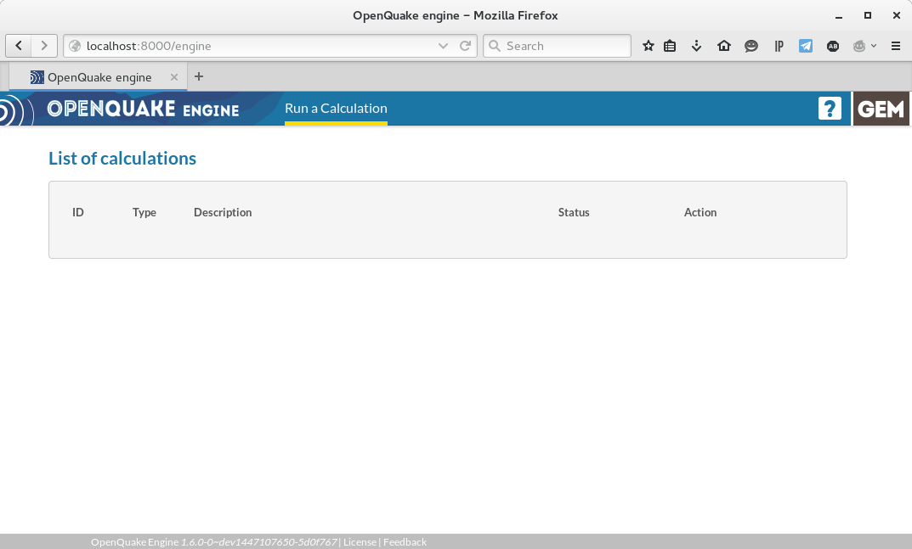
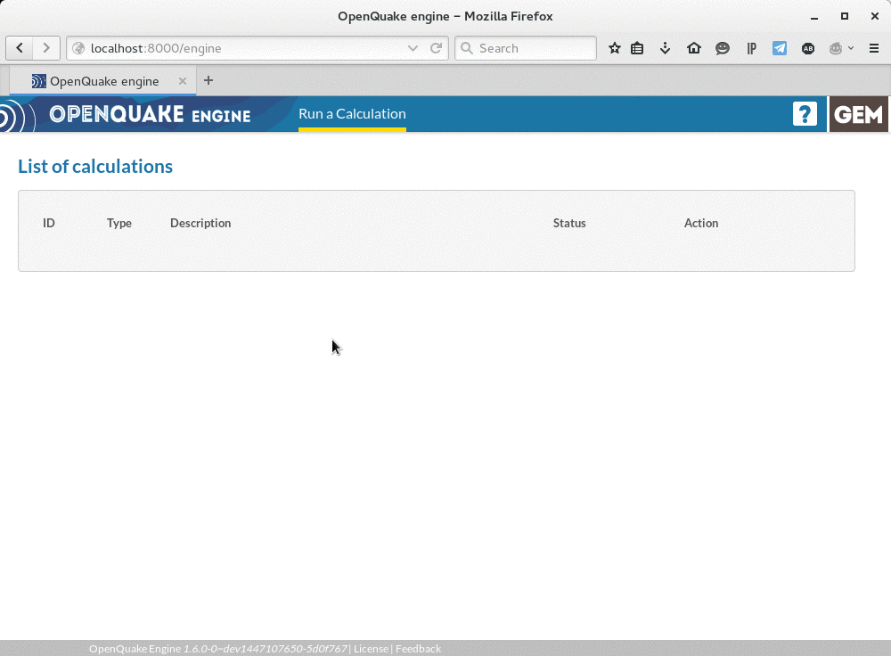
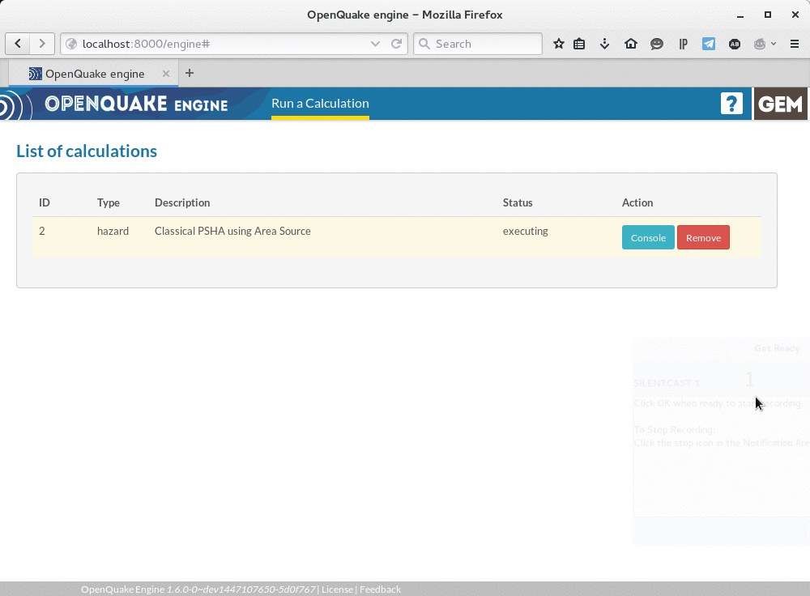
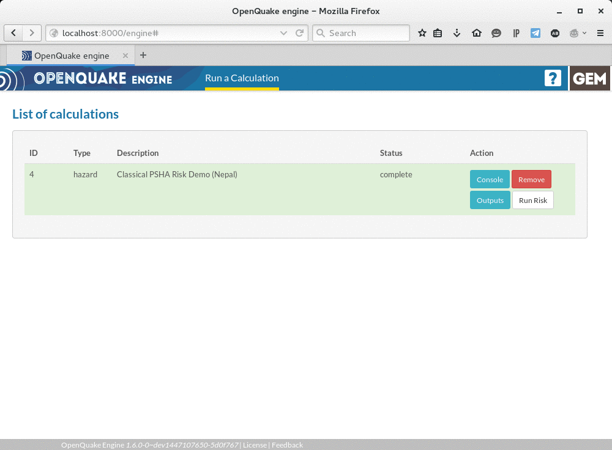
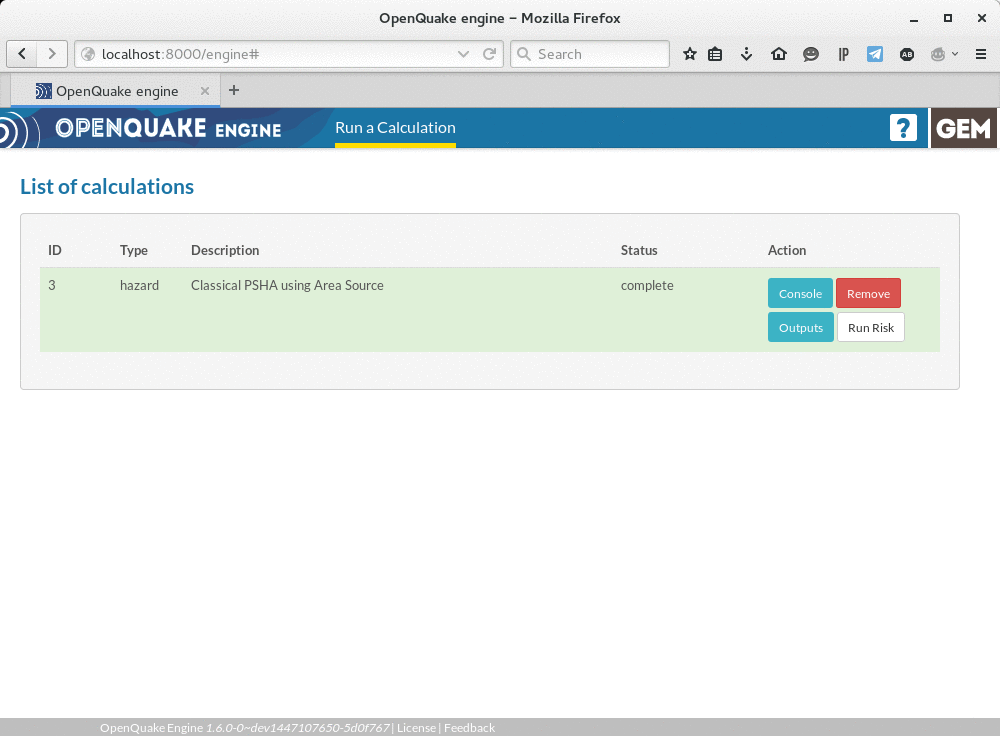
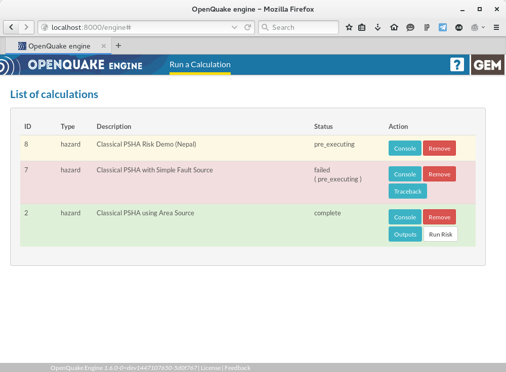

# The OpenQuake WebUI

## Starting the webui
### From sources
```bash
$ cd /path/to/oq-engine/openquake/server
$ python manage.py runserver
```

### From packages
```bash
$ cd /usr/lib/python2.7/dist-packages/openquake/server
$ python manage.py runserver
```

To stop the WebUI process press `CTRL-C`

## Using the webui

Open Firefox or Chrome and load the [http://localhost:8000/engine](http://localhost:8000/engine) page


### Start a calculation

Before starting a new calculation you need to prepare inputs. All the inputs file and the `job.ini` must be placed in a compressed zip file.

To start a calculation, having the input zip file, select the `Run a Calculation` button in the header menu. A dialog window will appear: select the zip file to be uploaded and press `Open` to confirm



### Watch the console log

It is possible to watch the log from a running calculation



The log from a previous run can be also inspected.

### Download outputs

If a calculation has run succesfully an `Outputs` button is provided. Click the `Outputs` button to see the list of outputs available for the specific calculation type.
Output availability depends on the type of artifacts generated by the calculation. The possible formats are `xml`, `csv`, `geojson`, `zip`. Click on the desired output/format to download the corresponding file


### Run a risk calculation on top of hazard

To run a risk-only calculation on top of a previous hazard run you have to click the `Run Risk` button on the corresponding hazard calculation and select the zip file containing the risk `job.ini` and the related inputs



### Remove a calculation

To hide a calculation from the list press the `Remove` button



The calculation is removed from the calculations list, but it is not actually removed from the database nor from the datastore.

### Calculation status

A calculation can be in the following statuses: `executing`, `complete`, `failed`



The reason behind a `failed` calculation can be inspected by using the `Traceback` button.

## Advanced use
### Authentication support
To `local_settings.py` add:
```python
LOCKDOWN = True
```
#### Sessions and users DB bootstrap
```bash
python manage.py syncdb
```

and add a a new local superuser

#### PAM
Authentication can rely on system users through `PAM`, the [Pluggable Authentication Module](https://en.wikipedia.org/wiki/Pluggable_authentication_module). To use this feature the [django-pam](https://github.com/tehmaze/django-pam) extension must be installed and activated

To `local_settings.py` add:

```python
AUTHENTICATION_BACKENDS = (
    'django.contrib.auth.backends.ModelBackend',
    'dpam.backends.PAMBackend',
)
```
The WebUI process owner must be member of the `shadow` group.

### Running with supervisord

On a production system [nginx](http://nginx.org/en/) + [supervisord](http://supervisord.org/) + [gunicorn](http://gunicorn.org/) is the reccomended software stack to run the WebUI.

#### Supervisord
[OpenQuake Engine WebUI supervisord configuration](supervisord.md)

#### Nginx
To `local_settings.py` add:

```python
STATIC_ROOT = '/var/www/webui'
```

Collect static files:

```bash
DJANGO_SETTINGS_MODULE="openquake.server.settings" python manage.py collectstatic
```

[OpenQuake Engine WebUI nginx configuration](nginx.md)

## Getting help
If you need help or have questions/comments/feedback for us, you can:
  * Subscribe to the developer mailing list: https://groups.google.com/forum/?fromgroups#!forum/openquake-dev
  * Contact us on IRC: irc.freenode.net, channel #openquake
