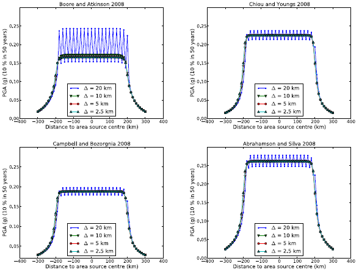
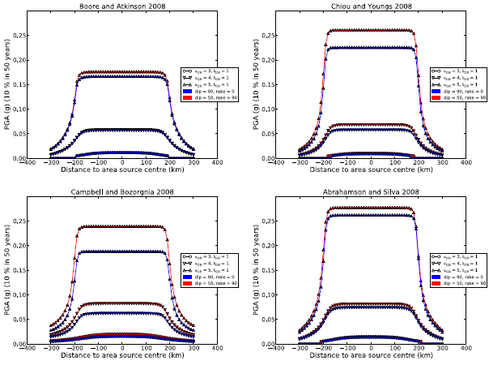
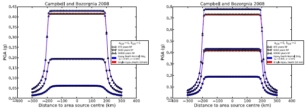
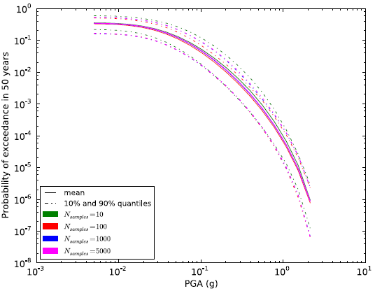
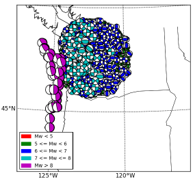
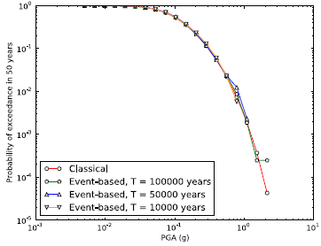
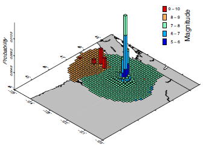
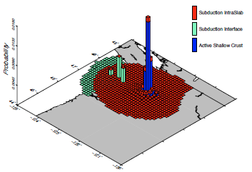

Calculation Examples
====================

This chapter presents some hazard results computed with the
OpenQuake engine. By considering simple synthetic test cases, we illustrate
the behaviour of a number of algorithms underlying the seismic source
modelling and the logic tree processing. We also present examples of
PSHA performed using the 2008 U.S. national seismic hazard model
(Petersen et al., 2008) to illustrate the
capabilities of the OpenQuake engine when dealing with complex models.

Classical PSHA with an Area Source
----------------------------------

We consider here the case of a single area source. The source has a
circular shape and a radious of 200 km. The activity is described by
a truncated Gutenberg-Richter magnitude frequency distribution, with
minimum magnitude equal to 5 and maximum magnitude equal to 6.5. The
*a-value* is 5 and *b-value* is 1. The seismogenic layer extends from
0 to 20 km. Ruptures are associated to a single hypocentral depth (10
km) and nodal plane (strike 0, dip 90, rake 0).

The area source discretization step
***********************************

We study here the effect of the area source discretization step (D)
in the calculation of hazard map values. That is, we investigate the
effect that the spacing used to discretize the region delimited by
the area source boundary has on hazard levels corresponding to a
given probability of exceedance. We thus compute hazard curves (for
PGA) on a set of locations equally spaced by 10 km defing a profile
crossing the centre of the area source, from east to west.

We compute hazard curves using different GMPEs (Boore and Atkinson,
2008, Chiou and Youngs, 2008, 
Campbell and Bozorgnia, 2008 and Abrahamson and
Silva, 2008) to investigate the potential
dependence of the results accuracy on the ground motion model. From
the hazard curves we extract PGA values corresponding to 10 % in 50
years. Results for four discretization levels (20, 10, 5, and 2.5 km)
are shown in the figure below.

When using D = 20 km, the hazard map values show strong fluctuations
(where the highest are for the Boore and Atkinson,
2008 model) within the area region (that is in
the distance range [-200, 200] km). For discretization steps equal to
or smaller than 10 km, the different solutions converge instead to
the same values.

   *The effect of the area source discretization step
   :math:`(\Delta)` on hazard results.*

The effect of dip and rake angles
*********************************

To investigate the effect of modelling earthquake ruptures with
different inclination (that is dip angle) and faulting style (rake
angle), we compare here hazard map values for an area source
generating only vertical, strike-slip ruptures and an area source
generating dipping (dip=50\ :sup:`◦`), reverse (rake=90\ :sup:`◦`)
ruptures.

To investigate the potential dependence on the source seismic
activity level, we compute hazard maps for area sources having
different Gutenberg-Richter a values :math:`a_{GR}` equal to 3, 4 and 5,
corresponding to annual occurrence rates above M = 5 of 0.01, 0.1
and 1, respectively. Results are shown in the figure below. 
Sensitivity of rupture dip and faulting
style clearly depends on the source activity level and on the GMPE
model. Independently of the GMPE, the highest absolute difference in
PGA is for the highest :math:`a_{GR}`. Among the different GMPE models,
Campbell and Bozorgnia (2008) shows the highest
sensitivity (about 20 lowest sensitivity).

The effect of the hypocentral depth distribution
************************************************

Another modeling parameter which can influence hazard estimates from
an area source is the hypocentral depth distribution. We show here
the effect of considering a single hypocentral depth value (10 km)
versus considering a set of normally distributed values with mean µ
= 10 km and standard deviation s = 4 km. By considering the same
source-sites configuration as in the previous analysis, and vertical
strike-slip ruptures with single strike (0\ :sup:`◦`), we compute
hazard results considering two :math:`a_{GR}` values (4 and 5). We use the
GMPE model of Campbell and Bozorgnia (2008). 
the second figure below shows the computed values along the
site profile for different return periods (RP) and :math:`a_{GR}` values.
The effect of the distribution of hypocentral values becomes visible
when considering long return periods (50000 years) and increases with
increasing :math:`a_{GR}`.

   *The effect of dip and rake angles on hazard
   results.*

   *The effect of hypocentral depth on hazard map
   calculation.*

   *Mean and quantile hazard
   curves obtained from Monte Carlo sampling of logic tree.*

Classical PSHA with complex logic tree
--------------------------------------

We consider here a synthetic case of a classical PSHA calculation
based on a simple source model consisting of 5 identical area
sources. Each source has a square shape of 0\ *.*\ 5\ :sup:`◦` side.
Four sources are arranged to form a regular mesh. The fifth source is
placed in the middle of the mesh and overlaps with the other four
sources. Each source can have 5 possible (:math:`a_{GR}`, :math:`b_{GR}`) pairs and
3 possible maximum magnitudes. Assuming the uncertainties to be
uncorrelated among sources, the total number of possible source
parameters combinations can be written as:

.. math::

 N = N^{N_s}_{GR} \times N^{N_s}_{MaxMag}

where :math:`N_{GR}` is the number of Gutenberg-Richter parameters (i.e.
:math:`a_{GR}` - :math:`b_{GR}` pairs) for each source, :math:`N_{MaxMag}` 
is the number of maximum magnitudes for each source, and :math:`N_{S}` is 
the number of sources. In the present case :math:`N_{GR}=5`, :math:`N_{MaxMag}=3`, 
:math:`N_{S}=5`, and thus :math:`N=5^5 \times 3^5 = 759375 N`. :math:`N` represents
the total number of paths in the source model logic tree.

The OpenQuake engine allows random sampling the logic tree to avoid
calculating hazard results for all possible logic tree paths. The last figure above
presents mean and quantile hazard curves as
obtained from different numbers of samples (10, 100, 1000, 5000). It
can be seen how, by increasing the number of samples, results tend to
converge to similar values. Indeed, curves obtained from 1000 and
5000 samples are almost indistinguishable. The Monte Carlo sampling
offers therefore an effective way to reduce the computational burden
associated with a large logic tree and to still obtain reliable
results. The results reliability can be controlled by performing a
convergence analysis; that is by identifying the number of samples
which are required to obtain values that are stable within a certain
tolerance level.

   *Stochastic event set for a region surrounding
   Seattle (U.S.) for a duration of 10000 years.*

Convergence between Classical and Event-based PSHA
--------------------------------------------------

The event based approach allows generating stochastic event sets and
ground motion fields which can then be used to reproduce the
classical results. We present here an event-based calculation for a
location corresponding to the city of Seattle. The calculation is
done using the 2008 seismic hazard model for conterminous U.S.
(Petersen et al., 2008). A stochastic event set
covering a period of 10000 years is generated (the figure above). 
The event set contains earthquake ruptures
within a radius of 200 km from the city of Seattle (longitude =
122.3W, latitude = 47.6N) including large subduction interface
earthquakes generated in the Cascadia region, as well as deep
intraslab and shallow active crust earthquakes. From each event,
ground shaking values are simulated in the city of Seattle
(considering the full set of GMPEs prescribed by the model). From
ground motion values, the mean hazard curve (probability of
exceedance in 50 years) for PGA is computed, and compared against the
one obtained using the classical approach (the figure below). 
The curve obtained can reliably reproduce
the probabilities of exceedance down to 10\ :sup:`—2`. For lower
probabilities a stochastic event set with longer duration is
required.

   *Hazard curves for Seattle using the
   Classical and Event-based approaches.*

Disaggregation analysis
-----------------------

We present here an example of disaggregation analysis for the city of
Seattle, again considering the 2008 national seismic hazard model for
U.S. developed by Petersen et al. (2008). In
particular, we show the geographic-magnitude (the first figure below) 
and geographic-tectonic region type (the second figure below) disaggregation 
histograms for PGA corresponding to 10% probability of exceedance in 50 years. 
The geographic disaggregation allows investigating the spatial
distribution of the seismic sources contributing to a given level of
hazard. By including magnitude and tectonic region type, we can
understand the influence of the different tectonic regions, and also
the magnitude ranges involved. Indeed, the disaggregation analysis
for the city of Seattle shows that, for a return period of 475 years,
the highest probabilities of ground motion exceedance are associated
with active shallow crust events with magnitudes in the range 6 to 7.
The second highest contributions are from subduction interface events
with magnitudes above 9. Subduction intraslab events are instead
associated to the lowest contributions.

  
   *Longitude, latitude and magnitude
   disaggregation for PGA corresponding to 10% probability of exceedance
   in 50 years.*

   *Longitude, latitude and tectonic region
   type disaggregation for PGA corresponding to 10% probability of
   exceedance in 50 years.*