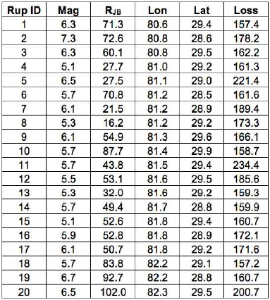
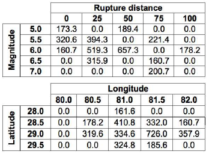
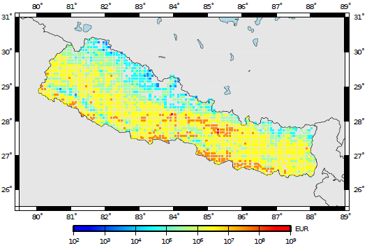
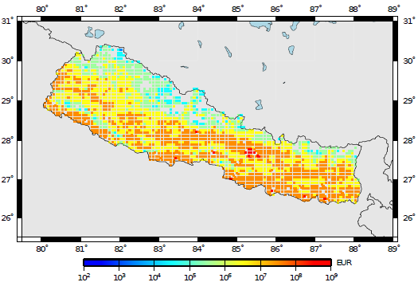
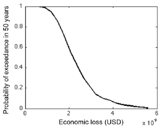
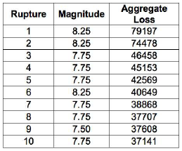
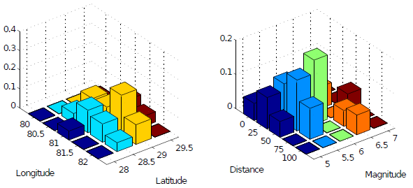

Probabilistic Event-Based Risk Calculator
=========================================

Introduction to Probabilistic Event-Based Risk Calculator
---------------------------------------------------------

The probabilistic event-based risk calculator uses *stochastic event
sets* and associated *ground– motion fields* to compute loss exceedance
curves for each *asset* contained in an *exposure model*. This calculator
thus requires *ground-motion fields* from a number of stochastic events
as an input, which the engine can calculate using the oq-hazardlib.

For each *ground-motion fields*, the intensity measure level at a given
site is combined with a *vulnerability function*, from which a loss
ratio is randomly sampled, for each *asset* contained in the *exposure
model*. The loss ratios that are sampled for *assets* of a given
*taxonomy* classification at different locations are considered to be
either independent or correlated. The losses for a given asset are
calculated using all of the *ground-motion fields*, leading to list of
events and associated loss ratios. This list is then sorted from the
highest loss ratio to the lowest. The rate of exceedance of each loss
ratio is calculated by dividing the number of exceedances of that
loss ratio by the number of *stochastic event sets* multiplied by the
length of each event set. By assuming a Poissionian distribution of
the occurrence model, the probability of exceedance of each loss
ratio is calculated. If a total loss curve for a portfolio of *assets*
is required, a secondary module is used in order to sum the losses
from all the *assets* in the exposure file, per event, before
calculating the exceedance distribution of loss. This distribution of
the total losses per event can also be extracted, and it is termed
here as an *event loss table*.

Similarly to what has been described for the Scenario Risk Calculator
(see section 4), this module can compute *insured losses* following the
same approach (i.e. modifying the loss based on the *deductible* and
*limit* for each cost type).

This calculator is also capable of performing *loss disaggregation* in
terms of magnitude/dis- tance or latitude/longitude. In order to do
so, the losses at each location are disaggregated based on the
aforementioned parameters, and a loss percentage for each possible
combination is calculated.

Steps of Calculation
--------------------

To compute the loss exceedance curves:

1. The oq-engine starts by using the set of *ground-motion fields* to
   extract the intensity measure levels for the location of each asset.
2. Then the oq-engine takes the *vulnerability function* assigned to each
   *asset* and checks if the coefficient of variation is zero. If so, the
   loss ratios are derived based on the mean loss ratio for each
   intensity measure level. Otherwise, if the uncertainty is defined, it
   is randomly sampled following the probabilistic distribution, mean
   loss ratio and associated coefficient of variation of the respective
   function, as described below:
   
.. math::

   \log(LR_n)=\mu+\epsilon\sigma

Where µ and σ stand for the mean and standard deviation of the
logarithm of the loss ratios respectively and :math:`\epsilon` is a term that 
has a standard normal distribution with a zero mean and a standard
deviation of one.

The method used to sample epsilon can follow tree approaches
depending on whether the correlation between the vulnerability of
*assets* of a given *taxonomy* is to be considered or not:

-  Perfectly correlated: the term :math:`\epsilon` is randomly sampled once for 
   the first asset and this result is used to derive the loss ratio for
   all the assets of the same taxonomy.
-  Correlated: the term :math:`\epsilon` is randomly sampled for each *asset*
   considering the specified correlation coefficient between *assets*.
-  Uncorrelated: the term :math:`\epsilon` is always randomly sampled for each 
   *asset* and therefore the correlation between the vulnerability of the
   *assets* is ignored.

3. Each loss ratio is multiplied by the associated asset value, leading
   to the absolute loss values. If these losses are related with the
   structural, non-structural or contents cost, the *insured losses*
   module can be used to modify the *ground-up losses* according to the
   associated *deductible* and *limit* thresholds, as described in section
   4.

4. In this method the losses to each *asset* for each event are estimated
   and then sorted from highest to lowest. The rate of exceedance of
   each loss is calculated by dividing the number of exceedances of that
   loss by the number of *stochastic event sets* multiplied by the length
   of each event set. Hence, the top loss will have zero exceedances,
   the next loss ratio will have one exceedance, and so on.

   The following formula is employed to compute the rate of exceedance:

.. math::
  
   \lambda(L_n)=\frac{NE_L}{TSES}

Where λ stands for the rate of exceedance of the respective loss
ratio, :math:`NE_L` stands for the number of exceedances of the given
loss, and :math:`TSES` stands for the time span of all *stochastic event
sets*, i.e. the number of *stochastic event sets* multiplied by the time
span of each.

5. Assuming a Poissonion distribution of the occurrence model, the
   probability of ex- ceedance of the set of losses in a given time span
   can be derived using the following formula:

.. math::

   PE(L_n)=1-\exp-\lambda_n\times t

Where t stands for the time span used to produce the *stochastic event set*.

To perform the loss disaggregation:

1. For the disaggregation of the losses it is necessary to provide the
   coordinates of the locations where this procedure should be employed.
   Then, for the selected locations, the oq-engine calculates the sum of
   the losses (considering all the assets existing at each of the
   selected sites) for each seismic event. In addition, the rupture
   distance (Joyner- Boore) and coordinates of the point within the
   vertical projection of the rupture plane closest to each site are
   estimated. An example of this type of information is presented in
   the figure below, for 20 stochastically produced seismic events.

   *Economic losses from a single asset for a set of
   seismic events.*

2. The oq-engine calculates the range (maximum and minimum values) of
   the list of magnitudes, distances, latitudes and longitudes across
   all the events, and using the increment defined for each parameter, a
   set of linearly spaced bins is calculated. Then, the losses from
   every seismic event are aggregated depending into which combination
   of magnitude/distance or latitude/longitude they fall. The previously
   presented losses have been disaggregated according to these two
   combinations as presented in the figure below:

   *Disaggregation of the economic losses according to a
   set of magnitude/distance and latitude/longitude combinations.*

3. The resulting losses for each pair of parameters (magnitude/distance
   and latitude/longitude) are divided by the total loss across all
   the events. This percentage of the overall loss for each combination
   is depicted in the last figure in the following section.

Calculator Output
-----------------

The output of this calculator comprises loss exceedance curves and
loss maps. Loss ex- ceedance curves are represented by a list of
losses and respective probabilities of exceedance. Furthermore, each
curve is associated with a pair of coordinates, an end branch label
(that allows the curve to be connected to the set of specifications
used in the calculations) and an asset ID (that permits tracking of
the asset that each loss curve was computed for). Loss maps for a
given probability of exceedance in a given time span can be produced,
as well as maps of mean loss within a given time span. The next two figures
present a loss map for a probability of exceedance of 1% and 10% in 
50 years for residential buildings located in Nepal, respectively.

   *Loss map for a probability of exceedance of 10% in 50 years.*

   *Loss map for a probability of exceedance of 1% in 50 years.*

For this calculator, total loss exceedance curves can be produced
which combine the losses to all assets per event. It is noted that
loss exceedance curves which present the probability of exceedance of
the aggregate annual losses, or maximum annual losses, are not yet
supported in the oq-risklib. In the figure below, a total loss exceedance
curve for the residential building portfolio in Nepal is presented.

   *Total loss exceedance curve for RC buildings.*

For what concerns the *event loss tables*, the oq-engine can extract
the total loss across all the assets for each seismic event. The
results is a table with the rupture id, magnitude and total loss, as
illustrated in the next figure.

   *Example of an event loss table.*

The output of the *loss disaggregation* is composed by the loss
fraction associated to each combination of parameters
(magnitude/distance or latitude/longitude), as presented in the figure below.

   *Example of a loss disaggregation according to a set of
   magnitude/distance and latitude/longitude combinations.*