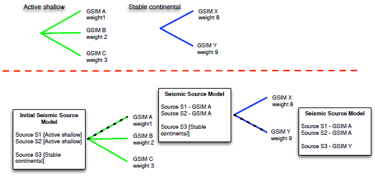
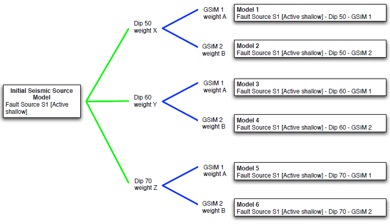
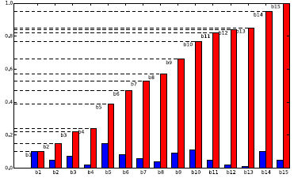

Logic-trees
===========

The logic-tree is an integral component of a PSHA input model for the
OpenQuake engine. An OpenQuake engine input model always contains a logic
tree structure describing the epistemic uncertainties associated with
the construction of the seismic source model and a logic-tree used to
formally specify the epistemic uncertainties related to the GSIM
models used in different tectonic regions for the calculation of
hazard.

The definition of logic trees in the OpenQuake engine is based on the
combination of a number of predefined modules, each one modelling a
specific epistemic uncertainty (see the figure below
for a schematic describing this particular feature). This approach
brings a number of advantages. The first and most obvious is that the
user is not forced to use a predefined logic tree structure and -
instead - can create a tailored logic tree which integrally reflects
the specific uncertainties they want to model. The second is that the
logic tree structure becomes an integral part of a PSHA input model
definition. The hazard calculations based on this approach are
testable, fully reproducible and do not require pre- or
post-processing steps since these are features included in the
engine.

This Chapter is dedicated to the description of the basic theory
behind logic-trees and to the delineation of how logic-trees are
implemented into the OpenQuake engine.

Introduction
------------

The use of logic-trees to account for epistemic uncertainties in
probabilistic seismic hazard analysis was originally proposed by
Kulkarni et al. (1984). Nowadays logic-trees are
an essential component of a PSHA input model and represent the formal
methodology though which is possible to synthesize the outcomes of
the elicitation process on epistemic uncertainties requested in
site-specific seismic hazard analyses (Budnitz et al.,
1997) as well as for the creation of state-of-the-art national and 
regional PSHA input models.

The interpretation of the branches in a logic tree structure, of
their corresponding weights and of the related results is still the
subject of an intense scientific debate going on in the literature
since 2005 (Abrahamson and Bommer, 2005; McGuire
et al., 2005; Musson, 2012; 
Scherbaum and Kuehn, 2011). There is however a
general agreement on the fact that the branches used to describe
alternative interpretations (or values of a parameter affected by
epistemic uncertainty) must be mutually exclusive and collectively
exhaustive (Bommer and Scherbaum, 2008). This
means that while processing the logic tree, once you choose one
option in the implementation of a model you automatically exclude the 
other possible interpretations (mutual exclusivity) and that the set 
of options described by the different branches represents the entire 
group of options admitted (collective exhaustiveness). While the first 
assumption is relatively easy to accept - although it presumes the lack 
of correlation between the uncertainties in the different branches - 
the second one certainly has implications that are more difficult and 
delicate to go along with since it presumes a comprehensive knowledge 
of a specific model uncertainty, knowledge that cannot be assumed *a priori*.

.. figure:: _images/modular_logic_tree_structure.png

   *An example of modular logic tree structure
   supported by the OpenQuake engine. The upper part of the figure contains two
   modules, one modeling the epistemic uncertainty on the dip angle of a
   fault, the other modeling the uncertainty on faults upper seismogenic
   depth.*

The OpenQuake engine logic-tree structure
-----------------------------------------

The OpenQuake engine offers a flexible and modular methodology to create
customised logic-tree structures. The main components of this
structure are (see for example the figure above):

- *branch*

  It is the elemental component of a logic-tree. A branch represents
  one possible interpreta- tion of a model or parameter affected by
  epistemic uncertainty. It is uniquely defined by a tuple consisting
  of a value and a real number in [0, 1] that can be either be
  considered a degree of confidence or a probability.

- *branch set*

  A branch set is a group of branches which collectively describes the
  (epistemic) uncertainty associated with a parameter or a model; the
  sum of weights for the branches within a branch set must be equal to
  one.

- *branching level*

  A branching level defines the position of a branch set within the
  logic tree structure. The lower is the value of the branching level
  the closer is the branch set to the roots of the tree.
  A branch set, as well as a branch, is defined with a unique
  identifier.

The logic-tree is the combination of a set of linked modules which
starting from the roots specify the structure until the uppermost
branches. A branch set can applied to all the sources included in the
initial seismic source model, to a subset of sources, to a branch
included in a branch set occurring before in the logic tree structure
or even just to a single source. Currently, the rules controlling the
application of a branch set incorporated into the OpenQuake engine are the
following:

- *applyToBranches*

  The current branch set is applied to one or more branches of the
  previous branching level designated through their unique ID;

- *applyToSources*

  The current branch set is applied to one or more sources included in
  one of the initial seismic source models and designated through their
  unique ID;

- *applyToSourceType*

  The current branch set is applied to all the sources of a specific
  type (e.g. simple fault sources) included in one of the initial
  seismic source models; 

- *applyToTectonicRegionType*

  The current branch set is applied to all the sources belonging to a
  selected tectonic region type (e.g. stable continental).

The schematic represented in Figure 5.1 shows an
example of the conceptual model adopted to describe a logic tree
structure.

The seismic source model logic tree
***********************************

The seismic source model logic tree handles the epistemic
uncertainties related to the definition of geometry, position and
seismicity occurrence properties of seismic sources capable of
generating ground-motion of engineering relevance at the investigated
site.

By default, the first branching level of a seismic source model logic
tree contains one (or several) initial seismic source model.
Currently is not possible to create a logic tree model by
incrementally adding different sources as - for example - in the case
of some of the logic tree structures included in the recently
presented CEUS-SSC model (Central and Eastern
United States Seismic Source Characterization for
Nuclear Facilities. 2012). This functionality will
be added into future versions of the software.

**Supported epistemic uncertainties**

At the present time the OpenQuake engine provides a limited set of modules
describing a specific epistemic uncertainty related to the creation
of the seismic source model. A short description of each module is
provided below. Note that the rules defined by each branch set are
applied to the sources in the input model matching one of the filters. If a branch set
has not a filter, then the associated epistemic uncertainty will be
applied to all the sources included in the seismic source model.

- *Seismic source model*

  This module allows the user to load one or several initial seismic
  source models. Using this module it is possible to use models with
  different source geometries and properties based on distinct
  assumptions or interpretations.

- *Relative uncertainty on the b-value of the double truncated Gutenberg-Richter relationship* 

  This branch set adds (or subtracts) a
  delta to the b-value of the double truncated Gutenberg-Richter
  relationship.

- *Uncertainty on the a-value of the double truncated Gutenberg-Richter relationship*

  This branch set assigns a specific value of the a-value of the double
  truncated Gutenberg-Richter relationship.

- *Uncertainty on the maximum magnitude of a double truncated Gutenberg-Richter distribution*

  This branch set considers the epistemic uncertainty on the maximum
  value of magnitude used to define a double truncated
  Gutenberg-Richter distribution. The application of this branch set
  adds (or subtracts) a delta value to the maximum magnitude.

- *Uncertainty on the maximum magnitude of a double truncated Gutenberg-Richter distribution*

  This branch set considers the epistemic uncertainty on the maximum
  value of magnitude used to define a double truncated
  Gutenberg-Richter distribution. The application of this branch set
  assigns a specific value of the maximum magnitude of a double
  truncated Gutenberg-Richter.

   *(upper panel) Example of branch sets belonging to
   the ground-motion logic tree. (lower panel) Example of ground-motion
   logic tree processing. The initial seismic source model, on the left,
   is propagated through a simple logic tree structure following the
   path indicated by the black dashed line. Model information is added
   incrementally as the input models propagate through the tree
   structure. In this example hazard is compute using GSIM A for the
   sources in active shallow tectonic region and GSIM Y for sources in
   stable continental region*

The ground-motion model logic tree
**********************************

The current structure of the ground-motion model logic tree is simple
and designed to support just the use of alternative GSIMs models for
a single tectonic region.

**Supported epistemic uncertainties**

The epistemic uncertainty allowed for the GSIM logic-tree is the
following:

- *Ground shaking intensity models*

  This module assigns to each tectonic region one or many GSIMs. This
  branch set implicitly contains a filter since it is applied only to
  the seismic sources belonging to the corresponding tectonic region.
  The example within the figure above illustrates the
  common processing of the ground-motion logic tree operated by the
  OpenQuake engine. In this example the source model contains seismic sources
  included in two tectonic domains: active tectonics and stable
  continental. The branch set defined for ’active shallow’ is therefore
  applied just to sources ’S1 and ’S3’ while the branch set for sources
  in stable continental regions is utilized only for source ’S3’.

Logic tree processing
---------------------

The OpenQuake engine currently provides two distinct ways to process
logic-trees: full-path enumeration and Monte Carlo sampling.

Full path enumeration is a methodology which generates all the models
admitted by a logic tree structure. For this reason, the use of this
methodology is feasible only when the logic tree structure is
relatively simple, that is when the number of end branches is at
maximum in the order of a few tens.

Monte Carlo sampling is instead a methodology which makes an
extensive use of random number generation in order to select a subset
of models capable to reliably define the overall uncertainty on the
final results produced by the epistemic uncertainties used in the
construction of the logic tree structure.

In the following sections we provide a short description of the these
two methodologies as implemented in the OpenQuake engine.

   *Logic tree full path enumeration processing. Note
   that the first branching level, the one dealing with the definition
   of the initial seismic source model is neglected since we assume
   there is no epistemic uncertainty associated with its definition. The
   final PSHA input model contains the initial sources each one with an
   associated GSIM to be used in the calculation of hazard for this
   specific logic tree path.*

Full-path enumeration
*********************

Full-path enumeration is the simplest methodology implemented in the
OpenQuake engine for logic-tree processing. As previously anticipated, it
consists of computing hazard for the entire set of investigated sites
using all the possible paths admitted by the specific logic tree
structure defined. Let’s consider the example described in the figure 
above to illustrate how this method operates.

The logic structure depicted in this figure contains two branching
levels each one including a single branch set. Note that for the sake
of simplicity and clarity we assume that the first branching level
(i.e. the one used to define the initial seismic source model) is not
affected by epistemic uncertainty. Note also that the initial seismic
source model contains only one fault source. The branch set in the
first branching level describes the epistemic uncertainty on the dip
angle; three values, each one with an associated probability, are
considered plausible. The second branch set describes the epistemic
uncertainties associated with the modelling of ground-motion; two
GSIMs are admitted in this case. On the right side of the figure the
entire set of models originated by the logic tree structure are
briefly described in terms of their distinctive parameters.

Monte Carlo sampling
********************

The Monte Carlo sampling of the logic tree is implemented in a simple
and straightforward way. Given a branch set, following the same order
used to add the branches we create a cumulative distribution function
like the one represented by the red bars in the figure below.
A sample model is then obtained from this
distribution simply via the generation of a random number (i.e. a
real number in the interval [0.0, 1.0]) and the identification of the
interval in the cumulative distribution which includes it. In the figure below
the endpoints of the intervals are
represented with horizontal dashed segments. Let’s assume for example
that the random number generator gives a value equal to 0.6. As
clearly visible on the y-axis, this value falls within the interval
relative to branch ’b9’. Following samples will be generated by
repeating the same procedure as many times as needed. Clearly the
higher is the weight associated with a branch the higher will be its
probability of being sampled. In the example figure the branch with
the higher weight is ’b5’.

A full path over the logic tree structure is built starting from the
initial seismic source model and repeating this sampling procedure at
each branching level.

   *On the x-axis an hypothetical list of branches
   included in a branch set. The height of the blue bar is proportional
   to the corresponding weight. The red bars show the cumulative
   distribution function.*

Calculation of mean and percentiles/quantiles
*********************************************

The calculation of statistical parameters on the computed hazard
results is done using the following approach.

From the set of hazard curves computed at a specific site we select
the probabilities of exceedance for a given intensity measure level
:math:`P=\{poe_1,poe_2,..,poe_n\}` where :math:`n`
is the number of realisations i.e. hazard results obtained by
processing the logic tree.

In case of a full path enumeration processing methodology, we arrange
:math:`P` in ascending order and we change the order of the corresponding
weights accordingly. Using these weights we compute the cumulative
distribution function (CDF). We intepolate the curve defined by the
CDF and the probabilities of exceedance (poes) to obtain the values
of poes corresponding to the quantiles defined by the user. Using the
computed values of the probability of exceedance we find the
corresponding curves.

In case of a logic tree processing based on a Monte Carlo sampling
the quantiles are computed from this set of probabilities using
standard methodologies.

Future developments
-------------------

The most urgent development with respect to this topic is the
expansion of the modules provided to model epistemic uncertainties at
the level of the seismic source modeling as well as for the
description of epistemic uncertainties involving the ground motion
model.