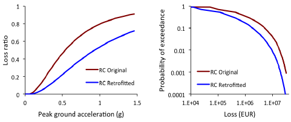
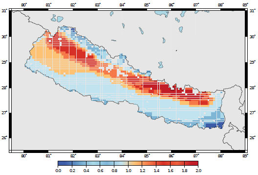

Retrofitting Benefit/Cost Ratio Calculator
==========================================

Introduction
------------

The retrofitting benefit/cost ratio calculator allows users to
understand if from an economical point of view, a collection of
buildings should be retrofitted. This calculator uses loss exceedance
curves that can be calculated using either the probabilistic
event-based risk or the classical PSHA-based risk calculators.
These curves need to be calculated considering two
*vulnerability models*: one with the original asset vulnerability, and
a second one using the retrofitted vulnerability configuration. The
average annual *ground-up losses* considering both vulnerability
configurations are calculated, and employed to estimate the economic
saving during the life expectancy (or design life) of the *assets*.
This benefit is divided by the retrofitting cost, thus obtaining the
benefit/cost ratio. This ratio is modified considering a discount
rate thhat serves the purpose of taking into account the variation of
building value throughout time. A benefit/cost ratio above one
indicates that a retrofitting intervention would be advantageous from
an economic point of view.

Steps of the Calculation
------------------------

1. This calculator starts by calculating loss exceedance curves for a
   collection of *assets*, using either the classical PSHA-based risk
   calculator or the probabilistic event-based risk calculators. Two
   configurations of the vulnerability need to be considered: original
   and retrofitted. Thus, for each *asset*, two loss exccedance curves are
   determined, as depicted in the next figure.

   *Vulnerability functions for the original and
   retrofitted configuration of a class of RC buildings (left) and
   respective loss exceedance curves (right).*

2. Then, an average annual loss :math:`AAL` for each vulnerability
   configuration is calculated by numerically integrating the respective
   loss exceedance curve.

3. For the calculation of the economic benefit :math:`B`, the following
   formula can be employed:

.. math::

   B=(AAL_{retrofitted}-AAL_{original})\times\frac{1-e^{rt}}{r}

where :math:`r` represents the discount rate, which serves the purposes of
considering the variation of the economic value of the *assets* during
their life expectancy, or design life (:math:`t`).

4. Finally, the previously defined benefit (:math:`B`) is divided by the
   retrofitting cost (:math:`C`), leading to the benefit/cost ratio (:math:`BCR`).
   This process is repeated for all the *assets* comprised in the *exposure
   model*.

Calculator Output
-----------------

The results of this calculator are stored in a benefit/cost ratio
map, which includes the :math:`AAL_{retrofitted}`, :math:`AAL_{original}` and the
resulting :math:`BCR` at each location. In the figure below, a map of
benefit/cost ratios for RC residential buildings in Nepal is
presented.

   *Retrofitting benefit/cost ratio map for
   residential buildings in Nepal.*