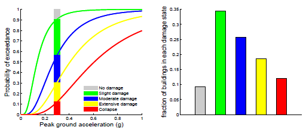
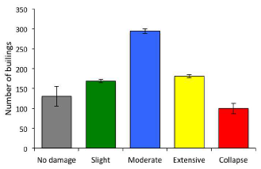
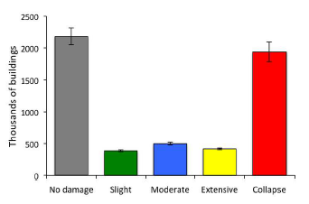
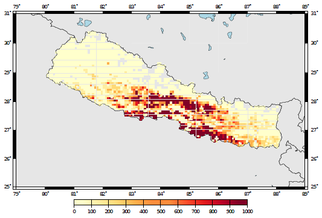

Scenario-Based Damage Calculator
================================

Introduction
------------

The scenario damage calculator can be employed to estimate the
distribution of damage due to a single earthquake, for a spatially
distributed building portfolio. Similarly to what has been described
for the scenario risk calculator, a finite *earthquake rupture* should
be used to derive sets of *ground-motion fields*.

In this calculator, each *ground-motion field* is combined with a
*fragility model* (discrete or continuous), in order to compute the
fractions of buildings in each damage state. These fractions are
calculated based on the difference in probabilities of exceedance
between consecutive limit state curves at a given intensity measure
level. This process is repeated for each *ground-motion field*, leading
to a list of fractions for each *asset*. These results can then be
multiplied by the respective number or area of buildings in order to
obtain the absolute building damage distribution.

Calculation Steps
-----------------

1. For each *ground-motion field*, the intensity measure level at the
   location of the *asset* is used to derive the fraction of buildings in
   each damage state. In order to do so, the distance between each pair
   of consecutive limit states is calculated. This process is
   illustrated in the figure below, using a continuous *fragility function*.

   When a continuous *fragility function* is used for the calculations,
   the fractions of building in each damage state are calculated using
   the analytical expression of the lognormal cumulative distribution
   functions. On the other hand, if a discrete *fragility function* was
   chosen, these fractions are computed using linear interpolation
   between the pair of points either side of the intensity measure
   level.

   *Representation of the fractions of building in each
   damage states, for a given intensity measure level (0.3 g).*

2. Step 1 is repeated for each *ground-motion field*, leading to a list of
   fractions (one per damage state), for each *asset*. From this list of
   values, the mean :math:`(E[FR])` and standard deviation :math:`(SD[FR])`
   for each fraction can be estimated using the following formulae:

.. math::

  E[FR] = \frac{\sum^{m}_{n=1}{FR_{n}|IML}}{m}

.. math::

  SD[FR] = \sqrt{\frac{1}{m} \sum^{m}_{n=1}{(FR_n-E[FR])}^2}
      
Where m stands for the number of *ground-motion fields* simulated.

3. These fractions of buildings in each damage state can be multiplied
   by the quantity of the respective asset, leading to the mean and
   standard deviation of the number or area of buildings in each damage
   state (see the first figure below).

4. This calculator is also capable of estimating the aggregated number
   or area of buildings from the same *taxonomy* in each damage state (see
   the second figure below). In order to do so, for each *ground-motion field*, the
   absolute quantity of buildings in each damage state is calculated,
   and aggregated according to their *taxonomy*. After processing all the
   *ground-motion fields*, the associated statistics for each building
   *taxonomy* are calculated according to the formulae described in Step
   2.

5. The total damage distribution is also calculated, by summing the
   quantity of buildings in each damage state, across all the *assets*
   existing in the building portfolio. This calculation will lead to a
   single damage distribution, represented by a mean and standard
   deviation for each damage state (see the third figure below).

Calculator Outputs
------------------

The output of the Scenario Damage Calculator currently comprises
damage distributions at three levels: per *asset*, per building
*taxonomy* and total. In addition, with this calculator, it is also
possible to extract collapse maps, which contain the spatial
distribution of the number or area of collapsed buildings throughout
the region of interest (see the fourth figure below). In the figures shown herein,
examples of the outputs are depicted for a scenario event of
magnitude 7.0Mw in the central region of Nepal.

 
  *Damage distribution for a single asset.*

.. figure:: _images/building_taxonomy_damage.png

  *Damage distribution according to the building
  taxonomy.*

  *Damage distribution of the whole building portfolio.*

  *Collapse map considering the whole building portfolio.*