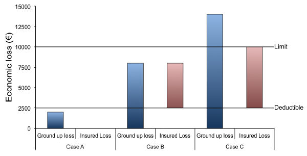
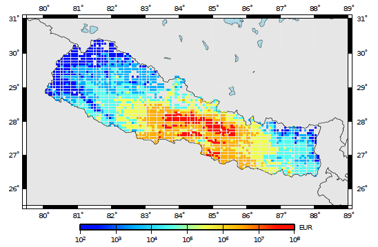

Scenario-Based Risk Calculator
==============================

Introduction to Scenario-Based Risk Calculator
----------------------------------------------

The scenario risk calculator is capable of computing losses and loss
statistics from a single event for a collection of assets, given a
set of *ground-motion fields*. The use of a set of *ground-motion fields*
is recommended so that the aleatory variability (both inter- and
intra- event) in the *ground-motion prediction equation* is modelled.
The input *ground-motion fields* can be calculated with oq-hazardlib or
by an external software; in either case they need to be stored in the
OpenQuake engine database. With the use of the oq-hazardlib, these
*ground-motion fields* can be calculated either with or without the
spatial correlation of the ground motion residuals.

For each *ground-motion field*, the intensity measure level at a given
site is combined with a *vulnerability function*, from which a loss
ratio is randomly sampled, for each *asset* contained in the *exposure
model*. The loss ratios that are sampled for *assets* of a given
*taxonomy* classification at different locations can be considered to
be either independent, fully correlated, or correlated with a
specific correlation coefficient. Using these results, the mean and
standard deviation of the loss ratios across all *ground-motion fields*
can be calculated. Loss ratios are converted into *ground-up losses* by
multiplying by the cost (which can be the structural, non-structural
or contents) of the *asset* given in the exposure model. It is
furthermore possible to sum the losses throughout the region and to
compute the mean and standard deviation of the total loss. This
process is common to any of the costs type (structural,
non-structural or contents) or occupants. Besides the *ground-up
losses*, it is also possible to calculate *insured losses* (i.e.
economic value that can be covered by the insurance industry
according to a certain policy). To do so, both a *deductible* and a
*limit* for each type of cost (structural, non-structural or contents)
need to be defined. The methodologies employed to calculate the
*ground-up losses* and *insured losses* are described below.

Steps of Calculation
--------------------

To compute the mean *ground-up losses*:

1. For each *ground-motion field*, the intensity measure level at the
   location of the *asset* is used to derive the mean loss ratio and
   associated coefficient of variation from the *vulnerability function*.
   Since currently the *vulnerability functions* are being defined in a
   discrete manner, it is quite probable that the intensity measure
   level provided by the *ground-motion field* is not contained in the
   *vulnerability function*. In these cases, linear interpolation methods
   are being employed to derive the mean loss ratio at the intensity
   measure level of interest.
2. The engine takes the *vulnerability function* assigned to each *asset*
   and checks if the coefficient of variation is zero. If so, the loss
   ratios are derived based on the mean loss ratio for each intensity
   measure level. Otherwise, if the uncertainty is defined, it is
   randomly sampled following the probabilistic distribution of the
   respective *vulnerability function*, as described below:

.. math::  

   \log\ LR_n = \mu + \epsilon\sigma

Where µ and σ stand for the mean and standard deviation of the
logarithm of the loss ratios, respectively, and *ǫ* is a term that
has a standard normal distribution with a zero mean and a standard
deviation of one.

The method used to sample epsilon depends on whether the correlation
between the vulnerability uncertainty of assets of a given taxonomy
is to be considered or not:

- Perfectly correlated: the term :math:`\epsilon` is randomly sampled once for 
  the first asset and this result is used to derive the loss ratio for all the 
  assets of the same taxonomy.
- Correlated: the term :math:`\epsilon` is randomly sampled for each asset
  considering the specified correlation coefficient between assets.
- Uncorrelated: the term :math:`\epsilon` is always randomly sampled for each 
  asset and therefore the correlation between the vulnerability of the assets 
  is ignored.

3. The mean loss ratio for each asset across all possible simulations of
   the scenario event can be calculated through the formula:

.. math::

   LR = \frac{\sum^{m}_{n=1}{LR_n\ | IML}}{m}

Where m stands for the number of ground motion fields simulated.

4. The mean loss can then be derived by multiplying the mean loss ratio
   by the value of the *asset* contained in the *exposure model* file.

To compute the standard deviation of the ground-up losses:

1. In order to compute the uncertainty, the engine takes the set of loss
   ratios for each *asset*, and computes the associated standard deviation
   using the classical formula:

.. math::

   SD[LR] = \sqrt{\frac{1}{m} \sum^{m}_{n=1}{(LR_n-E[LR])}^2}

Where :math:`E[LR]` stands for the mean loss ratio computed previously.

2. The standard deviation of the absolute loss can finally be computed
   by multiplying the standard deviation of the loss ratio by the value
   of the respective *asset*.

To compute the *insured losses*: The calculation of the insured losses
is valid for the structural, non-structural and contents costs. When
the computation of the insured losses is triggered, the ground-up
losses from each asset, at each *ground-motion field* are modified in
the following manner:

1. If the limit has been defined in a relative way, this fraction is
   first multiplied by the respective total cost, in order to obtain the
   absolute value. If the ground-up loss is above the absolute limit,
   the resulting loss is reduced to this threshold.

2. Then, the absolute deductible is taken directly from the exposure
   model, or calculated by multiplying the associated fraction by the
   respective total cost. Once the absolute deductible is obtained, the
   ground-up loss is further reduced by this amount. If the deductible
   is above the ground-up loss, then the insured loss is null.

   This process is clarified in the figure below.

   *Representation of the process to estimate the insured losses.*

In Case A, the ground-up loss does not exceed the deductible, which
leads to an insured loss equal to zero. In Case B, the ground-up loss
is above the deductible, but does not reach the limit. Hence, the
resulting insured loss if equal to the ground-up loss minus the
deductible. Finally, in Case C the ground up loss is greater than the
limit. Thus, this loss is firstly reduced to the value of the limit,
and then the deductible is subtracted. In other words, the portion of
the ground-up losses that are insured, is the fraction located
between the deductible and the limit thresholds.

3. The calculation of the mean and standard deviation of the insured
   losses follows the same approach described previously for the
   ground-up losses.

Calculator Output
-----------------

The output of the Scenario Risk Calculator currently comprises
ground-up and insured loss statistics (mean total loss and standard
deviation of total loss) and ground-up and insured loss maps. Loss
maps are comprised by a set of loss nodes, which are associated with
a pair of coordinates. For each node, one or more loss values might
exist, due to the fact that several different *assets* can be located
at the same location. The figure below presents an example of a loss map
containing the expected economic losses for residental buildings
located in Nepal, considering a rupture of magnitude 7.0Mw in the
central part of the country.

   *Loss map with the distribution of mean economic losses
   for residential buildings in Nepal.*