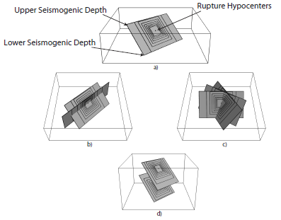
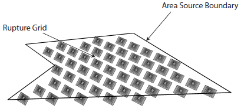
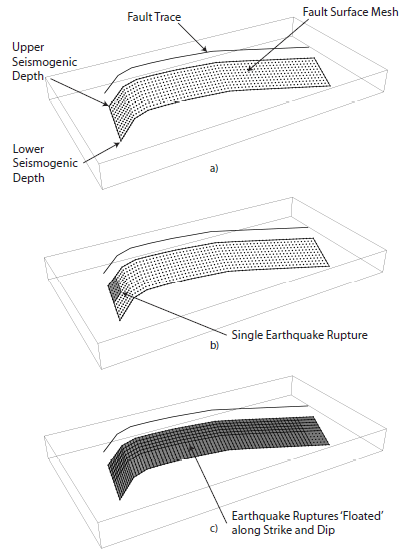
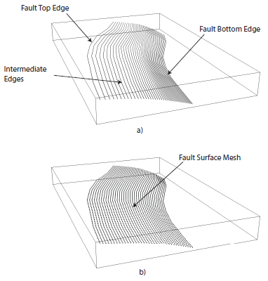
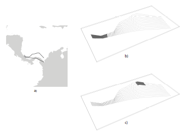
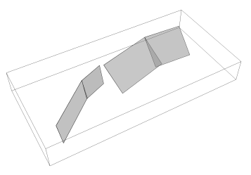

Seismic Source Models
=====================

This chapter describes the seismic source typologies supported by the
OpenQuake engine: *Point* and *Area* sources for modeling distributed
seismicity, *Simple Fault*, *Complex Fault*, and *Characteristic
Fault* for modeling fault-based seismcity.

Basic concepts
--------------

The OpenQuake engine provides several seismic source typologies to
accomodate different modeling approaches. For modeling distributed
seismicity, that is seismic activity occurring over a geographical
region and not tied to specific well characterized fault structures,
the OpenQuake engine provides the *Point* and *Area* sources. The former
defines seismic activity *nucleating in a single geographical
location*, while the second seismicity occurring *uniformly over a
geographical region*. Both sources define a seismogenic layer which
constrains rupture location and extension along depth. A collection
of Point sources can be used to model seismicity with spatially
variable parameters (as obtained from a smoothed seismicity approach
for instance), while Area sources can be used to model seismicity in
geographic zones usually defined by expert judgments taking into
account seismological, geological and geodetic information. Both
source typologies allow for the modeling of earthquake ruptures as
extended surfaces (that is as rectangular planes) with potentially
multiple orientations and inclinations (that is multiple strike and
dip angles) and also placed at different depth levels. Earthquake
ruptures can extend without barriers along strike but cannot cross
the seismogenic layer.

For modeling fault-based seismicity, that is seismic activity
occurring on a well identified and characterized fault zone, the
OpenQuake engine provides three main options, the *Simple Fault*, the
*Complex Fault* and the *Characteristic Fault* sources.

The Simple and Complex Faults distribute seismicity *uniformly over a
fault surface*, with the only constraint that an earthquake rupture
cannot extend outside of the defined fault surface. In both sources
an earthquake of a given magnitude is defined as a portion of the
fault surface. To simulate all possible rupture locations, an
earthquake rupture is moved, or *floated*, over the entire fault
surface. The two source typologies differ instead in terms of the
geometrical complexity they can accommodate when modeling a fault
surface. In particular, a Simple Fault source can model a fault
surface as a plain rectangle in the simplest case, or as a set of
connected parallelograms in the most complex case. A Complex Fault
source can instead model an arbitrarily complex quadrilateral
surface, which can therefore accommodate changes in dip angle along depth 
or along strike or changes in fault width. The Complex Fault source is 
therefore particularly suitable for modeling large subdution interface 
faults, while Simple Fault sources can be used for modeling crustal faults.

The *Characteristic Fault* source can model both simple and complex
geometries, but instead of simulating floating ruptures, each
earthquake breaks the entire fault surface independently of the
associated magnitude. The Characteristic Source typology can be used
to model individual faults or fault segments that tend to produce
essentially same size earthquakes (Schwartz and Coppersmith, 1984).

Independently of the typology, all sources require the definition of
the following main parameters:

-  magnitude-frequency distribution
-  temporal occurrence model
-  tectonic region type
-  magnitude-area scaling relationship (for all but the Characteristic Fault source)
-  rupture-aspect ratio (for all but the Characteristic Fault source)
-  upper seismogenic depth
-  lower seismogenic depth

The magnitude-frequency distribution defines the total moment rate
released by a source as well as the relative frequency of earthquakes
of different magnitude that can be generated by this source. It is
therefore a key object controlling the influence of a source in a PSHA.

The OpenQuake engine supports the definition of the traditional
*double-truncated Gutenberg-Richter* magnitude-frequency distribution
which is widely used in PSHA. The parameters required for its
definition are the :math:`a-value` (defined as the intercept of the
*cumulative* distribution at :math:`M = 0` in a :math:`\log_{10}` scale),
the :math:`b-value`, the minimum and the maximum magnitudes. In order to
accommodate other possible parametric (and non-parametric) forms of
the magnitude-frequency distribution, the OpenQuake engine provides a
generic discrete *Incremental* magnitude-frequency distribution
defined through a list of annual occurrence rates, associated to an
equally spaced set of magnitude values. The OQ-hazardlib contains
also a implementation of the Youngs and Coppersmith
(1985) magnitude-frequency distribution. This
distribution is currently non available in the OpenQuake engine. With future
releases, we plan to make this distribution available to the
OpenQuake engine users.

In a PSHA, the magnitude-frequency distribution is subject to a
discretization process which defines a set of equally spaced
magnitude bins and the associated annual occurrence rates (for an
*Incremental* magnitude-frequency distribution such a discretization
is part of its definition). For each source, the annual occurrence
rate associated to a magnitude bin is *uniformly* distributed over
all the ruptures associated to the same magnitude bin value. In other
words, while the particular geometry of a source determines location
and number of ruptures of a given magnitude, the occurrence rate (and
thus the occurrence probability) is uniform over ruptures with the
same magnitude.

The temporal occurrence model defines the functional form used to
compute the probability of the number of rupture occurrences in a
given time span based on the occurrence rate specified by the
magnitude frequency distribution, that is the term :math:`P_{rup_{ij}}(k|T)`
in the equation above. Currently the OpenQuake engine
defines only the Poissonian model but other functional forms can be introduced.

The tectonic region type is an attribute used as a key to associate a
seismic source to a ground motion model. Given a source model
describing seismicity occurring in a region including different
tectonic settings, the associated ground motion model may prescribe
different equations for the different tectonic settings. The mapping
between a ground motion model equation and a seismic source is
therefore achieved through the tectonic region type attribute.

All sources typologies supported by the OpenQuake engine generate ruptures
as extended surfaces.

*Table summarizing parameters, and their functions, required for the definition of Area and Point sources in the OpenQuake engine*

+---------------------------------+--------------------------------------+
|    **Parameter**                |    **Purpose**                       |
+=================================+======================================+
|    Magnitude frequency          |  Defines total moment rate and       |
|    distribution                 |  the relative frequency of           |
|                                 |  earthquakes of different magnitude  |
+---------------------------------+--------------------------------------+
|    Temporal occurrence model    |  Defines functional form for the     |
|                                 |  calculation of the probability of   |
|                                 |  the number of rupture occurences    |
|                                 |  in a given time span                |
+---------------------------------+--------------------------------------+
|    Magnitude area scaling       |    Define sizes and shapes of        |
|    relationship                 |    rupture planes                    |
|                                 |                                      |
|    Rupture aspect ratio (length |                                      |
|    / width)                     |                                      |
+---------------------------------+--------------------------------------+
|    Nodal plane distribution     |    Defines orientations and          |
|                                 |    faulting styles of ruptures       |
|    (each nodal plane being      |                                      |
|    defined by strike, dip,      |                                      |
|    rake)                        |                                      |
+---------------------------------+--------------------------------------+
|    Hypocentral depth            |    Defines centroids of rupture      |
|    distribution                 |    planes                            |
+---------------------------------+--------------------------------------+
|    Upper seismogenic depth      |    Constrains rupture planes         |
|                                 |    inside seismogenic layer          |
|    Lower seismogenic depth      |                                      |
|                                 |                                      |
+---------------------------------+--------------------------------------+

With the only exception of the Characteristic Fault source, the area
of an earthquake rupture surface is magnitude dependent. To constrain
the rupture surface area, the Point, Area, Simple and Complex Fault
sources require the definition of a *magnitude-area* scaling
relationship. This parameter together with a *rupture aspect ratio*
(defined as ratio between length and width) completely define the
rupture extension and shape (assumed rectangular). Indeed, indicating
with :math:`A` the rupture area and with :math:`ar` the rupture aspect ratio,
rupture length (:math:`L`) and and width (:math:`W`) can be computed as:

.. math::

 L = \sqrt{A \times ar}

.. math::

 W = \sqrt{\frac{A}{ar}}

In all sources, the rupture aspect ratio is used to constrain the
initial rupture shape. However, if this conflicts with other
source-dependent geometrical constrains, the rupture is reshaped so
as to conserve the area as given by the scaling relationship.

The upper and lower seismogenic depths define the seismogenic layer,
that is the depth range over which earthquake ruptures can extend.
The definition of a seismogenic layer is required to avoid an
uncontrolled extension of the earthquake ruptures along depth which
can lead, especially for large magnitude events, to unrealistic
scenarios. The definition of a seismogenic layer thickness
effectively induces a magnitude-dependent rupture aspect ratio.
Indeed, as the rupture size increases with increasing magnitude
values, the rupture width reaches the maximum allowed width, and the
rupture aspect ratio starts deviating, that is increasing, from the
original value.

The Point and Area sources
--------------------------

The parameters specific to the definition of Point and Area sources,
and their associated function, are listed in Table
3.1. Sources are parameterized so that earthquake
ruptures are modeled as rectangular planes. In a point-source
representation (Figure 3.1) ruptures are generated
underneath a single geographical location, and can be potentially
distributed over multiple orientations, faulting styles, and depth
levels. Rupture centroids are co-located with the point- source
location and are positioned at depths specified by the hypocentral
depth distribution. Rupture shapes follow the given aspect ratio.
However, if for a given aspect ratio and hypocentral depth the
rupture plane crosses either boundary (upper or lower) of the
seismogenic layer, the plane is shifted along the dip direction so as
to fit within the upper and lower seismogenic depths. As a
consequence, the hypocentral location no longer corresponds with the
plane centroid. If this adjustment is insufficient to avoid crossing
either boundary of the seismogenic layer, the plane is reshaped; the
width becomes the maximum allowed by the seismogenic layer thickness,
and the length is increased so as to conserve rupture area (at the
expense of the aspect ratio).

   *Graphical representation of the earthquake ruptures
   as generated by a Point Source. a) Given a geographical location on
   the Earth surface, ruptures are generated underneath according to a
   scaling relationship and aspect ratio value and forced to not exceed
   the upper and lower seismogenic depths. Ruptures can be distributed
   over multiple dips b), strikes c) and hypocentral depths d).*

In an area source, earthquake
ruptures are distributed over a regular grid (equally- spaced in
distance) covering a geographical region as defined by a seismic
zone. Generation of ruptures follows the same algorithm as for point
sources.

For both sources, the rate associated to each rupture plane is the
original rate associated to the corresponding magnitude bin, scaled
by the location weight (1 for a point source and 1/N for an area
source, where N is the total number of grid points in the area), the
nodal plane (that is orientation and faulting style) weight, and the
hypocentral depth weight.

   *Earthquake ruptures generated by an area source in
   the OpenQuake engine. Ruptures are distributed uniformly over a regular grid
   within the area. In this plot, for better visualization, ruptures are
   modeled only according to a single nodal plane and hypocentral depth,
   but actual calculations may involve multiple orientations and
   hypocentral depths. Ruptures originating from different grid nodes
   may also overlap and cross each other.*

For an area source, the boundary is assumed ‘leaky’, that is
earthquake ruptures can extend out of it. Because of rupture area
conservation, earthquake surfaces associated to large magnitudes can
extend well beyond the source boundaries. If the rupture orientation
is considered random then this behavior can potentially lead to
unrealistic scenarios, that is earthquake ruptures that are not
consistent with the area geometry and the tectonic feature it is
meant to represent. The design of an area source requires therefore a 
careful estimation not only of the associated activity rates but also 
of the predominant faulting orientations.

The OpenQuake engine does not currently provide the possibility to
define non-leaky boundaries. The main difficulty in the
implementation of such a feature is the definition of a clear
algorithm specifying how hard boundaries would influence the
generation of earthquake ruptures within the area source. Several
options are available. The easiest approach would be to remove, from
the set of generated ruptures, the ones that extend outside of the
boundary. This approach requires however a careful calculation of the
occurrence rates to be assigned to the earthquake ruptures. These
cannot be calculated anymore *a priori* (that is from the number of
grid points in the area source), but only after all the ruptures have
been generated and the ones crossing the boundary excluded.
Additionally, the removal of ruptures may also introduce a
non-uniform hazard pattern within the area source. An alternative
approach would be to truncate earthquake rupture surfaces that extend
outside of the area boundary. However, without a careful analysis of
the consistency between the main rupture orientations and source
geometry, this approach may potentially lead to large magnitude
events developing over very small rupture surfaces. A third approach
would be to adjust the earthquake orientation/location so that the
rupture surface does not extend beyond the area boundary. Depending
on the source geometry, such an adjustment may not be always possible
(that is, there may no be an orientation/location which allows a
rupture to fully lie within the area source). This last strategy can
be seen as a way to minimize the rupture extension outside of the
area source.

The Simple Fault source
-----------------------

Parameters required for the definition of a Simple Fault source are
given in the table below. The fault surface is
constructed by translating the fault trace (defined as the
intersection between the fault surface and the Earth s surface) from
the upper to the lower seismogenic depth along a direction
perpendicular to the fault trace strike (measured as the azimuth of
the great circle line connection the first and last coordinates of
the trace) and with an inclination equal to the dip angle. The
surface so defined is effectively modeled as a regular (i.e. equally
spaced in distance) mesh. For each
magnitude bin defined in the magnitude-frequency distribution, an earthquake 
rupture is modeled as a portion of the fault surface, accordingly with the 
magnitude scaling relationship and the rupture aspect ratio. 
To simulate all possible rupture locations, each earthquake rupture is
*floated*, that is moved, along both the strike and dip directions. The floating step is assumed equal
to the mesh discretization step. The occurrence rate associated to a
given magnitude bin is distributed uniformly over all the ruptures
associated with the same magnitude value.

   *Simple Fault source in the OpenQuake engine. The fault
   surface is obtained by translating the fault trace from the Earth’s
   surface to the lower seismogenic depth with an inclination equal to
   the dip angle. The upper seismogenic depth delimits the fault top
   edge. A mesh representation of the fault surface is then constructed
   a). An earthquake rupture is defined as a portion of the fault
   surface b), and all possible rupture locations are simulated by
   floating the rupture surface both along strike and along dip c)*

   *Table summarizing parameters, and their functions,
   required for the definition of a Simple Fault source in the
   OpenQuake engine*

+---------------------------------+------------------------------------+
|    **Parameter**                |    **Purpose**                     |
+=================================+====================================+
|    Magnitude frequency          |    Defines total moment rate and   |
|    distribution                 |    the relative frequency of       |
|                                 |    earthquakes of different        |
|                                 |    magnitude                       |
+---------------------------------+------------------------------------+
|    Temporal occurrence model    |    Defines functional form for the |
|                                 |    calculation of the probability  |
|                                 |    of the number of rupture        |
|                                 |    occurrences in a given time     |
|                                 |    span                            |
+---------------------------------+------------------------------------+
|    Magnitude area scaling       |    Define sizes and shapes of      |
|    relationship                 |    rupture planes                  |
|                                 |                                    |
|    Rupture aspect ratio (length |                                    |
|    / width)                     |                                    |
+---------------------------------+------------------------------------+
|    Fault trace                  |    Define fault surface            |
|                                 |                                    |
|    Upper seismogenic depth      |                                    |
|    Lower seismogenic depth Dip  |                                    |
|    angle                        |                                    |
+---------------------------------+------------------------------------+
|    Rake angle                   |    Defines faulting style          |
+---------------------------------+------------------------------------+

The rupture floating algorithm for a Simple Fault source
********************************************************

We describe here in more detail the algorithm adopted for modeling
floating ruptures in a Simple Fault source. We indicate with :math:`\Delta` the
mesh spacing, and with :math:`n^{fault}_{strike}` and :math:`n^{fault}_{dip}` 
the number of nodes along the strike and dip directions in the mesh representing
the entire fault surface. By indicating with :math:`L(M)` and :math:`W(M)`
the length and width of a rupture of magnitude *M*, the equivalent number of nodes
(along strike and dip) representing a rupture on the mesh can be
computed as:

.. math::

 n^{rup}_{strike}(M) = L(M)/\Delta+1

.. math::

 n^{rup}_{dip}(M) = W(M)/\Delta+1

By further assuming that a rupture is floated along strike and dip
with a step equal to the mesh spacing (D), we can compute the total
number of ruptures along strike and dip as:

.. math::

 N^{strike}_{rup}(M) = n^{fault}_{strike}-(n^{rup}_{strike}(M)-1)

.. math::

 N^{dip}_{rup}(M) = n^{fault}_{dip}-(n^{rup}_{dip}(M)-1)

Since a rupture can propagate until its boundary reaches the fault
boundary, but not beyond, the total number of possible rupture
locations along a certain dimension is equal to the total number of
nodes minus the number of nodes required by the rupture reduced by 1,
which represents the number of positions that a rupture cannot occupy
because it would otherwise extend, at least by one mesh spacing,
outside of the fault boundary. Indicating with :math:`\nu(M)` the annual
occurrence rate as given by the magnitude-frequency distribution, the annual
occurrence rate associated to each rupture of magnitude *M* is given by:

.. math::

 \nu_{rup}(M)=\frac{\nu(M)}{N^{strike}_{rup}(M) \times N^{dip}_{rup}(M)}

The occurrence rate scaling factor is therefore magnitude dependent
(in contrast with the Area Source where the scaling is constant for
all magnitudes).

*Table summarizing parameters, and their functions, required for the definition of a Complex Fault source in the OpenQuake engine*

+---------------------------------+------------------------------------+
|    **Parameter**                |    **Purpose**                     |
+=================================+====================================+
|    Magnitude frequency          |    Defines total moment rate and   |
|    distribution                 |    the relative frequency of       |
|                                 |    earthquakes of different        |
|                                 |    magnitude                       |
+---------------------------------+------------------------------------+
|    Temporal occurrence model    |    Defines functional form for the |
|                                 |    calculation of the probability  |
|                                 |    of the number of rupture        |
|                                 |    occurrences in a given time     |
|                                 |    span                            |
+---------------------------------+------------------------------------+
|    Magnitude area scaling       |    Define sizes and shapes of      |
|    relationship                 |    rupture planes                  |
|                                 |                                    |
|    Rupture aspect ratio (length |                                    |
|    / width)                     |                                    |
+---------------------------------+------------------------------------+
|    Top edge                     |    Define fault surface            |
|                                 |                                    |
|    Intermediate edges           |                                    |
|    (optional) Bottom edge       |                                    |
+---------------------------------+------------------------------------+
|    Rake angle                   |    Defines faulting style          |
+---------------------------------+------------------------------------+

The Complex Fault source
------------------------

Parameters required for the definition of a Complex Fault source are
given in the table above. To accommodate the definition
of irregular geometries, the Complex Fault source requires the
specification of the coordinates of, at least, the top and bottom
edges of the fault surface, and optionally, of one or more
intermediate edges. Edges can have
different and variable directions and a single edge can develop over
different depth levels. This gives a very large flexibility in the
definition of the fault surface, allowing for changes in width and
inclination both along strike and along dip.

Mesh construction in a Complex Fault source
*******************************************

The fault edges are used to construct a mesh representing the fault
surface. The mesh is, in general,
not uniform; that is, the mesh spacing may be spatially variable to
accommodate the irregular geometry of the surface. The construction
of the mesh relies on the following algorithm. By indicating with
:math:`\bar{L_{edge}}` the average edge length, and with D the desired mesh
spacing, the number of mesh points along the strike direction is
computed as:

.. math::

 n_{strike}= \frac{\bar{L}_{edge}}{\Delta+1}

Each edge is then resampled into :math:`n_{strike}` points. By connecting
the different edges along nodes that are on the same positions,
dipping lines can be constructed. By indicating with :math:`\bar{W}_{fault}` the
average fault width computed from the set of dipping lines, the
number of mesh points along dip is computed as:

.. math::

 n_{dip}= \frac{\bar{W}_{fault}}{\Delta+1}

   *Complex Fault source*

Each dipping line is then resampled into :math:`n_{dip}` points. This
completes the construction of the mesh which is therefore represented
by :math:`n_{strike} \times n_{dip}` nodes. It is worth noticing how the resampling
of the edges as well as of the dipping lines allows the construction
of a rectangular mesh which is however non-uniform. The actual mesh
spacing varies from values smaller than :math:`\Delta`, in regions where the fault
length or width is smaller than the corresponding average, to values
larger than :math:`\Delta` where the opposite occurs. :math:`\Delta`, which is basically used
to compute the number of nodes along strike and dip, should therefore
be considered as an *average* mesh spacing.

The rupture floating algorithm for a Complex Fault source
*********************************************************

The non-uniformity of the mesh representing the fault surface makes
the rupture floating algorithm for a Complex Fault source more
problematic than for a Simple Fault source. Indeed, because of the
variation of the actual mesh spacing, it is not possible to rely on
the mesh spacing :math:`\Delta` to compute the number of nodes required by a rupture of 
a given magnitude. For each
possible rupture location, an optimization procedure is used instead
which identifies the number of nodes along strike and dip which
gives a mesh surface with an area that is the closest to the one
predicted by the magnitude area scaling relationship. In other words,
the rupture mesh is represented by a number of nodes which is not
constant but that may vary along the fault surface. In this context,
the rupture aspect ratio is used to define the length of the rupture
top edge, while the rupture width results from the optimization
procedure. Such optimization procedure is well exemplified in the figure below. 
The fault surface represents a southward
dipping subduction fault located north of Panama defined in the model
for South America developed by (Petersen et al.,
2010). The figures shows how a :math:`M=7.7`
event is modeled in two different parts of the fault surface. Where
the fault is narrow (the western part) the rupture mesh contains a
large number of nodes, separated by a small distance. Where the fault
is large (the eastern part), the rupture mesh contains fewer nodes
but separated by a larger distance.

   *a) Example of Complex Fault source
   representing subduction interface fault in North of Panama (Petersen
   et al.,* 2010). *The mesh modeling a :math:`M = 7.7`
   *event is depicted in the eastern part*

The Characteristic Fault source
-------------------------------

The *Characteristic Fault* source is meant to represent individual
faults or fault segments that tend to produce earthquakes (Schwartz
and Coppersmith, 1984) of essentially the same
size. To offer the greatest flexibility in the definition of the
associated geometry, a Characteristic Fault can be defined in terms
of a simple fault geometry or as a complex fault geometry. A third
option is available, that is a collection of planar ruptures, which
can be used to model multi-segment ruptures for instance. In a Characteristic fault, earthquake
ruptures always break the entire fault surface, therefore the rupture
floating mechanism is not needed.

   *Example of Characteristic Fault sources defined
   through a collection of planar surfaces modeling a multi-segment
   rupture*