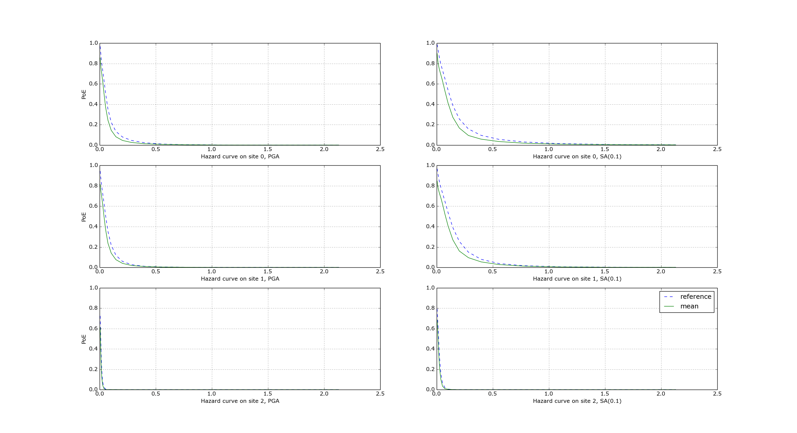

.. _event-based-calculations:

Event Based and Scenarios
=========================

Scenario risk calculations usually do not pose a performance problem, since they involve a single rupture and limited 
geographical region for analysis. Some event-based risk calculations, however, may involve millions of ruptures and 
exposures spanning entire countries or even continents. This section offers some practical tips for running large 
event-based risk calculations, especially ones involving large logic trees, and proposes techniques that might be used 
to make an otherwise intractable calculation tractable.

************************

Understanding the hazard
------------------------

Event-based calculations are typically dominated by the hazard component (unless there are lots of assets aggregated on 
a few hazard sites) and therefore the first thing to do is to estimate the size of the hazard, i.e. the number of GMFs 
that will be produced. Since we are talking about a large calculation, first of all, we need to reduce it to a size 
that is guaranteed to run quickly. The simplest way to do that is to reduce the parameters directly affecting the 
number of ruptures generated, i.e.

- investigation_time
- ses_per_logic_tree_path
- number_of_logic_tree_samples

For instance, if you have ``ses_per_logic_tree_path = 10,000`` reduce it to 10, run the calculation and you will see in 
the log something like this::

	[2018-12-16 09:09:57,689 #35263 INFO] Received
	{'gmfdata': '752.18 MB', 'hcurves': '224 B', 'indices': '29.42 MB'}

The amount of GMFs generated for the reduced calculation is 752.18 MB; and since the calculation has been reduced by a 
factor of 1,000, the full computation is likely to generate around 750 GB of GMFs. Even if you have sufficient disk 
space to store this large quantity of GMFs, most likely you will run out of memory. Even if the hazard part of the 
calculation manages to run to completion, the risk part of the calculation is very likely to fail — managing 750 GB of 
GMFs is beyond the current capabilities of the engine. Thus, you will have to find ways to reduce the size of the 
computation.

A good start would be to carefully set the parameters ``minimum_magnitude`` and ``minimum_intensity``:

- ``minimum_magnitude`` is a scalar or a dictionary keyed by tectonic region; the engine will discard ruptures with magnitudes below the given thresholds
- ``minimum_intensity`` is a scalar or a dictionary keyed by the intensity measure type; the engine will discard GMFs below the given intensity thresholds

Choosing reasonable cutoff thresholds with these parameters can significantly reduce the size of your computation when 
there are a large number of small magnitude ruptures or low intensity GMFs being generated, which may have a negligible 
impact on the damage or losses, and thus could be safely discarded.

For instance, at the time of this writing (summer 2024) the hazard model for
South America (SAM) contains 539,831 sites and a full realistic simulation
for 100,000 years without setting ``minimum_magnitude`` and ``minimum_intensity``
would be impossible, generating an estimated 3.5 TB of ground motion fields.
In order to give this estimate, the trick is to reduce the effective investigation
time to something manageable (say 1000 years), run the calculation and measure
the size of the generated GMFs. The numbers are as follows::

 eff_time = 1000
 num_events = 159_559
 num_ruptures = 151_119
 mean mag = 4.50
 gmf_data = 35.04 GB
 time(event_based) = 3_725

It is clear that the calculation is dominated by the small magnitude ruptures which
however are expected to have a minimum impact on the damage. Usually we consider
a ``minimum_magnitude`` of 5; with this setting the situation improves drastically::

 eff_time = 1000
 minimum_magnitude = 5
 num_events = 20_514
 num_ruptures = 20_381
 mean mag = 5.68
 gmf_data = 4.39 GB
 time(event_based) = 467

We produce 8x less events and 8x less GMFs in 8x less time. Most sites, however, are affected
by very small shaking values, so setting ``minimum_intensity`` will reduce a lot
more the size of the GMFs (6.5x)::

 eff_time = 1000
 minimum_magnitude = 5
 minimum_intensity = .05
 num_events = 20_514
 num_ruptures = 20_381
 mean mag = 5.68
 gmf_data = 0.67 GB
 time(event_based) = 439

In this example with 1000 years setting ``minimum_magnitude`` and
``minimum_intensity`` reduced the size of the generated GMFs by 8 *
6.5 = 52 times (!) In the realistic case of 100,000 years the saving
will be even larger, i.e. you can easily gain two orders of magnitude
in the size of the generated GMFs. It is not only that: setting those
parameters can make the difference between being able to run the
calculation and running out of memory.
This is why, starting from engine v1.21, such parameters are mandatory except
in toy calculations.

*******************

region_grid_spacing
-------------------

In our experience, the most common error made by our users is to compute the hazard at the sites of the exposure. The 
issue is that it is possible to have exposures with millions of assets on millions of distinct hazard sites. Computing 
the GMFs for millions of sites is hard or even impossible (there is a limit of 4 billion rows on the size of the GMF 
table in the datastore). Even in the cases when computing the hazard is possible, then computing the risk starting from 
an extremely large amount of GMFs will likely be impossible, due to memory/runtime constraints.

The second most common error is using an extremely fine grid for the site model. Remember that if you have a resolution 
of 250 meters, a square of 250 km x 250 km will contain one million sites, which is definitely too much. The engine was 
designed when the site models had resolutions around 5-10 km, i.e. of the same order of the hazard grid, while nowadays 
the vs30 fields have a much larger resolution.

Both problems can be solved in a simple way by specifying the ``region_grid_spacing`` parameter. Make it large enough 
that the resulting number of sites becomes reasonable and you are done. You will lose some precision, but that is 
preferable to not being able to run the calculation. You will need to run a sensitivity analysis with different values 
of region_grid_spacing parameter to make sure that you get consistent results, but that’s it.

Once a ``region_grid_spacing`` is specified, the engine computes the convex hull of the exposure sites and builds a 
grid of hazard sites, associating the site parameters from the closest site in the site model and discarding sites in 
the region where there are no assets (i.e. more distant than ``region_grid_spacing * sqrt(2)``). The precise logic is 
encoded in the function ``openquake.commonlib.readinput.get_sitecol_assetcol``, if you want to know the specific 
implementation details.

Our recommendation is to use the command ``oq prepare_site_model`` to apply such logic before starting a calculation and 
thus producing a custom site model file tailored to your exposure (see the section :ref:`prepare_site_model <prepare-site-model>`).

**********************

Collapsing of branches
----------------------

When one is not interested in the uncertainty around the loss estimates and cares more about the mean estimates, all of 
the source model branches can be “collapsed” into one branch. Using the collapsed source model should yield the same 
mean hazard or loss estimates as using the full source model logic tree and then computing the weighted mean of the 
individual branch results.

Similarly, the GMPE logic tree for each tectonic region can also be “collapsed” into a single branch. Using a single 
collapsed GMPE for each TRT should also yield the same mean hazard estimates as using the full GMPE logic tree and then 
computing the weighted mean of the individual branch results. This has become possible through the introduction of 
`AvgGMPE <https://github.com/gem/oq-engine/blob/engine-3.9/openquake/qa_tests_data/classical/case_19/gmpe_logic_tree.xml#L26-L40>`_ feature in version 3.9.

*****************************************

Splitting the calculation into subregions
-----------------------------------------

If one is interested in propagating the full uncertainty in the source models or ground motion models to the hazard or 
loss estimates, collapsing the logic trees into a single branch to reduce computational expense is not an option. But 
before going through the effort of trimming the logic trees, there is an interim step that must be explored, at least 
for large regions, like the entire continental United States. This step is to geographically divide the large region 
into logical smaller subregions, such that the contribution to the hazard or losses in one subregion from the other 
subregions is negligibly small or even zero. The effective realizations in each of the subregions will then be much 
fewer than when trying to cover the entire large region in a single calculation.

*******************************************************

Trimming of the logic-trees or sampling of the branches
-------------------------------------------------------

Trimming or sampling may be necessary if the following two conditions hold:

1. You are interested in propagating the full uncertainty to the hazard and loss estimates; only the mean or quantile results are not sufficient for your analysis requirements, AND
2. The region of interest cannot be logically divided further as described above; the logic-tree for your chosen region of interest still leads to a very large number of effective realizations.

Sampling is the easier of the two options now. You only need to ensure that you sample a sufficient number of branches 
to capture the underlying distribution of the hazard or loss results you are interested in. The drawback of random 
sampling is that you may still need to sample hundreds of branches to capture well the underlying distribution of the 
results.

Trimming can be much more efficient than sampling, because you pick a few branches such that the distribution of the 
hazard or loss results obtained from a full-enumeration of these branches is nearly the same as the distribution of the 
hazard or loss results obtained from a full-enumeration of the entire logic-tree.

Extra tips specific to event based calculations
-----------------------------------------------

Event based calculations differ from classical calculations because they produce visible ruptures, which can be 
exported and made accessible to the user. In classical calculations, instead, the underlying ruptures only live in 
memory and are normally not saved in the datastore, nor are exportable. The limitation is fundamentally a technical one: 
in the case of an event based calculation only a small fraction of the ruptures contained in a source are actually 
generated, so it is possible to store them. In a classical calculation all ruptures are generated and there are so many 
millions of them that it is impractical to save them, unless there are very few sites. For this reason they live in 
memory, they are used to produce the hazard curves and immediately discarded right after. The exception if for the case 
of few sites, i.e. if the number of sites is less than the parameter ``max_sites_disagg`` which by default is 10.

***************************************************

Convergency of the GMFs for non-trivial logic trees
---------------------------------------------------

In theory, the hazard curves produced by an event based calculation should converge to the curves produced by an 
equivalent classical calculation. In practice, if the parameters ``number_of_logic_tree_samples`` and 
``ses_per_logic_tree_path`` (the product of them is the relevant one) are not large enough they may be different. The 
engine is able to compare the mean hazard curves and to see how well they converge. This is done automatically if the 
option ``mean_hazard_curves = true`` is set. Here is an example of how to generate and plot the curves for one of our 
QA tests (a case with bad convergence was chosen on purpose)::

	$ oq engine --run event_based/case_7/job.ini
	<snip>
	WARNING:root:Relative difference with the classical mean curves for IMT=SA(0.1): 51%
	WARNING:root:Relative difference with the classical mean curves for IMT=PGA: 49%
	<snip>
	$ oq plot /tmp/cl/hazard.pik /tmp/hazard.pik --sites=0,1,2

The relative difference between the classical and event based curves is computed by computing the relative difference 
between each point of the curves for each curve, and by taking the maximum, at least for probabilities of exceedence 
larger than 1% (for low values of the probability the convergency may be bad). For the details I suggest you to look at 
the code.

***************************************************
