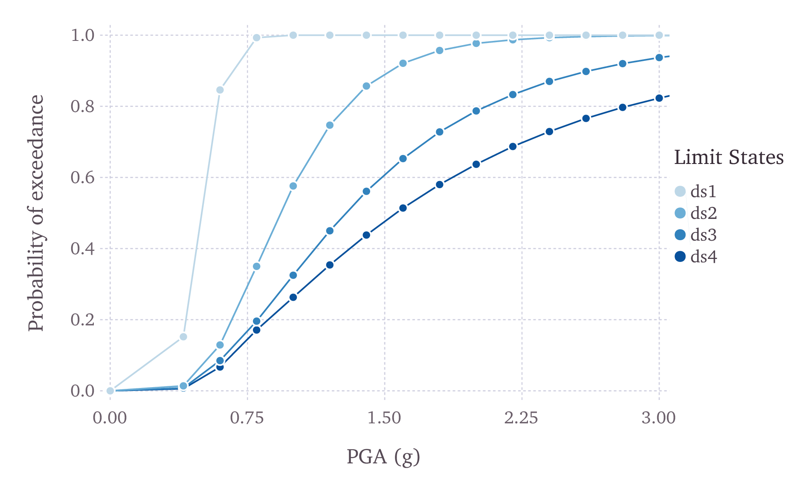
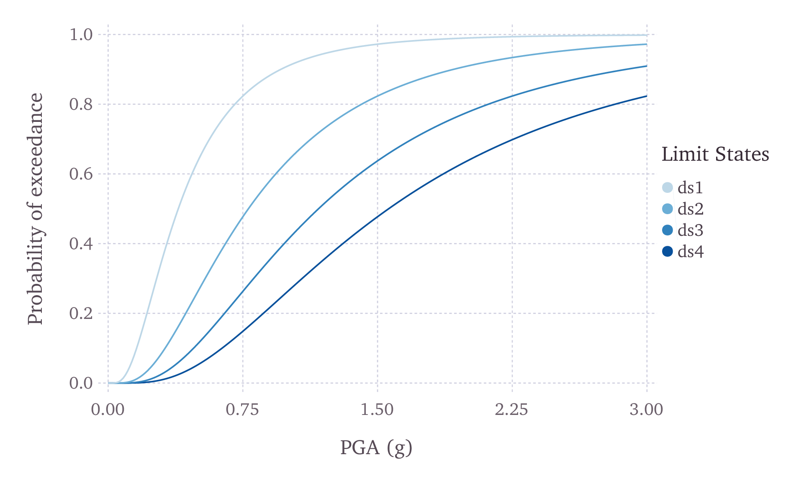

.. _fragility-models:

Fragility Models
================

This section describes the schema currently used to store fragility models, which are required for the Scenario Damage 
Calculator and the Classical Probabilistic Seismic Damage Calculator. In order to perform probabilistic or scenario damage 
calculations, it is necessary to define a *Fragility Function* for each building typology present in the *Exposure Model*. 
A *Fragility Model* defines a set of fragility functions, describing the probability of exceeding a set of limit, or 
damage, states. The fragility functions can be defined using either a discrete or a continuous format, and the *Fragility 
Model* file can include a mix of both types of fragility functions.

For discrete fragility functions, sets of probabilities of exceedance (one set per limit state) are defined for a list of 
intensity measure levels, as illustrated in :ref:`the figure below <discrete-fragility>`.

.. _discrete-fragility:

   Graphical representation of a discrete fragility model

The fragility functions can also be defined as continuous functions, through the use of cumulative lognormal distribution 
functions. In :ref:`the next figure <fragility-continuous>`, a continuous *Fragility Model* is presented.

.. _fragility-continuous:

   Graphical representation of a continuous fragility model

An example *Fragility Model* comprising one discrete Fragility Function and one continuous *Fragility Function* is shown 
in the listing below.::

	<?xml version="1.0" encoding="UTF-8"?>
	<nrml xmlns="http://openquake.org/xmlns/nrml/0.5">
	
	<fragilityModel id="fragility_example"
	                assetCategory="buildings"
	                lossCategory="structural">
	
	  <description>Fragility Model Example</description>
	  <limitStates>slight moderate extensive complete</limitStates>
	
	  <fragilityFunction id="Woodframe_TwoStorey" format="discrete">
	    <imls imt="PGA" noDamageLimit="0.05">0.005 0.2 0.4 0.6 0.8 1.0 1.2</imls>
	    <poes ls="slight">0.00 0.01 0.15 0.84 0.99 1.00 1.00</poes>
	    <poes ls="moderate">0.00 0.00 0.01 0.12 0.35 0.57 0.74</poes>
	    <poes ls="extensive">0.00 0.00 0.00 0.08 0.19 0.32 0.45</poes>
	    <poes ls="complete">0.00 0.00 0.00 0.06 0.17 0.26 0.35</poes>
	  </fragilityFunction>
	
	  <fragilityFunction id="RC_LowRise" format="continuous" shape="logncdf">
	    <imls imt="SA(0.3)" noDamageLimit="0.05" minIML="0.0" maxIML="5.0"/>
	    <params ls="slight" mean="0.50" stddev="0.10"/>
	    <params ls="moderate" mean="1.00" stddev="0.40"/>
	    <params ls="extensive" mean="1.50" stddev="0.90"/>
	    <params ls="complete" mean="2.00" stddev="1.60"/>
	  </fragilityFunction>
	
	</fragilityModel>
	
	</nrml>

The initial portion of the schema contains general information that describes some general aspects of the *Fragility 
Model*. The information in this metadata section is common to all of the functions in the *Fragility Model* and needs to 
be included at the beginning of every *Fragility Model* file. The parameters of the metadata section are shown in the 
snippet below and described after the snippet::

	<fragilityModel id="fragility_example"
	                assetCategory="buildings"
	                lossCategory="structural">
	
	  <description>Fragility Model Example</description>
	  <limitStates>slight moderate extensive complete</limitStates>

- ``id``: mandatory; a unique string used to identify the *Fragility Model*. This string can contain letters (a–z; A–Z), numbers (0–9), dashes (-), and underscores (_), with a maximum of 100 characters.
- ``assetCategory``: an optional string used to specify the type of assets for which fragility functions will be defined in this file (e.g: buildings, lifelines).
- ``lossCategory``: mandatory; valid strings for this attribute are “structural”, “nonstructural”, “contents”, and “business_interruption”.
- ``description``: mandatory; a brief string (ASCII) with further relevant information about the *Fragility Model*, for example, which building typologies are covered or the source of the functions in the *Fragility Model*.
- ``limitStates``: mandatory; this field is used to define the number and nomenclature of each limit state. Four limit states are employed in the example above, but it is possible to use any number of discrete states, as long as a fragility curve is always defined for each limit state. The limit states must be provided as a set of strings separated by white spaces between each limit state. Each limit state string can contain letters (a–z; A–Z), numbers (0–9), dashes (-), and underscores (_). Please ensure that there is no whitespace within the name of any individual limit state.

The following snippet from the above *Fragility Model* example file defines a discrete *Fragility Function*::

	  <fragilityFunction id="Woodframe_TwoStorey" format="discrete">
	    <imls imt="PGA" noDamageLimit="0.05">0.005 0.2 0.4 0.6 0.8 1.0 1.2</imls>
	    <poes ls="slight">0.00 0.01 0.15 0.84 0.99 1.00 1.00</poes>
	    <poes ls="moderate">0.00 0.00 0.01 0.12 0.35 0.57 0.74</poes>
	    <poes ls="extensive">0.00 0.00 0.00 0.08 0.19 0.32 0.45</poes>
	    <poes ls="complete">0.00 0.00 0.00 0.06 0.17 0.26 0.35</poes>
	  </fragilityFunction>

The following attributes are needed to define a discrete *Fragility Function*:

- ``id``: mandatory; a unique string used to identify the taxonomy for which the function is being defined. This string is used to relate the *Fragility Function* with the relevant asset in the *Exposure Model*. This string can contain letters (a–z; A–Z), numbers (0–9), dashes (-), and underscores (_), with a maximum of 100 characters.
- ``format``: mandatory; for discrete fragilityfunctions, this attribute should be set to ``“discrete”``.
- ``imls``: mandatory; this attribute specifies the list of intensity levels for which the limit state probabilities of exceedance will be defined. In addition, it is also necessary to define the intensity measure type (``imt``). Optionally, a ``noDamageLimit`` can be specified, which defines the intensity level below which the probability of exceedance for all limit states is taken to be zero.
- ``poes``: mandatory; this field is used to define the probabilities of exceedance (``poes``) for each limit state for each discrete *Fragility Function*. It is also necessary to specify which limit state the exceedance probabilities are being defined for using the attribute ``ls``. The probabilities of exceedance for each limit state must be provided on a separate line; and the number of exceedance probabilities for each limit state defined by the ``poes`` attribute must be equal to the number of intensity levels defined by the attribute ``imls``. Finally, the number and names of the limit states in each fragility function must be equal to the number of limit states defined earlier in the metadata section of the *Fragility Model* using the attribute ``limitStates``.

The following snippet from the above *Fragility Model* example file defines a continuous *Fragility Function*::

	  <fragilityFunction id="RC_LowRise" format="continuous" shape="logncdf">
	    <imls imt="SA(0.3)" noDamageLimit="0.05" minIML="0.0" maxIML="5.0"/>
	    <params ls="slight" mean="0.50" stddev="0.10"/>
	    <params ls="moderate" mean="1.00" stddev="0.40"/>
	    <params ls="extensive" mean="1.50" stddev="0.90"/>
	    <params ls="complete" mean="2.00" stddev="1.60"/>
	  </fragilityFunction>

The following attributes are needed to define a continuous *Fragility Function*:

- ``id``: mandatory; a unique string used to identify the taxonomy for which the function is being defined. This string is used to relate the *Fragility Function* with the relevant asset in the *Exposure Model.* This string can contain letters (a–z; A–Z), numbers (0–9), dashes (-), and underscores (_), with a maximum of 100 characters.
- ``format``: mandatory; for continuous fragility functions, this attribute should be set to ``“continuous”``.
- ``shape``: mandatory; for continuous fragility functions using the lognormal cumulative distrution, this attribute should be set to ``“logncdf”``. At present, only the lognormal cumulative distribution function can be used for representing continuous fragility functions.
- ``imls``: mandatory; this element specifies aspects related to the intensity measure used by the the *Fragility Function*. The range of intensity levels for which the continuous fragility functions are valid is specified using the attributes ``minIML`` and ``maxIML``. In addition, it is also necessary to define the intensity measure type ``imt``. Optionally, a ``noDamageLimit`` can be specified, which defines the intensity level below which the probability of exceedance for all limit states is taken to be zero.
- ``params``: mandatory; this field is used to define the parameters of the continuous curve for each limit state for this *Fragility Function*. For a lognormal cumulative distrbution function, the two parameters required to specify the function are the mean and standard deviation of the intensity level. These parameters are defined for each limit state using the attributes ``mean`` and ``stddev`` respectively. The attribute ``ls`` specifies the limit state for which the parameters are being defined. The parameters for each limit state must be provided on a separate line. The number and names of the limit states in each *Fragility Function* must be equal to the number of limit states defined earlier in the metadata section of the *Fragility Model* using the attribute ``limitStates``. A point worth clarifying is that the parameters to be defined in the fragility input file are the mean and standard deviation of the intensity measure level (IML) for each damage state, and not the mean and standard deviation of log(IML). Thus, if the intensity measure is PGA or SA for instance, the units for the input parameters will be ’g’.

Note that the schema for representing fragility models has changed between Natural hazards’ Risk Markup Language v0.4 
(used prior to OpenQuake engine v1.7) and Natural hazards’ Risk Markup Language v0.5 (introduced in OpenQuake engine v1.7).

A deprecation warning is printed every time you attempt to use a *Fragility Model* in the old Natural hazards’ Risk 
Markup Language v0.4 format in an OpenQuake engine v1.7 (or later) risk calculation. To get rid of the warning you must 
upgrade the old fragility models files to Natural hazards’ Risk Markup Language v0.5. You can use the command 
``upgrade_nrml`` with oq to do this as follows::

	user@ubuntu:~$ oq upgrade_nrml <directory-name>

The above command will upgrade all of your old *Fragility Model* files to Natural hazards’ Risk Markup Language v0.5. The 
original files will be kept, but with a .bak extension appended. Notice that you will need to set the ``lossCategory`` 
attribute to its correct value manually. This is easy to do, since if you try to run a computation you will get a clear 
error message telling the expected value for the ``lossCategory`` for each file.

Several methodologies to derive fragility functions are currently being evaluated by GEM Foundation and have been included 
as part of the Risk Modeller’s Toolkit, the code for which can be found on a public repository at GitHub at the following 
address: `gemsciencetools/rmtk <http://github.com/gemsciencetools/rmtk>`_.

A web-based tool to build a *Fragility Model* in the Natural hazards’ Risk Markup Language schema are also under 
development, and can be found at the OpenQuake platform at the following address: https://platform.openquake.org/ipt/.