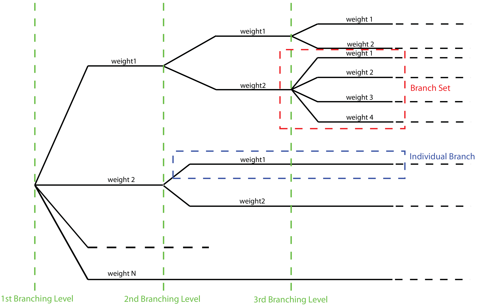

.. _logic-trees:

Logic Trees
===========

Defining Logic Trees
--------------------

The main components of a logic tree structure in the OpenQuake engine are the following:

**Branch:**
   The simplest component of a logic tree structure. A Branch represent a possible interpretation of a value assignment 
   for a specific type of uncertainty. It is fully described by the tuple (parameter or model, weight).

**Branching set:**
   It is a key component in the logic tree structure used by the OpenQuake engine. It groups a set of branches i.e. 
   alternative interpretations of a parameter or a model. Each branching set is defined by:

   - An ID
   - An uncertainty type (for a comprehensive list of the types of uncertainty currently supported see section :ref:`Logic trees as described in the nrml schema <logic-trees-nrml>`)
   - One or more branches

   This set of uncertainties can be applied to the whole initial seismic source input model or just to a subset of 
   seismic sources. The sum of the weights/probabilities assigned to the set of branches always correspond to one.

Below we provide a simple schema illustrating the skeleton of xml file containing the desciption of a logic tree::

	    <logicTreeBranchSet branchSetID=ID
	                        uncertaintyType=TYPE>
	        <logicTreeBranch>
	            <uncertaintyModel>VALUE</uncertaintyModel>
	            <uncertaintyWeight>WEIGHT</uncertaintyWeight>
	        </logicTreeBranch>
	    </logicTreeBranchSet>

As it appears from this example, the structure of a logic tree is a set of nested elements.

A schematic representation of the elemental components of a logic tree structure is provided in :ref:`the figure below <generic-logic-tree>`. 
A Branch set identifies a collection of branches (i.e. individual branches) whose weights sum to 1.

.. _generic-logic-tree:

   Generic Logic Tree structure as described in terms of Branch sets, and individual branches.

.. _logic-trees-nrml:

Logic trees as described in the nrml schema
-------------------------------------------

In the NRML schema, a logic tree structure is defined through the ``logicTree`` element::

	<logicTree logicTreeID="ID">
	...
	</logicTree>

A ``logicTree`` contains as a sequence of ``logicTreeBranchSet`` elements.

There are no restrictions on the number of Branch set that can be defined.

Each ``logicTreeBranchSet`` has two required attributes: ``branchSetID`` and ``uncertaintyType``. The latter defines the 
type of epistemic uncertainty this *Branch* set is describing.::

	<logicTree logicTreeID="ID">
	             <logicTreeBranchSet branchSetID="ID_1"
	                     uncertaintyType="UNCERTAINTY_TYPE">
	                     ...
	             </logicTreeBranchSet>
	             <logicTreeBranchSet branchSetID="ID_2"
	                     uncertaintyType="UNCERTAINTY_TYPE">
	                     ...
	             </logicTreeBranchSet>
	             ...
	             <logicTreeBranchSet branchSetID="ID_N"
	                     uncertaintyType="UNCERTAINTY_TYPE">
	                     ...
	             </logicTreeBranchSet>
	...
	</logicTree>

Possible values for the ``uncertaintyType`` attribute are:

- ``gmpeModel``: indicates epistemic uncertainties on ground motion prediction equations
- ``sourceModel``: indicates epistemic uncertainties on source models
- ``maxMagGRRelative``: indicates relative (i.e. increments) epistemic uncertainties to be added (or subtracted, depending on the sign of the increment) to the Gutenberg-Richter maximum magnitude value.
- ``bGRRelative``: indicates relative epistemic uncertainties to be applied to the Gutenberg-Richter b value.
- ``abGRAbsolute``: indicates absolute (i.e. values used to replace original values) epistemic uncertainties on the Gutenberg-Richter a and b values.
- ``maxMagGRAbsolute``: indicates (absolute) epistemic uncertainties on the Gutenberg-Richter maximum magnitude.
- ``incrementalMFDAbsolute``: indicates (absolute) epistemic uncertainties on the incremental magnitude frequency distribution (i.e. alternative rates and/or minimum magnitude) of a specific source (can only be applied to individual sources)
- ``simpleFaultGeometryAbsolute``: indicates alternative representations of the simple fault geometry for an individual simple fault source
- ``simpleFaultDipRelative``: indicates a relative increase or decrease in fault dip for one or more simple fault sources
- ``simpleFaultDipAbsolute``: indicates alternative values of fault dip for one or more simple fault sources
- ``complexFaultGeometryAbsolute``: indicates alternative representations of complex fault geometry for an individual complex fault source
- ``characteristicFaultGeometryAbsolute``: indicates alternative representations of the characteristic fault geometry for an individual characteristic fault source

A ``branchSet`` is defined as a sequence of ``logicTreeBranch`` elements, each specified by an ``uncertaintyModel`` 
element (a string identifying an uncertainty model; the content of the string varies with the ``uncertaintyType`` 
attribute value of the branchSet element) and the ``uncertaintyWeight`` element (specifying the probability/weight 
associated to the ``uncertaintyModel``)::

	< logicTree  logicTreeID="ID">
	...
	
	             < logicTreeBranchSet  branchSetID="ID_#"
	                             uncertaintyType="UNCERTAINTY_TYPE">
	                     < logicTreeBranch  branchID="ID_1">
	                             <uncertaintyModel>
	                                 UNCERTAINTY_MODEL
	                             </uncertaintyModel>
	                             <uncertaintyWeight>
	                                 UNCERTAINTY_WEIGHT
	                             </uncertaintyWeight>
	                     </ logicTreeBranch >
	                     ...
	                     < logicTreeBranch  branchID="ID_N">
	                             <uncertaintyModel>
	                                 UNCERTAINTY_MODEL
	                             </uncertaintyModel>
	                             <uncertaintyWeight>
	                                 UNCERTAINTY_WEIGHT
	                             </uncertaintyWeight>
	                     </logicTreeBranch>
	             </logicTreeBranchSet>
	...
	</logicTree >

Depending on the ``uncertaintyType`` the content of the ``<uncertaintyModel>`` element changes:

- if ``uncertaintyType="gmpeModel"``, the uncertainty model contains the name of a ground motion prediction equation 
  (a list of available GMPEs can be obtained using ``oq info gsims`` and these are also documented 
  `here <https://docs.openquake.org/oq-engine/reference/master/openquake.hazardlib.gsim.html>`_)::

	<uncertaintyModel>GMPE_NAME</uncertaintyModel>

- if ``uncertaintyType="sourceModel"``, the uncertainty model contains the paths to a source model file, e.g.::

	<uncertaintyModel>SOURCE_MODEL_FILE_PATH</uncertaintyModel>

- if ``uncertaintyType="maxMagGRRelative"``, the uncertainty model contains the increment to be added (or subtracted, 
  depending on the sign) to the Gutenberg-Richter maximum magnitude::
	
	<uncertaintyModel>MAX_MAGNITUDE_INCREMENT</uncertaintyModel>

- if ``uncertaintyType="bGRRelative"``, the uncertainty model contains the increment to be added (or subtracted, 
  depending on the sign) to the Gutenberg-Richter b value::
	
	<uncertaintyModel>B_VALUE_INCREMENT</uncertaintyModel>

- if ``uncertaintyType="abGRAbsolute"``, the uncertainty model must contain one a and b pair::
	
	<uncertaintyModel>A_VALUE B_VALUE</uncertaintyModel>

- if ``uncertaintyType="maxMagGRAbsolute"``, the uncertainty model must contain one Gutenberg-Richter maximum magnitude 
  value::

	<uncertaintyModel>MAX_MAGNITUDE</uncertaintyModel>

- if ``uncertaintyType="incrementalMFDAbsolute"``, the uncertainty model must contain an instance of the incremental MFD 
  node::

	<uncertaintyModel>
	    <incrementalMFD
	        minMag="MIN MAGNITUDE"
	        binWidth="BIN WIDTH">
	        <occurRates>RATE_1 RATE_2 ... RATE_N</occurRates>
	    </incrementalMFD>
	</uncertaintyModel>

- if ``uncertaintyType="simpleFaultGeometryAbsolute"`` then the uncertainty model must contain a *valid* instance of the 
  ``simpleFaultGeometry`` node as described in section :ref:`Simple Faults <simple-faults>`

- if ``uncertaintyType="simpleFaultDipRelative"`` then the uncertainty model must specify the number of degrees to 
  increase (positive) or decrease (negative) the fault dip. Note that if this increase results in an adjusted fault dip 
  greater than 90 degrees or less than 0 degrees an error will occur.::

	<uncertaintyModel>DIP_INCREMENT</uncertaintyModel>

- if ``uncertaintyType="simpleFaultDipAbsolute"`` then the uncertainty model must specify the dip angle (in degrees)::

	<uncertaintyModel>DIP</uncertaintyModel>

- if ``uncertaintyType="complexFaultGeometryAbsolute"`` then the uncertainty model must contain a *valid* instance of the 
  ``complexFaultGeometry`` source node as described in section :ref:`Complex Faults <complex-faults>`

- if ``uncertaintyType="characteristicFaultGeometryAbsolute"`` then the uncertainty model must contain a *valid* instance 
  of the ``characteristicFaultGeometry`` source node, as described in section :ref:`Characteristic faults <characteristic-faults>`

The maximum number of logicTreeBranch elements per branchset is 182 and the uncertainty weights should sum to 1.0.

The ``logicTreeBranchSet`` element offers also a number of optional attributes allowing for complex tree definitions:

- ``applyToBranches``: specifies to which ``logicTreeBranch`` elements (one or more), in the previous *Branch* sets, the 
  *Branch* set is linked to. The linking is established by defining the IDs of the branches to link to::

	applyToBranches="branchID1 branchID2 .... branchIDN"

  The default is the keyword ALL, which means that a *Branch* set is by default linked to all branches in the previous 
  *Branch* set. By specifying one or more branches to which the Branch set links to, non-symmetric logic trees can be 
  defined.

- ``applyToSources``: specifies to which source in a source model the uncertainty applies to. Sources are specified in 
  terms of their IDs::

	applyToSources="srcID1 srcID2 .... srcIDN"

- ``applyToTectonicRegionType``: specifies to which tectonic region type the uncertainty applies to. Only one tectonic 
  region type can be defined (``Active Shallow Crust``, ``Stable Shallow Crust``, ``Subduction Interface``, ``Subduction 
  IntraSlab``, ``Volcanic``), e.g.:

	applyToTectonicRegionType="Active Shallow Crust"

The Seismic Source System
-------------------------

The Seismic Source System contains the model (or the models) describing position, geometry and activity of seismic 
sources of engineering importance for a set of sites as well as the possible epistemic uncertainties to be incorporated 
into the calculation of seismic hazard.

*****************************
The Seismic Source Logic Tree
*****************************

The structure of the Seismic Source Logic Tree consists of at least one *Branch Set*. The example provided below shows 
the simplest Seismic Source Logic Tree structure that can be defined in a *Psha Input Model* for OpenQuake engine. It’s 
a logic tree with just onebranchset with one *Branch* used to define the initial seismic source model (its weight will 
be equal to one).::

	<?xml version="1.0" encoding="UTF-8"?>
	<nrml xmlns:gml="http://www.opengis.net/gml"
	      xmlns="http://openquake.org/xmlns/nrml/0.5">
	    <logicTree logicTreeID="lt1">
	            <logicTreeBranchSet uncertaintyType="sourceModel"
	                                branchSetID="bs1">
	                <logicTreeBranch branchID="b1">
	                    <uncertaintyModel>seismic_source_model.xml
	                    </uncertaintyModel>
	                    <uncertaintyWeight>1.0</uncertaintyWeight>
	                </logicTreeBranch>
	            </logicTreeBranchSet>
	    </logicTree>
	</nrml>

The optional branching levels will contain rules that modify parameters of the sources in the initial seismic source 
model.

For example, if the epistemic uncertainties to be considered are source geometry and maximum magnitude, the modeller 
can create a logic tree structure with three initial seismic source models (each one exploring a different definition of 
the geometry of sources) and one branching level accounting for the epistemic uncertainty on the maximum magnitude.

Below we provide an example of such logic tree structure. Note that the uncertainty on the maximum magnitude is specified 
in terms of relative increments with respect to the initial maximum magnitude defined for each source in the initial 
seismic source models.::

	<?xml version="1.0" encoding="UTF-8"?>
	<nrml xmlns:gml="http://www.opengis.net/gml"
	      xmlns="http://openquake.org/xmlns/nrml/0.5">
	    <logicTree logicTreeID="lt1">
	
	            <logicTreeBranchSet uncertaintyType="sourceModel"
	                                branchSetID="bs1">
	                <logicTreeBranch branchID="b1">
	                    <uncertaintyModel>seismic_source_model_A.xml
	                    </uncertaintyModel>
	                    <uncertaintyWeight>0.2</uncertaintyWeight>
	                </logicTreeBranch>
	                <logicTreeBranch branchID="b2">
	                    <uncertaintyModel>seismic_source_model_B.xml
	                    </uncertaintyModel>
	                    <uncertaintyWeight>0.3</uncertaintyWeight>
	                </logicTreeBranch>
	                <logicTreeBranch branchID="b3">
	                    <uncertaintyModel>seismic_source_model_C.xml
	                    </uncertaintyModel>
	                    <uncertaintyWeight>0.5</uncertaintyWeight>
	                </logicTreeBranch>
	            </logicTreeBranchSet>
	
	            <logicTreeBranchSet branchSetID="bs21"
	                    uncertaintyType="maxMagGRRelative">
	                <logicTreeBranch branchID="b211">
	                    <uncertaintyModel>+0.0</uncertaintyModel>
	                    <uncertaintyWeight>0.6</uncertaintyWeight>
	                </logicTreeBranch>
	                <logicTreeBranch branchID="b212">
	                    <uncertaintyModel>+0.5</uncertaintyModel>
	                    <uncertaintyWeight>0.4</uncertaintyWeight>
	                </logicTreeBranch>
	            </logicTreeBranchSet>
	
	    </logicTree>
	</nrml>

Starting from OpenQuake engine v2.4, it is also possible to split a source model into several files and read them as if 
they were a single file. The file names for the different files comprising a source model should be provided in the 
source model logic tree file. For instance, a source model could be split by tectonic region using the following syntax 
in the source model logic tree::

	<?xml version="1.0" encoding="UTF-8"?>
	<nrml xmlns:gml="http://www.opengis.net/gml"
	      xmlns="http://openquake.org/xmlns/nrml/0.5">
	    <logicTree logicTreeID="lt1">
	            <logicTreeBranchSet uncertaintyType="sourceModel"
	                                branchSetID="bs1">
	                <logicTreeBranch branchID="b1">
	                    <uncertaintyModel>
	                     active_shallow_sources.xml
	                     stable_shallow_sources.xml
	                    </uncertaintyModel>
	                    <uncertaintyWeight>1.0</uncertaintyWeight>
	                </logicTreeBranch>
	            </logicTreeBranchSet>
	    </logicTree>
	</nrml>

************************
The Seismic Source Model
************************

The structure of the xml file representing the seismic source model corresponds to a list of sources, each one modelled 
using one out of the five typologies currently supported. Below we provide a schematic example of a seismic source model::

	<?xml version="1.0" encoding="UTF-8"?>
	<nrml xmlns:gml="http://www.opengis.net/gml"
	      xmlns="http://openquake.org/xmlns/nrml/0.5">
	    <logicTree logicTreeID="lt1">
	            <logicTreeBranchSet uncertaintyType="sourceModel"
	                                branchSetID="bs1">
	                <logicTreeBranch branchID="b1">
	                    <uncertaintyModel>seismic_source_model.xml
	                    </uncertaintyModel>
	                    <uncertaintyWeight>1.0</uncertaintyWeight>
	                </logicTreeBranch>
	            </logicTreeBranchSet>
	    </logicTree>
	</nrml>

The Ground Motion System
------------------------

The Ground Motion System defines the models and the possible epistemic uncertainties related to ground motion modelling 
to be incorporated into the calculation.

.. _gm-logic-tree:

****************************
The Ground Motion Logic Tree
****************************

The structure of the Ground Motion Logic Tree consists of a list of ground motion prediction equations for each tectonic 
region used to characterise the sources in the PSHA input model.

The example below in shows a simple *Ground Motion Logic Tree*. This logic tree assumes that all the sources in the PSHA 
input model belong to “Active Shallow Crust” and uses for calculation the B. S.-J. Chiou and Youngs (2008) Ground Motion 
Prediction Equation.::

	<?xml version="1.0" encoding="UTF-8"?>
	<nrml xmlns:gml="http://www.opengis.net/gml"
	      xmlns="http://openquake.org/xmlns/nrml/0.5">
	    <logicTree logicTreeID="lt1">
	            <logicTreeBranchSet uncertaintyType="gmpeModel"
	                    branchSetID="bs1"
	                    applyToTectonicRegionType="Active Shallow Crust">
	
	                <logicTreeBranch branchID="b1">
	                    <uncertaintyModel>
	                    ChiouYoungs2008
	                    </uncertaintyModel>
	                    <uncertaintyWeight>1.0</uncertaintyWeight>
	                </logicTreeBranch>
	
	            </logicTreeBranchSet>
	    </logicTree>
	</nrml>

Advanced Features of Logic Trees
--------------------------------

***********
extendModel
***********

Starting from engine 3.9 it is possible to define logic trees by adding sources to one or more base models. An example 
will make things clear::

	<?xml version="1.0" encoding="UTF-8"?>
	<nrml xmlns:gml="http://www.opengis.net/gml"
	      xmlns="http://openquake.org/xmlns/nrml/0.5">
	  <logicTree logicTreeID="lt1">
	    <logicTreeBranchSet uncertaintyType="sourceModel"
	                        branchSetID="bs0">
	      <logicTreeBranch branchID="A">
	        <uncertaintyModel>common1.xml</uncertaintyModel>
	        <uncertaintyWeight>0.6</uncertaintyWeight>
	      </logicTreeBranch>
	      <logicTreeBranch branchID="B">
	        <uncertaintyModel>common2.xml</uncertaintyModel>
	        <uncertaintyWeight>0.4</uncertaintyWeight>
	      </logicTreeBranch>
	    </logicTreeBranchSet>
	    <logicTreeBranchSet uncertaintyType="extendModel" branchSetID="bs1">
	      <logicTreeBranch branchID="C">
	        <uncertaintyModel>extra1.xml</uncertaintyModel>
	        <uncertaintyWeight>0.6</uncertaintyWeight>
	      </logicTreeBranch>
	      <logicTreeBranch branchID="D">
	        <uncertaintyModel>extra2.xml</uncertaintyModel>
	        <uncertaintyWeight>0.2</uncertaintyWeight>
	      </logicTreeBranch>
	      <logicTreeBranch branchID="E">
	        <uncertaintyModel>extra3.xml</uncertaintyModel>
	        <uncertaintyWeight>0.2</uncertaintyWeight>
	      </logicTreeBranch>
	    </logicTreeBranchSet>
	  </logicTree>
	</nrml>

In this example there are two base source models, named ``commom1.xml`` and ``common2.xml`` and three possibile 
extensions ``extra1.xml``, ``extra2.xml`` and ``extra3.xml``. The engine will generate six effective source models by 
extending first ``common1.xml`` and then ``common2.xml`` with ``extra1.xml``, then with ``extra2.xml`` and then with 
``extra3.xml`` respectively. Notice that ``extra1.xml``, ``extra2.xml`` and ``extra3.xml`` can be different versions of 
the same sources with different parameters or geometries, so extendModel can be used to implement correlated 
uncertainties.

Since engine 3.15 it is possible to describe logic trees as python lists (one list for each branchset) and to 
programmatically generate the realizations by using a simplified logic tree implementation in hazardlib. This is 
extremely useful. For instance, the logic tree above would be written as follows::

	>>> from openquake.hazardlib.lt import build
	>>> logictree = build(
	...    ['sourceModel', [], ['A', 'common1.xml', 0.6],
	...                        ['B', 'common2.xml', 0.4]],
	...    ['extendModel', [], ['C', 'extra1.xml', 0.6],
	...                        ['D', 'extra2.xml', 0.2],
	...                        ['E', 'extra3.xml', 0.2]])

and the 6 possible paths can be extracted as follows::

	>>> logictree.get_all_paths()  # 2 x 3 paths
	['AC', 'AD', 'AE', 'BC', 'BD', 'BE']

The empty square brackets means that the branchset should be applied to all branches in the previous branchset and 
correspond to the ``applyToBranches`` tag in the XML version of the logic tree. If ``applyToBranches`` is missing, the 
logic tree is multiplicative and the total number of paths can be obtained simply by multiplying the number of paths in 
each branchset. When ``applyToBranches`` is used, the logic tree becomes additive and the total number of paths can be 
obtained by summing the number of paths in the different subtrees. For instance, let us extend the previous example by 
adding another ``extendModel`` branchset and by using ``applyToBranches``::

	<?xml version="1.0" encoding="UTF-8"?>
	<nrml xmlns:gml="http://www.opengis.net/gml"
	      xmlns="http://openquake.org/xmlns/nrml/0.4">
	  <logicTree logicTreeID="lt1">
	    <logicTreeBranchSet uncertaintyType="sourceModel"
	                        branchSetID="bs0">
	      <logicTreeBranch branchID="A">
	        <uncertaintyModel>common1.xml</uncertaintyModel>
	        <uncertaintyWeight>0.6</uncertaintyWeight>
	      </logicTreeBranch>
	      <logicTreeBranch branchID="B">
	        <uncertaintyModel>common2.xml</uncertaintyModel>
	        <uncertaintyWeight>0.4</uncertaintyWeight>
	      </logicTreeBranch>
	    </logicTreeBranchSet>
	    <logicTreeBranchSet uncertaintyType="extendModel" branchSetID="bs1"
	                        applyToBranches="A">
	      <logicTreeBranch branchID="C">
	        <uncertaintyModel>extra1.xml</uncertaintyModel>
	        <uncertaintyWeight>0.6</uncertaintyWeight>
	      </logicTreeBranch>
	      <logicTreeBranch branchID="D">
	        <uncertaintyModel>extra2.xml</uncertaintyModel>
	        <uncertaintyWeight>0.2</uncertaintyWeight>
	      </logicTreeBranch>
	      <logicTreeBranch branchID="E">
	        <uncertaintyModel>extra3.xml</uncertaintyModel>
	        <uncertaintyWeight>0.2</uncertaintyWeight>
	      </logicTreeBranch>
	    </logicTreeBranchSet>
	    <logicTreeBranchSet uncertaintyType="extendModel" branchSetID="bs2"
	                        applyToBranches="B">
	      <logicTreeBranch branchID="F">
	        <uncertaintyModel>extra4.xml</uncertaintyModel>
	        <uncertaintyWeight>0.6</uncertaintyWeight>
	      </logicTreeBranch>
	      <logicTreeBranch branchID="G">
	        <uncertaintyModel>extra5.xml</uncertaintyModel>
	        <uncertaintyWeight>0.4</uncertaintyWeight>
	      </logicTreeBranch>
	    </logicTreeBranchSet>
	  </logicTree>
	</nrml>

In this case only 3 + 2 = 5 paths are considered. You can see which are the combinations by building the logic tree::

	>>> logictree = build(
	...     ['sourceModel', [], ['A', 'common1.xml', 0.6],
	...                         ['B', 'common2.xml', 0.4]],
	...     ['extendModel', ['A'], ['C', 'extra1.xml', 0.6],
	...                            ['D', 'extra2.xml', 0.2],
	...                            ['E', 'extra3.xml', 0.2]],
	...     ['extendModel', ['B'], ['F', 'extra4.xml', 0.6],
	...                            ['G', 'extra5.xml', 0.4]])
	>>> logictree.get_all_paths()  # 3 + 2 paths
	['AC.', 'AD.', 'AE..', 'BF.', 'BG.']

``applyToBranches`` can be used in different ways. For instance you can attach the second ``extendModel`` to everything 
and get 8 paths::

	>>> logictree = build(
	...     ['sourceModel', [], ['A', 'common1.xml', 0.6],
	...                         ['B', 'common2.xml', 0.4]],
	...     ['extendModel', ['A'], ['C', 'extra1.xml', 0.6],
	...                            ['D', 'extra2.xml', 0.2],
	...                            ['E', 'extra3.xml', 0.2]],
	...     ['extendModel', [], ['F', 'extra4.xml', 0.6],
	...                         ['G', 'extra5.xml', 0.4]])
	>>> logictree.get_all_paths()  # 3 * 2 + 2 paths
	['ACF', 'ACG', 'ADF', 'ADG', 'AEF', 'AEG', 'B.F', 'B.G']

The complete realizations can be obtained by not specifying ``applyToBranches``::

	>>> logictree = build(
	...     ['sourceModel', [], ['A', 'common1.xml', 0.6],
	...                         ['B', 'common2.xml', 0.4]],
	...     ['extendModel', [], ['C', 'extra1.xml', 0.6],
	...                         ['D', 'extra2.xml', 0.2],
	...                         ['E', 'extra3.xml', 0.2]],
	...     ['extendModel', [], ['F', 'extra4.xml', 0.6],
	...                         ['G', 'extra5.xml', 0.4]])
	>>> logictree.get_all_paths() # 2 * 3 * 2 = 12 paths
	['ACF', 'ACG', 'ADF', 'ADG', 'AEF', 'AEG', 'BCF', 'BCG', 'BDF', 'BDG', 'BEF', 'BEG']

*******************
The logic tree demo
*******************

As another example we will consider the demo ``LogicTreeCase2ClassicalPSHA`` in the engine distribution; the logic tree 
has the following structure::

	>>> lt = build(
	...    ['sourceModel', [], ['b11', 'source_model.xml', .333]],
	...    ['abGRAbsolute', [], ['b21', '4.6 1.1', .333],
	...                         ['b22', '4.5 1.0', .333],
	...                         ['b23', '4.4 0.9', .334]],
	...    ['abGRAbsolute', [], ['b31', '3.3 1.0', .333],
	...                         ['b32', '3.2 0.9', .333],
	...                         ['b33', '3.1 0.0', .334]],
	...    ['maxMagGRAbsolute', [], ['b41', 7.0, .333],
	...                             ['b42', 7.3, .333],
	...                             ['b43', 7.6, .334]],
	...    ['maxMagGRAbsolute', [], ['b51', 7.5, .333],
	...                             ['b52', 7.8, .333],
	...                             ['b53', 8.0, .334]],
	...    ['Active Shallow Crust', [], ['c11', 'BA08', .5],
	...                                 ['c12', 'CY12', .5]],
	...    ['Stable Continental Crust', [], ['c21', 'TA02', .5],
	...                                     ['c22', 'CA03', .5]])

Since the demo is using full enumeration there are 1*3*3*3*3*2*2 = 324 realizations in total that you can build as 
follows::

	>>> import numpy
	>>> paths = numpy.array(lt.get_all_paths())
	>>> for row in paths.reshape(36, 9):
	...      print(' '.join(row))
	AADGJMO AADGJMP AADGJNO AADGJNP AADGKMO AADGKMP AADGKNO AADGKNP AADGLMO
	AADGLMP AADGLNO AADGLNP AADHJMO AADHJMP AADHJNO AADHJNP AADHKMO AADHKMP
	AADHKNO AADHKNP AADHLMO AADHLMP AADHLNO AADHLNP AADIJMO AADIJMP AADIJNO
	AADIJNP AADIKMO AADIKMP AADIKNO AADIKNP AADILMO AADILMP AADILNO AADILNP
	AAEGJMO AAEGJMP AAEGJNO AAEGJNP AAEGKMO AAEGKMP AAEGKNO AAEGKNP AAEGLMO
	AAEGLMP AAEGLNO AAEGLNP AAEHJMO AAEHJMP AAEHJNO AAEHJNP AAEHKMO AAEHKMP
	AAEHKNO AAEHKNP AAEHLMO AAEHLMP AAEHLNO AAEHLNP AAEIJMO AAEIJMP AAEIJNO
	AAEIJNP AAEIKMO AAEIKMP AAEIKNO AAEIKNP AAEILMO AAEILMP AAEILNO AAEILNP
	AAFGJMO AAFGJMP AAFGJNO AAFGJNP AAFGKMO AAFGKMP AAFGKNO AAFGKNP AAFGLMO
	AAFGLMP AAFGLNO AAFGLNP AAFHJMO AAFHJMP AAFHJNO AAFHJNP AAFHKMO AAFHKMP
	AAFHKNO AAFHKNP AAFHLMO AAFHLMP AAFHLNO AAFHLNP AAFIJMO AAFIJMP AAFIJNO
	AAFIJNP AAFIKMO AAFIKMP AAFIKNO AAFIKNP AAFILMO AAFILMP AAFILNO AAFILNP
	ABDGJMO ABDGJMP ABDGJNO ABDGJNP ABDGKMO ABDGKMP ABDGKNO ABDGKNP ABDGLMO
	ABDGLMP ABDGLNO ABDGLNP ABDHJMO ABDHJMP ABDHJNO ABDHJNP ABDHKMO ABDHKMP
	ABDHKNO ABDHKNP ABDHLMO ABDHLMP ABDHLNO ABDHLNP ABDIJMO ABDIJMP ABDIJNO
	ABDIJNP ABDIKMO ABDIKMP ABDIKNO ABDIKNP ABDILMO ABDILMP ABDILNO ABDILNP
	ABEGJMO ABEGJMP ABEGJNO ABEGJNP ABEGKMO ABEGKMP ABEGKNO ABEGKNP ABEGLMO
	ABEGLMP ABEGLNO ABEGLNP ABEHJMO ABEHJMP ABEHJNO ABEHJNP ABEHKMO ABEHKMP
	ABEHKNO ABEHKNP ABEHLMO ABEHLMP ABEHLNO ABEHLNP ABEIJMO ABEIJMP ABEIJNO
	ABEIJNP ABEIKMO ABEIKMP ABEIKNO ABEIKNP ABEILMO ABEILMP ABEILNO ABEILNP
	ABFGJMO ABFGJMP ABFGJNO ABFGJNP ABFGKMO ABFGKMP ABFGKNO ABFGKNP ABFGLMO
	ABFGLMP ABFGLNO ABFGLNP ABFHJMO ABFHJMP ABFHJNO ABFHJNP ABFHKMO ABFHKMP
	ABFHKNO ABFHKNP ABFHLMO ABFHLMP ABFHLNO ABFHLNP ABFIJMO ABFIJMP ABFIJNO
	ABFIJNP ABFIKMO ABFIKMP ABFIKNO ABFIKNP ABFILMO ABFILMP ABFILNO ABFILNP
	ACDGJMO ACDGJMP ACDGJNO ACDGJNP ACDGKMO ACDGKMP ACDGKNO ACDGKNP ACDGLMO
	ACDGLMP ACDGLNO ACDGLNP ACDHJMO ACDHJMP ACDHJNO ACDHJNP ACDHKMO ACDHKMP
	ACDHKNO ACDHKNP ACDHLMO ACDHLMP ACDHLNO ACDHLNP ACDIJMO ACDIJMP ACDIJNO
	ACDIJNP ACDIKMO ACDIKMP ACDIKNO ACDIKNP ACDILMO ACDILMP ACDILNO ACDILNP
	ACEGJMO ACEGJMP ACEGJNO ACEGJNP ACEGKMO ACEGKMP ACEGKNO ACEGKNP ACEGLMO
	ACEGLMP ACEGLNO ACEGLNP ACEHJMO ACEHJMP ACEHJNO ACEHJNP ACEHKMO ACEHKMP
	ACEHKNO ACEHKNP ACEHLMO ACEHLMP ACEHLNO ACEHLNP ACEIJMO ACEIJMP ACEIJNO
	ACEIJNP ACEIKMO ACEIKMP ACEIKNO ACEIKNP ACEILMO ACEILMP ACEILNO ACEILNP
	ACFGJMO ACFGJMP ACFGJNO ACFGJNP ACFGKMO ACFGKMP ACFGKNO ACFGKNP ACFGLMO
	ACFGLMP ACFGLNO ACFGLNP ACFHJMO ACFHJMP ACFHJNO ACFHJNP ACFHKMO ACFHKMP
	ACFHKNO ACFHKNP ACFHLMO ACFHLMP ACFHLNO ACFHLNP ACFIJMO ACFIJMP ACFIJNO
	ACFIJNP ACFIKMO ACFIKMP ACFIKNO ACFIKNP ACFILMO ACFILMP ACFILNO ACFILNP

The engine is computing all such realizations; after running the calculations you will see an output called 
“Realizations”. If you export it, you will get a CSV file with the following structure::

	#,,"generated_by='OpenQuake engine 3.13..."
	rlz_id,branch_path,weight
	0,AAAAA~AA,3.0740926e-03
	1,AAAAA~AB,3.0740926e-03
	...
	322,ACCCC~BA,3.1111853e-03
	323,ACCCC~BB,3.1111853e-03

For each realization there is a ``branch_path`` string which is split in two parts separated by a tilde. The left part 
describes the branches of the source model logic tree and the right part the branches of the gmpe logic tree. In past 
versions of the engine the branch path was using directly the branch IDs, so it was easy to assess the correspondence 
between each realization and the associated branches.

Unfortunately, we had to remove that direct correspondence in engine 3.11. The reason is that engine is used in 
situations where the logic tree has billions of billions of billions … of billions potential realizations, with 
hundreds of branchsets. If you have 100 branchsets and the branch IDs are 10 characters long, each branch path will 
be 1000 characters long and impossible to display. The compact representation requires only 1-character per branchset 
instead. It is possible to pass from the compact representation to the original branch IDs by using the command 
``oq show branches``::

	$ oq show branches
	| branch_id | abbrev | uvalue              |
	|-----------+--------+---------------------|
	| b11       | A0     | source_model.xml    |
	| b21       | A1     | 4.60000 1.10000     |
	| b22       | B1     | 4.50000 1.00000     |
	| b23       | C1     | 4.40000 0.90000     |
	| b31       | A2     | 3.30000 1.00000     |
	| b32       | B2     | 3.20000 0.90000     |
	| b33       | C2     | 3.10000 0.80000     |
	| b41       | A3     | 7.00000             |
	| b42       | B3     | 7.30000             |
	| b43       | C3     | 7.60000             |
	| b51       | A4     | 7.50000             |
	| b52       | B4     | 7.80000             |
	| b53       | C4     | 8.00000             |
	| b11       | A0     | [BooreAtkinson2008] |
	| b12       | B0     | [ChiouYoungs2008]   |
	| b21       | A1     | [ToroEtAl2002]      |
	| b22       | B1     | [Campbell2003]      |

The first character of the ``abbrev`` specifies the branch number (“A” means the first branch, “B” the second, etc) 
while the other characters are the branch set number starting from zero. The format works up to 184 branches per 
branchset, using printable UTF8 characters. For instance the realization #322 has the following branch path in compact 
form::

	ACCCC~BA

which will expand to the following abbreviations (considering that fist “A” corresponds to the branchset 0, the first 
“C” to branchset 1, the second “C” to branchset 2, the third “C” to branchset 3, the fourth “C” to branchset 4, “B” to 
branchset 0 of the GMPE logic tree and the last “A” to branchset 1 of the GMPE logic tree)::

	A0 C1 C2 C3 C4 ~ B0 A1

and then, using the correspondence table ``abbrev->uvalue``, to::

	"source_model.xml" "4.4 0.9" "3.1 0.8" "7.6" "8.0" ~
	"[ChiouYoungs2008]" "[ToroEtAl2002]"

For convenience, the engine provides a simple command to display the content of a realization, given the realization 
number::

	$ oq show rlz:322
	| uncertainty_type         | uvalue            |
	|--------------------------+-------------------|
	| sourceModel              | source_model.xml  |
	| abGRAbsolute             | 4.40000 0.90000   |
	| abGRAbsolute             | 3.10000 0.80000   |
	| maxMagGRAbsolute         | 7.60000           |
	| maxMagGRAbsolute         | 8.00000           |
	| Active Shallow Crust     | [ChiouYoungs2008] |
	| Stable Continental Crust | [ToroEtAl2002]    |

NB: the commands *oq show branches* and *oq show rlz* are new in engine 3.13: they may change in the future and the 
string representation of the branch path may change too. It has already changed twice in engine 3.11 and engine 3.12. 
You cannot rely on it across engine versions.

*************************************
The concept of effective realizations
*************************************

The management of the logic trees is the most complicated thing in the OpenQuake engine. It is important to manage the 
logic trees in an efficient way, by avoiding redundant computation and storage, otherwise the engine will not be able 
to cope with large computations. To that aim, it is essential to understand the concept of *effective realizations*.

The crucial point is that in many calculations it is possible to reduce the full logic tree (the tree of the potential 
realizations) to a much smaller one (the tree of the effective realizations).

First, it is best to give some terminology.

1. for each source model in the source model logic tree there is potentially a different GMPE logic tree
2. the total number of realizations is the sum of the number of realizations of each GMPE logic tree
3. GMPE logic tree is trivial if it has no tectonic region types with multiple GMPEs
4. a GMPE logic tree is simple if it has at most one tectonic region type with multiple GMPEs
5. a GMPE logic tree is complex if it has more than one tectonic region type with multiple GMPEs.

Here is an example of trivial GMPE logic tree, in its XML input representation::

	<?xml version="1.0" encoding="UTF-8"?>
	<nrml xmlns:gml="http://www.opengis.net/gml"
	     xmlns="http://openquake.org/xmlns/nrml/0.4">
	   <logicTree logicTreeID='lt1'>
	           <logicTreeBranchSet uncertaintyType="gmpeModel" branchSetID="bs1"
	                   applyToTectonicRegionType="active shallow crust">
	
	               <logicTreeBranch branchID="b1">
	                   <uncertaintyModel>SadighEtAl1997</uncertaintyModel>
	                   <uncertaintyWeight>1.0</uncertaintyWeight>
	               </logicTreeBranch>
	
	           </logicTreeBranchSet>
	   </logicTree>
	</nrml>

The logic tree is trivial since there is a single branch (“b1”) and GMPE (“SadighEtAl1997”) for each tectonic region 
type (“active shallow crust”). A logic tree with multiple branches can be simple, or even trivial if the tectonic 
region type with multiple branches is not present in the underlying source model. This is the key to the logic tree 
reduction concept.

***************************
Reduction of the logic tree
***************************

The simplest case of logic tree reduction is when the actual sources do not span the full range of tectonic region 
types in the GMPE logic tree file. This happens very often. For instance, in the SHARE calculation for Europe the 
GMPE logic tree potentially contains 1280 realizations coming from 7 different tectonic region types:

**Active_Shallow:**
  4 GMPEs (b1, b2, b3, b4)

**Stable_Shallow:**
  5 GMPEs (b21, b22, b23, b24, b25)

**Shield:**
  2 GMPEs (b31, b32)

**Subduction_Interface:**
  4 GMPEs (b41, b42, b43, b44)

**Subduction_InSlab:**
  4 GMPEs (b51, b52, b53, b54)

**Volcanic:**
  1 GMPE (b61)

**Deep:**
  2 GMPEs (b71, b72)

The number of paths in the logic tree is 4 * 5 * 2 * 4 * 4 * 1 * 2 = 1280, pretty large. We say that there are 1280 
*potential realizations* per source model. However, in most computations, the user will be interested only in a subset 
of them. For instance, if the sources contributing to your region of interest are only of kind *Active_Shallow* and 
*Stable_Shallow*, you would consider only 4 * 5 = 20 effective realizations instead of 1280. Doing so may improve the 
computation time and the needed storage by a factor of 1280 / 20 = 64, which is very significant.

Having motivated the need for the concept of effective realizations, let explain how it works in practice. For sake of 
simplicity let us consider the simplest possible situation, when there are two tectonic region types in the logic tree 
file, but the engine contains only sources of one tectonic region type. Let us assume that for the first tectonic 
region type (T1) the GMPE logic tree file contains 3 GMPEs (A, B, C) and that for the second tectonic region type (T2) 
the GMPE logic tree file contains 2 GMPEs (D, E). The total number of realizations (assuming full enumeration) is::

	total_num_rlzs = 3 * 2 = 6

The realizations are identified by an ordered pair of GMPEs, one for each tectonic region type. Let’s number the 
realizations, starting from zero, and let’s identify the logic tree path with the notation 
*<GMPE of first region type>_<GMPE of second region type>*:

+-------+-------------+
| **#** | **lt_path** |
+=======+=============+
|   0   |     A_D     |
+-------+-------------+
|   1   |     B_D     |
+-------+-------------+
|   2   |     C_D     |
+-------+-------------+
|   3   |     A_E     |
+-------+-------------+
|   4   |     B_E     |
+-------+-------------+
|   5   |     C_E     |
+-------+-------------+

Now assume that the source model does not contain sources of tectonic region type T1, or that such sources are filtered 
away since they are too distant to have an effect: in such a situation we would expect to have only 2 effective 
realizations corresponding to the GMPEs in the second tectonic region type. The weight of each effective realizations 
will be three times the weight of a regular representation, since three different paths in the first tectonic region 
type will produce exactly the same result. It is not important which GMPE was chosen for the first tectonic region type 
because there are no sources of kind T1. In such a situation there will be 2 effective realizations coming from a total 
of 6 total realizations. It means that there will be three copies of the outputs, i.e. three identical outputs for each 
effective realization.

Starting from engine 3.9 *the logic tree reduction must be performed manually*, by discarding the irrelevant tectonic 
region types; in this example the user must add in the *job.ini* a line
``discard_trts = Shield, Subduction_Interface, Subduction_InSlab, Volcanic, Deep``. If not, multiple copies of the same outputs will appear.

******************************************************************************
How to analyze the logic tree of a calculation without running the calculation
******************************************************************************

The engine provides some facilities to explore the logic tree of a computation without running it. The command you need 
is the ``oq info`` command.

Let’s assume that you have a zip archive called *SHARE.zip* containing the SHARE source model, the SHARE source model 
logic tree file and the SHARE GMPE logic tree file as provided by the SHARE collaboration, as well as a job.ini file. 
If you run::

	``$ oq info SHARE.zip``

all the files will be parsed and the full logic tree of the computation will be generated. This is very fast, it runs in 
exactly 1 minute on my laptop, which is impressive, since the XML of the SHARE source models is larger than 250 MB. 
Such speed come with a price: all the sources are parsed, but they are not filtered, so you will get the complete logic 
tree, not the one used by your computation, which will likely be reduced because filtering will likely remove some 
tectonic region types.

The output of the *info* command will start with a *CompositionInfo* object, which contains information about the 
composition of the source model. You will get something like this::

	<CompositionInfo
	b1, area_source_model.xml, trt=[0, 1, 2, 3, 4, 5, 6], weight=0.500: 1280 realization(s)
	b2, faults_backg_source_model.xml, trt=[7, 8, 9, 10, 11, 12, 13], weight=0.200: 1280 realization(s)
	b3, seifa_model.xml, trt=[14, 15, 16, 17, 18, 19], weight=0.300: 640 realization(s)>

You can read the lines above as follows. The SHARE model is composed by three submodels::

	- *area_source_model.xml* contains 7 Tectonic Region Types numbered from 0 to 7 and produces 1280 potential realizations;
	- *faults_backg_source_model.xml* contains 7 Tectonic Region Types numbered from 7 to 13 and produces 1280 potential realizations;
	- *seifa_model.xml* contains 6 Tectonic Region Types numbered from 14 to 19 and produces 640 potential realizations;

In practice, you want to know if your complete logic tree will be reduced by the filtering, i.e. you want to know the 
effective realizations, not the potential ones. You can perform that check by using the *–report* flag. This will 
generate a report with a name like *report_<calc_id>.rst*::

	$ oq info --report SHARE.zip
	...
	[2020-04-14 11:11:50 #2493 WARNING] No sources for some TRTs: you should set
	discard_trts = Subduction_InSlab, Deep
	...
	Generated /home/michele/report_2493.rst

If you open that file you will find a lot of useful information about the source model, its composition, the number of 
sources and ruptures and the effective realizations.

Depending on the location of the points and the maximum distance, one or more submodels could be completely filtered 
out and could produce zero effective realizations, so the reduction effect could be even stronger.

In any case *the warning tells the user what she should do* in order to remove the duplication and reduce the 
calculation only to the effective realizations, i.e. which are the TRTs to discard in the *job.ini* file.

Source Specific Logic Trees
---------------------------

There are situations in which the hazard model is comprised by a small number of sources, and for each source there is 
an individual logic tree managing the uncertainty of a few parameters. In such situations we say that we have a *Source 
Specific Logic Tree*.

Such situation is esemplified by the demo that you can find in the directory ``demos/hazard/LogicTreeCase2ClassicalPSHA``, 
which has the following logic tree, in XML form:

As you can see, each branchset has an ``applyToSources`` attribute, pointing to one of the two sources in the hazard 
model, therefore we have a source specific logic tree.

In compact form we can represent the logic tree as the composition of two source specific logic trees with the 
following branchsets::

	src "1": [<abGRAbsolute(3)>, <maxMagGRAbsolute(3)>]
	src "2": [<abGRAbsolute(3)>, <maxMagGRAbsolute(3)>]

The ``(X)`` notation denotes the number of branches for each branchset and multiplying such numbers we can deduce the 
size of the full logic tree (ignoring the gsim logic tree for sake of simplificity)::

	(3 x 3 for src "1") x (3 x 3 for src "2") = 81 realizations

It is possible to see the full logic tree as the product of two source specific logic trees each one with 9 realizations. 
The interesting thing it that the engine will require storage and computational power proportional to 9 + 9 = 18 basic 
components and not to the 9 * 9 = 81 final realizations. In general if there are N source specific logic trees, each 
one generating R_i realizations with i in the range 0..N-1, the number of basic components and final realizations are 
respectively::

	C = sum(R_i)
	R = prod(R_i)

In the demo the storage is over 4 times less (18 vs 81); in more complex cases the gain than can be much more impressive. 
For instance the ZAF model in our mosaic (the national model for South Africa) contains a source specific logic tree 
with 22 sources that can be decomposed as follows:

In other words, by storing only 186 components we can save enough information to build 24_959_374_950_829_916_160 
realizations, with a gain of over 10^17!

****************************
Extracting the hazard curves
****************************

While it is impossible to compute the hazard curves for 24_959_374_950_829_916_160 realizations, it is quite possible 
to get the source-specific hazard curves. To this end the engine provides a class ``HcurvesGetter`` with a method 
``.get_hcurves`` which is able to retrieve all the curves associated to the realizations of the logic tree associated 
to a specific source. Here is the usage::

	from openquake.commonlib.datastore import read
	from openquake.calculators.getters import HcurvesGetter
	
	getter = HcurvesGetter(read(-1))
	print(getter.get_hcurves('1', 'PGA'))  # array of shape (Rs, L)

Looking at the source-specific realizations is useful to assess if the logic tree can be collapsed.

**************************
Sampling of the logic tree
**************************

There are real life examples of very large logic trees, like the model for South Africa which features 3,194,799,993,706,229,268,480 
branches. In such situations it is impossible to perform a computation with full enumeration. However, the engine allows 
to sample the branches of the complete logic tree. More precisely, for each branch sampled from the source model logic 
tree, a branch of the GMPE logic tree is chosen randomly, by taking into account the weights in the GMPE logic tree file.

It should be noticed that even if source model path is sampled several times, the model is parsed and sent to the 
workers only once. In particular if there is a single source model (like for South America) and ``number_of_logic_tree_samples = 100``, 
we generate effectively 1 source model realization and not 100 equivalent source model realizations, as we did in past 
(actually in the engine version 1.3). The engine keeps track of how many times a model has been sampled (say *Ns*) and 
in the event based case it produce ruptures (with *different seeds*) by calling the appropriate hazardlib function *Ns* 
times. This is done inside the worker nodes. In the classical case, all the ruptures are identical and there are no 
seeds, so the computation is done only once, in an efficient way.

Logic tree sampling strategies
------------------------------

Stating from version 3.10, the OpenQuake engine suppports 4 different strategies for sampling the logic tree. They are 
called, respectively, ``early_weights``, ``late_weights``, ``early_latin``, ``late_latin``. Here we will discuss how 
they work.

First of all, we must point out that logic tree sampling is controlled by three parameters in the job.ini:

- number_of_logic_tree_samples (default 0, no sampling)
- sampling_method (default early_weights)
- random_seed (default 42)

When sampling is enabled ``number_of_logic_tree_samples`` is a positive number, equal to the number of branches to be 
randomly extracted from full logic tree of the calculation. The precise why the random extraction works depends on the 
sampling method.

**early_weights**
  With this sampling method, the engine randomly choose branches depending on the weights in the logic tree; having done that, the hazard curve statistics (mean and quantiles) are computed with equal weights.

**late_weights**
  With this sampling method, the engine randomly choose branches ignoring the weights in the logic tree; however, the hazard curve statistics are computed by taking into account the weights.

**early_latin**
  With this sampling method, the engine randomly choose branches depending on the weights in the logic tree by using an hypercube latin sampling; having done that, the hazard curve statistics are computed with equal weights.

**late_latin**
  With this sampling method, the engine randomly choose branches ignoring the weights in the logic tree, but still using an hypercube sampling; then, the hazard curve statistics are computed by taking into account the weights.

More precisely, the engine calls something like the function::

	openquake.hazardlib.lt.random_sample(
	  branchsets, num_samples, seed, sampling_method)

You are invited to play with it; in general the latin sampling produces samples much closer to the expected weights 
even with few samples. Here in an example with two branchsets with weights [.4, .6] and [.2, .3, .5] respectively.::

	>>> import collections
	>>> from openquake.hazardlib.lt import random_sample
	>>> bsets = [[('X', .4), ('Y', .6)], [('A', .2), ('B', .3), ('C', .5)]]

With 100 samples one would expect to get the path XA 8 times, XB 12 times, XC 20 times, YA 12 times, YB 18 times, YC 30 
times. Instead we get::

	>>> paths = random_sample(bsets, 100, 42, 'early_weights')
	>>> collections.Counter(paths)
	Counter({'YC': 26, 'XC': 24, 'YB': 17, 'XA': 13, 'YA': 10, 'XB': 10})

::

	>>> paths = random_sample(bsets, 100, 42, 'late_weights')
	>>> collections.Counter(paths)
	Counter({'XA': 20, 'YA': 18, 'XB': 17, 'XC': 15, 'YB': 15, 'YC': 15})

::

	>>> paths = random_sample(bsets, 100, 42, 'early_latin')
	>>> collections.Counter(paths)
	Counter({'YC': 31, 'XC': 19, 'YB': 17, 'XB': 13, 'YA': 12, 'XA': 8})

::

	>>> paths = random_sample(bsets, 100, 45, 'late_latin')
	>>> collections.Counter(paths)
	Counter({'YC': 18, 'XA': 18, 'XC': 16, 'YA': 16, 'XB': 16, 'YB': 16})

***********************************
GMPE logic trees with weighted IMTs
***********************************

In order to support Canada’s 5th Generation seismic hazard model, the engine now has the ability to manage GMPE logic 
trees where the weight assigned to each GMPE may be different for each IMT. For instance you could have a particular 
GMPE applied to PGA with a certain weight, to SA(0.1) with a different weight, and to SA(1.0) with yet another weight. 
The user may want to assign a higher weight to the IMTs where the GMPE has a small uncertainty and a lower weight to 
the IMTs with a large uncertainty. Moreover a particular GMPE may not be applicable for some periods, and in that case 
the user can assign to a zero weight for those periods, in which case the engine will ignore it entirely for those IMTs. 
This is useful when you have a logic tree with multiple GMPEs per branchset, some of which are applicable for some IMTs 
and not for others. Here is an example::

	<logicTreeBranchSet uncertaintyType="gmpeModel" branchSetID="bs1"
	        applyToTectonicRegionType="Volcanic">
	    <logicTreeBranch branchID="BooreEtAl1997GeometricMean">
	        <uncertaintyModel>BooreEtAl1997GeometricMean</uncertaintyModel>
	        <uncertaintyWeight>0.33</uncertaintyWeight>
	        <uncertaintyWeight imt="PGA">0.25</uncertaintyWeight>
	        <uncertaintyWeight imt="SA(0.5)">0.5</uncertaintyWeight>
	        <uncertaintyWeight imt="SA(1.0)">0.5</uncertaintyWeight>
	        <uncertaintyWeight imt="SA(2.0)">0.5</uncertaintyWeight>
	    </logicTreeBranch>
	    <logicTreeBranch branchID="SadighEtAl1997">
	        <uncertaintyModel>SadighEtAl1997</uncertaintyModel>
	        <uncertaintyWeight>0.33</uncertaintyWeight>
	        <uncertaintyWeight imt="PGA">0.25</uncertaintyWeight>
	        <uncertaintyWeight imt="SA(0.5)">0.5</uncertaintyWeight>
	        <uncertaintyWeight imt="SA(1.0)">0.5</uncertaintyWeight>
	        <uncertaintyWeight imt="SA(2.0)">0.5</uncertaintyWeight>
	    </logicTreeBranch>
	    <logicTreeBranch branchID="MunsonThurber1997Hawaii">
	        <uncertaintyModel>MunsonThurber1997Hawaii</uncertaintyModel>
	        <uncertaintyWeight>0.34</uncertaintyWeight>
	        <uncertaintyWeight imt="PGA">0.25</uncertaintyWeight>
	        <uncertaintyWeight imt="SA(0.5)">0.0</uncertaintyWeight>
	        <uncertaintyWeight imt="SA(1.0)">0.0</uncertaintyWeight>
	        <uncertaintyWeight imt="SA(2.0)">0.0</uncertaintyWeight>
	    </logicTreeBranch>
	    <logicTreeBranch branchID="Campbell1997">
	        <uncertaintyModel>Campbell1997</uncertaintyModel>
	        <uncertaintyWeight>0.0</uncertaintyWeight>
	        <uncertaintyWeight imt="PGA">0.25</uncertaintyWeight>
	        <uncertaintyWeight imt="SA(0.5)">0.0</uncertaintyWeight>
	        <uncertaintyWeight imt="SA(1.0)">0.0</uncertaintyWeight>
	        <uncertaintyWeight imt="SA(2.0)">0.0</uncertaintyWeight>
	    </logicTreeBranch>
	</logicTreeBranchSet>

Clearly the weights for each IMT must sum up to 1, otherwise the engine will complain. Note that this feature only 
works for the classical calculators: in the event based case only the default ``uncertaintyWeight`` (i.e. the first in 
the list of weights, the one without ``imt`` attribute) would be taken for all IMTs.