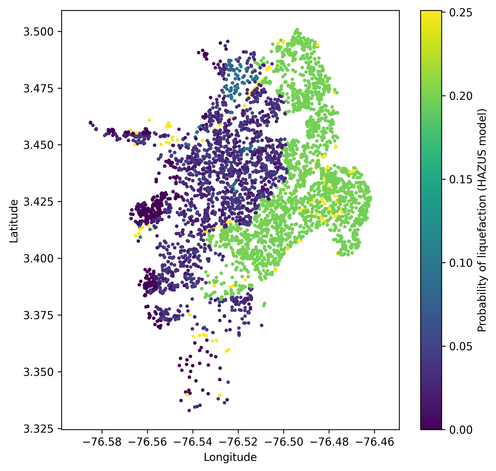
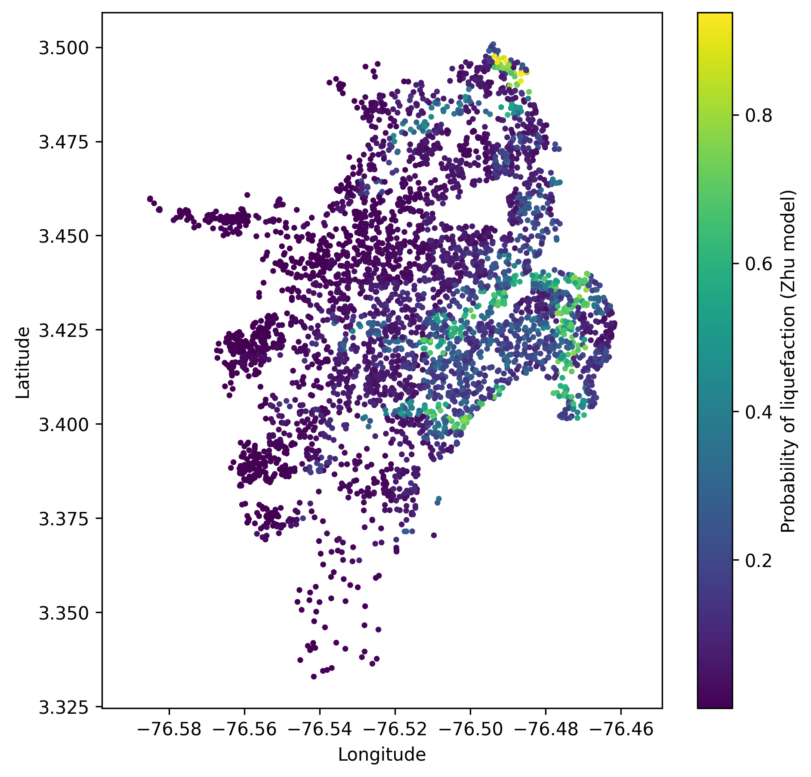
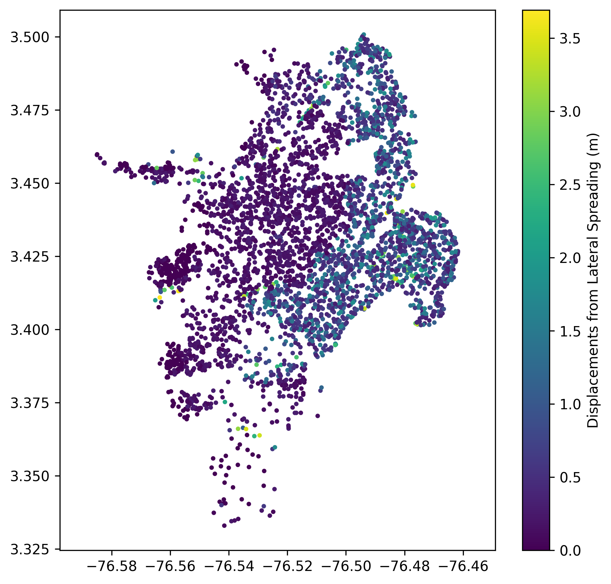

Secondary perils
================

The described geospatial models return the probability of liquefaction as the main output. Additionally, most models
suggest a probability threshold to transform the probabilities into binary output, i.e., liquefaction occurrence. 
Furthermore, some models output the liquefaction spatial extent, which is the areal coverage of pixels with the 
surface manifestation of liquefaction. Hazus methodology computes liquefaction-induced displacements. 
Landslide module allows the users to evaluate landslide displacements and probability of ground failure based on the
predicted displacements. The computed outputs are stored in ``gmf-data.csv``.

Several figures have been added to facilitate the understanding of some of these outputs.

