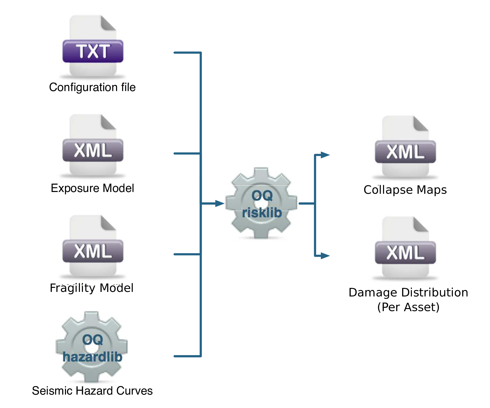
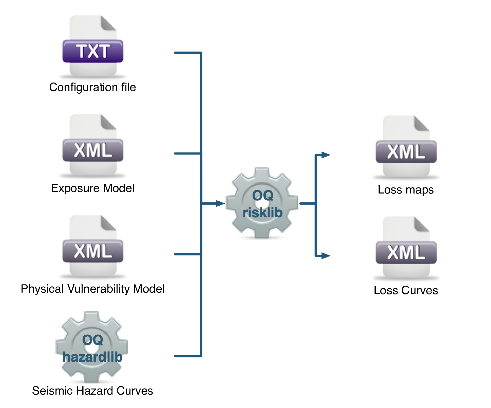

Classical Probabilistic Seismic Damage and Risk Analysis
========================================================

Classical Probabilistic Seismic Damage Analysis
-----------------------------------------------

The classical PSHA-based damage calculator integrates the fragility functions for an asset with the seismic hazard curve 
at the location of the asset, to give the expected damage distribution for the asset within a specified time period. The 
calculator requires the definition of an *Exposure Model*, a *Fragility Model* with fragility functions for each taxonomy 
represented in the *Exposure Model*, and hazard curves calculated in the region of interest. The main results of this 
calculator are the expected damage distribution for each asset, which describe the probability of the asset being in 
different damage states, and collapse maps for the region, which describe the probability of collapse for different assets 
in the portfolio over the specified time period. Damage distribution aggregated by taxonomy or of the total portfolio 
(considering all assets in the *Exposure Model*) can not be extracted using this calculator, as the spatial correlation 
of the ground motion residuals is not taken into consideration.

The hazard curves required for this calculator can be calculated by the OpenQuake engine for all asset locations in the 
*Exposure Model* using the classical PSHA approach (Cornell 1968; McGuire 1976).

The required input files required for running a classical probabilistic damage calculation and the resulting output 
files are depicted in :ref:`the figure below. <classical-psha-calc>`

.. _classical-psha-calc:

   Classical PSHA-based Damage Calculator input/output structure.

Classical Probabilistic Seismic Risk Analysis
---------------------------------------------

The classical PSHA-based risk calculator convolves through numerical integration, the probabilistic vulnerability 
functions for an asset with the seismic hazard curve at the location of the asset, to give the loss distribution for the 
asset within a specified time period. The calculator requires the definition of an *Exposure Model*, a *Vulnerability 
Model* for each loss type of interest with vulnerability functions for each taxonomy represented in the *Exposure Model*, 
and hazard curves calculated in the region of interest. Loss curves and loss maps can currently be calculated for five 
different loss types using this calculator: structural losses, nonstructural losses, contents losses, downtime losses, 
and occupant fatalities. The main results of this calculator are loss exceedance curves for each asset, which describe 
the probability of exceedance of different loss levels over the specified time period, and loss maps for the region, 
which describe the loss values that have a given probability of exceedance over the specified time.

Unlike the probabilistic event-based risk calculator, an aggregate loss curve (considering all assets in the *Exposure 
Model*) can not be extracted using this calculator, as the correlation of the ground motion residuals and vulnerability 
uncertainty is not taken into consideration in this calculator.

The hazard curves required for this calculator can be calculated by the OpenQuake engine for all asset locations in the 
*Exposure Model* using the classical PSHA approach (Cornell 1968; McGuire 1976). The use of logic- trees allows for the 
consideration of model uncertainty in the choice of a ground motion prediction equation for the different tectonic region 
types in the region. Unlike what was described in the previous calculator, a total loss curve (considering all assets in 
the Exposure Model) can not be extracted using this calculator, as the correlation of the ground motion residuals and 
vulnerability uncertainty is not taken into consideration.

The required input files required for running a classical probabilistic risk calculation and the resulting output files 
are depicted in :ref:`the figure below. <classical-risk-calc>`

.. _classical-risk-calc:

   Classical PSHA-based Risk Calculator input/output structure.