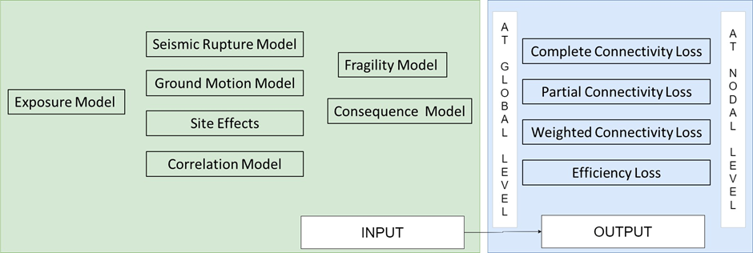

Infrastructure Risk Analysis
============================

Calculation Steps
-----------------

1. Preparation of input models, which includes:

  - Exposure model
  - Hazard model
  - Fragility model
  - Consequence model

2. Computation of the specific damage states and assignment of functionality/operationality to each component
3. Creation of original network from the exposure model
4. Update of the functionality of each component to the originally created infrastructure network and removal of the non-functional/non-operational components
5. Network analysis based on the original and updated infrastructure network
6. Computation of the following performance metrics, based on connectivity analysis:

  - Complete Connectivity Loss (CCL)
  - Partial Connectivity Loss (PCL)
  - Weighted Connectivity Loss (WCL)
  - Efficiency Loss (EL)

In summary, for the computation of infrastructure risk at connectivity level in OpenQuake engine, the input requirements and 
the outputs obtained are shown in :ref:`the next figure <infrastructure-risk-calc>`.

.. _infrastructure-risk-calc:

  Input models required, and output obtained in OpenQuake for infrastructure risk assessment at connectivity level

Useful References
-----------------

1. Aric A. Hagberg, Daniel A. Schult and Pieter J. Swart (2008) Exploring network structure, dynamics, and function using NetworkX, in Proceedings of the 7th Python in Science Conference (SciPy2008), Gäel Varoquaux, Travis Vaught, and Jarrod Millman (Eds), (Pasadena, CA USA), pp. 11–15
2. Poudel, A., Pitilakis, K., Silva, V. and Rao, A., (2023). Infrastructure seismic risk assessment: an overview and integration to contemporary open tool towards global usage. Bulletin of Earthquake Engineering. DOI: https://doi.org/10.1007/s10518-023-01693-z
3. Pitilakis, K, Franchin P, Khazai B, & Wenzel H, (Eds.) (2014) SYNER-G: systemic seismic vulnerability and risk assessment of complex urban, utility, lifeline systems and critical facilities: methodology and applications (Vol. 31), Springer, DOI: https://doi.org/10.1007/978-94-017-8835-9

Acknowledgements
----------------

The present work has been done in the framework of grant agreement No. 813137 funded by the European Commission ITN-Marie 
Sklodowska-Curie project “New Challenges for Urban Engineering Seismology (URBASIS-EU)” by Astha Poudel, ESR 4.5 
(Aristotle University of Thessaloniki, Université Grenoble Alpes) with the support from Kyriazis Pitilakis, Vitor Silva, 
Anirudh Rao, and Michele Simionato. Also, we would like to acknowledge the contributors of the SYNER-G project that was 
funded from the European Community’s 7th Framework Program under grant No. 244061 from which many conceptual frameworks 
have been built upon.