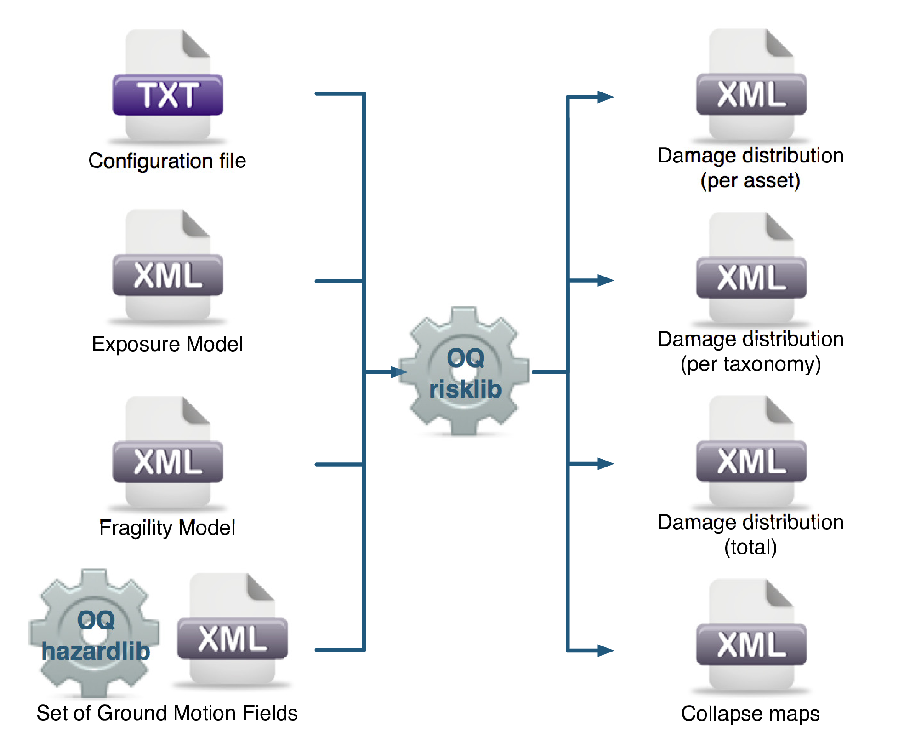
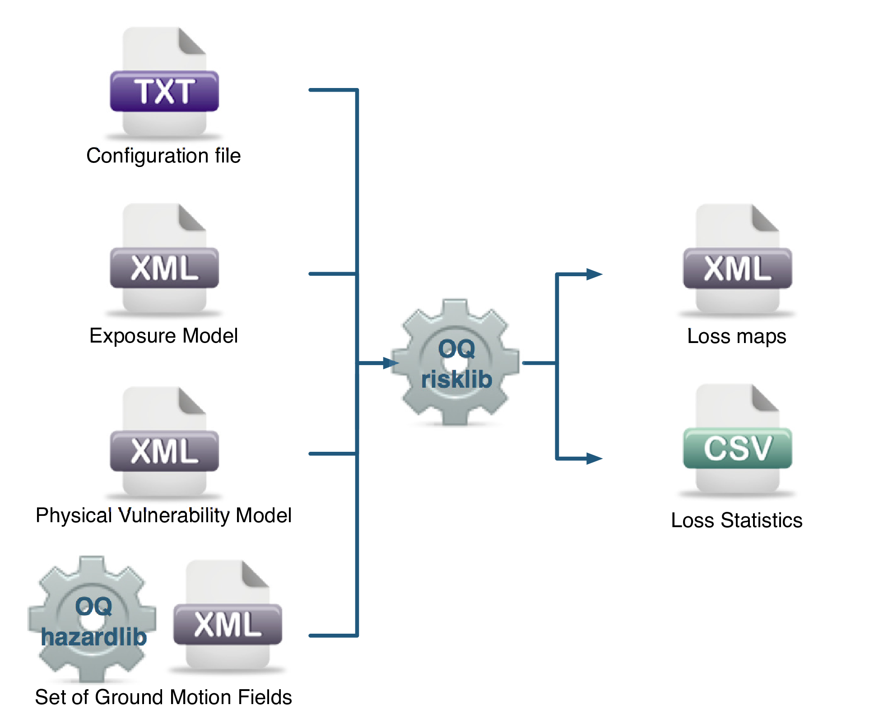

Scenario Based Seismic Damage and Risk Analysis
===============================================

.. _scenario-damage-assessment:

Scenario Damage Assessment
--------------------------

The scenario damage calculator computes damage distribution statistics for all assets in a given *Exposure Model* for a 
single specified rupture. Damage distribution statistics include the mean and standard deviation of damage fractions for 
different damage states. This calculator requires the definition of a finite *Rupture Model*, an *Exposure Model* and a 
*Fragility Model*; the main results are the damage distribution statistics per asset, aggregated damage distribution 
statistics per taxonomy, aggregated damage distribution statistics for the region, and collapse maps, which contain the 
spatial distribution of the number or area of collapsed buildings throughout the region of interest.

The rupture characteristics—i.e. the magnitude, hypocenter and fault geometry—are modelled as deterministic in the 
scenario calculators. Multiple simulations of different possible Ground Motion Fields due to the single rupture are 
generated, taking into consideration both the inter-event variability of ground motions, and the intra-event residuals 
obtained from a spatial correlation model for ground motion residuals. The use of logic trees allows for the 
consideration of uncertainty in the choice of a ground motion model for the given tectonic region.

As an alternative to computing the Ground Motion Fields with OpenQuake engine, users can also provide their own sets of 
Ground Motion Fields as input to the scenario damage calculator.

**Note**: The damage simulation algorithm for the scenario damage calculator has changed starting from OpenQuake engine 
v3.9 to use a full Monte Carlo simulation of damage states.

For each Ground Motion Field, a damage state is simulated for each building for every asset in the *Exposure Model* using 
the provided *Fragility Model*, and finally the mean damage distribution across all realizations is calculated. The 
calculator also provides aggregated damage distribution statistics for the portfolio, such as mean damage fractions for 
each taxonomy in the *Exposure Model*, and the mean damage for the entire region of study.

The required input files required for running a scenario damage calculation and the resulting output files are depicted 
in :ref:`the figure below. <scenario-damage-calc>`

.. _scenario-damage-calc:

   Scenario Damage Calculator input/output structure.

*Consequence Model* files can also be provided as inputs for a scenario damage calculation in addition to fragility models 
files, in order to estimate consequences based on the calculated damage distribution. The user may provide one 
*Consequence Model* file corresponding to each loss type (amongst structural, nonstructural, contents, and business 
interruption) for which a *Fragility Model* file is provided. Whereas providing a *Fragility Model* file for at least one 
loss type is mandatory for running a Scenario Damage calculation, providing corresponding *Consequence Model* files is 
optional.

.. _scenario-risk-assessment:

Scenario Risk Assessment
------------------------

The scenario risk calculator computes loss statistics for all assets in a given Exposure Model for a single specified rupture. Loss statistics include the mean and standard deviation of ground-up losses for each loss type considered in the analysis. Loss statistics can currently be computed for five different loss types using this calculator: structural losses, nonstructural losses, contents losses, downtime losses, and occupant fatalities. This calculator requires the definition of a finite Rupture Model, an Exposure Model and a Vulnerability Model for each loss type considered; the main results are the loss statistics per asset and mean loss maps.

The rupture characteristics—i.e. the magnitude, hypocenter and fault geometry—are modelled as deterministic in the scenario calculators. Multiple simulations of different possible Ground Motion Fields due to the single rupture are generated, taking into consideration both the inter-event variability of ground motions, and the intra-event residuals obtained from a spatial correlation model for ground motion residuals. The use of logic trees allows for the consideration of uncertainty in the choice of a ground motion model for the given tectonic region.

As an alternative to computing the Ground Motion Fields with OpenQuake engine, users can also provide their own sets of Ground Motion Fields as input to the scenario risk calculator.

For each Ground Motion Field simulation, a loss ratio is sampled for every asset in the Exposure Model using the provided probabilistic Vulnerability Model taking into consideration the correlation model for vulnerability of different assets of a given taxonomy. Finally loss statistics, i.e., the mean loss and standard deviation of loss for ground-up losses across all simulations, are calculated for each asset. Mean loss maps are also generated by this calculator, describing the mean ground-up losses caused by the scenario event for the different assets in the Exposure Model.

The required input files required for running a scenario risk calculation and the resulting output files are depicted in :ref:`the figure below. <scenario-risk-calc>`

.. _scenario-risk-calc:

  Scenario Risk Calculator input/output structure.