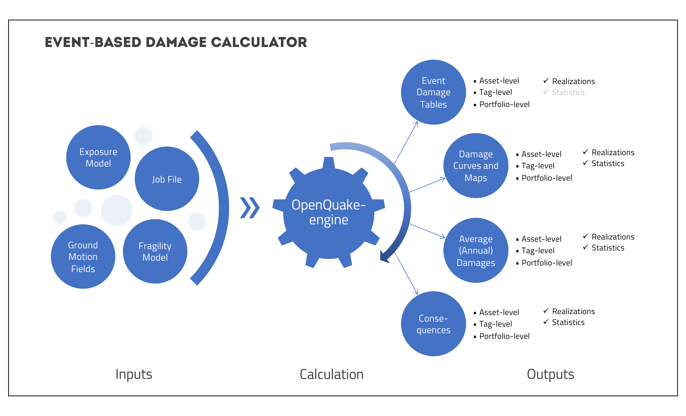
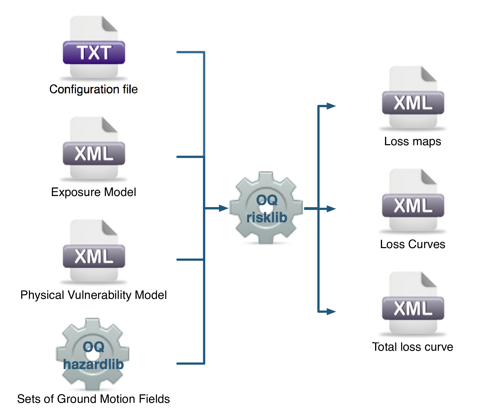

Stochastic Event Based Probabilistic Seismic Damage and Risk Analysis
=====================================================================

Stochastic Event Based Probabilistic Seismic Damage Analysis
------------------------------------------------------------

This calculator employs an event-based Monte Carlo simulation approach to probabilistic damage assessment in order to 
estimate the damage distribution for individual assets and aggregated damage distribution for a spatially distributed 
portfolio of assets within a specified time period. The calculator requires the definition of an *Exposure Model*, a 
*Fragility Model* for each loss type of interest with fragilityfunctions for each damage state for every typology 
represented in the *Exposure Model*, and a Stochastic Event Set representative of the seismicity of the region over the 
specified time period. Damage state curves and damage maps corresponding to specified return periods can also be 
obtained using this calculator.

As an alternative to computing the Ground Motion Fields with OpenQuake engine, users can also provide their own sets of 
Ground Motion Fields as input to the event-based damage calculator.

The main results of this calculator are the event damage tables; these tables describe the total number of buildings in 
each damage state for the portfolio of assets for each seismic event in the Stochastic Event Set.

Asset-level event damage tables are generated by the calculator, but are not exportable in csv format due to the large 
file sizes that may be involved. Interested users can access the asset-level event damage tables within the datastore 
for the completed calculation.

This calculator relies on the probabilistic event-based hazard calculator, which simulates the seismicity of the chosen 
time period :math:`T` by producing a Stochastic Event Set. For each rupture generated by a *Seismic Source*, the number 
of occurrences in the given time span :math:`T` is simulated by sampling the corresponding probability distribution as 
given by :math:`P_{rup}(k|T)`. A Stochastic Event Set is therefore a sample of the full population of ruptures as defined by a Seismic Source Model. Each rupture is present zero, one or more times, depending on its probability. Symbolically, we can define a Stochastic Event Set as:

.. math::

   SES(T) = \{k \times rup,\ k \sim P_{rup}(k|T)\ \forall\ rup\ in\ Src\ \forall\ Src\ in\ SSM\}

where :math:`k`, the number of occurrences, is a random sample of :math:`P_{rup}(k|T)`, and :math:`k \times rup` means 
that rupture :math:`rup` is repeated :math:`k` times in the Stochastic Event Set.

For each rupture or event in the Stochastic Event Sets, a spatially correlated Ground Motion Field realisation is 
generated, taking into consideration both the inter-event variability of ground motions, and the intra-event residuals 
obtained from a spatial correlation model for ground motion residuals (if one is specified in the job file). The use of 
logic trees allows for the consideration of uncertainty in the choice of a Seismic Source Model, and in the choice of 
groundmotionmodels for the different tectonic regions.

For each Ground Motion Field realization, a damage state is siumulated for each building of every asset in the *Exposure 
Model* using the provided Fragility Model. The asset-level event damage table is saved to the datastore. Time-averaged 
damage distributions at the asset-level can be obtained from the event damage table. Finally damage state exceedance 
curves can be computed.

The required input files required for running a probabilistic stochastic event-based damage calculation and the 
resulting output files are depicted in :ref:`the figure below. <event-based-damage-calc>`

.. _event-based-damage-calc:

   Probabilistic Event-based Damage Calculator input/output structure.

Similar to the scenario damage calculator, *Consequence Model* files can also be provided as inputs for an event-based 
damage calculation in addition to fragility models files, in order to estimate consequences based on the calculated 
damage distribution. The user may provide one *Consequence Model* file corresponding to each loss type (amongst structural, 
nonstructural, contents, and business interruption) for which a *Fragility Model* file is provided. Whereas providing a 
*Fragility Model* file for at least one loss type is mandatory for running an Event-Based Damage calculation, providing 
corresponding *Consequence Model* files is optional.

Stochastic Event Based Probabilistic Seismic Risk Analysis
----------------------------------------------------------

This calculator employs an event-based Monte Carlo simulation approach to probabilistic risk assessment in order to 
estimate the loss distribution for individual assets and aggregated loss distribution for a spatially distributed 
portfolio of assets within a specified time period. The calculator requires the definition of an *Exposure Model*, a 
*Vulnerability Model* for each loss type of interest with vulnerability functions for each taxonomy represented in the 
*Exposure Model*, and a Stochastic Event Set (also known as a *synthetic catalog*) representative of the seismicity of 
the region over the specified time period. Loss curves and loss maps can currently be calculated for five different loss 
types using this calculator: structural losses, nonstructural losses, contents losses, downtime losses, and occupant 
fatalities.

As an alternative to computing the Ground Motion Fields with OpenQuake engine, users can also provide their own sets of 
Ground Motion Fields as input to the event-based risk calculator, starting from OpenQuake engine v2.8.

The main results of this calculator are loss exceedance curves for each asset, which describe the probability of 
exceedance of different loss levels over the specified time period, and loss maps for the region, which describe the 
loss values that have a given probability of exceedance over the specified time period. Aggregate loss exceedance curves 
can also be produced using this calculator; these describe the probability of exceedance of different loss levels for all 
assets in the portfolio. Finally, event loss tables can be produced using this calculator; these tables describe the 
total loss across the portfolio for each seismic event in the Stochastic Event Set.

This calculator relies on the probabilistic event-based hazard calculator, which simulates the seismicity of the chosen 
time period :math:`T` by producing a Stochastic Event Set. For each rupture generated by a *Seismic Source*, the number 
of occurrences in the given time span :math:`T` is simulated by sampling the corresponding probability distribution as 
given by :math:`P_{rup}(k|T)`. A Stochastic Event Set is therefore a sample of the full population of ruptures as defined 
by a Seismic Source Model. Each rupture is present zero, one or more times, depending on its probability. Symbolically, 
we can define a Stochastic Event Set as:

.. math::

   SES(T) = \{k \times rup,\ k \sim P_{rup}(k|T)\ \forall\ rup\ in\ Src\ \forall\ Src\ in\ SSM\}

where :math:`k`, the number of occurrences, is a random sample of :math:`P_{rup}(k|T)`, and :math:`k \times rup` means 
that rupture :math:`rup` is repeated :math:`k` times in the Stochastic Event Set.

For each rupture or event in the Stochastic Event Sets, a spatially correlated Ground Motion Field realisation is 
generated, taking into consideration both the inter-event variability of ground motions, and the intra-event residuals 
obtained from a spatial correlation model for ground motion residuals (if one is specified in the job file). The use of 
logic trees allows for the consideration of uncertainty in the choice of a Seismic Source Model, and in the choice of 
ground motion models for the different tectonic regions.

For each Ground Motion Field realization, a loss ratio is sampled for every asset in the *Exposure Model* using the 
provided probabilistic *Vulnerability Model*, taking into consideration the correlation model for vulnerability of 
different assets of a given taxonomy. Finally loss exceedance curves are computed for ground-up losses.

The required input files required for running a probabilistic stochastic event-based risk calculation and the resulting 
output files are depicted in :ref:`the figure below. <event-based-risk-calc>`

.. _event-based-risk-calc:

   Probabilistic Event-based Risk Calculator input/output structure.
