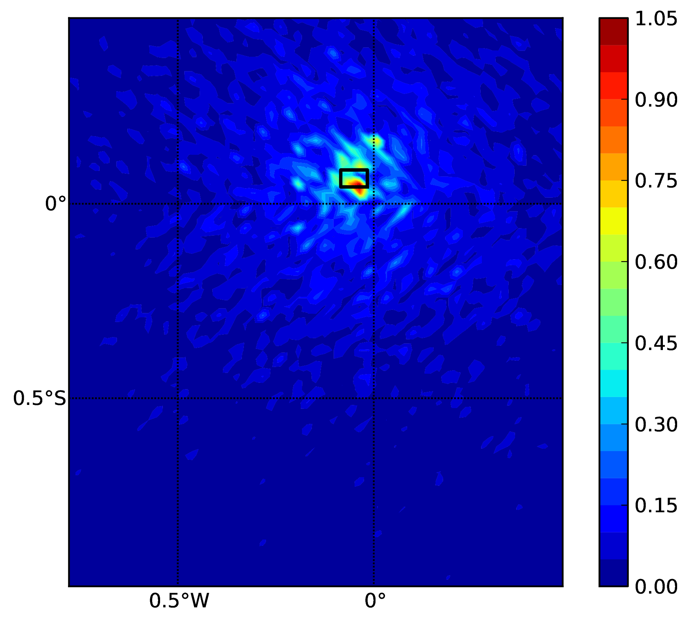
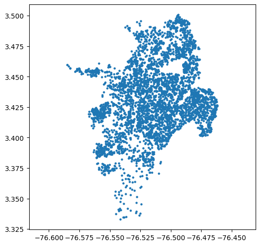
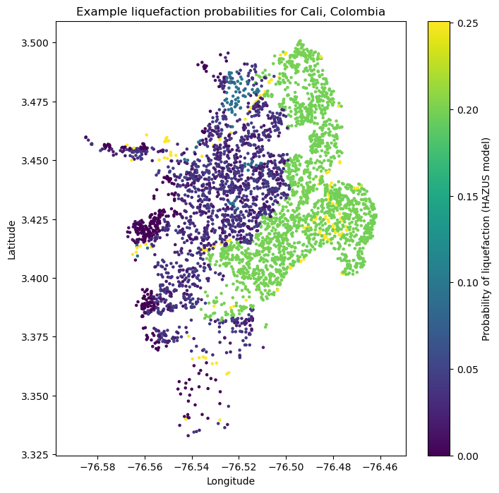
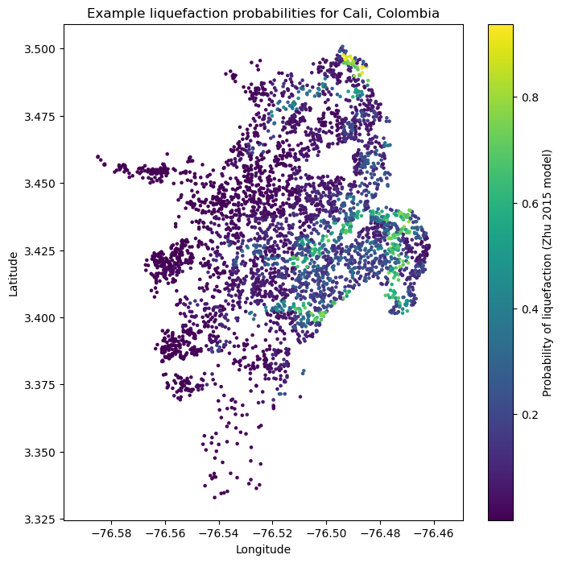
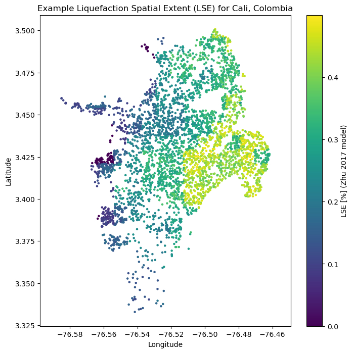
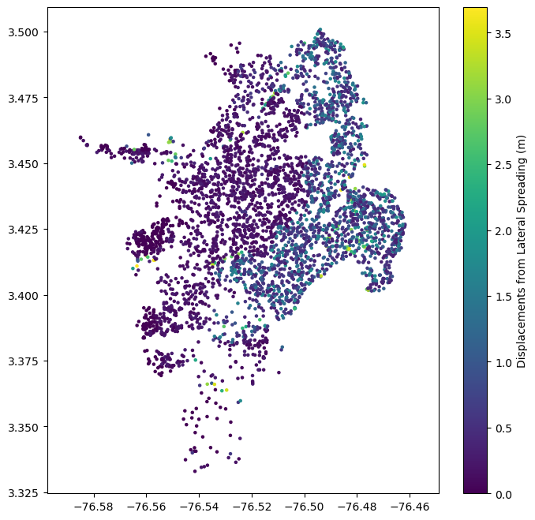

Demos and Tutorials
===================

Demonstrative Examples for Hazard Module
----------------------------------------

A number of hazard calculation demos are provided with the OpenQuake engine installation, showing different examples of 
input and configuration files, for different use cases.

This is the list of demos which illustrate how to use the OpenQuake engine for various seismic hazard analysis:

- AreaSourceClassicalPSHA
- CharacteristicFaultSourceCase1ClassicalPSHA
- CharacteristicFaultSourceCase2ClassicalPSHA
- CharacteristicFaultSourceCase3ClassicalPSHA
- ComplexFaultSourceClassicalPSHA
- Disaggregation
- **EventBasedLiquefaction**
- EventBasedPSHA
- **GMPETablePSHA**
- **LatinSamplingClassicalPSHA**
- LogicTreeCase1ClassicalPSHA
- LogicTreeCase2ClassicalPSHA
- LogicTreeCase3ClassicalPSHA
- **MultiPointClassicalPSHA**
- **NonparametricSourcesClassicalPSHA**
- PointSourceClassicalPSHA
- **ScenarioCase1**
- **ScenarioCase2**
- **ScenarioLiquefaction**
- SimpleFaultSourceClassicalPSHA

The documentation for the **bold** analysis cases is a work in progress. However, the demo files are available `here <https://github.com/gem/oq-engine/tree/master/demos/hazard>`_.

********************
Classical PSHA Demos
********************

A number of demos have been designed to show how to perform a classical PSHA calculation using the different available 
source typologies and how to define non-trivial logic trees. It should be noted that the input files that will be 
illustrated are valid not only for a classical PSHA calculation but also for event based and disaggregation analysis.

All the classical PSHA demos illustrating the different source typologies (all demos but the ones about Logic Tree 
definition) share the same GSIM logic tree file, which for clarity is provided in the listing below.

Since this logic tree considers only one tectonic region (i.e. ``Active Shallow Crust``) all the seismic sources will 
be considered active shallow crust sources.::

	<?xml version="1.0" encoding="UTF-8"?>
	<nrml xmlns:gml="http://www.opengis.net/gml"
	      xmlns="http://openquake.org/xmlns/nrml/0.5">
	    <logicTree logicTreeID="lt1">
	            <logicTreeBranchSet uncertaintyType="gmpeModel"
	                    branchSetID="bs1"
	                    applyToTectonicRegionType="Active Shallow Crust">
	
	                <logicTreeBranch branchID="b1">
	                    <uncertaintyModel>
	                    ChiouYoungs2008
	                    </uncertaintyModel>
	                    <uncertaintyWeight>1.0</uncertaintyWeight>
	                </logicTreeBranch>
	
	            </logicTreeBranchSet>
	    </logicTree>
	</nrml>

###############################################
Classical PSHA with different source typologies
###############################################

This section discusses the following examples:

- AreaSourceClassicalPSHA
- CharacteristicFaultSourceCase1ClassicalPSHA
- CharacteristicFaultSourceCase2ClassicalPSHA
- CharacteristicFaultSourceCase3ClassicalPSHA
- ComplexFaultSourceClassicalPSHA
- PointSourceClassicalPSHA
- SimpleFaultSourceClassicalPSHA

The configuration file in the listing is defined to compute hazard curves for several intensity measure types (PGV, PGA 
and Spectral acceleration at different periods), hazard maps and uniform hazard spectra for different probabilities of 
exceedance::

	[general]
	description = ...
	calculation_mode = classical
	random_seed = 23
	
	[geometry]
	region = ...
	region_grid_spacing = 5.0
	
	[logic_tree]
	number_of_logic_tree_samples = 0
	
	[erf]
	rupture_mesh_spacing = 2
	width_of_mfd_bin = 0.1
	area_source_discretization = 5.0
	
	[site_params]
	reference_vs30_type = measured
	reference_vs30_value = 600.0
	reference_depth_to_2pt5km_per_sec = 5.0
	reference_depth_to_1pt0km_per_sec = 100.0
	
	[calculation]
	source_model_logic_tree_file = source_model_logic_tree.xml
	gsim_logic_tree_file = gmpe_logic_tree.xml
	investigation_time = 50.0
	intensity_measure_types_and_levels = {"PGV": [2, 4, 6 ,8, 10, ...],
	                                      "PGA": [0.005, 0.007, ...],
	                                      "SA(0.025)": [...],
	                                      "SA(0.05)": [...],
	                                      "SA(0.1)": [...],
	                                      "SA(0.2)": [...],
	                                      "SA(0.5)": [...],
	                                      "SA(1.0)": [...],
	                                      "SA(2.0)": [...]}
	truncation_level = 3
	maximum_distance = 200.0
	
	[output]
	mean = false
	quantiles = 0.15, 0.50, 0.85
	hazard_maps = true
	uniform_hazard_spectra = true
	poes = 0.10, 0.02

Hazard maps (for PGA, 10% in 50 years) for the different demos using various oq-engine source typologies are shown in the 
figures below:

.. _Fig. 1.1:
.. figure:: _images/point.png

   Fig. 1.1 Point Source (a).

.. _Fig. 1.2:
.. figure:: _images/area.png

   Fig. 1.2 Area source (b). The solid black line represents the area boundary.

.. _Fig. 1.3:
.. figure:: _images/simple_fault.png

   Fig. 1.3 Simple Fault Source (c). The dashed line represents the fault trace, while the solid line the fault surface projection.

.. _Fig. 1.4:
.. figure:: _images/simple_fault1.png

   Fig. 1.4 (d) Complex Fault Source. The solid line represent the fault surface projection

Hazard maps (for PGA, 10% in 50 years) as obtained from characteristic fault sources with simple fault geometry (a), 
complex fault geometry (b), and collection of planar surfaces (c)

.. _Fig. 1.5:
.. figure:: _images/char_fault2.png

   Fig. 1.5 characteristic fault source with simple fault geometry

.. _Fig. 1.6:
.. figure:: _images/char_fault3.png

   Fig. 1.6 characteristic fault source with complex fault geometry

.. _Fig. 1.7:
.. figure:: _images/char_fault1.png

   Fig. 1.7 characteristic fault source with collection of planar surfaces

###########################################
Classical PSHA with non trivial logic trees
###########################################

Three demos are provided to illustrate how the logic tree formalism can be used to express epistemic uncertainties in 
seismic hazard analysis.

LogicTreeCase1ClassicalPSHA shows an example of logic tree defining two alternative source models, with sources belonging 
to two different tectonic region types, and with two alternative GMPEs for each tectonic region type. The source model 
logic tree is therefore defined as shown in the listing below.::

	<?xml version="1.0" encoding="UTF-8"?>
	<nrml xmlns:gml="http://www.opengis.net/gml"
	      xmlns="http://openquake.org/xmlns/nrml/0.5">
	    <logicTree logicTreeID="lt1">
	
	            <logicTreeBranchSet uncertaintyType="sourceModel"
	                                branchSetID="bs1">
	                <logicTreeBranch branchID="b1">
	                    <uncertaintyModel>
	                      source_model_1.xml
	                    </uncertaintyModel>
	                    <uncertaintyWeight>0.5</uncertaintyWeight>
	                </logicTreeBranch>
	                <logicTreeBranch branchID="b2">
	                    <uncertaintyModel>
	                       source_model_2.xml
	                    </uncertaintyModel>
	                    <uncertaintyWeight>0.5</uncertaintyWeight>
	                </logicTreeBranch>
	            </logicTreeBranchSet>
	
	    </logicTree>
	</nrml>

The two source models are defined in two separate files: ``source_model_1.xml`` and ``source_model_2.xml`` each one 
associated to a corresponding weight (0.5 for both).

The GSIM logic tree file contains the structure as shown in the listing below.::

	<?xml version="1.0" encoding="UTF-8"?>
	
	<nrml xmlns:gml="http://www.opengis.net/gml"
	      xmlns="http://openquake.org/xmlns/nrml/0.5">
	    <logicTree logicTreeID="lt1">
	
	            <logicTreeBranchSet uncertaintyType="gmpeModel"
	               applyToTectonicRegionType="Active Shallow Crust"
	               branchSetID="bs1">
	                <logicTreeBranch branchID="b11">
	                   <uncertaintyModel>
	                      BooreAtkinson2008
	                   </uncertaintyModel>
	                   <uncertaintyWeight>0.5</uncertaintyWeight>
	                </logicTreeBranch>
	                <logicTreeBranch branchID="b12">
	                   <uncertaintyModel>
	                      ChiouYoungs2008
	                   </uncertaintyModel>
	                   <uncertaintyWeight>0.5</uncertaintyWeight>
	                </logicTreeBranch>
	            </logicTreeBranchSet>
	
	            <logicTreeBranchSet uncertaintyType="gmpeModel"
	              applyToTectonicRegionType="Stable Continental Crust"
	              branchSetID="bs2">
	              <logicTreeBranch branchID="b21">
	                <uncertaintyModel>
	                   ToroEtAl2002</uncertaintyModel>
	                <uncertaintyWeight>0.5</uncertaintyWeight>
	                </logicTreeBranch>
	                <logicTreeBranch branchID="b22">
	                  <uncertaintyModel>
	                     Campbell2003</uncertaintyModel>
	                  <uncertaintyWeight>0.5</uncertaintyWeight>
	                </logicTreeBranch>
	            </logicTreeBranchSet>
	
	    </logicTree>
	</nrml>

The source model contains sources belonging to Active Shallow Crust and Stable Continental Crust, therefore the GSIM 
logic tree defines two branching levels, one for each considered tectonic region type. Moreover for each tectonic region 
a Branch set with two GMPEs is defined: Boore and Atkinson 2008 and Chiou and Youngs 2008 for Active Shallow Crust and 
Toro et al. 2003 and Campbell 2003 for Stable Continental Crust. By processing the above logic tree files using the logic 
tree path enumeration mode (enabled by setting in the configuration file ``number_of_logic_tree_samples = 0``) hazard 
results are computed for 8 logic tree paths (2 source models x 2 GMPEs for Active x 2 GMPEs for Stable).

LogicTreeCase2ClassicalPSHA defines a single source model consisting of only two sources (area and simple fault) 
belonging to different tectonic region types (Active Shallow Crust and Stable Continental Region) and both characterized 
by a truncated Gutenberg-Richter distribution. The logic tree defines uncertainties for G-R a and b values (three 
possible pairs for each source), maximum magnitude (three values for each source) and uncertainties on the GMPEs for each 
tectonic region type (two GMPE per region type).

To accommodate such a structure the GSIM logic tree is defined as shown in the listing below.::

	<?xml version="1.0" encoding="UTF-8"?>
	<nrml xmlns:gml="http://www.opengis.net/gml"
	      xmlns="http://openquake.org/xmlns/nrml/0.5">
	    <logicTree logicTreeID="lt1">
	
	            <logicTreeBranchSet uncertaintyType="sourceModel"
	                                branchSetID="bs1">
	                <logicTreeBranch branchID="b11">
	                    <uncertaintyModel>
	                     source_model.xml
	                    </uncertaintyModel>
	                    <uncertaintyWeight>1.0</uncertaintyWeight>
	                </logicTreeBranch>
	            </logicTreeBranchSet>
	
	            <logicTreeBranchSet uncertaintyType="abGRAbsolute"
	                                applyToSources="1"
	                                branchSetID="bs21">
	                <logicTreeBranch branchID="b21">
	                    <uncertaintyModel>4.6 1.1</uncertaintyModel>
	                    <uncertaintyWeight>0.333</uncertaintyWeight>
	                </logicTreeBranch>
	                <logicTreeBranch branchID="b22">
	                    <uncertaintyModel>4.5 1.0</uncertaintyModel>
	                    <uncertaintyWeight>0.333</uncertaintyWeight>
	                </logicTreeBranch>
	                <logicTreeBranch branchID="b23">
	                    <uncertaintyModel>4.4 0.9</uncertaintyModel>
	                    <uncertaintyWeight>0.334</uncertaintyWeight>
	                </logicTreeBranch>
	            </logicTreeBranchSet>
	
	            <logicTreeBranchSet uncertaintyType="abGRAbsolute"
	                                applyToSources="2"
	                                branchSetID="bs31">
	                <logicTreeBranch branchID="b31">
	                    <uncertaintyModel>3.3 1.0</uncertaintyModel>
	                    <uncertaintyWeight>0.333</uncertaintyWeight>
	                </logicTreeBranch>
	                <logicTreeBranch branchID="b32">
	                    <uncertaintyModel>3.2 0.9</uncertaintyModel>
	                    <uncertaintyWeight>0.333</uncertaintyWeight>
	                </logicTreeBranch>
	                <logicTreeBranch branchID="b33">
	                    <uncertaintyModel>3.1 0.8</uncertaintyModel>
	                    <uncertaintyWeight>0.334</uncertaintyWeight>
	                </logicTreeBranch>
	            </logicTreeBranchSet>
	
	            <logicTreeBranchSet uncertaintyType="maxMagGRAbsolute"
	                                applyToSources="1"
	                                branchSetID="bs41">
	                <logicTreeBranch branchID="b41">
	                    <uncertaintyModel>7.0</uncertaintyModel>
	                    <uncertaintyWeight>0.333</uncertaintyWeight>
	                </logicTreeBranch>
	                <logicTreeBranch branchID="b42">
	                    <uncertaintyModel>7.3</uncertaintyModel>
	                    <uncertaintyWeight>0.333</uncertaintyWeight>
	                </logicTreeBranch>
	                <logicTreeBranch branchID="b43">
	                    <uncertaintyModel>7.6</uncertaintyModel>
	                    <uncertaintyWeight>0.334</uncertaintyWeight>
	                </logicTreeBranch>
	            </logicTreeBranchSet>
	
	            <logicTreeBranchSet uncertaintyType="maxMagGRAbsolute"
	                                applyToSources="2"
	                                branchSetID="bs51">
	                <logicTreeBranch branchID="b51">
	                    <uncertaintyModel>7.5</uncertaintyModel>
	                    <uncertaintyWeight>0.333</uncertaintyWeight>
	                </logicTreeBranch>
	                <logicTreeBranch branchID="b52">
	                    <uncertaintyModel>7.8</uncertaintyModel>
	                    <uncertaintyWeight>0.333</uncertaintyWeight>
	                </logicTreeBranch>
	                <logicTreeBranch branchID="b53">
	                    <uncertaintyModel>8.0</uncertaintyModel>
	                    <uncertaintyWeight>0.334</uncertaintyWeight>
	                </logicTreeBranch>
	            </logicTreeBranchSet>
	
	    </logicTree>
	</nrml>

The first branching level defines the source model. For each source, two branching levels are created, one defining 
uncertainties on G-R a and b values (defined by setting ``uncertaintyType="abGRAbsolute"``) and G-R maximum magnitude 
(``uncertaintyType="maxMagGRAbsolute"``).

It is important to notice that each *Branch* set is applied to a specific source by defining the attribute ``applyToSources``, 
followed by the source ID. The GSIM logic tree file is the same as used for LogicTreeCase1ClassicalPSHA. By setting in 
the configuration file ``number_of_logic_tree_samples = 0``, hazard results are obtained for 324 paths (1 source model x 
3 (a, b) pairs for source 1 x 3 (a, b) pairs for source 2 x 3 max magnitude values for source 1 x 3 max magnitude values 
for source 2 x 2 GMPEs for Active Shallow Crust X 2 GMPEs for Stable Continental Crust), see :ref:`Fig. 1.8 <Fig. 1.8>`.

.. _Fig. 1.8:
.. figure:: _images/hazard-curves-ltcase2.png
   
    Fig. 1.8 Hazard curves as obtained from the LogicTreeCase2 demo. Solid gray lines represent individual hazard curves from the different logic tree path (a total of 324 curves). The red dashed line represents the mean hazard curve, while the red dotted lines depict the quantile levels (0.15, 0.5, 0.95).

LogicTreeCase3ClassicalPSHA illustrates an example of logic tree defining relative uncertainties on G-R maximum magnitude 
and b value. A single source model is considered containing two sources belonging to different tectonic region types and 
both characterized by a G-R magnitude frequency distribution. The source model logic tree for this demo is as shown in 
the listing below.::

	<?xml version="1.0" encoding="UTF-8"?>
	<nrml xmlns:gml="http://www.opengis.net/gml"
	      xmlns="http://openquake.org/xmlns/nrml/0.5">
	    <logicTree logicTreeID="lt1">
	
	            <logicTreeBranchSet uncertaintyType="sourceModel"
	                                branchSetID="bs1">
	                <logicTreeBranch branchID="b11">
	                    <uncertaintyModel>
	                     source_model.xml
	                    </uncertaintyModel>
	                    <uncertaintyWeight>1.0</uncertaintyWeight>
	                </logicTreeBranch>
	            </logicTreeBranchSet>
	
	            <logicTreeBranchSet uncertaintyType="bGRRelative"
	                                branchSetID="bs21">
	                <logicTreeBranch branchID="b21">
	                    <uncertaintyModel>+0.1</uncertaintyModel>
	                    <uncertaintyWeight>0.333</uncertaintyWeight>
	                </logicTreeBranch>
	                <logicTreeBranch branchID="b22">
	                    <uncertaintyModel>0.0</uncertaintyModel>
	                    <uncertaintyWeight>0.333</uncertaintyWeight>
	                </logicTreeBranch>
	                <logicTreeBranch branchID="b23">
	                    <uncertaintyModel>-0.1</uncertaintyModel>
	                    <uncertaintyWeight>0.334</uncertaintyWeight>
	                </logicTreeBranch>
	            </logicTreeBranchSet>
	
	            <logicTreeBranchSet uncertaintyType="maxMagGRRelative"
	                                branchSetID="bs31">
	                <logicTreeBranch branchID="b31">
	                    <uncertaintyModel>0.0</uncertaintyModel>
	                    <uncertaintyWeight>0.333</uncertaintyWeight>
	                </logicTreeBranch>
	                <logicTreeBranch branchID="b32">
	                    <uncertaintyModel>+0.5</uncertaintyModel>
	                    <uncertaintyWeight>0.333</uncertaintyWeight>
	                </logicTreeBranch>
	                <logicTreeBranch branchID="b33">
	                    <uncertaintyModel>+1.0</uncertaintyModel>
	                    <uncertaintyWeight>0.334</uncertaintyWeight>
	                </logicTreeBranch>
	            </logicTreeBranchSet>
	
	    </logicTree>
	</nrml>

After the first branching level defining the source model, two additional branching levels are defined, one defining 
relative uncertainties on b value (``bGRRelative`` applied consistently to all sources in the source model) and the 
second uncertainties on maximum magnitude (``maxMagGRRelative``). Similar to the other cases, two GMPEs are considered 
for each tectonic region type and therefore the total number of logic tree path is 36 (1 source model x 3 b value 
increments x 3 maximum magnitude increments x 2 GMPE for Active x 2 GMPEs for Stable).

***************************
Hazard Disaggregation Demos
***************************

An example of disaggregation calculation is given considering a source model consisting of two sources (area and simple 
fault) belonging to two different tectonic region types.

The calculation is defined with the following configuration file::

	[general]
	description = ...
	calculation_mode = disaggregation
	random_seed = 23
	
	[geometry]
	sites = 0.5 -0.5
	
	[logic_tree]
	number_of_logic_tree_samples = 0
	
	[erf]
	rupture_mesh_spacing = 2
	width_of_mfd_bin = 0.1
	area_source_discretization = 5.0
	
	[site_params]
	reference_vs30_type = measured
	reference_vs30_value = 600.0
	reference_depth_to_2pt5km_per_sec = 5.0
	reference_depth_to_1pt0km_per_sec = 100.0
	
	[calculation]
	source_model_logic_tree_file = source_model_logic_tree.xml
	gsim_logic_tree_file = gmpe_logic_tree.xml
	investigation_time = 50.0
	intensity_measure_types_and_levels = {"PGA": [...]}
	truncation_level = 3
	maximum_distance = 200.0
	
	[disaggregation]
	poes_disagg = 0.1
	mag_bin_width = 1.0
	distance_bin_width = 10.0
	coordinate_bin_width = 0.2
	num_epsilon_bins = 3
	
	[output]
	export_dir = ...

Disaggregation matrices are computed for a single site (located between the two sources) for a ground motion value 
corresponding to a probability value equal to 0.1 (``poes_disagg = 0.1``). Magnitude values are classified in one 
magnitude unit bins (``mag_bin_width = 1.0``), distances in bins of 10 km (``distance_bin_width = 10.0``), coordinates 
in bins of 0.2 degrees (``coordinate_bin_width = 0.2``). 3 epsilons bins are considered (``num_epsilon_bins = 3``).

**********************
Event Based PSHA Demos
**********************

A demo showing an example of Event Based PSHA calculation is provided with the following configuration file::

	[general]
	description = Event Based PSHA using Area Source
	calculation_mode = event_based
	random_seed = 23
	
	[geometry]
	sites = 0.5 -0.5
	
	[logic_tree]
	number_of_logic_tree_samples = 0
	
	[erf]
	rupture_mesh_spacing = 2
	width_of_mfd_bin = 0.1
	area_source_discretization = 5.0
	
	[site_params]
	reference_vs30_type = measured
	reference_vs30_value = 600.0
	reference_depth_to_2pt5km_per_sec = 5.0
	reference_depth_to_1pt0km_per_sec = 100.0
	
	[calculation]
	source_model_logic_tree_file = source_model_logic_tree.xml
	gsim_logic_tree_file = gmpe_logic_tree.xml
	investigation_time = 50.0
	intensity_measure_types_and_levels = {"PGA": [...]}
	truncation_level = 3
	maximum_distance = 200.0
	
	[event_based_params]
	ses_per_logic_tree_path = 100
	ground_motion_correlation_model =
	ground_motion_correlation_params =
	
	[output]
	export_dir = ...
	ground_motion_fields = true
	hazard_curves_from_gmfs = true
	mean = false
	quantiles =
	hazard_maps = true
	poes = 0.1

The source model consist of one source (area). 100 stochastic event sets are generated (``ses_per_logic_tree_path = 100``) 
(an example can be seen in :ref:`Fig. 1.9 <Fig. 1.9>`). Ground motion fields are computed (``ground_motion_fields = true``, :ref:`Fig. 1.10 <Fig. 1.10>` and 
:ref:`Fig 1.11 <Fig. 1.11>`) and also hazard curves from ground motion fields are extracted (``hazard_curves_from_gmfs = true``). The 
corresponding hazard maps for 0.1 probability are also calculated (``hazard_maps = true``)

.. _Fig. 1.9:
.. figure:: _images/ses.png

  Fig. 1.9 A stochastic event set generated with the event based PSHA demo. The area source defines a nodal plane distribution which distributes events among vertical and dipping (50 degrees) faults with equal weights. Vertical ruptures are then distributed equally in the range 0-180 degrees while the dipping ones in the range 0-360, both with a step of 45 degrees.

.. _Fig. 1.10:

  Fig. 1.10 Ground motion fields (PGA) with no spatial correlation

.. _Fig. 1.11:
.. figure:: _images/gmf-corr.png

  Fig. 1.11 Ground motion fields (PGA) with spatial correlation

Demonstrative Examples for Risk Module
--------------------------------------

The following sections describe the set of demos that have been compiled to demonstrate some of the features and usage of 
the risk calculators of the OpenQuake engine. These demos can be found in a public repository on GitHub at the following 
link: `gem/oq-engine <https://github.com/gem/oq-engine/tree/master/demos/risk>`_.

These examples are purely demonstrative and are not intended to represent accurately the seismicity, vulnerability or 
exposure characteristics of the region selected, but simply to provide example input files that can be used as a starting 
point for users planning to employ the OpenQuake engine in seismic risk and loss estimation studies.

It is also noted that in the demonstrative examples presented in this section, illustrations about the various messages 
from the engine displayed in the command line interface are presented. These messages often contain information about the 
calculation id and output id, which will certainly be different for each user.

Following is the list of demos which illustrate how to use the OpenQuake engine for various scenario-based and 
probabilistic seismic damage and risk analyses:

- ClassicalBCR
- ClassicalDamage
- ClassicalRisk
- EventBasedDamage
- EventBasedRisk
- **InfrastructureRiskRoadNetwork**
- **InfrastructureRiskWaterSupplyNetwork**
- **Reinsurance**
- ScenarioDamage
- ScenarioRisk

The documentation for the **bold** analysis cases is a work in progress. However, the demo files are available `here <https://github.com/gem/oq-engine/tree/master/demos/risk>`_.

These seven demos use Nepal as the region of interest. An example Exposure Model has been developed for this region, 
comprising 9,063 assets distributed amongst 2,221 locations (due to the existence of more than one asset at the same 
location). A map with the distribution of the number of buildings throughout Nepal is presented in :ref:`Fig. 1.12 <Fig. 1.12>`.

.. _Fig. 1.12:
.. figure:: _images/exposure-nepal.png

   Fig. 1.12 Distribution of number of buildings in Nepal

The building portfolio was organised into four classes for the rural areas (adobe, dressed stone, unreinforced fired 
brick, wooden frames), and five classes for the urban areas (the aforementioned typologies, in addition to reinforced 
concrete buildings). For each one of these building typologies, vulnerabilityfunctions and fragilityfunctions were 
collected from the published literature available for the region. These input models are only for demonstrative purposes 
and for further information about the building characteristics of Nepal, users are advised to contact the National 
Society for Earthquake Technology of Nepal (NSET - http:www.nset.org.np/).

The following sections include instructions not only on how to run the risk calculations, but also on how to produce the 
necessary hazard inputs. Thus, each demo comprises the configuration file, *Exposure Model* and fragility or vulnerability 
models fundamental for the risk calculations. Each demo folder also a configuration file and the input models to produce 
the relevant hazard inputs.

***************
Scenario Damage
***************

Demos A rupture of magnitude Mw 7 in the central part of Nepal is considered in this demo. The characteristics of this 
rupture (geometry, dip, rake, hypocentre, upper and lower seismogenic depth) are defined in the ``fault_rupture.xml`` 
file, and the hazard and risk calculation settings are specified in the ``job.ini`` file.

To run the Scenario Damage demo, users should navigate to the folder where the required files have been placed and employ 
following command::

	user@ubuntu:~$ oq engine --run job_hazard.ini && oq engine --run job_risk.ini --hc=-1

The hazard calculation should produce the following outputs::

	Calculation 8967 completed in 4 seconds. Results:
	  id | name
	9060 | Ground Motion Fields
	9061 | Realizations

and the following outputs should be produced by the risk calculation::

	Calculation 8968 completed in 16 seconds. Results:
	  id | name
	9062 | Average Asset Damages
	9063 | Average Asset Losses

*******************
Scenario Risk Demos
*******************

The same rupture described in the Scenario Damage demo is also used for this demo. In this case, a combined job file, 
job.ini, is used to specify the configuration parameters for the hazard and risk calculations.

To run the Scenario Risk demo, users should navigate to the folder where the required files have been placed and employ 
following command::

	user@ubuntu:~$ oq engine --run job.ini

and the following outputs should be produced::

	Calculation 8970 completed in 16 seconds. Results:
	  id | name
	9071 | Aggregate Asset Losses
	9072 | Full Report
	9073 | Ground Motion Fields
	9074 | Average Asset Losses
	9075 | Aggregate Event Losses
	9076 | Realizations

.. _classical-psda-demo:

********************************************
Classical Probabilistic Seismic Damage Demos
********************************************

The seismic source model developed within the Global Seismic Hazard Assessment Program (GSHAP) is used with the 
(B. S.-J. Chiou and Youngs 2008) ground motion prediction equation to produce the hazard input for this demo. No 
uncertainties are considered in the seismic source model and since only one GMPE is being considered, there will be only 
one possible path in the logic tree. Therefore, only one set of seismic hazard curves will be produced. To run the hazard 
calculation, the following command needs to be employed::

	oq engine --run job_hazard.ini

which will produce the following sample hazard output::

	Calculation 8971 completed in 34 seconds. Results:
	  id | name
	9074 | Hazard Curves
	9075 | Realizations

The risk job calculates the probabilistic damage distribution for each asset in the *Exposure Model* starting from the 
above generated hazard curves. The following command launches the risk calculations::

	user@ubuntu:~$ oq engine --run job_risk.ini --hc 8971

and the following sample outputs are obtained::

	Calculation 8972 completed in 16 seconds. Results:
	  id | name
	9076 | Asset Damage Distribution
	9077 | Asset Damage Statistics

******************************************
Classical Probabilistic Seismic Risk Demos
******************************************

The same hazard input as described in the Classical Probabilistic Damage demo is used for this demo. Thus, the workflow 
to produce the set of hazard curves described in Section :ref:`Classical Probabilistic Seismic Damage Demos <classical-psda-demo>` 
is also valid herein. Then, to run the Classical Probabilistic Risk demo, users should navigate to the folder containing 
the demo input models and configuration files and employ the following command::

	user@ubuntu:~$ oq engine --run job_hazard.ini

which will produce the following hazard output::

	Calculation 8971 completed in 34 seconds. Results:
	  id | name
	9074 | Hazard Curves
	9075 | Realizations

In this demo, loss exceedance curves for each asset and two probabilistic loss maps (for probabilities of exceedance of 
1% and 10%) are produced. The following command launches these risk calculations::

	user@ubuntu:~$ oq engine --run job_risk.ini --hc 8971

and the following outputs are expected::

	Calculation 8973 completed in 16 seconds. Results:
	  id | name
	9077 | Asset Loss Curves Statistics
	9078 | Asset Loss Maps Statistics
	9079 | Average Asset Loss Statistics

**********************************************
Event Based Probabilistic Seismic Damage Demos
**********************************************

This demo uses the same probabilistic seismic hazard assessment (PSHA) model described in the previous examples in 
Section Classical Probabilistic Seismic Damage Demos and Section Classical Probabilistic Seismic Risk Demos. However, 
instead of hazard curves, sets of ground motion fields will be generated by the hazard calculation of this demo. Again, 
since there is only one Branch in the logic tree, only one set of ground motion fields will be used in the risk 
calculations. The hazard and risk jobs are defined in a single configuration file for this demo. To trigger the hazard 
and risk calculations the following command needs to be used::

	user@ubuntu:~$ oq engine --run job.ini

and the following results are expected::

	Calculation 2 completed in 29 seconds. Results:
	  id | name
	  24 | Aggregate Event Damages
	  30 | Aggregate Event Losses
	  20 | Average Asset Damages
	  21 | Average Asset Damages Statistics
	  22 | Average Asset Losses
	  23 | Average Asset Losses Statistics
	  32 | Earthquake Ruptures
	  25 | Events
	  26 | Full Report
	  27 | Ground Motion Fields
	  28 | Hazard Curves
	  29 | Input Files
	  31 | Realizations

********************************************
Event Based Probabilistic Seismic Risk Demos
********************************************

This demo uses the same probabilistic seismic hazard assessment (PSHA) model described in the previous examples in 
Section Classical Probabilistic Seismic Damage Demos and Section Classical Probabilistic Seismic Risk Demos. However, 
instead of hazard curves, sets of ground motion fields will be generated by the hazard calculation of this demo. Again, 
since there is only one Branch in the logic tree, only one set of ground motion fields will be used in the risk 
calculations. The hazard and risk jobs are defined in a single configuration file for this demo. To trigger the hazard 
and risk calculations the following command needs to be used::

	user@ubuntu:~$ oq engine --run job.ini

and the following results are expected::

	Calculation 8974 completed in 229 seconds. Results:
	  id | name
	1820 | Total Loss Curves
	1821 | Total Loss Curves Statistics
	1822 | Aggregate Loss Table
	1823 | Average Asset Losses
	1824 | Average Asset Loss Statistics
	1826 | Asset Loss Maps
	1827 | Asset Loss Maps Statistics
	1828 | Average Asset Losses
	1829 | Average Asset Losses Statistics
	1830 | Earthquake Ruptures
	1831 | Events
	1832 | Realizations

The number and the name of the outputs can change between different versions of the engine.

*********************************
Retrofit Benefit-Cost Ratio Demos
*********************************

The loss exceedance curves used within this demo are produced using the Classical Probabilistic Risk calculator. Thus, 
the process to produce the seismic hazard curves described in Section Classical Probabilistic Seismic Risk Demos can be 
employed here. Then, the risk calculations can be initiated using the following command::

	oq engine --run job_risk.ini --hc 8971

which should produce the following output::

	Calculation 8976 completed in 14 seconds. Results:
	  id | name
	9087 | Benefit Cost Ratios

GitHub Tutorials
----------------

*********************************************************************************
Tutorial: Preparing site data for liquefaction analysis with the OpenQuake engine
*********************************************************************************

This tutorial for preparing site data for liquefaction analysis with the OpenQuake engine secondary perils module is a 
Jupyter notebook, which containts text as well as exectuable Python code. The notebook can be downloaded along with the 
sample data from `here <https://github.com/gem/oq-engine/tree/todorovic-liquefaction/doc/manual/sep>`_.

First, we need to import the Python modules that we'll use.::

	import pandas as pd
	import matplotlib.pyplot as plt
	
	from openquake.sep.utils import(
	    sample_raster_at_points,
	    vs30_from_slope
	)

We will be working with different liquefaction models in this analysis. We'll start with the `HAZUS model <https://gemsciencetools.github.io/oq-mbtk/contents/sep_docs/sep_models.html#hazus>`_
by the US Federal Emergency Management Agency (FEMA). Then we'll test two statistical models by Zhu et al (2015, 2017) 
that we'll call the `Zhu15 model <https://gemsciencetools.github.io/oq-mbtk/contents/sep_docs/sep_models.html#zhu-et-al-2015>`_, 
and `Zhu17 model <https://gemsciencetools.github.io/oq-mbtk/contents/sep_docs/sep_models.html#zhu-et-al-2017>`_. 
Lastly, we'll test nonparametric model to which we refer as `Todorovic Silva 2022 <https://gemsciencetools.github.io/oq-mbtk/contents/sep_docs/sep_models.html#todorovic-silva-2022>`_.

These models require different parameters to characterize the liquefaction susceptibility and probabilities at each site. 
The HAZUS model relies on a classification of each site into a liquefaction susceptibility category, based on 
geotechnical parameters at the site. The other models relies on quantitative parameters that may, in principle, be 
estimated through processing of a digital elevation model (DEM), or are globally available (e.g., water table depth, 
historic precipitation).

##########################################
Joining site information to site locations
##########################################

We'll start with a basic CSV file with the longitude and latitude of the sites for our analysis as well as the geologic 
unit at that site. The geologic unit at each site has been added through a `spatial join <https://www.qgistutorials.com/en/docs/3/performing_spatial_joins.html>`_
of the site locations with a geologic map layer in QGIS. THe column 'dr' will be explained later in the tutorial.

#####################
HAZUS site parameters
#####################

The HAZUS model requires that we have liquefaction susceptibility categories and groundwater depths for all sites. We'll 
get these by mapping the geologic unit to these parameters, and the assigning the parameters to each site based on the 
geologic unit through a database join.::

	# Read in the sites CSV with pandas
	sites = pd.read_csv('./tutorial_data/cali_sites_w_units_dr.csv')
	
	sites.head()

+-----+------------+----------+-------+-----------+
| lon | lat        | unit     | dr    |           |
+=====+============+==========+=======+===========+
| 0   | -76.540896 | 3.350158 | TQplp | 1.374984  |
+-----+------------+----------+-------+-----------+
| 1   | -76.544763 | 3.350644 | TQplp | 1.362502  |
+-----+------------+----------+-------+-----------+
| 2   | -76.528079 | 3.346550 | TQplp | 1.806348  |
+-----+------------+----------+-------+-----------+
| 3   | -76.529860 | 3.356627 | TQplp | 0.847645  |
+-----+------------+----------+-------+-----------+
| 4   | -76.527918 | 3.351601 | TQplp | 1.254576  |
+-----+------------+----------+-------+-----------+

::

	plt.figure(figsize=(6,6))
	plt.axis('equal')
	plt.scatter(sites.lon, sites.lat, s=5)
	plt.show()

Now, we'll load another file that has the geologic descriptions for each unit as well as the HAZUS liquefaction 
susceptibility category for each unit.

The liquefaction susceptibility category has been estimated based on the geologic description for that unit, as well as 
the location of the unit with respect to water bodies (rivers and creeks) from inspection of the geologic map. The 
guidelines for this assignment can be found in the `HAZUS Manual <https://www.hsdl.org/?view&did=12760>`_, 
Section 4-21. If you are uncertain of how to proceed, please contact your local geologist or geotechnical engineer.::

	unit_table = pd.read_csv('./tutorial_data/cali_units.csv')
	
	unit_table

+------+--------------+--------------+--------------+--------------+--------------+-------------+-------------+------+----------------------------------------+------------------------------------------+----------+
|      | unit         | friction_mid | friction_unc | cohesion_mid | cohesion_unc | saturation  | dry_density | uscs | type                                   | description                              | susc_cat |
+======+==============+==============+==============+==============+==============+=============+=============+======+========================================+==========================================+==========+
| 0    | Q1           | 33.5         | 1.5          | 0            | 0            | 0.20        | 2091        | SM   | silty sands                            | old wetlands                             | m        |
+------+--------------+--------------+--------------+--------------+--------------+-------------+-------------+------+----------------------------------------+------------------------------------------+----------+
| 1    | Q2           | 27.0         | 5.0          | 50000        | 0            | 0.40        | 1734        | OL   | organic silts                          | swamp deposits                           | h        |
+------+--------------+--------------+--------------+--------------+--------------+-------------+-------------+------+----------------------------------------+------------------------------------------+----------+
| 2    | Q3           | 33.5         | 1.5          | 0            | 0            | 0.30        | 2091        | SM   | silty sands                            | river channel deposits                   | vh       |
+------+--------------+--------------+--------------+--------------+--------------+-------------+-------------+------+----------------------------------------+------------------------------------------+----------+
| 3    | Q4           | 33.5         | 1.5          | 0            | 0            | 0.20        | 2091        | SM   | silty sands                            | levee deposits                           | h        |
+------+--------------+--------------+--------------+--------------+--------------+-------------+-------------+------+----------------------------------------+------------------------------------------+----------+
| 4    | Q5           | 27.0         | 5.0          | 50000        | 0            | 0.25        | 1734        | OL   | organic silts                          | floodplain deposits                      | h        |
+------+--------------+--------------+--------------+--------------+--------------+-------------+-------------+------+----------------------------------------+------------------------------------------+----------+
| 5    | Q6           | 38.0         | 6.0          | 0            | 0            | 0.30        | 2091        | GP   | poorly graded gravel w/ sand, no fines | active alluvial fill                     | vh       |
+------+--------------+--------------+--------------+--------------+--------------+-------------+-------------+------+----------------------------------------+------------------------------------------+----------+
| 6    | Q7           | 32.5         | 1.5          | 62500        | 1250         | 0.25        | 1887        | SM   | loamy sand                             | point bar deposits                       | vh       |
+------+--------------+--------------+--------------+--------------+--------------+-------------+-------------+------+----------------------------------------+------------------------------------------+----------+
| 7    | Cono         | 36.5         | 3.5          | 0            | 0            | 0.15        | 2142        | GW   | well graded gravel w/ sand, no fines   | alluvial fan                             | l        |
+------+--------------+--------------+--------------+--------------+--------------+-------------+-------------+------+----------------------------------------+------------------------------------------+----------+
| 8    | Qt           | 36.5         | 3.5          | 0            | 0            | 0.10        | 2142        | GW   | well graded gravel w/ sand, no fines   | terrace deposits                         | m        |
+------+--------------+--------------+--------------+--------------+--------------+-------------+-------------+------+----------------------------------------+------------------------------------------+----------+
| 9    | Qc           | 31.5         | 3.5          | 20000        | 0            | 0.15        | 1887        | CG   | clayey sandy gravels                   | colluvium                                | l        |
+------+--------------+--------------+--------------+--------------+--------------+-------------+-------------+------+----------------------------------------+------------------------------------------+----------+
| 10   | Qd           | 36.5         | 3.5          | 0            | 0            | 0.10        | 2142        | GW   | well graded gravel w/ sand, no fines   | old alluvium, terraces                   | l        |
+------+--------------+--------------+--------------+--------------+--------------+-------------+-------------+------+----------------------------------------+------------------------------------------+----------+
| 11   | QvT          | 36.5         | 3.5          | 0            | 0            | 0.10        | 2142        | GW   | well graded gravel w/ sand, no fines   | T-derived Quaternary (terrace/coll./fan) | l        |
+------+--------------+--------------+--------------+--------------+--------------+-------------+-------------+------+----------------------------------------+------------------------------------------+----------+
| 12   | QvK          | 31.5         | 3.5          | 20000        | 0            | 0.10        | 1887        | CG   | clayey sandy gravels                   | K (diabase) derived Quaternary           | m        |
+------+--------------+--------------+--------------+--------------+--------------+-------------+-------------+------+----------------------------------------+------------------------------------------+----------+
| 13   | Q/Kv         | 25.0         | 7.0          | 85000        | 15000        | 0.25        | 2091        | CH   | silty clay loam                        | K-derived saprolite                      | vl       |
+------+--------------+--------------+--------------+--------------+--------------+-------------+-------------+------+----------------------------------------+------------------------------------------+----------+
| 14   | TQplp        | 36.5         | 5.0          | 100000       | 0            | 0.10        | 2244        | NaN  | volcanic-sedimentary rocks             | Popayán Fm.                              | n        |
+------+--------------+--------------+--------------+--------------+--------------+-------------+-------------+------+----------------------------------------+------------------------------------------+----------+
| 15   | Kv           | 33.5         | 5.0          | 1000000      | 0            | 0.10        | 3000        | NaN  | diabase                                | Cretaceous diabase                       | n        |
+------+--------------+--------------+--------------+--------------+--------------+-------------+-------------+------+----------------------------------------+------------------------------------------+----------+
| 16   | T            | 33.5         | 5.0          | 100000       | 0            | 0.10        | 2600        | NaN  | sedimentary rocks                      | coal-bearing sedimentary rocks           | n        |
+------+--------------+--------------+--------------+--------------+--------------+-------------+-------------+------+----------------------------------------+------------------------------------------+----------+

Let's make a new table with just the information that we need, which is the liquefaction susceptibility category 
(called susc_cat in this table).::

	liq_susc_cat = unit_table[['unit', 'susc_cat']]
	
	# set the index to be the unit, for the join below.
	liq_susc_cat = liq_susc_cat.set_index('unit')

We'll do a database join on the two tables using Pandas, which will let us take the attributes for each geologic unit 
and append them to each site based on the geologic unit for that site.::

	sites = sites.join(liq_susc_cat, on='unit')
	
	sites.head()

+---+------------+----------+-------+----------+-----------+
|   | lon        | lat      | unit  | dr       | susc_cat  |
+===+============+==========+=======+==========+===========+
| 0 | -76.540896 | 3.350158 | TQplp | 1.374984 | n         |
+---+------------+----------+-------+----------+-----------+
| 1 | -76.544763 | 3.350644 | TQplp | 1.362502 | n         |
+---+------------+----------+-------+----------+-----------+
| 2 | -76.528079 | 3.346550 | TQplp | 1.806348 | n         |
+---+------------+----------+-------+----------+-----------+
| 3 | -76.529860 | 3.356627 | TQplp | 0.847645 | n         |
+---+------------+----------+-------+----------+-----------+
| 4 | -76.527918 | 3.351601 | TQplp | 1.254576 | n         |
+---+------------+----------+-------+----------+-----------+

We also need groundwater depths at each point. A high-quality analysis would use measured data or at least values 
interpolated from a map of the water table depth, but we don't have that information available. Instead, we'll just 
estimate values based on the geologic unit. These units are somewhat spatially arranged so that the groundwater depth 
probably correlates with the unit, but in the absence of any real data, it's impossible to know how good of an 
approximation this is. Another possibility is to use global dataset proposed by `Fan and Miguez-Macho, 2013 <https://www.science.org/doi/10.1126/science.1229881>`_.

We'll use a simply Python dictionary with the unit as the key and estimates for groundwater depth in meters as the value.::

	gwd_map = {'Q1': 0.65,
	           'Q2': 0.3,
	           'Q3': 0.2,
	           'Q4': 0.3,
	           'Q5': 0.2,
	           'Q6': 0.1,
	           'Q7': 0.15,
	           'Cono': 1.75,
	           'Qt': 1.,
	           'Qc': 2.,
	           'Qd': 1.25,
	           'QvT': 1.2,
	           'QvK': 1.2,
	           'Q/Kv': 2.5,
	           'T': 3.,
	           'TQplp': 3.,
	           'Kv': 4.
	           }
	
	sites['gwd'] = sites.apply(lambda x: gwd_map[x.unit], axis=1)

::

	sites.head()

+---+------------+----------+-------+----------+----------+------+
|   | lon        | lat      | unit  | dr       | susc_cat | gwd  |
+===+============+==========+=======+==========+==========+======+
| 0 | -76.540896 | 3.350158 | TQplp | 1.374984 | n        | 3.0  |
+---+------------+----------+-------+----------+----------+------+
| 1 | -76.544763 | 3.350644 | TQplp | 1.362502 | n        | 3.0  |
+---+------------+----------+-------+----------+----------+------+
| 2 | -76.528079 | 3.346550 | TQplp | 1.806348 | n        | 3.0  |
+---+------------+----------+-------+----------+----------+------+
| 3 | -76.529860 | 3.356627 | TQplp | 0.847645 | n        | 3.0  |
+---+------------+----------+-------+----------+----------+------+
| 4 | -76.527918 | 3.351601 | TQplp | 1.254576 | n        | 3.0  |
+---+------------+----------+-------+----------+----------+------+

::

	plt.figure(figsize=(6,6))
	plt.axis('equal')
	plt.scatter(sites.lon, sites.lat, s=5, c=sites.gwd)
	plt.colorbar(label='groundwater depth (m)')
	plt.show()

.. figure:: _images/liquefaction_tutorial_2.png

################################
Parameters for geospatial models
################################

The Zhu models (2015, 2017) and Todorovic&Silva (2022) was developed to use parameters that can be derived from a 
digital elevation model.

One of these, the Vs30 value, can be calculated from a DEM quite easily, as long as the DEM has a resolution around 1 km. 
First, the slope should be calculated (which is very easy to do in a GIS program), and then the Vs30 can be calculated 
from the slope using Wald and Allen's methods `(2007) <https://pubs.geoscienceworld.org/ssa/bssa/article/97/5/1379/146527>`_.

The ``openquake.sep.utils`` module has some functions to calculate Vs30 from slope, and to get the values of a raster at any 
point. We'll use these functions to get the Vs30 values from a slope raster for each of our sites.::

	slo = sample_raster_at_points('./tutorial_data/cali_slope_srtm_1km.tiff', sites.lon, sites.lat)

::

	plt.figure(figsize=(6,6))
	plt.axis('equal')
	plt.scatter(sites.lon, sites.lat, s=5, c=slo)
	plt.colorbar(label='slope (deg)')
	plt.show()

.. figure:: _images/liquefaction_tutorial_3.png

::

	sites['vs30'] = vs30_from_slope(slo, slope_unit='deg', tectonic_region_type='active')
	plt.figure(figsize=(6,6))
	plt.axis('equal')
	plt.scatter(sites.lon, sites.lat, s=5, c=sites.vs30)
	plt.colorbar(label='Vs30 [m/s]')
	plt.show()

.. figure:: _images/liquefaction_tutorial_4.png

Next, we need to get values for the Compound Topographic Index (CTI). The process is the same, using a raster of CTI 
values. (Though it is possible to calculate the CTI from a DEM using algorithms implemented in many GIS packages, in 
practice the range of the resulting CTI values is incompatible with the CTI values that Zhu et al. used in their 
calibration. Therefore it is strongly advised to obtain CTI data from a dataset that has a global range of 0-20; we 
recommend `Marthews et al., 2015 <https://www.hydrol-earth-syst-sci.net/19/91/2015/>`_).::

	sites['cti'] = sample_raster_at_points("./tutorial_data/ga2_cti_cali.tiff", sites.lon, sites.lat)

::

	plt.figure(figsize=(6,6))
	plt.axis('equal')
	plt.scatter(sites.lon, sites.lat, s=5, c=sites.cti)
	plt.colorbar(label='CTI')
	plt.show()

.. figure:: _images/liquefaction_tutorial_5.png

We also need mean annual precipitation and the global dataset (raster), is publically available `here <https://worldclim.org/data/worldclim21.html>`_.
It was developed by interpolating from over 40,000 weather stations across the world and averaging over 1970-2000.::

	sites['precip'] = sample_raster_at_points("./tutorial_data/precip.tif", sites.lon, sites.lat)

::

	plt.figure(figsize=(6,6))
	plt.axis('equal')
	plt.scatter(sites.lon, sites.lat, s=5, c=sites.precip)
	plt.colorbar(label='Precipitation [mm]')
	plt.show()

.. figure:: _images/liquefaction_tutorial_6.png

Another variable that is used as a proxy for soil wetness is the distance to the nearest coast. Furthermore, this input 
can be indicative of the geologic age of the deposits, as we expect younger deposits, which are more susceptible to 
liquefaction, to be located near the coast. The available raster can be found `here <https://oceancolor.gsfc.nasa.gov/#>`_. 
Distance is measured in kilometers, with uncertainty of 1 km. Zero values represent the coast line, > 0 is ocean, < 0 
is land.::

	sites['dc'] = -1 * sample_raster_at_points("./tutorial_data/dc.tif", sites.lon, sites.lat)

::

	plt.figure(figsize=(6,6))
	plt.axis('equal')
	plt.scatter(sites.lon, sites.lat, s=5, c=sites.dc)
	plt.colorbar(label='Coast distance [km]')
	plt.show()

.. figure:: _images/liquefaction_tutorial_7.png

The global river network is available `here <https://www.hydrosheds.org/about>`_. 
We again use the `spatial join <https://www.qgistutorials.com/en/docs/3/performing_spatial_joins.html>`_. In our csv file, distance to the river is given in the column dr and the units are 
in kilometers.

######################
Saving and cleaning up
######################

That's basically it. We just need to save the file and then proceed to the liquefaction analysis which is the next tutorial.

	sites.to_csv('./tutorial_data/liquefaction_sites.csv', index=False)

***************************************************
Tutorial: Single earthquake liquefaction assessment
***************************************************

The OpenQuake engine now has several models liquefaction assessment and the displacements from liquefaction-induced 
lateral spreading given the magnitude of an earthquake, the ground shaking parameters in terms of Peak Ground 
Acceleration (PGA) or Peak Ground Velocity (PGV) at each site, and the susceptibility of each site to liquefaction 
(which is based on local geotechnical characteristics and a soil wetness variable or proxy). Furthermore, the geospatial 
models use DEM derived inputs that serve as first-order proxies to characterise the soil density and saturation.

These functions are quite easy to use and the calculations are very rapid.::

	import pandas as pd
	import matplotlib.pyplot as plt
	
	from openquake.sep.liquefaction import (
	    zhu_etal_2015_general,
	    zhu_etal_2017_general,
	    hazus_liquefaction_probability,
	    todorovic_silva_2022_nonparametric_general
	)
	
	from openquake.sep.liquefaction.lateral_spreading import (
	    hazus_lateral_spreading_displacement
	)

::

	sites = pd.read_csv("./tutorial_data/liquefaction_sites.csv")

	sites.head()

+---+------------+----------+-------+----------+----------+-----+-------+----------+--------+-----+
|   | lon        | lat      | unit  | dr       | susc_cat | gwd | vs30  | cti      | precip | dc  |
+===+============+==========+=======+==========+==========+=====+=======+==========+========+=====+
| 0 | -76.540896 | 3.350158 | TQplp | 1.374984 | n        | 3.0 | 425.0 | 4.287466 | 141    | 74  |
+---+------------+----------+-------+----------+----------+-----+-------+----------+--------+-----+
| 1 | -76.544763 | 3.350644 | TQplp | 1.362502 | n        | 3.0 | 425.0 | 3.614118 | 141    | 74  |
+---+------------+----------+-------+----------+----------+-----+-------+----------+--------+-----+
| 2 | -76.528079 | 3.346550 | TQplp | 1.806348 | n        | 3.0 | 425.0 | 5.328922 | 131    | 75  |
+---+------------+----------+-------+----------+----------+-----+-------+----------+--------+-----+
| 3 | -76.529860 | 3.356627 | TQplp | 0.847645 | n        | 3.0 | 425.0 | 6.514543 | 132    | 74  |
+---+------------+----------+-------+----------+----------+-----+-------+----------+--------+-----+
| 4 | -76.527918 | 3.351601 | TQplp | 1.254576 | n        | 3.0 | 425.0 | 6.139852 | 131    | 75  |
+---+------------+----------+-------+----------+----------+-----+-------+----------+--------+-----+

::

	event_mag = 7.2
	event_shaking = pd.read_csv("./tutorial_data/example_pga_pgv.csv")
	event_shaking.head(5)

+---+------------+----------+----------+------+
|   | lon        | lat      | pga      | pgv  |
+===+============+==========+==========+======+
| 0 | -76.540896 | 3.350158 | 0.321998 | 33   |
+---+------------+----------+----------+------+
| 1 | -76.544763 | 3.350644 | 0.390889 | 36   |
+---+------------+----------+----------+------+
| 2 | -76.528079 | 3.346550 | 0.378206 | 54   |
+---+------------+----------+----------+------+
| 3 | -76.529860 | 3.356627 | 0.410492 | 43   |
+---+------------+----------+----------+------+
| 4 | -76.527918 | 3.351601 | 0.287797 | 41   |
+---+------------+----------+----------+------+

################################################
Liquefaction probabilities using the HAZUS model
################################################

The HAZUS model calculates the probabilities of liquefaction given the magnitude and PGA of an earthquake, the 
liquefaction category of the site, and the depth to groundwater at that site.::

	hazus_liq_prob = hazus_liquefaction_probability(pga=event_shaking["pga"], mag=event_mag,
	                                                liq_susc_cat=sites["susc_cat"],
	                                                groundwater_depth=sites["gwd"])

::

	plt.figure(figsize=(8,8))
	plt.axis('equal')
	plt.scatter(sites.lon, sites.lat, s=5, c=hazus_liq_prob)
	plt.colorbar(label='Probability of liquefaction (HAZUS model)')
	plt.title('Example liquefaction probabilities for Cali, Colombia')
	plt.xlabel('Longitude')
	plt.ylabel('Latitude')
	
	plt.show()

*****************************************************************
Liquefaction probabilities using the model from Zhu et al. (2015)
*****************************************************************

The liquefaction probability model by Zhu et al (2015) is based on a multivariate logistic regression. The dependent 
variables are the magnitude and PGA from an earthquake, and the Vs30 and Compound topographic Index (CTI) at each site.::

	zhu15_liq_prob = zhu_etal_2015_general(pga=event_shaking["pga"], mag=event_mag, cti=sites["cti"], vs30=sites["vs30"])[0]
	plt.figure(figsize=(8,8))
	plt.axis('equal')
	plt.scatter(sites.lon, sites.lat, s=5, c=zhu15_liq_prob)
	plt.colorbar(label='Probability of liquefaction (Zhu 2015 model)')
	plt.title('Example liquefaction probabilities for Cali, Colombia')
	plt.xlabel('Longitude')
	plt.ylabel('Latitude')
	
	plt.show()

*************************************************************************
Liquefaction probabilities using the model from Zhu et al. (2017) general
*************************************************************************
::
	sites['dw'] = sites[['dr','dc']].min(axis=1)

::

	zhu17_liq_prob = zhu_etal_2017_general(pgv=event_shaking["pgv"], vs30=sites["vs30"], dw=sites["dw"],
	                                    precip=sites["precip"], wtd=sites["gwd"])[0]

::

	plt.figure(figsize=(8,8))
	plt.axis('equal')
	plt.scatter(sites.lon, sites.lat, s=5, c=zhu17_liq_prob)
	plt.colorbar(label='Probability of liquefaction (Zhu 2017 model)')
	plt.title('Example liquefaction probabilities for Cali, Colombia')
	plt.xlabel('Longitude')
	plt.ylabel('Latitude')
	
	plt.show()

.. figure:: _images/liquefaction_tutorial_10.png

We can also compute the liquefaction spatial extent. After an earthquake LSE is the spatial area covered by surface 
manifestations of liquefaction reported as a percentage of liquefied material within that pixel.::

	zhu17_LSE = zhu_etal_2017_general(pgv=event_shaking["pgv"], vs30=sites["vs30"], dw=sites["dw"],
	                                    precip=sites["precip"], wtd=sites["gwd"])[2]

::

	plt.figure(figsize=(8,8))
	plt.axis('equal')
	plt.scatter(sites.lon, sites.lat, s=5, c=zhu17_liq_prob)
	plt.colorbar(label='LSE [%] (Zhu 2017 model)')
	plt.title('Example Liquefaction Spatial Extent (LSE) for Cali, Colombia')
	plt.xlabel('Longitude')
	plt.ylabel('Latitude')
	
	plt.show()

**************************************************************************
Liquefaction occurrence using the nonparametric Todorovic_Silva_2022 model
**************************************************************************

A nonparametric model can be used to predict liquefaction occurrence given the input variables. We identify the optimal 
variables to be: strain_proxy defined as the ratio between PGV and Vs30, distance to the nearest water body, average 
precipitation and water table depth::

	occurrence = todorovic_silva_2022_nonparametric_general(pgv=event_shaking["pgv"], vs30=sites["vs30"], dw=sites["dw"],
	                                    precip=sites["precip"], wtd=sites["gwd"])[0]

**********
Comparison
**********

The liquefaction models here are based on different types of data and were developed quite intependently. It is 
instructive to compare them.::

	plt.figure(figsize=(8,8))
	plt.axis('equal')
	plt.scatter(sites.lon, sites.lat, s=5, 
	            c=zhu15_liq_prob-hazus_liq_prob,
	            vmin=-1., vmax=1.,
	            cmap='RdBu_r')
	plt.colorbar(label='Liquefaction prob. difference (Zhu 2015 - Hazus)')
	plt.title('Comparison of liquefaction probabilities for Cali, Colombia')
	plt.xlabel('Longitude')
	plt.ylabel('Latitude')
	
	plt.show()

.. figure:: _images/liquefaction_tutorial_12.png

::

	plt.figure(figsize=(8,8))
	plt.axis('equal')
	plt.scatter(hazus_liq_prob, zhu15_liq_prob, c=event_shaking["pga"])
	plt.plot([0,1],[0,1], 'k--', lw=0.5)
	
	plt.title('Example liquefaction probabilities for Cali, Colombia')
	plt.xlabel('Hazus liquefaction probability')
	plt.ylabel('Zhu liquefaction probability')
	
	plt.show()

.. figure:: _images/liquefaction_tutorial_13.png

It is clear from these plots that the two liquefaction models produce highly discrepant results. This is a warning that 
they should be implemented with caution, and calibrated on a local to regional level if at all possible. Both models 
may be calibrated by adjusting the coefficents for each variable relating soil strength and wetness to liquefaction.

Unfortunately, the tools for these calibrations are not implemented in the OpenQuake engine, although the functions used 
internally in the secondary perils module may accept modified coefficients.

*******************************
Lateral spreading displacements
*******************************

Displacements due to lateral spreading associated with liquefaction can be calculated given the earthquake's PGA, 
magnitude, and the liquefaction susceptibility of each site. The model currently implemented is from HAZUS.::

	hazus_displacements = hazus_lateral_spreading_displacement(event_mag, event_shaking["pga"], sites["susc_cat"])

::

	plt.figure(figsize=(8,8))
	plt.axis('equal')
	plt.scatter(sites.lon, sites.lat, s=5, 
	            c=hazus_displacements,
	            )
	plt.colorbar(label='Displacements from Lateral Spreading (m)')
	plt.show()

Youtube Training Sessions
-------------------------

*****************************************
Training Sessions for Hazard Calculations
*****************************************

########################################
Ground Motion Fields in OpenQuake Engine
########################################

.. youtube:: ZabgzflGyd0
   :align: center

.. youtube:: nbYBBT8r3N0
   :align: center

##################################
Classical PSHA in OpenQuake Engine
##################################

.. youtube:: TqZ77YNkihk
   :align: center

.. youtube:: VMe_jBtqAAQ
   :align: center

***************************************
Training Sessions for Risk Calculations
***************************************

############################################
Scenario Damage and Loss in OpenQuake Engine
############################################

.. youtube:: UF9Ptk1N0ag
   :align: center

.. youtube:: 5c2X21Ol0rY
   :align: center

####################################
Event-based Risk in OpenQuake Engine
####################################

.. youtube:: 5fUnKgCpriA
   :align: center

.. youtube:: FVQpceh8kj0
   :align: center