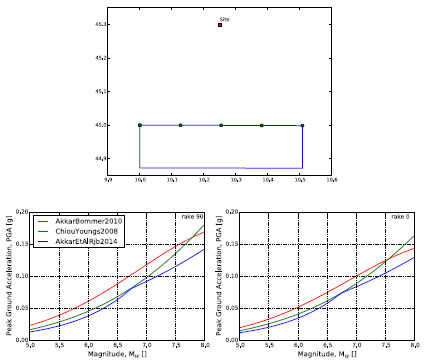

Ground Motion Prediction Equations
==================================

This chapter provides an overview of ground shaking intensity
modeling based on empirical equations and describes the way GSIMs —
more commonly known as ground motion models or Ground Motion
Prediction Equations(GMPEs) — are implemented in the OpenQuake engine.

Introduction
------------

Ground shaking intensity models are empirical equations that - given
a set of parameters - compute a value representative of the shaking
intensity together with an associated variability. GSIMs have a
fundamental importance in the overall PSHA architecture.

A ground shaking intensity equation can be schematised as follows (Al
Atik et al., 2010):

.. math::

 Y = f(X_{es},\theta)+\Delta

where :math:`Y` is the natural logarithm of a ground shaking intensity
measure, :math:`X_{es}` is the vector of explanatory (or independent)
variables, :math:`\theta` is the vector of model coefficients and 
:math:`\Delta` is a random variable describing the variability of the ground 
shaking intensity at the site.

The selection of independent variables and the definition of the
structure of the equation is usually done on the basis of physical
principles and basic descriptions of the earthquake process, the
latter intended as the combination of a rupture occurrence, the
synchronous radiation of seismic waves and their propagation to the
site.

Tectonic regionalisation
************************

The different properties of the ground-motion generated by
earthquakes of comparable size but occurring in dissimilar tectonic
regions (e.g. stable continental regions, subduction interface) are
well recognized in the scientific literature (Abrahamson and
Shedlock, 1997).

The OpenQuake engine computes hazard using Seismic Source Models(SSMs) which
may include sources belonging to different tectonic regions. Each
seismic source contains a label specifying the tectonic region to
which it belongs. The OpenQuake engine automatically selects from the Ground
Motion Model (GMM) the associated GSIM.

The assignment of each source to a specific tectonic region is
habitually completed using a zonation map called tectonic
regionalisation (see for example Delavaud et al.,
2012).

Main predictor variables
************************

In the current section we offer a brief overview of the most
important predictor variables supported by the OpenQuake engine (for general
a summary, see Akkar et al., 2013).

The main predictor variables are organized into three categories as
indicated in the table below variables describing the
rupture properties, variables describing the rupture-site path and
variables used to characterize the site conditions.

*Principal predictor variables supported by the OpenQuake engine and corresponding groups.*

+-----------------------+----------------------------------------------+
|    **Group**          |    **Variables**                             |
+=======================+==============================================+
|    Rupture parameters | -  Magnitude                                 |
|                       |                                              |
|                       | -  Dip                                       |
|                       |                                              |
|                       | -  :math:`Z_{tor}`                           |
|                       |                                              |
|                       | -  Rake                                      |
+-----------------------+----------------------------------------------+
|    Rupture-site       | - See Table 4.2                              |
|    distances          |                                              |
+-----------------------+----------------------------------------------+
|    Site parameters    | - :math:`V_{s,30}`                           |
|                       |                                              |
|                       | -  Depth to the 1 km/s interface interface   |
|                       |                                              |
|                       | -  Depth to the 2.5 km/s interface           |
+-----------------------+----------------------------------------------+

**Magnitude**

Moment magnitude (Hanks and Kanamori, 1979) is
the magnitude typology preponderantly used within the most recent
GSIMs and - as a consequence - within seismic hazard analysis in
general. The OpenQuake engine, however, does not assume a predefined
magnitude typology. It is up to the user to ensure that the magnitude
used to define earthquake occurrence in the seismic source model is
consistent with the one used in the selected ground shaking intensity
models.

**Dip**

This is a parameter normally obtained from the source since it must
be specified by default for the creation of almost all the source
typologies supported by the OpenQuake engine.

**Distance**

The OpenQuake engine supports almost all the rupture-site distance
metrics used by the most recent and complex ground shaking intensity
models published in the scientific literature (see the table below 
for a comprehensive list). The calculation of
distances within the hazard component of the OpenQuake engine is performed
by assuming a spherical Earth with a radius of 6371.0 km.

Since earthquakes are always modeled in the OpenQuake engine as finite
ruptures, all rupture-site metrics are always computed
instantaneously. For this reason, the engine does not contain
conversion equations between different metrics (see for example
Scherbaum et al., 2004)

**Rupture mechanism**

Many GSIMs compute ground-motion using a categorical variable
describing the rupture mecha- nisms (e.g. normal, strike-slip or
reverse).

In the OpenQuake engine the rupture mechanism is specified in terms of the
rake angle (defined according to Aki and Richards,
2002). Since the rake is not used directly as a
predictor variable, most of the GSIMs implemented in the OpenQuake engine
contain a mapping between the rake angle and the rupture mechanism
classes supported by each specific model (for a review see page 24 of
Akkar et al., 2013).

**Time averaged shear-wave velocity in the uppermost 30m
:math:`v_{s,30}`**

Local site conditions and their effects on the ground-motion are
routinely incorporated into ground shaking intensity models by means
of a scalar quantity corresponding to the time-

*Rupture-site distances supported by the OpenQuake engine.*

+-----------------------+----------------------+--------------------------------------+
|    **Distance         |                      |    **Description**                   |
|    definition**       |     **Symbol**       |                                      |
|                       |                      |                                      |
+=======================+======================+======================================+
|    Epicentral         |                      |    Distance between the epicenter    |
|                       |  :math:`R_{epi}`     |    and the site. Notethat currently  |
|                       |                      |    in the OpenQuake engine the       |
|                       |                      |    hypocenter is assumed to be at    |
|                       |                      |    the center of a rupture           |
+-----------------------+----------------------+--------------------------------------+
|    Hypocentral        |                      |    Distance between the hypocenter   |
|                       |   :math:`R_{hypo}`   |    and the site.                     |
|                       |                      |    Note that currently in the        |
|                       |                      |    OpenQuake engine the              |
|                       |                      |    hypocenter is assumed to          |
|                       |                      |    be at the center of a rupture.    |
+-----------------------+----------------------+--------------------------------------+
|    Joyner and Boore   |                      |    Closest distance between the site |
|    distance           |     :math:`R_{jb}`   |    and the surface                   |
|                       |                      |    projection of the rupture         |
+-----------------------+----------------------+--------------------------------------+
|    Closest distance   |                      |    Closest distance between the site |
|    to the rupture     |    :math:`R_{rup}`   |    and the rupture surface           |
+-----------------------+----------------------+--------------------------------------+
|    Horizontal         |                      |    Horizontal distance between the   |
|    top-edge distance  |    :math:`R_{x}`     |    site and the top                  |
|                       |                      |    edge of the rupture               |
+-----------------------+----------------------+--------------------------------------+
|    Top-of-Rupture     |                      |    Depth to the top edge of the      |
|    depth              |    :math:`Z_{tor}`   |    rupture                           |
|                       |                      |                                      |
+-----------------------+----------------------+--------------------------------------+

averaged shear wave velocity measured in the uppermost 30m of the
soil column (:math:`V_{s,30}`). Local site conditions in the
OpenQuake engine are specified by means of this parameter.

In case of ground shaking intensity models which support the
definition of local soil con- ditions through soil classes (e.g. hard
rock, soft soil) their implementation is done in a way that given a
value of :math:`V_{s,30}` the corresponding soil class is used to
compute the value of shaking intensity (provided that a mapping
between soil classes and :math:`V_{s,30}` is defined by the authors).

Additional parameters used to quantitatively describe local geology
are the depths to the 1 km/s and 2.5 km/s shear-wave velocity
interfaces. These are parameters used in some GSIMs (e.g. Chiou and
Youngs, 2008) to capture the influence of the deeper local geological 
structure.

**Depth to the top-of-rupture** (:math:`Z_{tor}`)

The depth to the top of rupture is a parameter introduced in some of
the NGA West 1 GSIMs such as the Chiou and Youngs
(2008) and the Abrahamson and Silva
(2008) in order to account for a supposed
dependence of the shaking intensity to the depth of the source, as
suggested by Somerville and Pitarka (2006).

Supported intensity measure types
*********************************

Each GSIM implemented in the OpenQuake engine provides a list of the
supported Intensity Measure Types(IMTs). The first table below 
contains a comprehensive list of possible alternatives. The
definitions of the ground-motion component supported are instead listed in 
the second table below.

*Principal intensity measure types supported.*

+--------------+-----------------------------------+-------------------+
|              |    **Description**                |    **Unit of      |
|  **Acronym** |                                   |    measure**      |
+==============+===================================+===================+
|    PGA       |    Peak Ground Acceleration       |    g              |
+--------------+-----------------------------------+-------------------+
|    PGV       |    Peak Ground Velocity           |    cm/s           |
+--------------+-----------------------------------+-------------------+
|    PGD       |    Peak Ground Displacement       |                   |
+--------------+-----------------------------------+-------------------+
|    SA        |    Spectral Acceleration          |    g              |
+--------------+-----------------------------------+-------------------+
|    IA        |    Arias intensity                |                   |
+--------------+-----------------------------------+-------------------+
|    CAV       |    Cumulative Absolute Velocity   |                   |
+--------------+-----------------------------------+-------------------+
|    RSD       |    Relative Significative         |                   |
|              |    Duration                       |                   |
|              |    (Trifunac and Brady,           |                   |
|              |    1975)                          |                   |
+--------------+-----------------------------------+-------------------+
|    MMI       |    Modified Mercalli Intensity    |                   |
+--------------+-----------------------------------+-------------------+

*Principal ground-motion components supported*

+----------------------------+-----------------------------------------+
|    **Component**           |    **Description**                      |
+============================+=========================================+
|    HORIZONTAL              |    General horizontal component (this   |
|                            |    definition                           |
|                            |    is usually adopted when a more       |
|                            |    precise definition                   |
|                            |    of component of motion               |
|                            |    modelled is                          |
|                            |    missing)                             |
+----------------------------+-----------------------------------------+
|    GEOMETRIC_MEAN          |    Geometric mean of spectra of x and y |
|                            |    compo-                               |
|                            |    nents                                |
|    GMRotI50                |    Median value of the (period          |
|                            |    independent) geo-                    |
|                            |    metric mean (Boore et al.,           |
|                            |    2006)                                |
+----------------------------+-----------------------------------------+
|    RotD50                  |    Median value of the (period          |
|                            |    dependent) geometric                 |
|                            |    mean (Boore, 2010)                   |
+----------------------------+-----------------------------------------+
|    RANDOM_HORIZONTAL       |    Random horizontal component          |
+----------------------------+-----------------------------------------+
|    VERTICAL                |    Vertical component of ground-motion  |
+----------------------------+-----------------------------------------+

Implementation and use of GMPEs in seismic hazard analysis
----------------------------------------------------------

The OpenQuake engine contains a large set of GSIMs developed for different
tectonic regions. Currently the engine includes GSIMs for shallow
earthquakes in active tectonic regions, earthquakes in stable
continental regions, subduction regions and geothermal areas.

GSIMs are implemented following a template model (in the Python
jargon a base class) which defines the basic behaviour and describes
the principles to be followed for their implementation. Each GSIM
contains a definition of the independent parameters used to describe
the rupture, the site conditions, the rupture-site distance metrics,
the intensity measure types supported, the type of standard deviation
provided, the tectonic region where the use of the GSIM is
recommended. The main advantage of this approach is that GSIMs, no
matter which are their specific properties or features, behave
following a common protocol. For example, this feature allowed the
creation on top of the GSIM library of a universal testing procedure,
which is applied to all the models implemented in the OpenQuake engine in
order to guarantee a uniform testing level (see
following section for additional information on this topic).

A second advantage of the developed library relates to its
flexibility and modularity. Once the properties of the main objects
are defined, GSIMs can be used interchangeably. For example, the
OpenQuake Ground Motion Toolkit (Weatherill,
2014) builds on top of this library and provides
tools for computing residuals given a dataset of recordings, or for
the calculation of trellis plots that compare the scaling of multiple
GMPEs side by side in terms of magnitude, distance, site-condition,
spectra etc.. Figure 4.1 shows the scaling of
ground-motion versus magnitude for some of the GSIMs implemented in
the OpenQuake engine. The ground motion is computed for a site at a :math:`R_{jb}`
distance of about 33 km with :math:`V_{s,30}` equal to 760 m/s from a
rupture with a strike of dip of 45 degrees toward south for two
different values of rake (i.e. rupture mechanism). The upper panel of
the figure below shows the position of the site and the
rupture. Note that the three GSIMs selected use different
rupture-site metrics.

   *(upper panel) Simple schematic with the surface
   projection of the rupture and the site (red square) used in this
   example. The green dots show the position of the top of rupture.
   (lower panels) Scaling of Peak Ground Acceleration as a function of
   magnitude obtained by some of the GSIM implemented in the OpenQuake engine.*

Testing
*******

The progressively increasing complexity of ground shaking intensity
models is giving more and more emphasis and relevance to the
validation of results provided by the GSIMs implemented
within PSHA codes and the results of original GSIM implementations as
described in the scientific literature (or directly provided by the
authors).

The standard process adopted for the implementation in the OpenQuake engine
of a ground shaking intensity model requires a set of verification
tables each one containing values of ground-motion (or standard
deviation) computed using a large number of combinations of the
predictor variables. The table below shows a simplified
example of a GSIM verification table; it consists of: a header line
with (standard) names for each column and a number of lines each one
containing values of the predictor variables plus the computed values
of ground-motion intensity or standard deviation. Examples of
verification tables are available in the `OpenQuake-hazardlib Github
repository <https://github.com/gem/oq-hazardlib/tree/master/openquake/hazardlib/tests/gsim/data>`__.

*Schematic of a GSIM verification table used in the OpenQuake engine.*

+-------------------+-------------------+-------------------+-------------------+-------------------+------+
|         M         |         R         |  :math:`V_{s,30}` |   :math:`IMT_1`   |   :math:`IMT_2`   |  ... |
+===================+===================+===================+===================+===================+======+
| :math:`val_{1,1}` | :math:`val_{1,2}` | :math:`val_{1,3}` | :math:`val_{1,4}` | :math:`val_{1,5}` |      |
+-------------------+-------------------+-------------------+-------------------+-------------------+------+
| :math:`val_{2,1}` | :math:`val_{2,2}` | :math:`val_{2,3}` | :math:`val_{2,4}` | :math:`val_{2,5}` |      |
+-------------------+-------------------+-------------------+-------------------+-------------------+------+
|        ...        |                   |                   |                   |                   |      |
+-------------------+-------------------+-------------------+-------------------+-------------------+------+

Using these tables and an automated verification procedure
implemented in the OpenQuake engine, it is possible to verify the
consistency between the original results and the corresponding values
computed with the version of the GSIM implemented. On average we
accept discrepancies between the original implementation and the
version included in the OpenQuake engine lower than five percent.

GEM recommends that contextually to the publication of GSIMs the
table of coefficients as well as of a set of verification tables (or
a software which allows the generation of these tables) are published
as an electronic supplement. This can certainly improve the
reproducibility of the models proposed and most of all would increase
the quality and robustness of the computed hazard.

Spatial correlation of ground motion
************************************

The current literature (Bazzurro and Luco, 2005; 
Crowley and Bommer, 2006; Park et al.,
2007) clearly explains the necessity for
considering spatially correlated ground motion fields in the
calculation of losses for a portfolio.

The OpenQuake engine supports the calculation of ground-motion fields
taking into account the spatial correlation of the within-event
residuals (Boore, 2003). The OpenQuake engine
supports correlation models developed according to a default scheme.
Currently the OpenQuake engine provides only one correlation model, the one
proposed by Jayaram and Baker (2009). The
calculation of spatially correlated ground motion fields is
summarized under event-based PSHA section.

Future developments
-------------------

The current implementation of GSIMs into the OpenQuake engine offers
advanced features but - accord- ing to experience and feedback
received from users - it partially lacks of flexibility and should
provide an easier process for the incorporation of new GSIMs. A
revision of the current scheme adopted for the implementation of new
GSIMs will be therefore necessary in order to address the suggestions
and feedback we received so far and add new features.

An incomplete list of the possible improvements that might be
introduced is the following one:

- **Better support for GSIMs defined via tables**

  This is a request we received from different experts. Technically it
  is already possible to create GSIM from tables (see for example the
  OpenQuake engine implementation of the Frankel et al.
  (1996) available on
  `github <https://github.com/gem/oq-hazardlib/blob/master/openquake/hazardlib/gsim/frankel_1996.py>`__
  but better support with an illustration of the process to be followed 
  will be necessary.

- **Support for host-to-target adjustment**

  Within site specific hazard analyses (see for example Bommer et al.,
  2014) as well as within regional hazard studies
  in areas with scarce strong-motion recordings it is common to adjust
  GMPEs in order to properly take into account regional variations of
  parameters controlling ground-motion properties such as stress drop,
  kappa and average shear wave velocity within the uppermost 30 meters.

  In future releases of the OpenQuake engine we plan to improve the
  support for these modifications while maintaining a high as possible
  the level and quality of testing.

- **Sigma adjustment, support for homoskedastic sigma**

  These methods are also commonly adopted within site-specific hazard
  analyses. These corrections are currently supported by the OpenQuake engine
  by subclassing a prototype GSIM implementation. A subclass is a copy
  of an original class; it inherits properties of the
  original class. Its behavior can be modified by adding new components
  or by overriding the existing ones. However, this requires
  programming experience. We therefore plan to offer easier procedures
  for using these methods with the GSIM implemented.

- **Spatial cross correlation**

  The OpenQuake engine already supports the calculation of ground motion
  fields generated by taking into account the spatial correlation of
  within event ground motion residuals. We plan to add the possibility
  of computing cross-correlated ground motion fields in order to better
  support analyses taking into account distributed infrastructures as
  well as heterogeneous portfolios of assets.

- **Near source directivity effects**

  Some of the recently published NGA West 2 GMPEs (i.e. Chiou and
  Youngs (2014)) offer the possibility of computing
  ground motion by taking into account near source directivity effects.
  We plan to implement this GMPE - as well as the other NGA West 2
  GMPEs - into the OpenQuake engine.