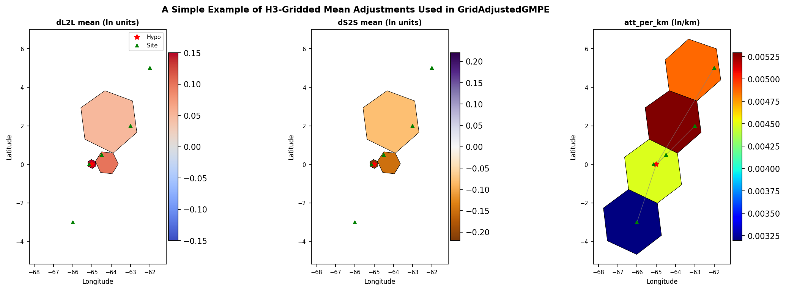

## Overview

Classical PSHA calculation for five sites using `GridAdjustedGMPE` with
`AkkarEtAlRjb2014` as the underlying GMM to be adjusted. Three h3-gridded
residual correction terms are applied (`dL2L`, `dS2S`, `att_per_km`) for
PGA and SA(0.5) to both the mean predicted ground-motion and the mapped
sigma component (can be total, tau or phi). SA(1.0) has no grid data and
therefore receives no adjustment intentionally. The visualisation of the
hdf5 clearly shows that the h3 grids can vary in density - this is
intentional, with the `GridAdjustedGMPE` supporting either constant or
varying density h3 grid cells.

The hdf5 containing the corrections used in this simple test case is called
`grid_adjustments.hdf5`.

If the user inspects the hdf5 file, you will notice that in the case of
`dL2L` and `att_per_km`, we have specified a scalar sigma adjustment for
each IMT (as an attribute in the associated groups), whereas for `dS2S`
we have specified a per-cell adjustment  (additional dataset in the group
itself). This option is to provide flexibility to the user. For path-based
adjustments, currently the use of a per-cell adjustment is not supported
(an error will be raised by `GridAdjustedGMPE`).

## A Visualisation of the Grid in the HDF5

The figure shows the 3 mean adjustments for PGA (note that because for
`dS2S` we have specified a per-cell reduction to phi that a similar grid
exists for this GMM sigma correction too in the hdf5):

| Panel | Content |
|---|---|
| left | `dL2L`-based mean ground-motion correction per h3 cell (hypocentre lookup) |
| centre | `dS2S`-based mean ground-motion correction per h3 cell (site lookup) |
| right | `att_per_km`-based mean ground-motion correction per travel path (raytracing) |

Red star = hypocentre; green triangles = sites in the site model.

## Additional Information

It's advisable to consult the `GridAdjustedGMPE` GSIM module to fully understand this feature
if you plan to use it (`oq-engine/openquake/hazardlib/gsim/mgmpe/grid_adjusted_gmpe.py`).

Also, please note that the correction values provided in this test are arbitrary.
