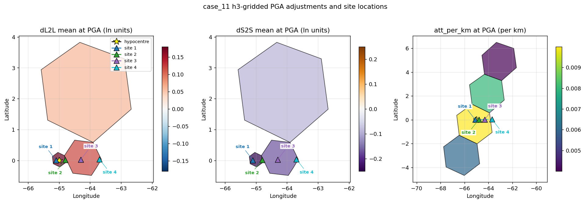
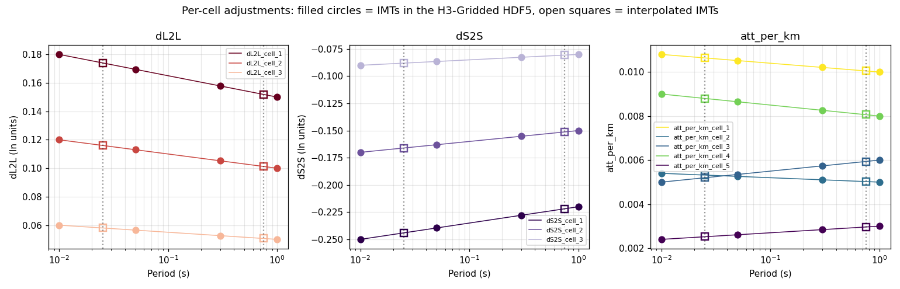
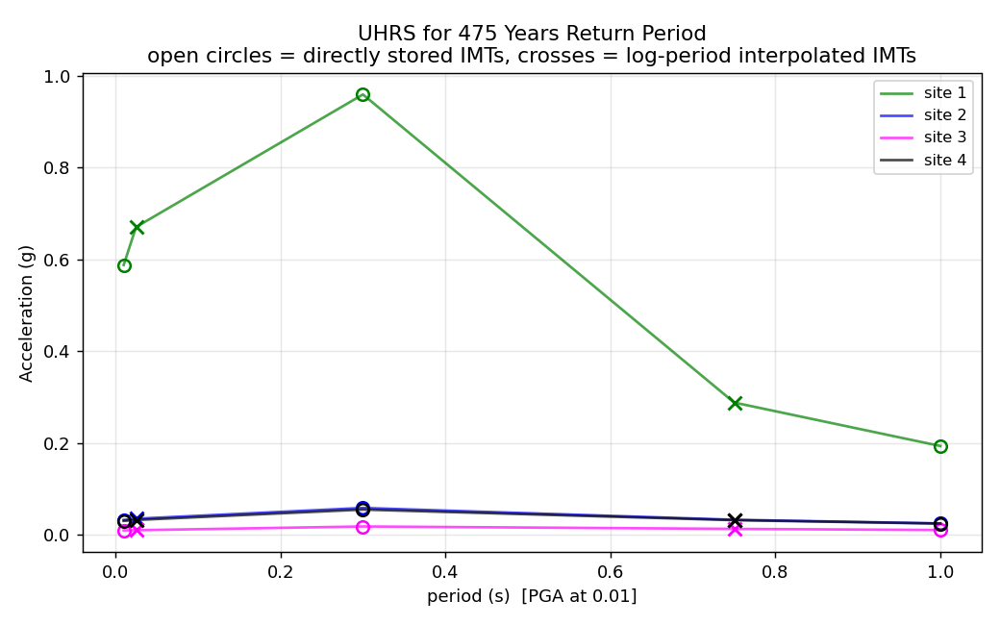

## Overview

Classical PSHA calculation that exercises `GridAdjustedGMPE` on top of
`AkkarEtAlRjb2014`. Three h3-gridded correction terms are applied to
both the mean and one sigma component of the base GMM:

| Term         | Location | Sigma adjustment | Sigma component | Sigma storage |
|--------------|----------|------------------|-----------------|---------------|
| `dL2L`       | hypo     | `sub`            | `tau`           | scalar (per-IMT attr) |
| `dS2S`       | site     | `sub`            | `phi`           | per-cell dataset |
| `att_per_km` | path     | `sub`            | `phi`           | scalar (per-IMT attr) |

## Test intent

The four sites and the mixed-resolution grids in `grid_adjustments.hdf5`
are chosen to cover the paths through the code that matter:

* **Site 1 (green)** falls inside the finest res-4 hypo/site cell:
  direct-lookup at full resolution.
* **Site 2 (blue)** falls only inside the res-3 cell: the finest -> coarsest
  spatial fallback drops one level.
* **Site 3 (magenta)** falls only inside the res-2 cell: the fallback
  drops two levels.
* **Site 4 (black)** falls outside every stored `dL2L`/`dS2S` cell:
  the correction is zero (same behaviour a real PSHA sees for a source
  or site outside the fitted-grid region).

Ray-tracing for `att_per_km` is exercised by a deliberately mixed-
resolution path grid (four res-4 cells plus one res-3):

* Site 1's ray sits entirely inside a single fine cell.
* Site 2's ray crosses two fine cells.
* Site 3's ray crosses two fine cells and then the coarser res-3 cell.
* Site 4's ray crosses two fine cells and then leaves the grid entirely
  for the last few km (zero contribution over that segment).
* One stored path cell is deliberately placed off every ray, testing
  that a cell present in the grid but not on any ray contributes zero.

## IMT coverage and log-period interpolation

The HDF5 stores adjustments at four IMTs (PGA, SA(0.05), SA(0.3),
SA(1.0)). The job asks for those two endpoint IMTs (PGA, SA(1.0)) plus
two additional IMTs (SA(0.025), SA(0.75)) that require log-period
interpolation of the per-cell `CoeffsTable` objects built at load time.
Extrapolation beyond the stored SA range raises `ValueError`.

## Sigma storage flexibility

`dL2L` and `att_per_km` store sigma as a scalar per-IMT attribute
(`{term}_sig`); `dS2S` stores sigma as a per-cell dataset of the same
name. Either form is accepted; per-cell sigma is not supported for
path terms.

## Grid visualisation

Yellow star = hypocentre; triangles = the four sites in the site
model, colour-coded (site 1 green, site 2 blue, site 3 magenta, site 4
black). Each hexagon is labelled with its term name and 1-based index
(same numbering as in the per-cell spectra plot below).

## Per-cell adjustment spectra

For each term, the mean adjustment per h3 cell is plotted against
period. Filled circles are the four stored IMTs; open squares mark the
two IMTs (SA(0.025), SA(0.75)) that the QA test evaluates by log-period
interpolation.

## Uniform hazard response spectra at the four sites

475-year return period UHRS at each site (annual PoE = 1/475). IMLs
come from log-log interpolation of the mean hazard curve at the target
PoE. Open circles are the directly stored IMTs (PGA, SA(0.3), SA(1.0));
crosses are the interpolated IMTs (SA(0.025), SA(0.75)). The spectrum
stays smooth across period despite two of the five IMTs being filled
in by log-period interpolation of the per-cell adjustments.

## Additional notes

The correction values in `grid_adjustments.hdf5` are arbitrary and are
generated from smooth log-period formulas so the interpolation results
are exactly predictable. See `grid_adjusted_gmpe.py` for the full
`GridAdjustedGMPE` documentation.
